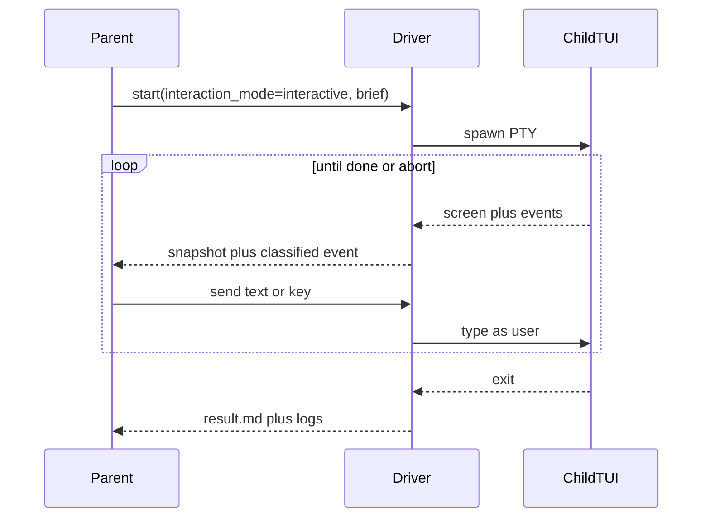

# Spec: Dual interaction modes for `/silver:agent-*`

## 1. Problem

The five host skills already mix TUI and headless execution, but **asymmetric fallbacks**, not a product mode:

- Claude / Codex: TUI-first via PTY harness ([`scripts/claude-interactive-invoke.expect`](scripts/claude-interactive-invoke.expect), [`scripts/codex-interactive-invoke.py`](scripts/codex-interactive-invoke.py)); `--use-print` / `--use-exec` only after stall or non-PTY.
- Cursor: CLI/`stream-json` one-shot ([`scripts/agent-cursor-delegate.sh`](scripts/agent-cursor-delegate.sh)); no sibling `invoke.sh` TUI driver.
- OpenCode: `opencode run` primary; `--use-interactive` is the exception.
- Pi: `pi -p --provider opencode-go --model mimo-v2.5` (already non-interactive); no documented TUI path.

Parents cannot **choose** live TUI vs one-shot, and they also cannot **omit** the choice: today’s defaults disagree per host. Interactive is mostly scripted expect, not a parent typing/reading the child TUI like a user. Non-interactive is not the lightest native argv (extra shells, expect, workers).

This spec makes **interaction mode a first-class input** of `/silver:agent-claude|codex|cursor|opencode|pi`, with **auto selection**, **escalation**, **session-continuity**, and **minimal launch overhead**. Live permission `--mode permissive|strict` stays orthogonal (see D2).

## 2. Goals and non-goals

**Goals**

- Every `/silver:agent-*` supports exactly two modes: `interactive` and `non-interactive`.
- **Default is auto:** classify the task unless the user (or caller) pins `--interaction-mode`.
- **Session continuity ⇒ interactive (auto only).** If keeping a live session with the external agent will improve the outcome, and the request is `auto`, interactive is **required** (classifier must not pick NI). Session stick is §4.1 (1) process-alive or (2) resume-token + continue/coach / in-wave Cursor — **not** any leftover conversation id (I-18). An explicit pin always wins (D1/D3).
- **Escalate NI → interactive** when auto-selected non-interactive does not achieve the desired result (one retry, same task, prior output as context).
- One CLI/env/skill contract across five hosts; host adapters only where the native binary differs.
- Interactive: the **launching (parent) agent** observes the child TUI (or host session) and sends keystrokes/text **as a user would**, including mid-flight follow-ups. Cursor `session` transport may use a new process per follow-up that reuses the host session id (§5.2 / §7).
- Non-interactive: parent submits one prompt/brief and receives a structured result when the child process exits. No mid-flight keystrokes.
- **Least overhead:** run the external binary the most direct, lightweight way that still satisfies the mode (native print/exec/run/`-p` for NI; one PTY to the native TUI for interactive). No extra tmux, expect, fifos, or orchestrator wrappers unless that mode requires them. Named reliability wrappers on NI are allowed (D7).
- Same PASS/FAIL evidence bar in both modes (existing §5b-style criteria in the five SKILL.md files).
- AF-AGENT-DELEGATE worker path remains available; mode is a field on the delegation directive. Child process launch must still be direct/native (worker seeds; it does not wrap the TUI in extra process layers).

**Non-goals**

- Not Sidekick persistence, not enterprise E2E matrix rows.
- Not parent implementing the delegated files in parallel.
- Not a new sixth host.
- Not replacing `silver-agent-worker` (child contract stays).
- Not requiring a human to sit in the TUI (optional attach only).
- Not unbounded NI↔interactive ping-pong (at most one auto-escalation).

## 3. Locked decisions

- **D1 — Default mode = `auto` (not a fixed NI or TUI default).** Resolver order: **explicit pin > process-alive or continue/coach (D3) > classifier > non-interactive.** If `--interaction-mode interactive|non-interactive` (or alias / legacy pin) is present on **this argv**, do not classify and do not auto-escalate. Bare invoke classifies. **Pin always wins over D3** (I-5): session-continuity applies only when the *requested* interaction mode is `auto`. Pinned NI + live session stays NI. **Session stick is not “any live session”** (I-18): leftover reusable conversation id after terminal `result.md` is a **resume-token only** (classify fresh), not a D3 force. D3 fires only for (1) OS child still running or (2) reusable id **plus** explicit continue/coach utterance or in-wave Cursor follow-up — the same three-way split as §4.1. `--attach` is **not** an explicit pin when requested mode is `auto` (I-20). Inherited concrete `SB_AGENT_INTERACTION_MODE` is not an argv pin (I-21).
- **D2 — Canonical interaction flag `--interaction-mode auto|interactive|non-interactive`.** Default `auto`. **Do not reuse `--mode`:** live `--mode` remains **permission** `permissive|strict` on every `invoke.sh` / `*-delegate.sh` and is passed through to `agent_invoke` (OpenCode `permissive` still adds `--auto`). Values `auto|interactive|non-interactive` on `--mode` are `mode-conflict` (hint: use `--interaction-mode`). Aliases: `--interactive`, `--non-interactive`. Legacy: `--use-print`/`--use-exec` → pinned non-interactive; `--use-interactive` → pinned interactive. Env: `SB_AGENT_INTERACTION_MODE`. CLI `--interaction-mode` always wins when present. Value `auto` is requested-auto (**not** a concrete pin). **Concrete `interactive|non-interactive` in the inherited environment is not a pin** (I-21): if this argv has **no** `--interaction-mode` (and no pin alias / legacy pin), preflight **fails** `mode-conflict` (`leftover-env-pin`) — do not classify under the leftover value, do not warn-and-continue. If this argv **does** pass `--interaction-mode` (or a pin alias / legacy pin), CLI wins and preflight **unsets** `SB_AGENT_INTERACTION_MODE` in this process so children do not inherit the leftover. Tests still `env -u` `SB_AGENT_INTERACTION_MODE`, `SB_AGENT_ALLOW_MODE_FALLBACK` (I-60), `SB_AGENT_MODE_ATTACH`, `SB_AGENT_NO_ESCALATE`, `SB_AGENT_AUTO_POLICY`, and `SB_AGENT_MAX_TURNS` (I-64). AF: `interaction_mode`. Conflicting pairs fail preflight — enumerated in §6.2.1. **`--delegation-mode` / `SB_AGENT_DELEGATION_MODE` is orthogonal** (I-11): it does not pin, classify, or override `--interaction-mode`. Interaction-mode sources resolve as CLI `--interaction-mode` > env `SB_AGENT_INTERACTION_MODE` > AF `interaction_mode` > classifier (D1). Delegation-mode is a separate launch/ownership axis and may be set independently. `--control-dir` on **resolved NI** remains `mode-conflict` except audited I-61/I-66 hops (I-17).
- **D3 — Session continuity requires interactive (auto only).** D3 **live session** means §4.1 (1) or (2) only — **not** (3). Signals (D3 only): (1) OS child still running; (2) reusable conversation id **and** (explicit continue/coach utterance **or** in-wave Cursor follow-up). **Not D3 signals** (classifier heuristics in §4.1 only; I-37): multi-checkpoint coaching, likely clarifiers/pickers, “continue this work” as brief flavor, or “fresh one-shot would lose context” without (1) or (2). An **already-open** tool/context/thread counts only as the (1)/(2) liveness facts themselves. A leftover reusable id after terminal `result.md` with no continue utterance is **not** a D3 signal (resume-token only; classify fresh). Classifier **must** return `interactive` when (1) or (2) fires. Starting NI and hoping to “attach later” is forbidden (D4 escalation is the only legitimate follow-on after **D4-eligible** auto-NI; the I-66 TUI-miss hop is terminal NI, I-67). **Not a D3 signal:** a normal first-wave implement+test / test-fix brief with no process-alive session and no continue/coach utterance — that stays NI (D7 cheaper path); D4 covers a real product miss.
- **D4 — Auto NI miss ⇒ one interactive retry.** **D4-eligible** (single predicate; I-67) ⇔ `mode.json` `requested=auto` ∧ `classified=non-interactive` ∧ `resolved=non-interactive` ∧ `tui-unavailable` ∉ `reason[]`. That is **classifier-selected NI only** — not an explicit NI pin, and **not** the I-66 auto classified-interactive TUI-miss hop (`requested=auto` ∧ `classified=interactive` ∧ `resolved=non-interactive` ∧ `tui-unavailable` ∈ `reason[]`). The I-66 hop already probed TUI and landed on NI; it is **terminal NI**. A later product FAIL must not arm D4 or re-probe the TUI that just failed. Trigger (D4-eligible only): harness ok but product FAIL, or child `blocked`, or parent-scored **incomplete** vs brief acceptance (partial FILES, empty STATUS, crash, missing `result.md`). Incomplete is **not** a `result.md` STATUS — normalize to STATUS `fail` + `reason[]` `incomplete` (and `result-missing` if the file was absent) before D4 (I-44). Next attempt is interactive, same `task-id`, brief plus `escalation.md` / log tail. D4 retry **starts a new wave** (reset `wave_started_at` and turn count) so a near-exhausted NI wall cannot stillborn the interactive retry (I-33; supersedes I-29). If interactive TUI/session is `mode-unavailable`, stop and report the NI failure (no fake TUI) (`escalate-unavailable`). Explicit `--interaction-mode non-interactive` never auto-escalates. Interactive never silently falls back to NI when interactive is pinned or D4-mandatory (D6). D4 retry re-enters the resolver `tui` gate (I-45).
- **D5 — Interactive = parent-as-user on a PTY or host multi-turn session, not “tail the log.”** Monitor-only is not interactive mode. Cursor session-id follow-up (new process, same conversation id) **is** interactive (§7).
- **D6 — No silent interactive → NI downgrade when interactive is required.** Fail-closed `mode-unavailable` **only** when interactive is **pinned** (not D4) and PTY/session is unavailable — unless `--allow-mode-fallback` / `SB_AGENT_ALLOW_MODE_FALLBACK=1` is set (audited; pin-only, I-57). **Auto classifier-heuristic interactive** (no D3 (1)/(2) live session) + TUI/session unavailable: do **not** fail-closed — launch NI with `reason=tui-unavailable` (Pi/Cursor). **D3-forced (1)/(2) is not this path.** Pinned or classified NI must not spawn a TUI. `--allow-mode-fallback` / `SB_AGENT_ALLOW_MODE_FALLBACK=1` is **pin-only** (I-57); D4 TUI miss stays `escalate-unavailable` / original NI FAIL (I-25). **D3 live-session (resolver step before classifier) is mandatory interactive:** TUI/session-id miss → `mode-unavailable`, not silent NI (I-32). Classifier-picked interactive without a live session may still NI `tui-unavailable`.

- **D7 — Least overhead / most direct launch.**
  - NI: exec the host’s native one-shot (`claude --print`, `codex exec`, `cursor-agent` print, `opencode run`, `pi -p --provider opencode-go --model mimo-v2.5`) with the brief as argv/stdin. **No** expect, **no** PTY, **no** `control/` fifos, **no** snapshot loop, **no** event stream, **no** extra interaction wrapper. Provider+model on Pi are part of that native one-shot, not a wrapper (I-46).
  - **Allowed NI reliability wrappers** (not interaction wrappers): preflight, quota-retry loop, tail-idle (python idle watcher on the log), secret scan, log header, optional read-only `monitor.sh`. Live path is `invoke.sh` → preflight → quota loop → tail-idle around native exec — that is still D7-compliant.
  - Interactive: **one** PTY (or one persistent CLI session id) to the native TUI/session. Control fifo exists only in this mode. Do not start tmux, Desktop `.app`, or double-wrap (expect *and* Python) unless that host already has a single proven driver.
  - Do not boot full MCP / parent orchestrator in the child (`SB_ORCHESTRATOR_WORKER=1` lightweight). Clear matrix env.
  - Prefer attaching an **existing** session over spawning a second agent when D3 applies (Cursor: reuse session id even if the follow-up is a new process).
  - Classifier prefers NI when signals do not require a session (NI is cheaper).
- **D8 — Optional human attach** (`--attach` / `SB_AGENT_MODE_ATTACH=1`): applies only when **resolved** mode is interactive; same PTY; parent still owns PASS/FAIL. **Not a mode pin** (I-20): `--interaction-mode auto` (or omitted) + `--attach` still classifies. If classified interactive, attach is valid. If classified NI, fail `mode-conflict` (`attach-on-ni`) — do not skip the classifier, do not silently ignore attach. `--attach` implies interactive **only** when requested mode is already `interactive` (or a pin alias), never when requested mode is `auto`. After an I-56 fallback hop to resolved NI, `--attach` is dropped and audited (`fallback_drop:attach`) — do not fail `attach-on-ni` on that hop (the request was pinned interactive) and do not silently keep attach (I-61). The same audited hop/drop applies when requested-auto (or omitted) classifies interactive and mermaid `tui -->|no and auto and not D4| ni` hops to resolved NI (`reason=tui-unavailable`): drop `--attach` / `SB_AGENT_MODE_ATTACH`, `--control-dir`, `--max-turns`, and `--auto-policy` (and env equivalents) with `fallback_drop:<flag>` for each — do not fail `attach-on-ni` / `control-dir-on-ni` (those remain **classified-NI** only; this hop is availability after a valid interactive classify), do not silently keep the flags, and do not create `control/` (I-66). `--attach` remains not a pin: TUI-miss still launches NI (D6), it does not fail-closed.
- **D9 — Shared control protocol** in [`scripts/lib/agent-delegate-common.sh`](scripts/lib/agent-delegate-common.sh) + new [`scripts/lib/agent-mode.sh`](scripts/lib/agent-mode.sh): `resolve_mode`, `classify_task`, `start`, `send`, `key`, `snapshot`, `status`, `wait_event`, `abort`. Per-host scripts implement the native ctl ops `start`/`send`/`key`/`snapshot`/`status`/`abort` (`stop` is an alias of `abort`; I-40). Library-only: `resolve_mode`, `classify_task`, `wait_event`. `events.jsonl` + `control/` + `ctl.sh` are **interactive-only**. Both modes write a tiny `mode.json` sidecar for `mode_resolved` (no NI event stream / fifo).

## 4. Mode resolver

```mermaid
flowchart TD
  invoke[Invoke agent-host]
  pin{Explicit --interaction-mode?}
  live{OS child still running?}
  tok{Reusable id plus continue/coach or in-wave Cursor?}
  clf[Classifier on brief plus task signals]
  ni[Launch NI native one-shot]
  ix[Launch interactive PTY or session]
  tui{TUI or session available?}
  pass{Acceptance met?}
  esc{D4-eligible NI and not --no-escalate?}
  retry[One interactive retry with prior result]
  done[Record PASS or FAIL]
  invoke --> pin
  pin -->|interactive| tui
  pin -->|non-interactive| ni
  pin -->|auto or omitted| live
  live -->|yes 1 process-alive| tui
  live -->|no| tok
  tok -->|yes 2 D3| tui
  tok -->|no 3 resume-token only or absent| clf
  clf -->|interactive| tui
  clf -->|non-interactive| ni
  tui -->|yes| ix
  tui -->|no and D3 live-session| done
  tui -->|no and auto and not D4 and not D3| ni
  tui -->|no and pin and fallback| ni
  tui -->|no and (pin or D4) and not fallback| done
  ni --> pass
  ix --> pass
  pass -->|yes| done
  pass -->|no and D4-eligible| esc
  esc -->|yes| retry
  esc -->|no| done
  retry --> tui
  pass -->|no and not D4-eligible| done
```
**D3 live-session TUI/session-id miss → `mode-unavailable`** (diagram `tui -->|no and D3 live-session| done`), not the auto→NI edge (I-32). Identity-matched live child **outranks** TTL (I-32/I-41).
Auto + TUI unavailable (classifier/auto, **not** D4, **not** D3 live-session) falls through to NI (`reason=tui-unavailable`). Pinned interactive + TUI unavailable + `--allow-mode-fallback` / `SB_AGENT_ALLOW_MODE_FALLBACK=1` follows the diagram `pin and fallback` edge to NI (audited `mode_fallback`; I-56/I-57/I-59) — D4 never takes that edge (I-25). On **either** hop to NI (auto `tui-unavailable`, or pinned I-56 `pin and fallback`), drop `--attach` / `--control-dir` / `--max-turns` / `--auto-policy` (and env equivalents); write `fallback_drop:<flag>` into `mode.json` `reason[]` for each dropped flag; do not create `control/` (I-61, I-66). Auto + `--attach` / `--control-dir` (or `SB_AGENT_MODE_ATTACH`) that classified interactive then missed TUI uses this same drop — not `attach-on-ni` / `control-dir-on-ni` (classified-NI only) and not silent retain (I-66). `--attach --allow-mode-fallback` is valid preflight: attach applies if TUI exists. Pinned interactive or D4-mandatory interactive + TUI unavailable **without** fallback records `mode-unavailable` / `escalate-unavailable` (D6). D4 retry re-enters the `tui` gate (not `pass`); `reason=tui-unavailable` is the auto-classifier path only, never D4 (I-45). **D4-eligible** is the D4 predicate (classifier-selected NI; I-67), not merely `requested=auto` ∧ `resolved=non-interactive`. The I-66 hop (`classified=interactive` + `tui-unavailable`) is **terminal NI**: a later product FAIL must not take the mermaid `esc` edge or re-enter `tui` (I-67). `esc -->|no| done` is the `--no-escalate` path (not a dead-end; I-42).

Session stick is the §4.1 three-way split, **not** “any live `session.json`”. (1) process-alive and (2) resume-token + continue/coach or in-wave Cursor → interactive; (3) resume-token only after terminal result → classifier (fresh).

### 4.1 Classifier (auto)
Input: brief text, optional user utterance, `task-id`, `.planning/agent-<host>/<task-id>/session.json` if present, `.planning/agent-<host>/<task-id>/mode.json` if present, `.planning/agent-<host>/<task-id>/result.md` (terminal STATUS) if present, `.planning/agent-<host>/<task-id>/escalation.md` presence. Classifier **consumes** from `mode.json`: `requested`, `classified`, `resolved`, `reason[]` (I-38). Classifier does **not** read `events.jsonl` (interactive-only; I-49). In-flight escalate is **not** inferable from `mode.json` `{requested, classified, resolved}` alone — the pending-escalate predicate also uses `reason[]` plus `result.md` / `escalation.md`, and **requires** `classified=non-interactive` with `tui-unavailable` ∉ `reason[]` (I-67). The I-66 hop is terminal NI, not pending escalate.

**Force interactive (any one is enough)** — only when requested mode is `auto`:
- Session liveness is **split** (I-18): (1) **OS child still running** → D3 interactive; (2) **reusable conversation id** + explicit continue/coach utterance **or** in-wave Cursor follow-up → interactive; (3) reusable id + **terminal** `result.md` and no continue utterance → **resume-token only**, do **not** D3 (classify fresh). TTL (default **24h** from `updated_at`) applies to (1)(2). An identity-matched live child **outranks** TTL — do not classify fresh while that child still matches; TTL expiry with a dead or reused pid classifies fresh (I-32). Stale/expired `session.json` does not force interactive. `session.json` stores `{status, conversation_id, pid?, pid_started_at?, updated_at, turns?, wave_started_at?}` where `status` is enumerated `live` | `dead` (I-52); `turns` and `wave_started_at` are **interactive-only** (omit on NI resume-token records; I-58). Write `status=live` at every interactive start, including Cursor session-transport follow-ups (new process). `live` means the **wave is open**, not that a pid is alive (pid/identity remains the (1) check). Cursor process exit does **not** set `status=dead` unless the wave is terminal. **In-wave (disk, D3 (2) Cursor):** `conversation_id` is set ∧ `status=live` — no continue utterance required (I-50). Terminal `result.md` counts for case (3) **only if** it is newer than `wave_started_at` (or `wave_started_at` is absent). “OS child still running” means `pid` is set, `kill -0` succeeds, **and** `pid_started_at` matches the OS process start time (not a recycled pid) (I-30/I-37, I-41). If `pid` is alive but the driver/`control/` is gone (orphaned child): treat the record as stale — abort/reset it, then classify fresh; **never** spawn a second child alongside the orphan. PASS/terminal reset **must** set `status=dead` (keep `conversation_id` as the D3 (2) resume-token). Delete `session.json` only when there is no reusable `conversation_id` (fork-safe: never destroy a resume-token to reset liveness). NI: omit the file when the one-shot returns no conversation id (not an empty file); if NI returns an id, write `{status:dead, conversation_id, updated_at}` as a resume-token only — not `live`; omit `turns` / `wave_started_at` (partial record is schema-valid; I-52/I-58).
- Multi-step supervision is inherent: checkpoints, coaching, likely permission pickers, ambiguous requirements that will need Q&A.
- **In-flight escalate only:** a §4.2 retry for this `task-id` is pending (failed auto-NI about to escalate). This is **not** “any prior wave for this task-id.” Disk predicate: pending escalate ⇔ prior `mode.json` `requested=auto` ∧ `classified=non-interactive` ∧ `resolved=non-interactive` ∧ `tui-unavailable` ∉ `reason[]` ∧ `result.md` STATUS `fail|blocked` ∧ `escalation.md` present ∧ `escalate-unavailable` ∉ `reason[]` ∧ `escalated` ∉ `reason[]`. The I-66 hop (`classified=interactive` ∧ `tui-unavailable` ∈ `reason[]`) is **not** pending escalate — it is terminal NI (I-67). Do **not** consult `events.jsonl` (I-49). `escalate-unavailable` in `reason[]` is the durable terminal marker when the retry cannot start (I-48); `escalated` in `reason[]` is written when the retry actually starts. Either token clears pending so a later auto invoke does not re-arm D4. Parent-scored incomplete and missing `result.md` are normalized to STATUS `fail` (I-44) **before** this predicate — do not invent a fourth STATUS; synthesize `result.md` `fail` + `result-missing` when the file is absent so the predicate can fire.

**Prior-wave stick (I-4 / I-13)**

- A completed wave (**PASS**, or terminal `result.md` STATUS `pass|fail|blocked` with no pending escalate) **resets** the task-id on disk: set `session.json` `status=dead` (keep `conversation_id` as resume-token; do not delete the file when an id exists); the next invoke classifies fresh (I-50).
- TTL expiry also resets.
- `--no-escalate` disables D4 **and** disables this in-flight-escalate force-interactive (tests/CI). It does **not** ignore a currently **process-alive** in-TTL session (D3 (1)) or continue/coach on a reusable id (D3 (2)). A leftover resume-token after terminal result (D3 (3)) is already not D3. To ignore a process-alive session, pin `--interaction-mode non-interactive`.

**Prefer non-interactive (all of)**

- Single bounded deliverable; acceptance is checkable from git/tests without mid-flight dialogue. **First-wave implement+test / test-fix is NI** unless a process-alive session or explicit continue/coach signal exists.
- No process-alive in-TTL session; no continue/coach; leftover resume-token after terminal result is not D3.
- Unlikely to hit interactive-only UI (no “use the TUI to approve”).
- Parent does not need to steer after submit.

**Tie-break:** NI (cheaper), unless D3 session rule fired.

Record the decision in `mode.json`: `{requested, classified, resolved, reason[], turns?, wave_started_at?}` (both modes; `classified` is `null` when pinned; `turns` / `wave_started_at` required on interactive records, omitted on NI — I-34/I-58). `reason[]` is a closed code list, not free prose (I-36): `tui-unavailable` | `mode_fallback:interactive→non-interactive:<cause>:<via>` | `fallback_drop:<flag>` (`attach`|`control-dir`|`max-turns`|`auto-policy`) | `incomplete` | `result-missing` | `escalate-unavailable` | `escalated` | `d3-process-alive` | `d3-continue` | `d3-in-wave-cursor` | `classifier-interactive` | `classifier-ni` | `pin`. Classifier **reads** `requested`, `classified`, `resolved`, and `reason[]` from this file (I-38). When pinned-interactive `--allow-mode-fallback` / `SB_AGENT_ALLOW_MODE_FALLBACK=1` hops to NI, append `reason[]` token `mode_fallback:interactive→non-interactive:<cause>:<via>` (`<cause>` e.g. `tui-unavailable`; `<via>` is `allow-mode-fallback` or `SB_AGENT_ALLOW_MODE_FALLBACK`) — this is the `mode_fallback` {from,to,reason,flag} audit sink (NI has **no** `events.jsonl`; I-56). When auto classified-interactive hops to NI `tui-unavailable` with `--attach` / `--control-dir` / `--max-turns` / `--auto-policy` (or env equivalents) present, also append `fallback_drop:<flag>` for each dropped flag (I-66; same tokens as I-61). Interactive also appends `mode_resolved` to `events.jsonl` (I-27).

### 4.2 Escalation (auto NI → interactive)

After NI exit, parent scores acceptance as today. `result.md` STATUS is `pass|fail|blocked` only — there is no `incomplete` STATUS. Parent-scored **incomplete** (partial FILES, empty STATUS block, crash, or missing `result.md`) maps to STATUS `fail` plus `reason[]` `incomplete` (and `result-missing` when the file was absent); write/overwrite `result.md` so the §4.1 disk predicate can see it, then D4 (I-44). If FAIL/`blocked` (including that normalized `fail`) and the just-finished wave is **D4-eligible** (I-67; classifier-selected NI, not an I-66 TUI-miss hop):

1. Write `escalation.md`: why NI missed, log tail, remaining criteria.
2. Resolve mode = interactive because D4 escalate is in-flight (not because D3 session-continuity flipped) **unless** `--no-escalate` (I-31c).
3. Start interactive **once** with brief + `escalation.md` (includes log tail, remaining criteria, and `NEXT_RETRY_PROMPT` from `result.md` **when present** — omit the field if `result.md` is missing after a hard crash; I-42). Do not spawn a second NI. Do not use a separate `prior_result.md` name (I-28). When the retry **starts**, do **not** overwrite NI `{requested, classified, resolved}`; append `escalated` to the NI `mode.json` `reason[]` only (durable; classifier-visible). The retry's `mode_resolved` is recorded on that retry's `events.jsonl` (I-38, I-48/I-49).
4. If interactive is `mode-unavailable`, keep original NI FAIL; append `escalate-unavailable` to NI `mode.json` `reason[]`; **do not loop** and do not start a later D4 on this task-id while that token remains (I-48).
5. `SB_AGENT_NO_ESCALATE=1` or `--no-escalate` disables this **and** prior-wave / in-flight-escalate force-interactive (I-13).

The I-66 hop (`classified=interactive` + `tui-unavailable`) is **not** this list: keep the NI FAIL; do not write D4 `escalation.md`; do not start interactive; do not set pending-escalate (I-67).

Pinned `--interaction-mode non-interactive` on miss: return FAIL; parent may explicitly re-invoke interactive.

## 5. Mode definitions

### 5.1 Non-interactive (prompt → result)

**Intent:** Live interaction is unnecessary. One brief, one child run, structured artifacts. **Cheapest correct path.**

**Parent does**

1. Write brief (existing template: Task, Acceptance, Constraints, Evidence).
2. Mode is auto or pinned NI.
3. `exec` native one-shot (D7), including allowed reliability wrappers (preflight / quota-retry / tail-idle). Block on exit (optional read-only `monitor.sh` on the log file — no second PTY). NI ignores `--max-wall-sec` (wall is wave-scoped for interactive; NI is block-on-exit). `--idle-sec` on NI feeds the D7 tail-idle watcher (same numeric value as interactive idle) (I-51).
4. Score PASS from exit code + log floor + evidence + commit policy.
5. Must not send follow-up keystrokes in this process.
6. If auto and miss → §4.2. If pin and miss → FAIL.

**Child transport (host native one-shot, no PTY)**

- Claude: `claude --print` (existing `--use-print` path).
- Codex: `codex exec` (existing `--use-exec` path).
- Cursor: `cursor-agent` print/stream-json (current default).
- OpenCode: `opencode run` (current default).
- Pi: `pi -p --provider opencode-go --model mimo-v2.5` (current default).

**Outputs (all hosts)**

- `.planning/agent-<host>/<task-id>/brief.md`
- `run.log` (raw)
- `result.md` (STATUS block per [`skills/silver-agent-worker/SKILL.md`](skills/silver-agent-worker/SKILL.md): `pass|fail|blocked` only — parent-scored incomplete is written as `fail` + `reason[]` `incomplete`; missing file is synthesized `fail` + `result-missing` (I-44). Fields: TASK, FILES, TESTS, COMMIT, BLOCKERS, NEXT_RETRY_PROMPT)
- `mode.json` (`{requested, classified, resolved, reason[], turns?, wave_started_at?}` — the only `mode_resolved` record in NI; **no** `events.jsonl`, **no** fifo; same core schema as the interactive `mode_resolved` event; omit `turns`/`wave_started_at` on NI — I-34/I-58). When the I-56 fallback hop occurred, `reason[]` MUST contain `mode_fallback:interactive→non-interactive:<cause>:<via>`.
- git delta / SHA when the brief requires code
- `session.json` only if the host one-shot returns a reusable conversation id — omit the file when there is none (not an empty file). If written from NI, `status=dead` (resume-token only; not an in-wave `live` session); omit `turns` / `wave_started_at` (partial record is schema-valid; I-52/I-58)

### 5.2 Interactive (parent drives TUI like a user)

**Intent:** A live session will improve the outcome, or the user pinned interactive, or auto NI already missed.

**Mental model:** Parent is a user at the child’s terminal: read the screen, type, wait, type again, until the task is done or escalated.



**Parent interaction loop (normative)**

1. `start` — one PTY/session to the native TUI. Reuse `session.json` when D3 applies. Brief is typed like a user (not a second `--print` bolted onto a TUI).
2. On `ready` — submit brief (paste + Enter), matching existing E2E-081 submit-order (wake banner, then route, do not starve `/silver:*` / `$silver:*`).
3. On `assistant` / `tool_use` / `idle_working` — wait; optional heartbeat.
4. On `question` / `clarify` / `picker` — parent chooses from brief + policy; send keys (`Enter`, arrows, `y`/`n`, text).
5. On `stuck` / `zero_tokens` — parent may Enter-wake, re-paste a narrower instruction, or abort. One automatic wake is allowed; then parent decides (I-26).
6. On `auth` / `quota` — same escalation ladder as today; parent does not paste secrets.
7. On `done` — harvest STATUS / `result.md`; parent still verifies acceptance (child must not tell the user “done”).
8. Parent may inject **coaching turns** (“tests failed, fix X”) until timeout or `--max-turns`.
   - **`tui` hosts (Claude / Codex / OpenCode / Pi-if-TUI):** coaching stays in the **same process / PTY** — no new-process coaching.
   - **Cursor `session` transport (I-6):** a follow-up **is a new process** that reuses the host session / conversation id. That is the Cursor interactive equivalent, not a D5/D7 violation, and not `mode-unavailable`.

**Hard limits**

- `--max-turns` default 8 (brief submit counts as 1). Persist `{turns, wave_started_at}` on interactive `session.json` / `mode.json` (omit both on NI resume-token `session.json`; I-58) so Cursor new-process follow-ups share one wave counter (I-24).
- `--max-wall-sec` host defaults (Claude/Codex 900, Cursor 1800, OpenCode/Pi 900), **wave-scoped** not per-process.
- `--idle-sec` before `stuck` event (reuse existing quiet/idle env).
- No credential paste. Brief secret scan unchanged.

## 6. Shared API

### 6.1 Skill / slash

```
/silver:agent-<host> <brief> [--interaction-mode auto|interactive|non-interactive]
  [--mode permissive|strict]
  [--work-dir <path>] [--log <path>] [--attach]
  [--max-turns N] [--max-wall-sec N] [--idle-sec N] [--allow-mode-fallback] [--no-escalate]
```

Update `argument-hint` on all five SKILL.md files. `--mode` = permission only.

**When auto picks which**

- Interactive: session would improve output (D3), or likely Q&A/pickers/coaching.
- Non-interactive: bounded implement-and-report (including first-wave implement+test), no need to keep the child brain.
- User pin always wins (including over D3).

### 6.2 CLI (every `invoke.sh` + `*-delegate.sh`)

```
--interaction-mode auto|interactive|non-interactive   # default auto; NOT --mode
--mode permissive|strict                              # permission only (existing); orthogonal
--delegation-mode <host-value>                        # existing launch/ownership axis; **orthogonal** to `--interaction-mode` (I-11); does not pin or override D1
--interactive | --non-interactive                     # interaction pin aliases
--attach                                              # human attach if resolved interactive; NOT an auto pin (I-20)
--max-turns N                                         # interactive only; env `SB_AGENT_MAX_TURNS` (CLI wins when present) (I-55)
--max-wall-sec N                                      # wave-scoped wall (interactive); ignored on NI (I-51); host defaults in §5.2 (Claude/Codex 900, Cursor 1800, OpenCode/Pi 900)
--idle-sec N                                          # interactive: quiet/idle before `stuck`; NI: feeds D7 tail-idle (I-51); reuses existing quiet/idle env (override)
--allow-mode-fallback                                 # **pinned interactive only** → NI if TUI missing; one hop; audit `mode_fallback` {from,to,reason,flag} as `mode.json` `reason[]` token `mode_fallback:interactive→non-interactive:<cause>:<via>` (NI: this is the only sink; no `events.jsonl`) (I-56). **Not valid on D4** (would be a second NI) (I-25). On that hop, drop `--attach` / `--control-dir` / `--max-turns` / `--auto-policy` and record `fallback_drop:<flag>` in `reason[]` (I-61). Auto classified-interactive TUI-miss uses the same drop set without this flag (I-66).
--auto-policy parent|brief_only|supervised            # interactive only; default supervised
--no-escalate                                         # disable auto NI→interactive retry AND prior-wave force-interactive
--control-dir <path>                                  # interactive only; default .planning/agent-<host>/<task-id>/control
```

Env (CLI `--interaction-mode` wins when present; leftover concrete env is **not** a pin — I-21): `SB_AGENT_INTERACTION_MODE`, `SB_AGENT_MODE_ATTACH=1`, `SB_AGENT_NO_ESCALATE=1`, `SB_AGENT_ALLOW_MODE_FALLBACK=1`, `SB_AGENT_AUTO_POLICY=parent|brief_only|supervised`, `SB_AGENT_MAX_WALL_SEC`, `SB_AGENT_IDLE_SEC`, `SB_AGENT_MAX_TURNS` (interactive default; ignored on NI; `--max-turns` wins when present) (I-55). `SB_AGENT_ALLOW_MODE_FALLBACK=1` is valid **only** with pinned interactive (same as `--allow-mode-fallback`); with requested `auto` or pinned NI, fail `mode-conflict` `fallback-not-pinned` — do not ignore (I-57). On a **valid pinned-interactive** invoke, preflight **consumes and unsets** `SB_AGENT_ALLOW_MODE_FALLBACK` in this process (children do not inherit) (I-60). After this invoke's flags are resolved, preflight also **consumes and unsets** `SB_AGENT_MODE_ATTACH`, `SB_AGENT_NO_ESCALATE`, `SB_AGENT_AUTO_POLICY`, and `SB_AGENT_MAX_TURNS` in this process so children do not inherit (I-64). Concrete inherited `SB_AGENT_INTERACTION_MODE=interactive|non-interactive` without an argv `--interaction-mode` / alias / legacy pin fails preflight `mode-conflict` (`leftover-env-pin`); with an argv pin, CLI wins and preflight unsets the env in this process. `SB_AGENT_INTERACTION_MODE=auto` is requested-auto. Seed AF-AGENT-DELEGATE JSON with `interaction_mode`, `max_turns`, `max_wall_sec`, `idle_sec`, `attach`, `no_escalate`, `allow_mode_fallback`, `control_dir`, `auto_policy` and write `mode.json` after classify.

### 6.2.1 Conflicting flag pairs (fail preflight `mode-conflict`)

Orthogonal and **valid:** `--mode permissive|strict` + `--interaction-mode auto|interactive|non-interactive`.

**Invalid pairs** (any one fails closed):

| Pair | Why |
|------|-----|
| `--mode auto` / `--mode interactive` / `--mode non-interactive` | Permission `--mode` smashed; use `--interaction-mode` |
| `--interaction-mode auto` + `--use-print` / `--use-exec` / `--use-interactive` / `--interactive` / `--non-interactive` | Legacy/alias is a pin; conflicts with `auto` |
| `--interaction-mode interactive` + `--use-print` / `--use-exec` / `--non-interactive` | Pin vs opposite pin |
| `--interaction-mode non-interactive` + `--use-interactive` / `--interactive` | Pin vs opposite pin |
| `--interaction-mode non-interactive` + `--attach` / `--control-dir` / `--max-turns` / `--auto-policy` / `--allow-mode-fallback` | Interactive-only flags on NI |
| `--interaction-mode auto` (or omitted) + `--attach` / `--control-dir` | **Not a pin** (classifier still runs). If classified interactive: attach/control-dir valid (D8). If classified interactive then TUI/session miss hops to NI: same I-61 audited drop as I-56 (`fallback_drop:attach` / `fallback_drop:control-dir` / `fallback_drop:max-turns` / `fallback_drop:auto-policy` as present); do **not** fail `attach-on-ni` / `control-dir-on-ni` on that hop; do **not** create `control/` (I-66). If classified NI: fail `mode-conflict` (`attach-on-ni` / `control-dir-on-ni`) — do **not** skip classifier, do **not** silently ignore. `--max-turns` on auto is a cap **if** interactive is selected; ignored on NI (document in help). `--auto-policy` on auto binds **if** interactive is selected; ignored on classified NI. `--allow-mode-fallback` / `SB_AGENT_ALLOW_MODE_FALLBACK=1` is invalid outside pinned interactive (fail `mode-conflict` `fallback-not-pinned`) (I-57) |
| Inherited `SB_AGENT_INTERACTION_MODE=interactive\|non-interactive` without argv `--interaction-mode` / alias / legacy pin | Leftover env pin; fail `mode-conflict` (`leftover-env-pin`) (I-21) |
| `--interactive` + `--non-interactive` | Opposite aliases |
| `--use-print` + `--non-interactive` (alias-form same pin) | redundant, allow | 
| `--use-print` + `--interaction-mode auto` | pin vs auto (already covered) |
| `--use-print` or `--use-exec` + `--use-interactive` | Opposite legacy pins |

### 6.3 Control directory (interactive only — do not create `control/` in NI). An I-56 pinned hop **or** an auto classified-interactive TUI-miss hop that lands on NI still does not create `control/`; drop `--control-dir` and record `fallback_drop:control-dir` (I-61, I-66).

```
.planning/agent-<host>/<task-id>/
  brief.md
  run.log
  result.md
  mode.json                  # both modes; {requested, classified, resolved, reason[], turns?, wave_started_at?}  # turns/wave_started_at interactive-only (I-34/I-58); reason[] closed codes (I-36); includes mode_fallback:interactive→non-interactive:<cause>:<via> when fallback fires (I-56)
  events.jsonl               # interactive only (never NI)
  session.json               # conversation/PTY id when reusable; status=live|dead (I-52); turns?/wave_started_at? interactive-only (I-58)
  escalation.md              # present after NI miss
  snapshots/NNN.txt          # last TUI capture (redacted)
  control/                   # interactive only
    cmd.fifo
    reply.fifo
```

**Commands (JSON lines):** `{"op":"send","text":"..."}` | `{"op":"key","name":"Enter"}` | `{"op":"snapshot"}` | `{"op":"status"}` | `{"op":"abort"}`

**Events:** `mode_resolved` | `ready` | `prompt_submitted` | `assistant` | `question` | `picker` | `tool_use` | `idle_working` | `stuck` | `auth` | `quota` | `escalated` | `done` | `error` | `exited` | `clarify` | `zero_tokens` (I-26)

**Redaction (I-16):** `events.jsonl` `assistant` and `tool_use` payloads use the **same redaction pipeline as `snapshots/`** (secrets, tokens, key material). Brief secret-scan does not replace stream redaction. Persist redacted events; do not keep a raw sibling on disk.

`cmd.fifo` carries parent ops. `reply.fifo` is ctl RPC only (snapshot/status replies), not a second event stream. `events.jsonl` is append-only telemetry.

Parent implements the loop via `events.jsonl` + `cmd.fifo` or `scripts/agent-mode/ctl.sh send|key|snapshot|status|abort` (I-31).

## 7. Per-host adapter matrix

Honesty over fake TUIs. If a host has no real TUI, interactive uses the **closest user-equivalent session**, documented as `tui` vs `session`. All hosts: NI is native one-shot (D7).

- **Claude** (`tui`): NI = `claude --print` only. Interactive = existing expect driver **as the single PTY driver**, extended to command-loop. Auth: OAuth/Keychain. Log floor 2048 B. Routes: `/silver:*`.
- **Codex** (`tui`): NI = `codex exec` only. Interactive = existing Python PTY driver only (do not also wrap expect). Auth: ChatGPT OAuth / `CODEX_API_KEY`. Extra fail class `hook-trust`. Log floor 2048 B. Routes: `$silver:*`.
- **Cursor** (`session` unless a TUI exists): NI = current print/stream-json. Interactive = **persistent `cursor-agent` session** — follow-up prompts as a **new process** with the same conversation / session id (I-6). That satisfies D5; do not require a long-lived PTY. If CLI cannot keep or reuse a session id, then: **D3 live-session** → `mode-unavailable` (not silent NI; I-32); **auto** (classifier-heuristic, no D3) → NI `reason=tui-unavailable` (I-7); **pin** → `mode-unavailable` unless `--allow-mode-fallback` / `SB_AGENT_ALLOW_MODE_FALLBACK=1` (→ NI, audited `mode_fallback` + `fallback_drop`; I-56/I-61/I-63); **D4** → `escalate-unavailable` + original NI FAIL (I-25/I-45). Auth: Keychain only. Model pin `composer-2.5`. Log floor 2048 B.
- **OpenCode** (`tui` for interactive): NI = `opencode run`. Interactive = OpenCode TUI via **one PTY** using the existing host TUI driver (do not add a second expect/python wrap). Auth: `opencode auth` / provider env. Model pin `opencode-go/mimo-v2.5`. Log floor 2048 B. Preflight still rejects Desktop `.app` (I-31a).
- **Pi**: NI = `pi -p --provider opencode-go --model mimo-v2.5` (direct; provider+model are part of the native one-shot, not an extra wrapper — I-46). Interactive = probe `pi` without `-p` with a **2s timeout** (PTY + banner/status then abort). Timeout or non-TUI ≡ not a TUI: **D3 live-session** → `mode-unavailable` (not silent NI; I-32); **auto** (classifier-heuristic, no D3) → NI `reason=tui-unavailable` (I-7/I-23); **pin** → `mode-unavailable` unless `--allow-mode-fallback` / `SB_AGENT_ALLOW_MODE_FALLBACK=1` (→ NI, audited `mode_fallback` + `fallback_drop`; I-56/I-61/I-63); **D4** → `escalate-unavailable` + original NI FAIL (I-25/I-45) (do not fake). Auth: provider key (`PI_API_KEY` or OpenCode-go credentials). Same model pin as OpenCode (`opencode-go/mimo-v2.5`). Log floor 2048 B.

Shared: lightweight child, matrix env cleared, secret scan, log floors, graphify update on modified repos, `silver-agent-worker` STATUS block.

## 8. Orchestrator / worker

[`templates/orchestrator-workers/AGENT-DELEGATE.md`](templates/orchestrator-workers/AGENT-DELEGATE.md) and seed helper:

- Directive gains `interaction_mode` (`auto|interactive|non-interactive`), `max_turns`, `max_wall_sec`, `idle_sec`, `attach`, `no_escalate`, `allow_mode_fallback`, `control_dir`, `auto_policy` (`parent|brief_only|supervised`, default `supervised`; set via `--auto-policy` / `SB_AGENT_AUTO_POLICY` / this field). **`max_turns`:** `--max-turns` / `SB_AGENT_MAX_TURNS` / this field; default 8; ignored on NI (I-55). **`max_wall_sec` / `idle_sec`:** same names as the §6.2 JSON seed; omit → §5.2 host defaults (Cursor 1800, others 900; wave-scoped, I-33); parent override on the directive wins (I-43). **`allow_mode_fallback`:** valid **only** when `interaction_mode=interactive` (concrete pin); invalid with `auto` or `non-interactive` (`mode-conflict` `fallback-not-pinned`, same as CLI §6.2.1 / I-25 / env I-57) (I-47).
- Worker **seeds and verifies**; it must still `exec` the host adapter (D7), not nest another Task around the TUI.
- Interactive: worker may run the **driver process**; the **parent** still owns the command loop unless `auto_policy` says otherwise.
- **`auto_policy` (interactive only, default `supervised`):** `parent` = parent sends all commands; `brief_only` = driver auto-submits brief then waits; `supervised` = driver auto-handles known banners (splash, hook-trust seed, Enter-wake) and **escalates** `question`/`picker` to parent.

## 9. PASS / FAIL (both modes)

Unchanged core bar from current SKILL.md files, plus:

- Harness exit 0, log floor, evidenced acceptance, committed delta if required, `result.md` or agentmemory, graphify update.
- `mode.json` contains `requested`, `classified`, `resolved`, `reason[]` (this is `mode_resolved` for **both** modes; `classified` is `null` when pinned). Interactive `events.jsonl` also has a `mode_resolved` line (redacted). When pinned-interactive `--allow-mode-fallback` / `SB_AGENT_ALLOW_MODE_FALLBACK=1` resolves to NI, FAIL unless `reason[]` contains `mode_fallback:interactive→non-interactive:<cause>:<via>` (I-56). When either hop (pinned I-56 or auto I-66 TUI-miss) drops interactive-only flags, FAIL unless `reason[]` also contains `fallback_drop:<flag>` for each dropped flag (I-61, I-66).
- Interactive extra: `prompt_submitted` and terminal `done|error|exited`; turn count ≤ max; no secret paste; no raw `assistant`/`tool_use` payloads on disk.
- Non-interactive extra: zero `send`/`key` ops; no `control/` dir; **no** `events.jsonl`.
- Auto NI extra (**D4-eligible only**, I-67): if FAIL and not `--no-escalate` **and the interactive retry actually starts**, append `escalated` to NI `mode.json` `reason[]` and write exactly one `escalated` on that retry’s `events.jsonl`, then interactive scoring. If retry cannot start (`mode-unavailable`), record `escalate-unavailable` on NI `mode.json` `reason[]` (no `events.jsonl`) and keep the original NI FAIL — do not PASS on the NI miss (I-19). That `reason[]` token durably clears the §4.1 pending-escalate predicate (I-48); `tui-unavailable` is the auto-classifier path only, never a D4 retry-cannot-start cause (I-45/I-53). The I-66 hop is not this extra: FAIL stays terminal NI (no `escalated`, no retry, no TUI re-probe) (I-67).
- New `failure_class`: `mode-unavailable` | `mode-conflict` | `max-turns` | `escalate-unavailable` | `hook-trust` (Codex, when emitted).

## 10. Implementation plan (after spec approval)

Do not implement in this planning turn. Ordered work:

1. **Contract layer** — [`scripts/lib/agent-mode.sh`](scripts/lib/agent-mode.sh): `resolve_mode`, `classify_task`, flag parse (`--interaction-mode` vs permission `--mode`), `mode.json`, control dir (interactive only), events (interactive only), conflict checks (§6.2.1). Wire [`scripts/lib/agent-delegate-common.sh`](scripts/lib/agent-delegate-common.sh).
2. **Ctl helper** — `scripts/agent-mode/ctl.sh` (interactive only).
3. **Classifier + escalation** — unit-testable shell/python function; session.json TTL + PASS reset; one-retry policy; `--no-escalate` unsticks prior-wave.
4. **Claude adapter** — NI = print exec; interactive = expect loop; strip NI off the PTY path.
5. **Codex adapter** — NI = exec; interactive = Python PTY loop.
6. **OpenCode adapter** — run vs TUI selected by resolved mode (not inverted ad-hoc flags).
7. **Cursor adapter** — NI = current path; interactive = session-id follow-ups (new process OK) or auto→NI `tui-unavailable`.
8. **Pi adapter** — `-p --provider opencode-go --model mimo-v2.5` for NI (flags are the native one-shot, I-46); TUI only if probe succeeds; else auto→NI `tui-unavailable`.
9. **Skills + worker + AF seed** — five SKILL.md (auto default, session rule, escalation, lightweight), `silver-agent-worker`, AGENT-DELEGATE template, sibling prompt [`docs/skills/AGENT-HOST-DELEGATION-SIBLING-PROMPT.md`](docs/skills/AGENT-HOST-DELEGATION-SIBLING-PROMPT.md), catalog `AF-AGENT-DELEGATE`.
10. **Durable spec copy** — [`docs/specs/AGENT-DELEGATION-INTERACTION-MODES.md`](docs/specs/AGENT-DELEGATION-INTERACTION-MODES.md).
11. **Tests** — classifier fixtures (continue → interactive, bounded implement+test → NI, leftover conversation id after terminal `result.md` with no continue → NI not D3 (I-18), explicit pin wins over D3, `--interaction-mode auto --attach` still classifies and classified NI → `mode-conflict` `attach-on-ni` (I-20), leftover `SB_AGENT_INTERACTION_MODE=non-interactive` without argv pin → `mode-conflict` `leftover-env-pin` (I-21), NI miss → one escalate, pinned NI does not escalate, prior-wave resets on PASS, `--no-escalate` unsticks); `--mode non-interactive` is `mode-conflict`; NI never opens PTY/events.jsonl; interactive question → parent send; OpenCode NI is `run`; Cursor follow-up is new process + session id; Cursor/Pi auto unavailable → NI `tui-unavailable`; AF seed round-trips `max_wall_sec`/`idle_sec` (I-43); incomplete/missing `result.md` writes STATUS `fail` then D4 (I-44); D4 retry re-enters TUI gate (I-45); Pi NI argv includes `--provider` and `--model` (I-46); AF `{interaction_mode:auto, allow_mode_fallback:true}` fails `fallback-not-pinned` (I-47); `escalate-unavailable` in `mode.json` `reason[]` → later auto invoke does not re-arm D4 (I-48); classifier fixtures do not read `events.jsonl` (I-49); in-wave Cursor (`status=live` + `conversation_id`, no continue utterance) → D3 (2) interactive not NI (I-50); `--allow-mode-fallback` / `SB_AGENT_ALLOW_MODE_FALLBACK=1` outside pinned interactive → `mode-conflict` `fallback-not-pinned` (I-57); pinned interactive TUI-miss with fallback → NI `mode.json` `reason[]` contains `mode_fallback:interactive→non-interactive:tui-unavailable:<via>` (I-56); leftover `SB_AGENT_ALLOW_MODE_FALLBACK=1` after a valid pin is unset in-process; tests `env -u` it (I-60); leftover `SB_AGENT_MODE_ATTACH` / `SB_AGENT_NO_ESCALATE` / `SB_AGENT_AUTO_POLICY` / `SB_AGENT_MAX_TURNS` are unset in-process after flags resolve; tests `env -u` them (I-64); fallback hop drops `--attach`/`--control-dir`/`--max-turns`/`--auto-policy` and `reason[]` contains `fallback_drop:<flag>` for each (I-61); auto `--attach`/`--control-dir` (and `SB_AGENT_MODE_ATTACH`) classified interactive + TUI miss → NI `tui-unavailable` plus `fallback_drop:<flag>` for each dropped flag, not `attach-on-ni`/`control-dir-on-ni` (I-66); auto classified-interactive TUI-miss NI (`requested=auto`, `classified=interactive`, `resolved=non-interactive`, `tui-unavailable` ∈ `reason[]`) product FAIL does not arm D4 and does not re-enter TUI (I-67); NI `session.json` may omit `turns`/`wave_started_at` (I-58).
12. **Sync** — `scripts/sync-codex-package.sh` / template sync so `agents/` and `plugins/silver-bullet/` match `skills/`.

## 11. Risks

- **Classifier error (false NI)** mitigated by D4 one-shot escalate; **false interactive** costs a PTY — keep D3 rules tight (no implied test-fix loop) and tie-break NI.
- **Cursor/Pi may lack a true TUI.** Classifier-heuristic auto (no D3 live-session) tries NI with `tui-unavailable`; **D3 live-session** miss is `mode-unavailable`, not silent NI (I-32); **pin** without `--allow-mode-fallback` stops at `mode-unavailable`; with fallback, audited NI hop (I-56/I-63). **D4** stops at `escalate-unavailable` + original NI FAIL, not `mode-unavailable`. Do not fake an expect wrapper.
- **Deadlock** on interactive fifos: idle watchdog.
- **PTY vs Cursor Task:** parent must hold the driver subprocess on `tui` hosts; Cursor interactive is session-id follow-up (new process allowed).
- **Cost of escalate:** always one extra interactive run after a miss — disable in CI via `--no-escalate` if needed.
- **Security:** snapshots **and** `events.jsonl` `assistant`/`tool_use` redacted; gitignored under `.planning/`.
- **Overhead regressions:** tests assert NI process tree has no expect/tmux/fifo; allowed wrappers are the D7 six: preflight, quota-retry, tail-idle, secret scan, log header, optional read-only `monitor.sh` (live path is still preflight → quota → tail-idle around native exec; I-35).
- **Permission smash:** tests assert `--mode` never stores interaction values.

## 12. Acceptance of this enhancement (later implementation)

- All five skills document auto + both modes, session-continuity rule, NI→interactive escalate, and lightweight NI.
- Bare invoke without `--interaction-mode` records `mode_resolved` in `mode.json` from the classifier (not a hardcoded host default).
- Explicit **concrete** `--interaction-mode interactive|non-interactive` (or pin alias / legacy pin) skips classify and skips escalate, and wins over D3; explicit `--interaction-mode auto` is requested-auto (classifier runs; escalate rules still apply).
- **D4-eligible** Auto NI (classifier-selected; `classified=non-interactive`) product miss performs exactly one interactive retry (unless `--no-escalate`; if TUI then unavailable → `escalate-unavailable` + original NI FAIL) (I-45). The I-66 hop (`requested=auto`, `classified=interactive`, `resolved=non-interactive`, `tui-unavailable`) product miss is **terminal NI FAIL** — not a D4 retry and not a TUI re-probe (I-67).
- NI path never opens a TUI/PTY/fifo/`events.jsonl` in tests; writes `mode.json` only.
- Interactive Claude (or Codex) test: `question` → `ctl.sh send` → `result.md`.
- Conflicting `--interaction-mode interactive --use-print` fails closed; `--mode non-interactive` fails closed (`mode-conflict`).
- `--mode permissive --interaction-mode auto` is valid (orthogonal).
- First-wave implement+test fixture classifies NI (D3 not fired).
- Leftover conversation id after terminal `result.md` (no continue utterance) classifies fresh / NI — not D3 (I-18).
- `--interaction-mode auto --attach` does not skip the classifier; classified NI fails `mode-conflict` (`attach-on-ni`) (I-20). Classified interactive then TUI miss hops to NI with `fallback_drop:attach` (and `fallback_drop:control-dir` when `--control-dir` was present), not `attach-on-ni` (I-66).
- Inherited concrete `SB_AGENT_INTERACTION_MODE` without argv `--interaction-mode` fails `mode-conflict` (`leftover-env-pin`) (I-21).
- Prior-wave after PASS classifies fresh; `--no-escalate` disables in-flight-escalate force-interactive only — it does **not** disable D3 (1) process-alive or D3 (2) continue/coach keep-alive on a reused task-id.
- Cursor interactive fixture: follow-up is a new process with the same session id.
- Auto (classifier-heuristic, **no D3 live-session**) + Pi/Cursor TUI missing → NI `tui-unavailable`, not fail-closed. **D3 live-session** + Pi/Cursor TUI/session-id missing → `mode-unavailable`, not silent NI (I-32). If `--attach` / `--control-dir` (or `SB_AGENT_MODE_ATTACH`) were accepted because classified interactive, the auto (non-D3) hop drops them with `fallback_drop:<flag>` (same I-61 tokens as I-56); do not fail `attach-on-ni` / `control-dir-on-ni` and do not retain the flags or create `control/` (I-66). Product FAIL on that hop stays terminal NI; do not arm D4 (I-67).
- Pinned interactive + TUI missing without `--allow-mode-fallback` → `mode-unavailable` (not silent NI) (D6, I-62).
- Pinned interactive + TUI missing with `--allow-mode-fallback` → NI whose `mode.json` `reason[]` carries `mode_fallback:interactive→non-interactive:tui-unavailable:<via>`; `{interaction_mode:auto, allow_mode_fallback:true}` → `fallback-not-pinned` (I-56/I-57/I-59, I-62).
- `events.jsonl` `assistant`/`tool_use` are redacted like snapshots.
- AF-AGENT-DELEGATE seed round-trips `interaction_mode` including `auto`, plus `max_wall_sec` and `idle_sec` (same names as §6.2 / §8) (I-43).
