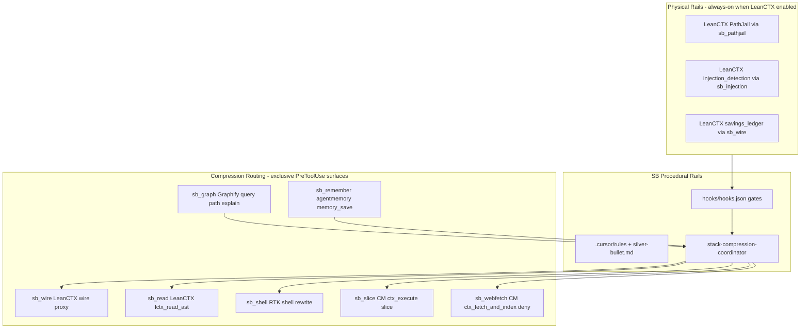

# LeanCTX five-tool parallel integration

**Status:** Phase 5 — plan hardening (review-fix-ladder)  
**Scope lock:** This artifact only; implementation (Phases 1–4, 6) deferred until ladder passes and user approves.

---

## Architectural decision (user-confirmed)

Implement **Option B: parallel 5-stack with SB routing + tool-side configuration**, not naive co-install. All five context tools remain in the SB catalog; when LeanCTX is opted in it becomes **mandatory per existing `required_when_enabled` policy**, with **surface-level mutual exclusion** so overlapping compression/MCP paths never run concurrently.



**Codex caveat (documented, not blocked):** AST read-path requires `updatedInput` PreToolUse rewrite; Codex is deny-only — Codex profile runs **wire proxy + ledger + PathJail + injection detection** only; RTK+CM remain primary compressors on Codex until upstream supports rewrite. LeanCTX shell/sandbox MCP explicitly **OFF** on all hosts when RTK/CM own those surfaces.

---

## Routing table (`optimization_profiles.five_tool_routed`)

Profile block (add to `.silver-bullet.json` `optimization_profiles`):

```json
"five_tool_routed": {
  "extends": "synergy_max",
  "stack_mode": "parallel_routed",
  "primary_fts": "context_mode",
  "routes": {
    "sb_wire": "leanctx",
    "sb_read": "leanctx",
    "sb_grep": "context_mode",
    "sb_shell": "rtk",
    "sb_slice": "context_mode",
    "sb_webfetch": "context_mode",
    "sb_graph": "graphify",
    "sb_remember": "agentmemory",
    "sb_pathjail": "leanctx",
    "sb_injection": "leanctx"
  }
}
```

| SB route | Owner | Incumbent tools disabled on that surface |
|----------|-------|------------------------------------------|
| `sb_wire` | LeanCTX wire proxy + savings ledger | CM wire intercept; LeanCTX ledger canonical |
| `sb_read` | LeanCTX `lctx_read_ast` | CM read-deny matcher narrowed to `Read` only when LeanCTX active (via [`hooks/context-mode-read-deny.sh`](hooks/context-mode-read-deny.sh) + [`hooks/lib/context-mode-read-deny.sh`](hooks/lib/context-mode-read-deny.sh)); oversized native Read still denied → agent uses `lctx_read_ast` per coordinator |
| `sb_grep` | Context Mode `ctx_execute` / `ctx_search` | Grep not intercepted by read-deny when LeanCTX active; cooperative CM analysis path preserved |
| `sb_shell` | RTK | LeanCTX shell rewrite OFF in [`scripts/optimize-five-tool-stack.sh`](scripts/optimize-five-tool-stack.sh) profile |
| `sb_slice` | Context Mode `ctx_execute` / `ctx_batch_execute` | LeanCTX sandbox MCP OFF |
| `sb_webfetch` | Context Mode (`CTX_FETCH_STRICT` deny → `ctx_fetch_and_index`) | LeanCTX fetch MCP OFF; wire proxy handles API transport separately |
| `sb_graph` | Graphify `query` / `path` / `explain` | LeanCTX `lctx_graph` advisory-only (blocked by [`hooks/lib/stack-compression-coordinator.sh`](hooks/lib/stack-compression-coordinator.sh)) |
| `sb_remember` | agentmemory `memory_save` | LeanCTX `lctx_remember` blocked by [`hooks/lib/stack-compression-coordinator.sh`](hooks/lib/stack-compression-coordinator.sh) + [`.cursor/rules/leanctx.mdc`](.cursor/rules/leanctx.mdc) |
| `sb_pathjail` | LeanCTX PathJail (physical rail) | Always on when LeanCTX enabled; not a compression surface |
| `sb_injection` | LeanCTX injection detection | Always on when LeanCTX enabled; not a compression surface |

**curl/wget in Shell:** unchanged from 2-tool stack — RTK rewrites allow-listed shell commands; CM pretooluse redirects inline HTTP to `ctx_execute`. Coordinator adds guard: if RTK already rewrote Bash, deny LeanCTX second shell pass (conflict #3).

---

## Phase 0 — Gist update (first deliverable)

Update [gist-leanctx-capability-analysis.md](.planning/archive/research/2026-07-05/2026-07-05-context-tools-feature-matrix-ultradeep/gist-leanctx-capability-analysis.md) and publish to [GitHub Gist](https://gist.github.com/shafqatevo/3ab842979d93dd524e4db291307241a4):

| New section | Source |
|-------------|--------|
| `## Multi-AI consolidated analysis (replacement vs 5-stack)` | User-provided multi-AI report + [followup-consolidated.md](.planning/archive/research/2026-07-05/2026-07-05-context-tools-feature-matrix-ultradeep/multi-ai-deep-research-out/followup-consolidated.md) |
| `## Silver Bullet response — parallel routed 5-stack` | Subagent verdict + conflict inventory |
| `## SB integration blueprint (conflicts + resolutions)` | This plan's routing table |

Commit archive mirror after gist publish (same pattern as [609ee0a1](https://github.com/alo-exp/silver-bullet/commit/609ee0a1)).

---

## Phase 1 — Config contract and registry

### 1.1 Add `leanctx` to recommended tools

Extend [`.silver-bullet.json`](.silver-bullet.json) and [`templates/silver-bullet.config.json.default`](templates/silver-bullet.config.json.default):

```json
"leanctx": {
  "enabled_by_user": null,
  "required_when_enabled": true,
  "cli_command": "lean-ctx",
  "install_commands": ["curl -fsSL https://leanctx.com/install.sh | sh"],
  "usage_ttl_seconds": 1800,
  "usage_state_file": "${SB_RUNTIME_HOME_ROOT}/.silver-bullet/leanctx-usage",
  "stack_mode": "parallel_routed",
  "optimization_profile": "five_tool_routed",
  "primary_fts": "context_mode",
  "mcp_server_name": "leanctx",
  "mcp_tool_prefix": "lctx_",
  "exclusive_surfaces": {
    "wire_proxy": true,
    "read_ast": true,
    "pathjail": true,
    "savings_ledger": true,
    "injection_detection": true
  },
  "platform_install_commands": {
    "cursor": ["bash scripts/install-leanctx-sb.sh --host cursor"],
    "claude": ["bash scripts/install-leanctx-sb.sh --host claude"],
    "codex": ["bash scripts/install-leanctx-sb.sh --host codex"],
    "opencode": ["bash scripts/install-leanctx-sb.sh --host opencode"]
  }
}
```

### 1.2 Registry and policy surfaces

| File | Change |
|------|--------|
| [`hooks/lib/recommended-tools-registry.sh`](hooks/lib/recommended-tools-registry.sh) | Add `leanctx`; new `sb_recommended_tool_is_compression_stack` (do **not** extend token_compression — LeanCTX is stack-routed, not shell-only) |
| [`hooks/lib/recommended-tools.sh`](hooks/lib/recommended-tools.sh) | Mutual-exclusion helpers: `sb_stack_leanctx_active`, `sb_stack_surface_owner` (maps `Read`→`sb_read`, `Grep`→`sb_grep`, `Bash`→`sb_shell`, `WebFetch`→`sb_webfetch`) |
| [`skills/silver-init/references/recommended-tools-opt-in.md`](skills/silver-init/references/recommended-tools-opt-in.md) | LeanCTX opt-in + conflict warnings |
| [`silver-bullet.md`](silver-bullet.md) + [`templates/silver-bullet.md.base`](templates/silver-bullet.md.base) | §2g LeanCTX row; five-tool routing table |
| New [`docs/LEANCTX.md`](docs/LEANCTX.md) | Install, routing, host matrix, Codex limitations |
| [`skills/deep-research/SKILL.md`](skills/deep-research/SKILL.md) | Fetch routing: search_cli first; LeanCTX fetch for non-research only |

Run `bash scripts/sync-codex-package.sh` + template sync after skill/doc edits.

---

## Phase 2 — Conflict resolution (beyond multi-AI inventory)

### Conflicts multi-AI identified + **additional SB-specific conflicts** (17 items)

| # | Conflict | Severity | Phase | Resolution (code/config artifact) |
|---|----------|----------|-------|-----------------------------------|
| 1 | `ctx_*` MCP namespace collision (CM vs LeanCTX) | **BLOCKER** | 2 | [`scripts/install-leanctx-sb.sh`](scripts/install-leanctx-sb.sh) + [`scripts/lib/merge-leanctx-mcp-config.py`](scripts/lib/merge-leanctx-mcp-config.py): install with **`lctx_` prefix**; never register raw `ctx_*` from LeanCTX when CM opted in |
| 2 | Read/Grep: [`hooks/context-mode-read-deny.sh`](hooks/context-mode-read-deny.sh) (`Read|Grep` matcher) vs LeanCTX AST | **HIGH** | 2 | [`hooks/lib/stack-compression-coordinator.sh`](hooks/lib/stack-compression-coordinator.sh) + [`hooks/context-mode-read-deny.sh`](hooks/context-mode-read-deny.sh) + [`hooks/lib/context-mode-read-deny.sh`](hooks/lib/context-mode-read-deny.sh): matcher narrowed to **`Read` only** when LeanCTX active; LeanCTX owns `sb_read`; **Grep**→`sb_grep` stays CM cooperative (`ctx_execute`/`ctx_search`); [`tests/hooks/test-stack-compression-coordinator.sh`](tests/hooks/test-stack-compression-coordinator.sh) adds Grep fixture |
| 3 | Bash: RTK + LeanCTX double-wrap | **HIGH** | 2 | Coordinator + [`scripts/optimize-five-tool-stack.sh`](scripts/optimize-five-tool-stack.sh): if RTK owns shell, LeanCTX shell hook **disabled** in install profile |
| 4 | Hook ordering (57 scripts, 7 events) | **HIGH** | 2 | Ordered chain in coordinator; [`hooks/lib/leanctx-gate.sh`](hooks/lib/leanctx-gate.sh) + [`hooks/leanctx-gate.sh`](hooks/leanctx-gate.sh) after SB policy guards, before compression rewrites; [`tests/hooks/test-five-tool-hook-ordering.sh`](tests/hooks/test-five-tool-hook-ordering.sh) |
| 5 | Triple FTS5 (CM + LeanCTX) | **MEDIUM** | 1+2 | `primary_fts: context_mode` in Phase 1 config + [`scripts/optimize-five-tool-stack.sh`](scripts/optimize-five-tool-stack.sh) (Phase 2) disables LeanCTX FTS in parallel mode |
| 6 | Triple graph (GX + AM + LeanCTX) | **MEDIUM** | 2 | [`hooks/lib/stack-compression-coordinator.sh`](hooks/lib/stack-compression-coordinator.sh) blocks `lctx_graph` for code queries; [`.cursor/rules/leanctx.mdc`](.cursor/rules/leanctx.mdc) enforces Graphify authoritative for code; [`tests/hooks/test-five-tool-mutual-exclusion.sh`](tests/hooks/test-five-tool-mutual-exclusion.sh) denies `lctx_graph` on code query |
| 7 | Token accounting (RTK gain / ctx_stats / ledger) | **MEDIUM** | 2 | [`hooks/record-leanctx-usage.sh`](hooks/record-leanctx-usage.sh) + [`hooks/record-rtk-usage.sh`](hooks/record-rtk-usage.sh): LeanCTX Ed25519 ledger **canonical** when enabled; RTK/CM recorders write cross-refs only; [`tests/hooks/test-leanctx-ledger-canonical.sh`](tests/hooks/test-leanctx-ledger-canonical.sh) |
| 8 | Config file clobber (`.cursorrules`, `AGENTS.md`, settings) | **HIGH** | 2 | [`scripts/install-leanctx-sb.sh`](scripts/install-leanctx-sb.sh): `lean-ctx init --library-mode` only; **never** full `lean-ctx init --agent *`; SB owns host config writes |
| 9 | **`optimize-rtk-context-mode.sh` auto-run** on init | **HIGH** | 2 | [`scripts/sb-init`](scripts/sb-init): gate RTK+CM optimize when LeanCTX enabled; [`scripts/optimize-five-tool-stack.sh`](scripts/optimize-five-tool-stack.sh) orchestrates; [`tests/scripts/test-sb-init-five-tool-gate.sh`](tests/scripts/test-sb-init-five-tool-gate.sh) |
| 10 | **`token-compression-tools-gate.sh`** assumes 2 tools | **HIGH** | 2 | Extend [`hooks/lib/token-compression-tools-gate.sh`](hooks/lib/token-compression-tools-gate.sh) for **mutual-exclusion state only** (not LeanCTX freshness — that stays in `leanctx-gate`); [`tests/hooks/test-token-compression-tools-gate-five-tool.sh`](tests/hooks/test-token-compression-tools-gate-five-tool.sh) |
| 11 | **`semantic-compress.sh`** skill list | **MEDIUM** | 2 | [`hooks/semantic-compress.sh`](hooks/semantic-compress.sh): add leanctx awareness; exclude when stack coordinator active; [`tests/hooks/test-semantic-compress-five-tool.sh`](tests/hooks/test-semantic-compress-five-tool.sh) |
| 12 | **PreCompact / Stop ordering** | **MEDIUM** | 2 | [`hooks/lib/stack-compression-coordinator.sh`](hooks/lib/stack-compression-coordinator.sh) + [`hooks/hooks.json`](hooks/hooks.json): CM PreCompact → agentmemory snapshot → LeanCTX compact → SB stop-check; [`tests/hooks/test-five-tool-lifecycle-ordering.sh`](tests/hooks/test-five-tool-lifecycle-ordering.sh) |
| 13 | **Evidence Schema + wire proxy** (Codex) | **MEDIUM** | 2 | [`scripts/lib/verify-leanctx-wire-proxy-ordering.py`](scripts/lib/verify-leanctx-wire-proxy-ordering.py) called from [`scripts/install-leanctx-sb.sh`](scripts/install-leanctx-sb.sh) verify step; [`tests/scripts/test-verify-leanctx-wire-proxy-ordering.sh`](tests/scripts/test-verify-leanctx-wire-proxy-ordering.sh) |
| 14 | **`graphify-gate` + `agentmemory-gate`** + `lctx_remember` / `lctx_graph` | **MEDIUM** | 2+3 | Coordinator blocks `lctx_remember` and code-path `lctx_graph` (Phase 2); update [`.cursor/rules/recommended-tools.mdc`](.cursor/rules/recommended-tools.mdc) + [`.cursor/rules/leanctx.mdc`](.cursor/rules/leanctx.mdc) (Phase 3); [`tests/hooks/test-five-tool-mutual-exclusion.sh`](tests/hooks/test-five-tool-mutual-exclusion.sh) |
| 15 | **E2E / enterprise matrix** tool checks | **HIGH** | 4 | Extend [`.planning/enterprise-e2e/matrix.json`](.planning/enterprise-e2e/matrix.json) five-tool rows; [`tests/scripts/test-enterprise-matrix-five-tool.sh`](tests/scripts/test-enterprise-matrix-five-tool.sh) |
| 16 | **search_cli + LeanCTX fetch** overlap in deep-research | **LOW** | 1 | [`docs/LEANCTX.md`](docs/LEANCTX.md) + [`skills/deep-research/SKILL.md`](skills/deep-research/SKILL.md) (registry Phase 1.2): deep-research uses search_cli first; LeanCTX fetch for non-research flows only |
| 17 | **WebFetch: CM deny vs LeanCTX wire proxy** | **HIGH** | 2 | `sb_webfetch`→CM (`CTX_FETCH_STRICT`); LeanCTX wire proxy handles API transport only, not WebFetch tool surface; [`hooks/lib/stack-compression-coordinator.sh`](hooks/lib/stack-compression-coordinator.sh) denies LeanCTX fetch MCP when CM owns webfetch |

### New hook/script files

| Artifact | Role |
|----------|------|
| `hooks/lib/leanctx-gate.sh` + `hooks/leanctx-gate.sh` | Install/wiring/usage freshness (mirror [`hooks/lib/rtk-gate.sh`](hooks/lib/rtk-gate.sh)) |
| `hooks/lib/stack-compression-coordinator.sh` | Surface ownership for PreToolUse Read/Bash/WebFetch/Grep; MCP blocks (`lctx_graph`, `lctx_remember`, LeanCTX fetch); lifecycle PreCompact/Stop ordering |
| `hooks/context-mode-read-deny.sh` + `hooks/lib/context-mode-read-deny.sh` | Read-deny matcher narrowed to `Read` only when LeanCTX active (conflict #2) |
| `hooks/record-leanctx-usage.sh` | Usage stamp for gate |
| `scripts/install-leanctx-sb.sh` | Host-aware library-mode install + MCP merge + wire-proxy verify |
| `scripts/lib/merge-leanctx-mcp-config.py` | Merge `leanctx` server into `~/.cursor/mcp.json` / `~/.codex/settings.json` (MCP) / `~/.codex/config.toml` / OpenCode `~/.config/opencode/mcp.json` |
| `hooks/pre-push-five-tool-live.sh` | Pre-push gate: blocks push when five-tool opt-in and live suite not run locally |
| `scripts/lib/verify-leanctx-wire-proxy-ordering.py` | Codex wire-proxy JSON message ordering validator |
| `scripts/optimize-five-tool-stack.sh` | Replaces ad-hoc RTK+CM optimize when all five opted in |
| `.cursor/rules/leanctx.mdc` | Routing rules for agents |

**Gate responsibility split:** `leanctx-gate.sh` = per-tool freshness/install (like graphify-gate); `token-compression-tools-gate.sh` = cross-tool mutual-exclusion state when ≥2 compression tools active. No overlap — coordinator consulted by both.

Wire into [`hooks/hooks.json`](hooks/hooks.json) PreToolUse chain (after workflow guards, coordinated with existing rtk/context-mode gates).

---

## Phase 3 — Enforcement (SB tool policy)

When `recommended_tools.leanctx.enabled_by_user: true`:

1. **`leanctx-gate.sh`** blocks substantive edits if LeanCTX stale (same TTL pattern as graphify/agentmemory).
2. **Stack coordinator** blocks double-compression on Read/Bash/WebFetch (e.g., Bash already RTK-rewritten → deny LeanCTX shell rewrite; WebFetch denied by CM → deny LeanCTX fetch MCP).
3. **Rules** mandate routing table (`sb_graph` → graphify query, not lctx_graph; `sb_remember` → agentmemory, not lctx_remember).
4. **`required_when_enabled: true`** — host agent must use LeanCTX for owned surfaces (wire, AST read, PathJail, ledger, injection detection); coordinator **denies** `lctx_*` on non-owned surfaces when LeanCTX required.
5. Extend [`scripts/install-recommended-tools-cursor.sh`](scripts/install-recommended-tools-cursor.sh) to install `leanctx.mdc` and wire [`hooks/pre-push-five-tool-live.sh`](hooks/pre-push-five-tool-live.sh) into git hooks when five-tool profile active.

**Worker mapping:** W3 (hooks) delivers Phase 2+3 hook artifacts; W5 tests include Phase 3 enforcement cases in mutual-exclusion and coordinator tests.

---

## Phase 4 — Test suite (added to SB CI)

### Unit / hook tests (offline, fast)

| Test | Validates | Acceptance criteria |
|------|-----------|---------------------|
| `tests/hooks/test-leanctx-gate-lib.sh` | Gate helpers, TTL, install status | All lib helpers return expected status codes; TTL expiry triggers stale |
| `tests/hooks/test-leanctx-gate.sh` | PreToolUse block when stale | Substantive edit denied when usage file older than TTL |
| `tests/hooks/test-record-leanctx-usage.sh` | Usage stamp recording | PostToolUse updates `${SB_RUNTIME_HOME_ROOT}/.silver-bullet/leanctx-usage` |
| `tests/hooks/test-stack-compression-coordinator.sh` | Read/Bash/WebFetch/Grep routing, no double-wrap | Each surface routes to single owner per `sb_stack_surface_owner`; Grep passthrough when LeanCTX active; second compression pass denied |
| `tests/hooks/test-five-tool-mcp-namespace.sh` | MCP descriptors | No duplicate unprefixed `ctx_execute` when both CM+LeanCTX configured |
| `tests/hooks/test-five-tool-mutual-exclusion.sh` | RTK shell + lctx MCP blocks | RTK rewrite + LeanCTX shell = deny second pass; coordinator denies `lctx_remember` and code-path `lctx_graph` |
| `tests/hooks/test-leanctx-ledger-canonical.sh` | Ledger canonical | When LeanCTX enabled, Ed25519 ledger entry written; RTK/CM recorders emit cross-ref only |
| `tests/hooks/test-pre-push-five-tool-live.sh` | Pre-push gate | Push blocked when five-tool opt-in and `SB_FIVE_TOOL_LIVE` suite not run |
| `tests/hooks/test-five-tool-hook-ordering.sh` | Hook chain order | leanctx-gate runs after policy guards, before rtk/context-mode rewrites |
| `tests/hooks/test-five-tool-lifecycle-ordering.sh` | PreCompact/Stop | CM PreCompact → AM snapshot → LeanCTX compact → stop-check order preserved |
| `tests/hooks/test-token-compression-tools-gate-five-tool.sh` | 3-tool mutual-exclusion gate | Gate passes with valid mutual-exclusion state; fails on double-compression; does NOT test LeanCTX freshness |
| `tests/hooks/test-semantic-compress-five-tool.sh` | semantic-compress | LeanCTX excluded from compress list when coordinator active |
| `tests/scripts/test-install-leanctx-sb.sh` | Dry-run install | Exits 0; no AGENTS.md/cursorrules writes; MCP JSON valid |
| `tests/scripts/test-optimize-five-tool-stack.sh` | Profile apply | Idempotent apply/verify; `primary_fts` and route table applied |
| `tests/scripts/test-sb-init-five-tool-gate.sh` | sb-init optimize gate | When LeanCTX enabled, `optimize-rtk-context-mode.sh` not auto-run; `optimize-five-tool-stack.sh` invoked instead |
| `tests/scripts/test-verify-leanctx-wire-proxy-ordering.sh` | Wire proxy ordering | Validator accepts well-formed JSON message stream; rejects reorder |
| `tests/scripts/test-enterprise-matrix-five-tool.sh` | Enterprise matrix | Matrix JSON contains five-tool opt-in rows |
| Extend [`tests/scripts/test-recommended-tools-policy.sh`](tests/scripts/test-recommended-tools-policy.sh) | Template parity | `leanctx` block matches template for all required fields |
| Extend [`tests/hooks/test-agentmemory-graphify-synergy.sh`](tests/hooks/test-agentmemory-graphify-synergy.sh) | Synergy unchanged | GX+AM gates pass identically when LeanCTX present but disabled |

### Integration / live validation via `/silver:agent-cursor`

New [`tests/live/test-live-five-tool-stack-cursor.sh`](tests/live/test-live-five-tool-stack-cursor.sh) using [`scripts/agent-cursor-delegate.sh`](scripts/agent-cursor-delegate.sh) + [`skills/silver-agent-cursor/SKILL.md`](skills/silver-agent-cursor/SKILL.md):

| Scenario | Acceptance |
|----------|------------|
| Opt-in all five tools in temp project | Install script exits 0; MCP JSON valid; `lctx_` prefix confirmed |
| Read large file | LeanCTX AST path used; CM read-deny not triggered incorrectly |
| Grep for analysis | CM cooperative path used (`ctx_execute`/`ctx_search`); read-deny does not intercept Grep when LeanCTX active; no LeanCTX double-read |
| Shell `git status` | RTK rewrite once; no LeanCTX second wrap |
| WebFetch attempt | CM deny fires; LeanCTX fetch MCP not invoked |
| `graphify query` + `memory_save` | Graphify/agentmemory gates pass; coordinator blocks `lctx_remember` |
| Wire proxy smoke | Ledger records session entry; wire-proxy ordering validator passes |
| PathJail + injection | LeanCTX session log at `${SB_RUNTIME_HOME_ROOT}/.silver-bullet/leanctx-session.log` contains PathJail allow + injection scan entries within 60s of agent turn |
| Conflict regression | Coordinator returns `permission: deny` with `sb_stack_double_compression` reason when RTK-rewritten Bash is re-offered to LeanCTX shell hook; same for CM-denied WebFetch → LeanCTX fetch MCP |
| PreCompact lifecycle | Ordering: CM → AM → LeanCTX → stop-check (fixture project) |

**Host live coverage:** Cursor mandatory via agent-cursor harness above. Claude/Codex/OpenCode covered by offline hook tests + enterprise matrix; Codex wire-proxy validator is install-time gate. Full live Claude/OpenCode deferred to post-merge soak (documented in [`docs/LEANCTX.md`](docs/LEANCTX.md)).

Wire into [`tests/run-all-tests.sh`](tests/run-all-tests.sh) behind `SB_FIVE_TOOL_LIVE=1` (live tests optional in CI; **pre-merge hook** [`hooks/pre-push-five-tool-live.sh`](hooks/pre-push-five-tool-live.sh) blocks push when five-tool opt-in and live suite not run locally).

Add scenario doc: [`tests/skill-scenarios/silver-five-tool-stack.md`](tests/skill-scenarios/silver-five-tool-stack.md) — must list all **10** live scenarios above with pass/fail ledger column.

---

## Phase 5 — Review-fix-ladder on this plan

Before implementation:

1. Write plan artifact to `.planning/PLAN-leanctx-five-tool-integration.md` (this file + charter).
2. Run **`/silver:review-fix-ladder`** scoped **only** to that plan file per [`skills/silver-review-fix-ladder/SKILL.md`](skills/silver-review-fix-ladder/SKILL.md).
3. Merge ladder fixes back into plan; user approves updated plan before Phase 6.

Ladder outcomes documented in [`.planning/PLAN-leanctx-five-tool-integration-ladder.md`](.planning/PLAN-leanctx-five-tool-integration-ladder.md).

---

## Phase 6 — Multitask execution (after ladder)

Parent orchestrator spawns **Composer 2.5** background workers (parallel where independent):

| Worker | Scope |
|--------|-------|
| W1 Gist | Phase 0 publish + commit mirror |
| W2 Config | Phase 1 registry, template, docs/LEANCTX.md skeleton |
| W3 Hooks | Phase 2+3 coordinator + leanctx-gate + hooks.json wiring + lifecycle ordering |
| W4 Install | Phase 2 install/merge/optimize/verify scripts |
| W5 Tests | Phase 4 full test suite (unit + enterprise matrix) |
| W6 Live | `/silver:agent-cursor` five-tool validation in isolated worktree |

Merge order: W2 → W3/W4 (parallel) → W5 → W6 → `bash tests/run-all-tests.sh` (targeted first) → `graphify update .` → agentmemory capture.

---

## Host matrix (`docs/LEANCTX.md` target)

| Host | Wire + ledger | AST read | PathJail | Injection | RTK shell | CM sandbox | CM webfetch | Graphify | agentmemory | lctx_graph | lctx_remember | Notes |
|------|---------------|----------|----------|-----------|-----------|------------|-------------|----------|-------------|------------|---------------|-------|
| **Cursor** | ✅ LeanCTX | ✅ LeanCTX | ✅ | ✅ | ✅ RTK | ✅ CM | ✅ CM deny | ✅ Graphify | ✅ AM | ⚠️ advisory | ❌ blocked | Full five-tool routed stack |
| **Claude Code** | ✅ LeanCTX | ✅ LeanCTX | ✅ | ✅ | ✅ RTK | ✅ CM | ✅ CM deny | ✅ Graphify | ✅ AM | ⚠️ advisory | ❌ blocked | Verify hook chain in [`tests/hooks/test-five-tool-hook-ordering.sh`](tests/hooks/test-five-tool-hook-ordering.sh) |
| **Codex** | ✅ LeanCTX | ❌ deny-only | ✅ | ✅ | ✅ RTK (LeanCTX shell OFF) | ✅ CM (LeanCTX sandbox OFF) | ✅ CM deny | ✅ Graphify | ✅ AM | ⚠️ advisory | ❌ blocked | AST blocked until PreToolUse rewrite; wire-proxy ordering validator mandatory |
| **OpenCode** | ✅ LeanCTX | ⚠️ verify Phase 1 | ✅ | ✅ | ✅ RTK | ✅ CM | ✅ CM deny | ✅ Graphify | ✅ AM | ⚠️ advisory | ❌ blocked | AST support confirmed in [`scripts/install-leanctx-sb.sh`](scripts/install-leanctx-sb.sh) verify or documented gap |

---

## Success criteria

- Gist contains multi-AI + SB parallel-routing sections (matches archive mirror line count ≥ current gist baseline).
- `leanctx` in recommended_tools with enforcement gates passing tests.
- All **17 conflicts** have code or config resolution (not docs-only); docs-only items (#16) paired with skill/doc file changes tracked in Phase 1 registry.
- Five-tool live cursor scenario passes via agent-cursor harness (10 scenarios).
- No regression: existing RTK/CM/GX/AM gate tests green when LeanCTX disabled.
- Plan survived review-fix-ladder with documented rung outcomes.

## Out of scope (this iteration)

- Removing RTK or Context Mode from catalog (they stay; surfaces routed).
- Codex AST read-path until upstream PreToolUse rewrite lands.
- GitHub release / plugin version bump (unless user requests after validation).
- Full live validation on Claude/OpenCode hosts (offline + matrix only).

---

## Review charter (ladder scope)

### Scope lock

**Only:** `.planning/PLAN-leanctx-five-tool-integration.md`

### Goals

1. **Complete conflict inventory** — all 17 conflicts documented with severity, resolution artifact, and implementation phase.
2. **Test coverage** — every Phase 4 test file listed with acceptance criteria; live scenario matrix complete (10 scenarios).
3. **Host matrix** — Cursor, Claude, Codex, OpenCode profiles documented with capability gaps explicit.
4. **Codex profile** — AST read limitation and wire-proxy JSON ordering validator (`scripts/lib/verify-leanctx-wire-proxy-ordering.py`) called out.
5. **No architectural holes** — routing table covers all compression surfaces (including WebFetch); coordinator owns PreToolUse + MCP routing decisions (`lctx_*` blocks); `leanctx-gate` and `token-compression-tools-gate` handle freshness/mutual-exclusion state; no double-compression paths unaddressed.

### Non-goals

- Implementing hooks, config, or scripts (Phases 1–4).
- Gist publish or multitask workers (Phases 0, 6).
- Plugin release or version bump.

### Verification signals

| # | Signal | Command / pattern |
|---|--------|-------------------|
| V1 | All 17 conflicts with Phase column | `awk '/^\| [0-9]+ \|/{c++} END{print c+0}' .planning/PLAN-leanctx-five-tool-integration.md` = 17 |
| V2 | Conflict resolutions name artifacts | `grep -E 'hooks/|scripts/|\.cursor/rules/' .planning/PLAN-leanctx-five-tool-integration.md \| wc -l` ≥ 25 |
| V3 | Routing table complete (10 routes) | `sed -n '/## Routing table/,/## Phase 0/p' .planning/PLAN-leanctx-five-tool-integration.md \| grep -c 'sb_'` ≥ 10 |
| V4 | Test files with acceptance criteria | `grep -c 'tests/' .planning/PLAN-leanctx-five-tool-integration.md` ≥ 15 AND `grep -c 'Acceptance criteria' .planning/PLAN-leanctx-five-tool-integration.md` ≥ 1 |
| V5 | Host matrix documented | `grep -cE 'Codex\|Cursor\|Claude\|OpenCode' .planning/PLAN-leanctx-five-tool-integration.md` ≥ 4 |
| V6 | Codex AST caveat + wire validator | `grep -E 'verify-leanctx-wire-proxy-ordering\|deny-only' .planning/PLAN-leanctx-five-tool-integration.md` |
| V7 | Architectural decision stated | `grep -iE 'Option B\|parallel.*5-stack' .planning/PLAN-leanctx-five-tool-integration.md` |
| V8 | Phases 0–6 present | `grep '## Phase [0-6] —' .planning/PLAN-leanctx-five-tool-integration.md \| wc -l` = 7 |
| V9 | Success criteria + conflict count | `grep -c '17 conflicts' .planning/PLAN-leanctx-five-tool-integration.md` ≥ 1 |
| V10 | Live test scenarios (10) | `sed -n '/Integration \/ live validation/,/Wire into/p' .planning/PLAN-leanctx-five-tool-integration.md \| grep -cE '^\| [A-Za-z`]'` ≥ 10 |
