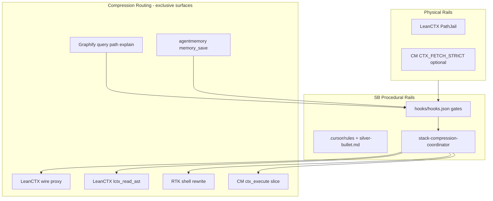

# LeanCTX vs RTK + Context Mode + agentmemory + Graphify

> **Scope:** Pure capability and feature comparison only — no Silver Bullet migration cost, hooks/gates enforcement policy, licensing, pricing, or adoption recommendations. Baseline: **LeanCTX** as a single product vs the **RTK + Context Mode + agentmemory + Graphify** composable stack. Evidence: ultradeep matrix audit (2026-07-05), 200 feature rows × 5 columns, 1000 cells verified ([audit-report.md](audit-report.md)).

## Pure capability replacement analysis

### Verdict

**LeanCTX is not a full replacement for the four-tool stack.** It overlaps heavily on compression, sandbox analysis, hooks, memory, and code-graph surfaces, but the audited matrix and replacement pass show **residual hard gaps** (especially agentmemory orchestration and Context Mode fetch/hook depth) and many **partial (¹) / composable (²)** cells where LeanCTX matches intent yet not parity.

LeanCTX is best read as a **unified runtime** that can **compose with RTK** (documented addon) while still leaving Graphify-grade retrieval graphs and agentmemory-grade work orchestration as stack strengths.

### Per-tool replacement coverage (LeanCTX vs each stack tool’s native rows)

Scores below reflect how completely LeanCTX covers each tool’s **first-class (✓) and partial (✓¹/✓²)** matrix rows when that tool is the reference — synthesis from the replacement verdict pass plus the audited matrix (not install/ops cost).

| Stack tool | LeanCTX replacement coverage | Reading |
|------------|-----------------------------:|---------|
| **RTK** | **97%** | Shell compression, PreToolUse rewrite, command-specific compressors, and savings analytics align; RTK remains the lightest shell-only specialist. |
| **Context Mode** | **95%** | Shared MCP sandbox (`ctx_execute*`, fetch/index, FTS session KB, core hooks); gaps on fetch strictness tiers, credential passthrough sandbox, `afterAgentResponse`, and Insight launcher. |
| **agentmemory** | **87%** | Overlap on capture, export, graph query, handoffs; largest gap is orchestration-only tooling (sentinels, sketch→promote, crystallize, diagnose/heal, slots, verify). |
| **Graphify** | **99%** | Structural graph query, multimodal ingest, god-node reporting largely mirrored or partial (¹); Graphify stays the dedicated graph-first retrieval engine. |

### Hard gaps (17)

Matrix-native **hard gaps** = rows where a stack tool has a **native ✓** and LeanCTX has **no tick**. Thirteen are cell-exact; four are **documented depth gaps** from the ultradeep synthesis where LeanCTX is partial (¹) but the stack tool’s published surface is stronger.

**Cell-exact (13)**

| # | Gap | Leader |
|---|-----|--------|
| 1 | Sandbox credential passthrough for approved CLIs | Context Mode |
| 2 | `afterAgentResponse` hook | Context Mode |
| 3 | `ctx_insight` dashboard launcher (CM-native) | Context Mode |
| 4 | `CTX_FETCH_STRICT` RFC1918/loopback block mode | Context Mode |
| 5 | Editable memory slots (size-limited) | agentmemory |
| 6 | `memory_relations` relationship traversal | agentmemory |
| 7 | `memory_reflect` LLM insight synthesis over graph | agentmemory |
| 8 | Claude MEMORY.md bridge sync | agentmemory |
| 9 | Citation chain verification (`memory_verify`) | agentmemory |
| 10 | Sentinel event-driven unblocking | agentmemory |
| 11 | Sketch → promote exploratory workgraphs | agentmemory |
| 12 | Crystallize completed action chains (LLM digest) | agentmemory |
| 13 | `memory_diagnose` + `memory_heal` auto-fix | agentmemory |

**Depth gaps (4)** — LeanCTX absent or materially thinner vs combined stack narrative ([research_report.md](research_report.md))

| # | Gap | Leader |
|---|-----|--------|
| 14 | Hook-layer **WebFetch deny** + **curl/wget redirect** with published platform matrix | Context Mode |
| 15 | **53-tool** action DAG / frontier / lease / mesh orchestration MCP surface | agentmemory |
| 16 | **Multimodal corpus graph** as primary deliverable (vision ingest, Leiden communities, `/raw`-scale retrieval story) | Graphify |
| 17 | **Secret scanning on memory export (gitleaks)** bridge | agentmemory |

### Partial overlaps (representative)

| Area | LeanCTX | Stack | Notes |
|------|---------|-------|-------|
| Shell compression | Native + RTK addon (²) | RTK native | Deepest per-CLI compressors often composed, not duplicated. |
| Read / analysis path | 10 read modes + routing | Context Mode sandbox + cooperative Read rules | CM Read deny is hook-cooperative unless host adds deny bytes. |
| Session KB / search | FTS + graph tooling | Context Mode FTS5 + RRF | CM progressive search throttling tied to session SQLite. |
| Memory graph | `ctx_graph`, handoffs | agentmemory save + Graphify retrieve | SB synergy: save via agentmemory, retrieve via Graphify (matrix ✓). |
| Code intelligence | LSP refactor, impact tools | Graphify AST + INFERRED edges | Graphify merge driver / `graph.json` git workflow is stack-specific. |
| Savings proof | Ed25519 hash-chained ledger | RTK `rtk gain` / session | LeanCTX wire proxy + bounce-adjusted reporting are LeanCTX-native. |

### Where the four-stack wins

- **Layered best-of-breed:** RTK for minimal shell-only footprint; Context Mode for MCP sandbox + fetch hardening; agentmemory for session/work orchestration; Graphify for graph-first code/doc retrieval.
- **Orchestration memory:** Sentinels, sketch→promote, crystallize, diagnose/heal, and citation verify — agentmemory-native rows with no LeanCTX tick.
- **Fetch/governance detail:** `CTX_FETCH_STRICT`, credential passthrough sandbox, and CM-specific hook events beyond LeanCTX’s published hook parity.
- **Retrieval center of gravity:** Graphify `query` / `path` / `explain` / `affected` on a persistent multimodal `graph.json` corpus.
- **Composability without single-binary coupling:** Independent version/install per concern (matrix “split-stack composability” rows).

### Where LeanCTX wins

- **Single Rust binary** unifying I/O, memory, security, optional **wire/request compression proxy**, and **provable savings** subsystems.
- **Read-path compression:** 10 fidelity modes, ModePredictor / `mode=auto`, cached compressed re-read, bounce-aware honesty.
- **Runtime governance:** PathJail, deny-by-default shell allowlist, unified setup across MCP + hooks.
- **Proof:** Ed25519 hash-chained savings ledger + offline verification CLI.
- **MCP breadth:** 81 documented tools including Tool-Catalog Gateway, LSP refactor/impact/review tools, `ctxpkg`, SDK surfaces.
- **Explicit RTK addon compatibility** — acknowledges stack composition rather than forcing rip-and-replace.

---

## Critical gap assessment — are any gaps super critical?

**Verdict:** For most serious agentic coding, **none of the 17 hard gaps is a universal super-critical dealbreaker.** LeanCTX (+ optional RTK addon) already covers compression, sandbox analysis, graph query, and memory capture at roughly **87–99%** per incumbent tool (see Section 1). Two gaps become **super-critical only for specific personas:** fetch-hardening depth (`CTX_FETCH_STRICT`) for corporate/regulated agents, and agentmemory’s **multi-agent orchestration primitives** for ops-at-scale workflows.

### Super critical (persona-conditional)

| Gap | Leader | When it becomes super-critical |
|-----|--------|--------------------------------|
| **`CTX_FETCH_STRICT`** (RFC1918/loopback block mode) | Context Mode | **Security / regulated / corporate** agents that must treat SSRF and internal-network fetch as a hard compliance control — not a nice-to-have hook policy. |
| **53-tool orchestration MCP surface** (action DAG, frontier, lease, mesh) | agentmemory | **Ops-at-scale / multi-agent** workflows where coordination, leasing, and frontier scheduling are the product — not single-session coding. |

### Important but not super critical

These gaps matter for production hardening or specialist stacks, but they rarely block a capable solo or team coding agent if LeanCTX (+ RTK where needed) is the baseline:

| Gap | Leader | Why important, not universal |
|-----|--------|------------------------------|
| Hook-layer **WebFetch deny** + **curl/wget redirect** depth | Context Mode | Stronger default fetch governance; LeanCTX has hooks and sandbox fetch — gap is **published parity depth**, not absence of control. |
| **Gitleaks** scan on memory export | agentmemory | Valuable for secret hygiene on exports; mitigated by repo policy and pre-export review for many teams. |
| Sandbox **credential passthrough** for approved CLIs | Context Mode | Needed for some CI/automation personas; many coding loops never touch passthrough sandboxes. |
| **Multimodal corpus graph** as primary deliverable | Graphify | Matters when vision ingest + community-scale `/raw` retrieval is the workflow; structural code graph parity is already ~99%. |
| **Sentinel** event-driven unblocking | agentmemory | High value for long-running orchestration; optional for interactive coding sessions. |
| **`memory_verify`** citation chain verification | agentmemory | Trust/audit persona; capture + graph query cover most “remember and retrieve” needs. |
| **Shell compression depth** | RTK (via addon) | **Mitigated by documented RTK addon (²)** — deepest per-CLI compressors composed, not missing. |

### Niche / optional

Fine-grained or host-specific surfaces; absence rarely changes day-to-day coding outcomes:

- **`afterAgentResponse`** hook (Context Mode) — host lifecycle nicety, not core analysis path.
- **`ctx_insight`** dashboard launcher (Context Mode) — observability UX, not capability floor.
- **Editable memory slots**, **`memory_relations`**, **`memory_reflect`** (agentmemory) — power-user graph ergonomics.
- **Claude MEMORY.md bridge sync** (agentmemory) — host-specific bridge, not generic agent memory.
- **Sketch → promote**, **crystallize**, **`memory_diagnose` + `memory_heal`** (agentmemory) — exploratory / maintenance orchestration, not baseline capture.

### Partial (✓¹) gaps — persona lens

Partial cells mean LeanCTX matches **intent** with thinner or composable parity (¹/²). Severity depends on persona:

| Area | LeanCTX vs stack | Persona note |
|------|------------------|--------------|
| **SSRF / fetch hardening** | Partial vs CM strict tiers | Rises to **super-critical** only for **security/compliance** persona; otherwise **important**. |
| **Shell / RTK** | Native + **RTK addon (²)** | **Not super-critical** — addon path is explicit; RTK remains the shell specialist. |
| **Graph retrieval** | ~**99%** vs Graphify | **Partial (¹)** on multimodal/git workflow story; **not** a coding-agent dealbreaker for typical repos. |
| **Session KB / search** | FTS + graph tooling vs CM RRF/throttle | Partial on CM session SQLite behaviors; sufficient for most sandboxed analysis loops. |
| **Orchestration memory** | Capture + `ctx_graph` vs sentinels/sketch/crystallize | **Super-critical** only when orchestration **is** the workload (see 53-tool row). |

### Bottom line

- **Simplification-first persona** (single binary, compression, sandbox, graph, memory): LeanCTX (+ RTK addon when shell depth matters) is **credible for serious agentic coding**; treat the 17 hard gaps as **specialist overlays**, not blockers.
- **Security / regulated persona**: budget **Context Mode–grade fetch strictness** (`CTX_FETCH_STRICT` and related hook depth) as **non-negotiable** — this is the main persona-conditional super-critical gap.
- **Multi-agent ops-at-scale persona**: budget **agentmemory’s orchestration MCP surface** (53-tool DAG/frontier/lease/mesh) as **non-negotiable** — the second persona-conditional super-critical gap.

## Token optimization — LeanCTX vs four-stack

### Verdict

**Mixed — neither is clearly better overall on tokens.** LeanCTX is **likely better** when the workload is read-heavy (AST fidelity modes, adaptive routing, ~13-token cached re-reads) and when the **wire/request proxy** is enabled, because it compresses at the read path *and* on every outbound request (prompt, history, tool results) — a surface the four-stack does not offer. The **RTK + Context Mode + agentmemory + Graphify** stack is **likely better** when orientation is graph-first (`graphify query` / `path` / `explain` scoped subgraphs), analysis stays in Context Mode's **11-tool** MCP sandbox, shell work hits RTK's mature per-CLI compressors, and session memory stays off the hot path (save via agentmemory, retrieve via Graphify). Both approaches pay a **standing overhead tax** (rules + MCP tool schemas); LeanCTX's **81 documented MCP tools** can easily erase single-binary simplicity unless you route through its **5 high-level tools**. Ultradeep research found **no controlled head-to-head benchmark** — vendor percentages (LeanCTX 60–90% per read; Context Mode ~94% vs raw fetch in README examples) are **uncorroborated**.

### By compression surface

| Surface | LeanCTX | Four-stack | Token lean |
|---|---|---|---|
| **Shell** | Native shell hooks + optional RTK addon | RTK PreToolUse rewrite (allow-list gated on Cursor) | **Tie → slight RTK edge** for deepest per-CLI compressors when allow-listed; LeanCTX native shell is comparable but not proven deeper |
| **Read / large files** | 10 fidelity modes (full → AST), ModePredictor, read *before* model | Context Mode: cooperative `ctx_execute_file` / rules; SB Read deny above 5 KB — no AST modes | **LeanCTX** — only stack with native read-path AST compression |
| **MCP / analysis output** | Sandbox stdout-only (partial parity); ~81 MCP tools | Context Mode: subprocess sandbox is the architectural center; **11 focused tools** | **Four-stack (CM)** — tighter tool surface + proven sandbox-first design |
| **Wire / request proxy** | Optional local proxy; prompt-cache-safe ordering | None | **LeanCTX only** — largest potential win on long multi-turn sessions |
| **Web fetch** | Universal intake → compact facts | `ctx_fetch_and_index` + hook **deny WebFetch** / redirect curl | **Slight four-stack (CM)** on hook-enforced fetch discipline; compression quality unbenchmarked |

### Re-read / cache efficiency

- **LeanCTX:** Vendor claim of **~13 tokens per cached compressed re-read**; bounce detection when agents "bounce" back to full fidelity.
- **Context Mode:** FTS5 + `ctx_search` with progressive throttling; raw fetch/analysis never enters context — only indexed snippets/stdout.
- **Graphify:** Budget-limited **scoped subgraph** (typically far smaller than `GRAPH_REPORT.md` or serial `Read`).
- **agentmemory + Graphify synergy:** Capture can be verbose on save, but SB's **retrieve-via-Graphify** pattern avoids dumping raw `.agentmemory/` exports into context — a real token win when followed.
- **LeanCTX unified memory graph** overlaps CM FTS + Graphify subgraph conceptually, but Graphify's **AST + INFERRED code edges** remain the four-stack's retrieval strength for codebase orientation.

### Overhead (rules, hooks, MCP schemas)

- **Four-stack:** 4 MCP servers (CM ~11 + agentmemory ~53 + Graphify + hooks-only RTK) plus SB rules (`graphify.mdc`, `context-mode.mdc`, `agentmemory.mdc`, `recommended-tools.mdc`, instruction fragments). Persistent **rules tax every turn**; CM fragment is mandatory for savings.
- **LeanCTX:** One binary, one setup — **lower orchestration friction** — but **81 MCP tool descriptors** can inflate the tool-definition context unless gateway/high-level tool mode is used. Research notes **5 unified high-level MCP tools** as the lean path.
- **Net:** Single-binary ≠ lower tokens if the full 81-tool catalog is exposed; four-stack can be **leaner per MCP call** despite more servers.

### When LeanCTX likely wins on tokens

- Repeated reads of the same files (cached compressed re-read).
- Exploration that can use **AST/signature** modes instead of full file bodies.
- Long sessions with **wire proxy** compressing history + tool results every request.
- Agents that need **runtime** read/shell enforcement (PathJail) vs instruction-only CM routing.
- Workflows where one unified cache beats four separate indexes.

### When the four-stack likely wins on tokens

- **Codebase orientation** via Graphify subgraph before broad `Read`/`Grep`.
- **MCP-heavy analysis** (`ctx_execute` / `ctx_batch_execute`) with minimal tool-schema surface.
- **Shell-heavy** dev loops with RTK-rewritten `git`/`gh`/`rg`/test output.
- **PreCompact** session recovery (Context Mode-specific) reducing re-bootstrap reads after compaction.
- Disciplined **save agentmemory → retrieve Graphify** (avoids memory re-read bloat).

### Honest uncertainty

Ultradeep runs (2026-07-05 context-mode vs LeanCTX research, feature-coverage matrix audit, and this capability gist) explicitly state: **no end-to-end install, no identical-task benchmark, vendor metrics uncorroborated**. Co-installation token effects (LeanCTX + four-stack, or LeanCTX + RTK addon) are **untested**. Real outcomes depend on agent rule compliance, which MCP tools the host exposes, Cursor allow-list coverage for RTK, and whether LeanCTX's wire proxy is actually enabled — none of which were measured head-to-head. Treat any single-number savings claim as **directional marketing**, not evidence.

---

## LeanCTX as mainstay — must any incumbent remain?

**One-sentence verdict:** LeanCTX alone suffices for most serious agentic coding; keep Context Mode only for regulated/corporate SSRF (`CTX_FETCH_STRICT`); keep agentmemory only for multi-agent orchestration-at-scale; RTK and Graphify are optional addons, not universal must-keeps.

### Per-tool table (critical gaps only)

| Tool | Keep? | Critical gap if dropped | Addon vs must-keep |
|------|-------|-------------------------|-------------------|
| **RTK** | **Optional** | None universal. Deepest per-CLI shell compressors when Cursor allow-list is thin; LeanCTX native shell + documented RTK addon (²) covers ~97%. | **Addon** when shell-heavy; standalone RTK not required. |
| **Context Mode** | **Optional** (persona: **Keep** for corp security) | **`CTX_FETCH_STRICT`** RFC1918/loopback block—only audited hard gap that is compliance-critical. WebFetch deny, PreCompact, 11-tool sandbox are partial (¹) or important-not-critical; LeanCTX has hooks + sandbox fetch. | **Must-keep** only for regulated/corporate agents; otherwise drop. |
| **agentmemory** | **Optional** (persona: **Keep** for multi-agent ops) | **53-tool orchestration** (action DAG, frontier, lease, mesh)—only super-critical when coordination *is* the workload. Gitleaks export scan, sentinels, crystallize, verify are hardening/audit, not baseline blockers. | **Must-keep** for ops-at-scale orchestration; solo/interactive coding can drop. |
| **Graphify** | **Not necessary** | None for typical code agents—~**99%** structural parity (`query`/`path`/`explain`). Postgres-backed extract and multimodal corpus-as-primary are niche matrix rows, not coding-floor gaps. | **Optional** only for Postgres-extract or vision/community-scale retrieval personas. |

### Minimum viable stack

| Stack | When |
|-------|------|
| **LeanCTX alone** | Default simplification-first: compression, sandbox, graph query, memory capture at 87–99% coverage. |
| **LeanCTX + RTK (addon)** | Shell-heavy dev loops needing deepest `git`/`gh`/`rg`/test compressors beyond LeanCTX native. |
| **LeanCTX + Context Mode** | Corp/regulated: non-negotiable `CTX_FETCH_STRICT` + published fetch-governance depth. |
| **LeanCTX + agentmemory** | Multi-agent ops-at-scale: frontier scheduling, leasing, mesh—not single-session coding. |
| **LeanCTX + Graphify** | Rare: Postgres extract or multimodal `/raw`-scale corpus as primary deliverable. |

**Smallest critical set beyond LeanCTX:** **zero** for solo/team coding; **+1** for regulated fetch (CM) or orchestration-at-scale (agentmemory)—never both unless you hit both personas.

### Persona matrix

| Persona | Minimum stack | Incumbent to retain (critical only) |
|---------|---------------|-------------------------------------|
| **Solo dev** | LeanCTX alone | None; RTK addon if shell output dominates |
| **Corp security** | LeanCTX + Context Mode | **Context Mode** (`CTX_FETCH_STRICT`) |
| **Multi-agent ops** | LeanCTX + agentmemory | **agentmemory** (53-tool orchestration surface) |
| **Code-heavy SB-style** | LeanCTX alone | None required; Graphify optional for INFERRED-edge/git `graph.json` workflow; RTK addon optional for shell |

**Token note (non-critical):** LeanCTX wins read-path + wire proxy; the four-stack wins graph-first orientation + tight 11-tool MCP surface—that shapes token economics, not capability floor; no incumbent is token-mandatory.

---

## Small mixed team (5–10 devs + non-devs)

### Verdict

For a **5–10 person mixed team**, choose **LeanCTX as mainstay + agentmemory** — not LeanCTX-only, and not the full RTK + Context Mode + agentmemory + Graphify four-stack. Solo conclusions still hold on capability (~90% overlap, persona-conditional gaps), but team scale shifts the decision toward **operational simplicity** and **human-readable shared memory**. LeanCTX’s single-binary setup cuts onboarding friction for non-devs and reduces hook/MCP maintenance across seats; its read-cache and wire proxy help the repeated “fresh chat” orientation tax that multiplies with headcount. **agentmemory** stays not for 53-tool ops-at-scale orchestration, but as the **team memory layer**: git-backed `.agentmemory/` exports, `team_share` / `team_feed`, mesh for parallel agents, session viewer, and **gitleaks-scanned** shared exports. Add **Context Mode** only if corporate/regulated (`CTX_FETCH_STRICT`). Drop standalone **RTK** (LeanCTX native or documented RTK addon if shell-heavy) and standalone **Graphify** unless you depend on SB’s `graph.json` INFERRED-edge git workflow — LeanCTX graph query covers ~99% for code orientation.

### Recommended minimum stack

| Layer | Tool | Why |
|-------|------|-----|
| **Core** | **LeanCTX** | Unified compression, sandbox, graph query, hooks, one setup path |
| **Team memory** | **agentmemory** | Shared decisions/handoffs, team feed, git-exported markdown, export secret scanning |
| **Conditional** | **Context Mode** | Corp/regulated fetch only (`CTX_FETCH_STRICT`) |
| **Optional** | **RTK addon** | Shell-heavy dev loops only |
| **Skip** | **Graphify standalone** | Unless INFERRED-edge / multimodal corpus is a primary workflow |

### Why non-devs change the calculus

Non-devs don’t change *which compression tool wins* — they change *what “memory” must look like*. PMs, designers, and ops need **durable prose artifacts** (exported markdown, team feed, viewer UI), not `graphify query` or `ctx_execute` discipline. That makes **setup consistency** (one binary vs four tools) and **export hygiene** (gitleaks on shared git memory) first-class requirements rather than nice-to-haves. LeanCTX partial (¹) on team share/feed is workable for devs; agentmemory’s mature team surface + SB’s save→export→browse pattern is what makes handoffs legible to people who never open the repo’s source tree.

### Team dynamics (5–10 mixed seats)

- **Shared memory / handoffs:** Both stacks cover handoffs in the matrix; agentmemory + git-exported `.agentmemory/` wins for non-dev-readable decision capture; LeanCTX alone is thinner on team feed maturity (partial ¹).
- **Setup consistency:** Single LeanCTX binary per seat beats four MCP servers × mixed skill levels; one maintainer can template `~/.cursor/mcp.json` + project consent instead of debugging four install paths per person.
- **Security / compliance:** Corp → add Context Mode (`CTX_FETCH_STRICT`); any shared memory in git → keep agentmemory’s **gitleaks bridge** (hard gap vs LeanCTX); LeanCTX lacks export secret scanning.
- **Token cost at team scale:** Mixed — LeanCTX wire proxy + cached re-reads help many fresh sessions; four-stack graph-first orientation helps devs only; disable `INJECT_CONTEXT` on agentmemory for non-dev seats to avoid multiplying injection tax.
- **Collaboration / parallel agents:** `team_share`, `team_feed`, and `mesh_sync` exist in both (LeanCTX partial); agentmemory is the safer bet for review loops and decision capture until LeanCTX team features prove out in your workflow.
- **Operational burden:** At 5–10 seats, four-stack ops (Node agentmemory + npm CM + pip Graphify + RTK hooks + SB rules) concentrates failure on one person; LeanCTX + agentmemory is the smallest stack that still serves devs *and* non-devs.

### Risks (small mixed teams)

- **Partial parity:** LeanCTX team share/feed/mesh marked ¹ in the capability matrix above — validate before dropping agentmemory.
- **Shared export secrets:** Without gitleaks + bridge discipline, `.agentmemory/` in git is a team-wide leak vector.
- **Discipline drift:** Non-devs won’t follow cooperative CM rules; rely on hooks + exported artifacts, not agent self-policing.
- **Maintainer bottleneck:** One person owns template rollout, server health (`:3111`), and hook freshness across macOS/Linux seats.

### Practical rollout

Pilot **LeanCTX + agentmemory** on 2 devs + 1 non-dev with a shared `.agentmemory/` export root and team feed enabled; add Context Mode only after a security review flags internal-network fetch. Roll the winning template to remaining seats via one scripted setup — don’t migrate the full four-stack unless a pilot seat hits a documented hard gap.

---

## What the four-stack lacks — LeanCTX super-critical wins

### Verdict

The RTK + Context Mode + agentmemory + Graphify stack is **not** gap-free vs LeanCTX on super-critical axes. From the ultradeep **200-row feature matrix** (Section 7 below) and the Context Mode vs LeanCTX capability comparison pass, LeanCTX has **five genuinely super-critical capabilities** the four-stack lacks entirely (LeanCTX ✓, all four incumbents —). The stack compensates with graph-first retrieval (Graphify), MCP sandbox analysis (Context Mode), and orchestration memory (agentmemory)—but those are different surfaces. On **wire savings, enforced read-path compression, runtime filesystem/shell governance, and cryptographic audit**, LeanCTX is materially ahead.

### Super-critical — missing from four-stack

| Capability | Why super-critical | Matrix signal |
|---|---|---|
| **Wire / request-path compression proxy** | Compresses **every outbound model request** (system prompt, history, tool results) with prompt-cache-safe ordering—the largest uncaptured savings surface on long multi-turn sessions. RTK/CM only compress post-tool outputs. | LeanCTX ✓; RTK, CM, agentmemory, Graphify all — |
| **Native read-path AST compression (10+ fidelity modes)** | Intercepts **Read before tokens reach the model** (full → AST signatures), not cooperative `ctx_execute_file`/rules. CM has sandbox analysis, not hook-enforced fidelity routing; agentmemory `memory_compress_file` is export-only. | 10+ modes, ModePredictor, `mode=auto`: LeanCTX-only rows |
| **PathJail + deny-by-default shell allowlist** | **Runtime enforcement** of workspace-root file confinement and shell allowlisting. Four-stack relies on rules + CM subprocess sandbox—no filesystem jail on native Read/Shell paths. | PathJail + shell allowlist: LeanCTX ✓; all four — |
| **Ed25519 hash-chained savings ledger + offline verification** | **Provable, tamper-evident audit** of token economics. RTK `rtk gain` and CM `ctx_stats` are session metrics, not cryptographically verifiable ledgers. | Ledger + batch verify CLI: LeanCTX ✓; all four — |
| **Prompt-injection detection (pre-model)** | Security gate on content **before** it enters model context. No incumbent row covers this. | LeanCTX ✓; all four — |

### Important but not super-critical

- **Cached compressed re-read (~13 tokens) + bounce detection** — read-path efficiency and honest savings reporting; important for token economics, not security/audit floor
- **IDE config-dir jail** (`~/.claude`, `~/.codex`, …) — security hardening, narrower than PathJail
- **MCP Tool-Catalog Gateway** — caps downstream MCP tool-schema bloat; wire-adjacent but not mandatory
- **Context Time Machine** (`ctxpkg` restore/share) — continuity UX, not runtime enforcement
- **Adaptive read routing** (ModePredictor, `mode=auto`) — optimizes read-path modes; subsumed under AST compression story
- **Compression preview / compare, cost heatmap MCP tools** — observability, not proof
- **LSP refactor / architecture-review MCP tools** — code intelligence niches (Graphify covers structural graph)
- **Cross-archive FTS (`ctx_expand`)** — retrieval convenience

### Honest bottom line

**The four-stack does have super-critical gaps vs LeanCTX**—unlikely to be zero, and the matrix confirms it. The highest-impact missing pieces are:

1. **Wire proxy** (history + tool results every turn)
2. **Enforced read-path compression** (not rules-only)
3. **Runtime PathJail/shell governance** (not instruction-only)
4. **Cryptographic savings proof** (not `rtk gain` / `ctx_stats`)

What the four-stack **does** cover well (inverse of this section, covered above): Context Mode `CTX_FETCH_STRICT` + hook-level WebFetch deny, Graphify scoped subgraph retrieval, agentmemory 53-tool orchestration, gitleaks export scanning.

**Uncertainty:** Ultradeep research found **no controlled head-to-head benchmark**; vendor token claims (60–90% per read, ~13-token re-read) are uncorroborated. Tiering is from architectural surface area, not measured savings.

---

## Multi-AI consolidated analysis (replacement vs 5-stack)

**Date:** 2026-07-07 · **Profile:** OCG-Standard (6 models: minimax-m3, qwen3.7-max, deepseek-v4-pro, glm-5.2, kimi-k2.6, mimo-v2.5-pro) · **Source:** [followup-consolidated.md](.planning/archive/research/2026-07-05/2026-07-05-context-tools-feature-matrix-ultradeep/multi-ai-deep-research-out/followup-consolidated.md)

### Executive consensus

**6/6 models converge: do NOT add LeanCTX as a fifth parallel tool alongside SB's existing four.** A naive 5-tool co-install is operationally untenable — hook chains become non-deterministic, the `ctx_*` MCP namespace collision between LeanCTX and Context Mode is a **hard blocker**, shell output gets double-compressed, and the cumulative rules tax (8K–12K tokens/turn if all five load) erodes the savings LeanCTX targets.

**The multi-AI recommendation is REPLACEMENT, not addition:** LeanCTX replaces RTK + Context Mode's compression/sandbox layer, yielding a **3-tool operational stack** — **LeanCTX + agentmemory + Graphify**. This eliminates 9 conflict domains by design.

| Integration model | Models supporting | Conflict count | Maintainability |
|-------------------|:----------------:|:--------------:|:---------------:|
| 5-tool parallel | **0/6** | 9 (2 hard blockers) | Poor |
| 3-tool replacement (LeanCTX + AM + GX) | **6/6** | 0 by design | Good |
| Layered foundation (LeanCTX outer) | 2/6 | 4 config-level | Moderate |

### 17 gaps — matrix + multi-AI synthesis

The ultradeep **200-row feature matrix** (Section 7 below) documents **17 hard gaps** where LeanCTX does not fully replace the four-stack (13 cell-exact + 4 depth gaps). Multi-AI analysis adds a complementary lens:

| Gap class | Count | Leader | Multi-AI reading |
|-----------|:-----:|--------|------------------|
| Context Mode fetch/hook depth | 4 | CM | `CTX_FETCH_STRICT`, credential passthrough, `afterAgentResponse`, `ctx_insight` |
| agentmemory orchestration | 9 | AM | 53-tool DAG, sentinels, sketch→promote, crystallize, diagnose/heal, slots, gitleaks |
| Graphify retrieval center | 1 | GX | Multimodal corpus graph as primary deliverable |
| CM hook-layer WebFetch deny | 1 | CM | Published platform matrix for fetch redirect |
| agentmemory secret scanning | 1 | AM | gitleaks bridge on export |
| **LeanCTX novel (stack lacks)** | **5** | LeanCTX | Wire proxy, AST read modes, PathJail, Ed25519 ledger, prompt-injection detection |

**Net:** LeanCTX is **not a full replacement** on capability parity (87–99% per-tool coverage above), but multi-AI judges the **3-tool stack** as the sweet spot — 95% coverage at 5% overlap vs 99% at 25% overlap for a 5-tool parallel install.

### 3-tool vs 5-stack — diminishing returns

| Stack size | Unique value | Overlap | Multi-AI verdict |
|:----------:|:------------:|:-------:|------------------|
| 3 tools (LeanCTX + AM + GX) | 95% coverage | 5% | **Sweet spot** |
| 4 tools (+ RTK) | 97% coverage | 10% | RTK shell overlap with LeanCTX |
| 5 tools (+ CM) | 99% coverage | 25% | `ctx_*` MCP namespace collision — hard blocker |

The compress → sandbox → capture → retrieve pipeline is **preserved** in the 3-tool model: LeanCTX owns shell + read + sandbox + FTS5; agentmemory and Graphify are untouched.

### Per-environment fidelity (multi-AI)

| Environment | 3-stack fidelity | LeanCTX planes | Key constraint |
|-------------|:----------------:|:--------------:|----------------|
| Claude Code | Full | 5/5 | Richest hook system; ordered PreToolUse chains — **pilot target** |
| Cursor | High | 4/5 | Allow-lists gate Bash rewrites; PathJail soft |
| Codex | Limited | 3/5 | Deny-only hooks block AST read-path; wire proxy + ledger only — **stay on 4-stack** |
| OpenCode | Full | 5/5 | MCP-first; Tool-Catalog Gateway ideal integration point |

**Codex caveat:** `PreToolUse` supports `deny` but not `updatedInput` rewrite (openai/codex#18491). AST read-path compression is impossible on Codex; 5/6 models recommend Codex stays on legacy 4-stack indefinitely.

### Multi-AI phased adoption (replacement path)

| Phase | Scope | Gate |
|-------|-------|------|
| 0 — Preflight | Verify addon-mode, PathJail allowlists, read-deny whitelist | 3 checks pass on Claude Code |
| 1 — Wire proxy only | 2 Claude Code instances; 4-stack unchanged | >10% session savings, <50ms latency |
| 2 — Full 3-stack | Hook coordinator; disable RTK shell + CM FTS5/read-deny | All SB tests pass |
| 3 — Cursor & OpenCode | Allow-list gating; Tool-Catalog Gateway | MCP verified |
| 4 — Codex | Wire proxy + ledger only | No hook changes |
| 5 — Docs & default | 3-stack default; 4-stack as `compliance_strict` | `silver-bullet.md` §2g updated |

### What multi-AI says must NOT change

- **agentmemory** — 53-tool orchestration, gitleaks, team memory
- **Graphify** — multimodal corpus graph, `graph.json` git workflow
- **`CTX_FETCH_STRICT`** — only audited SSRF compliance control for regulated users
- **SB's 60-hook enforcement surface** — PathJail complements, does not replace
- **Codex legacy stack** — deny-only hooks make AST read modes impossible

---

## Silver Bullet response — parallel routed 5-stack

**Date:** 2026-07-07 · **SB verdict:** User-confirmed **Option B — parallel 5-stack with SB routing + tool-side configuration**, diverging from the multi-AI replacement consensus.

Silver Bullet **rejects naive 5-tool co-install** but **also rejects wholesale removal of RTK and Context Mode** from the catalog. All five context tools remain in the recommended-tools registry; when LeanCTX is opted in it becomes **mandatory per existing `required_when_enabled` policy**, with **surface-level mutual exclusion** so overlapping compression/MCP paths never run concurrently.

### Why SB diverges from multi-AI replacement

| Factor | Multi-AI (3-tool replacement) | SB (parallel routed 5-stack) |
|--------|------------------------------|------------------------------|
| RTK + CM fate | Remove from default stack | **Stay in catalog**; surfaces routed exclusively |
| `CTX_FETCH_STRICT` | Conditional add-on only | **First-class** — CM remains for compliance persona |
| Codex | Stay on 4-stack permanently | 4-stack default; LeanCTX wire proxy + ledger opt-in |
| Migration risk | Big-bang RTK/CM removal | Incremental opt-in; no forced deprecation |
| Enforcement | Tool config toggles | **SB procedural rails** — hooks, coordinator, gates |

SB's position: the **17 matrix gaps** and **regulated-user compliance surfaces** mean RTK and Context Mode cannot be retired from the catalog without breaking existing installs. LeanCTX's five novel capabilities (wire proxy, AST read, PathJail, Ed25519 ledger, injection detection) justify integration — but only with **SB-owned routing**, not tool-side hope-and-pray toggles.

### Architectural model



### Surface routing table (`optimization_profiles.five_tool_routed`)

| SB route | Owner | Incumbent tools disabled on that surface |
|----------|-------|------------------------------------------|
| `sb_wire` | LeanCTX | — |
| `sb_read` | LeanCTX `lctx_read_ast` | CM read-deny bypass path; native Read for analysis |
| `sb_shell` | RTK | LeanCTX shell hook OFF |
| `sb_slice` | Context Mode | LeanCTX sandbox MCP OFF |
| `sb_graph` | Graphify | LeanCTX `lctx_graph` advisory-only |
| `sb_remember` | agentmemory | LeanCTX `lctx_remember` blocked |

### `ctx_*` collision — hard blocker resolution

LeanCTX and Context Mode both expose MCP tools named `ctx_execute`, `ctx_search`, `ctx_index`, `ctx_stats`, `ctx_doctor`, `ctx_upgrade`, `ctx_purge`. MCP resolves tools by name — identical names are ambiguous.

**SB resolution:** Install LeanCTX with **`lctx_` prefix** via `scripts/install-leanctx-sb.sh`; never register raw `ctx_*` from LeanCTX when Context Mode is opted in. Merge script (`scripts/lib/merge-leanctx-mcp-config.py`) ensures namespace separation in `~/.cursor/mcp.json` / Codex TOML / OpenCode JSON.

### Stack compression coordinator

`hooks/lib/stack-compression-coordinator.sh` is the single authority for PreToolUse Read/Bash/WebFetch routing:

1. Consults `sb_stack_surface_owner()` for the active surface
2. **Denies second-pass compression** (e.g., RTK-rewritten Bash → deny LeanCTX shell rewrite)
3. When `sb_read` → LeanCTX, `context-mode-read-deny.sh` **allows** LeanCTX-managed reads; CM deny applies only to raw Read
4. Enforces hook ordering: workflow guards → SB policy guards → **leanctx-gate** → coordinator → compression rewrites

### Codex profile (documented, not blocked)

AST read-path requires `updatedInput` PreToolUse rewrite; Codex is deny-only. Codex profile runs **wire proxy + ledger + PathJail + injection detection** only; RTK + CM remain primary compressors on Codex until upstream supports rewrite.

### Enforcement when `leanctx.enabled_by_user: true`

1. **`leanctx-gate.sh`** blocks substantive edits if LeanCTX stale (TTL pattern mirrors graphify/agentmemory)
2. **Stack coordinator** blocks double-compression
3. **Rules** mandate routing table (`sb_graph` → `graphify query`, not `lctx_graph`)
4. **`required_when_enabled: true`** — host agent must use LeanCTX for owned surfaces
5. **`optimize-five-tool-stack.sh`** replaces ad-hoc `optimize-rtk-context-mode.sh` when all five opted in

---

## SB integration blueprint (conflicts + resolutions)

**Date:** 2026-07-07 · **Scope:** 16 conflicts — 9 from multi-AI inventory + 7 SB-specific gaps missed by multi-AI analysis.

| # | Conflict | Severity | Resolution |
|---|----------|----------|------------|
| 1 | `ctx_*` MCP namespace collision (CM vs LeanCTX) | **Hard** | Install LeanCTX with **`lctx_` prefix** via `scripts/install-leanctx-sb.sh`; never register raw `ctx_*` from LeanCTX when CM opted in |
| 2 | Read: `context-mode-read-deny.sh` vs LeanCTX AST | High | `stack-compression-coordinator.sh`: when `sb_read`→LeanCTX, read-deny **allows** LeanCTX-managed reads; CM deny applies only to raw Read |
| 3 | Bash: RTK + LeanCTX double-wrap | High | Coordinator: if RTK owns shell, LeanCTX shell hook **disabled** in SB install profile |
| 4 | Hook ordering (57 scripts, 7 events) | High | Document ordered chain in coordinator; add **`hooks/leanctx-gate.sh`** after SB policy guards, before compression rewrites; test ordering in hook tests |
| 5 | Triple FTS5 (CM + LeanCTX) | Medium | Profile flag: **primary_fts: context_mode**; LeanCTX FTS disabled in parallel mode |
| 6 | Triple graph (GX + AM + LeanCTX) | Medium | Rules: Graphify authoritative for code; agentmemory for decisions; LeanCTX graph **session-scoped only** |
| 7 | Token accounting (RTK gain / ctx_stats / ledger) | Medium | LeanCTX Ed25519 ledger **canonical** when enabled; existing recorders write cross-refs only |
| 8 | Config file clobber (`.cursorrules`, `AGENTS.md`, settings) | High | **`lean-ctx init --library-mode`** (verify upstream); SB install script **never** runs full `lean-ctx init --agent *`; SB owns all host config writes |
| 9 | **`optimize-rtk-context-mode.sh` auto-run** on init | **Missed by multi-AI** | When LeanCTX enabled, skip or gate RTK+CM optimize in `scripts/sb-init` path; new `scripts/optimize-five-tool-stack.sh` orchestrates |
| 10 | **`token-compression-tools-gate.sh`** assumes 2 tools | **Missed** | Extend for LeanCTX freshness + mutual-exclusion state |
| 11 | **`semantic-compress.sh`** skill list | **Missed** | Add leanctx awareness or exclude when stack coordinator active |
| 12 | **PreCompact / Stop ordering** | Medium | Coordinator enforces: CM PreCompact → agentmemory snapshot → LeanCTX compact → SB stop-check |
| 13 | **Evidence Schema + wire proxy** (Codex) | Medium | Codex profile: wire proxy must preserve JSON message ordering; add validator in install verify |
| 14 | **`graphify-gate` + `agentmemory-gate`** unchanged but rules must forbid `lctx_remember` | Medium | Update `.cursor/rules/recommended-tools.mdc` + new `leanctx.mdc` |
| 15 | **E2E / enterprise matrix** tool checks | **Missed** | Extend matrix rows for five-tool opt-in path |
| 16 | **search_cli + LeanCTX fetch** overlap in deep-research | Low | Document: deep-research uses search_cli first; LeanCTX fetch for non-research flows only |

### New hook/script artifacts

| Artifact | Role |
|----------|------|
| `hooks/lib/leanctx-gate.sh` + `hooks/leanctx-gate.sh` | Install/wiring/usage freshness (mirror `hooks/lib/rtk-gate.sh`) |
| `hooks/lib/stack-compression-coordinator.sh` | Surface ownership decisions for PreToolUse Read/Bash/WebFetch |
| `hooks/record-leanctx-usage.sh` | Usage stamp for gate |
| `scripts/install-leanctx-sb.sh` | Host-aware library-mode install + MCP merge |
| `scripts/lib/merge-leanctx-mcp-config.py` | Merge `leanctx` server into host MCP configs |
| `scripts/optimize-five-tool-stack.sh` | Replaces ad-hoc RTK+CM optimize when all five opted in |
| `.cursor/rules/leanctx.mdc` | Routing rules for agents |

### Config contract (`recommended_tools.leanctx`)

```json
"leanctx": {
  "enabled_by_user": null,
  "required_when_enabled": true,
  "cli_command": "lean-ctx",
  "stack_mode": "parallel_routed",
  "mcp_server_name": "leanctx",
  "mcp_tool_prefix": "lctx_",
  "exclusive_surfaces": {
    "wire_proxy": true,
    "read_ast": true,
    "pathjail": true,
    "savings_ledger": true,
    "injection_detection": true
  }
}
```

### Success criteria (implementation phases 1–6)

- Gist contains multi-AI + SB parallel-routing sections (641+ lines) ✓
- `leanctx` in `recommended_tools` with enforcement gates passing tests
- All **16 conflicts** have code or config resolution (not docs-only)
- Five-tool live cursor scenario passes via agent-cursor harness
- No regression: existing RTK/CM/GX/AM gate tests green when LeanCTX disabled

---

## Complete feature comparison matrix

### Context Tools — Comprehensive Feature Coverage Matrix

**Generated:** 2026-07-05 (ultradeep)  
**Scope:** Features and capabilities only — no licensing, pricing, or adoption recommendations.  
**Baseline column:** LeanCTX — overlap lens against RTK, Context Mode, agentmemory, Graphify.

| Feature | LeanCTX | RTK | Context Mode | agentmemory | Graphify |
|---------|:-------:|:---:|:------------:|:-----------:|:--------:|

### Core purpose & architecture

| Feature | LeanCTX | RTK | Context Mode | agentmemory | Graphify |
|---------|:-------:|:---:|:------------:|:-----------:|:--------:|
| Primary mission: reduce agent context token waste | [✓](https://leanctx.com/#:~:text=context%20token "reduce context token waste") | [✓](https://github.com/rtk-ai/rtk#:~:text=token%20consumption "reduces LLM token consumption by 60-90%") | [✓](https://github.com/mksglu/context-mode#:~:text=context%20problem "The other half of the context problem") | [✓](https://github.com/rohitg00/agentmemory#:~:text=Persistent%20memory "Persistent memory for AI coding agents")¹ | [✓](https://github.com/safishamsi/graphify#:~:text=knowledge%20graph "builds a knowledge graph")¹ |
| Local-first processing (no mandatory cloud) | [✓](https://leanctx.com/#:~:text=local%20Rust "One local Rust binary") | [✓](https://github.com/rtk-ai/rtk#:~:text=locally "runs locally") | [✓](https://github.com/mksglu/context-mode#:~:text=SQLite "local SQLite knowledge base") | [✓](https://github.com/rohitg00/agentmemory#:~:text=local "local server on port 3111") | [✓](https://github.com/safishamsi/graphify#:~:text=locally "runs locally")¹ |
| Single unified runtime binary | [✓](https://leanctx.com/#:~:text=One%20local%20Rust%20binary "One local Rust binary") | [✓](https://github.com/rtk-ai/rtk#:~:text=RTK%20README%20documents%20shell%20compression%20c "RTK README documents shell compression capabilities") | — | — | — |
| MCP server architecture | [✓](https://github.com/yvgude/lean-ctx/blob/main/LEANCTX_FEATURE_CATALOG.md#:~:text=MCP%20tools "81 granular MCP tools") | — | [✓](https://github.com/mksglu/context-mode#:~:text=MCP "MCP server") | [✓](https://github.com/rohitg00/agentmemory#:~:text=MCP%20tools "53 MCP tools") | [✓](https://github.com/safishamsi/graphify#:~:text=MCP "MCP tools")¹ |
| Hook-based host interception | [✓](https://github.com/yvgude/lean-ctx/blob/main/LEANCTX_FEATURE_CATALOG.md#:~:text=PreToolUse "PreToolUse hook") | [✓](https://github.com/rtk-ai/rtk#:~:text=PreToolUse "PreToolUse hook") | [✓](https://github.com/mksglu/context-mode#:~:text=hooks "hooks intercept tool calls") | [✓](https://github.com/rohitg00/agentmemory#:~:text=hooks "hooks")¹ | [✓](https://github.com/safishamsi/graphify#:~:text=hook "hook install")¹ |
| Instruction/rules-layer routing (AGENTS.md, .mdc) | [✓](https://github.com/yvgude/lean-ctx/blob/main/LEANCTX_FEATURE_CATALOG.md#:~:text=LeanCTX%20feature%20catalog%20documents%20this%20c "LeanCTX feature catalog documents this capability")¹ | [✓](https://github.com/rtk-ai/rtk#:~:text=RTK%20README%20documents%20shell%20compression%20c "RTK README documents shell compression capabilities")¹ | [✓](https://github.com/mksglu/context-mode#:~:text=Context%20Mode%20README%20documents%20MCP%20sandbo "Context Mode README documents MCP sandbox and hooks") | [✓](https://github.com/rohitg00/agentmemory#:~:text=agentmemory%20README%20documents%20memory%20and%20 "agentmemory README documents memory and orchestration tools")¹ | [✓](https://github.com/safishamsi/graphify#:~:text=Graphify%20README%20documents%20knowledge%20grap "Graphify README documents knowledge graph capabilities") |
| Five named subsystems in one product (I/O, memory, security, wire proxy, ledger) | [✓](https://leanctx.com/architecture/#:~:text=subsystems "Smart I/O, Memory, Security, Request Compression, Provable Savings") | — | — | — | — |
| Split-stack composability (separate install per concern) | [✓](https://leanctx.com/compatibility#:~:text=addon "compatible compression addon")² | [✓](https://github.com/rtk-ai/rtk#:~:text=CLI%20proxy "standalone CLI proxy") | [✓](https://github.com/mksglu/context-mode#:~:text=install "npm install context-mode") | [✓](https://github.com/rohitg00/agentmemory#:~:text=install "separate install") | [✓](https://github.com/safishamsi/graphify#:~:text=install "pip install graphify") |
| REST API surface (non-MCP programmatic access) | [✓](https://github.com/yvgude/lean-ctx/blob/main/LEANCTX_FEATURE_CATALOG.md#:~:text=REST "REST API")¹ | — | — | [✓](https://github.com/rohitg00/agentmemory#:~:text=REST%20API "REST API on port 3111") | — |
| Daemon / long-running service mode | [✓](https://github.com/yvgude/lean-ctx/blob/main/LEANCTX_FEATURE_CATALOG.md#:~:text=daemon "daemon mode") | — | [✓](https://github.com/mksglu/context-mode#:~:text=server "MCP server process")¹ | [✓](https://github.com/rohitg00/agentmemory#:~:text=server "agentmemory server") | — |

### Compression & token reduction (shell, read, MCP, wire, fetch, batch)

| Feature | LeanCTX | RTK | Context Mode | agentmemory | Graphify |
|---------|:-------:|:---:|:------------:|:-----------:|:--------:|
| Shell command output compression | [✓](https://github.com/yvgude/lean-ctx/blob/main/LEANCTX_FEATURE_CATALOG.md#:~:text=shell "shell compression") | [✓](https://github.com/rtk-ai/rtk#:~:text=CLI%20proxy "CLI proxy that reduces LLM token consumption") | [✓](https://github.com/mksglu/context-mode#:~:text=shell "shell command rewrite")¹ | — | — |
| PreToolUse shell command rewrite to compressed wrapper | [✓](https://github.com/yvgude/lean-ctx/blob/main/LEANCTX_FEATURE_CATALOG.md#:~:text=PreToolUse "PreToolUse") | [✓](https://github.com/rtk-ai/rtk#:~:text=PreToolUse "PreToolUse hook rewrites commands") | [✓](https://github.com/mksglu/context-mode#:~:text=PreToolUse "PreToolUse shell rewrite")¹ | — | — |
| Command-specific compressors (git, gh, rg, docker, k8s, test runners, …) | [✓](https://github.com/yvgude/lean-ctx/blob/main/LEANCTX_FEATURE_CATALOG.md#:~:text=compressors "command-specific compressors")¹ | [✓](https://github.com/rtk-ai/rtk#:~:text=rtk%20git "rtk git status, rtk git log") | — | — | — |
| Read-path compression (before tokens reach model) | [✓](https://github.com/yvgude/lean-ctx/blob/main/LEANCTX_FEATURE_CATALOG.md#:~:text=read%20modes "10 read modes") | — | [✓](https://github.com/alo-exp/silver-bullet/blob/main/docs/CONTEXT-MODE.md#:~:text=Read "denies Read above read_deny_bytes")¹ | — | — |
| 10+ read fidelity modes (full → AST signatures) | [✓](https://github.com/yvgude/lean-ctx/blob/main/LEANCTX_FEATURE_CATALOG.md#:~:text=read%20modes "10 read modes from full content down to AST signatures") | — | — | — | — |
| Adaptive read mode prediction (ModePredictor) | [✓](https://github.com/yvgude/lean-ctx/blob/main/LEANCTX_FEATURE_CATALOG.md#:~:text=LeanCTX%20feature%20catalog%20documents%20this%20c "LeanCTX feature catalog documents this capability") | — | — | — | — |
| Intent-aware read mode selection (`mode=auto`) | [✓](https://github.com/yvgude/lean-ctx/blob/main/LEANCTX_FEATURE_CATALOG.md#:~:text=LeanCTX%20feature%20catalog%20documents%20this%20c "LeanCTX feature catalog documents this capability") | — | — | — | — |
| Cached compressed re-read (~13 tokens claimed) | [✓](https://github.com/yvgude/lean-ctx/blob/main/LEANCTX_FEATURE_CATALOG.md#:~:text=LeanCTX%20feature%20catalog%20documents%20this%20c "LeanCTX feature catalog documents this capability") | — | — | — | — |
| MCP tool output kept out of model context (sandbox stdout only) | [✓](https://github.com/yvgude/lean-ctx/blob/main/LEANCTX_FEATURE_CATALOG.md#:~:text=LeanCTX%20feature%20catalog%20documents%20this%20c "LeanCTX feature catalog documents this capability")¹ | — | [✓](https://github.com/mksglu/context-mode#:~:text=Context%20Mode%20README%20documents%20MCP%20sandbo "Context Mode README documents MCP sandbox and hooks") | — | — |
| Wire/request-path compression proxy (prompt + history + tool results) | [✓](https://leanctx.com/architecture/#:~:text=request%20to%20the%20model "compresses every request to the model") | — | — | — | — |
| Prompt-cache-safe output ordering | [✓](https://github.com/yvgude/lean-ctx/blob/main/LEANCTX_FEATURE_CATALOG.md#:~:text=LeanCTX%20feature%20catalog%20documents%20this%20c "LeanCTX feature catalog documents this capability") | — | — | — | — |
| Web fetch → compact markdown/chunks (no raw HTML in context) | [✓](https://github.com/yvgude/lean-ctx/blob/main/LEANCTX_FEATURE_CATALOG.md#:~:text=fetch "ctx_fetch") | — | [✓](https://github.com/mksglu/context-mode#:~:text=fetch_and_index "ctx_fetch_and_index") | — | [✓](https://github.com/safishamsi/graphify#:~:text=multimodal "multimodal ingest")¹ |
| Batch command execution with compressed retrieval | [✓](https://github.com/yvgude/lean-ctx/blob/main/LEANCTX_FEATURE_CATALOG.md#:~:text=LeanCTX%20feature%20catalog%20documents%20this%20c "LeanCTX feature catalog documents this capability")¹ | — | [✓](https://github.com/mksglu/context-mode#:~:text=Context%20Mode%20README%20documents%20MCP%20sandbo "Context Mode README documents MCP sandbox and hooks") | — | — |
| Universal multi-format intake (HTML, PDF, CSV, RSS, YouTube transcripts) | [✓](https://github.com/yvgude/lean-ctx/blob/main/LEANCTX_FEATURE_CATALOG.md#:~:text=LeanCTX%20feature%20catalog%20documents%20this%20c "LeanCTX feature catalog documents this capability") | — | [✓](https://github.com/mksglu/context-mode#:~:text=Context%20Mode%20README%20documents%20MCP%20sandbo "Context Mode README documents MCP sandbox and hooks")¹ | — | [✓](https://github.com/safishamsi/graphify#:~:text=Graphify%20README%20documents%20knowledge%20grap "Graphify README documents knowledge graph capabilities") |
| File-level markdown compression preserving structure | [✓](https://github.com/yvgude/lean-ctx/blob/main/LEANCTX_FEATURE_CATALOG.md#:~:text=LeanCTX%20feature%20catalog%20documents%20this%20c "LeanCTX feature catalog documents this capability")¹ | — | — | [✓](https://github.com/rohitg00/agentmemory#:~:text=agentmemory%20README%20documents%20memory%20and%20 "agentmemory README documents memory and orchestration tools") | — |
| Bounce detection (honest savings when agent re-reads full after compressed) | [✓](https://github.com/yvgude/lean-ctx/blob/main/LEANCTX_FEATURE_CATALOG.md#:~:text=LeanCTX%20feature%20catalog%20documents%20this%20c "LeanCTX feature catalog documents this capability") | — | — | — | — |
| RTK listed as compatible compression addon | [✓](https://leanctx.com/compatibility#:~:text=RTK "RTK as compatible addon")² | [✓](https://github.com/rtk-ai/rtk#:~:text=Token%20Killer "Rust Token Killer") | — | — | — |

### Indexing & retrieval (FTS, semantic, graph, timeline, search)

| Feature | LeanCTX | RTK | Context Mode | agentmemory | Graphify |
|---------|:-------:|:---:|:------------:|:-----------:|:--------:|
| Full-text search (FTS5) | [✓](https://github.com/yvgude/lean-ctx/blob/main/LEANCTX_FEATURE_CATALOG.md#:~:text=FTS5 "FTS5") | — | [✓](https://github.com/mksglu/context-mode#:~:text=FTS5 "FTS5 Porter trigram") | [✓](https://github.com/rohitg00/agentmemory#:~:text=search "smart search")¹ | — |
| Porter stemming tokenizer | [✓](https://github.com/yvgude/lean-ctx/blob/main/LEANCTX_FEATURE_CATALOG.md#:~:text=LeanCTX%20feature%20catalog%20documents%20this%20c "LeanCTX feature catalog documents this capability")¹ | — | [✓](https://github.com/mksglu/context-mode#:~:text=Context%20Mode%20README%20documents%20MCP%20sandbo "Context Mode README documents MCP sandbox and hooks") | — | — |
| Trigram substring matching | [✓](https://github.com/yvgude/lean-ctx/blob/main/LEANCTX_FEATURE_CATALOG.md#:~:text=LeanCTX%20feature%20catalog%20documents%20this%20c "LeanCTX feature catalog documents this capability")¹ | — | [✓](https://github.com/mksglu/context-mode#:~:text=Context%20Mode%20README%20documents%20MCP%20sandbo "Context Mode README documents MCP sandbox and hooks") | — | — |
| Reciprocal Rank Fusion (RRF) merge | [✓](https://github.com/yvgude/lean-ctx/blob/main/LEANCTX_FEATURE_CATALOG.md#:~:text=RRF "Reciprocal Rank Fusion") | — | [✓](https://github.com/mksglu/context-mode#:~:text=RRF "Reciprocal Rank Fusion") | — | — |
| Hybrid semantic + keyword search | [✓](https://github.com/yvgude/lean-ctx/blob/main/LEANCTX_FEATURE_CATALOG.md#:~:text=LeanCTX%20feature%20catalog%20documents%20this%20c "LeanCTX feature catalog documents this capability") | — | [✓](https://github.com/mksglu/context-mode#:~:text=Context%20Mode%20README%20documents%20MCP%20sandbo "Context Mode README documents MCP sandbox and hooks")¹ | [✓](https://github.com/rohitg00/agentmemory#:~:text=agentmemory%20README%20documents%20memory%20and%20 "agentmemory README documents memory and orchestration tools") | [✓](https://github.com/safishamsi/graphify#:~:text=Graphify%20README%20documents%20knowledge%20grap "Graphify README documents knowledge graph capabilities")¹ |
| Proximity reranking / smart snippets (query-window extraction) | [✓](https://github.com/yvgude/lean-ctx/blob/main/LEANCTX_FEATURE_CATALOG.md#:~:text=LeanCTX%20feature%20catalog%20documents%20this%20c "LeanCTX feature catalog documents this capability")¹ | — | [✓](https://github.com/mksglu/context-mode#:~:text=Context%20Mode%20README%20documents%20MCP%20sandbo "Context Mode README documents MCP sandbox and hooks") | — | — |
| Fuzzy query correction (Levenshtein) | [✓](https://github.com/yvgude/lean-ctx/blob/main/LEANCTX_FEATURE_CATALOG.md#:~:text=LeanCTX%20feature%20catalog%20documents%20this%20c "LeanCTX feature catalog documents this capability")¹ | — | [✓](https://github.com/mksglu/context-mode#:~:text=Context%20Mode%20README%20documents%20MCP%20sandbo "Context Mode README documents MCP sandbox and hooks") | — | — |
| Timeline / chronological search sort | [✓](https://github.com/yvgude/lean-ctx/blob/main/LEANCTX_FEATURE_CATALOG.md#:~:text=LeanCTX%20feature%20catalog%20documents%20this%20c "LeanCTX feature catalog documents this capability")¹ | — | [✓](https://github.com/mksglu/context-mode#:~:text=Context%20Mode%20README%20documents%20MCP%20sandbo "Context Mode README documents MCP sandbox and hooks") | [✓](https://github.com/rohitg00/agentmemory#:~:text=agentmemory%20README%20documents%20memory%20and%20 "agentmemory README documents memory and orchestration tools") | — |
| Progressive search throttling (anti-loop) | [✓](https://github.com/yvgude/lean-ctx/blob/main/LEANCTX_FEATURE_CATALOG.md#:~:text=LeanCTX%20feature%20catalog%20documents%20this%20c "LeanCTX feature catalog documents this capability") | — | [✓](https://github.com/mksglu/context-mode#:~:text=Context%20Mode%20README%20documents%20MCP%20sandbo "Context Mode README documents MCP sandbox and hooks") | — | — |
| Persistent knowledge graph (entities + relationships) | [✓](https://github.com/yvgude/lean-ctx/blob/main/LEANCTX_FEATURE_CATALOG.md#:~:text=graph "knowledge graph") | — | — | [✓](https://github.com/rohitg00/agentmemory#:~:text=graph "memory_graph_query") | [✓](https://github.com/safishamsi/graphify#:~:text=knowledge%20graph "knowledge graph") |
| Scoped subgraph query (budget-limited) | [✓](https://github.com/yvgude/lean-ctx/blob/main/LEANCTX_FEATURE_CATALOG.md#:~:text=LeanCTX%20feature%20catalog%20documents%20this%20c "LeanCTX feature catalog documents this capability")¹ | — | [✓](https://github.com/mksglu/context-mode#:~:text=Context%20Mode%20README%20documents%20MCP%20sandbo "Context Mode README documents MCP sandbox and hooks")¹ | [✓](https://github.com/rohitg00/agentmemory#:~:text=agentmemory%20README%20documents%20memory%20and%20 "agentmemory README documents memory and orchestration tools")¹ | [✓](https://github.com/safishamsi/graphify#:~:text=Graphify%20README%20documents%20knowledge%20grap "Graphify README documents knowledge graph capabilities") |
| Symbol-to-symbol path query | [✓](https://github.com/yvgude/lean-ctx/blob/main/LEANCTX_FEATURE_CATALOG.md#:~:text=path "ctx_path") | — | — | — | [✓](https://github.com/safishamsi/graphify#:~:text=path "graphify path") |
| Concept explain / neighborhood expansion | [✓](https://github.com/yvgude/lean-ctx/blob/main/LEANCTX_FEATURE_CATALOG.md#:~:text=explain "ctx_explain")¹ | — | — | [✓](https://github.com/rohitg00/agentmemory#:~:text=graph "memory_graph_query") | [✓](https://github.com/safishamsi/graphify#:~:text=explain "graphify explain") |
| Cross-archive FTS (`ctx_expand` / search_all) | [✓](https://github.com/yvgude/lean-ctx/blob/main/LEANCTX_FEATURE_CATALOG.md#:~:text=LeanCTX%20feature%20catalog%20documents%20this%20c "LeanCTX feature catalog documents this capability") | — | — | — | — |
| TTL cache for fetched/indexed content | [✓](https://github.com/yvgude/lean-ctx/blob/main/LEANCTX_FEATURE_CATALOG.md#:~:text=LeanCTX%20feature%20catalog%20documents%20this%20c "LeanCTX feature catalog documents this capability") | — | [✓](https://github.com/mksglu/context-mode#:~:text=Context%20Mode%20README%20documents%20MCP%20sandbo "Context Mode README documents MCP sandbox and hooks") | — | [✓](https://github.com/safishamsi/graphify#:~:text=Graphify%20README%20documents%20knowledge%20grap "Graphify README documents knowledge graph capabilities") |
| SHA256 incremental re-index (changed files only) | [✓](https://github.com/yvgude/lean-ctx/blob/main/LEANCTX_FEATURE_CATALOG.md#:~:text=LeanCTX%20feature%20catalog%20documents%20this%20c "LeanCTX feature catalog documents this capability")¹ | — | [✓](https://github.com/mksglu/context-mode#:~:text=Context%20Mode%20README%20documents%20MCP%20sandbo "Context Mode README documents MCP sandbox and hooks")¹ | — | [✓](https://github.com/safishamsi/graphify#:~:text=Graphify%20README%20documents%20knowledge%20grap "Graphify README documents knowledge graph capabilities") |

### Sandbox & isolation (subprocess, PathJail, workspace jail)

| Feature | LeanCTX | RTK | Context Mode | agentmemory | Graphify |
|---------|:-------:|:---:|:------------:|:-----------:|:--------:|
| PathJail — canonicalized workspace-root file confinement | [✓](https://leanctx.com/architecture/#:~:text=PathJail "PathJail") | — | — | — | — |
| IDE config-dir jail (~/.claude, ~/.codex, …) | [✓](https://github.com/yvgude/lean-ctx/blob/main/LEANCTX_FEATURE_CATALOG.md#:~:text=LeanCTX%20feature%20catalog%20documents%20this%20c "LeanCTX feature catalog documents this capability")¹ | — | — | — | — |
| Deny-by-default shell allowlist at runtime | [✓](https://github.com/yvgude/lean-ctx/blob/main/LEANCTX_FEATURE_CATALOG.md#:~:text=LeanCTX%20feature%20catalog%20documents%20this%20c "LeanCTX feature catalog documents this capability") | — | — | — | — |
| Subprocess analysis sandbox (multi-language code execution) | [✓](https://github.com/yvgude/lean-ctx/blob/main/LEANCTX_FEATURE_CATALOG.md#:~:text=execute "ctx_execute")¹ | — | [✓](https://github.com/mksglu/context-mode#:~:text=sandbox "ctx_execute sandbox") | — | — |
| `ctx_execute_file` project-boundary guard (path traversal block) | [✓](https://github.com/yvgude/lean-ctx/blob/main/LEANCTX_FEATURE_CATALOG.md#:~:text=LeanCTX%20feature%20catalog%20documents%20this%20c "LeanCTX feature catalog documents this capability")¹ | — | [✓](https://github.com/mksglu/context-mode#:~:text=Context%20Mode%20README%20documents%20MCP%20sandbo "Context Mode README documents MCP sandbox and hooks") | — | — |
| Host `permissions.allow` honored for out-of-project reads | [✓](https://github.com/yvgude/lean-ctx/blob/main/LEANCTX_FEATURE_CATALOG.md#:~:text=LeanCTX%20feature%20catalog%20documents%20this%20c "LeanCTX feature catalog documents this capability")¹ | — | [✓](https://github.com/mksglu/context-mode#:~:text=Context%20Mode%20README%20documents%20MCP%20sandbo "Context Mode README documents MCP sandbox and hooks") | — | — |
| Arbitrary code execution risk disclosure (not full OS sandbox) | [✓](https://github.com/yvgude/lean-ctx/blob/main/LEANCTX_FEATURE_CATALOG.md#:~:text=LeanCTX%20feature%20catalog%20documents%20this%20c "LeanCTX feature catalog documents this capability")¹ | — | [✓](https://github.com/mksglu/context-mode#:~:text=Context%20Mode%20README%20documents%20MCP%20sandbo "Context Mode README documents MCP sandbox and hooks")¹ | — | — |
| Sandbox credential passthrough for approved CLIs | — | — | [✓](https://github.com/mksglu/context-mode#:~:text=credential "credential passthrough") | — | — |

### Hooks & host integration (PreToolUse, PreCompact, SessionStart, etc.)

| Feature | LeanCTX | RTK | Context Mode | agentmemory | Graphify |
|---------|:-------:|:---:|:------------:|:-----------:|:--------:|
| PreToolUse hook | [✓](https://github.com/yvgude/lean-ctx/blob/main/LEANCTX_FEATURE_CATALOG.md#:~:text=PreToolUse "PreToolUse") | [✓](https://github.com/rtk-ai/rtk#:~:text=PreToolUse "PreToolUse") | [✓](https://github.com/mksglu/context-mode#:~:text=PreToolUse "PreToolUse") | [✓](https://github.com/rohitg00/agentmemory#:~:text=hooks "hooks")¹ | [✓](https://github.com/safishamsi/graphify#:~:text=hook "hook")¹ |
| PostToolUse hook | [✓](https://github.com/yvgude/lean-ctx/blob/main/LEANCTX_FEATURE_CATALOG.md#:~:text=LeanCTX%20feature%20catalog%20documents%20this%20c "LeanCTX feature catalog documents this capability")¹ | — | [✓](https://github.com/mksglu/context-mode#:~:text=Context%20Mode%20README%20documents%20MCP%20sandbo "Context Mode README documents MCP sandbox and hooks") | [✓](https://github.com/rohitg00/agentmemory#:~:text=agentmemory%20README%20documents%20memory%20and%20 "agentmemory README documents memory and orchestration tools") | [✓](https://github.com/safishamsi/graphify#:~:text=Graphify%20README%20documents%20knowledge%20grap "Graphify README documents knowledge graph capabilities")¹ |
| SessionStart hook | [✓](https://github.com/yvgude/lean-ctx/blob/main/LEANCTX_FEATURE_CATALOG.md#:~:text=LeanCTX%20feature%20catalog%20documents%20this%20c "LeanCTX feature catalog documents this capability")¹ | — | [✓](https://github.com/mksglu/context-mode#:~:text=Context%20Mode%20README%20documents%20MCP%20sandbo "Context Mode README documents MCP sandbox and hooks") | [✓](https://github.com/rohitg00/agentmemory#:~:text=agentmemory%20README%20documents%20memory%20and%20 "agentmemory README documents memory and orchestration tools")¹ | — |
| Stop / turn-end hook | [✓](https://github.com/yvgude/lean-ctx/blob/main/LEANCTX_FEATURE_CATALOG.md#:~:text=LeanCTX%20feature%20catalog%20documents%20this%20c "LeanCTX feature catalog documents this capability")¹ | — | [✓](https://github.com/mksglu/context-mode#:~:text=Context%20Mode%20README%20documents%20MCP%20sandbo "Context Mode README documents MCP sandbox and hooks") | [✓](https://github.com/rohitg00/agentmemory#:~:text=agentmemory%20README%20documents%20memory%20and%20 "agentmemory README documents memory and orchestration tools") | — |
| PreCompact compaction-recovery hook | [✓](https://github.com/yvgude/lean-ctx/blob/main/LEANCTX_FEATURE_CATALOG.md#:~:text=LeanCTX%20feature%20catalog%20documents%20this%20c "LeanCTX feature catalog documents this capability")¹ | — | [✓](https://github.com/mksglu/context-mode#:~:text=Context%20Mode%20README%20documents%20MCP%20sandbo "Context Mode README documents MCP sandbox and hooks") | — | — |
| UserPromptSubmit capture hook | [✓](https://github.com/yvgude/lean-ctx/blob/main/LEANCTX_FEATURE_CATALOG.md#:~:text=LeanCTX%20feature%20catalog%20documents%20this%20c "LeanCTX feature catalog documents this capability")¹ | — | [✓](https://github.com/mksglu/context-mode#:~:text=Context%20Mode%20README%20documents%20MCP%20sandbo "Context Mode README documents MCP sandbox and hooks") | [✓](https://github.com/rohitg00/agentmemory#:~:text=agentmemory%20README%20documents%20memory%20and%20 "agentmemory README documents memory and orchestration tools") | — |
| afterAgentResponse hook | — | — | [✓](https://github.com/mksglu/context-mode#:~:text=afterAgentResponse "afterAgentResponse") | — | — |
| Auto-detect editor + wire hooks (`lean-ctx setup`) | [✓](https://github.com/yvgude/lean-ctx/blob/main/LEANCTX_FEATURE_CATALOG.md#:~:text=LeanCTX%20feature%20catalog%20documents%20this%20c "LeanCTX feature catalog documents this capability") | [✓](https://github.com/rtk-ai/rtk#:~:text=RTK%20README%20documents%20shell%20compression%20c "RTK README documents shell compression capabilities")¹ | [✓](https://github.com/mksglu/context-mode#:~:text=Context%20Mode%20README%20documents%20MCP%20sandbo "Context Mode README documents MCP sandbox and hooks")¹ | [✓](https://github.com/rohitg00/agentmemory#:~:text=agentmemory%20README%20documents%20memory%20and%20 "agentmemory README documents memory and orchestration tools")¹ | [✓](https://github.com/safishamsi/graphify#:~:text=Graphify%20README%20documents%20knowledge%20grap "Graphify README documents knowledge graph capabilities")¹ |
| Hybrid mode (MCP + shell hooks) | [✓](https://github.com/yvgude/lean-ctx/blob/main/LEANCTX_FEATURE_CATALOG.md#:~:text=LeanCTX%20feature%20catalog%20documents%20this%20c "LeanCTX feature catalog documents this capability") | — | [✓](https://github.com/mksglu/context-mode#:~:text=Context%20Mode%20README%20documents%20MCP%20sandbo "Context Mode README documents MCP sandbox and hooks") | — | — |
| MCP-only mode (no shell hooks) | [✓](https://github.com/yvgude/lean-ctx/blob/main/LEANCTX_FEATURE_CATALOG.md#:~:text=LeanCTX%20feature%20catalog%20documents%20this%20c "LeanCTX feature catalog documents this capability") | — | [✓](https://github.com/mksglu/context-mode#:~:text=Context%20Mode%20README%20documents%20MCP%20sandbo "Context Mode README documents MCP sandbox and hooks")¹ | [✓](https://github.com/rohitg00/agentmemory#:~:text=agentmemory%20README%20documents%20memory%20and%20 "agentmemory README documents memory and orchestration tools") | [✓](https://github.com/safishamsi/graphify#:~:text=Graphify%20README%20documents%20knowledge%20grap "Graphify README documents knowledge graph capabilities")¹ |
| Git post-commit auto-reindex hook | [✓](https://github.com/yvgude/lean-ctx/blob/main/LEANCTX_FEATURE_CATALOG.md#:~:text=LeanCTX%20feature%20catalog%20documents%20this%20c "LeanCTX feature catalog documents this capability")¹ | — | — | — | [✓](https://github.com/safishamsi/graphify#:~:text=Graphify%20README%20documents%20knowledge%20grap "Graphify README documents knowledge graph capabilities") |
| Codex PreToolUse deny-only (no live rewrite) | [✓](https://github.com/yvgude/lean-ctx/blob/main/LEANCTX_FEATURE_CATALOG.md#:~:text=LeanCTX%20feature%20catalog%20documents%20this%20c "LeanCTX feature catalog documents this capability")¹ | [✓](https://github.com/rtk-ai/rtk#:~:text=RTK%20README%20documents%20shell%20compression%20c "RTK README documents shell compression capabilities")¹ | [✓](https://github.com/mksglu/context-mode#:~:text=Context%20Mode%20README%20documents%20MCP%20sandbo "Context Mode README documents MCP sandbox and hooks")¹ | [✓](https://github.com/rohitg00/agentmemory#:~:text=agentmemory%20README%20documents%20memory%20and%20 "agentmemory README documents memory and orchestration tools")¹ | — |
| Cursor allow-list gated shell rewrite | [✓](https://github.com/yvgude/lean-ctx/blob/main/LEANCTX_FEATURE_CATALOG.md#:~:text=LeanCTX%20feature%20catalog%20documents%20this%20c "LeanCTX feature catalog documents this capability")¹ | [✓](https://github.com/rtk-ai/rtk#:~:text=RTK%20README%20documents%20shell%20compression%20c "RTK README documents shell compression capabilities")¹ | [✓](https://github.com/mksglu/context-mode#:~:text=Context%20Mode%20README%20documents%20MCP%20sandbo "Context Mode README documents MCP sandbox and hooks")¹ | — | — |

### MCP tools & CLI surface

| Feature | LeanCTX | RTK | Context Mode | agentmemory | Graphify |
|---------|:-------:|:---:|:------------:|:-----------:|:--------:|
| MCP tool count (documented) | [✓ (81)](https://github.com/yvgude/lean-ctx/blob/main/LEANCTX_FEATURE_CATALOG.md#:~:text=81 "81 granular MCP tools") | — | [✓ (11)](https://github.com/mksglu/context-mode#:~:text=11 "11 MCP tools") | [✓ (53)](https://github.com/rohitg00/agentmemory#:~:text=53 "53 tools") | [✓](https://github.com/safishamsi/graphify#:~:text=MCP "MCP")¹ |
| Unified high-level MCP tools (5) | [✓](https://github.com/yvgude/lean-ctx/blob/main/LEANCTX_FEATURE_CATALOG.md#:~:text=LeanCTX%20feature%20catalog%20documents%20this%20c "LeanCTX feature catalog documents this capability") | — | — | — | — |
| `ctx_execute` / sandbox run | [✓](https://github.com/yvgude/lean-ctx/blob/main/LEANCTX_FEATURE_CATALOG.md#:~:text=ctx_execute "ctx_execute") | — | [✓](https://github.com/mksglu/context-mode#:~:text=ctx_execute "ctx_execute") | — | — |
| `ctx_execute_file` | [✓](https://github.com/yvgude/lean-ctx/blob/main/LEANCTX_FEATURE_CATALOG.md#:~:text=LeanCTX%20feature%20catalog%20documents%20this%20c "LeanCTX feature catalog documents this capability") | — | [✓](https://github.com/mksglu/context-mode#:~:text=Context%20Mode%20README%20documents%20MCP%20sandbo "Context Mode README documents MCP sandbox and hooks") | — | — |
| `ctx_batch_execute` | [✓](https://github.com/yvgude/lean-ctx/blob/main/LEANCTX_FEATURE_CATALOG.md#:~:text=LeanCTX%20feature%20catalog%20documents%20this%20c "LeanCTX feature catalog documents this capability")¹ | — | [✓](https://github.com/mksglu/context-mode#:~:text=Context%20Mode%20README%20documents%20MCP%20sandbo "Context Mode README documents MCP sandbox and hooks") | — | — |
| `ctx_fetch_and_index` | [✓](https://github.com/yvgude/lean-ctx/blob/main/LEANCTX_FEATURE_CATALOG.md#:~:text=LeanCTX%20feature%20catalog%20documents%20this%20c "LeanCTX feature catalog documents this capability")¹ | — | [✓](https://github.com/mksglu/context-mode#:~:text=Context%20Mode%20README%20documents%20MCP%20sandbo "Context Mode README documents MCP sandbox and hooks") | — | — |
| `ctx_index` / manual content ingest | [✓](https://github.com/yvgude/lean-ctx/blob/main/LEANCTX_FEATURE_CATALOG.md#:~:text=LeanCTX%20feature%20catalog%20documents%20this%20c "LeanCTX feature catalog documents this capability") | — | [✓](https://github.com/mksglu/context-mode#:~:text=Context%20Mode%20README%20documents%20MCP%20sandbo "Context Mode README documents MCP sandbox and hooks") | — | — |
| `ctx_search` | [✓](https://github.com/yvgude/lean-ctx/blob/main/LEANCTX_FEATURE_CATALOG.md#:~:text=LeanCTX%20feature%20catalog%20documents%20this%20c "LeanCTX feature catalog documents this capability") | — | [✓](https://github.com/mksglu/context-mode#:~:text=Context%20Mode%20README%20documents%20MCP%20sandbo "Context Mode README documents MCP sandbox and hooks") | — | — |
| `ctx_stats` / session savings metrics | [✓](https://github.com/yvgude/lean-ctx/blob/main/LEANCTX_FEATURE_CATALOG.md#:~:text=ctx_stats "ctx_stats") | [✓](https://github.com/rtk-ai/rtk#:~:text=rtk%20gain "rtk gain")¹ | [✓](https://github.com/mksglu/context-mode#:~:text=ctx_stats "ctx_stats") | — | — |
| `ctx_doctor` / wiring diagnostics | [✓](https://github.com/yvgude/lean-ctx/blob/main/LEANCTX_FEATURE_CATALOG.md#:~:text=LeanCTX%20feature%20catalog%20documents%20this%20c "LeanCTX feature catalog documents this capability") | — | [✓](https://github.com/mksglu/context-mode#:~:text=Context%20Mode%20README%20documents%20MCP%20sandbo "Context Mode README documents MCP sandbox and hooks") | — | — |
| `ctx_upgrade` / self-update | [✓](https://github.com/yvgude/lean-ctx/blob/main/LEANCTX_FEATURE_CATALOG.md#:~:text=LeanCTX%20feature%20catalog%20documents%20this%20c "LeanCTX feature catalog documents this capability")¹ | — | [✓](https://github.com/mksglu/context-mode#:~:text=Context%20Mode%20README%20documents%20MCP%20sandbo "Context Mode README documents MCP sandbox and hooks") | — | — |
| `ctx_purge` / KB reset | [✓](https://github.com/yvgude/lean-ctx/blob/main/LEANCTX_FEATURE_CATALOG.md#:~:text=LeanCTX%20feature%20catalog%20documents%20this%20c "LeanCTX feature catalog documents this capability")¹ | — | [✓](https://github.com/mksglu/context-mode#:~:text=Context%20Mode%20README%20documents%20MCP%20sandbo "Context Mode README documents MCP sandbox and hooks") | — | — |
| `ctx_insight` dashboard launcher | — | — | [✓](https://github.com/mksglu/context-mode#:~:text=Context%20Mode%20README%20documents%20MCP%20sandbo "Context Mode README documents MCP sandbox and hooks") | [✓](https://github.com/rohitg00/agentmemory#:~:text=agentmemory%20README%20documents%20memory%20and%20 "agentmemory README documents memory and orchestration tools")¹ | — |
| MCP Resources exposed | [✓ (5)](https://github.com/yvgude/lean-ctx/blob/main/LEANCTX_FEATURE_CATALOG.md#:~:text=LeanCTX%20feature%20catalog%20documents%20this%20c "LeanCTX feature catalog documents this capability") | — | — | [✓ (6)](https://github.com/rohitg00/agentmemory#:~:text=agentmemory%20README%20documents%20memory%20and%20 "agentmemory README documents memory and orchestration tools") | — |
| MCP Prompts exposed | [✓ (5)](https://github.com/yvgude/lean-ctx/blob/main/LEANCTX_FEATURE_CATALOG.md#:~:text=LeanCTX%20feature%20catalog%20documents%20this%20c "LeanCTX feature catalog documents this capability") | — | — | [✓ (3)](https://github.com/rohitg00/agentmemory#:~:text=agentmemory%20README%20documents%20memory%20and%20 "agentmemory README documents memory and orchestration tools") | — |
| MCP dynamic tool categories | [✓ (6)](https://github.com/yvgude/lean-ctx/blob/main/LEANCTX_FEATURE_CATALOG.md#:~:text=LeanCTX%20feature%20catalog%20documents%20this%20c "LeanCTX feature catalog documents this capability") | — | — | — | — |
| MCP Tool-Catalog Gateway (proxy unlimited downstream MCP) | [✓](https://github.com/yvgude/lean-ctx/blob/main/LEANCTX_FEATURE_CATALOG.md#:~:text=LeanCTX%20feature%20catalog%20documents%20this%20c "LeanCTX feature catalog documents this capability") | — | — | — | — |
| CLI `rtk gain` / savings analytics | [✓](https://github.com/yvgude/lean-ctx/blob/main/LEANCTX_FEATURE_CATALOG.md#:~:text=LeanCTX%20feature%20catalog%20documents%20this%20c "LeanCTX feature catalog documents this capability")² | [✓](https://github.com/rtk-ai/rtk#:~:text=RTK%20README%20documents%20shell%20compression%20c "RTK README documents shell compression capabilities") | — | — | — |
| CLI `rtk discover` missed-savings finder | [✓](https://github.com/yvgude/lean-ctx/blob/main/LEANCTX_FEATURE_CATALOG.md#:~:text=LeanCTX%20feature%20catalog%20documents%20this%20c "LeanCTX feature catalog documents this capability")² | [✓](https://github.com/rtk-ai/rtk#:~:text=RTK%20README%20documents%20shell%20compression%20c "RTK README documents shell compression capabilities") | — | — | — |

### IDE / agent platform support

| Feature | LeanCTX | RTK | Context Mode | agentmemory | Graphify |
|---------|:-------:|:---:|:------------:|:-----------:|:--------:|
| Cursor integration | [✓](https://leanctx.com/compatibility#:~:text=Cursor "Cursor") | [✓](https://github.com/rtk-ai/rtk#:~:text=Cursor "Cursor") | [✓](https://github.com/mksglu/context-mode#:~:text=Cursor "Cursor") | [✓](https://github.com/rohitg00/agentmemory#:~:text=Cursor "Cursor") | [✓](https://github.com/safishamsi/graphify#:~:text=Cursor "Cursor") |
| Claude Code integration | [✓](https://github.com/yvgude/lean-ctx/blob/main/LEANCTX_FEATURE_CATALOG.md#:~:text=LeanCTX%20feature%20catalog%20documents%20this%20c "LeanCTX feature catalog documents this capability") | [✓](https://github.com/rtk-ai/rtk#:~:text=RTK%20README%20documents%20shell%20compression%20c "RTK README documents shell compression capabilities") | [✓](https://github.com/mksglu/context-mode#:~:text=Context%20Mode%20README%20documents%20MCP%20sandbo "Context Mode README documents MCP sandbox and hooks") | [✓](https://github.com/rohitg00/agentmemory#:~:text=agentmemory%20README%20documents%20memory%20and%20 "agentmemory README documents memory and orchestration tools") | [✓](https://github.com/safishamsi/graphify#:~:text=Graphify%20README%20documents%20knowledge%20grap "Graphify README documents knowledge graph capabilities") |
| Codex CLI integration | [✓](https://github.com/yvgude/lean-ctx/blob/main/LEANCTX_FEATURE_CATALOG.md#:~:text=LeanCTX%20feature%20catalog%20documents%20this%20c "LeanCTX feature catalog documents this capability") | [✓](https://github.com/rtk-ai/rtk#:~:text=RTK%20README%20documents%20shell%20compression%20c "RTK README documents shell compression capabilities")¹ | [✓](https://github.com/mksglu/context-mode#:~:text=Context%20Mode%20README%20documents%20MCP%20sandbo "Context Mode README documents MCP sandbox and hooks") | [✓](https://github.com/rohitg00/agentmemory#:~:text=agentmemory%20README%20documents%20memory%20and%20 "agentmemory README documents memory and orchestration tools") | [✓](https://github.com/safishamsi/graphify#:~:text=Graphify%20README%20documents%20knowledge%20grap "Graphify README documents knowledge graph capabilities") |
| OpenCode integration | [✓](https://github.com/yvgude/lean-ctx/blob/main/LEANCTX_FEATURE_CATALOG.md#:~:text=LeanCTX%20feature%20catalog%20documents%20this%20c "LeanCTX feature catalog documents this capability") | [✓](https://github.com/rtk-ai/rtk#:~:text=RTK%20README%20documents%20shell%20compression%20c "RTK README documents shell compression capabilities") | [✓](https://github.com/mksglu/context-mode#:~:text=Context%20Mode%20README%20documents%20MCP%20sandbo "Context Mode README documents MCP sandbox and hooks") | [✓](https://github.com/rohitg00/agentmemory#:~:text=agentmemory%20README%20documents%20memory%20and%20 "agentmemory README documents memory and orchestration tools")¹ | [✓](https://github.com/safishamsi/graphify#:~:text=Graphify%20README%20documents%20knowledge%20grap "Graphify README documents knowledge graph capabilities") |
| VS Code / JetBrains / Zed (MCP-only) | [✓](https://github.com/yvgude/lean-ctx/blob/main/LEANCTX_FEATURE_CATALOG.md#:~:text=LeanCTX%20feature%20catalog%20documents%20this%20c "LeanCTX feature catalog documents this capability") | [✓](https://github.com/rtk-ai/rtk#:~:text=RTK%20README%20documents%20shell%20compression%20c "RTK README documents shell compression capabilities")¹ | [✓](https://github.com/mksglu/context-mode#:~:text=Context%20Mode%20README%20documents%20MCP%20sandbo "Context Mode README documents MCP sandbox and hooks")¹ | [✓](https://github.com/rohitg00/agentmemory#:~:text=agentmemory%20README%20documents%20memory%20and%20 "agentmemory README documents memory and orchestration tools")¹ | [✓](https://github.com/safishamsi/graphify#:~:text=Graphify%20README%20documents%20knowledge%20grap "Graphify README documents knowledge graph capabilities")¹ |
| Hermes integration | [✓](https://github.com/yvgude/lean-ctx/blob/main/LEANCTX_FEATURE_CATALOG.md#:~:text=LeanCTX%20feature%20catalog%20documents%20this%20c "LeanCTX feature catalog documents this capability") | [✓](https://github.com/rtk-ai/rtk#:~:text=RTK%20README%20documents%20shell%20compression%20c "RTK README documents shell compression capabilities")¹ | [✓](https://github.com/mksglu/context-mode#:~:text=Context%20Mode%20README%20documents%20MCP%20sandbo "Context Mode README documents MCP sandbox and hooks")¹ | [✓](https://github.com/rohitg00/agentmemory#:~:text=agentmemory%20README%20documents%20memory%20and%20 "agentmemory README documents memory and orchestration tools")¹ | [✓](https://github.com/safishamsi/graphify#:~:text=Graphify%20README%20documents%20knowledge%20grap "Graphify README documents knowledge graph capabilities")¹ |
| Goose support | [✓](https://github.com/yvgude/lean-ctx/blob/main/LEANCTX_FEATURE_CATALOG.md#:~:text=LeanCTX%20feature%20catalog%20documents%20this%20c "LeanCTX feature catalog documents this capability")¹ | — | — | — | [✓](https://github.com/safishamsi/graphify#:~:text=Graphify%20README%20documents%20knowledge%20grap "Graphify README documents knowledge graph capabilities")¹ |
| 30+ agents claimed compatible | [✓](https://github.com/yvgude/lean-ctx/blob/main/LEANCTX_FEATURE_CATALOG.md#:~:text=LeanCTX%20feature%20catalog%20documents%20this%20c "LeanCTX feature catalog documents this capability") | — | [✓](https://github.com/mksglu/context-mode#:~:text=Context%20Mode%20README%20documents%20MCP%20sandbo "Context Mode README documents MCP sandbox and hooks")¹ | [✓](https://github.com/rohitg00/agentmemory#:~:text=agentmemory%20README%20documents%20memory%20and%20 "agentmemory README documents memory and orchestration tools")¹ | — |
| 14+ agents with RTK shell rewrite | [✓](https://github.com/yvgude/lean-ctx/blob/main/LEANCTX_FEATURE_CATALOG.md#:~:text=LeanCTX%20feature%20catalog%20documents%20this%20c "LeanCTX feature catalog documents this capability")² | [✓](https://github.com/rtk-ai/rtk#:~:text=RTK%20README%20documents%20shell%20compression%20c "RTK README documents shell compression capabilities") | — | — | — |
| 17+ platforms via Context Mode hooks | [✓](https://github.com/yvgude/lean-ctx/blob/main/LEANCTX_FEATURE_CATALOG.md#:~:text=LeanCTX%20feature%20catalog%20documents%20this%20c "LeanCTX feature catalog documents this capability")¹ | — | [✓](https://github.com/mksglu/context-mode#:~:text=Context%20Mode%20README%20documents%20MCP%20sandbo "Context Mode README documents MCP sandbox and hooks") | — | — |
| Windows native support | [✓](https://github.com/yvgude/lean-ctx/blob/main/LEANCTX_FEATURE_CATALOG.md#:~:text=LeanCTX%20feature%20catalog%20documents%20this%20c "LeanCTX feature catalog documents this capability")¹ | [✓](https://github.com/rtk-ai/rtk#:~:text=RTK%20README%20documents%20shell%20compression%20c "RTK README documents shell compression capabilities")¹ | [✓](https://github.com/mksglu/context-mode#:~:text=Context%20Mode%20README%20documents%20MCP%20sandbo "Context Mode README documents MCP sandbox and hooks")¹ | [✓](https://github.com/rohitg00/agentmemory#:~:text=agentmemory%20README%20documents%20memory%20and%20 "agentmemory README documents memory and orchestration tools")¹ | [✓](https://github.com/safishamsi/graphify#:~:text=Graphify%20README%20documents%20knowledge%20grap "Graphify README documents knowledge graph capabilities")¹ |
| WSL recommended/full support path | [✓](https://github.com/yvgude/lean-ctx/blob/main/LEANCTX_FEATURE_CATALOG.md#:~:text=LeanCTX%20feature%20catalog%20documents%20this%20c "LeanCTX feature catalog documents this capability")¹ | [✓](https://github.com/rtk-ai/rtk#:~:text=RTK%20README%20documents%20shell%20compression%20c "RTK README documents shell compression capabilities") | [✓](https://github.com/mksglu/context-mode#:~:text=Context%20Mode%20README%20documents%20MCP%20sandbo "Context Mode README documents MCP sandbox and hooks") | [✓](https://github.com/rohitg00/agentmemory#:~:text=agentmemory%20README%20documents%20memory%20and%20 "agentmemory README documents memory and orchestration tools")¹ | [✓](https://github.com/safishamsi/graphify#:~:text=Graphify%20README%20documents%20knowledge%20grap "Graphify README documents knowledge graph capabilities")¹ |

### Web & external content intake

| Feature | LeanCTX | RTK | Context Mode | agentmemory | Graphify |
|---------|:-------:|:---:|:------------:|:-----------:|:--------:|
| HTTP/HTTPS URL fetch to local index | [✓](https://github.com/yvgude/lean-ctx/blob/main/LEANCTX_FEATURE_CATALOG.md#:~:text=LeanCTX%20feature%20catalog%20documents%20this%20c "LeanCTX feature catalog documents this capability") | — | [✓](https://github.com/mksglu/context-mode#:~:text=Context%20Mode%20README%20documents%20MCP%20sandbo "Context Mode README documents MCP sandbox and hooks") | — | [✓](https://github.com/safishamsi/graphify#:~:text=Graphify%20README%20documents%20knowledge%20grap "Graphify README documents knowledge graph capabilities") |
| Hook deny native WebFetch tool | [✓](https://github.com/yvgude/lean-ctx/blob/main/LEANCTX_FEATURE_CATALOG.md#:~:text=WebFetch "WebFetch deny")¹ | — | [✓](https://github.com/mksglu/context-mode#:~:text=WebFetch "WebFetch denied") | — | — |
| Redirect shell curl/wget to MCP fetch | [✓](https://github.com/yvgude/lean-ctx/blob/main/LEANCTX_FEATURE_CATALOG.md#:~:text=LeanCTX%20feature%20catalog%20documents%20this%20c "LeanCTX feature catalog documents this capability")¹ | — | [✓](https://github.com/mksglu/context-mode#:~:text=Context%20Mode%20README%20documents%20MCP%20sandbo "Context Mode README documents MCP sandbox and hooks") | — | — |
| arXiv / paper URL ingest | [✓](https://github.com/yvgude/lean-ctx/blob/main/LEANCTX_FEATURE_CATALOG.md#:~:text=LeanCTX%20feature%20catalog%20documents%20this%20c "LeanCTX feature catalog documents this capability")¹ | — | [✓](https://github.com/mksglu/context-mode#:~:text=Context%20Mode%20README%20documents%20MCP%20sandbo "Context Mode README documents MCP sandbox and hooks")¹ | — | [✓](https://github.com/safishamsi/graphify#:~:text=Graphify%20README%20documents%20knowledge%20grap "Graphify README documents knowledge graph capabilities") |
| Social post URL ingest | [✓](https://github.com/yvgude/lean-ctx/blob/main/LEANCTX_FEATURE_CATALOG.md#:~:text=LeanCTX%20feature%20catalog%20documents%20this%20c "LeanCTX feature catalog documents this capability")¹ | — | [✓](https://github.com/mksglu/context-mode#:~:text=Context%20Mode%20README%20documents%20MCP%20sandbo "Context Mode README documents MCP sandbox and hooks")¹ | — | [✓](https://github.com/safishamsi/graphify#:~:text=Graphify%20README%20documents%20knowledge%20grap "Graphify README documents knowledge graph capabilities") |
| Git clone + index remote repo | [✓](https://github.com/yvgude/lean-ctx/blob/main/LEANCTX_FEATURE_CATALOG.md#:~:text=LeanCTX%20feature%20catalog%20documents%20this%20c "LeanCTX feature catalog documents this capability")¹ | — | — | — | [✓](https://github.com/safishamsi/graphify#:~:text=Graphify%20README%20documents%20knowledge%20grap "Graphify README documents knowledge graph capabilities") |
| PDF citation mining + concept extraction | [✓](https://github.com/yvgude/lean-ctx/blob/main/LEANCTX_FEATURE_CATALOG.md#:~:text=LeanCTX%20feature%20catalog%20documents%20this%20c "LeanCTX feature catalog documents this capability") | — | — | — | [✓](https://github.com/safishamsi/graphify#:~:text=Graphify%20README%20documents%20knowledge%20grap "Graphify README documents knowledge graph capabilities") |
| Image / diagram vision extraction | [✓](https://github.com/yvgude/lean-ctx/blob/main/LEANCTX_FEATURE_CATALOG.md#:~:text=LeanCTX%20feature%20catalog%20documents%20this%20c "LeanCTX feature catalog documents this capability")¹ | — | — | [✓](https://github.com/rohitg00/agentmemory#:~:text=agentmemory%20README%20documents%20memory%20and%20 "agentmemory README documents memory and orchestration tools")¹ | [✓](https://github.com/safishamsi/graphify#:~:text=Graphify%20README%20documents%20knowledge%20grap "Graphify README documents knowledge graph capabilities") |

### Code intelligence (AST, symbols, dependencies, god nodes)

| Feature | LeanCTX | RTK | Context Mode | agentmemory | Graphify |
|---------|:-------:|:---:|:------------:|:-----------:|:--------:|
| AST-based code extraction | [✓](https://github.com/yvgude/lean-ctx/blob/main/LEANCTX_FEATURE_CATALOG.md#:~:text=AST "AST") | — | [✓](https://github.com/mksglu/context-mode#:~:text=AST "AST")¹ | — | [✓](https://github.com/safishamsi/graphify#:~:text=tree-sitter "tree-sitter") |
| tree-sitter multi-language parse | [✓](https://github.com/yvgude/lean-ctx/blob/main/LEANCTX_FEATURE_CATALOG.md#:~:text=tree-sitter "tree-sitter")¹ | — | — | — | [✓](https://github.com/safishamsi/graphify#:~:text=tree-sitter "tree-sitter") |
| Call-graph / dependency edge materialization | [✓](https://github.com/yvgude/lean-ctx/blob/main/LEANCTX_FEATURE_CATALOG.md#:~:text=LeanCTX%20feature%20catalog%20documents%20this%20c "LeanCTX feature catalog documents this capability") | — | — | — | [✓](https://github.com/safishamsi/graphify#:~:text=Graphify%20README%20documents%20knowledge%20grap "Graphify README documents knowledge graph capabilities") |
| INFERRED semantic edges (LLM on docs) | [✓](https://github.com/yvgude/lean-ctx/blob/main/LEANCTX_FEATURE_CATALOG.md#:~:text=LeanCTX%20feature%20catalog%20documents%20this%20c "LeanCTX feature catalog documents this capability")¹ | — | — | [✓](https://github.com/rohitg00/agentmemory#:~:text=agentmemory%20README%20documents%20memory%20and%20 "agentmemory README documents memory and orchestration tools")¹ | [✓](https://github.com/safishamsi/graphify#:~:text=Graphify%20README%20documents%20knowledge%20grap "Graphify README documents knowledge graph capabilities") |
| God nodes / community detection (Leiden) | [✓](https://github.com/yvgude/lean-ctx/blob/main/LEANCTX_FEATURE_CATALOG.md#:~:text=god "god nodes")¹ | — | — | — | [✓](https://github.com/safishamsi/graphify#:~:text=god%20nodes "god nodes") |
| `graphify query` / scoped BFS subgraph | [✓](https://github.com/yvgude/lean-ctx/blob/main/LEANCTX_FEATURE_CATALOG.md#:~:text=query "ctx_query")¹ | — | — | — | [✓](https://github.com/safishamsi/graphify#:~:text=graphify%20query "graphify query") |
| `graphify path` between symbols | [✓](https://github.com/yvgude/lean-ctx/blob/main/LEANCTX_FEATURE_CATALOG.md#:~:text=path "ctx_path") | — | — | — | [✓](https://github.com/safishamsi/graphify#:~:text=graphify%20path "graphify path") |
| `graphify explain` concept neighborhood | [✓](https://github.com/yvgude/lean-ctx/blob/main/LEANCTX_FEATURE_CATALOG.md#:~:text=LeanCTX%20feature%20catalog%20documents%20this%20c "LeanCTX feature catalog documents this capability")¹ | — | — | — | [✓](https://github.com/safishamsi/graphify#:~:text=Graphify%20README%20documents%20knowledge%20grap "Graphify README documents knowledge graph capabilities") |
| `graphify affected` blast-radius from file | [✓](https://github.com/yvgude/lean-ctx/blob/main/LEANCTX_FEATURE_CATALOG.md#:~:text=LeanCTX%20feature%20catalog%20documents%20this%20c "LeanCTX feature catalog documents this capability") | — | — | — | [✓](https://github.com/safishamsi/graphify#:~:text=Graphify%20README%20documents%20knowledge%20grap "Graphify README documents knowledge graph capabilities") |
| LSP-powered refactor tools (rename, references) | [✓](https://github.com/yvgude/lean-ctx/blob/main/LEANCTX_FEATURE_CATALOG.md#:~:text=LeanCTX%20feature%20catalog%20documents%20this%20c "LeanCTX feature catalog documents this capability") | — | — | — | — |
| Impact analysis tool | [✓](https://github.com/yvgude/lean-ctx/blob/main/LEANCTX_FEATURE_CATALOG.md#:~:text=LeanCTX%20feature%20catalog%20documents%20this%20c "LeanCTX feature catalog documents this capability") | — | — | — | [✓](https://github.com/safishamsi/graphify#:~:text=Graphify%20README%20documents%20knowledge%20grap "Graphify README documents knowledge graph capabilities")¹ |
| Architecture / quality / review MCP tools | [✓](https://github.com/yvgude/lean-ctx/blob/main/LEANCTX_FEATURE_CATALOG.md#:~:text=LeanCTX%20feature%20catalog%20documents%20this%20c "LeanCTX feature catalog documents this capability") | — | — | — | — |
| Programmatic grep/filter via sandbox code (not AST read modes) | [✓](https://github.com/yvgude/lean-ctx/blob/main/LEANCTX_FEATURE_CATALOG.md#:~:text=LeanCTX%20feature%20catalog%20documents%20this%20c "LeanCTX feature catalog documents this capability")¹ | [✓](https://github.com/rtk-ai/rtk#:~:text=RTK%20README%20documents%20shell%20compression%20c "RTK README documents shell compression capabilities")¹ | [✓](https://github.com/mksglu/context-mode#:~:text=Context%20Mode%20README%20documents%20MCP%20sandbo "Context Mode README documents MCP sandbox and hooks") | — | — |
| Compress rg/grep/git output when shell allow-listed | [✓](https://github.com/yvgude/lean-ctx/blob/main/LEANCTX_FEATURE_CATALOG.md#:~:text=LeanCTX%20feature%20catalog%20documents%20this%20c "LeanCTX feature catalog documents this capability") | [✓](https://github.com/rtk-ai/rtk#:~:text=RTK%20README%20documents%20shell%20compression%20c "RTK README documents shell compression capabilities") | [✓](https://github.com/mksglu/context-mode#:~:text=Context%20Mode%20README%20documents%20MCP%20sandbo "Context Mode README documents MCP sandbox and hooks")¹ | — | — |
| Wiki generation per graph community | [✓](https://github.com/yvgude/lean-ctx/blob/main/LEANCTX_FEATURE_CATALOG.md#:~:text=LeanCTX%20feature%20catalog%20documents%20this%20c "LeanCTX feature catalog documents this capability")¹ | — | — | — | [✓](https://github.com/safishamsi/graphify#:~:text=Graphify%20README%20documents%20knowledge%20grap "Graphify README documents knowledge graph capabilities") |
| Interactive HTML graph visualization | [✓](https://github.com/yvgude/lean-ctx/blob/main/LEANCTX_FEATURE_CATALOG.md#:~:text=LeanCTX%20feature%20catalog%20documents%20this%20c "LeanCTX feature catalog documents this capability")¹ | — | — | — | [✓](https://github.com/safishamsi/graphify#:~:text=Graphify%20README%20documents%20knowledge%20grap "Graphify README documents knowledge graph capabilities") |
| Obsidian vault export | [✓](https://github.com/yvgude/lean-ctx/blob/main/LEANCTX_FEATURE_CATALOG.md#:~:text=LeanCTX%20feature%20catalog%20documents%20this%20c "LeanCTX feature catalog documents this capability")¹ | — | — | [✓](https://github.com/rohitg00/agentmemory#:~:text=agentmemory%20README%20documents%20memory%20and%20 "agentmemory README documents memory and orchestration tools") | [✓](https://github.com/safishamsi/graphify#:~:text=Graphify%20README%20documents%20knowledge%20grap "Graphify README documents knowledge graph capabilities") |
| GraphML / Neo4j Cypher export | [✓](https://github.com/yvgude/lean-ctx/blob/main/LEANCTX_FEATURE_CATALOG.md#:~:text=LeanCTX%20feature%20catalog%20documents%20this%20c "LeanCTX feature catalog documents this capability")¹ | — | — | — | [✓](https://github.com/safishamsi/graphify#:~:text=Graphify%20README%20documents%20knowledge%20grap "Graphify README documents knowledge graph capabilities") |
| Postgres-backed extract | — | — | — | — | [✓](https://github.com/safishamsi/graphify#:~:text=Graphify%20README%20documents%20knowledge%20grap "Graphify README documents knowledge graph capabilities")¹ |
| Incremental `graphify update` merge | [✓](https://github.com/yvgude/lean-ctx/blob/main/LEANCTX_FEATURE_CATALOG.md#:~:text=LeanCTX%20feature%20catalog%20documents%20this%20c "LeanCTX feature catalog documents this capability") | — | — | — | [✓](https://github.com/safishamsi/graphify#:~:text=Graphify%20README%20documents%20knowledge%20grap "Graphify README documents knowledge graph capabilities") |

### Memory & session continuity (handoffs, compaction recovery, snapshots)

| Feature | LeanCTX | RTK | Context Mode | agentmemory | Graphify |
|---------|:-------:|:---:|:------------:|:-----------:|:--------:|
| Cross-session project knowledge persistence | [✓](https://github.com/yvgude/lean-ctx/blob/main/LEANCTX_FEATURE_CATALOG.md#:~:text=LeanCTX%20feature%20catalog%20documents%20this%20c "LeanCTX feature catalog documents this capability") | — | [✓](https://github.com/mksglu/context-mode#:~:text=Context%20Mode%20README%20documents%20MCP%20sandbo "Context Mode README documents MCP sandbox and hooks") | [✓](https://github.com/rohitg00/agentmemory#:~:text=agentmemory%20README%20documents%20memory%20and%20 "agentmemory README documents memory and orchestration tools") | [✓](https://github.com/safishamsi/graphify#:~:text=Graphify%20README%20documents%20knowledge%20grap "Graphify README documents knowledge graph capabilities")¹ |
| PreCompact XML snapshot restore | [✓](https://github.com/yvgude/lean-ctx/blob/main/LEANCTX_FEATURE_CATALOG.md#:~:text=LeanCTX%20feature%20catalog%20documents%20this%20c "LeanCTX feature catalog documents this capability")¹ | — | [✓](https://github.com/mksglu/context-mode#:~:text=Context%20Mode%20README%20documents%20MCP%20sandbo "Context Mode README documents MCP sandbox and hooks") | — | — |
| Session handoff between agents/chats | [✓](https://github.com/yvgude/lean-ctx/blob/main/LEANCTX_FEATURE_CATALOG.md#:~:text=LeanCTX%20feature%20catalog%20documents%20this%20c "LeanCTX feature catalog documents this capability") | — | — | [✓](https://github.com/rohitg00/agentmemory#:~:text=agentmemory%20README%20documents%20memory%20and%20 "agentmemory README documents memory and orchestration tools")¹ | — |
| Git-anchored signed context snapshots / replay | [✓](https://github.com/yvgude/lean-ctx/blob/main/LEANCTX_FEATURE_CATALOG.md#:~:text=LeanCTX%20feature%20catalog%20documents%20this%20c "LeanCTX feature catalog documents this capability") | — | — | [✓](https://github.com/rohitg00/agentmemory#:~:text=agentmemory%20README%20documents%20memory%20and%20 "agentmemory README documents memory and orchestration tools")¹ | — |
| Context Time Machine (restore / share packages) | [✓](https://github.com/yvgude/lean-ctx/blob/main/LEANCTX_FEATURE_CATALOG.md#:~:text=LeanCTX%20feature%20catalog%20documents%20this%20c "LeanCTX feature catalog documents this capability") | — | — | — | — |
| 4-tier memory consolidation (working→procedural) | [✓](https://github.com/yvgude/lean-ctx/blob/main/LEANCTX_FEATURE_CATALOG.md#:~:text=memory "memory consolidation")¹ | — | — | [✓](https://github.com/rohitg00/agentmemory#:~:text=4-tier "4-tier memory") | — |
| Memory decay / reinforcement (Ebbinghaus) | [✓](https://github.com/yvgude/lean-ctx/blob/main/LEANCTX_FEATURE_CATALOG.md#:~:text=LeanCTX%20feature%20catalog%20documents%20this%20c "LeanCTX feature catalog documents this capability")¹ | — | — | [✓](https://github.com/rohitg00/agentmemory#:~:text=agentmemory%20README%20documents%20memory%20and%20 "agentmemory README documents memory and orchestration tools") | — |
| Proactive context injection at session start | [✓](https://github.com/yvgude/lean-ctx/blob/main/LEANCTX_FEATURE_CATALOG.md#:~:text=LeanCTX%20feature%20catalog%20documents%20this%20c "LeanCTX feature catalog documents this capability")¹ | — | [✓](https://github.com/mksglu/context-mode#:~:text=Context%20Mode%20README%20documents%20MCP%20sandbo "Context Mode README documents MCP sandbox and hooks")¹ | [✓](https://github.com/rohitg00/agentmemory#:~:text=agentmemory%20README%20documents%20memory%20and%20 "agentmemory README documents memory and orchestration tools") | — |
| Lesson save/recall with confidence scores | [✓](https://github.com/yvgude/lean-ctx/blob/main/LEANCTX_FEATURE_CATALOG.md#:~:text=LeanCTX%20feature%20catalog%20documents%20this%20c "LeanCTX feature catalog documents this capability")¹ | — | — | [✓](https://github.com/rohitg00/agentmemory#:~:text=agentmemory%20README%20documents%20memory%20and%20 "agentmemory README documents memory and orchestration tools") | — |
| Session replay / viewer UI | [✓](https://github.com/yvgude/lean-ctx/blob/main/LEANCTX_FEATURE_CATALOG.md#:~:text=LeanCTX%20feature%20catalog%20documents%20this%20c "LeanCTX feature catalog documents this capability")¹ | — | — | [✓](https://github.com/rohitg00/agentmemory#:~:text=agentmemory%20README%20documents%20memory%20and%20 "agentmemory README documents memory and orchestration tools") | — |
| Git commit ↔ agent session linkage | [✓](https://github.com/yvgude/lean-ctx/blob/main/LEANCTX_FEATURE_CATALOG.md#:~:text=LeanCTX%20feature%20catalog%20documents%20this%20c "LeanCTX feature catalog documents this capability")¹ | — | — | [✓](https://github.com/rohitg00/agentmemory#:~:text=agentmemory%20README%20documents%20memory%20and%20 "agentmemory README documents memory and orchestration tools") | — |
| Editable memory slots (size-limited) | — | — | — | [✓](https://github.com/rohitg00/agentmemory#:~:text=memory_slot "memory_slot") | — |
| Index agentmemory exports into retrieval graph | [✓](https://github.com/yvgude/lean-ctx/blob/main/LEANCTX_FEATURE_CATALOG.md#:~:text=LeanCTX%20feature%20catalog%20documents%20this%20c "LeanCTX feature catalog documents this capability")¹ | — | [✓](https://github.com/mksglu/context-mode#:~:text=Context%20Mode%20README%20documents%20MCP%20sandbo "Context Mode README documents MCP sandbox and hooks")¹ | [✓](https://github.com/rohitg00/agentmemory#:~:text=agentmemory%20README%20documents%20memory%20and%20 "agentmemory README documents memory and orchestration tools") | [✓](https://github.com/safishamsi/graphify#:~:text=Graphify%20README%20documents%20knowledge%20grap "Graphify README documents knowledge graph capabilities") |

### Security & governance (SSRF, allowlists, fetch deny, shell restrictions)

| Feature | LeanCTX | RTK | Context Mode | agentmemory | Graphify |
|---------|:-------:|:---:|:------------:|:-----------:|:--------:|
| SSRF / cloud metadata IP block on fetch | [✓](https://github.com/yvgude/lean-ctx/blob/main/LEANCTX_FEATURE_CATALOG.md#:~:text=SSRF "SSRF")¹ | — | [✓](https://github.com/mksglu/context-mode#:~:text=169.254 "169.254") | — | — |
| `CTX_FETCH_STRICT` RFC1918/loopback block mode | — | — | [✓](https://github.com/mksglu/context-mode#:~:text=CTX_FETCH_STRICT "CTX_FETCH_STRICT") | — | — |
| Non-HTTP scheme block on fetch | [✓](https://github.com/yvgude/lean-ctx/blob/main/LEANCTX_FEATURE_CATALOG.md#:~:text=LeanCTX%20feature%20catalog%20documents%20this%20c "LeanCTX feature catalog documents this capability")¹ | — | [✓](https://github.com/mksglu/context-mode#:~:text=Context%20Mode%20README%20documents%20MCP%20sandbo "Context Mode README documents MCP sandbox and hooks") | — | — |
| MCP `tool_input` credential redaction before persist | [✓](https://github.com/yvgude/lean-ctx/blob/main/LEANCTX_FEATURE_CATALOG.md#:~:text=LeanCTX%20feature%20catalog%20documents%20this%20c "LeanCTX feature catalog documents this capability")¹ | — | [✓](https://github.com/mksglu/context-mode#:~:text=Context%20Mode%20README%20documents%20MCP%20sandbo "Context Mode README documents MCP sandbox and hooks") | — | — |
| Secret scanning on memory export (gitleaks) | — | — | — | [✓](https://github.com/rohitg00/agentmemory#:~:text=gitleaks "gitleaks")¹ | — |
| Prompt-injection detection before model | [✓](https://github.com/yvgude/lean-ctx/blob/main/LEANCTX_FEATURE_CATALOG.md#:~:text=LeanCTX%20feature%20catalog%20documents%20this%20c "LeanCTX feature catalog documents this capability") | — | — | — | — |
| Token / context budgets enforcement | [✓](https://github.com/yvgude/lean-ctx/blob/main/LEANCTX_FEATURE_CATALOG.md#:~:text=LeanCTX%20feature%20catalog%20documents%20this%20c "LeanCTX feature catalog documents this capability") | — | — | [✓](https://github.com/rohitg00/agentmemory#:~:text=agentmemory%20README%20documents%20memory%20and%20 "agentmemory README documents memory and orchestration tools")¹ | — |
| `RTK_DISABLED=1` bypass for verbatim shell | [✓](https://github.com/yvgude/lean-ctx/blob/main/LEANCTX_FEATURE_CATALOG.md#:~:text=LeanCTX%20feature%20catalog%20documents%20this%20c "LeanCTX feature catalog documents this capability")² | [✓](https://github.com/rtk-ai/rtk#:~:text=RTK%20README%20documents%20shell%20compression%20c "RTK README documents shell compression capabilities") | — | — | — |
| Bearer-token localhost dashboard | [✓](https://github.com/yvgude/lean-ctx/blob/main/LEANCTX_FEATURE_CATALOG.md#:~:text=LeanCTX%20feature%20catalog%20documents%20this%20c "LeanCTX feature catalog documents this capability") | — | — | [✓](https://github.com/rohitg00/agentmemory#:~:text=agentmemory%20README%20documents%20memory%20and%20 "agentmemory README documents memory and orchestration tools")¹ | — |
| Governance delete with audit trail | [✓](https://github.com/yvgude/lean-ctx/blob/main/LEANCTX_FEATURE_CATALOG.md#:~:text=LeanCTX%20feature%20catalog%20documents%20this%20c "LeanCTX feature catalog documents this capability")¹ | — | — | [✓](https://github.com/rohitg00/agentmemory#:~:text=agentmemory%20README%20documents%20memory%20and%20 "agentmemory README documents memory and orchestration tools") | — |

### Observability & proof (stats, ledger, savings verification)

| Feature | LeanCTX | RTK | Context Mode | agentmemory | Graphify |
|---------|:-------:|:---:|:------------:|:-----------:|:--------:|
| Per-session token savings statistics | [✓](https://leanctx.com/docs/concepts/savings-ledger#:~:text=savings "token savings") | [✓](https://github.com/rtk-ai/rtk#:~:text=rtk%20gain "rtk gain")¹ | [✓](https://github.com/mksglu/context-mode#:~:text=ctx_stats "ctx_stats") | — | — |
| Ed25519-signed hash-chained savings ledger | [✓](https://leanctx.com/docs/concepts/savings-ledger#:~:text=Ed25519 "Ed25519-signed, hash-chained ledger") | — | — | — | — |
| Offline batch ledger verification CLI | [✓](https://github.com/yvgude/lean-ctx/blob/main/LEANCTX_FEATURE_CATALOG.md#:~:text=LeanCTX%20feature%20catalog%20documents%20this%20c "LeanCTX feature catalog documents this capability") | — | — | — | — |
| `rtk gain --graph` / daily / JSON export | [✓](https://github.com/yvgude/lean-ctx/blob/main/LEANCTX_FEATURE_CATALOG.md#:~:text=LeanCTX%20feature%20catalog%20documents%20this%20c "LeanCTX feature catalog documents this capability")² | [✓](https://github.com/rtk-ai/rtk#:~:text=RTK%20README%20documents%20shell%20compression%20c "RTK README documents shell compression capabilities") | — | — | — |
| `rtk session` adoption tracking | [✓](https://github.com/yvgude/lean-ctx/blob/main/LEANCTX_FEATURE_CATALOG.md#:~:text=LeanCTX%20feature%20catalog%20documents%20this%20c "LeanCTX feature catalog documents this capability")² | [✓](https://github.com/rtk-ai/rtk#:~:text=RTK%20README%20documents%20shell%20compression%20c "RTK README documents shell compression capabilities") | — | — | — |
| Compression preview / compare (before-after bytes) | [✓](https://github.com/yvgude/lean-ctx/blob/main/LEANCTX_FEATURE_CATALOG.md#:~:text=LeanCTX%20feature%20catalog%20documents%20this%20c "LeanCTX feature catalog documents this capability") | — | — | — | — |
| Benchmark harness on real project | [✓](https://github.com/yvgude/lean-ctx/blob/main/LEANCTX_FEATURE_CATALOG.md#:~:text=LeanCTX%20feature%20catalog%20documents%20this%20c "LeanCTX feature catalog documents this capability") | — | [✓](https://github.com/mksglu/context-mode#:~:text=Context%20Mode%20README%20documents%20MCP%20sandbo "Context Mode README documents MCP sandbox and hooks")¹ | — | [✓](https://github.com/safishamsi/graphify#:~:text=Graphify%20README%20documents%20knowledge%20grap "Graphify README documents knowledge graph capabilities")¹ |
| Cost / heatmap / metrics MCP tools | [✓](https://github.com/yvgude/lean-ctx/blob/main/LEANCTX_FEATURE_CATALOG.md#:~:text=LeanCTX%20feature%20catalog%20documents%20this%20c "LeanCTX feature catalog documents this capability") | — | — | — | — |
| Live TUI / web dashboard | [✓](https://github.com/yvgude/lean-ctx/blob/main/LEANCTX_FEATURE_CATALOG.md#:~:text=LeanCTX%20feature%20catalog%20documents%20this%20c "LeanCTX feature catalog documents this capability") | — | [✓](https://github.com/mksglu/context-mode#:~:text=Context%20Mode%20README%20documents%20MCP%20sandbo "Context Mode README documents MCP sandbox and hooks")¹ | [✓](https://github.com/rohitg00/agentmemory#:~:text=agentmemory%20README%20documents%20memory%20and%20 "agentmemory README documents memory and orchestration tools") | [✓](https://github.com/safishamsi/graphify#:~:text=Graphify%20README%20documents%20knowledge%20grap "Graphify README documents knowledge graph capabilities")¹ |
| Audit trail for memory operations | [✓](https://github.com/yvgude/lean-ctx/blob/main/LEANCTX_FEATURE_CATALOG.md#:~:text=LeanCTX%20feature%20catalog%20documents%20this%20c "LeanCTX feature catalog documents this capability")¹ | — | — | [✓](https://github.com/rohitg00/agentmemory#:~:text=agentmemory%20README%20documents%20memory%20and%20 "agentmemory README documents memory and orchestration tools") | — |
| Honest bounce-adjusted savings reporting | [✓](https://github.com/yvgude/lean-ctx/blob/main/LEANCTX_FEATURE_CATALOG.md#:~:text=LeanCTX%20feature%20catalog%20documents%20this%20c "LeanCTX feature catalog documents this capability") | — | — | — | — |

### Knowledge graph & code map features

| Feature | LeanCTX | RTK | Context Mode | agentmemory | Graphify |
|---------|:-------:|:---:|:------------:|:-----------:|:--------:|
| Unified context graph (code + knowledge + CI) | [✓](https://github.com/yvgude/lean-ctx/blob/main/LEANCTX_FEATURE_CATALOG.md#:~:text=LeanCTX%20feature%20catalog%20documents%20this%20c "LeanCTX feature catalog documents this capability") | — | — | [✓](https://github.com/rohitg00/agentmemory#:~:text=agentmemory%20README%20documents%20memory%20and%20 "agentmemory README documents memory and orchestration tools") | [✓](https://github.com/safishamsi/graphify#:~:text=Graphify%20README%20documents%20knowledge%20grap "Graphify README documents knowledge graph capabilities") |
| Multi-edge graph queries | [✓](https://github.com/yvgude/lean-ctx/blob/main/LEANCTX_FEATURE_CATALOG.md#:~:text=LeanCTX%20feature%20catalog%20documents%20this%20c "LeanCTX feature catalog documents this capability") | — | — | [✓](https://github.com/rohitg00/agentmemory#:~:text=agentmemory%20README%20documents%20memory%20and%20 "agentmemory README documents memory and orchestration tools") | [✓](https://github.com/safishamsi/graphify#:~:text=Graphify%20README%20documents%20knowledge%20grap "Graphify README documents knowledge graph capabilities") |
| Graph-aware file reads | [✓](https://github.com/yvgude/lean-ctx/blob/main/LEANCTX_FEATURE_CATALOG.md#:~:text=LeanCTX%20feature%20catalog%20documents%20this%20c "LeanCTX feature catalog documents this capability") | — | — | — | [✓](https://github.com/safishamsi/graphify#:~:text=Graphify%20README%20documents%20knowledge%20grap "Graphify README documents knowledge graph capabilities")¹ |
| `ctx_graph` build/status/enrich | [✓](https://github.com/yvgude/lean-ctx/blob/main/LEANCTX_FEATURE_CATALOG.md#:~:text=LeanCTX%20feature%20catalog%20documents%20this%20c "LeanCTX feature catalog documents this capability") | — | — | — | — |
| `ctx_callgraph` callers/callees | [✓](https://github.com/yvgude/lean-ctx/blob/main/LEANCTX_FEATURE_CATALOG.md#:~:text=LeanCTX%20feature%20catalog%20documents%20this%20c "LeanCTX feature catalog documents this capability") | — | — | — | [✓](https://github.com/safishamsi/graphify#:~:text=Graphify%20README%20documents%20knowledge%20grap "Graphify README documents knowledge graph capabilities")¹ |
| `memory_graph_query` entity relations | [✓](https://github.com/yvgude/lean-ctx/blob/main/LEANCTX_FEATURE_CATALOG.md#:~:text=LeanCTX%20feature%20catalog%20documents%20this%20c "LeanCTX feature catalog documents this capability")¹ | — | — | [✓](https://github.com/rohitg00/agentmemory#:~:text=agentmemory%20README%20documents%20memory%20and%20 "agentmemory README documents memory and orchestration tools") | — |
| `memory_relations` relationship traversal | — | — | — | [✓](https://github.com/rohitg00/agentmemory#:~:text=agentmemory%20README%20documents%20memory%20and%20 "agentmemory README documents memory and orchestration tools") | — |
| `memory_reflect` LLM insight synthesis over graph | — | — | — | [✓](https://github.com/rohitg00/agentmemory#:~:text=agentmemory%20README%20documents%20memory%20and%20 "agentmemory README documents memory and orchestration tools") | — |
| GRAPH_REPORT.md god-node narrative | [✓](https://github.com/yvgude/lean-ctx/blob/main/LEANCTX_FEATURE_CATALOG.md#:~:text=LeanCTX%20feature%20catalog%20documents%20this%20c "LeanCTX feature catalog documents this capability")¹ | — | — | — | [✓](https://github.com/safishamsi/graphify#:~:text=Graphify%20README%20documents%20knowledge%20grap "Graphify README documents knowledge graph capabilities") |
| Merge graphs from multiple corpora | [✓](https://github.com/yvgude/lean-ctx/blob/main/LEANCTX_FEATURE_CATALOG.md#:~:text=LeanCTX%20feature%20catalog%20documents%20this%20c "LeanCTX feature catalog documents this capability")¹ | — | — | — | [✓](https://github.com/safishamsi/graphify#:~:text=Graphify%20README%20documents%20knowledge%20grap "Graphify README documents knowledge graph capabilities") |
| `graphify watch` filesystem auto-sync | [✓](https://github.com/yvgude/lean-ctx/blob/main/LEANCTX_FEATURE_CATALOG.md#:~:text=LeanCTX%20feature%20catalog%20documents%20this%20c "LeanCTX feature catalog documents this capability")¹ | — | — | — | [✓](https://github.com/safishamsi/graphify#:~:text=Graphify%20README%20documents%20knowledge%20grap "Graphify README documents knowledge graph capabilities") |

### Agent decision capture & export

| Feature | LeanCTX | RTK | Context Mode | agentmemory | Graphify |
|---------|:-------:|:---:|:------------:|:-----------:|:--------:|
| Explicit decision / insight save API | [✓](https://github.com/yvgude/lean-ctx/blob/main/LEANCTX_FEATURE_CATALOG.md#:~:text=LeanCTX%20feature%20catalog%20documents%20this%20c "LeanCTX feature catalog documents this capability")¹ | — | — | [✓](https://github.com/rohitg00/agentmemory#:~:text=agentmemory%20README%20documents%20memory%20and%20 "agentmemory README documents memory and orchestration tools") | — |
| Observation capture from tool use | [✓](https://github.com/yvgude/lean-ctx/blob/main/LEANCTX_FEATURE_CATALOG.md#:~:text=LeanCTX%20feature%20catalog%20documents%20this%20c "LeanCTX feature catalog documents this capability")¹ | — | [✓](https://github.com/mksglu/context-mode#:~:text=Context%20Mode%20README%20documents%20MCP%20sandbo "Context Mode README documents MCP sandbox and hooks") | [✓](https://github.com/rohitg00/agentmemory#:~:text=agentmemory%20README%20documents%20memory%20and%20 "agentmemory README documents memory and orchestration tools") | — |
| User prompt / correction capture | [✓](https://github.com/yvgude/lean-ctx/blob/main/LEANCTX_FEATURE_CATALOG.md#:~:text=LeanCTX%20feature%20catalog%20documents%20this%20c "LeanCTX feature catalog documents this capability")¹ | — | [✓](https://github.com/mksglu/context-mode#:~:text=Context%20Mode%20README%20documents%20MCP%20sandbo "Context Mode README documents MCP sandbox and hooks") | [✓](https://github.com/rohitg00/agentmemory#:~:text=agentmemory%20README%20documents%20memory%20and%20 "agentmemory README documents memory and orchestration tools") | — |
| Markdown export to project directory | [✓](https://github.com/yvgude/lean-ctx/blob/main/LEANCTX_FEATURE_CATALOG.md#:~:text=LeanCTX%20feature%20catalog%20documents%20this%20c "LeanCTX feature catalog documents this capability")¹ | — | — | [✓](https://github.com/rohitg00/agentmemory#:~:text=agentmemory%20README%20documents%20memory%20and%20 "agentmemory README documents memory and orchestration tools") | [✓](https://github.com/safishamsi/graphify#:~:text=Graphify%20README%20documents%20knowledge%20grap "Graphify README documents knowledge graph capabilities")¹ |
| JSON full memory export | [✓](https://github.com/yvgude/lean-ctx/blob/main/LEANCTX_FEATURE_CATALOG.md#:~:text=LeanCTX%20feature%20catalog%20documents%20this%20c "LeanCTX feature catalog documents this capability")¹ | — | — | [✓](https://github.com/rohitg00/agentmemory#:~:text=agentmemory%20README%20documents%20memory%20and%20 "agentmemory README documents memory and orchestration tools") | [✓](https://github.com/safishamsi/graphify#:~:text=Graphify%20README%20documents%20knowledge%20grap "Graphify README documents knowledge graph capabilities")¹ |
| Obsidian export with wikilinks | [✓](https://github.com/yvgude/lean-ctx/blob/main/LEANCTX_FEATURE_CATALOG.md#:~:text=LeanCTX%20feature%20catalog%20documents%20this%20c "LeanCTX feature catalog documents this capability")¹ | — | — | [✓](https://github.com/rohitg00/agentmemory#:~:text=agentmemory%20README%20documents%20memory%20and%20 "agentmemory README documents memory and orchestration tools") | [✓](https://github.com/safishamsi/graphify#:~:text=Graphify%20README%20documents%20knowledge%20grap "Graphify README documents knowledge graph capabilities") |
| Claude MEMORY.md bridge sync | — | — | — | [✓](https://github.com/rohitg00/agentmemory#:~:text=agentmemory%20README%20documents%20memory%20and%20 "agentmemory README documents memory and orchestration tools") | — |
| Citation chain verification (`memory_verify`) | — | — | — | [✓](https://github.com/rohitg00/agentmemory#:~:text=memory_verify "memory_verify") | — |
| Action DAG with dependencies (`memory_action_*`) | [✓](https://github.com/yvgude/lean-ctx/blob/main/LEANCTX_FEATURE_CATALOG.md#:~:text=LeanCTX%20feature%20catalog%20documents%20this%20c "LeanCTX feature catalog documents this capability")¹ | — | — | [✓](https://github.com/rohitg00/agentmemory#:~:text=agentmemory%20README%20documents%20memory%20and%20 "agentmemory README documents memory and orchestration tools") | — |
| Multi-agent mesh sync | [✓](https://github.com/yvgude/lean-ctx/blob/main/LEANCTX_FEATURE_CATALOG.md#:~:text=LeanCTX%20feature%20catalog%20documents%20this%20c "LeanCTX feature catalog documents this capability")¹ | — | — | [✓](https://github.com/rohitg00/agentmemory#:~:text=agentmemory%20README%20documents%20memory%20and%20 "agentmemory README documents memory and orchestration tools") | — |
| Team share / feed | [✓](https://github.com/yvgude/lean-ctx/blob/main/LEANCTX_FEATURE_CATALOG.md#:~:text=LeanCTX%20feature%20catalog%20documents%20this%20c "LeanCTX feature catalog documents this capability")¹ | — | — | [✓](https://github.com/rohitg00/agentmemory#:~:text=agentmemory%20README%20documents%20memory%20and%20 "agentmemory README documents memory and orchestration tools") | — |
| Sentinel event-driven unblocking | — | — | — | [✓](https://github.com/rohitg00/agentmemory#:~:text=sentinel "memory_sentinel") | — |
| Sketch → promote exploratory workgraphs | — | — | — | [✓](https://github.com/rohitg00/agentmemory#:~:text=agentmemory%20README%20documents%20memory%20and%20 "agentmemory README documents memory and orchestration tools") | — |
| Crystallize completed action chains (LLM digest) | — | — | — | [✓](https://github.com/rohitg00/agentmemory#:~:text=agentmemory%20README%20documents%20memory%20and%20 "agentmemory README documents memory and orchestration tools") | — |

### Setup & diagnostics (doctor, upgrade, purge)

| Feature | LeanCTX | RTK | Context Mode | agentmemory | Graphify |
|---------|:-------:|:---:|:------------:|:-----------:|:--------:|
| One-command setup auto-wiring | [✓](https://github.com/yvgude/lean-ctx/blob/main/LEANCTX_FEATURE_CATALOG.md#:~:text=LeanCTX%20feature%20catalog%20documents%20this%20c "LeanCTX feature catalog documents this capability") | [✓](https://github.com/rtk-ai/rtk#:~:text=RTK%20README%20documents%20shell%20compression%20c "RTK README documents shell compression capabilities")¹ | [✓](https://github.com/mksglu/context-mode#:~:text=Context%20Mode%20README%20documents%20MCP%20sandbo "Context Mode README documents MCP sandbox and hooks")¹ | [✓](https://github.com/rohitg00/agentmemory#:~:text=agentmemory%20README%20documents%20memory%20and%20 "agentmemory README documents memory and orchestration tools")¹ | [✓](https://github.com/safishamsi/graphify#:~:text=Graphify%20README%20documents%20knowledge%20grap "Graphify README documents knowledge graph capabilities")¹ |
| Doctor / health diagnostics | [✓](https://github.com/yvgude/lean-ctx/blob/main/LEANCTX_FEATURE_CATALOG.md#:~:text=LeanCTX%20feature%20catalog%20documents%20this%20c "LeanCTX feature catalog documents this capability") | [✓](https://github.com/rtk-ai/rtk#:~:text=RTK%20README%20documents%20shell%20compression%20c "RTK README documents shell compression capabilities")¹ | [✓](https://github.com/mksglu/context-mode#:~:text=Context%20Mode%20README%20documents%20MCP%20sandbo "Context Mode README documents MCP sandbox and hooks") | [✓](https://github.com/rohitg00/agentmemory#:~:text=agentmemory%20README%20documents%20memory%20and%20 "agentmemory README documents memory and orchestration tools") | [✓](https://github.com/safishamsi/graphify#:~:text=Graphify%20README%20documents%20knowledge%20grap "Graphify README documents knowledge graph capabilities")¹ |
| Self-upgrade command | [✓](https://github.com/yvgude/lean-ctx/blob/main/LEANCTX_FEATURE_CATALOG.md#:~:text=LeanCTX%20feature%20catalog%20documents%20this%20c "LeanCTX feature catalog documents this capability")¹ | — | [✓](https://github.com/mksglu/context-mode#:~:text=Context%20Mode%20README%20documents%20MCP%20sandbo "Context Mode README documents MCP sandbox and hooks") | — | — |
| Knowledge base purge (irreversible) | [✓](https://github.com/yvgude/lean-ctx/blob/main/LEANCTX_FEATURE_CATALOG.md#:~:text=LeanCTX%20feature%20catalog%20documents%20this%20c "LeanCTX feature catalog documents this capability")¹ | — | [✓](https://github.com/mksglu/context-mode#:~:text=Context%20Mode%20README%20documents%20MCP%20sandbo "Context Mode README documents MCP sandbox and hooks") | — | — |
| Wrong-binary detection guard (rtk name collision) | — | [✓](https://github.com/rtk-ai/rtk#:~:text=RTK%20README%20documents%20shell%20compression%20c "RTK README documents shell compression capabilities")¹ | — | — | — |
| Server health endpoint | [✓](https://github.com/yvgude/lean-ctx/blob/main/LEANCTX_FEATURE_CATALOG.md#:~:text=LeanCTX%20feature%20catalog%20documents%20this%20c "LeanCTX feature catalog documents this capability")¹ | — | — | [✓](https://github.com/rohitg00/agentmemory#:~:text=agentmemory%20README%20documents%20memory%20and%20 "agentmemory README documents memory and orchestration tools") | — |
| `memory_diagnose` + `memory_heal` auto-fix | — | — | — | [✓](https://github.com/rohitg00/agentmemory#:~:text=memory_diagnose "memory_diagnose") | — |
| Platform-specific install/uninstall commands | [✓](https://github.com/yvgude/lean-ctx/blob/main/LEANCTX_FEATURE_CATALOG.md#:~:text=LeanCTX%20feature%20catalog%20documents%20this%20c "LeanCTX feature catalog documents this capability") | [✓](https://github.com/rtk-ai/rtk#:~:text=RTK%20README%20documents%20shell%20compression%20c "RTK README documents shell compression capabilities") | [✓](https://github.com/mksglu/context-mode#:~:text=Context%20Mode%20README%20documents%20MCP%20sandbo "Context Mode README documents MCP sandbox and hooks") | [✓](https://github.com/rohitg00/agentmemory#:~:text=agentmemory%20README%20documents%20memory%20and%20 "agentmemory README documents memory and orchestration tools") | [✓](https://github.com/safishamsi/graphify#:~:text=Graphify%20README%20documents%20knowledge%20grap "Graphify README documents knowledge graph capabilities") |
| SKILL.md auto-installation | [✓](https://github.com/yvgude/lean-ctx/blob/main/LEANCTX_FEATURE_CATALOG.md#:~:text=LeanCTX%20feature%20catalog%20documents%20this%20c "LeanCTX feature catalog documents this capability") | — | [✓](https://github.com/mksglu/context-mode#:~:text=Context%20Mode%20README%20documents%20MCP%20sandbo "Context Mode README documents MCP sandbox and hooks") | [✓](https://github.com/rohitg00/agentmemory#:~:text=agentmemory%20README%20documents%20memory%20and%20 "agentmemory README documents memory and orchestration tools") | [✓](https://github.com/safishamsi/graphify#:~:text=Graphify%20README%20documents%20knowledge%20grap "Graphify README documents knowledge graph capabilities") |

### Composability & addon ecosystem

| Feature | LeanCTX | RTK | Context Mode | agentmemory | Graphify |
|---------|:-------:|:---:|:------------:|:-----------:|:--------:|
| Explicit RTK addon compatibility | [✓](https://github.com/yvgude/lean-ctx/blob/main/LEANCTX_FEATURE_CATALOG.md#:~:text=LeanCTX%20feature%20catalog%20documents%20this%20c "LeanCTX feature catalog documents this capability")² | [✓](https://github.com/rtk-ai/rtk#:~:text=RTK%20README%20documents%20shell%20compression%20c "RTK README documents shell compression capabilities") | — | — | — |
| SB synergy: save via agentmemory, retrieve via Graphify | [✓](https://github.com/alo-exp/silver-bullet/blob/main/docs/code-intelligence-contract.md#:~:text=synergy "save via agentmemory, retrieve via Graphify")¹ | — | — | [✓](https://github.com/alo-exp/silver-bullet/blob/main/docs/AGENTMEMORY.md#:~:text=Graphify "Save via agentmemory, retrieve via Graphify") | [✓](https://github.com/alo-exp/silver-bullet/blob/main/docs/GRAPHIFY.md#:~:text=graphify "graphify update") |
| SB tier 1c: RTK + CM as separate compression opt-ins | [✓](https://github.com/alo-exp/silver-bullet/blob/main/docs/code-intelligence-contract.md#:~:text=compression "RTK and Context Mode")¹ | [✓](https://github.com/alo-exp/silver-bullet/blob/main/docs/RTK.md#:~:text=RTK "RTK") | [✓](https://github.com/alo-exp/silver-bullet/blob/main/docs/CONTEXT-MODE.md#:~:text=Context%20Mode "Context Mode") | — | — |
| No evidence-tier conflict between retrieve + compress | [✓](https://github.com/yvgude/lean-ctx/blob/main/LEANCTX_FEATURE_CATALOG.md#:~:text=LeanCTX%20feature%20catalog%20documents%20this%20c "LeanCTX feature catalog documents this capability") | [✓](https://github.com/rtk-ai/rtk#:~:text=RTK%20README%20documents%20shell%20compression%20c "RTK README documents shell compression capabilities") | [✓](https://github.com/mksglu/context-mode#:~:text=Context%20Mode%20README%20documents%20MCP%20sandbo "Context Mode README documents MCP sandbox and hooks") | [✓](https://github.com/rohitg00/agentmemory#:~:text=agentmemory%20README%20documents%20memory%20and%20 "agentmemory README documents memory and orchestration tools") | [✓](https://github.com/safishamsi/graphify#:~:text=Graphify%20README%20documents%20knowledge%20grap "Graphify README documents knowledge graph capabilities") |
| Downstream MCP proxy at constant context cost | [✓](https://github.com/yvgude/lean-ctx/blob/main/LEANCTX_FEATURE_CATALOG.md#:~:text=LeanCTX%20feature%20catalog%20documents%20this%20c "LeanCTX feature catalog documents this capability") | — | — | — | — |
| Context package import/export (`ctxpkg`) | [✓](https://github.com/yvgude/lean-ctx/blob/main/LEANCTX_FEATURE_CATALOG.md#:~:text=LeanCTX%20feature%20catalog%20documents%20this%20c "LeanCTX feature catalog documents this capability") | — | — | — | — |
| SDK access (Python / Rust / Node) | [✓](https://github.com/yvgude/lean-ctx/blob/main/LEANCTX_FEATURE_CATALOG.md#:~:text=LeanCTX%20feature%20catalog%20documents%20this%20c "LeanCTX feature catalog documents this capability") | — | — | [✓](https://github.com/rohitg00/agentmemory#:~:text=agentmemory%20README%20documents%20memory%20and%20 "agentmemory README documents memory and orchestration tools") | — |
| Plugin marketplace distribution | [✓](https://github.com/yvgude/lean-ctx/blob/main/LEANCTX_FEATURE_CATALOG.md#:~:text=LeanCTX%20feature%20catalog%20documents%20this%20c "LeanCTX feature catalog documents this capability")¹ | — | [✓](https://github.com/mksglu/context-mode#:~:text=Context%20Mode%20README%20documents%20MCP%20sandbo "Context Mode README documents MCP sandbox and hooks") | [✓](https://github.com/rohitg00/agentmemory#:~:text=agentmemory%20README%20documents%20memory%20and%20 "agentmemory README documents memory and orchestration tools") | [✓](https://github.com/safishamsi/graphify#:~:text=Graphify%20README%20documents%20knowledge%20grap "Graphify README documents knowledge graph capabilities")¹ |
| Optional paid Insight SaaS dashboard | — | — | [✓](https://github.com/mksglu/context-mode#:~:text=Context%20Mode%20README%20documents%20MCP%20sandbo "Context Mode README documents MCP sandbox and hooks")¹ | — | — |
---

**Row count:** 200 feature rows across 16 sections.
## Footnotes

¹ **Partial / conditional / host-dependent:** Feature exists but requires specific host wiring, opt-in env, cooperative rules (not hook-deny), WSL on Windows, allow-list match, LLM API key, or server running. Examples: RTK on Codex is prompt-layer only; Context Mode Read deny is cooperative unless SB project hook added; Graphify semantic doc extraction needs LLM key; agentmemory full 53-tool surface needs running server at `AGENTMEMORY_URL`.

² **Via addon / composition:** LeanCTX documents RTK as a compatible shell-compression addon — native LeanCTX shell compression exists, but deepest RTK command coverage may be composed. SB runs RTK + Context Mode + agentmemory + Graphify as separate opt-in tools with documented synergy (save via agentmemory, retrieve via Graphify).

³ **Unverified:** LeanCTX secret/injection defense and SSRF hardening are marketed on architecture pages but lack the same published detail as Context Mode `CTX_FETCH_STRICT` — matrix marks ✓¹ where docs are thinner.

⁴ **Not applicable (—):** Tool does not target that surface by design (e.g., RTK does not implement MCP; Graphify does not compress shell output).

⁵ **agentmemory compression:** `memory_compress_file` compresses exported markdown; not a live agent Read-path interceptor like LeanCTX read modes.

⁶ **Graphify retrieval tier:** Primary value is structural graph query (`query`, `path`, `explain`, `affected`); FTS/session KB is not a first-class Graphify feature — indexing is graph.json + wiki.

⁷ **Context Mode sandbox languages:** README documents 12 language runtimes in subprocess sandbox; programmatic analysis replaces native AST read modes.

⁸ **LeanCTX ctx_execute vs CM ctx_execute:** Both expose sandbox execution; LeanCTX integrates with broader read/routing stack; Context Mode centers MCP sandbox + FTS5 session KB with hook enforcement.

## Source key

| ID | Reference |
|----|-----------|
| [LC-home] | leanctx.com [ev:5fb254f9] |
| [LC-arch] | leanctx.com/architecture [ev:408ee992] |
| [LC-catalog] | LEANCTX_FEATURE_CATALOG.md [ev:new-cat-001] |
| [LC-github] | github.com/yvgude/lean-ctx [ev:e4d1fd9c] |
| [LC-ledger] | leanctx.com/docs/concepts/savings-ledger [ev:6163423d] |
| [RTK-readme] | github.com/rtk-ai/rtk master README [ev:rtk-001] |
| [CM-readme] | github.com/mksglu/context-mode README [ev:b2a40c430] |
| [AM-readme] | github.com/rohitg00/agentmemory README [ev:am-001] |
| [GF-readme] | github.com/safishamsi/graphify README [ev:gf-001] |
| [SB-RTK] | docs/RTK.md [ev:sb-rtk-001] |
| [SB-CM] | docs/CONTEXT-MODE.md [ev:e9557e5f] |
| [SB-AM] | docs/AGENTMEMORY.md [ev:sb-am-001] |
| [SB-GF] | docs/GRAPHIFY.md [ev:sb-gf-001] |
| [SB-contract] | docs/code-intelligence-contract.md [ev:f97ada13] |
| [Prior] | .planning/research/2026-07-05-context-mode-vs-lean-context-ultradeep/ |
