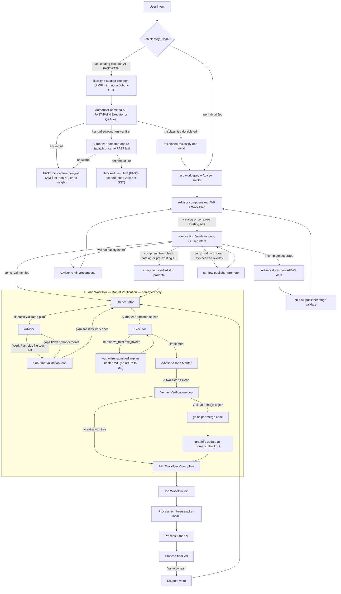
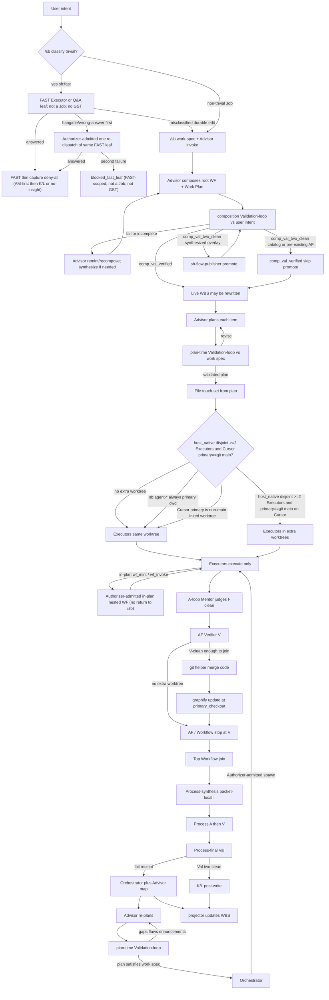

# Router Subagent Surfaces — Architecture and Design Change

This document is the specification. Repo copy [`.planning/router_subagent_surfaces_85bf9f09.plan.md`](.planning/router_subagent_surfaces_85bf9f09.plan.md) and Cursor mirror [`~/.cursor/plans/router_subagent_surfaces_85bf9f09.plan.md`](/Users/shafqat/.cursor/plans/router_subagent_surfaces_85bf9f09.plan.md) must remain byte-identical. Related brief: [`.planning/router_subagent_surfaces_85bf9f09-CLARIFY-260717-143757.md`](.planning/router_subagent_surfaces_85bf9f09-CLARIFY-260717-143757.md) (do not overwrite multi-AI `.planning/CLARIFY.md`). Where that brief contradicts this document, **this architecture spec wins**; the brief banner lists the superseded questions. User-facing terms are **Task** and **Executor**. Git and process “parent” are allowed.

## Overview

Silver Bullet’s control plane becomes one Process-first `/sb` router, a complete Workflow and Atomic Flow catalog as `sb:<route>` native-subagent surfaces, and six architectural roles. Authorizer hooks admit launches; they never invoke host `Task`. A Task-capable session starts the child. The root Orchestrator session is always Task-capable. Nested Task is allowed when the host is configured from official docs, and only for descendants whose work-spec/WBS the Task-capable ancestor Orchestrator session already persisted before this child's Task started. Any in-flight request that needs a new projector write (on-demand Advisor consult during `i_running`; any other unplanned control-plane child) uses the parent-proxy protocol even when remaining depth is numeric and greater than zero. When remaining depth is numeric 0, or Codex stamps `host_nest_refused`, the parent-proxy protocol is mandatory for all further nesting. The Task-capable ancestor polls/consumes `$primary_checkout/.planning/sb-spawn-proxy.jsonl` on the next parent turn (or SessionStart/Stop hook that does not invoke Task) and then starts the child. After jsonl append reaches `prepared` (payload staged), the requester yields; the ancestor rebinds on that next parent turn or SessionStart (no daemon). After the spawned child completes, the Task-capable ancestor CAS-commits a completion receipt and `requester_continuation_id` on the proxy row (`launched`→`completed`), then idempotently resumes the requester (`completed`→`resumed`; same continuation + same receipt returns the same ack; fail-closed `blocked_callback_unresolved` if Cursor cannot rebind; same Process; no daemon). After the spawned child fails, or after crash-reconcile fails the child, the ancestor CAS-commits an Authorizer-acked `failure_receipt_id` (`launched`→`failed`; not the success `completed` path), then idempotently resumes the requester (`failed`→`resumed`; same continuation + same failure receipt returns the same ack; ADM-01 / EFF-01 / CORR-17). Do not leave the requester yielded without a terminal. Failure does not use `completed(outcome=failed)` as a second protocol.

Ordinary delivery is Process-first then Advisor-first and one-way: `/sb` Process resolve/wrap classifies intent and, for **non-trivial** work, mints a Job plus **work-spec + Advisor invoke**; Advisor composes the wrapping user-intent Workflow (static catalog WF or dynamically composed WF from existing AFs; synthesize new AFs/WFs when **non-trivial** intent cannot be covered at 100%). Orchestrator does not invent WFs. **Classified-trivial** (Q&A / one-shot explain / no durable product edit) reuses shipped catalog wrapping Workflow `sb:fast` (`WF-SILVER-FAST`) owning `AF-FAST-PATH`; the whole `sb:fast` surface is this class. **This ship overlays** those catalog IDs so generation cannot emit the old V-loop/composition obligations for classified-trivial (exemption in `scripts/check-apo-invariants.py` **and** the generators — do **not** JSON-edit `AF-FAST-PATH` / `WF-SILVER-FAST`; the FAST collision change lives in generator `PROCESS_PACK_DEFS` (`PP-SB-STARTUP-FAST.override_rules[0]` prefer `WF-SILVER-FEATURE` for 3-day greenfield), then regen — do **not** hand-edit `docs/apo-catalog.json` for that field): live composition is **`AF-FAST-PATH` only** (Authorizer-admitted Executor or deny-all Q&A leaf + FAST thin capture); catalog extra AFs (`AF-PLAN`, `AF-VALIDATE`, `AF-VERIFY`, `AF-QUALITY-GATE`, `AF-EXECUTE`) **must not run**. `PP-SB-STARTUP-FAST` must **not** map 3-day greenfield / durable product edits onto classified-trivial `sb:fast` (rewrite `override_rules[0]` so 3-day greenfield / durable edits prefer catalog `WF-SILVER-FEATURE`; fail-closed reclassify if `WF-SILVER-FAST` is selected for durable edits). Do **not** mint `AF-qa`. FAST **must not** run Advisor / Board of Advisors, composition-Val (no Validator spawn; cover is by classification, not a Val-loop), plan-time Validation-loop, A-loop Mentorship, Verification-loop, or Process-final Validation-loop. FAST is **not** a Job and **must not** appear on Global Status (GST-01): no `original_intent_hash` mint; no GST projector write. parent≠implementer: Orchestrator classifies and **catalog-dispatches** `AF-FAST-PATH` (not WF mint) but does not answer/implement; one Authorizer-admitted `AF-FAST-PATH` Executor or deny-all Q&A leaf. Remint must not enter synthesize. If the work is not actually trivial (durable product edit, multi-file change, etc.): fail-closed reclassify as non-trivial and enter the Advisor-composed Job path (that work **is** a Job and **does** hit GST). For **non-trivial** work: Composition Validation-loop (Val-loop) checks whether that Advisor-composed WF will satisfy **user intent** (fail → Advisor remints — not Executor and not `/sb` as a mint site — until `comp_val_verified`). Then Orchestrator dispatches the composition-approved work spec / validated plan, Advisor produces the Work Plan, then a plan-time Validation-loop (Val-loop) checks whether that plan will satisfy the work spec (gap analysis, flaws, enhancement feedback → Advisor revises; two-clean spirit until the plan satisfies the work spec). Executor implements the validated plan and never plans. A material plan-of-action replacement under the same `launch_id` (including after on-demand consult) re-enters plan-time Validation-loop; Executor continuation resume requires `plan_val_verified` on the **new** revision, not only `plan_revision` + plan-artifact hash. Implementation cleanliness is judged by the Advisor A-loop Mentorship after I (two consecutive A-clean rounds), not by Executor self-attestation. Quality continues through Implementation (I), Advisor Mentor (A), Verifier Verification-loop (Ver-loop) at AF and Workflow scopes, optional overlap merge of **code**, and after the **top** Workflow join: Process-synthesis packet-local I, Process-scope A two-clean, Process-scope Verification two-clean, then **Process-final Validation** once at Process roll-up against original user intent. If Process-final Validation does not satisfy original intent, a Validation-loop starts with the Advisor, who re-plans to address the gaps (then plan-time Validation-loop again, then implementation as this quality order requires). Inner nested Workflow joins stop at Verification; they are not Process-scope. AF and Workflow do Verification (spec check), not product Val.

A hook projector is the only writer of WBS, packet, work-spec, and plan-artifact files; launch adapters persist those artifacts only by invoking `hooks/lib/wbs-projector.sh`. `hooks/lib/orchestrator-admission.sh` must **not** write packet files itself; it **requests** `hooks/lib/wbs-projector.sh` (sole allowlisted packet writer) to persist `$primary_checkout/.planning/packets/<launch_id>/context-refs-snapshot/` (WS3: admission helper + projector; no second writer). Children (Advisor, Executor including Process-synthesis, Verifier, Validator) must not Edit those files; they submit role receipts that `hooks/lib/wbs-projector.sh` attests (projector-attested; not Advisor/Executor/Validator PKI — see Authorizer trust). Only the Task-capable Orchestrator session may invoke `hooks/lib/wbs-projector.sh` (receipts are inputs, not arbitrary state writes — an Executor or Advisor must not stamp `v_verified` / `val_validated`). The Task-capable ancestor Orchestrator session is the sole projector caller for all descendant packets: it writes child work-specs/WBS before spawn and on parent-proxy consume; nested Task children never invoke the projector (MVP does not launch a nested Orchestrator). Advisor plan-replacement receipts, Process-synthesis packet-local findings, and callback CAS that would land in packet/WBS paths go through the projector. Callbacks that are not packet files may use the session store `~/.silver-bullet/projects/<repo-id>/` without the projector. Spawn-proxy jsonl is not a packet file: child append and ancestor CAS-consume both go through `hooks/lib/sb-spawn-proxy.sh` (not raw Edit/Write). Both helpers take `primary_checkout` (absolute path) as the **sole write root** for `.planning/` artifacts; writes never land in a worktree copy of `.planning/`, `graphify-out/`, `.agentmemory/`, `.sb/`, or project `.silver-bullet/`. Missing `primary_checkout`, or a write-root that does not equal `$SB_PRIMARY_CHECKOUT` (process env `$SB_PRIMARY_CHECKOUT` when set is the primary even when it is not git's main worktree; git main-worktree is fallback only when env is unset), is fail-closed: the helper does not write (LLM envelope path alone is not sufficient). Parent-guard allowlists the projector on WBS/packet paths, the spawn-proxy helper on `$primary_checkout/.planning/sb-spawn-proxy.jsonl` (staging payload files ride the requesting child's helper-with-`primary_checkout` fence), and the merge helper on worktree code paths. Children invoke `hooks/lib/sb-spawn-proxy.sh` with `primary_checkout` from the launch envelope (jsonl plus helper-owned hash-bound staging payload files under `$primary_checkout/.planning/`); they submit projector-attested role receipts and do not invoke the projector. Bash to the spawn-proxy helper is allowed for that purpose. Extra worktrees exist only for `host_native` when Advisor plan touch-sets are disjoint and at least two Executors will run and, on Cursor / hosts without descendant env inheritance, operator primary == git main-worktree (else same-tree isolation only); the TAT heuristic does not create worktrees for `/sb:agent-*` runtimes. The default is the same tree. Code may live in overlap worktrees. Extra `host_native` worktrees omit a writable copy of the **ledger-omit directories**: `.planning/`, `graphify-out/`, `.agentmemory/`, `.sb/`, and the project `.silver-bullet/` directory (not `~/.silver-bullet/`). Creation uses sparse-checkout to omit those directories. Children must not Edit or Write those paths except helpers invoked with `primary_checkout`. After five-tool opt-in, Graphify `query` / `path` / `explain` / `update` / export, agentmemory export, and PreToolUse/PostToolUse gates (`graphify-gate`, `agentmemory-gate`, `rtk-gate`, `context-mode-gate`, `leanctx-gate`, `token-compression-tools-gate`) use `$primary_checkout` as the tool/index root, not session cwd. Session-start on the Task-capable ancestor exports process env `SB_PRIMARY_CHECKOUT` for subsequent hooks in that ancestor session (not a documented descendant Task env; extra-tree child bind is env or `rt_git_main_worktree_root`; LPS-01 must not fail solely on missing descendant env when main-worktree resolves; on Cursor extra-tree isolation requires operator primary == git main-worktree so the env-unset fallback **is** primary (if operator primary is a non-main linked worktree, TAT does not create extra trees — same-tree isolation only; do not invent a Cursor Task env API); hooks bind to primary from env or git main-worktree, not the LLM envelope). Per-child `SB_WORKTREE_CWD` is not required in process env. If five-tool is opted in at that primary and the gate cannot resolve process env `SB_PRIMARY_CHECKOUT` when set, else cannot resolve `rt_git_main_worktree_root` (git main-worktree is fallback only when env is unset), the gate blocks — it does not skip on a missing local `.silver-bullet.json` walk from extra-tree cwd — process env `SB_PRIMARY_CHECKOUT` (or alias not pointing at extra-tree) **is** the primary even when it is not git's main worktree; git main-worktree (`rt_git_main_worktree_root`) is fallback **only when env is unset**; extra-tree cwd still must not win — that env-or-fallback always binds the five-tool / projector / spawn-proxy root even when extra-tree cwd still has `.silver-bullet.json` + `silver-bullet.md`; PWD config walk must not win. `hooks/lib/sb-project-gate.sh` honors `SB_PRIMARY_CHECKOUT` (and existing `SILVER_BULLET_PROJECT_ROOT` as an alias of `SB_PRIMARY_CHECKOUT` (when set, that path is the primary even when it is not git's main worktree; git main-worktree is fallback only when env and alias are unset); if the alias points at an extra-tree (heuristic overlap worktree) path, treat it as unset and do not bind extra-tree) before PWD. Skip = no deny JSON + exit 0. Block = existing `emit_block` deny JSON + exit 0 (Cursor PreToolUse) / exit 2 (Kay). ERR trap must not swallow primary-root resolution on `hooks/graphify-gate.sh`, `hooks/agentmemory-gate.sh`, `hooks/rtk-gate.sh`, `hooks/context-mode-gate.sh`, `hooks/leanctx-gate.sh`, `hooks/token-compression-tools-gate.sh`, and `hooks/stack-compression-coordinator.sh` (after `sb_find_project_config`, those entrypoints must not keep a copy-paste PWD walk that can skip/bind extra-tree; resolution errors block when five-tool is opted in, not skip). Invert `scripts/lib/recommended-tools/graphify-worktree.sh` (`rt_git_main_worktree_root` in `scripts/lib/recommended-tools/common.sh` fail-closes (empty / error) instead of returning extra-tree `rt_git_toplevel`; `rt_graphify_worktree_root` uses `$SB_PRIMARY_CHECKOUT` then `rt_git_main_worktree_root` — never extra-tree `rt_git_toplevel`; build-index uses that inverted root only; never create worktree-local `graphify-out/`; every `RT_PROJECT_ROOT` assignment under `scripts/` (including `scripts/lib/recommended-tools/`, `scripts/install-leanctx-sb.sh`, `scripts/reconcile-recommended-tools.sh`, `scripts/optimize-five-tool-stack.sh` (LeanCTX opted-in five-tool orchestrator; it may invoke `scripts/optimize-rtk-context-mode.sh` as the RTK+CM sub-step), and `scripts/optimize-rtk-context-mode.sh` (RTK+CM-only)) uses `$SB_PRIMARY_CHECKOUT` then `rt_git_main_worktree_root` — never extra-tree PWD / `show-toplevel` — not only graphify+agentmemory mkdir; `hooks/session-start` passes primary root into session-verify, not extra-tree PWD; `probe-agentmemory.sh` and similar must not `mkdir` `.agentmemory/`, `.silver-bullet/`, or `.sb/` usage stamps in the extra tree — use `$SB_PRIMARY_CHECKOUT`; repair does not materialize `graphify-out/` in the extra tree). Named red test (required hook unit tests for this file; other hook tests remain optional): `tests/hooks/test-graphify-gate.sh` extended or `tests/hooks/test-worktree-primary-checkout-gates.sh`. Cases: (1) extra-tree cwd + env `SB_PRIMARY_CHECKOUT` set → freshness/index at **that env path** (that path is the primary even when it differs from `git worktree list` main; extra-tree `.silver-bullet.json` + `silver-bullet.md` must not win); (2) extra-tree cwd (TAT sparse; ledger-omit directories absent) + env unset + `rt_git_main_worktree_root` resolvable → bind at git main-worktree fallback (H1: extra-tree cwd must not win; on Cursor this extra-tree case is legal only because TAT requires operator primary == git main-worktree, so fallback **is** primary; operator linked-worktree cwd with ledger-omit present is case (6), not this bind); (3) extra-tree cwd + env unset + main-worktree unresolvable + five-tool opted in at primary → deny JSON, not empty skip; (4) repair/probe do not create extra-tree `graphify-out/` (or extra-tree `.agentmemory/` / `.silver-bullet/` / `.sb/` stamps); (5) Cursor operator `SB_PRIMARY_CHECKOUT` is a non-main linked worktree → TAT does not create extra trees (same-tree isolation only); (6) operator linked-worktree cwd (ledger-omit directories present; not a TAT extra-tree) + env unset + `rt_git_main_worktree_root` resolvable and realpath-distinct from cwd → deny JSON `blocked_primary_checkout_unbound`, do not bind git main-worktree. Git main-worktree fallback (case 2) is legal only when cwd is a TAT extra-tree (sparse-checkout omits ledger-omit directories). Extra-tree cwd: deny only when both env and git main-worktree fail. Operator linked-worktree session (not extra-tree): fail closed as `blocked_primary_checkout_unbound` when env and alias are unset even if git main-worktree resolves. Graphify-gate is the oracle for the named file; all PreToolUse gates that source `sb-project-gate` share the same bind (`hooks/graphify-gate.sh`, `hooks/agentmemory-gate.sh`, `hooks/rtk-gate.sh`, `hooks/context-mode-gate.sh`, `hooks/leanctx-gate.sh`, and `hooks/token-compression-tools-gate.sh`). `hooks/lib/orchestrator-worktree-merge.sh` is code-only. Before the merge oracle, the extra-tree Executor (or merge helper) commits Authorizer-admitted product files (code-only under sparse-checkout) onto the worktree branch. Merge oracle: fail-closed `blocked_corrupt_state` if tracked diffs exist in ledger-omit paths on `merge-base..worktree-branch` (not vs live primary HEAD, which the projector keeps updating), and/or those directories or files are present on the extra-tree filesystem (untracked recreations). Then merge code-only: `git merge --no-ff --no-commit` of the worktree branch, then restore ledger-omit paths from the pre-merge primary working-tree snapshot (not HEAD; snapshot those paths before merge; `git merge` has no pathspec); after restore, `git commit` the merge (code-only) or `git merge --abort` on fail-closed oracle; every join including the first requires a clean index (no leftover `MERGE_HEAD`; `--no-ff` so a fast-forward cannot skip `MERGE_HEAD`). Never merge ledger bytes from the extra branch. After a successful extra-worktree merge, run `graphify update` (and agentmemory as needed) against `$primary_checkout` before Process-final Val and before Graphify-first on the joined tree. Split-brain detection runs before merge and before Process-final Val. WBS, packets, spawn-proxy jsonl, and admission CAS live only under `$primary_checkout/.planning/`. Every launch envelope includes `primary_checkout`; when the extra-worktree heuristic created a tree, the envelope and spawn-proxy jsonl also include `worktree_cwd` (absolute extra-tree path, distinct from `primary_checkout`). Cursor Task has neither a cwd field nor a per-child process-env field. On Cursor (and any host without per-child cwd/env): Cursor does not document process-env inheritance into Task/subagent descendants (do not invent a Cursor Task env API). Session-start on the Task-capable ancestor still exports `SB_PRIMARY_CHECKOUT` for subsequent hooks in that ancestor session. Extra-tree Cursor child bind is process env `SB_PRIMARY_CHECKOUT` when present, else `rt_git_main_worktree_root`; LPS-01 must not fail solely on missing descendant env when main-worktree resolves. On Cursor, extra-tree isolation requires operator primary == git main-worktree, so that env-unset fallback **is** primary (if operator primary is a non-main linked worktree, TAT does not create extra trees — same-tree isolation only; do not invent a Cursor Task env API). Hooks bind to primary. Per-child `SB_WORKTREE_CWD` is not required in process env; it is envelope `<<<SB_WORKTREE_CWD>>>` + work-spec `scope_bounds` + path-prefix product writes. Hooks must not parse the envelope and must not require per-child `SB_WORKTREE_CWD`. Parallel extra trees: each child's path-prefix comes from its envelope/work-spec, not from a single inherited env. When TAT fires (on Cursor, only if operator primary == git main-worktree), still create the sparse extra worktree + branch; merge still merges the extra-tree branch into primary; hooks bind tool/index root to `SB_PRIMARY_CHECKOUT` even if PWD is primary. Hosts that can set subprocess cwd/env may set cwd = `worktree_cwd` and export both `SB_PRIMARY_CHECKOUT` and `SB_WORKTREE_CWD`. Helpers always write ledger to `primary_checkout`. Missing `worktree_cwd` when that tree exists, or consume-stamped **or nested-Task-stamped** `worktree_cwd` that does not match the `launch_intent`-declared value or hashed work-spec `scope_bounds` / WBS tree assignment, is fail-closed. Process-final Validator and Val-fail repair Executor launches use cwd = `$primary_checkout` (merged result), never a leftover extra tree. Public identifiers are `sb` / `sb:` / `/sb` only.

MVP materializes the Cursor host adapter plus rename of existing agent skills, bootstrap migrate (ILM-01), live E2E on that slice, and a public `sb:review-fix-ladder` alias until Iterate exists. Codex, Claude Code, and OpenCode **host adapters** (Orchestrator as parent inside those hosts), Iterate Ladder, Levels 0–3 recovery, MIG-01 reverse-bridge / offline rollback, and PROD-01 freeze/drain sequence after MVP.

## Table of contents

- [Document control](#document-control)
- [Problem and motivation](#problem-and-motivation)
- [Goals and non-goals](#goals-and-non-goals)
- [Current system](#current-system)
- [Proposed architecture](#proposed-architecture)
- [Roles and model preferences](#roles-and-model-preferences)
- [Board of Advisors](#board-of-advisors)
- [Task, planning, and quality loops](#task-planning-and-quality-loops)
- [Dispatch, spawn, nesting, and Authorizer admission](#dispatch-spawn-nesting-and-authorizer-admission)
- [WBS, parallelism, worktrees, and shared state](#wbs-parallelism-worktrees-and-shared-state)
- [Global Status](#global-status)
- [Hosts, runtimes, five-tool, and public prefix](#hosts-runtimes-five-tool-and-public-prefix)
- [Data, hashes, trust, and CAS](#data-hashes-trust-and-cas)
- [Failure modes and blockers](#failure-modes-and-blockers)
- [Migration and rollout](#migration-and-rollout)
- [Testing and acceptance](#testing-and-acceptance)
- [Implementation workstreams](#implementation-workstreams)
- [Risks and engineering challenges](#risks-and-engineering-challenges)
- [Traceability](#traceability)

## Document control

| Field | Value |
|---|---|
| Title | Router Subagent Surfaces — Architecture and Design Change |
| Date | 2026-08-17 |
| Revised | 2026-08-17 — Round-41 **final** (Extra High re-verify Round-40 on freeze `81af8287…`: coverage MUST PASS; live-spec cite drift after Goals +2 insert: **n-1** L267 cooperative-read “same limit as L241 writes” is L243 (`expected_writes` / PreToolUse path jail), not L241 Job identity; **n-2** row-1 cycle-class resume cite is L124/L733 VALP-01 (`VAL/TST-RFL-615`), not L122 `/sb:new-workflow` / L731 KLW-01; **n-3** CORR-11 live-spec cite is L253 then L259 (composition-Val after Advisor compose), not L251 heading → L257 in-plan-mint window. KEEP REJECT intact (L598 abandonment alias — no pointer churn). Extra High **not** re-launched. Max **not** re-launched. Round-40 **final** (user lock: **100% test coverage of plan-executed change** — not repo-wide line coverage of unrelated files. Every hook/script/skill/test/docs-as-contract/projector/admission/spawn/merge/publisher/catalog/`/sb` delta this plan executes MUST have tests covering every new/changed branch, fail-closed path, KEEP REJECT lock, and row/limb behavior specified here. Map each YAML todo, each WS1–7, and each live-spec MUST to a named test file/assertion (cite Goals live-spec MUST + Testing and acceptance + `validation-tests`; owners already named: `VAL/TST-RFL-601`–`626` and named WS tests). Ship is blocked until that map is complete and green. Post-MVP IDs (Iterate, OFF-01, ITR-01, PROD-01, Levels 0–3, host adapters) stay out of this ship’s coverage mandate. Do not invent OpenCode Max. KEEP REJECT intact. Extra High **not** re-launched. Max **not** re-launched. Round-39 **final** (plan/spec leftovers on freeze `1d5c5a3c…` then this round: Extra High re-verify **n-1** L265 cooperative-read cite is L241 writes (`expected_writes` / PreToolUse path jail), not L239 Job identity; **n-2** row-1 cycle-class resume cite is L122/L731 VALP-01 (`VAL/TST-RFL-615`), not L727 ESC-01. KEEP REJECT intact. Extra High **not** re-launched. Max **not** re-launched. Round-38 **final** (plan/spec leftovers on freeze `176d0efc…` then this round: Extra High re-verify **n-1** CORR-11 live-spec cite is L251 then L257 (composition-Val), not L249→L255 heading/in-plan-mint window; **n-2** KEEP REJECT L598 abandonment-by-silence alias — no pointer churn; **n-3** L545 Catalog/lock already lock-only — no schema change. KEEP REJECT intact. Extra High **not** re-launched. Max **not** re-launched. Round-37 **final** (plan/spec leftovers on freeze `9c9aa7d9…` then this round: GPT High L4 re-verify M-1 Document-control recency — name Round-36 M-1a (canonical rows 37/40 third limb; SHA `9c9aa7d93a6fa7dd701e18528dd3d8f422cff0da47902aac4b8ac8c76ce21b06`) then Round-37; GPT High L4 first findings named ACCEPT — already in bytes from round-22: `prompt_hash` inner-only, `remaining_depth` numeric-only + Codex `unbounded` refuse-then-proxy, runtime picker includes Pi, HINST-01 OpenCode/Pi instruction-only; Opus High L4 B/H/M already in round-22 bytes + L4 re-verify CLEAN — no new rows; **n-1** drop Extra High leftover `(row 1 — cite row 1)` in live-spec restatements; **n-2** Document-control agent UUIDs are inline code, not dangling markdown links; **n-3** CORR-11 composition-Val after Advisor compose (L249→L255), not before Advisor; **n-4** two mermaid blocks are complementary (Proposed architecture vs WBS live ledger); **n-5** FAST reclassify enters `/sb` work-spec + Advisor invoke → Advisor compose → composition-Val, matching L249→L255). KEEP REJECT intact. Extra High **not** re-launched. Max **not** re-launched. Round-35 **final** (parent-accepted Opus Extra High re-verify `4d27c5bd-ddeb-4850-9b83-5ed01c5f503d` NOT CLEAN 0 Blockers / 0 Highs / 2 Mediums / 1 nit on SHA `fe219ffeffd1bdff4a16debccb2a598f81e26176fdcc905d20af3c92a51f8b2b`; all four round-34 landings PASS; round-33 limb (b) 4/4 PASS; GPT Max already CLEAN — not reopened; parent ACCEPT both Mediums and the nit: **M-1** L112/L118 (and Proposed-architecture twins) restated as L251 **two-limb** Executor mint — legal **iff** it **invokes/instantiates** (a) a Work Plan–cited WF/AF (`plan_node_id` / WBS id from the validated plan) **or** (b) a **pre-existing catalog** WF that supports that cited node; drop “new or pre-existing” as if both were equally legal at Executor mint time; L112 + L118 row-40 trigger includes **mid-I new PUB-01 definition / new catalog WF record** (not only uncited / new product scope), matching L185/L251/L253/L265/L669/L737; **M-2** second snapshot GC trigger — collect when **either** (1) `launch_id` is CAS-provably superseded **or** (2) that launch’s durable `scope_complete` / Authorizer-acked `completion_receipt_id` is CAS-recorded (still-current + not-complete retain consult / ESC-02 / same-id `plan_revision`; missing snapshot for a still-current incomplete id remains row 4; CORR-17 fence **holds**; do **not** use fence-release / child-terminality / pid liveness; do **not** revert supersession-GC; sweep L263/L433/L592/L728/L738 + L762); **n-1** `VAL/TST-RFL-626` pins fifo/socket/device, dangling symlink, symlink loop → row 4, analogous to `VAL/TST-RFL-615` cycle pins). KEEP REJECT intact. Extra High **not** re-launched. Max **not** re-launched. Round-34 **final** (parent-accepted Opus Max `0723e455-5bf0-432f-9b26-7afe619b7db8` NOT CLEAN 1 High / 2 Mediums / 1 nit on SHA `ebd7ad9e499c34e669f8317fcc25715bdfab12a4ef5ed97ac14df6152575ae5e`; Extra High and GPT Max already CLEAN — not reopened; parent ACCEPT H-1, M-1, M-2, and the specified nit: **H-1** snapshot GC / drop retention when `launch_id` is CAS-provably superseded *[superseded round-35 for sole-trigger reading: second GC trigger is CAS-recorded durable `scope_complete` / `completion_receipt_id`; supersession-GC stays; still-current + not-complete retain]* (replacement `launch_id` admitted; CORR-17 fence on the old id **holds** — collect **because** superseded, not because fence released; do not wait for fence release or child terminality / process-death; still-current id still survives parent-proxy consult continuation / ESC-02 re-dispatch / `plan_revision` under the same id; missing snapshot for a still-current id remains row 4 / corrupt; sweep L263/L433/L592/L728/L738; `VAL/TST-RFL-626` owns still-current-id retain / CAS-supersession GC); **M-1** L511 WBS/parallelism diagram Executor mint edge is **in-plan** (cited `plan_node_id` / validated Work Plan; match L156; Orchestrator/`/sb` still do not mint WFs); **M-2** non-regular snapshot entries at admit (fifo/socket/device, dangling symlink, symlink loop) → exactly row 4 `blocked_launch_prompt_spec` (cannot form a valid snapshot / invalid `context_refs` for this launch; not row 1; not `blocked_corrupt_state`); **n-1** L470 WBS example "inserted in-plan NW"). KEEP REJECT intact. Extra High **not** re-launched. Max **not** re-launched. Round-33 **final** (parent-accepted Opus Extra High re-verify `aea56ad4-ca9e-46d6-9899-18b58346b5cd` NOT CLEAN 1 High / 1 nit on SHA `3af884ef7892cc93ff5d69023632cf299ec18e87ce77d30860d205b694f317a4`; M-2 and nits N-1/N-2/N-3 PASS; M-1 PARTIAL; GPT Max already CLEAN — not reopened; parent ACCEPT the High and the nit: **H-1** sweep live-spec restatements of un-narrowed limb (b) at L251 / L253 / L265 / L669 — cite row 1: limb (b) = **observable post-revoke effects** only (CORR-17 fence / attested receipt); live-but-fenced old Executor is **not** row 1; L251 WFM-01 / `VAL/TST-RFL-625` must not build a liveness/pid oracle; **n-1** supersession pointers on append-only logs (this cell round-31 limb (b) / round-30 H-3; CLARIFY L1102 / L1149) — do not rewrite history). KEEP REJECT intact. Max **not** re-launched. Extra High **not** re-launched. Round-32 **final** (parent-accepted Opus Extra High re-verify `d7a996e8-b213-4be9-8af6-514fac53ce0a` NOT CLEAN 0 Blockers / 0 Highs / 2 Mediums / 3 nits on SHA `a8e7a463bb1bde980ed173b9ddd32e95accf0b6902d6ae92348145f1cffad9ca`; Round-30/31 landings PASS; GPT Max already CLEAN — not reopened; parent ACCEPT both Mediums and three nits: **M-1** row 1 limb (b) is **observable post-revoke effects** only (write/callback/effect attempts after remint that hit the CORR-17 fence or an equivalent attested receipt); "process/session still live" alone is **not** a row-1 match; timeout/disconnect/missing process/lease silence cannot prove abandonment (L598) and cannot prove limb (b); OFF-01 durable stopped acknowledgments remain **post-MVP**; do not require process-death as an MVP oracle; `VAL/TST-RFL-625` / WFM-01 must not treat "pid still exists" as FAIL; **M-2** canonical row-1 remediation cell states exits for cycle (Advisor remint/recompose, not store repair), revoke-before-admit (do not admit until revoke succeeds or fail-close without admitting), observable stale-Executor effects (CORR-17 fence holds; replacement `launch_id` proceeds; do not kill old process at MVP), and corrupt store / helper-write / sole-writer / CAS / split-brain (quarantine + reviewed repair) plus route-id collision (non-colliding route id); **N-1** one canonical citation `VAL/TST-RFL-604`; **N-2** `context_refs_hash` explicit not-a-`prompt_hash`-input carve-out (parity with `worktree_cwd` / `remaining_depth`; inner-only lock unchanged); **N-3** VALP-01 traceability includes `VAL/TST-RFL-615` self/mutual/shared-DAG cycle fixtures). KEEP REJECT intact. Max **not** re-launched. Extra High **not** re-launched. Round-31 (parent-accepted GPT Max re-verify `fb24bc26-df23-496d-8fc3-9027d95966c1` NOT CLEAN 1 High on SHA `c1868fa31a9e424997ae9994376bac5d27e3f6886f74509c4f2717b21f36a93e`; parent ACCEPT: canonical row 1 independently matches (a) failure to complete revocation of the old `launch_id`'s Authorizer-bound lease / capabilities / callbacks / expected writes/effects before replacement admission and (b) any evidence the old Executor remains running after remint (process/session still live, still attempting writes/callbacks/effects) regardless of whether revocation succeeded — same as other helper-write / sole-writer violations *[superseded round-33: limb (b) = observable post-revoke effects only; live-but-fenced is not row 1]*; not a new row; not row 4; pin both cases in `VAL/TST-RFL-625` / WFM-01; **and** Opus Extra High re-verify `a5d48a6d-3f9e-40fc-8799-b21d315c3acd` HASH MISMATCH mid-write `b062dc1c…` / `a007c83a…` with H-1 Proposed architecture L122 `definition_closure_hash` walk MUST terminate via a visited-set → DFS **recursion-stack / tri-color** (visited-set alone is **not** sufficient; GRAY back-edge → row 1; two parents one child WF PASS; self-cycle FAIL, mutual-cycle FAIL, shared-DAG PASS; pin `VAL/TST-RFL-615`) + H-2 L120 generated-template `context_refs_hash` **may be omitted** on `launch_intent` (omit is **not** row 4 at submit; projector stamps at admit; row-4 omit/mismatch **after stamp** vs recompute of **snapshot bytes**; do not require templates to pre-hash live files)). Round-30 landings present. Max **not** re-launched. Extra High **not** re-launched. Round-30 (parent-accepted GPT Max re-verify `74906da9-cc19-403d-b036-a6eae3e725de` NOT CLEAN 0/3/1 on SHA `9a173a53f04eec56bc139d1e1ae67f7cdc3c0530a9860f71e6253a67e346e7be` **and** Opus Extra High re-verify `99a0dd63-44bb-4e09-b2e7-6ffd2be3e1f4` NOT CLEAN 1/3/2 on the same SHA; parent ACCEPT GPT Max H-1 `orchestrator-admission.sh` **requests** `hooks/lib/wbs-projector.sh` to persist `$primary_checkout/.planning/packets/<launch_id>/context-refs-snapshot/` (admission must **not** write packet files; no second writer) + H-2 DFS **recursion-stack / tri-color** cycle detection (visited-set termination cannot tell a back-edge from legal shared-node DAG/diamond; fixtures: self-cycle FAIL, mutual-cycle FAIL, shared-DAG PASS; `blocked_corrupt_state` on cycles; pin `VAL/TST-RFL-615`) + H-3 remint **revokes** the old `launch_id`'s Authorizer-bound lease, capabilities, callbacks, and expected writes/effects **before** admitting the replacement (CORR-17 conflicting reuse of the old id stays blocked; still-running old Executor after remint is `blocked_corrupt_state` row 1 *[superseded round-33: limb (b) = observable post-revoke effects only; live-but-fenced is not row 1]*) + M-1 `VAL/TST-RFL-626` negative fixture (child **cannot** consume mutable live `context_refs` after admission — only the snapshot; hash/existence alone is insufficient) **and** Opus B-1 same projector sole-writer (amend every sole-writer / allowlist / “sole writers unchanged — admission **requests** the projector and is **not** a second packet writer” / row-1 helper-write contradiction; do **not** carve admission as an extra allowlisted packet writer) + H-1 `context_refs_hash` stamp vs compare (launcher may omit; at admit projector copies live refs then stamps SHA-256 of the snapshot encoding; admission does **not** row-4 on pre-admit live-doc drift — refresh is re-copy + re-stamp; row-4 after stamp is consume/nested hash vs **recompute of durable snapshot bytes**, not live files; do not self-satisfy hash-then-compare the snapshot just written; do not require the launcher to pre-hash live files) + H-2 live-file read is a **cooperative** child obligation (prompt/receipt binds snapshot paths; Verification-loop detects; `VAL/TST-RFL-626` proves bound prompt/receipt cites snapshot paths **and not** live `context_refs` paths — not a PreToolUse Read jail Cursor Task cannot deliver, same limit as L239 writes) + H-3 lock emitter is `scripts/generate-router-contract-locks.py` (WS1 named source surface + L746 named regen; L175 that script emits the two lock files; hand-authored `nested_executor` table stays hand-authored; `tests/scripts/test-router-contract-locks.sh` remains create-it + committed-locks baseline) + M-1 snapshot encoding **regular files only** (follow symlink once to regular-file contents, store a regular file — no symlink left in the snapshot tree; non-regular / dangling / symlink-loop → row 4 / `blocked_corrupt_state` *[superseded round-34: exactly row 4 `blocked_launch_prompt_spec`; not row 1 / not `blocked_corrupt_state`]*; hash covers stored regular-file bytes, never a link string) + M-2 snapshot GC tied to resumability (survive while `launch_id` is resumable — parent-proxy consult continuation, ESC-02 re-dispatch, `plan_revision` under the same id; GC only after fence release **and** child terminality; missing snapshot for a still-resumable id is row 4 / corrupt, not successful GC *[superseded round-34: GC when `launch_id` is CAS-provably superseded; CORR-17 fence holds; do not wait for fence release or child terminality; still-current id retains; missing still-current snapshot remains row 4]*). Round-29 landings present. Max **not** re-launched. Extra High **not** re-launched. Round-29 **final** (parent-accepted GPT Max re-verify `bea156bd-36ca-4c24-bd70-4a891bc77031` NOT CLEAN 0/3/1 on SHA `aa3677a5531797f59465a1370b1909fb5c696a42067546b3b4f99f3ac4c5b30c`; parent ACCEPT H-1 unlimited NW nesting is a **tree** (self/mutual WF cycles → row 1 `blocked_corrupt_state`; `definition_closure_hash` visited-set walk MUST terminate; Composition-Val / Advisor mint that would introduce a cycle is rejected before Executor I; recursive cycles are **not** the unlimited-tree lock) + H-2 admission **recomputes** the current recursive closure and **compares** to `launch_intent.definition_closure_hash` / `composition_generation` (presence-only insufficient; omit **or mismatch** → row 4) + H-3 immutable `context_refs` snapshot at `$primary_checkout/.planning/packets/<launch_id>/context-refs-snapshot/` is the child read source (`context_refs_hash` = SHA-256 of specified canonical bytes; consume/nested-Task compare hash **and** snapshot exists; TOCTOU on live docs after admit is not a valid read; not live AM dumps) + M-1 SHA ledger (backfill round-28 final `aa3677a5…`; `caa36067…` is round-29 GPT-only mid-write, **not** the finished freeze). **And** Opus Extra High re-verify `8ed1bc81-2e08-48d8-9032-a0bc239fb5a6` HASH MISMATCH mid-write `caa36067…` with B-1 lock files via a **named generator** (hand-authored `nested_executor` table; `tests/scripts/test-router-contract-locks.sh` (**create it**); first ship generated locks **are** the baseline) + H-1 composition remint **mints a new `launch_id`** (same exception class as Val-fail 9a–9c / Process-scope dirty; admission payload includes `definition_closure_hash` + `composition_generation`; CORR-17 fence on the old `launch_id`) + M-1 WS3 owns `hooks/lib/orchestrator-admission.sh` writing `$primary_checkout/.planning/packets/<launch_id>/context-refs-snapshot/` + `VAL/TST-RFL-626` (extend LPS-01) for hash + snapshot existence (cited job-relevant refs only; GC = packet lifecycle). This freeze is round-29 **final**. Round-28 landings present. Max **not** re-launched. Round-28 (parent-accepted GPT Max re-verify `9886413d-5f6c-4b07-80fe-07337d0afd44` H-1 Authorizer-admitted `launch_intent` **requires** `definition_closure_hash` + `composition_generation` (omit → row 4 `blocked_launch_prompt_spec`) + H-2 `definition_closure_hash` is recursive over root WF + every nested WF + their AFs + H-3 job-relevant `context_refs` snapshotted/`context_refs_hash` on `launch_intent` (stale/mutated → row 4; not live AM dumps), **and** Opus Extra High re-verify `fa369f39-73a1-402d-8635-37d12fa2576d` HASH MISMATCH mid-write `5463fc19…` with H-1 one `ART-AGENT-DELEGATE` via named emitters + H-2 `WF-SILVER-ROUTER` slug/`owning_skill` → `sb` + M-1 `PP-SB-STARTUP-FAST.workflow_refs` FEATURE-first, on SHA `60cf413ddac0cbcb80073e776dd0f6d9d56302002d3a2019a682fbb5060410de`; round-27 FAST/row-40 residue landed; reviewer sandboxed `build_catalog()`). Round-27 (parent-accepted GPT Max re-verify `368dc0a1-4e7b-4662-b0f8-f2e398ca76dc` leftover H-1 FAST always-`memory_save` + H-2 row 40 recovery/admission bind, and Opus Extra High re-verify `942927ab-f98e-4101-aafa-17c7be8b417b` B-1 `DELEGATE_STEP_DEFS` + B-2 FS-* rename-together + H-1 `PRECOMPOSED` + M-1 FAST `PROCESS_PACK_DEFS` then regen, on SHA `ac500b960f2ade792b4cc97f542986e39582bae9a295e8be8a9cca6f2955974b`; unpropagated round-26 residue + generator-sandbox findings, not new product). Round-26 (parent-accepted GPT Max re-verify B-1 mid-I `wf_mint` vs PUB-01 + H-1 Executor role table + M-1 FAST AM skip + M-2 `PP-SB-DEFAULT` vs PUB-01, and Opus Extra High re-verify B-1/H-2 reconcile-before-regen + H-1 stop stripping OpenCode/Pi + M-1 inline AF V-loop, on SHA `701cc66466830161476597af35606168377acb2437088fb86787eec0f6fcc884`): Executor mid-I `wf_mint` may **invoke/instantiate** a Work Plan–cited WF/AF (`plan_node_id` / WBS) **or** a **pre-existing catalog** WF that supports that cited node; creating a **new PUB-01 definition / new catalog WF record** mid-I is **out of plan** → row 40 → Advisor re-compose + composition-Val + plan-time Val **re-bind** the closure before Executor resumes (Executor admission of the replacement revision is bound to current `definition_closure_hash` / `composition_generation` or equivalent named stamps; a resume that does not carry the re-bound closure is not admitted; do not run an unbound new definition during I; PUB-01 / composition-Val remain **before Executor I** for the bound set; WFM-01 / `VAL/TST-RFL-625` owns the fixture). Executor role table **may** invent/instantiate **in-plan** nested WFs (plan-cited or pre-existing catalog) and **must not** invent new product-scope / new PUB-01 definitions (Advisor) — blanket “forbids invent a new WF” is wrong. FAST thin-capture tests **must not** require `memory_save` when AM is not opted in (AM opted in → `memory_save` then classify/promote; AM not opted in → `kl_write_am_skipped`). `PP-SB-DEFAULT` / `generate-apo-catalog.py` must not forbid PUB-01 project/global synthesized flows as illegal extra-catalog AFs (emit into catalog/lock or a named overlay the checker accepts, **or** carve PUB-01 synthesized flows from “no local AFs outside catalog”; one explicit generator + WS1 sentence; do not drop PUB-01). WS1 ordered steps: (1) **back-port** the committed catalog’s 3 semantic divergences into generator source (do **not** regen first); (2) then regen `docs/apo-catalog.json`; (3) then `--check` / parity gate. Named: `check-apo-invariants.py worker-template-parity`, `AF-MULTI-AI-TASK.execution.worker_template`. Intended truth for `worker_template`: `templates/orchestrator-workers/MULTI-AI-TASK.md` (committed + parity). Fix `ATOMIC_SPECS` (today `skills/silver-multi-ai-task/SKILL.md`) and/or `merge_multi_ai_catalog()` so regen **sets** `worker_template` to that templates/ path and does **not** emit `SKILL.md`. In `apo_delegate_catalog.py`: **remove** the strip of `AF-AGENT-DELEGATE` from `FS-SILVER_AGENT_OPENCODE` / `FS-SILVER_AGENT_PI` `reusable_by_flows`; add those steps to `DELEGATE_FLOW_STEP_ORDER` **and** `DELEGATE_STEP_DEFS` in the **same** step (`build_delegate_flow_steps` indexes `DELEGATE_STEP_DEFS[step_id]`; adding ORDER without dict entries is `KeyError`). Name `DELEGATE_STEP_DEFS` and `build_delegate_flow_steps` / `merge_delegate_catalog` overwrites (~186/212 in `apo_delegate_catalog.py`) — **not** generic `build_flow_steps` in `generate-apo-catalog.py`. Intended `skill` / `purpose` / `classification` for `FS-SILVER_AGENT_OPENCODE` / `FS-SILVER_AGENT_PI` **mirror** `FS-SILVER_AGENT_{CODEX,CURSOR,CLAUDE}` (same classification family; skill = opencode/pi agent skill; purpose = catalog-backed step in `AF-AGENT-DELEGATE`). `SKILL_TO_FLOW` mapping to the AF must **agree** with merge (no map-then-detach). There are **zero** `VL-FS-DELEGATE-*` top-level records; patch the **inline** `AF-AGENT-DELEGATE.v_loop.verification.artifact_refs` to `["ART-AGENT-DELEGATE"]` (not the top-level `v_loops[]` stub; sibling comparison = already-attached cursor/codex/claude **step** V-loops / `ART-AGENT-DELEGATE`). Prior same-day Round-25 (parent-accepted GPT Max H-1 WS1 owns `scripts/lib/apo_delegate_catalog.py` + `scripts/lib/apo_multi_ai_catalog.py` (`/silver:*` / `$silver:*` → `/sb:` / `$sb:`), and Opus Extra High re-verify B-1 catalog is generated + H-1 one `ART-AGENT-DELEGATE` (hyphen) + M-1 OpenCode/Pi `artifact_refs` = `ART-AGENT-DELEGATE`, on SHA `1096479c…`): WS1 **owns** `scripts/lib/apo_delegate_catalog.py` and `scripts/lib/apo_multi_ai_catalog.py` as named source surfaces (same regenerate-mirrors-only-through-the-named-command discipline); those libs still emit `/silver:*` and `$silver:*` and **must** retarget to public `/sb:` / `$sb:` (or the post-rename token the rest of generation uses) so generated artifacts do not advertise `/silver` public routes. `docs/apo-catalog.json` is **emitted** by `scripts/generate-apo-catalog.py` (`build_catalog()` overwrite) — stop treating it as a hand-edit SOT for this ship’s field changes; all catalog mutations this ship needs (OpenCode/Pi triggers, owning_skills, flow_steps, owning_skill, `skill_to_entity`, FAST `PP-SB-STARTUP-FAST.override_rules[0]`, public trigger `/sb` not `/silver`) live in **generator source**: `SKILL_TO_FLOW`, `ROUTERS`, `ATOMIC_SPECS`, `build_workflows()`, `merge_delegate_catalog()`, `PROCESS_PACK_DEFS`, plus those two libs. WS1 **names** `generate-apo-catalog.py` as regenerate command for the catalog itself (not only `generate-apo-artifacts.py`). Add a **parity gate**: `--check` and/or a test that `docs/apo-catalog.json` matches generator output (today `tests/scripts/test-apo-catalog-sot.sh` does **not**). Uncommitted generator output is not authority **after** regen; the **source** is the Python builders. `SKILL_TO_FLOW` / `ROUTERS = {"silver", ...}` **must** accept post-rename `sb` / `sb-init` / `sb-new-workflow` / `sb-agent-*` or the first regen **aborts** — name those maps as WS1/WS2 rename surfaces. `WF-SILVER-ROUTER.triggers` must not mint public `"/silver"`; public trigger is `/sb` (catalog **id** may stay `WF-SILVER-ROUTER`). Also retarget **`slug`** and **`owning_skill`** off `"silver"` to the renamed `skills/sb` skill (`sb`); a post-rename dangling `owning_skill: "silver"` is **in scope**; add or name a `check-apo-invariants.py` `owning_skill` check for this record (or all workflows this ship retargets); sibling `WF-SILVER-NEW-WORKFLOW` already has to-be slug/owning_skill — same discipline. Drop/stop emitting duplicate `ART-AGENT_DELEGATE` (underscore); inline AF `v_loop.artifact_refs` stays `["ART-AGENT-DELEGATE"]`. **Do not only** change `ATOMIC_SPECS` slug `AGENT_DELEGATE` → `AGENT-DELEGATE` (that plus `merge_delegate_catalog()` append yields two same-id records with conflicting `path_pattern`); name the real emitters: `build_catalog()` artifacts comprehension (`f"ART-{slug}"`), `build_atomic_flows()` `artifact_refs`, `merge_delegate_catalog()` append (~line 190). **Exactly one** `ART-AGENT-DELEGATE` survives (hyphen; host-path pattern is the intended truth unless documented otherwise). Add `check-apo-invariants.py` **artifact-id uniqueness**. `v_loop.verification.artifact_refs` ⇄ AF `artifacts` for this AF (`check-apo-invariants.py` must see it). `FS-SILVER_AGENT_OPENCODE` / `FS-SILVER_AGENT_PI` `verification.artifact_refs` must be `["ART-AGENT-DELEGATE"]` like cursor/codex/claude — not `skills/.../SKILL.md`; catalog path strings into dirs this ship renames are **generator-owned** (`f"skills/{name}/SKILL.md"`) and heal on regen **if B-1 regen is required**; name those `artifact_refs` / `artifact_or_tool_ref` fields as in-scope for the rename. Tests that pin hyphen `ART-AGENT-DELEGATE` include `tests/scripts/test-agent-delegation-catalog-contract.sh` (must not accept the underscore duplicate); `scripts/validate-host-agnostic-core.sh` lists `scripts/lib/apo_delegate_catalog.py`. Prior same-day Round-24 (parent-accepted GPT Extra High re-verify H-1 nested-Task `worktree_cwd` + H-2 Doctor vs inspect-only + M-1 GST tombstones beyond N-1, and Opus Extra High re-verify H-3/H-4/M-3, on SHA `c82e1b3b…`): WS1 **owns** regenerating `scripts/generate-apo-artifacts.py` (and `--check` / `derived-views`) plus `docs/composable-flows-contracts.md` / `docs/workflow-composition-matrix.md` / `docs/generated/atomic-flow-index.json` / `tests/scripts/test-apo-derived-views.sh` / `tests/scripts/test-apo-composition-sot.sh` after any catalog / `migration_map` / `owning_skills` / `runtime_queue_tokens` edit this ship makes (unnamed mirrors going stale is a WS1 miss). WS1 (and WS6 if instruction text) **retargets** hardcoded `silver:` public routes in `POST_EXEC_SEQUENCING_LINES` (or equivalent) in `scripts/generate-apo-artifacts.py` and in `tests/scripts/test-instruction-flow-parity.sh` (P0-4 three-way: `silver-bullet.md` / `templates/silver-bullet.md.base` / `docs/composable-flows-contracts.md`), `tests/scripts/test-silver-router-flow-contracts.sh`, `tests/scripts/test-apo-catalog-sot.sh` — generated docs must not advertise `/silver` public routes; catalog ids `WF-SILVER-*` may remain; public prefix is `/sb`. WS1: `AF-AGENT-DELEGATE.flow_steps` ⇄ `reusable_by_flows` on `FS-SILVER_AGENT_OPENCODE` / `FS-SILVER_AGENT_PI` (and other delegation steps) must agree; add/require an invariant in `check-apo-invariants.py` for this AF. `tests/run-all-tests.sh` remains the release gate and is **named** in WS1. nested-Task of pre-persisted descendants (no parent-proxy consume) **declares/stamps/compares** `worktree_cwd` against hashed `scope_bounds`/WBS tree (mismatch → row 4; stale/tampered cwd must not bypass row 4 because consume never ran). Init/Doctor/SessionStart **MAY write** HNEST-01 max-nesting knobs and HINST-01 install-ensure (idempotent; skip if already at max / already installed); “inspect-only” / do-not-write applies to **unrelated** IDE prefs (model, telemetry, permissions, maxTurns, experimental teams) — not those two mandated writes; row 1 / Doctor language that says Doctor never writes is scoped. GST Completed/Blocked tombstones must not expire after two UTC rollovers; projector consults **historical day files that still exist** (or a durable tombstone index) for that `gst_row_id`, not only current + previous day; stale Active retry must not resurrect a terminal row (`VAL/TST-RFL-621`). Prior same-day Round-23 (parent-accepted GPT Extra High H-1 `worktree_cwd` declare-at-admit / stamp-at-consume + Opus Extra High B-1/H-1/H-2/M-1/M-2 on SHA `67eff63e…`): `worktree_cwd` is envelope metadata (not inner-prompt bytes; not hashed into `prompt_hash`); Authorizer `launch_intent` **declares** it (absolute path / tree id matching hashed `scope_bounds` / WBS tree); ancestor stamps at consume to the declared value (mismatch vs admit or vs hashed `scope_bounds`/WBS tree → row 4). **Actual** post-spawn `remaining_depth` is **computed** from host nesting (hops-below-main after spawn, or Codex refuse → `host_nest_refused`); consume and nested-Task launch **compare computed vs declared** (mismatch → row 19). Ship-wide `silver`→`sb` directory rename owns `migration_map.skill_to_entity` rekeys + `canonical_alias_mapping` + `agent-delegation-contract` expected names + `runtime_queue_tokens` / `workflow-chain-guard` / `triple_alignment` retarget for dirs this ship renames. Named field changes only: `WF-AGENT-DELEGATE-ENTRY.triggers` include `agent-opencode`/`agent-pi`; `AF-AGENT-DELEGATE.owning_skills` include OpenCode/Pi agent skills; attach `FS-SILVER_AGENT_OPENCODE` / `FS-SILVER_AGENT_PI` to `AF-AGENT-DELEGATE.flow_steps`; bind `WF-AGENT-DELEGATE-ENTRY.owning_skill` to a real skill dir + `skill_to_entity` key (no dangling `silver-agent`). `nested_executor` is lock-only (`contracts/apo-hierarchy.lock.json` / `public-workflow-routes.lock.json`), not a catalog JSON field. Schema unchanged; no second agent-delegate AF/WF. Prior same-day Round-22 (parent-accepted GPT High NOT CLEAN + Grok High CLEAN Mediums + Opus High NOT CLEAN B-1/H-1/M-1–M-3 + Kimi Extra High CLEAN M-1 on SHA `c9511f2d…aaddf`; GLM Max emitted no VERDICT; B-2 = copy-sync): **Cold `/sb:agent-*` dispatches shipped** `WF-AGENT-DELEGATE-ENTRY` / `AF-AGENT-DELEGATE` / `VL-AF-AGENT-DELEGATE` / `ART-AGENT-DELEGATE` / `FS-DELEGATE-*` (do **not** add a second wrap; `sb:agent-wrap` is an alias). `nested_executor` is the five `/sb:agent-*` **leaf** class, not the WF/AF record type. WS1 completeness scoped to records this ship changes. `router-coverage` keep; retain `WF-SILVER-ROUTER` / `AF-ROUTE`; public `/sb`. Val **step** (not column) at Process-final. **`prompt_hash` binds inner prompt bytes only** (immutable at `prepared`); `remaining_depth` / `worktree_cwd` are envelope metadata (not inner-prompt bytes; not hashed into `prompt_hash`); Authorizer `launch_intent` **declares** post-spawn `remaining_depth` (numeric hops or Codex `unbounded`) **and** `worktree_cwd` (absolute path / tree id matching hashed work-spec `scope_bounds` / WBS tree assignment; omit when cwd is the primary checkout); **actual** post-spawn `remaining_depth` is **computed** from host nesting (hops-below-main after spawn, or Codex refuse → `host_nest_refused`); consume (and nested-Task launch, which has no consume) **compares computed vs declared** and stamps envelope/jsonl to the declared value only when they match (no re-hash; `remaining_depth` mismatch → row 19 `blocked_depth_unsupported`; `worktree_cwd` mismatch vs admit or vs hashed `scope_bounds`/WBS tree → row 4 `blocked_launch_prompt_spec` — stale/incorrect cwd must not retain valid hashes + admission). Remaining-depth `0` / `> 0` comparisons are **numeric-only**; Codex `unbounded` is never integer 0 (refuse-then-proxy + `host_nest_refused`). Runtime picker lists include Pi (plus conditional Goose/Hermes). HINST-01: installable Cursor/Codex/Claude get SB install/repair; OpenCode/Pi are instruction-only (no plugin in every `/sb:agent-*` target). YAML overview parent-proxy = numeric 0 **or** `host_nest_refused` **or** in-flight projector write. Both mermaids: catalog / pre-existing-AF `comp_val_two_clean` → `comp_val_verified` skip-promote. Prior same-day Round-21 (parent-accepted Max CLEAN on SHA `5eba7e86…95216`, M-1–M-2 / L-1): public route is `/sb:new-workflow` (skill/command/help/test slug `sb-new-workflow`); `/silver:new-workflow` / `silver-new-workflow` are historical only (same gloss as `skills/sb/` vs `skills/silver/`); WS2 ships `skills/sb-new-workflow/SKILL.md` (historical `skills/silver-new-workflow/SKILL.md`) via the ship-wide `silver`→`sb` rename — no dual `/silver` window. Row 37 is non-Advisor mint without Authorizer admit / role permission that is **not** the out-of-plan Executor case (uncited `plan_node_id` / new product scope **stays row 40**) and **not** Orchestrator (**stays row 39**); WFM-01 three fixtures remain distinct. Frontmatter capability-contract todo: delete the adjacent duplicate Codex `unbounded` parenthetical. Authoring generator + authoring Job + Advisor compose stay. Prior same-day Round-20 (parent-accepted Extra High CLEAN on SHA `b673de8c…40c18`, M-A–M-C): row 42 **includes** a non-parent **spawn target** (e.g. parent Cursor, target Codex); “sibling-host install fail is a doctor warning” means a **third** host that is **neither** parent **nor** spawn target — a spawn-target install fail stays row 42 (not a warning, not row 22). `WF-SILVER-NEW-WORKFLOW` resolve is **Advisor-compose-gated** (work-spec + Advisor invoke); keep `type: precomposed` but that type does **not** mean skip-Advisor; catalog dispatch of this already-existing id without Advisor is row 39. WS2 retires the queue-builder in **source** [`templates/orchestrator-workers/NEW-WORKFLOW.md`](templates/orchestrator-workers/NEW-WORKFLOW.md); generated mirror [`plugins/silver-bullet/templates/orchestrator-workers/NEW-WORKFLOW.md`](plugins/silver-bullet/templates/orchestrator-workers/NEW-WORKFLOW.md) via `scripts/sync-templates.sh`; installed [`.silver-bullet/orchestrator-workers/NEW-WORKFLOW.md`](.silver-bullet/orchestrator-workers/NEW-WORKFLOW.md) follows install. Output-compliance generator bar and authoring-session-is-a-Job / Advisor-compose remain. Prior same-day Round-19 (parent-accepted Extra High re-verify on SHA `65fde3d6…c7fd8c`, H-1–H-2 / M-1–M-2): `/silver:new-workflow` **authoring session is a Job** (Orchestrator work-spec + Advisor compose + composition-Val + plan-time Val; queue-builder composition retired; authoring Job mints `original_intent_hash` / GST / WBS; `WF-SILVER-NEW-WORKFLOW` catalog record in scope). Rows 11/12 carved so HINST-01 install/reference failures classify 41/42; instruction-only runtimes excluded from closest-replacement when the recorded tuple was an installable host. Codex `unbounded` is not integer 0; depth-exhaustion parent-proxy = host refuse then parent-proxy (`host_nest_refused`; `VAL/TST-RFL-623`). Replacement-ladder probe = HINST-01 + adapter capability (row 20) + five-tool init probe if opted in (HINST-01 + adapter only when five-tool not opted in). Output-compliance generator bar unchanged. Prior same-day Round-18 (parent-accepted `/silver:new-workflow` **output compliance**): the skill is a **workflow authoring generator**; emitted WFs (catalog records, composition, skill/docs stubs, locks) must match this plan’s spec — NW-capable composition, role-gate runtime contract, catalog-legal `v_loop` / `additionalProperties: false`, FAST vs Job artifact shape, launch-envelope stamps, agent-wrap family if requested, host/install docs. **Retract** the draft recast of the skill as “user command that only invokes Advisor” as the primary lock (authoring session is a Job that may use Advisor internally to formulate the definition; Orchestrator still does not `wf_mint` at runtime). Extra High H-1–H-5 / M-1–M-4 remain. Prior same-day Round-17 (parent-accepted Extra High re-verify ACCEPT, H-1–H-5 / M-1–M-4): `/sb:agent-*` shared-state is catalog **dispatch** of `WF-AGENT-DELEGATE-ENTRY` / `AF-AGENT-DELEGATE` (Advisor-first only if Job with no validated plan; classified-trivial cold Q&A skips Advisor; in-flight nested dispatch not Orchestrator `wf_mint`). HINST-01 B4: parent-proxy is **not an install substitute**; §Dispatch parent-proxy still applies at remaining_depth 0 **and** in-flight new projector write at remaining_depth > 0. Row 22 exclusion extends to rows 11–21 **and 36–42**; row 20 carved so 41/42 classify. `VAL/TST-RFL-625` / WFM-01 owns role-gate blockers 37/39/40 + in-plan happy path + mid-AF-step insert. Instruction-only `/sb:agent-opencode` / `/sb:agent-pi` are five-tool probe-exempt (ancestor parent-proxy satisfies). Depth unit = hops below main (Cursor 2, Claude 3). Codex `remaining_depth: unbounded`. Row 37 any non-Advisor unauthorized mint (Orchestrator stays 39). HNEST-01/HINST-01 risks: vendor doc drift; cross-host `~/.codex`/`~/.claude` writes; instruction-only no PreToolUse/PostToolUse — expected writes reconciled via parent-proxy after the fact. Prior same-day Round-16 (parent-accepted): **retract** “`/sb:agent-*` may dispatch catalog AF/WF ids but may not invent a new WF.” Every `/sb:agent-*` (Cursor, Codex, Claude, OpenCode, Pi) is an **Executor-shaped** leaf that **may invent a new Workflow in-plan** (cited `plan_node_id` / WBS id) the same as any other Executor; out-of-plan still `blocked_executor_wf_out_of_plan` → Advisor. Catalog wrap `WF-AGENT-DELEGATE-ENTRY` / `AF-AGENT-DELEGATE` is the **dispatch envelope**, not a ban on nested WF invent inside it. Orchestrator/`/sb` still does **not** compose Work Plans or mint WFs. **HINST-01 / `VAL/TST-RFL-624`:** Init/Doctor **ensures SB is installed** on Cursor, Codex, and Claude (same pass as HNEST-01) when those hosts are present; OpenCode/Pi are **instruction-only** (point at a supported-host install dir; parent-proxy for rails; `blocked_sb_host_missing` if no reference dir). Prior same-day Round-15 role-gated WF mint/invoke (parent-accepted): `/sb` / Orchestrator produce **work-spec + Advisor invoke** and do **not** mint/invent Workflows (`blocked_orchestrator_wf_mint`); **Advisor** is the only composer of new WF records and Work Plans; **Executor** `wf_mint` / `wf_invoke` only in-plan (`plan_node_id` / WBS id; else `blocked_executor_wf_out_of_plan` → Advisor re-plan); FAST is classify + catalog dispatch, not WF mint; `/sb:agent-*` is catalog dispatch ≠ Work Plan mint. Prior same-day Round-14 user locks (nested-WF maximum dynamicity + three-host max nested-subagent Init/Doctor) **and** Opus Extra High ladder-3 ACCEPT (real xhigh, H-1–H-5 / M-1–M-5 retained). **Item 7 narrowed then superseded:** initial user-intent wrap is **Advisor-composed** (not `/sb` mint); **nested / opportunistic Workflow mint or invoke does NOT return to Orchestrator or `/sb`**; Executor may `wf_mint` / `wf_invoke` only to support the validated Work Plan (Authorizer-admitted; not a second Process). **Host settings lock revoked:** SB configures Cursor/Codex/Claude for each host’s documented maximum nested-subagent support on first `/sb:init` or any next SessionStart/init if unset (idempotent; `VAL/TST-RFL-623` / HNEST-01). Cursor official max = **2 Task hops** below main (hard product limit; no writable knob). Codex = **no documented nesting-depth number** (adapt via `remaining_depth` only; may enable `agents.enabled`). Claude = **3 subagent layers** below main via `CLAUDE_CODE_MAX_SUBAGENT_SPAWN_DEPTH` (write `3` if unset/below). Prior same-day Opus Extra High ladder-3 ACCEPT (real xhigh, round-13): **H-1** row 35 same GST degrade as row 34 (`gst_stale`; Job continues; dashboard-only; identity fixture in `VAL/TST-RFL-621`). **H-2** add `.sb/` to every sparse-checkout / split-brain / merge-oracle / WBS-01 / launch-template ledger-omit enumeration (extra-tree discriminator row 33 vs 4/8 treats `.sb/` as ledger-omit). **H-3** classified-trivial is not a Job — Job step 1 / `blocked_knowledge_preread` / `pre_read_pending` are Job-scoped; FAST WBS is classify + wrap + FAST leaf + thin-capture only (no pre-read node); Graphify miss on FAST is not row 8; reclassified durable work **does** run step 1 as a Job. **H-4** FAST leaf hang/die/wrong-answer → Authorizer-admitted **one** re-dispatch of the same FAST leaf; second failure → user-visible `blocked_fast_leaf` (FAST-scoped, not a Job, not GST; stops FAST `scope_complete` / user return, not GST); do **not** use ESC-02 / Advisor/Val/Ver; thin-capture AM-save failure stays `blocked_knowledge_postwrite` but FAST-scoped. **H-5** WS1 **must** add `AF-AGENT-DELEGATE` / wrapping WF `WF-AGENT-DELEGATE-ENTRY` to `docs/apo-catalog.json` (schema-legal required `v_loop` `VL-AF-AGENT-DELEGATE`; class `nested_executor`; enumerate route ids `WF-AGENT-DELEGATE-ENTRY` / `sb:agent-delegate`). **M-1** classified-trivial exemption is generators + `check-apo-invariants.py`; do **not** JSON-edit `AF-FAST-PATH`/`WF-SILVER-FAST`; FAST collision change lives in generator `PROCESS_PACK_DEFS` (`PP-SB-STARTUP-FAST.override_rules[0]` prefer `WF-SILVER-FEATURE` for 3-day greenfield), then regen — do **not** hand-edit `docs/apo-catalog.json` for that field. **M-2** GST UTC rollover: Active rows carry forward; Completed/Blocked stay on the day they terminated; tombstone consulted across current **and previous** day file (`VAL/TST-RFL-621`). **M-3** GST helper write order: (1) if operator primary is git main-worktree, commit/push there; (2) else fetch+commit on `origin/main` without a second worktree that materializes ledger-omit dirs; forbid a dedicated main worktree that copies `.planning/` / `.sb/` / etc. **M-4** `[skip ci]` / `paths-ignore` scoped to **push** heartbeats on `main`; do not suppress `pull_request` checks. **M-5** CAS `git_user_id` still prefers email if set (identity stability); published dashboard MUST NOT write raw `user.email` into `.sb/status/**` (use `user.name` or a short hash of email; helper refuse-write if payload would contain a raw email). Prior same-day Opus Extra High ladder-3 ACCEPT: classified-trivial exemption lives in `scripts/check-apo-invariants.py` **and** the generators (WS1); `docs/apo-catalog.schema.json` is **unchanged** (`$defs.atomic_flow` / `workflow` / `process_pack` `additionalProperties: false`; `$defs.v_loop` required so `VL-AF-FAST-PATH` cannot be deleted — do **not** surgical comment/flag). Must-not-run extra AFs include `AF-EXECUTE`. Overlay also must **not** emit/enforce `prerequisites`, `exit_condition`, `flow_steps` V-loops (`FS-SILVER_*` / `VL-FS-SILVER_FAST`; Leaf Step no Step-level V/Val **wins** on this path), `execution.join_condition`, `artifacts`/`evidence_refs` as required V-evidence, or `capability_class: bounded_fast_path` as a quality-order trigger. `PP-SB-STARTUP-FAST` rewrite `override_rules[0]` to prefer `WF-SILVER-FEATURE` for 3-day greenfield / durable edits (not `WF-SILVER-FAST`; fail-closed reclassify if `WF-SILVER-FAST` is selected for durable edits). FAST operator surfaces include the thin-capture deny-all node (M3 terminal; required WBS content). GST `gst_stale` + Job-continues fixture owned by `VAL/TST-RFL-621`. Board of one: unifier leaf still launches (identity-preserving / no-op unify; not last-write-wins). Prior same-day: Opus High ladder-3 ACCEPT: classified-trivial **reuses** public IDs `sb:fast` / `WF-SILVER-FAST` / `AF-FAST-PATH` but **this ship amends** those APO records so generation cannot emit the old V-loop/composition obligations (`AF-PLAN` / `AF-VALIDATE` / `AF-VERIFY` / `AF-QUALITY-GATE` / `AF-EXECUTE` / `VL-AF-FAST-PATH`) for classified-trivial — live composition is **`AF-FAST-PATH` only**; `PP-SB-STARTUP-FAST` must not map 3-day greenfield / durable product edits onto classified-trivial `sb:fast` (fail-closed reclassify if `WF-SILVER-FAST` is selected for durable edits; do **not** mint `AF-qa`). GST push failure **degrades** (`gst_stale` on local WBS; Job continues; row 34 is dashboard-only / non-classifying, not a Job hard-stop; dashboard freshness resume is operator path-exception / push rights, **not** a gate on `scope_complete`). Prior same-day: User lock: AM-first fail-closed K/L (`knowledge_postwrite` / FAST thin-capture MUST `memory_save` first with the same durable text that would have been the K/L entry, then classify, then promote; every `kl_write` and K/L monthly entry cites `am_id` or AM content hash; AM opted-in save failure / missing `am_captured` → `blocked_knowledge_postwrite`, do **not** write K/L anyway; AM not opted in → `kl_write_am_skipped`; no direct K/L Write except via this leaf). Team K/L fan-in/fan-out: local AM captures then promote durable into git K/L; teammates retrieve via `git pull` + Graphify index of `docs/knowledge/` + `docs/learnings/` (do **not** reload K/L into each clone's agentmemory; optional thin pointer only). Prior same-day: current-month files are a **context-load cap** (INDEX + this month; older `YYYY-MM.md` not discarded); FAST thin capture after the FAST leaf (AM opted in → `memory_save` then classify/promote; AM not opted in → `kl_write_am_skipped`; durable promote to K/L; not a Job/GST/quality-order); AM is capture buffer, K/L is git SoT (promote AM→K/L; no dual-write; `synergy_max` AM auto-commit is not the K/L path). Prior same-day: GPT-5.6 Sol Max ladder-3: PUB-01 must not promote before current-generation `comp_val_two_clean` (order `comp_val_two_clean → promote → `comp_val_verified`; overlay-in-use forbidden before that two-clean; `TST-RFL-622` covers promoted-without-verified; CORR-17 stays staged-without-promoted). GST-01 semantic row CAS is `(instance_id, gst_row_id)` with `gst_row_id = H(original_intent_hash, process_id)` (Job remains user intent; display `job_id` stays short of `original_intent_hash`); monotonic `gst_row_revision`; terminal-state precedence; tombstone so stale retries cannot rewind Completed/Blocked to Active (`TST-RFL-621`). Plan-time Val `plan_val_round` ceiling 8 is per `launch_id` (not reset on each `plan_revision`; two-clean still resets per revision); exceed → row 13, not ESC-02. Authorized `advisor_board_unify` producer is an Authorizer-admitted deny-all Advisor-unifier leaf (input-set hash of all member outputs; output-receipt identity; not last-write-wins; Orchestrator does not implement unify; parallel members unchanged). Prior same-day: classified-trivial / `sb:fast` (`WF-SILVER-FAST` / `AF-FAST-PATH`) **exempt** from six-role quality order (no Advisor/Board, composition-Val, plan-time Val, A, Verification, or Process-final Val; cover is by classification, not a Val-loop); **not a Job**; **must not** appear on GST-01 (no `original_intent_hash` mint; no GST projector write); Orchestrator classifies + catalog-dispatches; parent≠implementer; one Authorizer-admitted FAST Executor/Q&A leaf; misclassified durable edit fail-closes into full quality order (that work **is** a Job and **does** hit GST). Prior same-day: trivial/Q&A classify + reuse `sb:fast` / `AF-FAST-PATH`; remint must not synthesize; parent≠implementer (those Job/GST-record and composition-Val-accepts clauses are superseded). Prior same-day: Global Status (GST-01): Job = user intent for **non-trivial** `/sb` work; team dashboard `.sb/status/STATUS-YYMMDD.md` on `origin/main` (real-time; all instances; `{git_user_id}'s SB`; named helper `hooks/lib/global-status-projector.sh`; does not replace local ASCII WBS viz). Prior same-day: GPT-5.6 Sol Extra High ladder-3: PUB-01 flow-publisher stage→validate→promote (B1; Advisor drafts; Orchestrator does not Write AF/WF files; children Write `.silver-bullet/` only via named helpers; register `sb:<route>` / deny-graph / in-session Cursor overlay; collision different-hash → row 1); `comp_val_verified` binds `original_intent_hash` + `candidate_workflow_hash` + ordered AF/definition closure (`definition_closure_hash` over root WF + nested WFs + their AFs) + `composition_generation`; remint fences prior clean composition receipts (H1 / CORR-17). Prior same-day user spec: composition Validation-loop vs user intent after `/sb` mint (fail → Orchestrator remint, not Executor); fresh AF/WF synthesis when catalog composition cannot cover intent (local store/reuse; unsigned import fail-closed; marketplace later); remint loop until `comp_val_verified` then Advisor → plan-time Val → I (row 13 bounds composition-Val, not ESC-02; no `AF-meta-six-role`; wrapping WF is Advisor-composed after `/sb` work-spec + Advisor invoke). Prior same-day: GPT-5.6 Sol High ladder-3: projector-attested role receipts (H1; Authorizer/optional-Verifier keys stay spawn/CAS TCB); plan-time Val liveness bound then row 13 not ESC-02 (M1); parent-proxy two-helper consume journal (M2). Prior: bind plan-time Validation-loop to POA-01 mid-flight plan replacement (`plan_val_verified` on the new revision before Executor resume); name plan-time Val on `blocked_validation_state`; WBS mermaid Val-fail includes Orchestrator/Authorizer-admitted handoff. Later same-day user spec: Board of Advisors (`advisor_board_unify`; not last-write-wins) + Codex/Claude/Cursor host built-in defaults (not mandates); first `/sb:init` or later init if prefs missing; user picks agent+model+effort per preference-key role; Authorizer not a key; OpenCode has no baked Board. Later same-day user spec: Board of Advisors members MUST launch and work in parallel (Authorizer admits each member spawn; a Task-capable ancestor starts them concurrently; same Advisor packet, independent attempts; `advisor_board_unify` after all member outputs or fail/timeout; forbidden round-robin / one-after-another as default; member start-fail is fail-closed — do not serialize remaining members) |
| Replaces | Parent-spawn-only orchestrator (`silver:*` parent mode; parent never implements; hooks cannot invoke Cursor `Task`) |
| Audience | Human reviewer and executing agent. The body is the spec. |
| MVP slice | Cursor host + six-role control plane + `/sb` + Task/work-spec + WBS projector + Global Status projector (GST-01; `.sb/status/STATUS-YYMMDD.md` on `origin/main`) + overlap worktrees (`host_native` only) + Advisor-first + process-final Val + existing `sb:agent-*` rename + bootstrap migrate (ILM-01) + live E2E. Public `sb:review-fix-ladder` kept as Verifier+Process-final-Val path or thin alias until Iterate exists. |
| After MVP | Iterate ladder; Levels 0–3; SB-as-parent inside Codex/Claude/OpenCode (host adapters); MIG-01 reverse-bridge / offline rollback; PROD-01 freeze/drain; full race/fault coverage including OFF/ITR/PROD matrix IDs |

## Problem and motivation

Today’s orchestrator is a Process parent that only spawns children. It cannot implement, cannot nest quality loops as first-class roles, and treats child sessions as opaque Executors without Advisor, Verifier, or Validator as durable roles. Public routes still use `silver:*`. Planning, verification, validation, and admission are not separated into roles with distinct tools and trust.

That model cannot express Advisor-owned plans, Verifier never-fixes, Process-final Validation, a live WBS that children must not write, or shared state between the host session and `/sb:agent-*` processes. Nested host subagents exist in official host docs, but SB hooks cannot invoke Cursor `Task`, so spawn physics is admission-plus-session: nested Task when depth remains, parent-proxy when it does not.

This change rebuilds the control plane so every Workflow and Atomic Flow is a Process-reachable `sb:<route>`, every launch carries a Task (work spec) plus a prompt, Advisor composes wrapping user-intent Workflows after `/sb` work-spec + Advisor invoke (six-role quality order is not an AF/WF; Orchestrator does not invent WFs), and **non-trivial** quality is a nested loop: composition Validation-loop vs user intent gates that Advisor mint before plan-time Validation-loop vs the work spec, then I → A → Verification at AF and Workflow, with Process-final Validation vs original user intent. **Classified-trivial / `sb:fast` is exempt** from that quality order (Orchestrator classify + catalog dispatch + Authorizer-admitted FAST Executor/Q&A leaf **plus** the thin-capture deny-all node; not a Job; no GST; not an Orchestrator WF-mint exception).

## Goals and non-goals

Goals are a single public Process router; a complete `sb:<route>` catalog generated from APO plus local synthesized AF/WF coverage when **non-trivial** catalog composition is insufficient (100% process-administered AF/WF coverage; never execute without AF coverage; **classified-trivial** reuses catalog `sb:fast` / `AF-FAST-PATH`, must not synthesize, and is **exempt** from the six-role quality order); six roles with five preference keys; fail-closed prompt and work-spec admission with the work-spec file on disk as source of truth; `/sb` Process resolve/wrap work-spec + Advisor invoke then Advisor compose of the wrapping user-intent Workflow then, for **non-trivial** work, composition Validation-loop vs user intent (Advisor remint until `comp_val_verified`; six-role loop is Process quality order, not an AF/WF; classified-trivial / `sb:fast` is classify + catalog dispatch, not WF mint, and skips composition-Val and the rest of that order — not a Job, no GST); Advisor-first one-way planning with plan-time Validation-loop vs the work spec (**non-trivial**); I → A → Verification at AF and Workflow (merge code if extra `host_native` worktree); Process-final Val after the top Workflow join (Process-synthesis I then Process-scope A/V first; Val-fail starts a Validation-loop with Advisor re-plan, then plan-time Validation-loop, then implementation as this quality order requires) — FAST skips Advisor through Process-final Val; WBS, packets, work-spec, and plan artifacts written only by invoking the hook projector with `primary_checkout` as the sole write root; extra worktrees only for `host_native` under the disjoint-touch-set and ≥2-Executor heuristic and, on Cursor / hosts without descendant env inheritance, operator primary == git main-worktree (else same-tree isolation only) (those extra trees omit writable `.planning/`, `graphify-out/`, `.agentmemory/`, `.sb/`, and project `.silver-bullet/` via sparse-checkout; merge fail-closes as `blocked_corrupt_state` on tracked ledger-omit diffs on `merge-base..worktree-branch` and/or filesystem presence of those paths in the extra tree, then `git merge --no-ff --no-commit` and restore ledger-omit paths from the pre-merge primary working-tree snapshot (not HEAD); after restore, `git commit` the merge (code-only) or `git merge --abort` on fail-closed oracle; every join including the first requires a clean index (no leftover `MERGE_HEAD`; `--no-ff` so a fast-forward cannot skip `MERGE_HEAD`); envelope includes `worktree_cwd` when an extra tree exists; five-tool query/path/explain/update/export and PreToolUse/PostToolUse gates use `$primary_checkout`; session-start on the Task-capable ancestor exports process env `SB_PRIMARY_CHECKOUT` for subsequent hooks in that ancestor session (not a documented descendant Task env; extra-tree child bind is env or `rt_git_main_worktree_root`; LPS-01 must not fail solely on missing descendant env when main-worktree resolves; on Cursor extra-tree isolation requires operator primary == git main-worktree so the env-unset fallback **is** primary (if operator primary is a non-main linked worktree, TAT does not create extra trees — same-tree isolation only; do not invent a Cursor Task env API)). Per-child `SB_WORKTREE_CWD` is not required in process env; if five-tool is opted in at that primary and the gate cannot resolve process env `SB_PRIMARY_CHECKOUT` when set, else cannot resolve `rt_git_main_worktree_root` (git main-worktree is fallback only when env is unset), the gate blocks); `silver` → `sb` with no dual public prefix and a shell bootstrap migrate (ILM-01); five-tool opt-in then mandatory on every selected runtime after an init probe (brownfield opt-in re-probes recorded runtimes: warn and unselect a failing runtime, continue for runtimes that passed, refuse opt-in only if every recorded runtime fails); live E2E as the MVP required test.

**Plan-executed test coverage (live-spec MUST):** every change this plan executes (hooks, scripts, skills, tests, docs-as-contract, projector/admission/spawn/merge/publisher, catalog, `/sb` surfaces) MUST have tests that cover **100% of those deltas** — every new/changed branch, fail-closed path, KEEP REJECT lock, and row/limb behavior this spec states. **100% here means coverage of plan-executed change**, not a repo-wide line-coverage mandate for unrelated files. Implementers MUST map each YAML todo, each Implementation workstream (WS1–7), and each live-spec MUST to a named test file and assertion (cite [Testing and acceptance](#testing-and-acceptance) and YAML todo `validation-tests`; owners already named there and in the workstreams — `VAL/TST-RFL-601`–`626`, WS1 `tests/scripts/test-router-contract-locks.sh`, WS2 `tests/scripts/test-router-native-subagent-surfaces.sh`, WS3 admission/ingress/effects/trust plus the named primary-checkout red test, WS4 `tests/hooks/test-orchestrator-quality-loops.sh`, WS5 `tests/scripts/test-universal-silver-migrate.sh`, live E2E for the MVP slice). Ship is blocked until that map is complete and green. Unrelated existing hook tests remain optional. Post-MVP matrix IDs (Iterate, OFF-01, ITR-01, PROD-01, Levels 0–3, Codex/Claude/OpenCode host adapters) are not this ship’s coverage mandate. Do not invent a second coverage bar or new architecture rows to hold this MUST.

Goals also include a **Global Status** team dashboard (GST-01): a markdown file at `.sb/status/STATUS-YYMMDD.md` pushed to `origin/main` in real time by every SB instance on the repo, listing **Jobs** (user intents for **non-trivial** `/sb` work) and current workflow steps, identified as `{display_handle}'s SB` (published display uses `user.name` or a short hash of email — never raw `user.email`; CAS `git_user_id` may still prefer email if set). **Classified-trivial / `sb:fast` is not a Job and must not appear on GST-01.** GST is a team dashboard, not a delivery gate: protected `main` / no push rights / exhaustion / missing git identity stamps `gst_stale` on the local WBS and the **Job continues** (row 34 and row 35 are dashboard-only). That file is for managers and teammates. It is distinct from the operator’s local ASCII WBS viz (WBS-01).

Non-goals for the MVP slice: Alumnium / UI browser evidence; a Most Competent preference slot; Authorizer as a user-facing preference key; dual `/silver` identifiers; human review as a process dependency on APO lock generation; any third-party escalation product, package, or runtime (the finite four-step ladder is SB’s own); Iterate Ladder, Levels 0–3, Codex/Claude/OpenCode host adapters, and offline reverse-bridge on day one (they are specified here, then sequenced). Deleting the public review route before Iterate exists is also a non-goal. **Replacing** local ASCII WBS viz with Global Status is a non-goal.

## Current system

The parent orchestrator session is spawn-only. Skills and commands are `silver:*`. Hidden adapter runners and `silver:agent-*` CLI/TUI skills already exist for Codex, Claude, Cursor, Pi, and OpenCode. Hooks and scripts are automatic shell programs on tool use; they cannot invoke Cursor `Task`. Live parent-guard tests treat parent implementation as forbidden and must be rewritten so the allowlisted projector may write WBS/packet paths under `$primary_checkout/.planning/`, `hooks/lib/sb-spawn-proxy.sh` may append and CAS-consume exactly `$primary_checkout/.planning/sb-spawn-proxy.jsonl`, and the merge helper may write worktree code paths, while Orchestrator still must not implement product code or raw-Edit the jsonl. Both helpers take `primary_checkout` as the sole write root and fail-closed unless the write-root argument equals `$SB_PRIMARY_CHECKOUT` (process env `$SB_PRIMARY_CHECKOUT` when set is the primary even when it is not git's main worktree; git main-worktree is fallback only when env is unset); they do not trust the LLM envelope path alone.

There is no Authorizer/Verifier privilege split, no Advisor-owned plan handoff, no Process-final Validator role, and no central live WBS with callback-only child reports. Control-plane state is scattered across host-specific directories. [`docs/RUNTIME-COMPATIBILITY.md`](docs/RUNTIME-COMPATIBILITY.md) currently says Silver Bullet does not route models; this architecture supersedes that sentence for **role launches**. The Orchestrator **session** model remains the host UI’s choice.

## Proposed architecture

Process is the only public entry. `/sb` is a command where the host supports commands and a skill where commands are absent. Direct `sb:<route>` or Atomic Flow invokes are wrapped by Process: the router mints a Process WBS and a **work-spec**, then invokes an **Advisor** to compose the root Workflow so there is always one top Workflow join (AF never sits directly under Process) and, for **non-trivial** wraps, Process-final Val still runs.

**Role-gated Workflow mint/invoke (2026-08-16 lock):** (1) **Advisors** may incorporate pre-existing Workflows **or create new Workflows** and put them in the **Work Plan** they formulate — that is the composition step. Board of Advisors: parallel members may each propose WF/AF composition; unifier still launches; the unified Work Plan is what Validator validates. (2) **Executors** may `wf_mint` / `wf_invoke` (including opportunistic nested WF / mid-AF-step insert) **only to support execution of that Work Plan** (the plan Advisor formulated and Validator validated). Executor `wf_mint` / `wf_invoke` is legal **iff** it **invokes/instantiates** (a) a Work Plan–cited WF/AF (`plan_node_id` / WBS id from the validated plan) **or** (b) a **pre-existing catalog** WF that supports that cited node. Creating a **new PUB-01 definition / new catalog WF record** mid-I is **out of plan** → `blocked_executor_wf_out_of_plan` (row 40) → Advisor re-compose + composition-Val + plan-time Val re-bind (not silent extra-WF). Uncited / new product scope is the same row 40. Executor nested launch still does **not** return to Orchestrator or `/sb`. (3) **No other role** may create or invoke Workflows — including Validator, Authorizer, Mentorship, Verification-loop, Validation-loop, and Orchestrator / `/sb`. Authorizer still **admits** nested Executor launches and role/model; Authorizer does **not** mint WFs.

**`/sb` / Orchestrator do not create or invoke Workflows.** They create the **work-spec** and invoke an **Advisor** to compose the workflow out of pre-existing or new WF/AF (and nested WFs). Catalog route dispatch of an **already-existing** AF/WF id ≠ Work Plan mint: Orchestrator may **dispatch a catalog AF/WF id** that already exists; it may **not invent** a new WF or compose a Work Plan. **Exception:** `WF-SILVER-NEW-WORKFLOW` is **Advisor-compose-gated** (work-spec + Advisor invoke); catalog dispatch of that already-existing id without Advisor is row 39. Advisor is the only composer of new WF records and Work Plans. Orchestrator inventing a new WF or composing a Work Plan is `blocked_orchestrator_wf_mint`.

**FAST carve-out (not an Orchestrator WF-mint exception):** classified-trivial is still not a Job and still skips Advisor / quality order. Orchestrator **classifies** and launches the Authorizer-admitted FAST leaf (`sb:fast` / `AF-FAST-PATH`) without Advisor composition. That is **classification + catalog dispatch**, **not** Workflow mint. Durable-edit misclassify still fail-closed reclassifies into the Advisor-composed Job path.

**`/sb:agent-*` (retracted catalog-only invent ban):** lock class `nested_executor` (`contracts/apo-hierarchy.lock.json` / `contracts/public-workflow-routes.lock.json` — **not** a catalog JSON field; `$defs.atomic_flow` / `workflow` / `flow_step` are `additionalProperties: false` and schema is unchanged). Strike “still catalog `nested_executor`”. Every member of the family (`/sb:agent-cursor`, `/sb:agent-codex`, `/sb:agent-claude`, `/sb:agent-opencode`, `/sb:agent-pi`) is an **Executor for Workflow mint**. Cold invoke: Orchestrator does **not** compose a user Work Plan and does **not** invent a WF; it **dispatches** wrapping catalog AF `AF-AGENT-DELEGATE` (WF id `WF-AGENT-DELEGATE-ENTRY` already in catalog; `sb:agent-wrap` is an alias for that WF, not a second record) to that Executor-shaped leaf. `nested_executor` is the **lock-only** leaf class of the five `/sb:agent-*` routes (not a catalog JSON field; not the Workflow/AF record type). Row 39 “already-existing AF/WF id” refers to `WF-AGENT-DELEGATE-ENTRY` / `AF-AGENT-DELEGATE`. **This ship named field changes only (existing records, not a new AF/WF):** `WF-AGENT-DELEGATE-ENTRY.triggers` include `agent-opencode` and `agent-pi` (or the `/sb:agent-opencode` / `/sb:agent-pi` trigger tokens the catalog already uses); `AF-AGENT-DELEGATE.owning_skills` include the OpenCode and Pi agent skills (current `silver-agent-opencode` / `silver-agent-pi` or post-rename `sb-agent-*`); attach existing orphan steps `FS-SILVER_AGENT_OPENCODE` and `FS-SILVER_AGENT_PI` to `AF-AGENT-DELEGATE.flow_steps` **by fixing generator source** (committed JSON is not authority here): in [`apo_delegate_catalog.py`](scripts/lib/apo_delegate_catalog.py) **remove** the strip of `AF-AGENT-DELEGATE` from those steps’ `reusable_by_flows`; add those steps to `DELEGATE_FLOW_STEP_ORDER` **and** `DELEGATE_STEP_DEFS` in the **same** step (`build_delegate_flow_steps` indexes `DELEGATE_STEP_DEFS[step_id]`; adding ORDER without dict entries is `KeyError`). Name `DELEGATE_STEP_DEFS` and `build_delegate_flow_steps` / `merge_delegate_catalog` overwrites (~186/212 in `apo_delegate_catalog.py`) — **not** generic `build_flow_steps` in `generate-apo-catalog.py`. Intended `skill` / `purpose` / `classification` for `FS-SILVER_AGENT_OPENCODE` / `FS-SILVER_AGENT_PI` **mirror** `FS-SILVER_AGENT_{CODEX,CURSOR,CLAUDE}` (same classification family; skill = opencode/pi agent skill; purpose = catalog-backed step in `AF-AGENT-DELEGATE`). `SKILL_TO_FLOW` mapping to the AF must **agree** with merge (no map-then-detach). Round-24 M-3 reciprocity is satisfiable **only after** this. WS2 `silver-agent-*` → `sb-agent-*` directory rename **must** retarget `DELEGATE_FLOW_STEP_ORDER`, `DELEGATE_STEP_DEFS`, `AF-AGENT-DELEGATE.owning_skills`, and the `"silver-agent-worker"` filter (~`generate-apo-catalog.py`:550) to post-rename `sb-agent-*` / `FS-SB_AGENT_*` **in the same commit**. After rename: **one** id set only (no `FS-SILVER_AGENT_*` + `FS-SB_AGENT_*` twins). No `FS-SB_AGENT_WORKER` leak. Reciprocity / no-dangling-owning_skill use the **new** ids. `WF-SILVER-*` **workflow** ids may remain does **not** apply to derived `FS-*` ids (`build_flow_steps` derives `FS-` + `name.upper().replace("-","_")` from skill directory names). Generic `build_flow_steps` derivation vs hardcoded `DELEGATE_*` tables must not both emit. Keep `AF-AGENT-DELEGATE.flow_steps` ⇄ `reusable_by_flows` on those steps (and other delegation steps) in agreement — add/require an invariant in `scripts/check-apo-invariants.py` for this AF (H-1’s `flow_steps` add is not enough if the index is derived only from `reusable_by_flows`). Bind `WF-AGENT-DELEGATE-ENTRY.owning_skill` to a real skill directory (`silver-agent-worker` or the renamed `sb-agent-*` worker skill) **and** a `skill_to_entity` key — no dangling `silver-agent`. HINST-01 still: no SB plugin on OpenCode/Pi. **Retracted:** “agent-* may dispatch catalog AF/WF ids but may not invent a new WF.” The leaf **may invent/instantiate an in-plan Workflow** the same way any other Executor-shaped subagent may: **only** (a) a Work Plan–cited WF/AF (`plan_node_id` / WBS id) **or** (b) a **pre-existing catalog** WF that supports that cited node — **not** a new PUB-01 definition / new catalog WF record. Creating a **new PUB-01 definition / new catalog WF record** mid-I is **out of plan** → `blocked_executor_wf_out_of_plan` (row 40) → Advisor. Uncited / new product scope is the same row 40. Catalog wrap is the **dispatch envelope**, not a ban on inventing nested WFs **inside** that envelope. agent-* nested Executors do **not** become Advisors; a new Work Plan is reclassify to Advisor — even on Cursor-with-SB. If the user intent is a Job with no validated plan yet, it enters the Advisor-composed path first.

**`/sb:new-workflow` (skill/command/help/test slug `sb-new-workflow`; historical `/silver:new-workflow` / `silver-new-workflow` under the `silver`→`sb` rename, same gloss as `skills/sb/` vs `skills/silver/`) — workflow authoring generator (output compliance).** Public identifier is `/sb:new-workflow`. Implementation migrates the existing skill via the ship-wide `silver`→`sb` rename — do **not** invent a dual `/silver` window. **As-is (today):** Canonical skill [`skills/silver-new-workflow/SKILL.md`](skills/silver-new-workflow/SKILL.md) (SILVER_SOURCE; plugin stub [`plugins/silver-bullet/commands/silver-new-workflow.md`](plugins/silver-bullet/commands/silver-new-workflow.md); skill-source [`plugins/silver-bullet/skill-source/silver-new-workflow/SILVER_SOURCE`](plugins/silver-bullet/skill-source/silver-new-workflow/SILVER_SOURCE); generated [`agents/claude/silver:new-workflow/`](agents/claude/silver:new-workflow/); runbook [`docs/NEW-WORKFLOW.md`](docs/NEW-WORKFLOW.md); worker source [`templates/orchestrator-workers/NEW-WORKFLOW.md`](templates/orchestrator-workers/NEW-WORKFLOW.md) (generated mirror [`plugins/silver-bullet/templates/orchestrator-workers/NEW-WORKFLOW.md`](plugins/silver-bullet/templates/orchestrator-workers/NEW-WORKFLOW.md) via `scripts/sync-templates.sh`; installed [`.silver-bullet/orchestrator-workers/NEW-WORKFLOW.md`](.silver-bullet/orchestrator-workers/NEW-WORKFLOW.md) follows install); help [`site/help/workflows/silver-new-workflow.html`](site/help/workflows/silver-new-workflow.html); tests [`tests/scripts/test-silver-new-workflow.sh`](tests/scripts/test-silver-new-workflow.sh), [`tests/scripts/test-silver-new-workflow-audit.sh`](tests/scripts/test-silver-new-workflow-audit.sh), [`tests/skill-scenarios/silver-new-workflow.md`](tests/skill-scenarios/silver-new-workflow.md)). `silver-bullet.md` has **no** new-workflow mention today. Catalog id `WF-SILVER-NEW-WORKFLOW` (slug `silver-new-workflow`, type `precomposed`, owning_skill `silver-new-workflow`). **To-be public slug/owning_skill is `sb-new-workflow`** (catalog id `WF-SILVER-NEW-WORKFLOW` stays). **Keep `type: precomposed`:** that catalog type does **not** mean skip-Advisor for this route. Resolve of `WF-SILVER-NEW-WORKFLOW` is **Advisor-compose-gated** (work-spec + Advisor invoke). Catalog dispatch of this already-existing id without Advisor is row 39. Create/Convert is an Orchestrator **queue builder** (clarify → scan → plan → RFL → execute → verify → validate → ensure-docs); Audit is read-only inline. **Emitted composition is AF-only:** `AF-CLARIFY` → `AF-ORIENT` → `AF-DECIDE` → `AF-PLAN` → `AF-REVIEW-TRIAGE` → `AF-EXECUTE` → `AF-VERIFY` → `AF-VALIDATE` → `AF-DOCUMENT` (`composition_node.kind: atomic_flow` only). Schema `$defs.composition_node.kind` already allows `workflow`, but the generator never emits Nested Workflow children. New `WF-*` records are written by editing `scripts/generate-apo-catalog.py` then regenerating `docs/apo-catalog.json`. That is today’s **pre-plan WF shape**, not this spec. **To-be (user bar = output compliance, not renaming the mint site):** the skill is a **workflow authoring generator**. Its output (catalog records, composition, skill/docs stubs, locks) must match **this plan’s new workflow spec**. **Retract** the draft recast of this skill as “a user command that only invokes Advisor instead of Orchestrator mint” as the *primary* lock. The authoring *session* is itself a **Job** and **must** use the Job quality order: Orchestrator writes the work-spec and invokes Advisor; Advisor formulates the Work Plan that **authors** the new WF definition; Validator validates; Executor executes the authoring plan. Orchestrator **queue-builder composition is retired** for this session (no Orchestrator-composed Work Plan — that would be row 39). Permissive “may use Advisor internally” is wrong. Authoring Job **does** mint `original_intent_hash`, take a GST row, and emit WBS. That is how the skill runs, not a rename of the runtime mint site. Orchestrator/`/sb` still do **not** `wf_mint` at **runtime**. **`WF-SILVER-NEW-WORKFLOW`’s own catalog record is in scope:** it must become NW-capable / spec-compliant (not remain AF-only pre-spec) — same generator bar as the artifacts it emits. Emitted WFs must satisfy **all** of: (1) **Composition** — a Workflow may contain any number of AFs **and Nested Workflows**; NWs may nest further. Generated composition JSON / APO records / examples must allow NW children (`kind: workflow`), not AF-only trees. (2) **Role gate in the generated WF’s runtime contract** — Advisor composes/amends the Work Plan; Executor may in-plan nested `wf_mint` only; Orchestrator/`/sb` do not mint; Authorizer admits; inner NW join stops at Verification-loop; Process-final Val only after top WF join. (3) **Catalog/schema** — new WF/AF records are `docs/apo-catalog.json` legal (`v_loop` required on AFs; `additionalProperties: false`; no extra flags). Generators + `scripts/check-apo-invariants.py` as already locked (B1). Classified-trivial remains `AF-FAST-PATH` only — **do not** teach the generator to attach `AF-EXECUTE` / quality-order AFs onto FAST. (4) **FAST vs Job** — if the user asks for a trivial Q&A WF, emit `sb:fast` / `WF-SILVER-FAST` / `AF-FAST-PATH` shape (not a Job, no GST, no six-role). If they ask for a durable/delivery WF, emit a Job-shaped WF (GST, quality order, WBS). Authoring a **new reusable workflow definition** is itself a Job; the **artifact** may be FAST-shaped or Job-shaped depending on what they authored. (5) **Launch envelope stamps** (not prose-only) in generated templates: WBS / work-spec / GST / `remaining_depth` / parent-proxy / five-tool fields this plan requires on WF launch, plus Authorizer-admitted `launch_intent` **requires** `definition_closure_hash` and `composition_generation` (omit **or mismatch** after admission recompute/compare → row 4) and `context_refs_hash` / named snapshot `$primary_checkout/.planning/packets/<launch_id>/context-refs-snapshot/` of job-relevant K/L / work-spec-cited refs (child reads the snapshot, not live files; not live AM dumps; **launcher may omit** `context_refs_hash` on `launch_intent`; projector stamps at admit; omit is **not** row 4 at submit; do **not** require generated templates to pre-hash live files; **omit or mismatch after stamp** / missing snapshot → row 4 vs recompute of **snapshot bytes**). (6) **`/sb:agent-*` envelope** — if generating the agent-wrap family, use catalog `WF-AGENT-DELEGATE-ENTRY` / `AF-AGENT-DELEGATE` and lock class `nested_executor` (dispatch envelope; Executor may invent in-plan NWs). (7) **Host/install** — generated WF docs must not assume SB hooks on OpenCode/Pi; Cursor/Codex/Claude native. **Today vs after (emitted artifacts):** catalog ids today = `WF-SILVER-NEW-WORKFLOW` + AF-only children / new `WF-*` via `generate-apo-catalog.py` → after = same generator path, schema-legal WF/AF records, Job artifacts get GST/quality-order/WBS stamps, FAST artifacts reuse `sb:fast` / `WF-SILVER-FAST` / `AF-FAST-PATH` only; composition today AF-only → after AF **and** NW children (NWs may nest); `v_loop` B1 unchanged (do not invent extra flags; do not attach quality-order AFs onto FAST); launch envelope today not stamped on generated templates → after WBS / work-spec / GST / `remaining_depth` / parent-proxy / five-tool stamps plus `launch_intent` `definition_closure_hash` / `composition_generation` / `context_refs_hash` (launcher may omit `context_refs_hash`; stamp at admit; omit is not row 4 at submit); session today Orchestrator queue-builder composition → after work-spec + Advisor invoke for this Job (queue-builder retired; Orchestrator-composed Work Plan → row 39; resolve of this route stays **Advisor-compose-gated** — `type: precomposed` does **not** skip Advisor; catalog dispatch of `WF-SILVER-NEW-WORKFLOW` without Advisor is row 39); `WF-SILVER-NEW-WORKFLOW` catalog record today AF-only pre-spec → after NW-capable / spec-compliant (in scope); generated WF runtime contract today queue-builder → after (2); agent-wrap today not taught → after `WF-AGENT-DELEGATE-ENTRY` / `AF-AGENT-DELEGATE` / lock class `nested_executor` if requested; host docs today may assume hooks everywhere → after no SB hooks on OpenCode/Pi. Change surfaces: skill + SILVER_SOURCE, plugin command stub (`scripts/generate-plugin-commands.sh`), skill-source, `docs/NEW-WORKFLOW.md`, help HTML, orchestrator worker (source `templates/orchestrator-workers/NEW-WORKFLOW.md` + `scripts/sync-templates.sh` mirror + installed copy), `tests/scripts/test-sb-new-workflow*.sh` (historical `test-silver-new-workflow*.sh`), skill-scenarios, `scripts/generate-apo-catalog.py` / `scripts/generate-apo-artifacts.py` / `scripts/check-apo-invariants.py`. Add a `silver-bullet.md` mention only if the generator contract needs a live-instruction pointer (none today). Audit-only (`--audit` / `--validate`) stays read-only inspect unless it would edit catalog.

After each **non-trivial** **root** Advisor mint (static catalog WF **or** dynamically composed WF from existing AFs), composition Validation-loop checks whether the **root** wrapping WF will satisfy **user intent**; fail returns control to **Advisor** to remint/recompose — not to Executor and not to `/sb` as a WF mint site. Nested/opportunistic in-plan inserts do not re-enter `/sb`. If the intent is **classified-trivial** (Q&A / one-shot explain / no durable product edit), `/sb` reuses shipped catalog wrapping Workflow `sb:fast` (`WF-SILVER-FAST`) owning `AF-FAST-PATH` (the whole `sb:fast` surface is this class). **Catalog overlay (this ship):** those public IDs stay locked; generation cannot emit the old V-loop/composition obligations for classified-trivial (checker + generators; do **not** JSON-edit `AF-FAST-PATH` / `WF-SILVER-FAST`). Live composition is **`AF-FAST-PATH` only**; catalog extra AFs (`AF-PLAN`, `AF-VALIDATE`, `AF-VERIFY`, `AF-QUALITY-GATE`, `AF-EXECUTE`) **must not run**. `PP-SB-STARTUP-FAST` must **not** map 3-day greenfield / durable product edits onto classified-trivial `sb:fast` (rewrite `override_rules[0]` so 3-day greenfield / durable edits prefer catalog `WF-SILVER-FEATURE`; fail-closed reclassify if `WF-SILVER-FAST` is selected for durable edits). Do **not** mint `AF-qa`. FAST **skips** Advisor / Board, composition-Val (no Validator spawn; cover is by classification, not a Val-loop), plan-time Val, A, Verification, and Process-final Val. FAST is **not** a Job and **must not** appear on GST-01 (no `original_intent_hash` mint; no GST projector write). parent≠implementer: Orchestrator does not answer/implement; one Authorizer-admitted `AF-FAST-PATH` Executor or deny-all Q&A leaf. Exemption from quality-order/Job/GST does **not** mean throw away the insight: after that FAST leaf answers, Authorizer admits a **thin capture** deny-all leaf (same family as `knowledge_postwrite`, not a second Job, not GST, skips six-role order). **Same leaf, ordered effects (AM-first, mechanical):** when agentmemory is opted in, MUST `memory_save` the insight **first** (the same durable text that would have been the K/L entry, not a weaker summary), then classify, then promote into `docs/knowledge/YYYY-MM.md` or `docs/learnings/YYYY-MM.md` (or FAST no-insight / `kl_post_write_no_insights` if ephemeral). Every `kl_write` receipt and every K/L monthly entry cites `am_id` (or content hash of the AM record); `kl_write` without AM provenance is invalid. When agentmemory is opted in for that runtime: AM save failure or missing `am_captured` → `blocked_knowledge_postwrite` (do **not** write K/L anyway). When AM is not opted in: K/L write may proceed; receipt is `kl_write_am_skipped` (INDEX fallback already covers retrieve; do not silently pretend AM captured). No direct K/L Write except via this leaf (Orchestrator / ordinary Executor / parent → `blocked_knowledge_postwrite`). Do not dual-write; `synergy_max` AM auto-commit is not the K/L path. Thin capture must not mint `original_intent_hash`, write GST, or run Advisor/Board/Val/Ver/A. Remint **must not** enter synthesize. If the work is not actually trivial (durable product edit, multi-file change, etc.): fail-closed reclassify as non-trivial and enter the full quality order (that work **is** a Job and **does** hit GST). If **non-trivial** static WFs and composition of pre-existing AFs cannot fulfill intent at 100% coverage, **Advisor** **must** synthesize new AFs and WFs from new + pre-existing AFs (PUB-01 helper; Orchestrator does not invent the WF). **Forbidden:** executing any user-intent task with no AF coverage. **Do not** catalog the six-role quality order as an AF or WF (no `AF-meta-six-role`). Direct `/sb:agent-*` is not a second Orchestrator: a cold invoke with no Process in flight is **catalog dispatch** of already-existing `WF-AGENT-DELEGATE-ENTRY` / `AF-AGENT-DELEGATE` to an Executor-shaped leaf (not Advisor composition, not Orchestrator inventing a WF); that leaf **may** then `wf_mint` / `wf_invoke` **in-plan**. When a Process is already in flight, it is that nested Executor-shaped leaf under the current Process (not a Process-minting `sb:<route>`), with the same Authorizer spawn, prompt+work-spec admission, and WBS/projector guarantees as other Executors; cwd is the primary checkout. Catalog/lock class is `nested_executor` (not Workflow, not AF): `public-workflow-routes.lock.json` records each `/sb:agent-*` as `nested_executor`; `apo-hierarchy.lock.json` records it as the Executor-shaped leaf of AF `AF-AGENT-DELEGATE`. `nested_executor` lives in those lock files **only** — **not** a catalog JSON field (`additionalProperties: false`; schema unchanged). WS1 validation accepts `nested_executor` as a Process-owned **lock** leaf class (not orphan, not non-Process). **WS1 does not add those records** — it **dispatches shipped** `WF-AGENT-DELEGATE-ENTRY` / `AF-AGENT-DELEGATE` / `VL-AF-AGENT-DELEGATE` (public routes remain `/sb:agent-{cursor,codex,claude,opencode,pi}` as `nested_executor` leaves; `sb:agent-wrap` is an alias, not a second WF). In-flight: dispatch nested catalog `WF-AGENT-DELEGATE-ENTRY` under the current Process owning the same AF; do not mint a second Process (Orchestrator still does not invent the wrap WF); the agent-* Executor **may** invent nested WFs **inside** the envelope iff in-plan. Every Workflow and every Atomic Flow has one public `sb:<route>` native-subagent surface. Hidden runners are not a second Process router. The execution graph is `Process → Workflow → AF → Step → Skill`. AF is the context-compaction and failure-isolation boundary. **Any Workflow may be composed of any number of AFs or Nested Workflows (NWs).** `definition_closure_hash` covers the **root WF + every recursively referenced Workflow definition + their AFs**, not only the root WF + its AFs; nested WF mint of a pre-existing catalog WF is already in that closure, and Advisor re-compose that **adds** a WF **changes** the hash (row 40 path). Nested Workflows may themselves be composed of any number of AFs or NWs (**unlimited nesting when Process-authorized** — that is an SB composition cap of none; host `remaining_depth` / parent-proxy is a **host API** cap, not an SB composition cap). Unlimited nesting is a **tree**: self- or mutually-referential WF definitions fail-closed as `blocked_corrupt_state` (row 1); the `definition_closure_hash` walk is DFS **recursion-stack / tri-color** (WHITE/GRAY/BLACK or equivalent; a visited-set that only terminates is **not** sufficient — it cannot tell a back-edge cycle from legal shared-node DAG/diamond reuse; GRAY back-edge → row 1; two parents one child WF is PASS; fixtures: self-cycle FAIL, mutual-cycle FAIL, shared-DAG PASS — pin `VAL/TST-RFL-615`); Composition-Val / Advisor mint that would introduce a cycle is rejected before Executor I (recursive cycles are **not** the unlimited-tree lock). Nested composition may be designed when the **root** workflow is being composed by Advisor, **or** an NW may be **opportunistically inserted** by an Executor into a workflow **already under execution** **iff in-plan**, **or** invoked during execution of **any AF Step** **iff in-plan**. Treat Workflows like a unit of execution analogous to AI Skills, subject to the role gate. To **mint** a new workflow **or invoke** a pre-existing workflow, control **need not** return to the Orchestrator or `/sb`. Inner nested WF joins still stop at Verification-loop; Process-synthesis / Process-scope A / Process-final Val only after **top** WF join. AF never sits directly under Process (always under a WF) — mint that would place AF under Process is `blocked_af_under_process`. FAST does not synthesize nested WFs; a FAST leaf that needs durable nested WF work fail-closed reclassifies as a Job (Advisor-composed). Authorizer still admits the nested launch (Executor-shaped); do **not** invent a second Process. Non-Advisor mint/invoke without Authorizer admit / role permission is `blocked_wf_mint_unauthorized` (row 37; Orchestrator stays row 39; Executor out-of-plan / uncited `plan_node_id` / **mid-I new PUB-01 definition / new catalog WF record** stays row 40). WBS must show Advisor-planned NWs and Executor-inserted in-plan NWs (omit → `blocked_progress_viz`). GST: nested WF under a Job is still Job-scoped; FAST still not a Job. Work Skills execute only inside AF.

Orchestrator never implements product code and never mints/invents Workflows. After the **top** Workflow join on a Process-wrapped run (Advisor-composed root WF; AF never sits directly under Process), Authorizer **must** admit Process-scope Advisor review and a Process-synthesis Executor whose I-loop is **packet-local composition and findings only**. Product implementation stays with Workflow and AF Executors. Process-synthesis does not own I of child work. Inner nested Workflow joins stop at V; they are not Process-scope and do not admit Process-synthesis or Process-scope A/V. Process-scope A two-clean then Process-scope V two-clean are **mandatory** before Process-final Val. Admission is required, not optional. Process-scope A dirty (`process_a_dirty`) or Process-scope V findings (`process_v_failed`) enter `process_repair_pending` → Authorizer CAS → `process_repair_delegated` (same owner-chain reopen as Process-synthesis composition findings); they do not return to Process-synthesis for implementation (Process-synthesis cannot implement or invoke Work Skills). After the repair chain re-joins the top Workflow, invalidate stale `process_synth_*` / `process_a_*` / `process_v_*` receipts and re-run 9a–9c with a new `launch_id` (admission ledger remains keyed by `launch_id`; the new occurrence must not reuse the prior `launch_id`) and a new occurrence ordinal so admission CAS cannot ack the prior Process-scope completion as a duplicate. This path is distinct from Process-final Val-fail 9a–9c: Val-fail still mints a new `launch_id` for 9a–9c and for Process-final Val re-entry; Process-scope A/V-dirty mints a new `launch_id` only for those 9a–9c children (Process-final Val has not run). Do not add an A-loop to ESC-02.



The Proposed-architecture mermaid is the Process quality-order sketch. The mermaid under [WBS, parallelism, worktrees, and shared state](#wbs-parallelism-worktrees-and-shared-state) is the live-ledger / spawn sketch. They are complementary, not two copies of one flow.

One-way rule (**non-trivial**): `/sb` work-spec + Advisor invoke → Advisor composes root WF + Work Plan → composition Validation-loop vs user intent (Advisor remint/synthesize until `comp_val_verified`; synthesized defs publish via `hooks/lib/sb-flow-publisher.sh` during remint) → plan-time Validation-loop vs work spec → Executor (execution only; in-plan `wf_mint` / `wf_invoke` only). **Classified-trivial / `sb:fast`:** Orchestrator classifies and **catalog-dispatches** `AF-FAST-PATH` (not WF mint); skips composition-Val, Advisor/Board, plan-time Val, A, Verification, and Process-final Val (Job steps 2–11); one Authorizer-admitted `AF-FAST-PATH` Executor or Q&A leaf; **does** run FAST thin capture after that leaf (AM opted in → `memory_save` then classify/promote; AM not opted in → `kl_write_am_skipped`; durable promote to K/L; not a second Job); not a Job; no GST; must not synthesize. Authorizer hooks admit spawn, merge, synthesis-draft, flow-publisher helper spawn, and in-plan Executor `wf_mint` / `wf_invoke`; Authorizer does not itself compose WFs and is not merged with Validator. Nested/opportunistic in-plan mint/invoke is Executor-initiated and does **not** return to `/sb`. The Task-capable session performs host spawn. Launch adapters persist work-spec and plan artifacts **only by invoking** `hooks/lib/wbs-projector.sh`; that helper is the only writer of WBS, packet, work-spec, and plan-artifact files. `hooks/lib/orchestrator-admission.sh` **requests** that projector to persist `context-refs-snapshot/` and is **not** a second packet writer. Spawn-proxy jsonl child append and ancestor consume both go through `hooks/lib/sb-spawn-proxy.sh` (to-be-created; not a packet write; not raw Edit/Write). Both helpers take `primary_checkout` (absolute path) as the sole write root for `.planning/` artifacts and do not write unless the write-root argument equals `$SB_PRIMARY_CHECKOUT` (process env `$SB_PRIMARY_CHECKOUT` when set is the primary even when it is not git's main worktree; git main-worktree is fallback only when env is unset); they do not trust the LLM envelope path alone. Merge is `hooks/lib/orchestrator-worktree-merge.sh` (to-be-created; code-only: fail-closed `blocked_corrupt_state` on tracked ledger-omit diffs on `merge-base..worktree-branch` — not vs live primary HEAD — and/or filesystem presence of those paths in the extra tree; then `git merge --no-ff --no-commit` and restore ledger-omit paths from the pre-merge primary working-tree snapshot (not HEAD); after restore, `git commit` the merge (code-only) or `git merge --abort` on fail-closed oracle; every join including the first requires a clean index (no leftover `MERGE_HEAD`; `--no-ff` so a fast-forward cannot skip `MERGE_HEAD`); `git merge` has no pathspec; never merge ledger bytes from the extra branch; after a successful extra-worktree merge, `graphify update` against `$primary_checkout` before Process-final Val; split-brain detection runs before merge and before Process-final Val). Verification-loop (Ver-loop) is Verifier-owned at AF and Workflow. Validation-loop (Val-loop) is Validator-owned in three places on **non-trivial** work: composition-Val vs **user intent** after each Advisor root-WF mint; plan-time vs the work spec after each Advisor plan (including a material replacement under the same `launch_id`); and Process-final vs original user intent once at roll-up. Canonical **non-trivial** order is **`/sb` work-spec + Advisor invoke → Advisor compose root WF + Work Plan → composition-Val → Advisor remint/synthesize until `comp_val_verified` → plan-time Val → I → A → Verification** at AF and Workflow; after the **top** Workflow join: Process-synthesis packet-local I → Process-scope A two-clean → Process-scope Verification two-clean → **Process-final Val**. **Classified-trivial / `sb:fast` skips that entire quality order** (no composition-Val, Advisor/Board, plan-time Val, A, Verification, or Process-final Val). Inner nested Workflow joins stop at Verification.

APO (`docs/apo-catalog.json`) is the runtime generation source. `scripts/generate-router-contract-locks.py` emits `contracts/public-workflow-routes.lock.json` and `contracts/apo-hierarchy.lock.json` (not catalog builders / `generate-apo-artifacts.py`; the hand-authored `nested_executor` table stays hand-authored — this script does not invent that table); both the catalog and the locks are committed; content hashes must match. CI fails on drift. There is no human review gate as a process dependency. Route count is derived from the catalog, not a fixed number. Synthesized Process overlay routes (PUB-01) do **not** rewrite those committed files during the live Process; they register `sb:<route>` / deny-graph / in-session Cursor surface for this Process only. Later catalog-commit of overlay defs is a separate path, not a second Process. `sb:iterate-ladder` is the post-MVP progressive-fitness route. Until it exists, public `sb:review-fix-ladder` remains as a rename of `silver:review-fix-ladder` mapped onto Verifier plus Process-final Val, or as a thin alias to that path. `sb:migrate` is one catalog entry once `/sb` exists; bootstrap cutover is the shell script named in Migration.

## Roles and model preferences

Six architectural roles exist. User-facing `~/.silver-bullet/model-preferences.json` keys are exactly Orchestrator, Advisor, Executor, Verifier, Validator. Authorizer is not a preference key and is not collected at `/sb:init`. The Advisor key is a Board of one or more members (see Board of Advisors). Authorizer LLM uses the same model and thinking effort as Verifier (same weights, different job and tools). TCB signing keys stay in hooks. Vision and Marketing are capability tags on a role entry, not extra keys and not a Most Competent slot.

| Role | Owns | Must not |
|---|---|---|
| **Orchestrator** | Process routing, dispatch order, starts children as a Task-capable session, user-facing status; produces **work-spec** and **invokes Advisor** to compose (does **not** mint/invent Workflows; catalog dispatch of an already-existing AF/WF id is allowed **except** `WF-SILVER-NEW-WORKFLOW`, which is **Advisor-compose-gated** — skip-Advisor catalog dispatch of that id is `blocked_orchestrator_wf_mint`; inventing a new WF or composing a Work Plan is `blocked_orchestrator_wf_mint`); classified-trivial is classify + catalog dispatch of `AF-FAST-PATH` (not WF mint; **must not** mint a Job or write GST); invokes the WBS projector helper, `hooks/lib/sb-spawn-proxy.sh`, Authorizer-admitted `hooks/lib/sb-flow-publisher.sh` (sole writer of synthesized flow stores; parent≠implementer: Orchestrator does not Write AF/WF skill files or `.silver-bullet/` itself), and `hooks/lib/global-status-projector.sh` (GST-01; sole writer/pusher of `.sb/status/STATUS-YYMMDD.md` on `origin/main` for **non-trivial Jobs only**; parent≠implementer: Orchestrator does not raw-Edit that file; FAST must not invoke GST write); the Task-capable ancestor Orchestrator session is the sole projector caller for all descendant packets (it writes child work-specs/WBS before spawn and on parent-proxy consume; nested Task children never invoke the projector; MVP does not launch a nested Orchestrator) | Invent a new WF or compose a Work Plan (`blocked_orchestrator_wf_mint`; catalog dispatch of an already-existing AF/WF id is allowed **except** skip-Advisor catalog dispatch of `WF-SILVER-NEW-WORKFLOW`); implement product code; answer/implement classified-trivial (parent≠implementer: spawn the FAST leaf); author K/L insight text (KLW-01 post-write is the deny-all Advisor `knowledge_postwrite` leaf; parent≠implementer); catalog the six-role quality order as an AF/WF (`AF-meta-six-role` forbidden); Edit WBS, packet, work-spec, or plan-artifact files except by running the allowlisted projector; Edit spawn-proxy jsonl except by running `hooks/lib/sb-spawn-proxy.sh`; Write AF/WF skill files or `.silver-bullet/flows/` except by running allowlisted `hooks/lib/sb-flow-publisher.sh`; plan Executor work; bypass Authorizer admission; merge via parent Edit |
| **Advisor** | Ordinary **Work Plan** and file touch-set; **only composer** of new WF records and Work Plans (may incorporate pre-existing WFs or create new WFs and put them in the Work Plan); **Board of Advisors** (one or more members; each does Advisor duties in parallel; Process consumes one `advisor_board_unify` result; parallel members may each propose WF/AF composition; unifier still launches; unified Work Plan is what Validator validates); revises that plan from plan-time Validation-loop feedback until the plan satisfies the work spec; **may draft new AF/WF definitions** (draft receipts only; Advisor does not Write skill files or `.silver-bullet/`; `hooks/lib/sb-flow-publisher.sh` materializes); remint/recompose on composition-Val fail; post-I A-loop Mentorship that judges I-clean; on-demand advice; with Orchestrator, maps a Process-final Val fail receipt onto WBS nodes then re-plans in a Validation-loop that addresses those gaps; Process-final K/L post-write as the deny-all `knowledge_postwrite` leaf (insight write or `kl_post_write_no_insights`); on the escalation path only, may implement after Executor still fails | Happy-path implementation edits; recursive Advisor-for-Advisor planning; Executor self-attestation of I-clean; Edit WBS, packet, work-spec, or plan-artifact files or invoke `hooks/lib/wbs-projector.sh` (submit projector-attested role receipts; only the Task-capable Orchestrator session invokes the projector; spawn-proxy helper remains for jsonl); Write `.silver-bullet/` except via named helpers; last-write-wins Board merge; round-robin / one-after-another Board turns as the default; recursive I/A/Verification/Val on Board internals |
| **Executor** | I-loop implementation after validated plan handoff (**non-trivial**); in-plan `wf_mint` / `wf_invoke` only (cited `plan_node_id` / WBS id) — **may** invent/instantiate **in-plan** nested WFs (Work Plan–cited or a **pre-existing catalog** WF that supports that cited node); Process-synthesis I is packet-local composition and findings only; **classified-trivial** I is `AF-FAST-PATH`'s Executor or a deny-all Q&A leaf under that AF (not a new synthesized skill; Orchestrator still does not implement; no Advisor plan handoff; no A/V/Val) | Plan; compose a Work Plan; invent a **new product-scope / new PUB-01 definition** (Advisor owns new catalog WF records); out-of-plan `wf_mint` / `wf_invoke` (`blocked_executor_wf_out_of_plan`); co-iterate planning with Advisor; self-attest I-clean; mutate the immutable Task/work-spec; own KLW-01 post-write (that write is the deny-all Advisor `knowledge_postwrite` leaf); Edit WBS, packet, work-spec, or plan-artifact files or invoke `hooks/lib/wbs-projector.sh` (submit projector-attested role receipts; only the Task-capable Orchestrator session invokes the projector; spawn-proxy helper remains for jsonl); write or push Global Status (GST-01; `hooks/lib/global-status-projector.sh` is Orchestrator-only; FAST is not a Job) |
| **Authorizer** | Hook/admission TCB: is the launch allowed / is the Task complete?; prompt+work-spec fences; serialize worktree merge; spawn control plane; Authorizer trust/CAS; **admits** synthesis-draft Advisor, `hooks/lib/sb-flow-publisher.sh` helper spawn, planning, exec spawns, and in-plan Executor `wf_mint` / `wf_invoke` | Product implementation; Verification-loop; Mentorship; Validation-loop; **mint or invoke Workflows**; merged with Validator or acting as Approver; holding git signing keys in an LLM; invoking Cursor `Task` from hooks/scripts |
| **Verifier** | Verification-loop (Ver-loop) only: did Executor meet the spec? Never fixes on the happy path. AF and Workflow quality ends at Verification. Process-scope Verification two-clean after the top Workflow join is mandatory before Process-final Val | Merge, spawn, implement; Mentorship; Validation-loop; **create or invoke Workflows**; Authorizer merge/spawn tools; walking the WBS for Val; Edit WBS, packet, work-spec, or plan-artifact files or invoke `hooks/lib/wbs-projector.sh` (submit projector-attested role receipts; only the Task-capable Orchestrator session invokes the projector; spawn-proxy helper remains for jsonl) |
| **Validator** | Composition Validation-loop (Val-loop): whether the Advisor-composed wrapping WF will satisfy **user intent** (`comp_val_verified` bound to `original_intent_hash` + `candidate_workflow_hash` + ordered AF/definition closure (`definition_closure_hash` over root WF + nested WFs + their AFs) + `composition_generation`; fail returns to Advisor remint/recompose, not Executor and not `/sb` as a mint site). Plan-time Validation-loop (Val-loop): whether the Advisor plan will satisfy the **work spec** (gap analysis, flaws, enhancement feedback; two-clean spirit until `plan_val_verified`). Process-final Validation-loop: entire output vs original user intent, once at roll-up. On Process-final fail, a fail receipt (Orchestrator+Advisor map; Advisor then re-plans — not fail-receipt-only / no re-plan) | Verifier Verification-loop; triaging V-batches; walking or checking lower-level WBS nodes; mapping fail receipts onto WBS (that mapping is Orchestrator + Advisor composition); Authorizer admission/merge; **create or invoke Workflows**; Mentorship; happy-path implementation (escalation path may use the Validator model as an Executor-shaped I); write the WBS or invoke `hooks/lib/wbs-projector.sh` (Val returns a fail receipt; Orchestrator and Advisor map; only the Task-capable Orchestrator session invokes the projector; spawn-proxy helper remains for jsonl) |

Each Orchestrator, Executor, Verifier, and Validator preference entry is `{ runtime, model, effort }`. The Advisor key is a Board: one or more members, each `{ runtime, model, effort }` (a one-member Board is the singleton tuple). `runtime` is `host_native` | `sb_agent_codex` | `sb_agent_claude` | `sb_agent_cursor` | `sb_agent_pi` | `sb_agent_opencode`, plus `sb_agent_goose` and `sb_agent_hermes` when those agent skills exist in the catalog. If `host_native`, use the host Task/Agent API. If `sb_agent_*`, use that CLI/TUI skill with **cwd = the primary project root** and nested profile **Executor (or the role leaf being launched), never a second Orchestrator**. Precedence is project override → global → built-in architectural-role defaults. Built-in defaults are per host.

**Role-launch routing.** `{ runtime, model, effort }` on Advisor, Executor, Verifier, Validator, and nested Orchestrator children is SB’s job. This supersedes the RUNTIME-COMPATIBILITY rule that Silver Bullet does not route models. The already-running Orchestrator **session** model remains the host UI’s choice; Orchestrator preference rows are advisory for that session and binding for any nested Orchestrator-shaped child the architecture actually launches (MVP does not launch a nested Orchestrator).

Canonical thinking effort is `low | medium | high | xhigh` where those exist, plus `max` where the agent documents it as thinking-effort. Do not collapse `xhigh` into High. Cursor Max Mode is a model class, not thinking-effort. Other roles default `high`. Executor defaults to the highest available thinking effort for that runtime unless the user specifies a level.

| Runtime | Canonical efforts | Executor default | Other-role default | Notes |
|---|---|---|---|---|
| Cursor (`host_native` / Task) | `low`, `medium`, `high`, `xhigh` when the slug supports them; Composer: none | `xhigh` if supported, else `high`; Composer: no suffix | `high` | Cursor Max Mode ≠ thinking-effort |
| Codex | `low`, `medium`, `high` (`xhigh`/`max` iff documented) | highest available unless the user specifies | `high` | Host adapter after MVP; `/sb:agent-codex` already exists |
| Claude Code | `low`, `medium`, `high` (`xhigh`/`max` iff documented) | highest available unless the user specifies | `high` | Host adapter after MVP; `/sb:agent-claude` already exists |
| Pi | `low\|medium\|high\|xhigh` plus `max` if documented | highest available unless the user specifies | `high` | Honor recorded `{model,effort}` when the key is available in the host/OS store or env (need not be in the same prefs JSON write); retire any hard MiMo pin in that case; prefs never store the key; configure from official docs |
| OpenCode | as documented (`low\|medium\|high\|xhigh` and `max` if documented) | highest available unless the user specifies | `high` | Host adapter after MVP; `/sb:agent-opencode` already exists (rename in this ship) |
| Goose / Hermes | as documented when the agent skill exists | highest available unless the user specifies | `high` | Include in the enum only when the corresponding `sb:agent-*` skill exists; nested-executor profile |

First `/sb:init`, or any later init if any of the five preference keys is missing, collects those keys (not skip-forever). The user picks **agent + model + effort** per preference-key role. Agent is `host_native` or another SB agent via `/sb:agent-cursor`, `/sb:agent-claude`, `/sb:agent-codex`, `/sb:agent-opencode`, `/sb:agent-pi` (plus Goose/Hermes when those agent skills exist). Authorizer is **not** a preference key. Headless uses file/env, else built-ins plus a warning. Audited `SB OVERRIDE:` remains an Authorizer-gated, human-authenticated, scoped, expiring capability (keep this product; do not delete OVERRIDE). It may punch ordinary Authorizer **admission** only (who/what may start). It MUST NOT override schema/hash integrity (LPS-01), identity, claimant-epochs, control-plane fences, revocation, or `blocked_corrupt_state`. Issue, scope, expiry, and remaining uses are Authorizer-minted capability-token fields (see Authorizer trust). Missing, expired, revoked, over-scope, or unauthenticated OVERRIDE is ordinary admission deny (no spawn) and cannot skip those non-bypassable checks. Every use appends an audit log; Doctor reports that log.

Secrets for Pi (and any other runtime API key) live in the host/OS secret store or in environment variables. They are **never** written to `model-preferences.json`.

The user may use the same model for any roles. That is advisory only, not a hard-block at A-loop. Prefer different models, growing more capable: **Orchestrator < Executor < Verifier < Advisor < Validator**. Init warns if Advisor equals Executor; Doctor shows the warning; do not hard-refuse with `blocked_advisor_state`. Same `{ runtime, model, effort }` across Advisor and Executor is allowed; row 14 is retired from the first-match classifying table (warn, never identity-equality hard-stop).

If a recorded model is unavailable for **any** role, including Verifier, Advisor, and Validator: always tell the user. If a closest replacement exists, use it. Closest means same runtime if possible, then same family, then next built-in candidate. If that replacement changes `runtime`, probe the new runtime first; if the probe does not pass, do not switch to that candidate. **Replacement-ladder probe:** (1) installable host (Cursor/Codex/Claude) → HINST-01 install-ensure + adapter capability (row 20) + five-tool init probe if opted in; (2) instruction-only candidate (OpenCode/Pi) must **not** replace an installable-host tuple; (3) when five-tool is not opted in, probe = HINST-01 + adapter capability only. HINST-01 install/reference failures classify rows 41/42, not 11/12. Instruction-only runtimes are excluded from the closest-replacement set when the recorded tuple was an **installable** host; do not silently downgrade to the instruction-bundle path. If the replacement set is empty after that filter, stop: terminal `blocked_executor_unavailable` (Executor), `blocked_verification_unavailable` (Verifier), and the same hard stop for Advisor (`blocked_child_unavailable`, row 22) and Validator (`blocked_validation_state`, row 13) after the user is told. Row 13 must not redirect Advisor to a foreign blocker ID; row 22 is the Advisor empty-replacement row (not “non-role-specialized” only). Catalog refresh may propose upgrades between launches.

Slugs live in a pinned in-repo catalog (refreshable). No live vendor-doc fetch at spawn.

Host built-in defaults below are **not mandates**. The user picker wins. Same model across roles remains allowed (row 14 retired). One unified comparator still applies eligibility, role ordinal, explicit user order when present, otherwise Intelligence Index score then AA source rank, effort, and canonical ID. Resolver filters capability tags before ranking. GLM 5.2 is not barred.

### Board of Advisors

The Advisor preference key is a **Board of Advisors**: one or more Advisor models. Each member performs Advisor duties (ordinary plan of action and file touch-set, A-loop Mentorship, synthesis drafts, on-demand consult, Val-fail re-plan with Orchestrator). Members **MUST launch and work in parallel**, not sequentially. **Classified-trivial / `sb:fast` does not launch the Board** (FAST is exempt from Advisor). Process consumes **one** unified, consolidated, de-duplicated Advisor-role result from the Authorizer-admitted Advisor-unifier leaf (Orchestrator does not implement unify). A one-member Board is a no-op unify (that member's result is the Process result). The unifier leaf **still launches** for a Board of one (identity-preserving / no-op unify still Authorizer-admitted after the single member's output) so output-receipt identity (`input-set hash` + unifier `launch_id` / occurrence) can form. Not last-write-wins. Orchestrator still does not implement unify.

**Named unify rule `advisor_board_unify` (ABU-01):** not last-write-wins. Each member is Authorizer-admitted as a deny-all Advisor leaf (no recursive I/A/Verification/Val on Board internals). Authorizer admits each member spawn; a Task-capable ancestor starts them concurrently (same spirit as simultaneous Executors on disjoint work — here the work is the same Advisor packet, independent attempts). Parallel members are unchanged. Forbidden: round-robin / one-after-another Board turns as the default. If a member fails to start, fail-closed per existing spawn blockers; do not serialize the rest as a substitute for parallelism. Each member returns a projector-attested Advisor-role receipt. **Authorized unifier:** the producer of `advisor_board_unify` is an Authorizer-admitted deny-all **Advisor-unifier leaf** (`advisor_board_unifier`) — not Orchestrator (parent≠implementer; Orchestrator does **not** implement unify), not an arbitrary Board member, not a last-write-wins reducer. Authorizer admits that unifier launch only after all members have produced their Advisor outputs (or failed/timed out under existing bounds), on an Authorizer-admitted launch whose work spec binds the Board occurrence. **Input-set hash:** RFC 8785 JCS over the ordered set of all member Advisor-role receipt hashes (stable order: member index, then receipt ordinal), including fail/timeout receipts. **Output-receipt identity:** projector-attested unify receipt bound to that input-set hash plus the unifier `launch_id` / occurrence. Unify then: (1) semantic de-duplicate equivalent findings and plan steps (keep one; record contributing member ids); (2) union complementary non-conflicting findings/steps (same stable order); (3) mutually exclusive plan-step or disposition conflicts enter bounded `advisor_board_unify_round` (ceiling 4 per Advisor-role occurrence). Unresolved conflict fail-closes as `blocked_plan_of_action_review` (row 6). Do **not** classify Board conflict as retired row 14 `blocked_advisor_state`.

### Host built-in defaults (Codex / Claude / Cursor)

Defaults apply when the corresponding preference key is unset. They are built-ins, not mandates. OpenCode has **no** baked Board or per-role built-in table in this spec; `/sb:init` picker still applies.

| Host | Orchestrator | Executor | Advisor Board | Verifier | Validator |
|---|---|---|---|---|---|
| **Codex** | GPT-5.6 Luna XHigh (`host_native`; manual session model — preference row advisory for that session, binding for any nested Orchestrator-shaped child) | GPT-5.6 Luna Max (`host_native`) | GPT-5.6 Sol High (`host_native`) + Opus 5 High via `/sb:agent-claude` | Opus 5 High via `/sb:agent-claude` | Opus 5 XHigh via `/sb:agent-claude` |
| **Claude Code** | Opus 5 Med (`host_native`) | Opus 5 High (`host_native`) | GPT-5.6 Sol XHigh via `/sb:agent-codex` + Opus 5 XHigh via `/sb:agent-claude` | GPT-5.6 Sol High via `/sb:agent-codex` | GPT-5.6 Sol Max via `/sb:agent-codex` |
| **Cursor** | Composer 2.5 (`host_native`; no effort suffix) | Grok 4.6 High (`host_native`) | GPT-5.6 Sol Max via `/sb:agent-codex` + Opus 5 High via `/sb:agent-claude` | Gemini 3.7 Flash (`host_native`) | Opus 5 XHigh via `/sb:agent-claude` |

## Task, planning, and quality loops

### Task and work spec

A **Job** is a **user intent** for **non-trivial** `/sb` work: the original request captured at `/sb` Process resolve (`original_intent_hash`). Job identity stays intent (same intent bytes → same Job). Each `/sb` resolve mints a **Process occurrence** (`process_id`) of that Job. Remint and composition-Val stay the same Job **and** the same Process. A new `/sb` resolve for a different **non-trivial** intent mints a new Job. A new `/sb` resolve with **identical** intent bytes still mints a new Process occurrence (do not collapse GST rows across Process executions). A Job is not a Process packet, not a `launch_id`, and not the Task five-field hash. Child `launch_id`s are occurrences under the Process. Global Status lists Job occurrences; WBS remains the live execution ledger for one Process. **Classified-trivial / `sb:fast` is not a Job** and **must not** mint `original_intent_hash` or appear on GST-01. Fail-closed reclassified non-trivial work **is** a Job and **does** hit GST.

User-facing work for a child launch is a **Task**. The machine schema behind a Task is the work spec — never call it a ticket. Every host subagent launch must carry a prompt-engineered launch prompt and a work spec with exactly these fields: `goal_outcome`, `required_outputs`, `acceptance_criteria`, `scope_bounds`, `context_refs`. Unknown properties fail closed (`additionalProperties: false`). Missing, empty, or schema-invalid prompt or spec fails closed: no host spawn, no lease/capability/channel minting, receipt `blocked_launch_prompt_spec`. Schema: `contracts/work-spec.schema.json`. When the extra-worktree heuristic created a tree, `scope_bounds` MUST include the absolute extra-tree path prefix used for product writes; Authorizer `launch_intent` **declares** `worktree_cwd` (absolute extra-tree path / tree id matching that hashed `scope_bounds` prefix and the WBS tree assignment) and expected_writes must match that prefix (on Cursor this is a cooperative child obligation plus admission `expected_writes`, not a PreToolUse path jail Cursor Task cannot deliver; physical rails remain sparse-checkout, merge-oracle, and Verification-loop; hooks still do not parse the envelope).

The written Task is saved when work starts. Launch adapters persist the work-spec and plan artifacts **only by invoking** `hooks/lib/wbs-projector.sh` with `primary_checkout` as the sole write root. Admission checks the work-spec hash. The child runtime still receives the work spec **as a file on disk** under `$primary_checkout/.planning/` (packet path such as `$primary_checkout/.planning/packets/<launch_id>/work-spec.json`). That file is the source of truth. The launch envelope may embed JSON for hosts that accept only a string prompt; prompt-only delivery without the file is not sufficient. The envelope always includes `primary_checkout` as an absolute path. Missing `primary_checkout`, or a write-root that does not equal `$SB_PRIMARY_CHECKOUT` (process env `$SB_PRIMARY_CHECKOUT` when set is the primary even when it is not git's main worktree; git main-worktree is fallback only when env is unset), is fail-closed: no helper write, no host spawn (`blocked_launch_prompt_spec`). When the extra-worktree heuristic created a tree, the envelope also includes `worktree_cwd` as **envelope metadata** (absolute extra-tree path, distinct from `primary_checkout`; not inner-prompt bytes; not a `prompt_hash` input; Authorizer `launch_intent` **declares** it as the absolute path / tree id matching hashed work-spec `scope_bounds` / WBS tree assignment; the ancestor **stamps** envelope/jsonl `worktree_cwd` at consume **or at nested-Task launch** (pre-persisted descendants; no parent-proxy consume) to that declared value; mismatch vs admit or vs hashed `scope_bounds`/WBS tree is fail-closed `blocked_launch_prompt_spec` (row 4) — stale/tampered cwd must not retain valid hashes + admission **and must not bypass row 4 because consume never ran**); missing `worktree_cwd` in that case is the same fail-closed outcome. Cursor Task has neither a cwd field nor a per-child process-env field. On Cursor (and any host without per-child cwd/env): Cursor does not document process-env inheritance into Task/subagent descendants (do not invent a Cursor Task env API). Session-start on the Task-capable ancestor still exports `SB_PRIMARY_CHECKOUT` for subsequent hooks in that ancestor session. Extra-tree Cursor child bind is process env `SB_PRIMARY_CHECKOUT` when present, else `rt_git_main_worktree_root`; LPS-01 must not fail solely on missing descendant env when main-worktree resolves. On Cursor, extra-tree isolation requires operator primary == git main-worktree, so that env-unset fallback **is** primary (if operator primary is a non-main linked worktree, TAT does not create extra trees — same-tree isolation only; do not invent a Cursor Task env API). Hooks bind to primary. Per-child `SB_WORKTREE_CWD` is not required in process env; it is envelope `<<<SB_WORKTREE_CWD>>>` + work-spec `scope_bounds` + path-prefix product writes. Hooks must not parse the envelope and must not require per-child `SB_WORKTREE_CWD`. Parallel extra trees: each child's path-prefix comes from its envelope/work-spec, not from a single inherited env. When TAT fires (on Cursor, only if operator primary == git main-worktree), still create the sparse extra worktree + branch; merge still merges the extra-tree branch into primary; hooks bind tool/index root to `SB_PRIMARY_CHECKOUT` even if PWD is primary. Hosts that can set subprocess cwd/env may set cwd = `worktree_cwd` and export both `SB_PRIMARY_CHECKOUT` and `SB_WORKTREE_CWD`. Helpers always write ledger to `primary_checkout`. `host_native` worktree children read `.planning/` from `$primary_checkout`, never a worktree copy.

The Task five-field hash is immutable for a `launch_id`. Advisor’s **steps/plan artifact** may be replaced under the **same** `launch_id` when Advisor writes a plan-replacement receipt. Advisor submits that receipt; the Task-capable Orchestrator session persists the replacement artifact **only by invoking** `hooks/lib/wbs-projector.sh`. Replacement is revision-bound: Authorizer records monotonic `plan_revision` and the current plan-artifact hash on `launch_intent` (and on continuation resume and callback acceptance for that `launch_id`); the replacement CAS increments `plan_revision`, fences the prior revision, and publishes the new hash. A superseded revision cannot admit, resume, or accept callbacks. The replacement is not Executor-effective until plan-time Validation-loop re-enters `plan_val_running` and reaches `plan_val_verified` on **that new revision**; Executor continuation resume and callback acceptance require the current revision **and** its `plan_val_verified` receipt (not only `plan_revision` + plan-artifact hash). The launch-payload CAS key remains `(prompt_hash, work_spec_hash)` except composition remint / row-40 Advisor re-compose **mints a new `launch_id`** (not put-if-absent on the old pair only) — this is not a new launch CAS key for ordinary plan replace. A new `launch_id` is minted if the Task itself changes (goal, scope, or acceptance — the five-field hash) **or** on composition remint / row-40 Advisor re-compose (same exception class as Val-fail 9a–9c / Process-scope dirty). Executor must not silently change the steps and continue.

Example: Task “Add a login page” is saved at start. A later rewrite to “Add a billing page” changes the Task hash and requires a new `launch_id`. If the steps were “1. make a password form 2. wire the login API” and must become “1. use company sign-on 2. skip the password form”, Advisor replaces the plan artifact under the same `launch_id`. Executor must not quietly switch to company sign-on.

### Process resolve, Advisor compose, and composition Validation-loop

`/sb` Process resolve/wrap produces a **work-spec** and **invokes Advisor**. Advisor composes the **initial user-intent** wrapping Workflow (pre-existing or new) and puts it in the **Work Plan**. Direct `sb:<route>` / AF invokes still wrap as specified in Proposed architecture (work-spec + Advisor invoke, or catalog dispatch of an already-existing AF/WF id). **Exception:** resolve of `WF-SILVER-NEW-WORKFLOW` is **Advisor-compose-gated** (work-spec + Advisor invoke); catalog dispatch of this already-existing id without Advisor is row 39 (`type: precomposed` does **not** mean skip-Advisor for this route). **Do not** catalog the six-role quality order as an Atomic Flow or Workflow (no `AF-meta-six-role` or equivalent). The six-role loop remains Process quality order. Orchestrator / `/sb` **do not** mint or invent Workflows (`blocked_orchestrator_wf_mint`).

**Role gate (2026-08-16 lock):** Advisors may incorporate pre-existing Workflows **or create new Workflows** and put them in the Work Plan. Executors may `wf_mint` / `wf_invoke` **only to support that Work Plan**. Executor mid-I `wf_mint` / `wf_invoke` is legal **iff** it **invokes/instantiates** (a) a Work Plan–cited WF/AF (`plan_node_id` / WBS id from the validated plan) **or** (b) a **pre-existing catalog** WF that supports that cited node. Creating a **new PUB-01 definition / new catalog WF record** mid-I is **out of plan** → `blocked_executor_wf_out_of_plan` (row 40) → Advisor re-compose + composition-Val + plan-time Val **re-bind** the closure before Executor resumes. Executor admission of the replacement revision is bound to current `definition_closure_hash` / `composition_generation` (or equivalent named stamps); composition remint **mints a new `launch_id`** for that Executor replacement revision (same exception class as Val-fail 9a–9c / Process-scope dirty); **before** admitting the replacement, revoke the old `launch_id`'s Authorizer-bound lease, capabilities, callbacks, and expected writes/effects (same bind-at-launch model); admission payload **includes** `definition_closure_hash` + `composition_generation`; conflicting payload on the **old** `launch_id` stays blocked (CORR-17 fence); observable post-revoke effects after remint are `blocked_corrupt_state` (row 1); a live-but-fenced old Executor is not row 1; the new `launch_id` carries the re-bound closure; do not ack generation-N as a duplicate of generation-N+1. A resume that does not carry the re-bound closure is not admitted. Do **not** run an unbound new definition during I. Uncited / new product scope is the same row 40. WFM-01 / `VAL/TST-RFL-625` owns the fixture. No other role may create or invoke Workflows.

**Nested / opportunistic Workflows (item 7 superseded, 2026-08-16):** control **need not** return to the Orchestrator or `/sb` to mint a new Workflow or invoke a pre-existing one. An Executor may `wf_mint` / `wf_invoke` **iff in-plan**: invoke/instantiate a Work Plan–cited WF/AF **or** a **pre-existing catalog** WF that supports that cited node — including while a parent WF is already under execution and during any AF Step. Mid-I **must not** create a **new PUB-01 definition / new catalog WF record** (that is Advisor; row 40 → Advisor re-compose + composition-Val + plan-time Val re-bind before resume; Executor admission of the replacement revision is bound to current `definition_closure_hash` / `composition_generation` (or equivalent named stamps); composition remint **mints a new `launch_id`** for that Executor replacement revision (same exception class as Val-fail 9a–9c / Process-scope dirty); **before** admitting the replacement, revoke the old `launch_id`'s Authorizer-bound lease, capabilities, callbacks, and expected writes/effects (same bind-at-launch model); admission payload **includes** `definition_closure_hash` + `composition_generation`; conflicting payload on the **old** `launch_id` stays blocked (CORR-17 fence); observable post-revoke effects after remint are `blocked_corrupt_state` (row 1); a live-but-fenced old Executor is not row 1; the new `launch_id` carries the re-bound closure; do not ack generation-N as a duplicate of generation-N+1; a resume that does not carry the re-bound closure is not admitted). PUB-01 / composition-Val remain **before Executor I** for the bound set; the revalidation transition is the only way to enlarge it. Same contracts as Advisor-composed wrap (work-spec + WBS indent + `remaining_depth`) but **callable from an in-plan Executor**. Nested Task children still never invoke the projector: `wf_mint` / `wf_invoke` that needs a new projector write uses parent-proxy even when remaining depth is numeric and > 0. Authorizer admits the nested launch (Executor-shaped); do **not** invent a second Process. Cold `/sb:agent-*` is catalog dispatch of already-existing `WF-AGENT-DELEGATE-ENTRY` / `AF-AGENT-DELEGATE` (not Orchestrator inventing a WF); the dispatched Executor **may** invent nested WFs in-plan. FAST does not synthesize nested WFs; a FAST leaf that needs durable nested WF work fail-closed reclassifies as a Job (Advisor-composed).

After Advisor composes the **root** wrapping Workflow — a static catalog WF **or** a dynamically composed WF from existing AFs — **composition Validation-loop (composition-Val)** runs. Validator checks whether that **root** composed WF will satisfy **user intent**. This is distinct from plan-time Val (Advisor plan vs **work spec**) and Process-final Val (entire output vs original user intent). If Validator concludes the **root** composed WF will **not** satisfy intent: control returns to **Advisor** to remint/recompose that **root** wrap — **not** to Executor and **not** to `/sb` as a mint site. Nested/opportunistic in-plan `wf_mint` / `wf_invoke` does **not** return to `/sb`.

Remint order until `comp_val_verified`: (1) reuse a static catalog WF; (2) compose a WF from **pre-existing** AFs; (3) **synthesize** new AFs and WFs from new + pre-existing AFs so the intent is met under **100% SB process-administered AF/WF coverage**. **Forbidden:** executing any user-intent task with no AF coverage.

**Trivial / Q&A classification (2026-08-16 lock, later same-day supersede):** At `/sb` resolve, classify **trivial** when the intent is Q&A, one-shot explain, or otherwise has no durable product edit. Classified-trivial reuses the shipped catalog wrapping Workflow `sb:fast` (`WF-SILVER-FAST`) owning shipped catalog AF `AF-FAST-PATH` (public IDs `sb` / `sb:` / `/sb` only; do not invent `/silver` as a live window; do not mint a new `AF-qa`). The whole `sb:fast` surface is this trivial class. Wrapping Workflow still exists (AF never sits directly under Process). **Catalog overlay (this ship — keep the locked IDs; exemption vehicle is checker + generators):** shipped `docs/apo-catalog.json` currently lists `WF-SILVER-FAST` `composition_tree` with `AF-QUALITY-GATE` / `AF-PLAN` / `AF-VALIDATE` / `AF-EXECUTE` / `AF-VERIFY`, and `AF-FAST-PATH` carries `VL-AF-FAST-PATH`. **Do not JSON-edit the `AF-FAST-PATH` / `WF-SILVER-FAST` records.** Classified-trivial exemption is enforced in `scripts/check-apo-invariants.py` **and** the generators (WS1): they must **not** emit old V-loop/composition obligations for classified-trivial even though the JSON still carries required `v_loop` / `VL-AF-FAST-PATH`. **Schema lock:** `docs/apo-catalog.schema.json` is **unchanged**. `$defs.atomic_flow` / `workflow` / `process_pack` have `additionalProperties: false`; `$defs.v_loop` is required so `VL-AF-FAST-PATH` cannot be deleted. Do **not** add extra JSON properties or a surgical comment/flag. Pruning **generated** composition for classified-trivial to `AF-FAST-PATH` only remains. The FAST collision change lives in generator `PROCESS_PACK_DEFS` (`PP-SB-STARTUP-FAST.override_rules[0]` prefer `WF-SILVER-FEATURE` for 3-day greenfield; also reorder `workflow_refs` so FEATURE is first, or FAST is not first for durable/greenfield ranking), then regen. Do **not** hand-edit `docs/apo-catalog.json` for that field. For classified-trivial, live composition is **`AF-FAST-PATH` only** (Authorizer-admitted Executor or deny-all Q&A leaf + FAST thin capture). Catalog extra AFs (`AF-PLAN`, `AF-VALIDATE`, `AF-VERIFY`, `AF-QUALITY-GATE`, `AF-EXECUTE`) **must not run** (`AF-EXECUTE` would re-impose a populated `v_loop`). Generators/checker also must **not** emit/enforce, for classified-trivial: `prerequisites` (upstream V-gates); `exit_condition` (step V-loops + flow V-gate + evidence); `flow_steps` V-loops (`FS-SILVER_*` / `VL-FS-SILVER_FAST`) — Leaf Step has no Step-level V/Val **wins** on this path; `execution.join_condition` (join after step V-loops); `artifacts` / `evidence_refs` as required V-evidence; `capability_class: bounded_fast_path` as a quality-order trigger. `PP-SB-STARTUP-FAST` must **not** map 3-day greenfield / durable product edits onto classified-trivial `sb:fast`: rewrite `override_rules[0]` so 3-day greenfield / durable edits prefer catalog `WF-SILVER-FEATURE` (not `WF-SILVER-FAST`). Fail-closed reclassify if `WF-SILVER-FAST` is selected for durable edits. It is **not** the Q&A classifier. Do **not** reopen FAST-not-a-Job / no GST / quality-order exemption / thin capture. **FAST is exempt from the six-role quality order.** Classified-trivial **must not** run: Advisor / Board of Advisors; composition-Val (no Validator spawn; canned cover is by classification, not a Val-loop); plan-time Validation-loop; A-loop Mentorship; Verification-loop; Process-final Validation-loop. **Classified-trivial / `sb:fast` is not a Job** and **must not** appear on Global Status (GST-01): no `original_intent_hash` Job mint; no GST projector write. **Still required:** Orchestrator classifies and **catalog-dispatches** `AF-FAST-PATH` (not WF mint); parent≠implementer (Orchestrator does **not** answer/implement); one Authorizer-admitted Executor (or deny-all Q&A leaf) under `AF-FAST-PATH`. Exemption from quality-order/Job/GST does **not** mean throw away the insight: after the FAST leaf answers, Authorizer admits a **thin capture** deny-all leaf (same family as `knowledge_postwrite`, not a second Job, not GST, skips six-role order). **Same leaf, ordered effects (AM-first, mechanical):** when agentmemory is opted in, MUST `memory_save` the insight **first** (the same durable text that would have been the K/L entry, not a weaker summary), then classify, then promote into `docs/knowledge/YYYY-MM.md` or `docs/learnings/YYYY-MM.md` via the K/L mechanism (or FAST no-insight / `kl_post_write_no_insights` if ephemeral). Every `kl_write` receipt and every K/L monthly entry cites `am_id` (or content hash of the AM record); `kl_write` without AM provenance is invalid. When agentmemory is opted in for that runtime: AM save failure or missing `am_captured` → `blocked_knowledge_postwrite` (do **not** write K/L anyway). When AM is not opted in: K/L write may proceed; receipt is `kl_write_am_skipped` (INDEX fallback already covers retrieve; do not silently pretend AM captured). No direct K/L Write except via this leaf (Orchestrator / ordinary Executor / parent → `blocked_knowledge_postwrite`). Do not dual-write; `synergy_max` AM auto-commit is not the K/L path. Thin capture must not mint `original_intent_hash`, must not write GST, and must not run Advisor/Board/Val/Ver/A. Remint **must not** enter synthesize (step 3) for classified-trivial. If the work is not actually trivial (durable product edit, multi-file change, etc.): **fail-closed reclassify** as non-trivial and enter the full `/sb` work-spec + Advisor invoke → Advisor compose → composition-Val → plan-time Val → I → A → Verification / Process-final Val quality order. That reclassified work **is** a Job and **does** hit GST. Do not silently stay on FAST. **FAST failure terminal:** FAST leaf hang/die/wrong-answer → Authorizer-admitted **one** re-dispatch of the same FAST leaf; second failure → `blocked_fast_leaf` (FAST-scoped; not a Job; not GST; stops FAST `scope_complete` / user return, not GST). Do **not** use ESC-02 / Advisor / Val / Ver. Thin-capture AM-save failure stays `blocked_knowledge_postwrite` but FAST-scoped. Non-trivial work is unchanged: catalog → compose existing AFs → synthesize; still forbidden to execute with no AF coverage.

Advisor owns remint/recompose. Advisor may draft new AF/WF definitions (draft receipts only). Validator approves composition vs intent. States: `comp_val_running` / `comp_val_two_clean` / `comp_val_verified`. For synthesized overlays, `comp_val_verified` is **not** merely two-clean: it requires current-generation `comp_val_two_clean` **then** PUB-01 promote (overlay-in-use forbidden before that two-clean). Catalog / pre-existing-AF compositions that need no new publish: `comp_val_two_clean` → `comp_val_verified` with no promote. Authorizer **admits** synthesis-draft Advisor, `hooks/lib/sb-flow-publisher.sh` helper spawn, planning, exec spawns, and in-plan Executor `wf_mint` / `wf_invoke`; does **not** mint WFs; is **not** merged with Validator; is **not** an Approver. Parent≠implementer: Orchestrator does **not** Write AF/WF skill files or `.silver-bullet/` itself and does **not** invent WFs. Children (Advisor, Executor including Process-synthesis, Verifier, Validator) do **not** Write `.silver-bullet/` except via named helpers. Executor I still proceeds only after `comp_val_verified` **and** `plan_val_verified` on **non-trivial** work. Classified-trivial / `sb:fast` Executor I proceeds after Authorizer admission of the FAST leaf (no `comp_val_verified` / `plan_val_verified`). Do not invent a second public Process router; **initial user-intent Process wrap** is work-spec + Advisor invoke at `/sb`. Nested/opportunistic in-plan WF mint/invoke does **not** return to `/sb`.

**`comp_val_verified` binding (VALP-01 / CORR-17):** each composition-Val launch payload and each `comp_val_verified` receipt MUST bind (1) `original_intent_hash` — immutable hash of the Process original user-intent bytes captured at `/sb` resolve (UTF-8 NFC; not a `context_refs` path whose content may change without changing the five-field work-spec hash); (2) `candidate_workflow_hash` — content hash of the candidate wrapping WF definition; (3) ordered AF/definition closure — ordered list covering the **root WF + every recursively referenced Workflow definition + their AFs** (not only root WF + AFs), plus each definition content hash, plus `definition_closure_hash` over that ordered list (the walk is DFS **recursion-stack / tri-color** — WHITE/GRAY/BLACK or equivalent; a visited-set that only terminates cannot distinguish a back-edge cycle from legal shared-node DAG reuse / diamond; a GRAY back-edge is a cycle → row 1 `blocked_corrupt_state`; two parents sharing one child WF is PASS; fixtures: self-cycle FAIL, mutual-cycle FAIL, shared-DAG PASS — pin `VAL/TST-RFL-615`; Composition-Val / Advisor mint that would introduce a cycle is rejected before Executor I); nested WF mint of a pre-existing catalog WF is already in the closure; Advisor re-compose that adds a WF **changes** the hash — row 40 path); (4) monotonic `composition_generation` (starts at 1 per Process resolve; increments on every remint). Admission **recomputes** that current recursive closure and **compares** it to `launch_intent.definition_closure_hash` and current `composition_generation` to the stamp — presence-only is insufficient; omit **or mismatch** (stale/wrong hash or drifted generation) → row 4 `blocked_launch_prompt_spec`. Mutable `context_refs` **content** cannot change under an unchanged work-spec / launch identity: at admit, copy job-relevant K/L / work-spec-cited ref **bytes** into the named durable snapshot `$primary_checkout/.planning/packets/<launch_id>/context-refs-snapshot/` (do **not** snapshot live agentmemory dumps). **Launcher** may omit `context_refs_hash` on `launch_intent` (not inner-prompt bytes; not a `prompt_hash` input). **At admit**, the projector (requested by admission; not a second writer) copies live job-relevant `context_refs` into that snapshot, then **stamps** `context_refs_hash` as SHA-256 of the snapshot’s canonical encoding. Admission does **not** row-4 on pre-admit live-doc drift — drift in the author→admit window is **refresh**: re-copy + re-stamp, then proceed. Do **not** make admission hash-then-compare the snapshot it just wrote as a self-satisfying check, and do **not** require the launcher to pre-hash live files. Canonical encoding: **regular files only** (skip directories; follow a symlink once to regular-file contents, then store a regular file — no symlink left in the snapshot tree; fifo/socket/device, dangling symlink, or symlink loop → fail-close **row 4** `blocked_launch_prompt_spec` (cannot form a valid snapshot / invalid `context_refs` for this launch; **not** row 1)); paths are POSIX relative to the snapshot root (`/` separators, no leading `./`), UTF-8 NFC, sorted lexicographically as UTF-8 bytes; for each path emit `UTF-8(path) || 0x00 || uint64_be(byte_length) || file_bytes` of the **stored regular-file bytes** (never a link string). Row-4 `omitted or mismatched` applies **after** stamp: consume / nested launch must present the stamped hash and it must match a **recompute of the durable snapshot** (independent source = snapshot bytes, not the live files). Missing snapshot or hash≠snapshot → row 4. The child **reads the snapshot**, not live files — this is a **cooperative** child obligation (prompt/receipt **binds** snapshot paths; Verification-loop is the detection surface; Cursor Task cannot PreToolUse-jail reads, same limit as L243 writes). Snapshots **survive while `launch_id` is still-current and not complete** (not CAS-provably superseded **and** no CAS-recorded durable `scope_complete` / Authorizer-acked `completion_receipt_id` for that launch): parent-proxy consult continuation, ESC-02 re-dispatch, `plan_revision` under the **same** id. GC / drop snapshot retention when **either** (1) that `launch_id` is **CAS-provably superseded** (replacement `launch_id` admitted; CORR-17 fence on the old id **holds** — collect **because** superseded, not because the fence released) **or** (2) that launch’s durable **`scope_complete` / `completion_receipt_id`** is CAS-recorded (success path; still not fence-release / child terminality / pid liveness). Do **not** wait for fence release or child terminality / process-death (L598 / pid-exists / OFF-01 post-MVP). A missing snapshot for a still-current incomplete (not superseded, not complete) id is row 4 / corrupt, not successful GC. A reused `context_refs` path with changed content cannot satisfy a different mint. Every remint **fences** prior-generation clean composition receipts (CORR-17): Authorizer CAS advances `composition_generation`, mints a new composition-Val `launch_id` and occurrence identity, and resets two-clean. Prior `comp_val_verified` / `comp_val_two_clean` of generation N cannot admit, resume, or satisfy generation N+1.

**Publication (PUB-01 — during composition-Val remint, before Executor I):** Mid-I Executor `wf_mint` **must not** enlarge the bound closure with a new PUB-01 definition; that is out of plan (row 40 → Advisor re-compose + composition-Val + plan-time Val re-bind before resume; Executor admission of the replacement revision is bound to current `definition_closure_hash` / `composition_generation` (or equivalent named stamps); composition remint **mints a new `launch_id`** for that Executor replacement revision (same exception class as Val-fail 9a–9c / Process-scope dirty); **before** admitting the replacement, revoke the old `launch_id`'s Authorizer-bound lease, capabilities, callbacks, and expected writes/effects (same bind-at-launch model); admission payload **includes** `definition_closure_hash` + `composition_generation`; conflicting payload on the **old** `launch_id` stays blocked (CORR-17 fence); observable post-revoke effects after remint are `blocked_corrupt_state` (row 1); a live-but-fenced old Executor is not row 1; the new `launch_id` carries the re-bound closure; do not ack generation-N as a duplicate of generation-N+1; a resume that does not carry the re-bound closure is not admitted). When remint order (3) synthesizes new AFs/WFs, Advisor submits draft definition receipts; the Task-capable Orchestrator session invokes Authorizer-admitted `hooks/lib/sb-flow-publisher.sh` (to-be-created; same helper class as `hooks/lib/wbs-projector.sh` / `hooks/lib/sb-spawn-proxy.sh`). That helper is the sole writer of synthesized flow definitions. Atomic protocol: **stage → validate → (current-generation `comp_val_two_clean`) → promote → `comp_val_verified`**. Stage writes hash-bound objects under `~/.silver-bullet/flows/.stage/<process_run_id>/` (install-global) or `$primary_checkout/.silver-bullet/flows/.stage/<process_run_id>/` (project). Validate checks schema/version, unsigned/untrusted import (fail-closed), collision, and match to the candidate `definition_closure_hash`. **Promote MUST NOT run before current-generation `comp_val_two_clean`** for that VALP-01 identity (`original_intent_hash` + `candidate_workflow_hash` + ordered AF/definition closure (`definition_closure_hash` over root WF + nested WFs + their AFs) + `composition_generation`). Overlay-in-use (live store, `sb:<route>` registration, deny-graph overlay, in-session Cursor surface) is forbidden before that two-clean. After current-generation two-clean, promote CAS-commits into the live store and registers, for this Process only: each new `sb:<route>`; graph-derived deny-graph overlay (hidden runners remain denied; generated denies must not fence the new overlay edges — FIX-05); and an in-session Cursor native-subagent/command surface (Cursor host-adapter MVP). Publication does **not** rewrite committed `docs/apo-catalog.json` or lock files during the live Process (APO + locks remain shipped catalog truth; CI still fails on committed lock drift). Overlay is additive Process-administered coverage. Later promotion into committed APO/locks is a separate catalog-commit path (not required to execute this Process; not a second Process). `comp_val_verified` requires the candidate overlay to be promoted and registered **after** current-generation `comp_val_two_clean`, or to be an already-admitted catalog / pre-existing-AF composition that needs no new publish (that path is `comp_val_two_clean` → `comp_val_verified` with no promote). Retryable in-session surface registration failure retries within the `comp_val_round` bound, then row 13. Promoted-without-verified (live overlay present without current-generation `comp_val_verified`) is PUB-01 / `TST-RFL-622`: quarantine the overlay; do not execute; do not count as verified. CORR-17 stays staged-without-promoted only.

**Collision:** `sb:<route>` identity is unique across committed APO/lock catalog, install-global store, project store, and this Process overlay. Same route id + same content hash = idempotent reuse (promote is a no-op success). Same route id + different content hash = fail-closed `blocked_corrupt_state` (row 1); no silent shadow, no overwrite; remint may pick a non-colliding route id. Project vs install-global different hashes for the same route = row 1 (do not silently prefer project). Cross-project install-global reuse requires Authorizer admit for this `repo-id`. Interrupted promote (staged-without-promoted) is row 1; CORR-17 reconciles it without executing uncovered work. Promoted-without-verified is row 1 under PUB-01 / `TST-RFL-622` (not CORR-17): quarantine overlay; no execute; no `comp_val_verified`.

Finite liveness (same spirit as plan-time Val): `comp_val_round` increments on each composition-Val leaf completion that is not `comp_val_verified`; ceiling is 8 rounds per Process resolve; exhaustion of `launch_intent` budget/deadline is the same terminal even if `comp_val_round` is below the ceiling. First bound hit MUST CAS into `blocked_validation_state` (row 13), not ESC-02. Row 13 honestly covers composition-Val because it is a Validator-owned Validation-loop that cannot complete as a process (no sibling blocker). Composition-Val Validator is a deny-all Validator leaf (no recursive I/A/Verification/Val on its own output).

Remint may rewrite WBS **before** Executor spawn on **non-trivial** work. After `comp_val_verified` the live ledger is the approved composition. Executor I still proceeds only after `plan_val_verified` on the Advisor plan for that approved WF/work spec. Classified-trivial / `sb:fast` has no composition-Val remint and no plan-time Val.

**Storage (MVP — local synthesize path is in this plan):** prefer generic AF/WF design to maximize reuse. Persist **install-global** (`~/.silver-bullet/flows/`) when the definition is reusable across projects; **project-level** (`$primary_checkout/.silver-bullet/flows/`) when project-specific. **Only** `hooks/lib/sb-flow-publisher.sh` writes those stores (project writes still require `primary_checkout` equal to `$SB_PRIMARY_CHECKOUT` as for the other named helpers; install-global writes target `~/.silver-bullet/flows/` under Authorizer admit for this `repo-id`). Admitted synthesized definitions are Process-administered coverage (hash-bound; Authorizer-admitted and helper-promoted before compose or execute). **Security stub:** unsigned or untrusted import is fail-closed (no admit, no run). **Later version, not MVP-block:** a SB-maintained global AI Flows repository where instances contribute and fetch securely; malicious flows must not be admitted or run. Do not over-build a marketplace in this ship.

Then, for **non-trivial** work, Advisor plans against that approved WF/work spec; existing plan-time Val and Executor I (`plan_val_verified`) remain. Classified-trivial / `sb:fast` does not enter Advisor or plan-time Val.

### Ordinary-delivery procedure

**Classified-trivial / `sb:fast` is not a Job and does not use any step of this Job cycle (including step 1).** Job step 1 / `blocked_knowledge_preread` / `pre_read_pending` are **Job-scoped**. FAST WBS is classify + catalog dispatch + FAST leaf + thin-capture only (no pre-read node). Five-tool still applies if a FAST leaf would edit (it must not); a Graphify miss on FAST is not row 8. Reclassified durable work **does** run step 1 as a Job. After Orchestrator classifies and **catalog-dispatches** `sb:fast` / `AF-FAST-PATH` (not WF mint), Authorizer admits one FAST Executor or deny-all Q&A leaf and that leaf runs. Live composition is **`AF-FAST-PATH` only**; catalog extra AFs (`AF-PLAN`, `AF-VALIDATE`, `AF-VERIFY`, `AF-QUALITY-GATE`, `AF-EXECUTE`) **must not run**. No Advisor/Board, composition-Val, plan-time Val, A, Verification, Process-synthesis, Process-scope A/V, Process-final Val, or Job `knowledge_postwrite`. Not a Job; no GST write; no `original_intent_hash` mint. Exemption from quality-order/Job/GST does **not** mean throw away the insight: after the FAST leaf answers, Authorizer admits a **thin capture** deny-all leaf (same family as `knowledge_postwrite`, not a second Job, not GST, skips six-role order). **Same leaf, ordered effects (AM-first, mechanical):** when agentmemory is opted in, MUST `memory_save` the insight **first** (the same durable text that would have been the K/L entry, not a weaker summary), then classify, then promote into `docs/knowledge/YYYY-MM.md` or `docs/learnings/YYYY-MM.md` via the K/L mechanism (or FAST no-insight / `kl_post_write_no_insights` if ephemeral; do not dual-write the same durable insight as both a git-tracked AM markdown file and a K/L file). Every `kl_write` receipt and every K/L monthly entry cites `am_id` (or content hash of the AM record); `kl_write` without AM provenance is invalid. When agentmemory is opted in for that runtime: AM save failure or missing `am_captured` → `blocked_knowledge_postwrite` (do **not** write K/L anyway). When AM is not opted in: K/L write may proceed; receipt is `kl_write_am_skipped` (INDEX fallback already covers retrieve; do not silently pretend AM captured). No direct K/L Write except via this leaf (Orchestrator / ordinary Executor / parent → `blocked_knowledge_postwrite`). `synergy_max` AM auto-commit is not the K/L path. Thin capture must not mint `original_intent_hash`, must not write GST, and must not run Advisor/Board/Val/Ver/A. **Classified-trivial ledger terminal** is FAST leaf complete **plus** that thin-capture receipt (`kl_write` / `kl_post_write_no_insights` / FAST no-insight / `kl_write_am_skipped` as applicable) — **not** Process-final Val — then `scope_complete`. **FAST failure terminal (not ESC-02):** FAST leaf hang/die/wrong-answer → Authorizer-admitted **one** re-dispatch of the **same** FAST leaf; second failure → user-visible `blocked_fast_leaf` (row 36; **FAST-scoped** — not a Job, not GST). That outcome stops FAST `scope_complete` / user return, not GST. Thin-capture AM-save failure stays `blocked_knowledge_postwrite` but FAST-scoped (does not invent a Job). Do **not** use ESC-02 / Advisor / Val / Ver. If the FAST leaf (or Orchestrator) discovers the work is not actually trivial: fail-closed reclassify and enter this procedure from **step 1** as a **non-trivial Job** (Advisor-composed mint + composition-Val + GST; Job step-1 K/L pre-read runs). `PP-SB-STARTUP-FAST` must **not** map 3-day greenfield / durable product edits onto this classified-trivial path (rewrite `override_rules[0]` so those edits prefer catalog `WF-SILVER-FEATURE`; fail-closed reclassify if `WF-SILVER-FAST` is selected for durable edits). Steps below are **non-trivial** ordinary delivery.

1. Pre-read Knowledge/Learnings (`docs/knowledge/` and `docs/learnings/`) and, when agentmemory is opted in, unpromoted session recall under `.agentmemory/memory/`. **Graphify-first when five-tool is opted in for that runtime:** one query covering `docs/knowledge/`, `docs/learnings/`, **and** `.agentmemory/memory/` when agentmemory is opted in. Graphify searches **all** months (retrieval, not a dump of every historical file into context). After five-tool opt-in, a runtime is recorded only if the init probe passed, so a Graphify miss at job time is an operational failure (`blocked_knowledge_preread`), not an acceptable silent skip. **INDEX fallback only when five-tool is not opted in for that runtime:** load `INDEX.md` (catalog of **all** months) **plus current month files** as the default hot set. Current-month files are a **context-load cap** (LLM reads INDEX + this month's `YYYY-MM.md` during sessions so monthly files stay bounded); older `YYYY-MM.md` are **not discarded** and **do still count** — pull on demand when INDEX or the question points at them. Do not dump every historical month into the pre-read context. Old monthly files are never modified. Five-tool unselect fail-closes **five-tool gates** for that runtime; Knowledge INDEX fallback is not a five-tool probe skip and still uses remaining selected runtimes / closest replacement. Unselecting a runtime does not delete role preference keys. Project-specific notes go to `docs/knowledge/YYYY-MM.md`; portable notes to `docs/learnings/YYYY-MM.md`. K/L dirs are primary for Job pre-read; AM remains in the same Graphify query for unpromoted session recall. **Team retrieve (fan-out):** after `git pull`, `graphify update` indexes committed `docs/knowledge/` + `docs/learnings/` so teammates see each other's K/L via Graphify (INDEX fallback when five-tool is not opted in). Unpromoted episodic AM stays local and is **not** the team store. Do **not** ingest K/L monthly files into each clone's agentmemory (optional thin pointer only, e.g. last commit SHA — not a copy of monthly files into AM). Teammates without AM still get team K/L via Graphify / INDEX; teammates with AM still retrieve team K/L via Graphify, not via AM search.
2. After `comp_val_verified`, Orchestrator dispatches the composition-approved work spec / validated Work Plan (Advisor already composed the root WF). Authorizer admits that spawn; a Task-capable session performs it. State: `pre_read_pending` → `advisor_planning`. Composition-Val (Advisor compose) already ran for this **non-trivial** Job; do not skip it. Advisor remint may have rewritten WBS; Executor still waits for `plan_val_verified`. Classified-trivial / `sb:fast` never reaches this step.
3. Advisor produces the plan of action, including the file touch-set, bound to `launch_id` plus work-spec hash plus initial `plan_revision` and plan-artifact hash on `launch_intent`. Plan-time Validation-loop (Val-loop): Validator checks whether that plan will satisfy the **work spec**. Gap analysis, flaws, and enhancement feedback → Advisor revises the plan from that feedback (plan-replacement receipt under the same `launch_id`; revision-bound as in POA-01). Iterate (two-clean spirit, same as Verification-loop) until the plan satisfies the work spec, subject to a finite liveness bound: `plan_val_round` increments on each plan-time Validator leaf completion that is not `plan_val_verified`; it is **monotonic per `launch_id`** across all `plan_revision`s (dirty Advisor revisions still happen; two-clean state still resets per revision; the eight-round ceiling does **not** reset to a fresh 8 on every `plan_revision`); ceiling is 8 rounds per `launch_id` (or an explicit per-launch `launch_intent` budget/deadline, whichever first); exhaustion of `launch_intent` budget/deadline is the same terminal even if `plan_val_round` is below the ceiling. First bound hit MUST CAS into `blocked_validation_state` (row 13), not ESC-02. States: `plan_val_running` / `plan_val_two_clean` / `plan_val_verified` (`plan_val_verified` = two-clean terminal). Do not invent `process_v_two_clean`; keep `process_v_verified` for Process-scope Verification. Process-final Validation keeps `val_running` / `val_two_clean` / `val_validated`. Plan-time Validator is a deny-all Validator leaf (no recursive I/A/Verification/Val on its own output). Durable plan-handoff receipt only after `plan_val_verified`. State: `plan_handed_off`. Executor I proceeds on the validated plan and never drafts or co-plans. Missing handoff or unvalidated plan: `blocked_plan_of_action_review`.
4. Authorizer admits the Executor spawn. Executor runs the I-loop: it implements. It does not self-attest cleanliness. State: `i_running`.
5. Advisor A-loop Mentor judges I-clean until two consecutive A-clean rounds. Two-clean means two A-clean rounds. State: `a_running` / `a_two_clean`. Historical `i_two_clean` is not a gate. V never starts with open Advisor findings. A defect returns to Executor `i_running`, then A again.
6. Verifier Verification-loop (Ver-loop) until two-clean / `v_verified`. State: `v_running` / `v_two_clean` / `v_verified` (`v_verified` = two-clean terminal). Never fixes; never merge/spawn/implement. Empty V-batch: Verifier empty-attest. Accepted V findings return to the owning Executor I-loop, then A again before Verification. **AF and Workflow stop here.** Ordinary AF/Workflow SM has no `val_*` states. They do not run product Val.
7. If a `host_native` extra worktree exists and the slice is V-clean enough to join, Authorizer-admitted merge via `hooks/lib/orchestrator-worktree-merge.sh`. Before the merge oracle, the extra-tree Executor (or merge helper) commits Authorizer-admitted product files (code-only under sparse-checkout) onto the worktree branch. Merge oracle: fail-closed `blocked_corrupt_state` if tracked diffs exist in ledger-omit paths on `merge-base..worktree-branch` (not vs live primary HEAD, which the projector keeps updating), and/or those directories or files are present on the extra-tree filesystem (untracked recreations). Then merge code-only: `git merge --no-ff --no-commit` of the worktree branch, then restore ledger-omit paths from the pre-merge primary working-tree snapshot (not HEAD; snapshot those paths before merge; `git merge` has no pathspec); after restore, `git commit` the merge (code-only) or `git merge --abort` on fail-closed oracle; every join including the first requires a clean index (no leftover `MERGE_HEAD`; `--no-ff` so a fast-forward cannot skip `MERGE_HEAD`). Never merge ledger bytes from the extra branch. Split-brain detection runs before this merge. After a successful extra-worktree merge, run `graphify update` (and agentmemory as needed) against `$primary_checkout` before Process-final Val and before Graphify-first on the joined tree.
8. Repeat sibling/ancestor joins as the WBS requires. **Val is not run after every AF, every Workflow, or every repair hop.**
9. After the top Workflow join on a Process-wrapped run (Advisor-composed root WF; AF never sits directly under Process), and after split-brain detection: (9a) Process-synthesis packet-local I — states `process_synth_i_running` / `process_synth_i_complete`; projector-only; not product I (ILP-01 Process-synthesis clause); (9b) Process-scope A two-clean — `process_a_running` / `process_a_two_clean`; (9c) Process-scope V two-clean — `process_v_running` / `process_v_verified` (`process_v_verified` is the two-clean terminal, same role as `v_verified`; VLP-01 Process-scope clause). These three steps are **mandatory** before Process-final Val (including after Val-fail repair re-joins the top Workflow: invalidate and re-run 9a–9c with a new `launch_id` and a new occurrence ordinal so admission CAS cannot ack the prior Process-scope completion as a duplicate; stale `process_synth_*` / `process_a_*` / `process_v_*` receipts do not satisfy this gate). Authorizer admission of the Process-synthesis Executor and Process-scope Advisor/Verifier is required, not optional. Process-scope A dirty or Process-scope V findings do not return to Process-synthesis for implementation (Process-synthesis cannot implement or invoke Work Skills). They enter `process_a_dirty` / `process_v_failed` → `process_repair_pending` → Authorizer CAS → `process_repair_delegated` (same owner-chain mapping, invalidation, and occurrence advancement as Process-synthesis composition findings). After the repair chain re-joins the top Workflow, invalidate stale Process-scope receipts and re-run 9a–9c with a new `launch_id` (admission ledger remains keyed by `launch_id`; the new occurrence must not reuse the prior `launch_id`) and a new occurrence ordinal so admission CAS cannot ack the prior Process-scope completion as a duplicate. This path is distinct from Process-final Val-fail 9a–9c: Val-fail still mints a new `launch_id` for 9a–9c and for Process-final Val re-entry; Process-scope A/V-dirty mints a new `launch_id` only for those 9a–9c children (Process-final Val has not run); it does not add an A-loop to ESC-02.
10. Process-final Validation-loop once at Process roll-up: entire output vs original user intent. Validator cwd is `$primary_checkout` (merged result), never a leftover extra tree. Validator does not triage, does not walk the WBS, and does not check lower-level WBS nodes. Role is unchanged: fit-for-purpose vs original user intent, once at roll-up. On fail it returns a **fail receipt**. Orchestrator and Advisor map that receipt onto WBS nodes (composition, not Validator triaging). A Validation-loop then **starts with the Advisor**, who re-plans to address the gaps; then plan-time Validation-loop again until `plan_val_verified`; then implementation as this ordinary-delivery quality order requires (I → A-loop Mentorship after I → Verification-loop, then 9a–9c as required). Repair Executor launches use cwd = `$primary_checkout`. Do not un-merge. Keep Val-fail `launch_id` / occurrence / 9a–9c mechanics (new `launch_id` and occurrence ordinal so admission CAS cannot ack the prior Process-scope completion as a duplicate). This **supersedes** fail-receipt-only / no re-plan. Process-final states: `val_running` / `val_two_clean` / `val_validated` (Process only).
11. Post-verify Knowledge/Learnings write, or durable `kl_post_write_no_insights`. Either satisfies KLW-01. **Owner:** Authorizer admits a deny-all Advisor leaf (`knowledge_postwrite`) after Process-final Val two-clean. That leaf is exempt from Advisor-plan handoff and from recursive I/A/V/Val (existing deny-all exemption). **AM vs K/L:** they are the **same insights at two stages**, not two equal git knowledge trees. Capture buffer is agentmemory only (`memory_save`); session/episodic/noisy/operational notes stay there. Git source of truth is `docs/knowledge/` (project) and `docs/learnings/` (portable) via the existing K/L monthly mechanism. **Same leaf, ordered effects (AM-first, mechanical — not hoping the agent also saved AM):** the leaf MUST (1) `memory_save` the insight **first** with the **same durable text** that would have been the K/L entry (not a weaker summary), then (2) classify, then (3) promote into `docs/knowledge/YYYY-MM.md` or `docs/learnings/YYYY-MM.md`, or return durable `kl_post_write_no_insights` if ephemeral. That is the "export" — **not** committing raw `.agentmemory/memory/` dumps as the team knowledge product. **Provenance:** every `kl_write` receipt and every K/L monthly entry cites `am_id` (or content hash of the AM record). `kl_write` without AM provenance is invalid. **Fail-closed when agentmemory is opted in** for that runtime: AM save failure or missing `am_captured` → `blocked_knowledge_postwrite` (do **not** write K/L anyway). That is how current K/L still lands in AM. **When AM is not opted in:** K/L write may proceed (tool not present); receipt is `kl_write_am_skipped` so the skip is visible. INDEX fallback already covers retrieve. Do not silently pretend AM captured. **Do not dual-write** the same durable insight as both a git-tracked AM markdown file and a K/L file. `synergy_max` auto-commit of `.agentmemory/memory/` is **not** the K/L path (off-by-default / not required for this control plane). Existing already-tracked AM files are out of scope (do not rewrite git history). **No direct K/L authorship:** Orchestrator, ordinary Executor, and parent must not Write `docs/knowledge/` or `docs/learnings/` except via this leaf. Direct K/L write without the leaf is `blocked_knowledge_postwrite`. Ordinary Executor must not own this write (would recurse another quality cycle). The Task-capable Orchestrator session must not author the insight text (parent≠implementer); it admits/spawns the leaf and persists packet/WBS `kl_post_write_pending` → complete only via the projector. Skipping both receipts, AM-opted-in save failure / missing `am_captured`, `kl_write` without AM provenance when AM is opted in, or direct K/L write: `blocked_knowledge_postwrite`. Then `scope_complete` and return to parent.

Two consecutive clean outcomes apply to A (including Process-scope A), Verification (including Process-scope Verification), composition Validation-loop (until the minted WF satisfies user intent), plan-time Validation-loop (until the plan satisfies the work spec), and Process-final Val (when product Val runs). I has no self-attested two-clean. A defect or material contract-bearing edit resets only the affected scope. Process-scope A dirty or Process-scope V findings enter `process_repair_pending` rather than returning to Process-synthesis.

Leaf Step has no Step-level V or Val. On classified-trivial / `sb:fast` that Leaf Step rule **wins**: generators/checker must **not** emit/enforce `flow_steps` V-loops (`FS-SILVER_*` / `VL-FS-SILVER_FAST`) for this path. When the Step is the AF leaf executor, that leaf runs A-loop two-clean once immediately before AF V; that receipt satisfies the AF A-gate (no duplicate AF-level A-loop). Upon `a_two_clean` the Step yields to the parent AF (`step_yield`). AF then runs AF-level `v_running` → `v_two_clean` → `v_verified`, then overlap merge if needed (before the merge oracle, the extra-tree Executor or merge helper commits Authorizer-admitted product files onto the worktree branch; merge oracle, code-only `git merge --no-ff --no-commit` plus restore of ledger-omit paths from the pre-merge primary working-tree snapshot (not HEAD); after restore, `git commit` the merge (code-only) or `git merge --abort` on fail-closed oracle; every join including the first requires a clean index (no leftover `MERGE_HEAD`; `--no-ff` so a fast-forward cannot skip `MERGE_HEAD`), then `graphify update` at `$primary_checkout` before Process-final Val). Every AF completion and every Workflow composition join must run A-loop two-clean before their Verification-loop. AF and Workflow SM stop at V. After the top Workflow join, Process-synthesis packet-local I then Process-scope A two-clean then Process-scope V two-clean are mandatory; Process-final Val is the separate last step. Inner nested Workflow joins stop at V.

Deny-all leaf control-plane roles (`advisor`, `verifier`, `validator`, `defect_escalation`, `knowledge_postwrite`, FAST thin-capture equivalent, and equivalent Authorizer-admitted Mentors/Validators) are exempt from Advisor-plan handoff and from recursive I/A/V/Val on their own outputs: they execute role work, return a projector-attested role receipt, and terminate. Authorizer is likewise exempt from Advisor-plan recursion. The KLW-01 post-write leaf is this deny-all Advisor `knowledge_postwrite` spawn (Jobs: AM-first `memory_save` then classify then promote AM → K/L with `am_id` provenance, or `kl_post_write_no_insights`; AM opted-in failure → `blocked_knowledge_postwrite`; AM not opted in → `kl_write_am_skipped`); FAST thin capture is the same family after the FAST leaf, not a second Job and not parent-authored insight text.

Iterate rung implementers are exempt from ordinary Advisor planning. Their planning gate is the reviewed fitness charter plus baseline admission/revalidation. Iterate is post-MVP.

### On-demand Advisor consult

While in ordinary `i_running`, the Executor may request Advisor advice when it assesses its own capability as insufficient. Consults are optional, executor-initiated, Authorizer-admitted, and advice-only. They do not constitute planning, do not auto-mutate the parent work-spec, and do not bypass plan-handoff. Non-material advice does not void `plan_handed_off`. Consult admission needs an on-disk work-spec written only by the Task-capable ancestor Orchestrator session via `hooks/lib/wbs-projector.sh`. Nested Task is not the consult spawn path: the consult child is unplanned at Executor start, so the Executor MUST parent-proxy the request and yield even when remaining depth is greater than zero. Ordinary I→A→V without consult still uses the pre-written Executor packet. Parent-proxy consult continuation is completion-durable and failure-durable: the ancestor CAS-commits `completion_receipt_id` + `requester_continuation_id` then `completed`→`resumed`, or `failure_receipt_id` then `failed`→`resumed` (ADM-01 / EFF-01 / CORR-17); fail-closed `blocked_callback_unresolved` if Cursor cannot rebind. Do not leave the yielded Executor stranded on consult failure.

Material plan-of-action change means an **Advisor receipt** that the ordered steps changed. Advisor submits that receipt; the Task-capable Orchestrator session replaces the plan artifact under the same `launch_id` **only by invoking** `hooks/lib/wbs-projector.sh` (the Task five-field hash unchanged). Replacement increments `plan_revision`, fences the prior revision, and binds the new plan-artifact hash on `launch_intent`. The replacement re-enters plan-time Validation-loop (`plan_val_running`); it is not effective for Executor resume until `plan_val_verified` on the **new** revision. Executor continuation resume and callback acceptance require the current revision **and** that revision's `plan_val_verified` receipt (a superseded or unvalidated plan cannot retain valid authority). A Task goal/scope/acceptance change still requires Authorizer re-launch with a fresh `launch_id`. The finite escalation ladder replaces wait-forever replan; `blocked_replan_budget` is a historical ID, not a job-stop.

The A-loop Mentor may be the same Advisor identity that authored the plan-handoff receipt for this `launch_id`. The independence is supplied by Verifier Verification-loop (Ver-loop) and by Validation-loop (composition-Val vs user intent; plan-time vs work spec; Process-final vs original user intent). Adapters must not invent an A-loop freshness constraint that forces a different Mentor. Knowledge/learning candidates buffer into the packet and surface at `kl_post_write_pending`; candidate-only rounds with no required-fix disposition count clean for A two-clean.

### Escalation ladder

Ordinary Executor stall uses a finite four-step Silver Bullet ladder. `blocked_replan_budget` is replaced by this ladder (not infinite wait):

1. Advisor gives progressively more guidance to Executor.
2. If Executor still fails, Advisor takes on the Task. That work is an **Executor-shaped I**, then Verifier V.
3. If Advisor fails, use the Validator model to do the Task. That work is also an **Executor-shaped I**, then Verifier V.
4. Only if that fails, tell the user (`blocked_user_escalation`).

Advance 1→2 when Verifier V fails or the Executor stall remains user-visible after that guidance; 2→3 when that Advisor Executor-shaped I then V fails; 3→4 when the Validator-model Executor-shaped I then V fails.

Process-final Val still runs before user-facing completion whenever implementation occurred on this ladder. This overrides “Advisor/Validator never implement” **on the escalation path only**. Happy-path Validator still does not implement (composition-Val vs user intent; plan-time Val vs work spec; Process-final Val vs original user intent). Happy-path Verifier still never fixes. After step 3, Process-final Val still runs against original user intent and does not walk or triage WBS; the same `{ runtime, model, effort }` as the step-3 implementer is allowed (Val is not an independent second Validator identity in MVP). Doctor must report when Process-final Val `{ runtime, model, effort }` equals that step-3 implementer identity (same-tuple Val self-grade is allowed in MVP; surface it; do not add an A-loop on escalation steps 2–3).

I-loop dispositions include `accept_fix`, `reject_wont_fix`, `defer`, `needs_verification`, and `contract_defect`. Only `accept_fix` (applied) and `contract_defect` (escalated) count as completed dirty rounds toward Levels 0–3 / two-clean reset. Dirtiness is what Advisor records, not Executor self-attest.

### Process-synthesis and ancestry-preserving repair

Process-synthesis I-loop is packet-local composition and findings only. Those packet-local findings persist as projector-attested role receipts; only the Task-capable Orchestrator session invokes `hooks/lib/wbs-projector.sh` to write them. Process-synthesis must not Edit packet, WBS, work-spec, or plan-artifact files and must not invoke the projector (spawn-proxy helper remains for jsonl). It does not implement product code and does not own I of child Workflow/AF/Step work. When composition findings require a deliverable change, Process-synthesis must not invoke Work Skills or mutate child artifacts. It enters `process_repair_pending` → Authorizer CAS → `process_repair_delegated`: suspend Process writes outside the handoff; record `defect_root_id` plus target leaf plus owner-chain ancestry; invalidate A/V (and KL as required) evidence for every ancestor on that chain. Val evidence is invalidated only at Process scope; repair hops do not run Val. Process-scope 9a–9c receipts (`process_synth_*` / `process_a_*` / `process_v_*`) are also invalidated; they re-run after the repair chain re-joins the top Workflow, before Process-final Val, with a new `launch_id` (admission ledger remains keyed by `launch_id`; the new occurrence must not reuse the prior `launch_id`) and a new occurrence ordinal so admission CAS cannot ack the prior Process-scope completion as a duplicate. Process-scope A dirty (`process_a_dirty`) and Process-scope V findings (`process_v_failed`) use this same `process_repair_pending` path (Orchestrator and Advisor map those receipts onto WBS nodes); they must not return to Process-synthesis for implementation. That Process-scope A/V dirty path is distinct from Process-final Val-fail 9a–9c: Val-fail still mints a new `launch_id` for 9a–9c and for Process-final Val re-entry; Process-scope A/V-dirty mints a new `launch_id` only for those 9a–9c children (Process-final Val has not run); do not add an A-loop to ESC-02.

Authorizer reopens the deepest affected leaf through the declared owner chain only (Step → AF → owning Workflow → intermediate Workflows → top Workflow). Already-merged sibling AFs keep merged code; reopen only the failing chain. Repair Executor launches use cwd = `$primary_checkout` (merged result), never a leftover extra tree. Callbacks bind to each declared parent join. Direct nested-AF or nested-Workflow callback bound to Process-synthesis is forbidden. Where implementation edits are required, the leaf Executor runs I and Verifier V (A-loop judges I-clean). **Val runs again only at Process-final.** Fresh `launch_id` applies only when the Task five-field hash changes; otherwise the same `launch_id` may continue with an Advisor plan-replacement receipt. That replacement re-enters plan-time Validation-loop until `plan_val_verified` on the new revision; Executor continuation resume requires that `plan_val_verified` receipt (not only `plan_revision` + plan-artifact hash). Exception: after Val-fail, Process-scope 9a–9c re-runs and Process-final Val re-entry mint a new `launch_id` and advance the occurrence ordinal so admission CAS cannot ack the prior Process-scope completion as a duplicate. Separate exception: after Process-scope A/V-dirty repair re-joins the top Workflow, 9a–9c re-runs mint a new `launch_id` (admission ledger remains keyed by `launch_id`; the new occurrence must not reuse the prior `launch_id`) and advance the occurrence ordinal; that new `launch_id` is for those 9a–9c children only (Process-final Val has not run). When a reopened scope re-emits a same-kind completion callback, the occurrence ordinal must advance so early-dedupe CAS does not collide with the pre-repair completion (the same ordinal-advance applies to Process-scope 9a–9c re-runs after Val-fail, after Process-scope A/V-dirty, and to Process-final Val re-entry).

Val-fail uses the same reopen path after Orchestrator and Advisor map the Validator fail receipt onto WBS nodes. A Validation-loop then starts with the Advisor, who re-plans to address the gaps; then plan-time Validation-loop again until `plan_val_verified`; then implementation as the ordinary quality order requires (I → A-loop Mentorship after I → Verification-loop). Repair Executor launches use cwd = `$primary_checkout` (merged result), never a leftover extra tree. Do not un-merge. This **supersedes** fail-receipt-only / no re-plan. Keep Val-fail `launch_id` / occurrence / 9a–9c: Val-fail invalidates `process_synth_*` / `process_a_*` / `process_v_*`; after the repair WBS join, 9a–9c run again before Process-final Val with a new `launch_id` and a new occurrence ordinal so admission CAS cannot ack the prior Process-scope completion as a duplicate.

### Levels 0–3 (post-MVP)

One immutable `defect_root_id` owns a deterministic per-defect machine. Level 0 begins with the original Executor’s first completed dirty round as judged by Advisor. At exactly three completed dirty rounds, resolve the next eligible demonstrably stronger candidate: Level 1 is a **separate repair leaf** that may reuse Verifier `{ runtime, model, effort }` but is not the Verification-loop Verifier; Level 2 Validator; Level 3 strongest eligible architectural-role candidate at that host’s highest available thinking effort. No Most Competent key. Escalated agents are deny-all leaves with only scoped repair authority.

Ordinary successful repair re-enters the preserved ordinary owner SM and must not enter `awaiting_baseline_revalidation` or mint Iterate authority. Iterate repair closes into `awaiting_baseline_revalidation` then shared fail-closed revalidation CAS. Both contexts return I → A → V (re-run A before fresh V). Val remains Process-final only. `blocked_escalation_unavailable`, `blocked_unresolved`, and `blocked_resource_exhausted` apply as specified in Failure modes.

### Iterate Ladder (post-MVP)

`sb:iterate-ladder` is optional progressive fitness over an already-valid, already-verified artifact set. It never establishes ordinary delivery completion and is never a Verification-loop. Public `sb:review-fix-ladder` is **not** removed in the MVP ship. MVP maps that route (the rename of `silver:review-fix-ladder`) onto Verifier V plus the wrap's single Process-final Val as a thin alias until Iterate (not a second Val). The public review route may be deleted only when Iterate exists.

Activation requires durable `activation_provenance` of exactly one type: `explicit_user` (signed immutable request, actor, timestamp, scope, artifact-set receipt) or `critical_policy` (policy ID/version/hash, artifact class, effective time, matched-scope receipt). `critical_policy` may be minted only from reviewed, versioned, hash-bound SB policy artifacts under `policies/sb/**/*.policy.md` (or successor path in the iterate-ladder contract). Legacy RFL presence, schedules, inferred criticality, and model judgment never activate it.

Canonical contract: `contracts/iterate-ladder-contract.lock.json`. The nine `fitness_charter` fields, exact names: `scope`, `audience_use`, `fitness_dimensions`, `invariants_evidence`, `non_goals`, `allowed_change_magnitude`, `regression_checks`, `budget`, `rung_ceiling`. Extra semantics require a versioned extension namespace. Canonical ordered rungs: (1) `verifier_high` — Verifier / High; (2) `verifier_max` — Verifier / highest available thinking effort on that host; (3) `validator_high` — Validator / High; (4) `validator_max` — Validator / highest available thinking effort on that host. The `_max` suffix is not Cursor Max Mode. Historical `verification_medium` / `verification_high` / `planning_validation_medium` / `planning_validation_high` migrate 1:1; plan-era `authorizer_high` / `authorizer_max` migrate 1:1 to `verifier_high` / `verifier_max`.

Authorization-axis states include `provenance_pending_admission`, `current_binding_pending_admission`, `reauthorization_required`, `reauthorized_pending_admission`, `active_attempt`, and `authority_closed`. Work state and `authority_status` are orthogonal.

Iterate procedure:

1. Initial activation consumes exactly one current `explicit_user` or `critical_policy` provenance receipt and moves `inactive` → `active` → `awaiting_baseline_admission` with `authority_status=provenance_pending_admission`. This proves permission only.
2. Baseline admission binds project, governing scope, artifact set, generation, epoch, artifact/content hashes, dependency-DAG version/closure, invalidation generation, current non-superseded two-clean A-loop receipts, proof of no open Advisor findings, current non-superseded two-clean Verification-loop receipts, all required final-validation receipts, and proof of no unresolved contract defect. Iterate-rung evidence cannot substitute for baseline Verification-loop or final-validation evidence. Semantic freshness: any later artifact, user intent, acceptance criterion, dependency, generation, epoch, or invalidation change stales admission regardless of timestamp. Missing, stale, superseded, or unbound evidence freezes writes in `awaiting_baseline_revalidation`; failed evidence or a contract defect enters `suspended_contract_repair`; unsupported revalidation or corrupt baseline commits `blocked_iterate_baseline_unproven`.
3. The sole `awaiting_baseline_admission` → `rung_running` edge atomically consumes the provenance receipt, validates current binding, baseline, evidence, effects, fences, and ceiling, creates a fresh attempt/lease/capabilities/channel, and sets `authority_status=active_attempt`. No rung edit, I-loop round, or external effect begins before that transaction.
4. A material rung mutation moves `rung_running` → `awaiting_revalidation` (in-rung mutation revalidation, distinct from `awaiting_baseline_revalidation`) and closes active attempt authority. Baseline staleness, mapping resume, and successful repair use `awaiting_baseline_revalidation`. None may enter `rung_running` except the shared fail-closed revalidation CAS. At or below the ceiling, one final CAS enters the same rung at zero clean count with a fresh bound channel. Above it, reconciliation creates no prospective rung objects.
5. Binding publication moves affected work to `reauthorization_required`, increments cancellation/write/effect/callback fences, revokes stale attempt authority, and freezes writes, effects, callbacks, and next-rung admission. Only Authorizer replacement activation drives `reauthorized_pending_admission`; it grants no authority and is consumed by a later admission/revalidation CAS. `C1 → C2 → C1` still increments generation. A callback committing first is preserved/revalidated under C2; publication first makes a C1 callback only `stale_contract_binding`.
6. Findings are `fitness_improvement` or `contract_defect`. A contract defect invalidates prior verification and returns to I → A → V; a material contract change invalidates affected final validation. Silent reversal is forbidden; oscillation or incompatible improvement yields `blocked_ladder_conflict`.
7. Normal completion is `rung_running` → `rung_completion_pending`: close attempt/channel, commit zero-authority completion and continuation receipts. Later slots resolve strictly in canonical order with durable skips. The first eligible slot enters `next_rung_pending_admission` without authority, then requires fresh baseline evidence and a new admission CAS. The ceiling, final available slot, or no eligible later slot commits `iterate_completed` and `authority_closed`. No direct advance, old-channel reuse, overlap, waiting/repair completion, or terminal reopening is legal.
8. Lowering the ceiling is a distinct write-frozen reconciliation path. It preserves pre/post-edit candidates and cycles, rejects staged work at the fence, requires fresh evidence, and commits `terminated_iterate_ceiling_reconciled` (work-state terminal; `authority_closed`) — not a `blocked_*` ID. A later raise needs fresh authorization and a new continuation.
9. Iterate repair uses `suspended_contract_repair`, the original owner or preserved Levels 0–3 level, a deterministic `repair_rebind` after fresh replacement activation, a fresh repair-only lease/capability/channel, exact defect/checkpoint/candidate/scope/write/effect/budget/fence predicates, and no scope broadening. Successful Iterate repair closes into `awaiting_baseline_revalidation` then shared fail-closed revalidation CAS. Ordinary Levels 0–3 repair must not use this Iterate state.

Ordinary delivery producers use `producer_kind=ordinary_delivery` and must not bind Iterate contract-binding / rung / `attempt_id` fields. Iterate-only authority-bearing events bind `contract_binding_hash`, `contract_binding_generation`, `callback_acceptance_fence`, canonical rung ID, and rung `attempt_id`.

## Dispatch, spawn, nesting, and Authorizer admission

Hooks and scripts never invoke Cursor `Task`. Nested Task/Agent is allowed when the host is configured per official docs. The root Orchestrator session is always Task-capable. Children nested-Task pre-written descendants when remaining depth is greater than zero (numeric `remaining_depth` only); nested-Task launch of those pre-persisted descendants **declares/stamps/compares** envelope `worktree_cwd` against hashed `scope_bounds`/WBS tree (same as consume; mismatch → row 4); stale/tampered cwd must not bypass row 4 because consume never ran. In-flight requests that need a new projector write use parent-proxy even when remaining depth is greater than zero. Codex `unbounded` does not use the integer-0 trigger: spawn until the host refuses, stamp `host_nest_refused`, then parent-proxy. Authorizer admits launches (is it allowed / is the Task complete?). A Task-capable session actually starts the child. Admission must not hold git signing keys in an LLM. Optional Authorizer advice leaf never holds private keys and never merges. Bootstrap: hooks admit the first Orchestrator-driven spawn; no Authorizer-spawns-Authorizer deadlock.

SB configures each host for that host’s maximum permissible subagent nesting depth from official host documentation (**host settings lock revoked 2026-08-16:** Init/Doctor **does** probe and write the knobs in the table below). Normative depth unit is **hops below main** (Cursor **2**, Claude **3**). `remaining_depth` = configured hops-below-main minus current hops-below-main. Keep the “3 agent layers” gloss only as parenthetical, not as the stamp unit. Codex stamps the sentinel `unbounded` (no numeric max). Codex `remaining_depth` sentinel `unbounded` is **not** compared as integer 0. Integer `> 0` / `== 0` parent-proxy rules apply only when `remaining_depth` is numeric (Cursor/Claude). Depth-exhaustion parent-proxy on Codex = **host refuses further nest**, then parent-proxy. Refusal-detection is the host spawn error / capability refuse; stamp spawn-proxy / envelope field `host_nest_refused` on that refuse, then parent-proxy. Consumers MUST accept the non-integer sentinel (`unbounded` is a valid stamp, not missing).

### Host max nested-subagent configuration

On **first `/sb:init`**, or if these configs have not already been set, during **any next SessionStart, Doctor, or SB init**, SB **will configure** the host agent to support the **maximum allowed nested subagent level** documented here. Idempotent: skip if already at that max. Init / Doctor / SessionStart **MAY write** HNEST-01 max-nesting knobs (and, in the same pass, HINST-01 install-ensure). “Inspect-only” / do-not-write applies to **unrelated** IDE prefs (model, telemetry, permissions, maxTurns, experimental teams, etc.) — **not** those two mandated writes. Do not revoke the user lock that SB configures max nested-subagent support. MVP may still ship the Cursor adapter first; **all three** hosts are researched and planned now. Codex/Claude as parent hosts stay after MVP unless a write is a trivial user-settings patch (Claude `settings.json` env write and Codex `agents.enabled` are planned now; Cursor has no writable knob). OpenCode may be a later parent host; do not invent a fourth max if undocumented. Owned by `VAL/TST-RFL-623` / HNEST-01.

| Host | Official max nested subagent depth | Config SB will write | Idempotent: skip if already at max | What SB must **not** write | Source URL + doc date/version | Honest residual |
|---|---|---|---|---|---|---|
| **Cursor** | **2 Task hops** below the main agent (3 agent layers: main → child → grandchild). Since Cursor 2.5 the main agent and its direct subagents can launch subagents; a subagent launched by another subagent cannot launch further ones. | **None.** No documented `~/.cursor/` settings / CLI / Task flag raises this hard product limit. Init/Doctor records the hard max as **2 hops below main** and stamps envelope `remaining_depth` from that hop count (`remaining_depth` is SB’s field, not a Cursor-documented setting). The “3 agent layers” gloss is parenthetical only. | Already treating configured max as 2 hops | Unrelated Cursor IDE prefs, models, Max Mode, MCP, hooks, editor `settings.json` keys | [cursor.com/docs/subagents](https://cursor.com/docs/subagents) FAQ “Can subagents launch other subagents?”; [cursor.com/docs/agent/subagents](https://cursor.com/docs/agent/subagents); [cursor.com/docs/sdk/typescript](https://cursor.com/docs/sdk/typescript) Nested subagents. Fetched **2026-08-16**. Cursor **2.5**. | **No documented writable max-nesting setting.** Adapt via `remaining_depth` + parent-proxy only. |
| **Codex** | **No documented official numeric max** for nested subagent depth. Official `[agents]` table documents concurrency (`max_concurrent_threads_per_session`), not nesting. | If `agents.enabled` is unset or `false`, set `agents.enabled = true` in user `~/.codex/config.toml` or project `.codex/config.toml` (documented enable of multi-agent tools — **not** a depth write). Init/Doctor records Codex as **unbounded** (sentinel `remaining_depth: unbounded` — use this token everywhere; do **not** invent a numeric max). Spawn until the host refuses, then parent-proxy. **Do not write `max_depth`.** | `agents.enabled` already `true` | Model, sandbox, MCP, `max_concurrent_threads_per_session` treated as nesting, unrelated Codex prefs. Schema `max_depth` (“Maximum nesting depth for V1 agent threads. Ignored by V2”; no published default) is **not** an official product knob — do not write it. | [developers.openai.com/codex/multi-agent](https://developers.openai.com/codex/multi-agent) Global settings; [developers.openai.com/codex/config-file/config-basic](https://developers.openai.com/codex/config-file/config-basic). Schema note only: [codex-rs/core/config.schema.json](https://raw.githubusercontent.com/openai/codex/main/codex-rs/core/config.schema.json) `AgentsToml.max_depth`. Fetched **2026-08-16**. | **No official nesting-depth knob.** Stamp `remaining_depth: unbounded`; spawn until host refuses, then parent-proxy. Concurrent-thread cap is not nesting depth. Do not invent a numeric max. |
| **Claude Code** | **3 hops below main** (documented default; “3 subagent layers” is the same hop count, not a second unit). A subagent at hop 3 cannot spawn further. Set `1` to disable nesting. | Write `env.CLAUDE_CODE_MAX_SUBAGENT_SPAWN_DEPTH` = `"3"` in user `~/.claude/settings.json` and/or project `.claude/settings.json` if unset or below 3. | Already ≥ 3 | `CLAUDE_CODE_EXPERIMENTAL_AGENT_TEAMS`, `CLAUDE_CODE_MAX_CONCURRENT_SUBAGENTS`, maxTurns, permissions, plugins, model, telemetry | [code.claude.com/docs/en/env-vars](https://code.claude.com/docs/en/env-vars) `CLAUDE_CODE_MAX_SUBAGENT_SPAWN_DEPTH` (default 3); [code.claude.com/docs/en/sub-agents](https://code.claude.com/docs/en/sub-agents); [code.claude.com/docs/en/settings](https://code.claude.com/docs/en/settings); [code.claude.com/docs/en/agent-sdk/subagents](https://code.claude.com/docs/en/agent-sdk/subagents). Fetched **2026-08-16**. | Docs say the limit can be “adjusted or disabled” but **do not publish a numeric ceiling above 3**. SB writes the documented default **3**, not an invented unlimited/disable token. |

### Three-host SB install ensure vs instruction-only hosts (HINST-01)

SB **will ensure SB is installed** on the three hosts where SB **can** be installed (**Cursor, Codex, Claude**) so those subagents get **maximum leverage** (hooks, skills, recommended tools, Init/Doctor, HNEST-01 nesting config). For **OpenCode** and **Pi**, SB **cannot** be installed in those products; nested `/sb:agent-opencode` / `/sb:agent-pi` receive an **instruction bundle** that refers to a supported host’s SB install dir. Do **not** confuse After-MVP OpenCode-as-parent-host-adapter with OpenCode-as-`/sb:agent-opencode` nested target. Owned by `VAL/TST-RFL-624` / HINST-01. **Same Init/Doctor pass as HNEST-01** (one probe/write cycle: nest knobs + install ensure). Idempotent. Do **not** re-write unrelated IDE prefs.

**B1 — When the 3-host ensure runs.** First `/sb:init` on any supported parent, **and** any later SessionStart/Doctor if a supported **present** host is missing SB or is down-level vs this repo’s `package.json` version (bound primary checkout). Skip a host that is not present (warning, not Job fail).

**B2 — What “installed” means (probe then repair).** Required version = this checkout’s `package.json` `.version`. Version skew across the three present hosts → repair the down-level host via its install script. Reuse existing doctor D2/D3/D4 (and Cursor D18/D19/D21). If missing, run that host’s install script. Concrete:

| Host | Install script | Installed means (all required) | Probe (existing doctor) |
|---|---|---|---|
| **Cursor** | `bash scripts/install-cursor.sh` (hooks-only: `--merge-hooks-only`); plus `bash scripts/install-cursor-sb-agents.sh --fix` for `~/.cursor/agents/` | Versioned cache `~/.cursor/plugins/cache/alo-labs/silver-bullet/<version>/` + `current` symlink; `~/.cursor/hooks.json` has silver-bullet via `cursor-hook-bridge.sh`; `~/.cursor/plugins/installed_plugins.json` `silver-bullet@alo-labs` enabled at that version; local link `~/.cursor/plugins/local/silver-bullet`; `commands/` + `skill-source/`; SB custom subagents under `~/.cursor/agents/` | D2 version, D3 cache+`hooks/hooks.json`, D4 hooks.json, D18 gitPath, D19 commands, D21 cursor_sb_agents |
| **Codex** | `bash scripts/install-codex.sh` | `~/.codex/plugins/cache/alo-labs-codex/silver-bullet/current` with `skill-source/` + hooks; plugin enabled `silver-bullet@alo-labs-codex`; `plugin_hooks` feature; Codex `AGENTS.md` / skill-source invoke path this repo already ships (`plugins/silver-bullet/.codex-plugin/plugin.json`, `skill-source/`) | D2/D3/D4 (`config.toml` references silver-bullet hooks) |
| **Claude** | `bash scripts/install-claude.sh` | `~/.claude/plugins/cache/alo-labs/silver-bullet/<version>/` + `current`; `~/.claude/plugins/installed_plugins.json` `silver-bullet@alo-labs`; hooks referenced from `~/.claude/settings.json`; `agents/claude/` skills (`CLAUDE.md` / plugin skills path `./agents/claude`) | D2/D3/D4 (settings.json references silver-bullet hooks) |

Do **not** invent `scripts/install-opencode.sh` or `scripts/install-pi.sh` in this ship. Existing `scripts/run-tri-host-install-smoke.sh` + `scripts/validate-host-install-surface.sh` remain the install-surface fixtures (extend for HINST-01 cross-host detect).

**B3 — Detect-and-install matrix (cross-host from a single parent).** A host is **present** if its CLI **or** its config dir exists. Absent both → skip with doctor warning `host_absent`; do **not** fail the parent Job.

| Detect | Present if |
|---|---|
| Cursor | `command -v cursor` **or** `test -d "${CURSOR_HOME:-$HOME/.cursor}"` |
| Codex | `command -v codex` **or** `test -d "${CODEX_HOME:-$HOME/.codex}"` |
| Claude | `command -v claude` **or** `test -d "${CLAUDE_HOME:-$HOME/.claude}"` |

If the user is in Cursor, Init still installs/repairs Codex and Claude **when present**. If the parent is Codex, still ensure Cursor+Claude when present; same for Claude parent. Sibling-host install failure at **Init/Doctor** (a present Cursor/Codex/Claude that is **not** the parent; Init has no spawn target) is a doctor warning + continue (parent Job continues). Spawn-time install/repair fail of the **spawn target** is row 42 even when that host is not the parent. **Parent** host missing/down-level that cannot be repaired is `blocked_sb_host_install` (do not start the Job on a broken parent).

**B4 — Spawn path for `/sb:agent-cursor` / `/sb:agent-codex` / `/sb:agent-claude`.** Before launch: verify the **target** host has SB at the required version; if not, install/repair then spawn. Nested session **must** load SB natively (hooks, skills, MCP) so Graphify, agentmemory, five-tool gates, Authorizer, work-spec, and WBS apply on that host. Parent-proxy is **not an install substitute** for missing SB on Cursor/Codex/Claude. The §Dispatch parent-proxy rules still apply unchanged (numeric-only comparisons; Codex `unbounded` is never integer 0): remaining_depth is numeric 0 **or** Codex `host_nest_refused` refuse-then-proxy **or** any in-flight new projector write at numeric remaining_depth > 0. See §Parent-proxy / HNEST. If that install/repair fails → `blocked_sb_host_install`; do **not** fall back to the OpenCode/Pi instruction-bundle path for Cursor/Codex/Claude.

**B5 — OpenCode and Pi (cannot install SB).** Do **not** attempt plugin install into OpenCode or Pi.

- **Why OpenCode:** official plugins are JavaScript/TypeScript modules loaded from `~/.config/opencode/opencode.json` / `~/.config/opencode/plugins/` or npm ([opencode.ai/docs/plugins](https://opencode.ai/docs/plugins), fetched 2026-08-16). SB ships **bash hook plugins** for Cursor/Codex/Claude (`hooks.json` / Codex plugin hooks / Claude settings hooks). This repo has **no** OpenCode TS plugin and **no** `scripts/install-opencode.sh`.
- **Why Pi:** Pi in this repo is the **Pi coding-agent CLI** wrapped by `skills/silver-agent-pi` (product: [earendil-works/pi](https://github.com/earendil-works/pi) / pi-mono). It has **no** SB plugin/hook marketplace surface. Do not treat Pi Desktop GUI as an install target. This repo has **no** `scripts/install-pi.sh`.

Nested `/sb:agent-opencode` and `/sb:agent-pi` receive an **instruction bundle** (system/prompt preamble) that:

1. Points at the **canonical SB install dir** of a supported host that **is** installed. Preference order: **parent host** if it is Cursor/Codex/Claude, else first present of **Cursor → Codex → Claude**.
2. Named dirs (resolve `current` to the versioned cache): Cursor `~/.cursor/plugins/cache/alo-labs/silver-bullet/current`; Codex `~/.codex/plugins/cache/alo-labs-codex/silver-bullet/current`; Claude `~/.claude/plugins/cache/alo-labs/silver-bullet/current`.
3. Always also names `$primary_checkout/silver-bullet.md`, `$primary_checkout/skills/`, `$primary_checkout/contracts/`.
4. Tells the nested agent to **read** those files (instructions only).
5. States honestly: **no SB hooks/MCP on this host**; follow instructions; durable ledger writes and Graphify/agentmemory go through **parent-proxy** to the SB-installed ancestor (Orchestrator/Executor parent on Cursor/Codex/Claude).

If **no** SB-supported host install dir exists (user only has OpenCode/Pi) → `blocked_sb_host_missing`. Do not invent a fake install.

**B6 — Instruction-only vs physical rails.** OpenCode/Pi nested agents **cannot** natively run hooks, MCP Graphify, recommended-tool gates, Authorizer hook TCB, WBS projector, or GST projector. Parent-proxy **must** persist work-spec, WBS, GST if Job, AM-save, and `graphify update` after their edits when they edit via the parent tree. Executor-in-plan WF mint from OpenCode/Pi is still allowed; the mint **record** is written by parent-proxy into the primary checkout, not by OpenCode/Pi hooks. Instruction-only runtimes (`/sb:agent-opencode`, `/sb:agent-pi`) are **five-tool probe-exempt**: ancestor parent-proxy of Graphify/agentmemory/five-tool **satisfies** the opted-in stack for those dispatches; they remain selectable; do **not** unselect them for failing a native Graphify probe.

**B7** is the product-facts lock in B5. **B8** is the role gate: agent-* nested Executors mint WFs in-plan only; they do not become Advisors.

Envelope and spawn-proxy `remaining_depth` is the launched child's post-launch remaining depth (configured hops-below-main minus that child's hops-below-main after this spawn, or the sentinel `unbounded` for Codex), not the requester's remaining depth at request time. That **computed** value is compared to the `launch_intent`-declared value (consume, and nested-Task launch when there is no consume); mismatch → row 19. Nested-Task of pre-persisted descendants (no parent-proxy consume) **must also** declare/stamp/compare `worktree_cwd` against hashed `scope_bounds`/WBS tree; mismatch → row 4. Stale/tampered cwd must not bypass row 4 because consume never ran. Consumers MUST accept the non-integer Codex sentinel; do **not** compare `unbounded` as integer 0. Integer `> 0` / `== 0` parent-proxy rules apply only when `remaining_depth` is numeric (Cursor/Claude). Nested Task is allowed only for descendants whose work-spec/WBS the Task-capable ancestor Orchestrator session already persisted **before this child's Task started** (nested Task children never invoke the projector; MVP does not launch a nested Orchestrator). Any in-flight request that needs a **new** projector write (on-demand Advisor consult during `i_running`; any other unplanned control-plane child) MUST use parent-proxy jsonl + requester yield **even when remaining depth is greater than zero**, so the ancestor can persist the work-spec on consume and then start the child (nested Task if remaining depth is still greater than zero on the ancestor's turn, else ancestor Task). An in-flight child must not nested-Task a grandchild that still lacks an on-disk work-spec. When remaining depth is 0, parent-proxy is mandatory for all further nesting. Remaining depth is hops-below-main remaining (configured hops-below-main minus the launched child's hops-below-main after this spawn), or `unbounded` for Codex. WBS ancestry depth is not a substitute: role-leaf launches (Advisor planning, consults, A-loop Mentors, Verifier V) consume host depth without adding WBS Workflow/AF levels. Children read remaining depth from launch-envelope `<<<SB_REMAINING_DEPTH>>>` and spawn-proxy record field `remaining_depth`, not from WBS.

### Parent-proxy protocol

When remaining_depth is **numeric** and 0 and more nesting is needed, or when Codex `unbounded` spawn is refused (`host_nest_refused`), or when an in-flight child needs a new projector write at any remaining depth, the child does not call Task. Both child append and ancestor consume go through the helper `hooks/lib/sb-spawn-proxy.sh` (to-be-created). The helper takes `primary_checkout` (absolute path, from the launch envelope) as its sole write root. The jsonl path is exactly `$primary_checkout/.planning/sb-spawn-proxy.jsonl`. Neither side uses raw Edit/Write on that file. Missing `primary_checkout`, or a write-root that does not equal `$SB_PRIMARY_CHECKOUT` (process env `$SB_PRIMARY_CHECKOUT` when set is the primary even when it is not git's main worktree; git main-worktree is fallback only when env is unset), is fail-closed: the helper does not write (LLM envelope path alone is not sufficient). The child invokes the helper (Bash to the helper is allowed) to append one spawn-request record and persist hash-bound launch payload in the same transaction (`pending`→`prepared`). After that append reaches `prepared` (payload staged), the requester yields; the ancestor rebinds on the next parent turn or SessionStart (no daemon). After the spawned child completes, the Task-capable ancestor CAS-commits a completion receipt and `requester_continuation_id` on the proxy row (`launched`→`completed`), then idempotently resumes the requester (`completed`→`resumed`; same continuation + same receipt returns the same ack; fail-closed `blocked_callback_unresolved` if Cursor cannot rebind; same Process; no daemon). After the spawned child fails, or after crash-reconcile fails the child, the ancestor CAS-commits an Authorizer-acked `failure_receipt_id` (`launched`→`failed`; not the success `completed` path), then idempotently resumes the requester (`failed`→`resumed`; same continuation + same failure receipt returns the same ack; ADM-01 / EFF-01 / CORR-17). Do not leave the requester yielded without a terminal. Failure does not use `completed(outcome=failed)` as a second protocol. That jsonl is not a packet work-spec write. Each record includes at least: `request_id`, `requesting_child_launch_id`, `wbs_node_id`, `role`, `route`, `work_spec_hash`, `prompt_hash`, hash-bound `prompt_payload_ref` and `work_spec_payload_ref` (durable staging paths under `$primary_checkout/.planning/` whose contents match those hashes; required on `prepared` before yield; fence owner of those staging paths is the requesting child's helper-with-`primary_checkout` fence via `hooks/lib/sb-spawn-proxy.sh` in the same `pending`→`prepared` transaction, not a second Orchestrator parent-guard path), desired `{ runtime, model, effort }`, `primary_checkout`, `worktree_cwd` (absolute extra-tree path when the extra-worktree heuristic created a tree; omit when cwd is the primary checkout; envelope metadata, not inner-prompt bytes; `prompt_hash` does **not** cover this field; Authorizer `launch_intent` **declares** it as the absolute path / tree id matching hashed work-spec `scope_bounds` / WBS tree assignment; the Task-capable ancestor stamps this field in the consume/`launch_intent` transaction to the **declared** value, not the requester at `prepared`; nested-Task of pre-persisted descendants stamp/compare at launch (no consume); mismatch vs admit or vs hashed `scope_bounds`/WBS tree → row 4 `blocked_launch_prompt_spec`), `created_at`, `requester_continuation_id` (stable identity of the yielded requester session; required so POA-01 consult continuations can resume without deadlock or duplicate), `remaining_depth` (hops-below-main remaining of the launched child after spawn, or the sentinel `unbounded` for Codex; WBS ancestry depth is not a substitute; the Task-capable ancestor stamps this field in the consume/`launch_intent` transaction to the **declared** post-spawn value only after **comparing computed vs declared** (actual hops-below-main after spawn, or Codex refuse → `host_nest_refused`; mismatch → row 19; nested-Task of pre-persisted descendants stamp/compare at launch; not the requester at `prepared`; `prompt_hash` does **not** cover this field)), `host_nest_refused` (set when Codex spawn/nest API refuses; then parent-proxy), and `status` (`pending` | `prepared` | `consumed` | `launched` | `failed` | `completed` | `resumed`). Launch-durable statuses remain `pending` | `prepared` | `consumed` | `launched` | `failed` (this does not reopen the in-flight spawn split: parent-proxy even at remaining depth > 0). `failed` is launch-durable and still requires `failed`→`resumed` so the requester is not stranded. After host launch, the same helper CAS-extends the row: `launched`→`completed` MUST be the same atomic transaction that persists the Authorizer-acked `completion_receipt_id` on that row; `completed`→`resumed` is an idempotent resume CAS keyed by `resume_idempotency_token` + `requester_continuation_id` (put-if-absent; same continuation + same receipt returns the same resume ack — no duplicate consult continuation; ADM-01 / EFF-01). Crash recovery (CORR-17): prepared-without-consumed completes `prepared`→`consumed` from the staged hash-bound payload (hashes cannot reconstruct payloads; never yield on hash-only `pending`); launched-without-completed reconciles the child outcome then completes or fails (never duplicate spawn); completed-without-resumed retries the success resume CAS; failed-without-resumed retries the failure resume CAS. If Cursor cannot rebind the requester session, fail closed as `blocked_callback_unresolved` — do not relaunch the consult child and do not leave the requester yielded without a terminal. Put-if-absent on `request_id`. Pending rows MUST NOT be hashes-only: the same atomic helper transaction that appends the pre-consume row MUST persist hash-bound launch payload (prompt bytes and work-spec bytes, or `prompt_payload_ref` / `work_spec_payload_ref` staging files under `$primary_checkout/.planning/` whose contents match `prompt_hash` / `work_spec_hash`). The durable pre-consume status is `prepared` (`pending`→`prepared` in that same transaction). The requester yields only after `prepared`; hash-only `pending` (no staged payload) is fail-closed — do not yield. This does not reopen consume-before-launch or success/failure resume. The same atomic consume/`launch_intent` transaction MUST persist on the consumed row: Authorizer-minted child `launch_id`, `prompt_ref` (canonical path under `$primary_checkout/.planning/packets/<launch_id>/` to the prompt bytes), `work_spec_path` (on-disk work-spec file, source of truth), and `remaining_depth` and `worktree_cwd` (the Task-capable ancestor stamps these fields at consume/launch to the `launch_intent`-declared values only after `remaining_depth` **computed vs declared** matches and `worktree_cwd` matches admit **and** hashed `scope_bounds`/WBS tree, not the requester at `prepared`). Those files must exist in that same transaction (the Task-capable ancestor Orchestrator session invokes the projector for that persist; nested Task children never invoke the projector); hashes cannot reconstruct payloads. **Two-helper consume transaction (ADM-01 / CORR-17 / WBS-01).** Sole-writer ownership does not merge: `hooks/lib/sb-spawn-proxy.sh` remains the only writer of spawn-proxy jsonl (and helper-owned hash-bound staging under `$primary_checkout/.planning/`); `hooks/lib/wbs-projector.sh` remains the only writer of packet/work-spec/plan-artifact files (admission **requests** the projector for `context-refs-snapshot/`; do **not** carve `orchestrator-admission.sh` as an extra allowlisted packet writer). The Task-capable ancestor Orchestrator session is the coordinator (it invokes both helpers; it is not a third writer). Commit marker: the jsonl `prepared`→`consumed` CAS. Write order is fail-closed: (1) projector persist of `prompt_ref` / `work_spec_path` files for the Authorizer-minted `launch_id` (durable files, not yet consumed); spawn-proxy records journal state `consume_files_pending` then `consume_files_durable` on that row (jsonl field; not a packet file); (2) only from `consume_files_durable`, spawn-proxy CAS `prepared`→`consumed` with `launch_id`, `prompt_ref`, `work_spec_path`, `remaining_depth`, `worktree_cwd`, and `launch_intent` refs — that CAS is the commit. Recovery: files missing or `consume_files_pending` → retry projector persist, do not CAS consume, do not spawn (CORR-17 prepared-without-consumed); `consume_files_durable` without consumed → complete the consume CAS from those durable files (never from hashes alone); consumed row whose referenced files are missing → `blocked_corrupt_state` (not reconstruct); projector persist succeeded and consume CAS failed → remain `consume_files_durable` and retry CAS (idempotent); never CAS consume before files are durable. This does not reopen consume-before-launch or split sole-writer ownership. Missing `worktree_cwd` when that tree exists, or consume-stamped **or nested-Task-stamped** `worktree_cwd` that does not match the `launch_intent`-declared value or hashed work-spec `scope_bounds` / WBS tree assignment, is fail-closed (`blocked_launch_prompt_spec`).

The nearest Task-capable **Orchestrator** ancestor session (root in MVP) CAS-consumes the prepared record by invoking the same helper (CAS on `status`; `prepared`→`consumed` MUST be the same atomic helper transaction that persists Authorizer `launch_intent`, or the helper MUST lease `consumed` with a claimant epoch and reconcile consumed-without-`launched` by completing launch or returning `prepared`/`failed` — never permanently consumed-without-launch; prepared-without-consumed recovers consume from staged payload, never from hashes alone), performs the host launch with both `primary_checkout` and `worktree_cwd` from the record (Cursor Task has neither a cwd field nor a per-child process-env field. On Cursor (and any host without per-child cwd/env): Cursor does not document process-env inheritance into Task/subagent descendants (do not invent a Cursor Task env API). Session-start on the Task-capable ancestor still exports `SB_PRIMARY_CHECKOUT` for subsequent hooks in that ancestor session. Extra-tree Cursor child bind is process env `SB_PRIMARY_CHECKOUT` when present, else `rt_git_main_worktree_root`; LPS-01 must not fail solely on missing descendant env when main-worktree resolves. On Cursor, extra-tree isolation requires operator primary == git main-worktree, so that env-unset fallback **is** primary (if operator primary is a non-main linked worktree, TAT does not create extra trees — same-tree isolation only; do not invent a Cursor Task env API). Hooks bind to primary. Per-child `SB_WORKTREE_CWD` is not required in process env; it is envelope `<<<SB_WORKTREE_CWD>>>` + work-spec `scope_bounds` + path-prefix product writes. Hooks must not parse the envelope and must not require per-child `SB_WORKTREE_CWD`. Parallel extra trees: each child's path-prefix comes from its envelope/work-spec, not from a single inherited env. When TAT fires (on Cursor, only if operator primary == git main-worktree), still create the sparse extra worktree + branch; merge still merges the extra-tree branch into primary; hooks bind tool/index root to `SB_PRIMARY_CHECKOUT` even if PWD is primary. Hosts that can set subprocess cwd/env may set cwd = `worktree_cwd` and export both `SB_PRIMARY_CHECKOUT` and `SB_WORKTREE_CWD` when an extra tree exists), and attributes the new WBS node to the requesting child. Parent-guard allowlists that helper for the Orchestrator session on `$primary_checkout/.planning/sb-spawn-proxy.jsonl` (jsonl only; hash-bound staging payload files under `$primary_checkout/.planning/` ride the requesting child's helper-with-`primary_checkout` fence). `blocked_depth_unsupported` fires if even parent-proxy spawn is impossible (no Task-capable Orchestrator ancestor can launch), **or** if **computed** post-spawn `remaining_depth` (host nesting hops-below-main after spawn, or Codex refuse → `host_nest_refused`) does not match the `launch_intent`-declared value (row 19; consume **and** nested-Task launch compare computed vs declared). Consume-stamped **or nested-Task-stamped** envelope/jsonl `worktree_cwd` that does not match the `launch_intent`-declared value or hashed work-spec `scope_bounds` / WBS tree assignment is row 4 `blocked_launch_prompt_spec` (not row 19). A nested Task-capable Executor must **not** consume parent-proxy or invoke the projector. Process-authorized Workflow nesting depth is otherwise unlimited. The Task-capable ancestor polls/consumes `$primary_checkout/.planning/sb-spawn-proxy.jsonl` on the next parent turn (or SessionStart/Stop hook that does not invoke Task) and then starts the child. After jsonl append reaches `prepared` (payload staged), the requester yields; the ancestor rebinds on that next parent turn or SessionStart (no daemon). After the spawned child completes, the Task-capable ancestor CAS-commits a completion receipt and `requester_continuation_id` on the proxy row (`launched`→`completed`), then idempotently resumes the requester (`completed`→`resumed`; same continuation + same receipt returns the same ack; fail-closed `blocked_callback_unresolved` if Cursor cannot rebind; same Process; no daemon). After the spawned child fails, or after crash-reconcile fails the child, the ancestor CAS-commits an Authorizer-acked `failure_receipt_id` (`launched`→`failed`; not the success `completed` path), then idempotently resumes the requester (`failed`→`resumed`; same continuation + same failure receipt returns the same ack; ADM-01 / EFF-01 / CORR-17). Do not leave the requester yielded without a terminal. Failure does not use `completed(outcome=failed)` as a second protocol.

Authorizer commits a signed `launch_intent` and outbox **before** the Task-capable session performs host launch. It binds immutable `launch_id` / idempotency token, Authorizer-minted `scope_execution_id` and `execution_attempt_id`, project/run/scope/parent generation/epoch, child identity, role/owner/route/`{ runtime, model, effort }`, budget/deadline, expected writes/effects, cancellation generation, lease, adapter, expected fence generation, and — for Executor authority after plan-handoff — current plan-artifact hash, monotonic `plan_revision`, the fence that retired the prior plan revision, and `plan_val_verified` on that current revision. A superseded `plan_revision`, or a current revision without `plan_val_verified`, cannot admit, resume, or accept callbacks. This is POA-01 plan-revision binding plus plan-time Validation-loop, not a change to the launch-payload CAS key `(prompt_hash, work_spec_hash)`. Authorizer-admitted `launch_intent` **requires** `definition_closure_hash` and `composition_generation` (same stamps row 40 recovery already names); admission **recomputes** the current recursive closure (DFS recursion-stack / tri-color walk) and **compares** to those stamps — presence-only is insufficient; omit **or mismatch** → not admitted (`blocked_launch_prompt_spec`, row 4). Authorizer-admitted `launch_intent` also carries `context_refs_hash` (SHA-256 of the specified canonical snapshot encoding: sorted UTF-8 NFC POSIX relative paths + `0x00` + uint64_be(length) + file bytes) over the job-relevant K/L / work-spec-cited refs copied at admit by the projector (admission **requests**; not a second writer) into `$primary_checkout/.planning/packets/<launch_id>/context-refs-snapshot/` (do **not** hash live agentmemory dumps). **Launcher** may omit `context_refs_hash`. **At admit** projector copies live refs then **stamps** `context_refs_hash` as SHA-256 of that snapshot’s canonical encoding (regular files only; follow symlink once to regular-file contents; no symlink left in the snapshot tree; hash covers stored regular-file bytes, never a link string). Admission does **not** row-4 on pre-admit live-doc drift (refresh = re-copy + re-stamp). Do **not** hash-then-compare the snapshot just written as a self-satisfying check, and do **not** require the launcher to pre-hash live files. After stamp: consume / nested launch must present the stamped hash and it must match a **recompute of the durable snapshot** (independent source = snapshot bytes, not live files); missing snapshot or hash≠snapshot → row 4. The child **reads that snapshot**, not live files — **cooperative** child obligation (prompt/receipt binds snapshot paths; Verification-loop detects; not a PreToolUse Read jail). Snapshots survive while `launch_id` is still-current and not complete (not CAS-provably superseded **and** no CAS-recorded durable `scope_complete` / `completion_receipt_id`: parent-proxy consult continuation, ESC-02 re-dispatch, `plan_revision` under the same id); GC when **either** (1) that id is CAS-provably superseded (replacement `launch_id` admitted; CORR-17 on the old id **holds** — collect **because** superseded, not because fence released) **or** (2) that launch’s durable `scope_complete` / `completion_receipt_id` is CAS-recorded; do not wait for fence release or child terminality); missing snapshot for a still-current incomplete id is row 4 / corrupt, not successful GC. **`prompt_hash` binds inner prompt bytes only** (role work and work-spec refs); those bytes are immutable at `prepared`. Envelope metadata (`remaining_depth`, `worktree_cwd`, `context_refs_hash`) is **not** inner-prompt bytes and is **not** hashed into `prompt_hash`. Authorizer admits `launch_intent` that **declares** the post-spawn `remaining_depth` (numeric hops-below-main or Codex `unbounded`) **and** `worktree_cwd` (absolute path / tree id matching hashed work-spec `scope_bounds` / WBS tree assignment; omit when cwd is the primary checkout). **Actual** post-spawn `remaining_depth` is **computed** from host nesting (hops-below-main after spawn, or Codex refuse → `host_nest_refused`). Consume **compares computed vs declared** and **stamps** envelope/jsonl `remaining_depth` to the declared value only when they match (mismatch → row 19 `blocked_depth_unsupported`). Nested-Task of pre-persisted descendants (no consume) must stamp/compare **both** `remaining_depth` (computed vs declared → row 19) **and** `worktree_cwd` (vs admit and hashed `scope_bounds`/WBS tree → row 4) at launch. The ancestor **stamps** envelope/jsonl `worktree_cwd` at **consume** (parent-proxy path) **or at nested-Task launch** (pre-persisted descendants; no consume) to the declared value (must match admit **and** hashed `scope_bounds`/WBS tree; mismatch → row 4 `blocked_launch_prompt_spec` — stale/tampered cwd must not retain valid hashes + admission **and must not bypass row 4 because consume never ran**). Consume stamp does **not** re-hash the inner prompt. Do **not** treat the hash-bound inner prompt and the consume-stamped envelope `remaining_depth` / `worktree_cwd` as the same bytes. Before spawn linearization, atomic put-if-absent in an admission ledger keyed by `launch_id`. Same payload returns the same operation/child/ack; conflicting payload blocks; stale generation/epoch cannot spawn. Process-scope 9a–9c re-runs after A/V-dirty or Val-fail, **and composition remint / row-40 Advisor re-compose**, mint a new `launch_id` so they cannot collide with the prior row (composition remint is **not** put-if-absent on the old `(prompt_hash, work_spec_hash)` only) (occurrence ordinal is callback/effect identity, not the admission key). Mismatch or uncertain lookup: `blocked_launch_uncertain`. Pre-ack cancellation installs the new host fence before status reconciliation.

When a host API accepts only a single string prompt (Cursor `Task.prompt`), adapters embed both payloads in a delimited envelope (LPS-01) **and** persist the work-spec file **only by invoking** `hooks/lib/wbs-projector.sh` with `primary_checkout` as the sole write root. Admission checks the hash of the file. The child reads the file as source of truth. The envelope always includes `primary_checkout` (absolute path of the primary checkout). The envelope always includes `remaining_depth` as **envelope metadata** (hops-below-main remaining of the launched child after spawn, or the sentinel `unbounded` for Codex; omit is fail-closed `blocked_launch_prompt_spec`; WBS depth is not a substitute; not inner-prompt bytes; not a `prompt_hash` input; **actual** value is **computed** from host nesting; consume and nested-Task launch **compare computed vs declared**; stamped at consume to the `launch_intent`-declared value only when they match). When the extra-worktree heuristic created a tree, the envelope also includes `worktree_cwd` as **envelope metadata** (absolute extra-tree path, distinct from `primary_checkout`; omit when cwd is the primary checkout; not inner-prompt bytes; not a `prompt_hash` input; Authorizer `launch_intent` **declares** the absolute path / tree id matching hashed work-spec `scope_bounds` / WBS tree assignment; stamped at consume **or nested-Task launch** (pre-persisted descendants; no consume) to the `launch_intent`-declared value; mismatch vs admit or vs hashed `scope_bounds`/WBS tree → row 4). Missing `primary_checkout`, or missing `remaining_depth`, or missing `worktree_cwd` when that tree exists, or a consume-stamped **or nested-Task-stamped** `worktree_cwd` that does not match admit or hashed `scope_bounds`/WBS tree, fails closed with `blocked_launch_prompt_spec`. Cursor Task has neither a cwd field nor a per-child process-env field. On Cursor (and any host without per-child cwd/env): Cursor does not document process-env inheritance into Task/subagent descendants (do not invent a Cursor Task env API). Session-start on the Task-capable ancestor still exports `SB_PRIMARY_CHECKOUT` for subsequent hooks in that ancestor session. Extra-tree Cursor child bind is process env `SB_PRIMARY_CHECKOUT` when present, else `rt_git_main_worktree_root`; LPS-01 must not fail solely on missing descendant env when main-worktree resolves. On Cursor, extra-tree isolation requires operator primary == git main-worktree, so that env-unset fallback **is** primary (if operator primary is a non-main linked worktree, TAT does not create extra trees — same-tree isolation only; do not invent a Cursor Task env API). Hooks bind to primary. Per-child `SB_WORKTREE_CWD` is not required in process env; it is envelope `<<<SB_WORKTREE_CWD>>>` + work-spec `scope_bounds` + path-prefix product writes. Hooks must not parse the envelope and must not require per-child `SB_WORKTREE_CWD`. Parallel extra trees: each child's path-prefix comes from its envelope/work-spec, not from a single inherited env. When TAT fires (on Cursor, only if operator primary == git main-worktree), still create the sparse extra worktree + branch; merge still merges the extra-tree branch into primary; hooks bind tool/index root to `SB_PRIMARY_CHECKOUT` even if PWD is primary. Hosts that can set subprocess cwd/env may set cwd = `worktree_cwd` and export both `SB_PRIMARY_CHECKOUT` and `SB_WORKTREE_CWD`. Helpers always write ledger to `primary_checkout`. Session-start on the Task-capable ancestor exports process env `SB_PRIMARY_CHECKOUT` (absolute, same path) for subsequent hooks in that ancestor session (not a documented descendant Task env; extra-tree child bind is env or `rt_git_main_worktree_root`). Hooks do not parse the LLM envelope for this path and must not parse `<<<SB_WORKTREE_CWD>>>` either; they must not require per-child `SB_WORKTREE_CWD`.

```text
<<<SB_LAUNCH_PROMPT>>>
...prompt-engineered launch prompt...
<<<SB_WORK_SPEC_JSON>>>
{...work-spec JSON matching contracts/work-spec.schema.json...}
<<<SB_PRIMARY_CHECKOUT>>>
/absolute/path/to/primary/checkout
<<<SB_REMAINING_DEPTH>>>
2
<<<SB_WORKTREE_CWD>>>
/absolute/path/to/extra/worktree
<<<SB_END>>>
```

Marker strings must not appear as literal contiguous bytes inside any payload; adapters apply a documented escaping rule (for example percent-encode `<<<` → `%3C%3C%3C` inside payloads only) and reverse it on extract. Unescaped marker collision fails closed with `blocked_launch_prompt_spec`. `<<<SB_WORKTREE_CWD>>>` is required when the extra-worktree heuristic created a tree (absolute `worktree_cwd`, distinct from `primary_checkout`). Omit that marker when cwd is the primary checkout. `<<<SB_REMAINING_DEPTH>>>` is always required (hops-below-main remaining of the launched child after spawn, or the sentinel `unbounded` for Codex). Hosts with separate prompt/spec fields map 1:1 without the envelope but must produce the same two hashes, the same on-disk file, the same `primary_checkout` path, the same `remaining_depth`, the same `worktree_cwd` when an extra tree exists, and the same `primary_checkout` bind (`SB_PRIMARY_CHECKOUT` when present, else `rt_git_main_worktree_root`; per-child `SB_WORKTREE_CWD` is not required in process env).

For **non-trivial** Jobs, mandatory Authorizer-admitted control-plane children include composition-Val Validator (Validation-loop vs user intent after mint), Advisor planning, plan-time Validator (Validation-loop vs work spec), on-demand consult, scope A-loop Mentors, Verifier Verification-loop, Process-final Validator, Process-synthesis, ancestry-preserving Process-repair, synthesis-draft Advisor when remint needs new AF/WF definitions, Authorizer-admitted `hooks/lib/sb-flow-publisher.sh` helper spawn (PUB-01), and the deny-all Advisor `knowledge_postwrite` leaf (KLW-01). Generated denies must never fence those edges out. Verifier Verification-loop leaves must not include merge/spawn/implement tools. For classified-trivial / `sb:fast`, the Authorizer-admitted children are the `AF-FAST-PATH` Executor or deny-all Q&A leaf **and** the FAST thin-capture deny-all node (M3 terminal; required WBS content — omit → `blocked_progress_viz`) (no Advisor/Board, composition-Val, plan-time Val, A, Verification, or Process-final Val).

## WBS, parallelism, worktrees, and shared state

WBS is created from user intent at Process resolve. For **non-trivial** Jobs, composition-Val remint may rewrite that WBS (catalog reuse → compose existing AFs → synthesize) **before** Executor spawn; after `comp_val_verified` the live ledger is the approved composition and Executor I still starts only after `plan_val_verified`. Classified-trivial / `sb:fast` may show a thin wrap path for the FAST leaf; it is **not** a Job, does not mint `original_intent_hash`, does not write GST, and does not run composition-Val or plan-time Val. For **non-trivial** Jobs the ledger remains live until Process-final Val plus K/L post-write complete, then `scope_complete`. **Classified-trivial** ledger terminal is FAST leaf complete **plus** thin-capture receipt (`kl_write` / `kl_post_write_no_insights` / FAST no-insight / `kl_write_am_skipped` as applicable) — **not** Process-final Val — then `scope_complete`. The **hook projector** `hooks/lib/wbs-projector.sh` is the only writer of WBS, packet, work-spec, and plan-artifact files. `hooks/lib/orchestrator-admission.sh` **requests** that projector to persist `$primary_checkout/.planning/packets/<launch_id>/context-refs-snapshot/` and is **not** a second packet writer. Only the Task-capable Orchestrator session may invoke that helper; projector-attested role receipts are inputs, not arbitrary state writes (an Executor or Advisor must not stamp `v_verified` / `val_validated`). The Task-capable ancestor Orchestrator session is the sole projector caller for all descendant packets: it writes child work-specs/WBS before spawn and on parent-proxy consume; nested Task children never invoke the projector (MVP does not launch a nested Orchestrator). Launch adapters persist work-spec and plan artifacts **only by invoking** that helper. Spawn-proxy jsonl is a third allowlisted helper path, not a packet file: child append and ancestor CAS-consume both go through `hooks/lib/sb-spawn-proxy.sh`, not raw Edit/Write. Both helpers take `primary_checkout` (absolute path) as the **sole write root** for `.planning/` artifacts. Writes resolve only under `$primary_checkout/.planning/` and never into a worktree copy of `.planning/`. Missing `primary_checkout`, or a write-root that does not equal `$SB_PRIMARY_CHECKOUT` (process env `$SB_PRIMARY_CHECKOUT` when set is the primary even when it is not git's main worktree; git main-worktree is fallback only when env is unset), is fail-closed: the helper does not write (LLM envelope path alone is not sufficient). Orchestrator never Edits WBS/packet paths and never implements product source. Parent-guard (`hooks/orchestrator-directive-guard.sh`) allowlists the projector on WBS/packet paths (`hooks/lib/orchestrator-admission.sh` is **not** allowlisted on packet paths — it **requests** the projector), the spawn-proxy helper on `$primary_checkout/.planning/sb-spawn-proxy.jsonl` (staging payload files ride the requesting child's helper-with-`primary_checkout` fence), and the merge helper on worktree code paths. Children (Advisor, Executor including Process-synthesis, Verifier, Validator) invoke the spawn-proxy helper with `primary_checkout` from the launch envelope; Bash to that helper is allowed for jsonl append. They must not Edit WBS/packet/plan files (projector is Orchestrator-session-only) and must not raw-Edit jsonl. They must not Edit or Write `.planning/`, `graphify-out/`, `.agentmemory/`, `.sb/`, or project `.silver-bullet/` except helpers invoked with `primary_checkout`. After five-tool opt-in, Graphify `query` / `path` / `explain` / `update` / export, agentmemory export, and PreToolUse/PostToolUse gates (`graphify-gate`, `agentmemory-gate`, `rtk-gate`, `context-mode-gate`, `leanctx-gate`, `token-compression-tools-gate`) use `$primary_checkout` as the tool/index root, not an extra-worktree cwd. Advisor plan-replacement receipts, Process-synthesis packet-local findings, and callback CAS that would land in packet/WBS/plan-artifact paths persist only through the projector. Callbacks that are not packet files may use the session store `~/.silver-bullet/projects/<repo-id>/` without the projector. Missing viz on a required **local operator** status surface yields `blocked_progress_viz`. That blocker is WBS-01 ASCII viz only. It is not Global Status (GST-01).

Path form is `Process > Workflow > AF > Step` (append ` > Skill` only when a Work Skill is the active leaf). Markers: `[x]` complete, `[>]` current, `[ ]` pending, `[!]` blocked. Nested Workflows indent under their parent. **Advisor-planned NWs and Executor-inserted in-plan NWs must appear on the live WBS** (omit → `blocked_progress_viz`). **Non-trivial** ordinary delivery surfaces Process resolve work-spec + Advisor invoke, Advisor compose root WF, composition Validation-loop vs user intent (Advisor remint/synthesize until `comp_val_verified`), Advisor Work Plan, plan-time Validation-loop, I, A, Verification, merge (if extra worktree), Process-synthesis I, Process-scope A/Verification, Val (Process-final vs original intent; plan-time vs work spec; composition-Val vs user intent), and parallel/worktree children. **Classified-trivial / `sb:fast` surfaces** classify + catalog dispatch + Authorizer-admitted FAST Executor/Q&A leaf **plus** the thin-capture deny-all node (M3 terminal; required WBS content — omit → `blocked_progress_viz`) (no quality-order roles; **no Job step-1 K/L pre-read node**; not a Job; no GST). Iterate surfaces activation/baseline/revalidation/rung phases, not ordinary Advisor-plan states.

```text
WBS: Process > sb:feature > AF-implement > Step-write
[x] Process/router resolve
[x] Process / composition Validation-loop vs user intent
[x] Workflow sb:feature
[x] AF-implement / Step-write / advisor_planning
[x] AF-implement / Step-write / plan-time Validation-loop
[>] AF-implement / Step-write / plan_handed_off   ← current
[ ] AF-implement / Step-write / I-loop
[ ] AF-implement / Step-write / nested WF sb:example-nw   ← inserted in-plan NW (wf_mint / wf_invoke)
    consult: Advisor (on-demand advice) [>]
[ ] AF-implement A/V
[ ] Top Workflow join
[ ] Process-synthesis I
[ ] Process A/V
[ ] Process > Process-final Val
```

The following mermaid is the WBS/spawn sketch (complementary to the Proposed-architecture mermaid, not a duplicate of that quality-order diagram).

After Advisor plan and plan-time Validation-loop (`plan_val_verified`), launch as many simultaneous Executors as the touch-set allows. Board of Advisors members MUST launch and work in parallel for that Advisor-role occurrence (same Advisor packet, independent attempts; Authorizer-admitted Advisor-unifier leaf runs `advisor_board_unify` after all member outputs; Orchestrator does not implement unify; see Board of Advisors) — this is the same concurrent-spawn spirit, not sequential Board turns. **Default is the same worktree.** Extra worktrees exist **only for `host_native`**. The Orchestrator applies a heuristic, not a vibe: create an extra worktree only if (1) the runtime is `host_native`, (2) Advisor plan touch-sets are disjoint, (3) at least two Executors will run, **and** (4) on Cursor (and any host without documented per-child process-env inheritance) operator primary equals git main-worktree (process env `SB_PRIMARY_CHECKOUT` when set, else the ancestor's bound primary, realpath-equals `rt_git_main_worktree_root`). If operator primary is a non-main linked worktree on such a host, the TAT heuristic does not create extra trees (same-tree isolation only). Do not invent a Cursor Task env API. Hosts that can set subprocess cwd/env may still create extra trees when primary ≠ git main. `/sb:agent-*` always uses cwd = the primary project root; the TAT heuristic does not create worktrees for those runtimes. Extra `host_native` worktrees omit a writable copy of the ledger-omit directories (`.planning/`, `graphify-out/`, `.agentmemory/`, `.sb/`, and project `.silver-bullet/`). Creation uses sparse-checkout to omit those directories. Children must not Edit or Write those paths except helpers invoked with `primary_checkout`. When the heuristic created an extra tree, the launch envelope and spawn-proxy jsonl both include `worktree_cwd` (absolute extra-tree path), distinct from `primary_checkout`. Cursor Task has neither a cwd field nor a per-child process-env field. On Cursor (and any host without per-child cwd/env): Cursor does not document process-env inheritance into Task/subagent descendants (do not invent a Cursor Task env API). Session-start on the Task-capable ancestor still exports `SB_PRIMARY_CHECKOUT` for subsequent hooks in that ancestor session. Extra-tree Cursor child bind is process env `SB_PRIMARY_CHECKOUT` when present, else `rt_git_main_worktree_root`; LPS-01 must not fail solely on missing descendant env when main-worktree resolves. On Cursor, extra-tree isolation requires operator primary == git main-worktree, so that env-unset fallback **is** primary (if operator primary is a non-main linked worktree, TAT does not create extra trees — same-tree isolation only; do not invent a Cursor Task env API). Hooks bind to primary. Per-child `SB_WORKTREE_CWD` is not required in process env; it is envelope `<<<SB_WORKTREE_CWD>>>` + work-spec `scope_bounds` + path-prefix product writes. Hooks must not parse the envelope and must not require per-child `SB_WORKTREE_CWD`. Parallel extra trees: each child's path-prefix comes from its envelope/work-spec, not from a single inherited env. When TAT fires (on Cursor, only if operator primary == git main-worktree), still create the sparse extra worktree + branch; merge still merges the extra-tree branch into primary; hooks bind tool/index root to `SB_PRIMARY_CHECKOUT` even if PWD is primary. Hosts that can set subprocess cwd/env may set cwd = `worktree_cwd` and export both `SB_PRIMARY_CHECKOUT` and `SB_WORKTREE_CWD`. Helpers always write ledger to `primary_checkout`. Parent-proxy ancestor launches with both fields. Missing `worktree_cwd` when that tree exists, or consume-stamped **or nested-Task-stamped** `worktree_cwd` that does not match the `launch_intent`-declared value or hashed work-spec `scope_bounds` / WBS tree assignment, is fail-closed (`blocked_launch_prompt_spec`). After five-tool opt-in, Graphify `query` / `path` / `explain` / `update` / export, agentmemory export, and PreToolUse/PostToolUse gates (`graphify-gate`, `agentmemory-gate`, `rtk-gate`, `context-mode-gate`, `leanctx-gate`, `token-compression-tools-gate`) use `$primary_checkout` as the tool/index root, not the extra-worktree cwd. Session-start on the Task-capable ancestor exports process env `SB_PRIMARY_CHECKOUT` for subsequent hooks in that ancestor session (not a documented descendant Task env; extra-tree child bind is env or `rt_git_main_worktree_root`; LPS-01 must not fail solely on missing descendant env when main-worktree resolves; on Cursor extra-tree isolation requires operator primary == git main-worktree so the env-unset fallback **is** primary (if operator primary is a non-main linked worktree, TAT does not create extra trees — same-tree isolation only; do not invent a Cursor Task env API); hooks bind to primary from env or git main-worktree, not the LLM envelope). Per-child `SB_WORKTREE_CWD` is not required in process env. If five-tool is opted in at that primary and the gate cannot resolve process env `SB_PRIMARY_CHECKOUT` when set, else cannot resolve `rt_git_main_worktree_root` (git main-worktree is fallback only when env is unset), the gate blocks — it does not skip on a missing local `.silver-bullet.json` walk from extra-tree cwd — process env `SB_PRIMARY_CHECKOUT` (or alias not pointing at extra-tree) **is** the primary even when it is not git's main worktree; git main-worktree (`rt_git_main_worktree_root`) is fallback **only when env is unset**; extra-tree cwd still must not win — that env-or-fallback always binds the five-tool / projector / spawn-proxy root even when extra-tree cwd still has `.silver-bullet.json` + `silver-bullet.md`; PWD config walk must not win. `hooks/lib/sb-project-gate.sh` honors `SB_PRIMARY_CHECKOUT` (and existing `SILVER_BULLET_PROJECT_ROOT` as an alias of `SB_PRIMARY_CHECKOUT` (when set, that path is the primary even when it is not git's main worktree; git main-worktree is fallback only when env and alias are unset); if the alias points at an extra-tree (heuristic overlap worktree) path, treat it as unset and do not bind extra-tree) before PWD. Skip = no deny JSON + exit 0. Block = existing `emit_block` deny JSON + exit 0 (Cursor PreToolUse) / exit 2 (Kay). ERR trap must not swallow primary-root resolution on `hooks/graphify-gate.sh`, `hooks/agentmemory-gate.sh`, `hooks/rtk-gate.sh`, `hooks/context-mode-gate.sh`, `hooks/leanctx-gate.sh`, `hooks/token-compression-tools-gate.sh`, and `hooks/stack-compression-coordinator.sh` (after `sb_find_project_config`, those entrypoints must not keep a copy-paste PWD walk that can skip/bind extra-tree; resolution errors block when five-tool is opted in, not skip). Invert `scripts/lib/recommended-tools/graphify-worktree.sh` (`rt_git_main_worktree_root` in `scripts/lib/recommended-tools/common.sh` fail-closes (empty / error) instead of returning extra-tree `rt_git_toplevel`; `rt_graphify_worktree_root` uses `$SB_PRIMARY_CHECKOUT` then `rt_git_main_worktree_root` — never extra-tree `rt_git_toplevel`; build-index uses that inverted root only; never create worktree-local `graphify-out/`; every `RT_PROJECT_ROOT` assignment under `scripts/` (including `scripts/lib/recommended-tools/`, `scripts/install-leanctx-sb.sh`, `scripts/reconcile-recommended-tools.sh`, `scripts/optimize-five-tool-stack.sh` (LeanCTX opted-in five-tool orchestrator; it may invoke `scripts/optimize-rtk-context-mode.sh` as the RTK+CM sub-step), and `scripts/optimize-rtk-context-mode.sh` (RTK+CM-only)) uses `$SB_PRIMARY_CHECKOUT` then `rt_git_main_worktree_root` — never extra-tree PWD / `show-toplevel` — not only graphify+agentmemory mkdir; `hooks/session-start` passes primary root into session-verify, not extra-tree PWD; `probe-agentmemory.sh` and similar must not `mkdir` `.agentmemory/`, `.silver-bullet/`, or `.sb/` usage stamps in the extra tree — use `$SB_PRIMARY_CHECKOUT`; repair does not materialize `graphify-out/` in the extra tree). Overlapping touch-sets stay in the same tree (serialize or share). Merge when that extra-worktree slice is V-clean enough to join, **before** Process-final Val. Before the merge oracle, the extra-tree Executor (or merge helper) commits Authorizer-admitted product files (code-only under sparse-checkout) onto the worktree branch. Merge oracle: fail-closed `blocked_corrupt_state` if tracked diffs exist in ledger-omit paths on `merge-base..worktree-branch` (not vs live primary HEAD, which the projector keeps updating), and/or those directories or files are present on the extra-tree filesystem (untracked recreations). Then `hooks/lib/orchestrator-worktree-merge.sh` merges code-only: `git merge --no-ff --no-commit` of the worktree branch, then restore ledger-omit paths from the pre-merge primary working-tree snapshot (not HEAD; snapshot those paths before merge; `git merge` has no pathspec); after restore, `git commit` the merge (code-only) or `git merge --abort` on fail-closed oracle; every join including the first requires a clean index (no leftover `MERGE_HEAD`; `--no-ff` so a fast-forward cannot skip `MERGE_HEAD`). Never merge ledger bytes from the extra branch. After a successful extra-worktree merge, run `graphify update` (and agentmemory as needed) against `$primary_checkout` before Process-final Val and before Graphify-first on the joined tree. Split-brain detection runs before merge and before Process-final Val. On Val fail, do not un-merge. A Validation-loop starts with the Advisor, who re-plans to address the gaps, then plan-time Validation-loop, then implementation as the ordinary quality order requires. Process-final Validator and Val-fail repair Executor launches use cwd = `$primary_checkout` (merged result), never a leftover extra tree.



### Shared-state layout

- **Code** may use overlap worktrees, and only for `host_native`. Extra `host_native` worktrees omit a writable copy of `.planning/`, `graphify-out/`, `.agentmemory/`, `.sb/`, and project `.silver-bullet/` (sparse-checkout omits those directories). Children must not Edit or Write those paths except helpers invoked with `primary_checkout`. When an extra tree exists, Cursor Task has neither a cwd field nor a per-child process-env field. On Cursor (and any host without per-child cwd/env): Cursor does not document process-env inheritance into Task/subagent descendants (do not invent a Cursor Task env API). Session-start on the Task-capable ancestor still exports `SB_PRIMARY_CHECKOUT` for subsequent hooks in that ancestor session. Extra-tree Cursor child bind is process env `SB_PRIMARY_CHECKOUT` when present, else `rt_git_main_worktree_root`; LPS-01 must not fail solely on missing descendant env when main-worktree resolves. On Cursor, extra-tree isolation requires operator primary == git main-worktree, so that env-unset fallback **is** primary (if operator primary is a non-main linked worktree, TAT does not create extra trees — same-tree isolation only; do not invent a Cursor Task env API). Hooks bind to primary. Per-child `SB_WORKTREE_CWD` is not required in process env; it is envelope `<<<SB_WORKTREE_CWD>>>` + work-spec `scope_bounds` + path-prefix product writes. Hooks must not parse the envelope and must not require per-child `SB_WORKTREE_CWD`. Parallel extra trees: each child's path-prefix comes from its envelope/work-spec, not from a single inherited env. When TAT fires (on Cursor, only if operator primary == git main-worktree), still create the sparse extra worktree + branch; merge still merges the extra-tree branch into primary; hooks bind tool/index root to `SB_PRIMARY_CHECKOUT` even if PWD is primary. Hosts that can set subprocess cwd/env may set cwd = `worktree_cwd` and export both `SB_PRIMARY_CHECKOUT` and `SB_WORKTREE_CWD`; helpers always write ledger to `primary_checkout`. After five-tool opt-in, Graphify `query` / `path` / `explain` / `update` / export, agentmemory export, and PreToolUse/PostToolUse gates (`graphify-gate`, `agentmemory-gate`, `rtk-gate`, `context-mode-gate`, `leanctx-gate`, `token-compression-tools-gate`) use `$primary_checkout` as the tool/index root, not the extra-worktree cwd. Session-start on the Task-capable ancestor exports process env `SB_PRIMARY_CHECKOUT` for subsequent hooks in that ancestor session (not a documented descendant Task env; extra-tree child bind is env or `rt_git_main_worktree_root`; LPS-01 must not fail solely on missing descendant env when main-worktree resolves; on Cursor extra-tree isolation requires operator primary == git main-worktree so the env-unset fallback **is** primary (if operator primary is a non-main linked worktree, TAT does not create extra trees — same-tree isolation only; do not invent a Cursor Task env API); hooks bind to primary from env or git main-worktree, not the LLM envelope). Per-child `SB_WORKTREE_CWD` is not required in process env. If five-tool is opted in at that primary and the gate cannot resolve process env `SB_PRIMARY_CHECKOUT` when set, else cannot resolve `rt_git_main_worktree_root` (git main-worktree is fallback only when env is unset), the gate blocks — it does not skip on a missing local `.silver-bullet.json` walk from extra-tree cwd — process env `SB_PRIMARY_CHECKOUT` (or alias not pointing at extra-tree) **is** the primary even when it is not git's main worktree; git main-worktree (`rt_git_main_worktree_root`) is fallback **only when env is unset**; extra-tree cwd still must not win — that env-or-fallback always binds the five-tool / projector / spawn-proxy root even when extra-tree cwd still has `.silver-bullet.json` + `silver-bullet.md`; PWD config walk must not win. `hooks/lib/sb-project-gate.sh` honors `SB_PRIMARY_CHECKOUT` (and existing `SILVER_BULLET_PROJECT_ROOT` as an alias of `SB_PRIMARY_CHECKOUT` (when set, that path is the primary even when it is not git's main worktree; git main-worktree is fallback only when env and alias are unset); if the alias points at an extra-tree (heuristic overlap worktree) path, treat it as unset and do not bind extra-tree) before PWD. Skip = no deny JSON + exit 0. Block = existing `emit_block` deny JSON + exit 0 (Cursor PreToolUse) / exit 2 (Kay). ERR trap must not swallow primary-root resolution on `hooks/graphify-gate.sh`, `hooks/agentmemory-gate.sh`, `hooks/rtk-gate.sh`, `hooks/context-mode-gate.sh`, `hooks/leanctx-gate.sh`, `hooks/token-compression-tools-gate.sh`, and `hooks/stack-compression-coordinator.sh` (after `sb_find_project_config`, those entrypoints must not keep a copy-paste PWD walk that can skip/bind extra-tree; resolution errors block when five-tool is opted in, not skip). Invert `scripts/lib/recommended-tools/graphify-worktree.sh` (`rt_git_main_worktree_root` in `scripts/lib/recommended-tools/common.sh` fail-closes (empty / error) instead of returning extra-tree `rt_git_toplevel`; `rt_graphify_worktree_root` uses `$SB_PRIMARY_CHECKOUT` then `rt_git_main_worktree_root` — never extra-tree `rt_git_toplevel`; build-index uses that inverted root only; never create worktree-local `graphify-out/`; every `RT_PROJECT_ROOT` assignment under `scripts/` (including `scripts/lib/recommended-tools/`, `scripts/install-leanctx-sb.sh`, `scripts/reconcile-recommended-tools.sh`, `scripts/optimize-five-tool-stack.sh` (LeanCTX opted-in five-tool orchestrator; it may invoke `scripts/optimize-rtk-context-mode.sh` as the RTK+CM sub-step), and `scripts/optimize-rtk-context-mode.sh` (RTK+CM-only)) uses `$SB_PRIMARY_CHECKOUT` then `rt_git_main_worktree_root` — never extra-tree PWD / `show-toplevel` — not only graphify+agentmemory mkdir; `hooks/session-start` passes primary root into session-verify, not extra-tree PWD; `probe-agentmemory.sh` and similar must not `mkdir` `.agentmemory/`, `.silver-bullet/`, or `.sb/` usage stamps in the extra tree — use `$SB_PRIMARY_CHECKOUT`; repair does not materialize `graphify-out/` in the extra tree). Before the merge oracle, the extra-tree Executor (or merge helper) commits Authorizer-admitted product files (code-only under sparse-checkout) onto the worktree branch. Merge oracle: fail-closed `blocked_corrupt_state` if tracked diffs exist in ledger-omit paths on `merge-base..worktree-branch` (not vs live primary HEAD, which the projector keeps updating), and/or those directories or files are present on the extra-tree filesystem (untracked recreations). Then `hooks/lib/orchestrator-worktree-merge.sh` merges code-only: `git merge --no-ff --no-commit` then restore ledger-omit paths from the pre-merge primary working-tree snapshot (not HEAD; snapshot those paths before merge; `git merge` has no pathspec); after restore, `git commit` the merge (code-only) or `git merge --abort` on fail-closed oracle; every join including the first requires a clean index (no leftover `MERGE_HEAD`; `--no-ff` so a fast-forward cannot skip `MERGE_HEAD`). Never merge ledger bytes from the extra branch. After a successful extra-worktree merge, run `graphify update` (and agentmemory as needed) against `$primary_checkout` before Process-final Val and before Graphify-first on the joined tree. Split-brain detection runs before merge and before Process-final Val. Process-final Validator and Val-fail repair Executor launches use cwd = `$primary_checkout`.
- **WBS, packets, spawn-proxy jsonl, and admission CAS** live only under `$primary_checkout/.planning/` (never a worktree copy). `hooks/lib/wbs-projector.sh` and `hooks/lib/sb-spawn-proxy.sh` take `primary_checkout` as the sole write root and fail-closed unless the write-root argument equals `$SB_PRIMARY_CHECKOUT` (process env `$SB_PRIMARY_CHECKOUT` when set is the primary even when it is not git's main worktree; git main-worktree is fallback only when env is unset); they do not trust the LLM envelope path alone. Missing `primary_checkout`, or a write-root that does not equal `$SB_PRIMARY_CHECKOUT` (process env `$SB_PRIMARY_CHECKOUT` when set is the primary even when it is not git's main worktree; git main-worktree is fallback only when env is unset), is fail-closed: no write. Launch adapters persist work-spec and plan artifacts only by invoking the projector. Child append and ancestor consume of spawn-proxy jsonl both go through `hooks/lib/sb-spawn-proxy.sh` to exactly `$primary_checkout/.planning/sb-spawn-proxy.jsonl` (not a packet work-spec write; not raw Edit/Write). **Graphify index (`graphify-out/`), agentmemory exports (`.agentmemory/`), project `.silver-bullet/`, and `.sb/`** likewise live only under `$primary_checkout`. `.sb/` is ledger-omit for extra-tree / split-brain / merge-oracle discriminators (row 33 vs 4/8): extra-tree cwd that still materializes `.sb/` is not "ledger-omit absent". Detected split-brain (two CAS domains, including a worktree copy of any ledger-omit directory, or ledger bytes arriving via merge) is `blocked_corrupt_state`. The merge oracle also fail-closes on tracked ledger-omit diffs on `merge-base..worktree-branch` and on filesystem presence of those paths in the extra tree.
- **Control-plane session state** for this architecture: `~/.silver-bullet/projects/<repo-id>/` (single tree, not a per-host fork). Per-host `~/.cursor/.silver-bullet` is not the WBS ledger.
- **Hook-visible primary root.** Session-start on the Task-capable ancestor exports process env `SB_PRIMARY_CHECKOUT` (absolute path of the primary checkout) for subsequent hooks in that ancestor session (not a documented descendant Task env; extra-tree child bind is env or `rt_git_main_worktree_root`; LPS-01 must not fail solely on missing descendant env when main-worktree resolves; on Cursor extra-tree isolation requires operator primary == git main-worktree so the env-unset fallback **is** primary (if operator primary is a non-main linked worktree, TAT does not create extra trees — same-tree isolation only; do not invent a Cursor Task env API)). Per-child `SB_WORKTREE_CWD` is not required in process env; it is envelope `<<<SB_WORKTREE_CWD>>>` + work-spec `scope_bounds` + path-prefix product writes. Hooks must not parse the envelope and must not require per-child `SB_WORKTREE_CWD`. Parallel extra trees: each child's path-prefix comes from its envelope/work-spec, not from a single inherited env. Hosts that can set subprocess cwd/env may set cwd = `worktree_cwd` and export both env vars. PreToolUse/PostToolUse hooks (`graphify-gate`, `agentmemory-gate`, `rtk-gate`, `context-mode-gate`, `leanctx-gate`, `token-compression-tools-gate`) read that env; they do not rely on the LLM envelope `<<<SB_PRIMARY_CHECKOUT>>>` marker alone. Gates resolve the tool/index root from `SB_PRIMARY_CHECKOUT`, or from the git main-worktree equivalent when the env is unset. If five-tool is opted in at that primary and the gate cannot resolve `SB_PRIMARY_CHECKOUT` (or that git equivalent), the gate **blocks**. It does not skip (`exit 0`) on a missing local `.silver-bullet.json` walk from extra-tree cwd — process env `SB_PRIMARY_CHECKOUT` (or alias not pointing at extra-tree) **is** the primary even when it is not git's main worktree; git main-worktree (`rt_git_main_worktree_root`) is fallback **only when env is unset**; extra-tree cwd still must not win — that env-or-fallback always binds the five-tool / projector / spawn-proxy root even when extra-tree cwd still has `.silver-bullet.json` + `silver-bullet.md`; PWD config walk must not win. `hooks/lib/sb-project-gate.sh` honors `SB_PRIMARY_CHECKOUT` (and existing `SILVER_BULLET_PROJECT_ROOT` as an alias of `SB_PRIMARY_CHECKOUT` (when set, that path is the primary even when it is not git's main worktree; git main-worktree is fallback only when env and alias are unset); if the alias points at an extra-tree (heuristic overlap worktree) path, treat it as unset and do not bind extra-tree) before PWD. Skip = no deny JSON + exit 0. Block = existing `emit_block` deny JSON + exit 0 (Cursor PreToolUse) / exit 2 (Kay). ERR trap must not swallow primary-root resolution on `hooks/graphify-gate.sh`, `hooks/agentmemory-gate.sh`, `hooks/rtk-gate.sh`, `hooks/context-mode-gate.sh`, `hooks/leanctx-gate.sh`, `hooks/token-compression-tools-gate.sh`, and `hooks/stack-compression-coordinator.sh` (after `sb_find_project_config`, those entrypoints must not keep a copy-paste PWD walk that can skip/bind extra-tree; resolution errors block when five-tool is opted in, not skip). Graphify index and query freshness, and agentmemory usage stamps, are those at `$primary_checkout` (`$primary_checkout/graphify-out` and primary usage state). Invert `scripts/lib/recommended-tools/graphify-worktree.sh`: `rt_git_main_worktree_root` in `scripts/lib/recommended-tools/common.sh` fail-closes (empty / error) instead of returning extra-tree `rt_git_toplevel`; `rt_graphify_worktree_root` uses `$SB_PRIMARY_CHECKOUT` then `rt_git_main_worktree_root` — never extra-tree `rt_git_toplevel`; build-index uses that inverted root only and never create worktree-local `graphify-out/`. Callers — every `RT_PROJECT_ROOT` assignment under `scripts/` (including `scripts/lib/recommended-tools/`, `scripts/install-leanctx-sb.sh`, `scripts/reconcile-recommended-tools.sh`, `scripts/optimize-five-tool-stack.sh` (LeanCTX opted-in five-tool orchestrator; it may invoke `scripts/optimize-rtk-context-mode.sh` as the RTK+CM sub-step), and `scripts/optimize-rtk-context-mode.sh` (RTK+CM-only)), plus `repair-graphify.sh` / `session-verify.sh` — use `$SB_PRIMARY_CHECKOUT` then `rt_git_main_worktree_root` — never extra-tree PWD / `show-toplevel` — not only graphify+agentmemory mkdir. `hooks/session-start` passes primary root into session-verify, not extra-tree PWD. `probe-agentmemory.sh` and similar must not `mkdir` `.agentmemory/`, `.silver-bullet/`, or `.sb/` usage stamps in the extra tree — use `$SB_PRIMARY_CHECKOUT`. Repair does not materialize `graphify-out/` in the extra tree.
- **Host Task cwd and env.** Cursor `Task` has neither a cwd field nor a per-child process-env field. On Cursor (and any host without per-child cwd/env): create the sparse extra worktree + branch only when TAT fires, which on those hosts requires operator primary == git main-worktree; if operator primary is a non-main linked worktree, same-tree isolation only (do not invent a Cursor Task env API). When TAT fires, still create the sparse extra worktree + branch; Cursor does not document process-env inheritance into Task/subagent descendants (do not invent a Cursor Task env API). Session-start on the Task-capable ancestor still exports `SB_PRIMARY_CHECKOUT` for subsequent hooks in that ancestor session. Extra-tree Cursor child bind is process env `SB_PRIMARY_CHECKOUT` when present, else `rt_git_main_worktree_root`; LPS-01 must not fail solely on missing descendant env when main-worktree resolves. On Cursor, extra-tree isolation requires operator primary == git main-worktree, so that env-unset fallback **is** primary (if operator primary is a non-main linked worktree, TAT does not create extra trees — same-tree isolation only; do not invent a Cursor Task env API). Hooks bind to primary. Per-child `SB_WORKTREE_CWD` is not required in process env; it is envelope `<<<SB_WORKTREE_CWD>>>` + work-spec `scope_bounds` + path-prefix product writes. Hooks must not parse the envelope and must not require per-child `SB_WORKTREE_CWD`. Parallel extra trees: each child's path-prefix comes from its envelope/work-spec, not from a single inherited env. Process cwd may remain primary; hooks bind the five-tool / projector / spawn-proxy root to `SB_PRIMARY_CHECKOUT` even if PWD is primary; merge still merges the extra-tree **branch** into primary (code-only, ledger restore from the pre-merge primary working-tree snapshot). Hosts that can set subprocess cwd/env may set cwd = `worktree_cwd` and export both `SB_PRIMARY_CHECKOUT` and `SB_WORKTREE_CWD`.
- **`/sb:agent-*`** runs with cwd = primary project root. Nested profile: Executor (or the role leaf), never a second Orchestrator. Catalog/lock class is `nested_executor` (not Workflow, not AF): `public-workflow-routes.lock.json` records each `/sb:agent-*` as `nested_executor`; `apo-hierarchy.lock.json` records it as the Executor-shaped leaf of AF `AF-AGENT-DELEGATE`. `nested_executor` lives in those lock files **only** — **not** a catalog JSON field (`additionalProperties: false`; schema unchanged). A cold `/sb:agent-*` invoke with no Process in flight **dispatches** the already-existing catalog wrapping WF (`WF-AGENT-DELEGATE-ENTRY` / `AF-AGENT-DELEGATE`) to that Executor-shaped leaf (not Orchestrator `wf_mint`, not inventing the wrap). Advisor-first is **conditional**: only if user intent is a Job with no validated plan yet (`advisor_planning` → `plan_handed_off` (POA-01) before the agent-* Executor I). Classified-trivial cold `/sb:agent-*` Q&A skips Advisor (FAST carve-out). When a Process is already in flight, a direct user `/sb:agent-*` invoke is nested **dispatch** of that same catalog envelope under the current Process (not Orchestrator `wf_mint`, not a second Process, and not a Process-minting `sb:<route>`). It has the same Authorizer spawn, prompt+work-spec admission, and WBS/projector guarantees as other Executors. The TAT heuristic does not create worktrees for those runtimes.
- Host SB and external-agent SB share that primary `.planning/` tree and the `~/.silver-bullet/projects/<repo-id>/` session store. The projector helper is the single writer of WBS/packets/work-spec/plan artifacts (admission **requests** the projector for `context-refs-snapshot/` persist; not a second writer); spawn-proxy jsonl uses `hooks/lib/sb-spawn-proxy.sh`; callback CAS that would land in packet/WBS paths goes through the projector; callbacks that are not packet files may CAS into `~/.silver-bullet/projects/<repo-id>/` without the projector. `host_native` worktree children receive `primary_checkout` and, when an extra tree exists, `worktree_cwd` in the launch envelope and spawn-proxy jsonl, and invoke the helpers with `primary_checkout`. Cursor Task has neither a cwd field nor a per-child process-env field: extra-tree Executors bind `SB_PRIMARY_CHECKOUT` from process env when present, else `rt_git_main_worktree_root` (Cursor does not document Task descendant env inheritance; on Cursor extra-tree isolation requires operator primary == git main-worktree so the env-unset fallback **is** primary — if operator primary is a non-main linked worktree, TAT does not create extra trees, same-tree isolation only) and path-prefix product writes from envelope `<<<SB_WORKTREE_CWD>>>` + work-spec `scope_bounds` (per-child `SB_WORKTREE_CWD` is not required in process env; hooks must not parse the envelope and must not require it; parallel extra trees take path-prefix from envelope/work-spec, not a single inherited env); hosts that can set subprocess cwd/env may set cwd = `worktree_cwd` and export both env vars. After five-tool opt-in, those children run Graphify `query` / `path` / `explain` / `update` / export, agentmemory export, and PreToolUse/PostToolUse gates against `$primary_checkout`, not the extra-worktree cwd. Session-start on the Task-capable ancestor exports process env `SB_PRIMARY_CHECKOUT` for subsequent hooks in that ancestor session (not a documented descendant Task env; extra-tree child bind is env or `rt_git_main_worktree_root`; LPS-01 must not fail solely on missing descendant env when main-worktree resolves; on Cursor extra-tree isolation requires operator primary == git main-worktree so the env-unset fallback **is** primary (if operator primary is a non-main linked worktree, TAT does not create extra trees — same-tree isolation only; do not invent a Cursor Task env API)). Per-child `SB_WORKTREE_CWD` is not required in process env. Parent-guard allowlists the helpers; Bash to the helper is allowed for that purpose.

### Global Status

Global Status is the **team dashboard** for managers and teammates. It is **not** the local ASCII WBS viz the operator sees in the host agent (WBS-01). GST-01 does not satisfy WBS-01; WBS-01 does not satisfy GST-01.

A **Job** is a **user intent** for **non-trivial** `/sb` work (`original_intent_hash` at `/sb` resolve). Job identity stays intent. Each `/sb` resolve mints a Process occurrence (`process_id`). Global Status lists Job **occurrences** across **all** SB instances of this repo. Process is the control-plane execution of a Job occurrence. `launch_id` is a child spawn occurrence, not a Job. **Classified-trivial / `sb:fast` is not a Job** and **must not** appear on GST-01: no `original_intent_hash` Job mint; no GST projector write. Fail-closed reclassified non-trivial work **is** a Job and **does** hit GST.

**Path:** `.sb/status/STATUS-YYMMDD.md` at the repo root (user: `/.sb/status/STATUS-YYMMDD.md`). `YYMMDD` is UTC. One file per UTC day; historical day files remain.

**Who writes:** the Task-capable Orchestrator session invokes named helper `hooks/lib/global-status-projector.sh` (same helper class as `hooks/lib/wbs-projector.sh`). Parent≠implementer: Orchestrator does not raw-Edit or raw-push that file. Executor, Advisor, Verifier, and Validator must not write or push Global Status. Parent-guard allowlists that helper for `.sb/status/**` and for the status-only git commit/push it performs.

**When:** real-time on governing-scope step change (the same moments the WBS projector refreshes operator viz), plus Job start, Job complete, and Job block — **when the push succeeds**. Classified-trivial / `sb:fast` never writes GST. Push failure does not halt the Job (see **Push** / `gst_stale`).

**Identity:** each instance is `{display_handle}'s SB` on the **published** dashboard. **CAS `git_user_id` prefers `git config --get user.email` if set, else `user.name`** (identity stability — CAS key, not published text). **Published** dashboard display MUST NOT write raw `user.email` into `.sb/status/**` on `origin/main`. Display handle = `user.name` if set, else a short hash of email (never raw email). Helper refuse-write if the payload would contain a raw email. Missing both email and name: stamp `gst_stale` (or equivalent) on the local WBS; **Job continues**. Row 35 `blocked_global_status_identity` is dashboard-only / non-classifying (same GST degrade as row 34). `instance_id` = SHA-256 of canonical remote bytes + `git_user_id` (full 64-hex; no truncated prefix).

**Push:** `origin/main` only. All instances update the same day's file. Status commits must not land on the operator's feature-branch index. The helper write strategy is **ordered:** (1) if operator primary **is** git main-worktree, commit/push there; (2) else `fetch` + commit on `origin/main` **without** creating a second worktree that materializes ledger-omit dirs. **Forbid** a “dedicated main worktree” that copies `.planning/` / `.sb/` / `graphify-out/` / `.agentmemory/` / project `.silver-bullet/`. Dashboard must not be able to reach `blocked_corrupt_state` via split-brain. Extra `host_native` worktrees omit `.sb/` (ledger-omit; extra-tree discriminator row 33 vs 4/8 treats `.sb/` as ledger-omit). Concurrent writers: fetch, merge this instance's Job **occurrence** rows by `(instance_id, gst_row_id)` where `gst_row_id = H(original_intent_hash, process_id)` (immutable occurrence; Job-as-intent preserved; display `job_id` remains the short of `original_intent_hash`), commit, push; on non-fast-forward retry (ceiling 8). File CAS on `(instance_id, job_id)` alone is **not** a semantic row CAS — identical intent bytes across Process executions collide. Each GST row carries a monotonic `gst_row_revision`. Terminal-state precedence: Completed/Blocked beat Active. Tombstone: once Completed or Blocked, a stale retry MUST NOT rewind that occurrence to Active (tombstone the row; later Active writes for the same `gst_row_id` fail closed). **UTC day-file rollover:** in-flight **Active** rows carry forward into the next UTC day file; **Completed/Blocked** stay on the day they terminated; tombstone for `gst_row_id` is consulted across **historical day files that still exist** (or a durable tombstone index), **not only** current + previous day, so a stale Active retry after two (or more) UTC rollovers cannot rewind/resurrect a terminal row (pin in `VAL/TST-RFL-621`). **Never force-push.** Exhaustion, protected `main`, or no push rights: stamp `gst_stale` (or equivalent) on the local WBS; **Job continues**. Do **not** classify `blocked_global_status_push` as a job-stopping row (row 34 is dashboard-only / non-classifying, like retired row 14). Local ASCII viz still updates. Resume of dashboard freshness is operator path-exception / push rights — **not** a gate on `scope_complete`. GST-01 must include a protected-`main` / no-push-rights fixture **and** a missing-git-identity fixture that stamp `gst_stale` and prove the Job continues to `scope_complete` (both owned by `VAL/TST-RFL-621`).

**Skip CI:** status-only **push** heartbeats on `main` MUST include `[skip ci]` in the message. Scope CI `paths-ignore: ['.sb/status/**']` to the **push** event on `main` (status-only commits). Do **not** suppress `pull_request` checks via workflow-level `paths-ignore` that would leave a status-only PR with no checks.

**At-a-glance sections (required):** (1) Header — UTC date, `generated_at`, repo identity, schema/version; (2) Instances — `{display_handle}'s SB` (`user.name` or short hash of email; never raw `user.email`), host/runtime (no secrets), `last_heartbeat`; (3) Jobs (active) — `job_id` (short of `original_intent_hash`), one-line intent summary, instance, `process_id`, `gst_row_id` / `gst_row_revision`, `sb:<route>`, current `Process > Workflow > AF > Step` (optional ` > Skill`), quality-loop phase, started_at, updated_at; (4) Blocked — plus canonical `blocked_*`; (5) Completed today (UTC). No secrets, tokens, env values, private keys, prompt bodies, full work-spec text, extra PII, or **raw `user.email`**. Helper refuse-write if the payload would leak secrets **or contain a raw email**. Published Instances display uses `user.name` or a short hash of email, never raw email.

The MVP SB **host** is Cursor. Claude Code, Codex, and OpenCode are current-product install and `/sb:agent-*` surfaces in this ship; Orchestrator-as-parent adapters for those hosts sequence after MVP. Subagents are native host subagents or external via `/sb:agent-*` per user preference. External agents are required in this implementation (skills already exist for Codex, Claude, Cursor, Pi, OpenCode; Goose/Hermes when those skills exist). **HINST-01:** installable Cursor/Codex/Claude get SB install/repair so nested sessions load SB natively. **OpenCode/Pi are instruction-only** (no SB plugin). Do **not** require an SB plugin in every `/sb:agent-*` target.

## Hosts, runtimes, five-tool, and public prefix

Public names are `sb` / `sb:` / `/sb` only. No dual `/silver` window. Historical `silver:` is cut over by `bash scripts/sb-migrate-from-silver.sh` (and plugin postinstall), not only by `/sb:migrate`, which cannot run if `/silver` is already gone. Plugin postinstall must not project against installer cwd or the plugin cache: pass `--primary-checkout` (absolute path equal to `$SB_PRIMARY_CHECKOUT` when set, else the activated project's bound primary under env → alias-not-extra-tree → `rt_git_main_worktree_root`) per activated project, or register a deferred first-session migrate that runs after SessionStart exports `$SB_PRIMARY_CHECKOUT`; fail-closed (no write) if neither targeting nor deferred migrate is available. In-product `sb:migrate` remains for later eras once `/sb` exists. Product name Silver Bullet, runtime home `~/.silver-bullet/`, and `silver-bullet.md` may remain.

`/sb:agent-codex`, `/sb:agent-claude`, `/sb:agent-cursor`, `/sb:agent-pi`, and `/sb:agent-opencode` already exist (today `silver:agent-*`). Rename them in this ship. Do not defer the OpenCode agent skill. Add Goose/Hermes to the runtime enum when those agent skills exist. **Agent-* skills** are already-built CLI/TUI delegates. **Host adapters** mean running the Orchestrator inside Codex, Claude, or OpenCode as the parent; those adapters sequence after MVP.

SB configures and verifies the user’s preferred agent-model-effort on all external agents, including Pi. For Pi, retire any hard MiMo pin when recorded `{model,effort}` is set **and** the key is available in the host/OS secret store or env (the key need not be in the same prefs JSON write). Prefs never store the key. SB configures Pi from official docs.

Five-tool (Graphify, agentmemory, Context Mode, LeanCTX, RTK) is opt-in. After opt-in it is mandatory on every **selected** runtime (`host_native` and each `sb:agent-*` that is actually selected), not Cursor-only. **Init probe:** if five-tool is opted in, `/sb:init` (and any later preference write) must not record a runtime until SB’s probe passes on that runtime. Install and configure first. When LeanCTX is in the opted-in stack, the mandated optimizer is `scripts/optimize-five-tool-stack.sh` (it may invoke `scripts/optimize-rtk-context-mode.sh` as the RTK+CM sub-step); `scripts/optimize-rtk-context-mode.sh` alone remains the RTK+CM-only path. Do not accept an **installable** selected runtime (Cursor/Codex/Claude) into prefs if Graphify and the rest of the opted-in stack cannot run there yet. Instruction-only runtimes (`/sb:agent-opencode`, `/sb:agent-pi`) are **five-tool probe-exempt**: ancestor parent-proxy of Graphify/agentmemory/five-tool **satisfies** the opted-in stack for those dispatches; they remain selectable; do **not** unselect them for failing a native Graphify probe. **Brownfield opt-in:** if runtimes already exist when five-tool is opted in, re-probe **all recorded runtimes** (the probe is not skipped) before opt-in takes effect. If a recorded runtime fails the probe, unselect that runtime, warn the user, and continue opt-in for runtimes that passed. Unselecting a runtime does not delete role preference keys; five-tool unselect fail-closes **five-tool gates** for that runtime; Knowledge INDEX fallback is not a five-tool probe skip and still uses remaining selected runtimes / closest replacement (launches that still name that runtime use closest-replacement / tell the user — not `blocked_knowledge_preread` and not a silent INDEX skip of the probe). A failing Pi probe does not block Cursor five-tool. Named outcome: warn + unselect; not a global refuse unless **every** recorded runtime fails, in which case refuse opt-in (`blocked_knowledge_preread`). A model replacement that changes `runtime` must probe that runtime first or must not switch. **Replacement-ladder probe:** (1) installable host → HINST-01 install-ensure + adapter capability (row 20) + five-tool init probe if opted in; (2) instruction-only candidate must **not** replace an installable-host tuple (H-2); (3) when five-tool is not opted in, probe = HINST-01 + adapter capability only. Porting five-tool to a selected runtime is in-scope for that selection, not a silent fail-closed surprise at job time. Cursor-only MVP does not require Pi five-tool. Instruction-only `/sb:agent-opencode` / `/sb:agent-pi` remain selectable without a native Graphify probe (parent-proxy satisfies). After opt-in, Graphify `query` / `path` / `explain` / `update` / export, agentmemory export, and PreToolUse/PostToolUse gates (`graphify-gate`, `agentmemory-gate`, `rtk-gate`, `context-mode-gate`, `leanctx-gate`, `token-compression-tools-gate`) use `$primary_checkout` as the tool/index root, not an extra-worktree cwd. Session-start on the Task-capable ancestor exports process env `SB_PRIMARY_CHECKOUT` for subsequent hooks in that ancestor session (not a documented descendant Task env; extra-tree child bind is env or `rt_git_main_worktree_root`; LPS-01 must not fail solely on missing descendant env when main-worktree resolves; on Cursor extra-tree isolation requires operator primary == git main-worktree so the env-unset fallback **is** primary (if operator primary is a non-main linked worktree, TAT does not create extra trees — same-tree isolation only; do not invent a Cursor Task env API); hooks bind to primary from env or git main-worktree, not the LLM envelope). Per-child `SB_WORKTREE_CWD` is not required in process env. If five-tool is opted in at that primary and the gate cannot resolve process env `SB_PRIMARY_CHECKOUT` when set, else cannot resolve `rt_git_main_worktree_root` (git main-worktree is fallback only when env is unset), the gate **blocks** — it does not skip on a missing local `.silver-bullet.json` walk from extra-tree cwd — process env `SB_PRIMARY_CHECKOUT` (or alias not pointing at extra-tree) **is** the primary even when it is not git's main worktree; git main-worktree (`rt_git_main_worktree_root`) is fallback **only when env is unset**; extra-tree cwd still must not win — that env-or-fallback always binds the five-tool / projector / spawn-proxy root even when extra-tree cwd still has `.silver-bullet.json` + `silver-bullet.md`; PWD config walk must not win. `hooks/lib/sb-project-gate.sh` honors `SB_PRIMARY_CHECKOUT` (and existing `SILVER_BULLET_PROJECT_ROOT` as an alias of `SB_PRIMARY_CHECKOUT` (when set, that path is the primary even when it is not git's main worktree; git main-worktree is fallback only when env and alias are unset); if the alias points at an extra-tree (heuristic overlap worktree) path, treat it as unset and do not bind extra-tree) before PWD. Skip = no deny JSON + exit 0. Block = existing `emit_block` deny JSON + exit 0 (Cursor PreToolUse) / exit 2 (Kay). ERR trap must not swallow primary-root resolution on `hooks/graphify-gate.sh`, `hooks/agentmemory-gate.sh`, `hooks/rtk-gate.sh`, `hooks/context-mode-gate.sh`, `hooks/leanctx-gate.sh`, `hooks/token-compression-tools-gate.sh`, and `hooks/stack-compression-coordinator.sh` (after `sb_find_project_config`, those entrypoints must not keep a copy-paste PWD walk that can skip/bind extra-tree; resolution errors block when five-tool is opted in, not skip). Invert `scripts/lib/recommended-tools/graphify-worktree.sh` (`rt_git_main_worktree_root` in `scripts/lib/recommended-tools/common.sh` fail-closes (empty / error) instead of returning extra-tree `rt_git_toplevel`; `rt_graphify_worktree_root` uses `$SB_PRIMARY_CHECKOUT` then `rt_git_main_worktree_root` — never extra-tree `rt_git_toplevel`; build-index uses that inverted root only; never create worktree-local `graphify-out/`); extra trees use `$primary_checkout` only. Callers — every `RT_PROJECT_ROOT` assignment under `scripts/` (including `scripts/lib/recommended-tools/`, `scripts/install-leanctx-sb.sh`, `scripts/reconcile-recommended-tools.sh`, `scripts/optimize-five-tool-stack.sh` (LeanCTX opted-in five-tool orchestrator; it may invoke `scripts/optimize-rtk-context-mode.sh` as the RTK+CM sub-step), and `scripts/optimize-rtk-context-mode.sh` (RTK+CM-only)), plus `repair-graphify.sh` / `session-verify.sh` — use `$SB_PRIMARY_CHECKOUT` then `rt_git_main_worktree_root` — never extra-tree PWD / `show-toplevel` — not only graphify+agentmemory mkdir; `hooks/session-start` passes primary root into session-verify, not extra-tree PWD; `probe-agentmemory.sh` and similar must not `mkdir` `.agentmemory/`, `.silver-bullet/`, or `.sb/` usage stamps in the extra tree — use `$SB_PRIMARY_CHECKOUT`; repair does not materialize `graphify-out/` in the extra tree. Named red test (required hook unit tests for this file; other hook tests remain optional): `tests/hooks/test-graphify-gate.sh` extended or `tests/hooks/test-worktree-primary-checkout-gates.sh`. Cases: (1) extra-tree cwd + env `SB_PRIMARY_CHECKOUT` set → freshness/index at **that env path** (that path is the primary even when it differs from `git worktree list` main; extra-tree `.silver-bullet.json` + `silver-bullet.md` must not win); (2) extra-tree cwd (TAT sparse; ledger-omit directories absent) + env unset + `rt_git_main_worktree_root` resolvable → bind at git main-worktree fallback (H1: extra-tree cwd must not win; on Cursor this extra-tree case is legal only because TAT requires operator primary == git main-worktree, so fallback **is** primary; operator linked-worktree cwd with ledger-omit present is case (6), not this bind); (3) extra-tree cwd + env unset + main-worktree unresolvable + five-tool opted in at primary → deny JSON, not empty skip; (4) repair/probe do not create extra-tree `graphify-out/` (or extra-tree `.agentmemory/` / `.silver-bullet/` / `.sb/` stamps); (5) Cursor operator `SB_PRIMARY_CHECKOUT` is a non-main linked worktree → TAT does not create extra trees (same-tree isolation only); (6) operator linked-worktree cwd (ledger-omit directories present; not a TAT extra-tree) + env unset + `rt_git_main_worktree_root` resolvable and realpath-distinct from cwd → deny JSON `blocked_primary_checkout_unbound`, do not bind git main-worktree. Git main-worktree fallback (case 2) is legal only when cwd is a TAT extra-tree (sparse-checkout omits ledger-omit directories). Extra-tree cwd: deny only when both env and git main-worktree fail. Operator linked-worktree session (not extra-tree): fail closed as `blocked_primary_checkout_unbound` when env and alias are unset even if git main-worktree resolves. Graphify-gate is the oracle for the named file; all PreToolUse gates that source `sb-project-gate` share the same bind (`hooks/graphify-gate.sh`, `hooks/agentmemory-gate.sh`, `hooks/rtk-gate.sh`, `hooks/context-mode-gate.sh`, `hooks/leanctx-gate.sh`, and `hooks/token-compression-tools-gate.sh`). Synergy: save via agentmemory, retrieve via Graphify. Do not use `lctx_remember` or `lctx_graph` for code. Alumnium is out of scope for this architecture ship.

| Step | Graphify | agentmemory | Context Mode | LeanCTX | RTK |
|---|---|---|---|---|---|
| Pre-read | **Job-scoped** (classified-trivial / FAST does not run this node; Graphify miss on FAST is not row 8). query / path / explain against `$primary_checkout` covering K/L dirs (primary) and `.agentmemory/memory/` (unpromoted recall); searches **all** months; team K/L retrieve is Graphify after `git pull` + `graphify update` (do **not** ingest K/L into AM) | capture buffer (`memory_save`); unpromoted session recall — not a second git knowledge tree and not the team store; no K/L→AM reload | INDEX fallback (five-tool not opted in): `INDEX.md` + current-month hot set; older months on demand, not discarded | large-file read if needed | n/a |
| I / A / V (AF/Workflow); Process-final Val | query before edits; update after code against `$primary_checkout`; gates use `$primary_checkout` | save/export against `$primary_checkout` (capture buffer, not K/L git SoT) | analysis of diffs/tests | large-file read | shell compression when opted in |
| Post-verify K/L write | update after K/L doc edits against `$primary_checkout`; index team K/L after pull / session start / Job pre-read (fan-out retrieve). Do **not** ingest K/L full text back into AM | capture buffer; leaf `memory_save` **first** (same durable text) then classify then promote AM → K/L with `am_id` provenance; AM opted-in failure → `blocked_knowledge_postwrite`; AM not opted in → `kl_write_am_skipped`; do not dual-write AM markdown as the git knowledge product; `synergy_max` AM auto-commit is not the K/L path; do **not** reload K/L into AM | analysis assist | not for durable write | n/a |

**Team K/L fan-in / fan-out (do not load K/L back into everyone's agentmemory).** Fan-in: each person's local AM captures; classified durable insights promote into committed K/L files (git). Unpromoted episodic AM stays local and is **not** the team store. Fan-out retrieve: everyone `git pull`s K/L; everyone's Graphify indexes `docs/knowledge/` + `docs/learnings/` (`graphify update` after pull / session start / Job pre-read). That is how teammates see each other's K/L. **Do not ingest K/L back into each clone's agentmemory.** Full-text reload recreates the dual store, mixes personal episodic AM with team curated K/L, and blows proactive-injection tokens. Graphify **is** the shared retrieve layer (existing synergy: save via AM, retrieve via Graphify). Optional thin pointer only (not full text): session-start may note K/L is Graphify-indexed (e.g. last commit SHA). Not a copy of monthly files into AM. Teammates without AM still get team K/L via Graphify / INDEX. Teammates with AM still retrieve team K/L via Graphify, not via AM search.

The Val **step** applies only at Process-final roll-up; AF/Workflow stop at V. `hooks/stack-compression-coordinator.sh` is a stack-routing PreToolUse participant (not a sixth five-tool column). It inherits the same `$SB_PRIMARY_CHECKOUT` bind as the six named gates (`graphify-gate`, `agentmemory-gate`, `rtk-gate`, `context-mode-gate`, `leanctx-gate`, `token-compression-tools-gate`). SessionStart export of process env `SB_PRIMARY_CHECKOUT` is not a proven Cursor capability. Missing or unpersisted env is unset: keep env → alias-not-extra-tree → `rt_git_main_worktree_root` precedence (env when set still wins even if it is not git main-worktree). Discriminator: TAT extra-tree cwd omits ledger-omit directories (`.planning/`, `graphify-out/`, `.agentmemory/`, `.sb/`, project `.silver-bullet/`) via sparse-checkout; operator linked-worktree cwd has those directories. If cwd is an operator linked-worktree (not a TAT extra-tree) and SessionStart did not persist env (and alias unset), fail closed as `blocked_primary_checkout_unbound` — do not bind git main-worktree as if it were primary. If cwd is a TAT extra-tree and env/alias are unset, bind `rt_git_main_worktree_root` (on Cursor, TAT requires operator primary == git main-worktree, so that fallback **is** primary). Doctor reports which bind path resolved (process env vs `rt_git_main_worktree_root` fallback).

Installer adapters own host-specific materialization; no host-specific behavior may fork the public contract. Generated launch templates must include prompt-engineering scaffolding, the five-field work spec, `primary_checkout` (absolute path), `worktree_cwd` when an extra `host_native` tree exists, Advisor-first planning instructions, on-demand consult rules, parent-proxy rules, and WBS parallel/worktree policy (`host_native` extra worktrees only, and on Cursor / hosts without descendant env inheritance only when operator primary == git main-worktree else same-tree isolation; ledger-omit directories via sparse-checkout; before the merge oracle the extra-tree Executor (or merge helper) commits Authorizer-admitted product files onto the worktree branch; merge oracle then `git merge --no-ff --no-commit` and restore ledger-omit paths from the pre-merge primary working-tree snapshot (not HEAD); after restore, `git commit` the merge (code-only) or `git merge --abort` on fail-closed oracle; every join including the first requires a clean index (no leftover `MERGE_HEAD`; `--no-ff` so a fast-forward cannot skip `MERGE_HEAD`); five-tool query/path/explain/update/export and PreToolUse/PostToolUse gates against `$primary_checkout`; invert `scripts/lib/recommended-tools/graphify-worktree.sh` (`rt_git_main_worktree_root` in `scripts/lib/recommended-tools/common.sh` fail-closes (empty / error) instead of returning extra-tree `rt_git_toplevel`; `rt_graphify_worktree_root` uses `$SB_PRIMARY_CHECKOUT` then `rt_git_main_worktree_root` — never extra-tree `rt_git_toplevel`; build-index uses that inverted root only; never create worktree-local `graphify-out/`; every `RT_PROJECT_ROOT` assignment under `scripts/` (including `scripts/lib/recommended-tools/`, `scripts/install-leanctx-sb.sh`, `scripts/reconcile-recommended-tools.sh`, `scripts/optimize-five-tool-stack.sh` (LeanCTX opted-in five-tool orchestrator; it may invoke `scripts/optimize-rtk-context-mode.sh` as the RTK+CM sub-step), and `scripts/optimize-rtk-context-mode.sh` (RTK+CM-only)) uses `$SB_PRIMARY_CHECKOUT` then `rt_git_main_worktree_root` — never extra-tree PWD / `show-toplevel` — not only graphify+agentmemory mkdir; `hooks/session-start` passes primary root into session-verify, not extra-tree PWD; `probe-agentmemory.sh` and similar must not `mkdir` `.agentmemory/`, `.silver-bullet/`, or `.sb/` usage stamps in the extra tree — use `$SB_PRIMARY_CHECKOUT`); Process-final Validator and Val-fail repair Executor cwd is `$primary_checkout`). Ordinary Executor implementation spawn without plan-handoff is refused. Iterate rung templates must not require ordinary Advisor-plan states. Generated status surfaces must emit the live ASCII WBS block.

## Data, hashes, trust, and CAS

### Hashes and identities

Work-spec hash is RFC 8785 JCS over **exactly the five required fields**; schema `additionalProperties: false` (unknown fields fail closed as `blocked_launch_prompt_spec`); object keys follow JCS; arrays as given (do not silently sort). Prompt hash is UTF-8 NFC bytes of the **inner prompt text only** (role work and work-spec refs), separate from the work-spec hash and separate from envelope metadata. `prompt_hash` does **not** include `remaining_depth` or `worktree_cwd`. Those fields are envelope/jsonl metadata: Authorizer `launch_intent` **declares** post-spawn `remaining_depth` (numeric hops or Codex `unbounded`) **and** `worktree_cwd` (absolute path / tree id matching hashed work-spec `scope_bounds` / WBS tree assignment; omit when cwd is the primary checkout). `context_refs_hash` is likewise **not** inner-prompt bytes and **not** a `prompt_hash` input (admit-time projector stamp; launcher may omit; inner-only lock unchanged). Authorizer-admitted `launch_intent` **requires** `definition_closure_hash` and `composition_generation` (same stamps row 40 recovery already names); admission **recomputes** the current recursive closure (DFS recursion-stack / tri-color walk) and **compares** to those stamps — presence-only is insufficient; omit **or mismatch** → not admitted (row 4 `blocked_launch_prompt_spec`). Authorizer-admitted `launch_intent` also carries `context_refs_hash` (SHA-256 of the specified canonical snapshot encoding: sorted UTF-8 NFC POSIX relative paths + `0x00` + uint64_be(length) + file bytes) over job-relevant K/L / work-spec-cited refs copied at admit by the projector (admission **requests**; not a second writer) into `$primary_checkout/.planning/packets/<launch_id>/context-refs-snapshot/` (do **not** hash live agentmemory dumps). **Launcher** may omit `context_refs_hash`. **At admit** projector copies live refs then **stamps** `context_refs_hash` as SHA-256 of that snapshot’s canonical encoding (regular files only; follow symlink once to regular-file contents; no symlink left in the snapshot tree; hash covers stored regular-file bytes, never a link string). Admission does **not** row-4 on pre-admit live-doc drift (refresh = re-copy + re-stamp). Do **not** hash-then-compare the snapshot just written as a self-satisfying check, and do **not** require the launcher to pre-hash live files. After stamp: consume / nested launch must present the stamped hash and it must match a **recompute of the durable snapshot** (independent source = snapshot bytes, not live files); missing snapshot or hash≠snapshot → row 4. The child **reads that snapshot**, not live files — **cooperative** child obligation (prompt/receipt binds snapshot paths; Verification-loop detects; not a PreToolUse Read jail). Snapshots survive while `launch_id` is still-current and not complete (not CAS-provably superseded **and** no CAS-recorded durable `scope_complete` / `completion_receipt_id`: parent-proxy consult continuation, ESC-02 re-dispatch, `plan_revision` under the same id); GC when **either** (1) that id is CAS-provably superseded (replacement `launch_id` admitted; CORR-17 on the old id **holds** — collect **because** superseded, not because fence released) **or** (2) that launch’s durable `scope_complete` / `completion_receipt_id` is CAS-recorded; do not wait for fence release or child terminality); missing snapshot for a still-current incomplete id is row 4 / corrupt, not successful GC. **Actual** post-spawn `remaining_depth` is **computed** from host nesting (hops-below-main after spawn, or Codex refuse → `host_nest_refused`); consume and nested-Task launch **compare computed vs declared** and stamp envelope/jsonl without re-hashing the inner prompt (`remaining_depth` mismatch → row 19 `blocked_depth_unsupported`; `worktree_cwd` mismatch vs admit or vs hashed `scope_bounds`/WBS tree → row 4 `blocked_launch_prompt_spec` — stale/incorrect cwd must not retain valid hashes + admission). CAS key for launch payload is the `(prompt_hash, work_spec_hash)` pair. The on-disk work-spec file must match that hash. Plan-artifact hash and monotonic `plan_revision` bind Executor authority on `launch_intent` / continuation resume / callback acceptance (POA-01) **together with** `plan_val_verified` on that revision; they are not components of that launch-payload CAS key. Composition-Val is a distinct identity: `comp_val_verified` MUST bind `original_intent_hash`, `candidate_workflow_hash`, ordered AF/definition closure (`definition_closure_hash` over the **root WF + every recursively referenced Workflow definition + their AFs**, not only root WF + AFs), and monotonic `composition_generation` on both the composition-Val launch payload and the receipt (VALP-01). Nested WF mint of a pre-existing catalog WF is already in that closure; Advisor re-compose that adds a WF **changes** the hash (row 40 path). Remint fences prior-generation clean composition receipts and advances `launch_id` / occurrence (CORR-17). Synthesized overlay promote is bound to that same VALP-01 identity and MUST follow current-generation `comp_val_two_clean` (PUB-01). Stale generation-N evidence must not satisfy generation N+1. A `context_refs` path reuse with changed content does not change the five-field work-spec hash and therefore cannot be the composition-Val identity; pin those bytes via `context_refs_hash` / admit snapshot as above (row 4 on stale/mutated content). GST row identity is `gst_row_id = H(original_intent_hash, process_id)` with monotonic `gst_row_revision`, terminal-state precedence, and tombstone (GST-01); it is not `(instance_id, job_id)` alone.

`source_operation_id = H(semantic owning scope, source entity/transition key, explicit occurrence ordinal)`. Exclude attempt, physical process, generation, retry, lease, escalation, and migration epoch. Early-callback dedupe CAS key is `(project_id, source_operation_id)` only — not token, generation, epoch, channel, sequence, or callback fence.

`effect_id` includes project/process run, Workflow, AF, Step, target, semantic operation key, explicit occurrence ordinal, and defect root for repair; it excludes actor generation, attempt, lease, physical process, escalation level, and migration epoch. Effect ledger distinguishes absent, prepared, committed, and uncertain. Uncertainty yields `blocked_effect_recovery`, never inferred rollback compensation.

Producer channels bind `launch_id + scope_execution_id + execution_attempt_id`. Only `producer_kind=iterate_attempt` additionally requires Iterate `contract_binding`, canonical rung ID, and rung `attempt_id`. Ordinary producers must not invent sentinel rung IDs. Authorizer acknowledgment is a durable signed commit receipt, not transport success. `producer_gc_watermark ≤ acked_through ≤ authorizer_contiguous_watermark`. Definitive gap failure: `blocked_callback_gap`. Timeout, disconnect, missing process, or lease silence is insufficient to prove abandonment.

### Authorizer trust

Authorizer exclusively owns project root launch/merge/spawn trust and active signing keys **outside VCS** at:

`~/.silver-bullet/authorizer-trust/<repo-id>/`

`repo-id` is the injective project identity defined below. **Host is metadata on the trust record, not a second CAS.** Do not fork stores as `<host>/<org>/<repo>/`. Do not use `remote_id_sha256` as a path suffix under `host/org/repo`. The store is exactly `~/.silver-bullet/authorizer-trust/<repo-id>/`. Restore this store if a prior rename used `verifier-trust`. Do not migrate launch/merge keys onto Verifier.

Identity is injective: parse `origin` remote URL into canonical bytes (lowercase scheme+host, NFC, strip default ports, reject userinfo, path without trailing slash except root, no `..` segments). `repo-id` is usually the full 64-hex `SHA-256(canonical_remote_bytes)` (historically named `remote_id_sha256` as the digest, not a directory suffix). Fallback with no remote or unparseable URL: `repo-id = local-<repo_dir_sha256>` with `repo_dir_sha256 = full SHA-256(realpath(project_root))`. `host` / `org` / `repo` may be stored as fields for navigation. Trust lookup must verify stored `canonical_remote` (or realpath) bytes/hash before using keys. A directory move/rename or symlink change that alters `realpath(project_root)` re-keys the local-fallback root; re-bind is exclusively via migrate offline atomic verified authority switch. No global UUID issuer. Projects contain only key IDs, public verification material, algorithms, and audit metadata.

Verifier may hold a distinct identity at `~/.silver-bullet/verifier-trust/<repo-id>/` solely to sign Verification-loop receipts. That identity must not mint launch/merge/spawn capabilities.

Role receipts (`comp_val_verified` bound to `original_intent_hash` + `candidate_workflow_hash` + ordered AF/definition closure (`definition_closure_hash` over root WF + nested WFs + their AFs) + `composition_generation`, `plan_val_verified`, `a_two_clean`, `v_verified` / `process_v_verified`, `val_validated`, `kl_write` / `kl_post_write_no_insights`, and equivalent deny-all leaf receipts) are **projector-attested**, not Advisor/Executor/Validator cryptographic signatures. Children submit receipt payloads; `hooks/lib/wbs-projector.sh` is the sole writer that attests and persists them into packet/WBS state (snapshot persist also goes through the projector — admission **requests**; not a second writer). Authorizer admits the spawn that produced the receipt (spawn/CAS TCB). Authorizer signing keys and the optional Verifier identity remain spawn/CAS and optional Ver-loop signing TCB; they do not sign Mentorship, plan-time Validation, Process-final Validation, or Executor I receipts, and they do not merge Authorizer with Validator. "Role-signed" / "signed role receipt" in this spec means that projector attestation (plus Authorizer `launch_intent` / admission signatures where named). Do not invent a second PKI for Advisor/Executor/Validator. The projector MUST reject a receipt whose `launch_id`, role, fence, occurrence, and (for composition-Val) `composition_generation` plus bound intent/candidate/closure hashes do not match an Authorizer-admitted spawn; stale, replayed, fenced prior-generation, or cross-role transitions fail closed (`blocked_corrupt_state` when integrity is unprovable, else the matching quality-loop blocker).

Control-plane session state (leases, in-flight child maps, projector watermarks) lives at `~/.silver-bullet/projects/<repo-id>/`. It is not per-host and it is not the WBS ledger.

Trust records retain active, verify-only, retired, and revoked keys; authority generation; acceptance and revocation epochs; cutover/retirement times; bounded grace; reasons; and receipts. Epochs and fences are monotonic and fail closed when current status is unprovable. Capability tokens bind key/algorithm, project/run/scope/subject, target/action, generation/authority epoch, issue/not-before/expiry, max uses, nonce/replay domain, channel, and child/host/adapter. Audited `SB OVERRIDE:` is this kind of token: Authorizer-gated, human-authenticated, scoped, and expiring. It may punch ordinary Authorizer admission only. It MUST NOT override schema/hash integrity, identity, claimant-epochs, control-plane fences, revocation, or `blocked_corrupt_state`.

Planned rotation installs the new active key and issuance epoch, forbids new prior-key issuance, and permits only otherwise-valid pre-cutover tokens through original expiry or bounded grace. Emergency compromise revokes prior-key claims immediately. Migration re-signs under the destination active key only after verifying the old chain; rollback cannot reactivate revoked authority or lower an epoch.

### Iterate binding (post-MVP)

A single ordered `contract_binding` contains contract schema ID/version/content hash; fitness-charter hash; each extension’s ordered namespace, schema ID/version/hash, and adopted-payload hashes; and either explicit override-none or complete overlay identity. It carries monotonic `contract_binding_generation`, monotonic `callback_acceptance_fence`, and a whole-tuple hash. Only Authorizer publishes binding changes by CAS. Replacement activation identity is `H("replacement_activation", ladder_run_id, scope_id, publication_receipt_id, contract_binding_generation)`. Repair rebind identity is `H("repair_rebind", ladder_run_id, scope_id, defect_root_id, repair_checkpoint_id, binding_publication_receipt_id, contract_binding_generation)`. `revalidation_cycle_id = H(trigger_kind, trigger_receipt_id, invalidation_generation)` with `trigger_kind` in {`in_rung_mutation`, `baseline_stale`, `mapping_resume`, `repair_complete`} (and migration equivalents).

## Failure modes and blockers

Doctor is inspect-only for **unrelated** IDE prefs (model, telemetry, permissions, maxTurns, experimental teams, etc.) and cannot authorize through mappings or mutate recovery state. Init / Doctor / SessionStart **MAY write** HNEST-01 max-nesting knobs and HINST-01 install-ensure (idempotent; skip if already at max / already installed). Do not revoke the user lock that SB configures max nested-subagent support. Row 1 / Doctor language that says Doctor never writes is scoped to those unrelated prefs — not the two mandated writes. Every failure classifies to exactly one canonical `blocked_*` by the first matching row of this ordered table. Historical IDs that no longer hard-stop a job are retained for traceability (row 14; **row 34 and row 35 are dashboard-only and must not hard-stop a Job**; **row 36 `blocked_fast_leaf` is FAST-scoped** — not a Job, not GST; **row 37 `blocked_wf_mint_unauthorized` (any non-Advisor `wf_mint` without admit that is not the out-of-plan Executor case — that stays row 40); row 38 `blocked_af_under_process`**; **row 39 `blocked_orchestrator_wf_mint`**; **row 40 `blocked_executor_wf_out_of_plan`**; **row 41 `blocked_sb_host_missing`**; **row 42 `blocked_sb_host_install`**).

| # | Blocker | Trigger | Resume |
|---|---|---|---|
| 1 | `blocked_corrupt_state` | Same-occurrence conflicting payload/hash (admission CAS conflict, not LPS-01 launch-input mismatch), proven integrity failure excluding LPS-01 launch-input mismatches (missing/empty/invalid launch prompt, work-spec, or `primary_checkout`; missing envelope `remaining_depth` (Codex `unbounded` is a valid stamp, not missing); missing required `worktree_cwd`; consume-stamped `worktree_cwd` mismatch vs `launch_intent`-declared value or vs hashed work-spec `scope_bounds` / WBS tree assignment; on-disk launch-file hash mismatch; non-regular snapshot entries at admit (fifo/socket/device, dangling symlink, symlink loop) — those are row 4 `blocked_launch_prompt_spec`), detected split-brain two CAS domains (writes under `$primary_checkout` plus a worktree copy of `.planning/`, `graphify-out/`, `.agentmemory/`, `.sb/`, or project `.silver-bullet/`; helper writes that left the sole write root), merge oracle failure (tracked ledger-omit diffs on `merge-base..worktree-branch`, not vs live primary HEAD; and/or filesystem presence of those paths in the extra tree), or ledger bytes arriving via merge, flow-publisher stage/validate/promote CAS conflict, `sb:<route>` identity collision with a different content hash (committed APO/lock, install-global store, project store, or Process overlay), staged-without-promoted overlay, or promoted-without-verified overlay (live overlay present without current-generation `comp_val_verified`; PUB-01 / `TST-RFL-622`, not CORR-17), or a self- or mutually-referential WF definition cycle (the `definition_closure_hash` walk is DFS **recursion-stack / tri-color**; a visited-set that only terminates cannot tell a back-edge from legal shared-node DAG/diamond reuse; GRAY back-edge → this row; two parents one child WF is PASS; fixtures pin `VAL/TST-RFL-615`; Composition-Val / Advisor mint that would introduce a cycle is rejected before Executor I; unlimited NW nesting is a **tree**, not this cycle), or **failure to complete revocation** of the old `launch_id`'s Authorizer-bound lease / capabilities / callbacks / expected writes/effects **before** the replacement `launch_id` is admitted (limb (a)), or **observable post-revoke effects** after remint (limb (b): write/callback/effect attempts under the old `launch_id` that hit the CORR-17 fence or an equivalent attested receipt) **regardless of whether that revocation succeeded** — same as other helper-write / sole-writer violations. **"Process/session still live" alone is not a row-1 match** (harmless live-but-fenced old Executor is the expected remint window; `VAL/TST-RFL-625` / WFM-01 must not treat "pid still exists" as FAIL). Timeout, disconnect, missing process, or lease silence cannot prove abandonment (L598) and cannot prove limb (b). OFF-01 durable stopped acknowledgments remain **post-MVP**; do not require process-death as an MVP oracle. Pin both limbs in `VAL/TST-RFL-625` / WFM-01 | Cycle class: reject the draft; Advisor remint/recompose (L124/L733) — not store repair. Revoke-before-admit: do not admit the replacement until revoke succeeds, or fail-close without admitting (CORR-17). Observable stale-Executor effects after remint: CORR-17 fence holds; replacement `launch_id` proceeds; do **not** require killing the old process at MVP. Corrupt store / helper-write / sole-writer / CAS / split-brain: quarantine + reviewed repair. `sb:<route>` identity collision: remint may pick a non-colliding route id |
| 2 | `blocked_callback_gap` | Definitive unrecoverable contiguous sequence gap | Authorizer gap recovery or reviewed abort |
| 3 | `blocked_callback_unresolved` | Required callback missing/past deadline/identity-join mismatch where rows 1–2 do not match; or parent-proxy requester rebind failure (Cursor cannot rebind the yielded requester after child completion or child failure) | Retransmit/rejoin, reviewed abort, or (rebind failure) do not relaunch the consult child |
| 4 | `blocked_launch_prompt_spec` | Missing/empty/invalid launch prompt, work-spec, or `primary_checkout` before admission; missing envelope `remaining_depth` (Codex `unbounded` is a valid stamp, not missing); missing envelope/work-spec `worktree_cwd` when the extra-worktree heuristic created a tree; consume-stamped **or nested-Task-stamped** envelope/jsonl `worktree_cwd` that does not match the `launch_intent`-declared value (absolute path / tree id) **or** does not match hashed work-spec `scope_bounds` / WBS tree assignment (stale/tampered cwd must not retain valid hashes + admission **and must not bypass row 4 because consume never ran**; omit when cwd is the primary checkout is not this mismatch); extra-tree `host_native` launch that cannot bind primary because both process env `SB_PRIMARY_CHECKOUT` and `rt_git_main_worktree_root` fail (missing descendant env alone is not a fail when main-worktree resolves; TAT does not create extra trees when Cursor operator primary ≠ git main-worktree — same-tree isolation, not this row; per-child `SB_WORKTREE_CWD` is not required in process env; operator linked-worktree cwd with ledger-omit present + env unset while `rt_git_main_worktree_root` still resolves is not this row — row 33 `blocked_primary_checkout_unbound`); omitted **or mismatched** `definition_closure_hash` or `composition_generation` on Authorizer-admitted `launch_intent` (admission **recomputes** the current recursive closure and **compares**; presence-only is insufficient; drifted generation is mismatch); omitted or mismatched `context_refs_hash` **after stamp** / missing named snapshot `$primary_checkout/.planning/packets/<launch_id>/context-refs-snapshot/` (compare is stamped hash vs **recompute of durable snapshot bytes**, not live files; launcher may omit before admit; pre-admit live-doc drift is refresh, not this row; do **not** hash live agentmemory dumps; non-regular snapshot entries at admit (fifo/socket/device, dangling symlink, symlink loop) that cannot form a valid snapshot / invalid `context_refs` for this launch (exactly this row; **not** row 1)). Child reading live files instead of that snapshot is a **cooperative** child obligation (prompt/receipt binds snapshot paths; Verification-loop detects; `VAL/TST-RFL-626` negative fixture; not a PreToolUse Read jail Cursor Task cannot deliver); or on-disk file hash mismatch (first-match: these LPS-01 launch-input mismatches are not row 1 `blocked_corrupt_state`) | Correct prompt+spec file, `primary_checkout`, bind via env `SB_PRIMARY_CHECKOUT` (that path is the primary even when it is not git's main worktree) or `rt_git_main_worktree_root` when env is unset, and envelope/work-spec `worktree_cwd` when required (declared value matching hashed `scope_bounds` / WBS tree), then re-admit |
| 5 | `blocked_launch_uncertain` | Spawn/ack uncertain after admission put | Authorizer uncertain-launch recovery CAS |
| 6 | `blocked_plan_of_action_review` | Ordinary Advisor-plan / plan-time Validation-loop / plan-handoff missing/unbound; Advisor-plan started without `comp_val_verified`; mid-flight plan-replacement revision not yet `plan_val_verified` (unvalidated replacement cannot resume Executor); or ABU-01 unresolved Board conflict (`advisor_board_unify` / `advisor_board_unifier` cannot produce a consolidated result; not retired row 14) | Complete composition-Val to `comp_val_verified`, then `advisor_planning` → plan-time Validation-loop to `plan_val_verified` → `plan_handed_off` before I (including after a replacement revision: re-enter `plan_val_running` until `plan_val_verified` on the new revision before Executor resume); unresolved Board conflict: re-unify via `advisor_board_unify` / `advisor_board_unifier` (not retired row 14) |
| 7 | `blocked_replan_budget` | Historical ID; ordinary stall uses the finite four-step escalation ladder, not wait-forever | Escalation ladder, then user |
| 8 | `blocked_knowledge_preread` | **Job-scoped.** Required K/L pre-read missing on a **Job**; Graphify miss after five-tool opt-in on a runtime that passed init probe **at Job time**; extra-tree Edit when five-tool is opted in at primary and the gate cannot resolve process env `SB_PRIMARY_CHECKOUT` when set, else cannot resolve `rt_git_main_worktree_root` (git main-worktree is fallback only when env is unset); or brownfield five-tool opt-in when every recorded runtime fails the probe. Unselect of a runtime is not this row: five-tool unselect fail-closes five-tool gates for that runtime; Knowledge INDEX fallback is not a five-tool probe skip and still uses remaining selected runtimes / closest replacement. Operator linked-worktree session that would bind git main-worktree while cwd is the operator primary (ledger-omit present) is not this row (row 33 `blocked_primary_checkout_unbound`). **Classified-trivial / FAST does not run Job step-1 pre-read; a Graphify miss on FAST is not this row.** | Complete pre-read (missing K/L or Graphify miss). Extra-tree primary-root bind failure: set process env `SB_PRIMARY_CHECKOUT` or restore git main-worktree (`rt_git_main_worktree_root`), then retry the Edit (not complete pre-read). Brownfield probe-failure: repair the probed toolchain then retry opt-in |
| 9 | `blocked_knowledge_postwrite` | Post-verify insight write and `kl_post_write_no_insights` both missing; AM opted-in save failure or missing `am_captured` (do **not** write K/L anyway); `kl_write` without AM provenance when AM is opted in; or direct Write of `docs/knowledge/` / `docs/learnings/` without the Authorizer-admitted deny-all Advisor `knowledge_postwrite` / FAST thin-capture leaf (KLW-01 owner is that leaf; Orchestrator / ordinary Executor / parent must not author K/L). FAST thin-capture AM-save failure stays this id but is **FAST-scoped** (does not invent a Job; stops FAST `scope_complete` / user return, not GST). | Complete KL post-write gate via the leaf (AM-first when opted in) |
| 10 | `blocked_progress_viz` | Required ASCII WBS omitted on mandated surface | Emit viz from durable state via the projector |
| 11 | `blocked_executor_unavailable` | Recorded Executor tuple unavailable: tell the user. If a replacement exists, probe a runtime change then switch; empty replacement set is a **hard stop** after notify. **Not** this row: HINST-01 install/reference failures (row 41 `blocked_sb_host_missing`, row 42 `blocked_sb_host_install`). Instruction-only runtimes (OpenCode/Pi) are excluded from the closest-replacement set when the recorded tuple was an **installable** host (Cursor/Codex/Claude); do not silently downgrade to the instruction-bundle path. | Refresh preferences or abort |
| 12 | `blocked_verification_unavailable` | Same for Verifier: tell the user; empty replacement set is a **hard stop** after notify. **Not** this row: HINST-01 install/reference failures (rows 41/42). Instruction-only runtimes are excluded from the closest-replacement set when the recorded tuple was an installable host. | Refresh preferences or abort |
| 13 | `blocked_validation_state` | Composition Validation-loop (`comp_val_two_clean` / `comp_val_verified`), plan-time Validation-loop (`plan_val_two_clean` / `plan_val_verified`), or Process-final Val two-clean cannot complete as a process, including Orchestrator↔Validator composition-Val non-convergence (`comp_val_round` reached 8 without `comp_val_verified` per Process resolve) and Advisor↔Validator plan-time Val non-convergence: `plan_val_round` reached 8 without `plan_val_verified` per `launch_id` (the eight-round ceiling is global to the launch and does not reset on `plan_revision`; two-clean still resets per revision), or `launch_intent` budget/deadline exhausted before `comp_val_verified` or `plan_val_verified` (whichever first MUST CAS here; not unbounded iterate). Validator replacement set empty after notify is the same hard stop. Advisor empty replacement is not this row. ESC-02 is Ordinary Executor-stall scoped and does not apply to composition-Val or plan-time Val stall | Complete composition-Val (`comp_val_verified`) and/or plan-time Val (`plan_val_verified`) after user/intent/work-spec refresh, or Process-final Val / refresh preferences / abort; round or deadline exhaustion stays this row |
| 14 | `blocked_advisor_state` | Historical ID; never-matching classifier. Competence-order warning only (Init/Doctor). Same `{ runtime, model, effort }` across Advisor/Executor is allowed; do not classify or hard-stop on identity equality | Warn only; do not stop A-loop |
| 15 | `blocked_triage_unresolved` | Retired as Val-triage; Validator does not walk WBS or triage V-batches; Orchestrator+Advisor map fail receipts | Residual only if a non-Val triage path is later specified |
| 16 | `blocked_escalation_unavailable` | Levels 0–3 cannot obtain an eligible stronger repair candidate | Refresh candidates or reviewed abort |
| 17 | `blocked_unresolved` | Level 3 third completed dirty round without resolution | Reviewed abort / new Process authority |
| 18 | `blocked_resource_exhausted` | Level 3 (or declared repair) resource/entitlement exhaustion | Resource refresh or abort |
| 19 | `blocked_depth_unsupported` | Even parent-proxy spawn is impossible; **or** **computed** post-spawn `remaining_depth` (host nesting hops-below-main after spawn, or Codex refuse → `host_nest_refused`) does not match the `launch_intent`-declared value (numeric hops or Codex `unbounded` compared as sentinel identity, never as integer 0). Consume **and** nested-Task launch of pre-persisted descendants **compare computed vs declared** (stamp ≠ tautology of copying declare→envelope without a computed source). Missing envelope `remaining_depth` stays row 4. | Parent-proxy jsonl / correct declared depth then re-admit, else abort |
| 20 | `blocked_unsupported_capability` | Required capability not proven on the selected adapter. **Not** this row: present-but-SB-less OpenCode/Pi (row 41), failed install-before-spawn on an installable host (row 42), or a refused in-plan/out-of-plan/`wf_mint` expressed as a child launch (rows 37/40). | Alternate adapter/capability proof |
| 21 | `blocked_owner_unavailable` | Composition/join has a known unavailable owner | Assign owner or unique Workflow-owned runtime AF |
| 22 | `blocked_child_unavailable` | Advisor empty replacement after notify (hard stop), or residual required child cannot be launched, when rows 11–21 **and 36–42** do not match | Relaunch child / refresh capabilities |
| 23 | `blocked_effect_recovery` | Stable effect CAS/compensation cannot recover | Authorizer effect recovery |
| 24 | `blocked_offline_quiescence` | Offline/quiesce authority fence prevents required progress | Online/quiesce release under Authorizer |
| 25 | `blocked_rollback_failed` | Reverse-bridge rollback cannot losslessly merge/prove state | Reviewed forward recovery |
| 26 | `blocked_unknown_migration` | Migrate historical oracle incomplete/unknown/partial | Reviewed normalization |
| 27 | `blocked_iterate_contract_mapping_unresolved` | Activated Iterate mapping unresolved (`missing\|ambiguous\|conflicting\|unsupported\|stale\|hash_mismatch\|index_only\|lossy`) | Reviewed lossless mapping → `awaiting_baseline_revalidation` only |
| 28 | `blocked_iterate_baseline_unproven` | Iterate baseline admission/revalidation predicates unproved | Re-admit baseline |
| 29 | `blocked_iterate_budget_exhausted` | Iterate rung/ladder budget/ceiling exhaustion | Ceiling raise / new activation or terminate |
| 30 | `blocked_ladder_conflict` | Iterate oscillation/incompatible improvement | Stronger rationale or abort rung |
| 31 | `blocked_legacy_rfl_readmit` | Active ordinary legacy RFL cannot satisfy ordinary re-admission; never creates Iterate authority | Ordinary re-admission or reviewed abort |
| 32 | `blocked_user_escalation` | ESC-02 step 4: ordinary four-step ladder exhausted; tell the user | User decision / new Process authority |
| 33 | `blocked_primary_checkout_unbound` | Operator linked-worktree cwd (ledger-omit directories present; not a TAT extra-tree) + env `SB_PRIMARY_CHECKOUT` and alias unset + `rt_git_main_worktree_root` resolvable and realpath-distinct from cwd — would bind git main-worktree as if it were primary. Extra-tree cwd (sparse; ledger-omit absent) is not this row (row 4 / row 8 / red-test cases 2–3). Row 4 remains fail-only when both descendant env and git-main-worktree bind fail | Set process env `SB_PRIMARY_CHECKOUT` (or alias not pointing at extra-tree) to the operator primary, then retry |
| 34 | `blocked_global_status_push` | Historical ID; dashboard-only / never-matching **Job** classifier (same spirit as retired row 14). Global Status helper cannot commit+push `.sb/status/STATUS-YYMMDD.md` to `origin/main` (protected branch, missing push rights, CAS retry ceiling 8 exhausted, or non-fast-forward after retries). Never force-push. Stamp `gst_stale` (or equivalent) on the local WBS; **Job continues**. Local ASCII WBS viz still updates (not row 10). Not a Job hard-stop. | Restore dashboard freshness via operator path-exception / push rights for `.sb/status/**`, then retry CAS. That resume is **not** a gate on `scope_complete`. |
| 35 | `blocked_global_status_identity` | Historical ID; dashboard-only / never-matching **Job** classifier (same GST degrade as row 34). Both `git config user.email` and `user.name` empty so the instance cannot identify as `{display_handle}'s SB`. Stamp `gst_stale` (or equivalent) on the local WBS; **Job continues**. Local ASCII WBS viz still updates (not row 10). Not a Job hard-stop. | Restore Git `user.name` or `user.email`, then retry the status projector. That resume is **not** a gate on `scope_complete`. |
| 36 | `blocked_fast_leaf` | **FAST-scoped** (not a Job, not GST). FAST leaf hang/die/wrong-answer after Authorizer-admitted **one** re-dispatch of the **same** FAST leaf already failed. Do **not** use ESC-02 / Advisor / Val / Ver. Stops FAST `scope_complete` / user return — not GST. | User-visible; new Process authority or fail-closed reclassify if the work was not actually trivial. Do not invent a Job. |
| 37 | `blocked_wf_mint_unauthorized` | Any **non-Advisor** `wf_mint` / `wf_invoke` (or equivalent nested/opportunistic WF launch) without Authorizer admit / role permission that is **not** the out-of-plan Executor case (uncited `plan_node_id` / new product scope / **mid-I new PUB-01 definition / new catalog WF record** **stays row 40**, **not row 37**) and **not** Orchestrator (**stays row 39**) — Validator, Authorizer, Mentorship, Verification-loop, Validation-loop, and Executor (unauthorized, not out-of-plan). Not a second Process. Not GST. | Authorizer-admit then retry only if the role is permitted (Executor in-plan; Advisor compose). Do not return to `/sb` solely to mint the nested WF. |
| 38 | `blocked_af_under_process` | Mint/invoke that would place an AF directly under Process (AF never sits directly under Process; always under a WF). | Remint so the AF sits under a WF (Advisor compose or in-plan `wf_mint` a wrapping WF or use the existing parent WF). Initial user-intent wrap is Advisor-composed after `/sb` work-spec + Advisor invoke. |
| 39 | `blocked_orchestrator_wf_mint` | Orchestrator / `/sb` invents a new WF or composes a Work Plan (catalog dispatch of an already-existing AF/WF id is allowed **except** `WF-SILVER-NEW-WORKFLOW`; classify + catalog dispatch of `AF-FAST-PATH` is allowed). Catalog dispatch of `WF-SILVER-NEW-WORKFLOW` without Advisor is this row (`type: precomposed` does **not** mean skip-Advisor for this route). **Runtime** `wf_mint` via `/sb:new-workflow` as a live-instance mint vehicle is still this row. The skill generates spec-compliant WF *definitions*; it does not rename the mint site. | Invoke Advisor to compose; or dispatch an already-existing catalog AF/WF id (**not** `WF-SILVER-NEW-WORKFLOW` — that id is Advisor-compose-gated). Do not treat FAST / agent-* catalog dispatch as a WF-mint exception. |
| 40 | `blocked_executor_wf_out_of_plan` | Executor `wf_mint` / `wf_invoke` without a cited `plan_node_id` / WBS id from the validated Work Plan, or new product scope, or **mid-I new PUB-01 definition / new catalog WF record** (even when a `plan_node_id` is cited and there is no new product scope). Not silent extra WF. Includes `/sb:agent-*` Executors. | Advisor re-compose + composition-Val + plan-time Val re-bind. Executor admission of the replacement revision is bound to current `definition_closure_hash` / `composition_generation` (or equivalent named stamps); composition remint **mints a new `launch_id`** for that Executor replacement revision (same exception class as Val-fail 9a–9c / Process-scope dirty); **before** admitting the replacement, revoke the old `launch_id`'s Authorizer-bound lease, capabilities, callbacks, and expected writes/effects (same bind-at-launch model); admission payload **includes** `definition_closure_hash` + `composition_generation`; conflicting payload on the **old** `launch_id` stays blocked (CORR-17 fence); observable post-revoke effects after remint are `blocked_corrupt_state` (row 1); a live-but-fenced old Executor is not row 1; the new `launch_id` carries the re-bound closure; do not ack generation-N as a duplicate of generation-N+1. A resume that does not carry the re-bound closure is not admitted. Do not return to `/sb` solely to mint. |
| 41 | `blocked_sb_host_missing` | `/sb:agent-opencode` or `/sb:agent-pi` spawn when **no** Cursor/Codex/Claude SB install dir exists to use as the instruction-bundle reference (user only has OpenCode/Pi). Do not invent a fake install. | Install SB on at least one of Cursor, Codex, or Claude, then retry. |
| 42 | `blocked_sb_host_install` | Installable host (Cursor/Codex/Claude) is **present** but SB install/repair failed before `/sb:agent-cursor\|codex\|claude` spawn — this **includes** a non-parent **spawn target** (e.g. parent Cursor, target Codex) — **or** the **parent** supported host is missing/down-level and cannot be repaired. Do **not** fall back to the instruction-bundle path for an installable host. | Repair via `scripts/install-{cursor,codex,claude}.sh`, then retry. A **third** present host that is **neither** parent **nor** spawn target: Init/Doctor warning, not this row (and not row 22). Do **not** read “sibling / non-parent” as the spawn target — a spawn-target install fail stays this row. |

`migration_not_activated` is a durable waiting/terminal migration receipt kind (not a `blocked_*`). Integration repair is a non-executable template; ownerless composition/join defects use one unique Workflow-owned runtime AF.

Race fixtures must prove one blocker and one resume target for reachable intersections, including plan_of_action_review vs replan_budget (row 14 `blocked_advisor_state` is retired/non-classifying; same Advisor/Executor tuple is allowed); worktree-merge attempts fail closed unless V-clean enough to join before Process-final Val; before the merge oracle the extra-tree Executor (or merge helper) commits Authorizer-admitted product files onto the worktree branch; merge oracle fail-closes as `blocked_corrupt_state` on tracked ledger-omit diffs on `merge-base..worktree-branch` (not vs live primary HEAD) and/or filesystem presence of those paths in the extra tree, then `git merge --no-ff --no-commit` and restore ledger-omit paths from the pre-merge primary working-tree snapshot (not HEAD; snapshot those paths before merge; `git merge` has no pathspec); after restore, `git commit` the merge (code-only) or `git merge --abort` on fail-closed oracle; every join including the first requires a clean index (no leftover `MERGE_HEAD`; `--no-ff` so a fast-forward cannot skip `MERGE_HEAD`); never merge ledger bytes from the extra branch; after a successful extra-worktree merge, `graphify update` against `$primary_checkout` before Process-final Val; missing `worktree_cwd` when the heuristic created a tree is fail-closed (mismatch vs `launch_intent`-declared value or vs hashed `scope_bounds`/WBS tree is the same fail-closed row 4); Process-final Validator and Val-fail repair Executor cwd is `$primary_checkout`; helper writes without `primary_checkout` fail closed (no write); detected split-brain two CAS domains is `blocked_corrupt_state`; Verifier leaf with merge/spawn tools fails closed; LLM-leaf holding Authorizer private keys fails closed. Merge fixtures must include a fast-forward worktree branch (prove `--no-ff --no-commit` leaves detectable merge state / `MERGE_HEAD`; `--no-commit` alone must not silently fast-forward) and a dirty index on the first join (fail-closed; first join is not exempt). **MVP race inventory** is ILM-01 / ADM-01 (and LPS/WBS as already MVP). PROD-01, ING-01 freeze-drain, Levels 0–3 / Iterate ESC-01, OFF-01, and ITR-01 are post-MVP acceptance, not the MVP slice gate. MVP ESC-01 (Val-fail mapping + Process-scope A/V dirty → `process_repair_pending` + 9a–9c rerun) and base ING-01 (sequenced callback ingress/joins) are MVP.

## Migration and rollout

Bootstrap cutover from public `silver` is `bash scripts/sb-migrate-from-silver.sh`, also invoked from plugin postinstall. That script must run when `/silver` is already gone. Plugin postinstall must not project against installer cwd or the plugin cache: pass `--primary-checkout` (absolute path equal to `$SB_PRIMARY_CHECKOUT` when set, else the activated project's bound primary under env → alias-not-extra-tree → `rt_git_main_worktree_root`) per activated project, or register a deferred first-session migrate that runs after SessionStart exports `$SB_PRIMARY_CHECKOUT`; fail-closed (no write) if neither targeting nor deferred migrate is available. It maps `orchestrator-directive.json`, `flow_queue`, and worker templates onto WBS/packets in the primary `.planning/` tree **only by invoking** `hooks/lib/wbs-projector.sh` as Orchestrator-owned non-LLM bootstrap TCB (same helper, sole writer; not Advisor/Executor/Verifier/Validator). LLM children submit receipts and do not invoke the projector. `/sb:migrate` is the in-product idempotent migration route once `/sb` exists; it is not the only cutover path. It persists WBS/packets the same way: only the Task-capable Orchestrator session invokes the projector. Both reconcile legacy routes, config keys, state files, aliases, docs, generated artifacts, contracts, and active resumable state.

New freeze/drain lives in `scripts/sb-migrate-freeze-drain.sh`. Do not overload `scripts/sb-migrate-orchestrator-parent.sh` (parent-template migrate only). Offline reverse-bridge sequences after MVP.

The exact six ordered migration ingress states are: (1) `freeze_new_source`, (2) `project_pre_freeze_events`, (3) `seal_drain_watermark`, (4) `drain_old_epoch`, (5) `producer_stopped`, (6) `cutover`. Barrier/CAS substates (`freeze_intent`, `pre_seal_reconciliation_only`, `freeze_sealed`, `projection_only`, `aborted_precommit`, `drain_only`) are not additional ingress states and must not reorder the sextuple.

When stores differ, `freeze_new_source` is an Authorizer-owned, generation-fenced two-phase distributed barrier, never a claimed cross-store atomic transaction.

1. `freeze_intent` is deterministic, increments admission/freeze generation, forbids new source-operation admission, and retains all prior-generation admitted operations in a durable ledger. Each source, journal/transition, projection/allocation, and producer outbox/sequence store independently installs the barrier by local CAS and acknowledges barrier ID/generation plus local cutoff/high watermark or snapshot/inventory hash. Late prior-generation commits are rejected locally. Missing/late/conflicting fence proof prevents seal and cutover.
2. Before `freeze_sealed`, classify every admitted operation as exactly `committed_before_fence`, `proven_uncommitted`, `prepared_or_uncertain_blocker`, or `conflicting_or_corrupt_blocker`. Exclusive `pre_seal_reconciliation_only` may inspect evidence and perform only a store-local `aborted_precommit` CAS for exact expected state after every commit authority is fenced. Timeout, absence, process loss, or inference never proves non-commitment. The permanent tombstone binds stable operation/event IDs, source hash/state/generation, transition identity, barrier/freeze generation/epoch/fence, and evidence hash.
3. `freeze_sealed` commits only after all store acknowledgments, classifications, and `aborted_precommit` receipts are durable. Concurrent source commit versus tombstone has one total order; the loser returns the winner or blocks conflict.
4. After seal, `projection_only` may inspect only sealed committed-unprojected entries and put-if-absent the original callback/idempotency identity and next contiguous sequence. It cannot append, transition, classify, tombstone, project uncommitted data, alter payload/kind/identity, write, launch, effect, complete, or advance. Sealed `proven_uncommitted` remains permanent. Pre-CAS crash resumes the same authority and operation identities. Post-CAS crash returns the sealed receipt. Late/stale projection results receive durable `stale_projection_after_seal`.
5. One Authorizer `seal_drain_watermark` CAS verifies complete accounting, atomically closes projection authority/lease, increments the projection/allocation fence, commits inventories, outbox/mapping hashes, cutoffs, manifest, and `drain_high_watermark = next_seq - 1`, then enters replay-only drain. It is valid immediately before and invalid immediately after.
6. `drain_only` is authorizer-scoped, short-lived, sealed-inventory/manifest/fence-bound, and can retransmit only existing callbacks with original channel, sequence, source-event, contract/attempt, payload, and idempotency identity. Renewal is Authorizer-only, same-scope, and cannot widen rights.
7. `producer_stopped` is terminal for its generation/channel/epoch. Stop requires complete sealed inventory, committed projection or exact mapping, permanent tombstones, no unprojected committed or unresolved operation, contiguous watermark/ack proof, and closed projection/drain authority. Recovery creates a fresh reconciled producer generation/channel/epoch and never reissues or rebinds old authority.

Offline migration first acquires a fenced exclusive project/Authorizer lock. Quiescence requires definitive fence-bound status for every admitted/pending launch plus durable stopped acknowledgments; negative lookup, timeout, lease silence, or lost connectivity is insufficient (`blocked_offline_quiescence`). Cutover is `inventory → epoch → quiesce → backup → prepare → verify → atomic commit → effective verify → receipt`. Pre-activation snapshot restore is allowed only with fresh reconciled generation/channel/epoch and no authority resurrection. After destination activation, rollback is exclusively forward recovery through a versioned reverse bridge. Unmapped or unproved state yields `blocked_rollback_failed`; committed post-cutover work is never discarded.

Legacy ordinary RFL findings map into I/A/V/Val records. Migration-only `a_loop_not_applicable` / `val_loop_not_applicable` / `kl_preread_not_applicable` / `poa_not_applicable` / `advisor_plan_not_applicable` receipts never satisfy live ordinary or Iterate gates. Active/in-progress ordinary RFL maps to `blocked_legacy_rfl_readmit` (never grandfathered into Iterate). Any prospective ordinary implementation edit after migration must enter `pre_read_pending → advisor_planning → plan-time Validation-loop → plan_handed_off → i_running`. Only a fresh post-migration Iterate activation (`explicit_user` or in-repo `critical_policy`) may create Iterate authority.

Public `silver` → `sb` ships with this architecture. No migrate window that keeps `/silver` working as a public prefix.

MVP ships Cursor + the six-role control plane + `/sb` + Task/work-spec + WBS projector + overlap worktrees (`host_native` only) + Advisor-first + process-final Val + `sb:agent-*` rename + bootstrap migrate (ILM-01) + live E2E, keeping `sb:review-fix-ladder` until Iterate. No partial public dual-prefix cutover. Iterate, Levels 0–3, Codex/Claude/OpenCode host adapters, MIG-01 reverse-bridge / offline rollback, and PROD-01 freeze/drain sequence after MVP.

## Testing and acceptance

The MVP required test is **live E2E**: real Cursor host, real subagent launch, real WBS path, covering the MVP slice only. That live E2E MUST construct the extra-worktree heuristic so it fires (disjoint Advisor touch-sets, ≥2 Executors, Cursor operator primary == git main-worktree) and include that overlap-worktree scenario: extra `host_native` worktree, V-clean code-only merge (extra-tree Executor or merge helper commits admitted product onto the worktree branch before the oracle; oracle + ledger-omit restore), `graphify update` at `$primary_checkout`, then Process-synthesis I → Process-scope A/V → Process-final Val. Supporting: a fake Executor to drive the state machine without a paid model. **Plan-executed coverage (cite Goals live-spec MUST):** every delta this plan executes MUST have tests covering 100% of those deltas (every new/changed branch, fail-closed path, KEEP REJECT lock, and specified row/limb). That is coverage of plan-executed change, not repo-wide line coverage of unrelated files. Implementers MUST ship a complete map from each YAML todo, each WS1–7, and each live-spec MUST to a named test file/assertion; ship is blocked until the map is complete and green. Named owners stay the families and files already in this section and in Implementation workstreams (do not invent a second coverage bar). Hook unit tests of launch/admission scripts that are **not** covering this plan’s deltas remain optional/supporting; the named primary-checkout gate red test remains required for that file. Historical `VAL/TST-RFL-*` IDs remain as traceability. **MVP workstream acceptance must not require Iterate (ITR-01), offline (OFF-01), PROD-01 freeze/drain, or other post-MVP matrix IDs.** Full race/fault coverage of those post-MVP IDs stays post-MVP. Live parent-guard tests must be rewritten to allowlist `hooks/lib/wbs-projector.sh` on WBS/packet paths (`hooks/lib/orchestrator-admission.sh` is **not** allowlisted on packet paths — it **requests** the projector), `hooks/lib/sb-spawn-proxy.sh` on `$primary_checkout/.planning/sb-spawn-proxy.jsonl` (append and consume), and the merge helper on worktree code paths — jsonl is not a packet file. Both helpers take `primary_checkout` as the sole write root and fail-closed unless the write-root argument equals `$SB_PRIMARY_CHECKOUT` (process env `$SB_PRIMARY_CHECKOUT` when set is the primary even when it is not git's main worktree; git main-worktree is fallback only when env is unset); they do not trust the LLM envelope path alone; children invoke `hooks/lib/sb-spawn-proxy.sh` with that path from the envelope (jsonl plus helper-owned hash-bound staging payload files under `$primary_checkout/.planning/`; Bash to the spawn-proxy helper is allowed; they submit receipts and do not invoke the projector). Envelope and spawn-proxy jsonl include `remaining_depth` (the launched child's post-launch host-API remaining depth; WBS depth is not a substitute) and `worktree_cwd` when an extra tree exists. Five-tool query/path/explain/update/export and PreToolUse/PostToolUse gates use `$primary_checkout`. Session-start on the Task-capable ancestor exports process env `SB_PRIMARY_CHECKOUT` for subsequent hooks in that ancestor session (not a documented descendant Task env; extra-tree child bind is env or `rt_git_main_worktree_root`; LPS-01 must not fail solely on missing descendant env when main-worktree resolves; on Cursor extra-tree isolation requires operator primary == git main-worktree so the env-unset fallback **is** primary (if operator primary is a non-main linked worktree, TAT does not create extra trees — same-tree isolation only; do not invent a Cursor Task env API)). Per-child `SB_WORKTREE_CWD` is not required in process env. Named red test (required hook unit tests for this file; other hook tests remain optional): `tests/hooks/test-graphify-gate.sh` extended or `tests/hooks/test-worktree-primary-checkout-gates.sh`. Cases: (1) extra-tree cwd + env `SB_PRIMARY_CHECKOUT` set → freshness/index at **that env path** (that path is the primary even when it differs from `git worktree list` main; extra-tree `.silver-bullet.json` + `silver-bullet.md` must not win); (2) extra-tree cwd (TAT sparse; ledger-omit directories absent) + env unset + `rt_git_main_worktree_root` resolvable → bind at git main-worktree fallback (H1: extra-tree cwd must not win; on Cursor this extra-tree case is legal only because TAT requires operator primary == git main-worktree, so fallback **is** primary; operator linked-worktree cwd with ledger-omit present is case (6), not this bind); (3) extra-tree cwd + env unset + main-worktree unresolvable + five-tool opted in at primary → deny JSON, not empty skip; (4) repair/probe do not create extra-tree `graphify-out/` (or extra-tree `.agentmemory/` / `.silver-bullet/` / `.sb/` stamps); (5) Cursor operator `SB_PRIMARY_CHECKOUT` is a non-main linked worktree → TAT does not create extra trees (same-tree isolation only); (6) operator linked-worktree cwd (ledger-omit directories present; not a TAT extra-tree) + env unset + `rt_git_main_worktree_root` resolvable and realpath-distinct from cwd → deny JSON `blocked_primary_checkout_unbound`, do not bind git main-worktree. Git main-worktree fallback (case 2) is legal only when cwd is a TAT extra-tree (sparse-checkout omits ledger-omit directories). Extra-tree cwd: deny only when both env and git main-worktree fail. Operator linked-worktree session (not extra-tree): fail closed as `blocked_primary_checkout_unbound` when env and alias are unset even if git main-worktree resolves. Graphify-gate is the oracle for the named file; all PreToolUse gates that source `sb-project-gate` share the same bind (`hooks/graphify-gate.sh`, `hooks/agentmemory-gate.sh`, `hooks/rtk-gate.sh`, `hooks/context-mode-gate.sh`, `hooks/leanctx-gate.sh`, and `hooks/token-compression-tools-gate.sh`) (do not require six separate CI files unless cheap). Edit from `worktree_cwd` still enforces Graphify/agentmemory against `$primary_checkout/graphify-out` (and usage stamps at primary); fail if the gate fail-opens.

`rfl-test-manifest.json` retains its historical filename. Product language says Iteration / I-loop / A-loop / Verification-loop (Ver-loop) / Validation-loop (Val-loop). Never use the historical two-letter V hyphen-loop name for Verification. Public `sb:review-fix-ladder` remains until Iterate exists. Pinned `BOOT-RFL-001` validates the manifest and pins `VAL-RFL-900` and `TST-RFL-900`; bootstrap is the sole recursion exemption. Every other obligation has one validator, one test owner, exact references/hashes, and executable evidence.

Doctor (`scripts/sb-doctor.sh`) is inspect-only for **unrelated** IDE prefs (model, telemetry, permissions, maxTurns, experimental teams, etc.). It **MAY write** HNEST-01 max-nesting knobs and HINST-01 install-ensure (idempotent; skip if already at max / already installed). Do not revoke the user lock that SB configures max nested-subagent support. It reports locks, routes, hierarchy, Authorizer TCB vs `verifier` prompts/allowlists, models, launch/admission including prompt+work-spec gate receipts and the bounded `SB OVERRIDE:` capability audit log (admission-only; OVERRIDE cannot skip integrity/identity/epoch/fence/revocation/corrupt-state), Advisor plan-handoff receipts, composition-Val (`comp_val_verified`) and plan-time Val receipts, live ASCII WBS, callbacks, producer outboxes/watermarks/gaps, effects, trust (`authorizer-trust/<repo-id>` plus optional Verifier identity), epochs, fences, I/A/V/Val/Levels 0–3, Knowledge/Learnings gates, Iterate state, blockers, migration phases, rollback bridges, the single `seal_drain_watermark` linearization, which `$SB_PRIMARY_CHECKOUT` bind path resolved (process env vs `rt_git_main_worktree_root` fallback vs `blocked_primary_checkout_unbound` for operator linked-worktree cwd with ledger-omit present when env/alias unset; SessionStart env-export is not a proven Cursor capability), and whether Process-final Val `{ runtime, model, effort }` equals an ESC-02 step-3 implementer identity (same-tuple Val self-grade is allowed in MVP; Doctor must surface it; do not add an A-loop on escalation steps 2–3). **HNEST-01 / HINST-01:** Doctor **does** probe and **write** host nested-subagent config (Cursor hard 2-hop max; Codex `agents.enabled`; Claude `CLAUDE_CODE_MAX_SUBAGENT_SPAWN_DEPTH`) and three-host install-ensure; it does **not** probe or write unrelated IDE knobs. It never treats mapping, rollback, provenance, or a reviewed document as authority.

Validation families (paired `VAL-RFL-N` + `TST-RFL-N`):

- `VAL/TST-RFL-601` / EFF-01 — stable effect ID schema, ordinals, exactly-once ordinary effects including parent-proxy consult continuation resume on both `completed`→`resumed` and `failed`→`resumed` (MVP); takeover/resume, migration/rollback compensation (**post-MVP evidence**)
- `VAL/TST-RFL-602` — immutable child admission, retries, crashes, reconciliation (ADM-01); parent-proxy resume CAS put-if-absent on `requester_continuation_id` for both `completed`→`resumed` and `failed`→`resumed`; parent-proxy prepared-without-consumed recovers consume from staged hash-bound payload (not hashes-only pending); two-helper consume journal (`consume_files_pending` / `consume_files_durable` then jsonl commit) fail-closes partial projector vs spawn-proxy writes (CORR-17)
- `VAL/TST-RFL-603` — callback sequencing, discriminated ordinary vs Iterate producer identity, early-dedupe, blocker-precedence races (ING-01 sequenced ingress/joins, **MVP**); freeze/drain races (**post-MVP** with PROD-01)
- `VAL/TST-RFL-604` — snapshot/restore and reverse-bridge rollback (MIG-01) (**post-MVP acceptance**)
- `VAL/TST-RFL-605` — I-loop implementation plus Advisor-judged I-clean, dispositions, invalidation; Process-synthesis I is packet-local composition/findings only (projector-only; not ordinary implementation I); Process-scope A/V dirty must not return to Process-synthesis for implementation (ILP-01)
- `VAL/TST-RFL-606` / PROD-01 — producer outbox-before-send, freeze/seal/drain, non-resurrection (**post-MVP** with MIG-01 / OFF-01)
- `VAL/TST-RFL-607` / TRUST-01 — injective Authorizer identity at `<repo-id>`, local-fallback realpath change (MVP); projector-attested role receipts (not Advisor/Executor/Validator PKI; Authorizer keys and optional Verifier identity stay spawn/CAS / Ver-loop TCB); tokens, rotation, revocation (**post-MVP evidence**)
- `VAL/TST-RFL-608` / OFF-01 — exclusive lock, offline quiescence, no waiting-to-running mapping (**post-MVP acceptance**)
- `VAL/TST-RFL-609` / ITR-01 — Iterate provenance, nine charter fields, four rung IDs, Iterate Advisor-plan exemption (**post-MVP acceptance**)
- `VAL/TST-RFL-610` / ILM-01 — one-for-one route replacement, bootstrap `sb-migrate-from-silver.sh` (plugin postinstall `--primary-checkout` or deferred first-session migrate; fail-closed if neither), active ordinary RFL re-admit, fresh Advisor-plan after migration
- `VAL/TST-RFL-611` / ESC-01 — Levels 0–3 repair-rebind, discriminated ordinary vs Iterate repair, ancestry-preserving Process-repair (**post-MVP acceptance** for Levels 0–3 / Iterate; MVP proves Val-fail mapping + Advisor re-plan + plan-time Validation-loop + ordinary quality-order reopen without per-hop product Val, and Process-scope A/V dirty → `process_repair_pending` + 9a–9c rerun distinct from Val-fail; do not add A to ESC-02)
- `VAL/TST-RFL-612` / ALP-01 — A-loop two-clean Mentor (I-clean), no open Advisor findings before V; Process-scope A dirty enters `process_repair_pending` (not Process-synthesis implementation)
- `VAL/TST-RFL-613` / KLW-01 — Knowledge/Learnings pre-read and post-verify; current-month files are a **context-load cap** (Graphify-first searches **all** months; INDEX fallback loads `INDEX.md` + current month as the hot set; older `YYYY-MM.md` are not discarded); post-verify owner is the Authorizer-admitted deny-all Advisor `knowledge_postwrite` leaf (**same leaf, ordered effects:** `memory_save` **first** with the same durable text that would have been the K/L entry, then classify, then promote into `docs/knowledge/` / `docs/learnings/`; every `kl_write` and K/L monthly entry cites `am_id` or AM content hash; `kl_write` without AM provenance is invalid; AM opted-in save failure / missing `am_captured` → `blocked_knowledge_postwrite`, do **not** write K/L anyway; AM not opted in → `kl_write_am_skipped`; projector-attested `kl_write` or `kl_post_write_no_insights`; ordinary Executor / Orchestrator / parent must not Write K/L except via this leaf; AM is capture buffer, not a second git knowledge tree; do not dual-write; `synergy_max` AM auto-commit is not the K/L path); FAST thin capture is the same family after the FAST leaf (not a Job; not GST; skips six-role order); FAST thin-capture **tests** / VAL/TST FAST fixtures **must not** require `memory_save` when agentmemory is not opted in (AM opted in → `memory_save` then classify/promote; AM not opted in → `kl_write_am_skipped`); team fan-in is local AM then promote durable into git K/L; team fan-out is `git pull` + Graphify index of K/L dirs (do **not** reload K/L into each clone's agentmemory; optional thin pointer only); five-tool init probe then mandatory on every selected runtime; brownfield opt-in warn+unselect on a failing runtime, refuse opt-in only if every recorded runtime fails; five-tool unselect fail-closes five-tool gates for that runtime; Knowledge INDEX fallback is not a five-tool probe skip and still uses remaining selected runtimes / closest replacement; unselecting a runtime does not delete role preference keys; named red test (required hook unit tests for this file; other hook tests remain optional): `tests/hooks/test-graphify-gate.sh` extended or `tests/hooks/test-worktree-primary-checkout-gates.sh`. Cases: (1) extra-tree cwd + env `SB_PRIMARY_CHECKOUT` set → freshness/index at **that env path** (that path is the primary even when it differs from `git worktree list` main; extra-tree `.silver-bullet.json` + `silver-bullet.md` must not win); (2) extra-tree cwd (TAT sparse; ledger-omit directories absent) + env unset + `rt_git_main_worktree_root` resolvable → bind at git main-worktree fallback (H1: extra-tree cwd must not win; on Cursor this extra-tree case is legal only because TAT requires operator primary == git main-worktree, so fallback **is** primary; operator linked-worktree cwd with ledger-omit present is case (6), not this bind); (3) extra-tree cwd + env unset + main-worktree unresolvable + five-tool opted in at primary → deny JSON, not empty skip; (4) repair/probe do not create extra-tree `graphify-out/` (or extra-tree `.agentmemory/` / `.silver-bullet/` / `.sb/` stamps); (5) Cursor operator `SB_PRIMARY_CHECKOUT` is a non-main linked worktree → TAT does not create extra trees (same-tree isolation only); (6) operator linked-worktree cwd (ledger-omit directories present; not a TAT extra-tree) + env unset + `rt_git_main_worktree_root` resolvable and realpath-distinct from cwd → deny JSON `blocked_primary_checkout_unbound`, do not bind git main-worktree. Git main-worktree fallback (case 2) is legal only when cwd is a TAT extra-tree (sparse-checkout omits ledger-omit directories). Extra-tree cwd: deny only when both env and git main-worktree fail. Operator linked-worktree session (not extra-tree): fail closed as `blocked_primary_checkout_unbound` when env and alias are unset even if git main-worktree resolves. Graphify-gate is the oracle for the named file; all PreToolUse gates that source `sb-project-gate` share the same bind (`hooks/graphify-gate.sh`, `hooks/agentmemory-gate.sh`, `hooks/rtk-gate.sh`, `hooks/context-mode-gate.sh`, `hooks/leanctx-gate.sh`, and `hooks/token-compression-tools-gate.sh`) (do not require six separate CI files unless cheap). Edit from `worktree_cwd` still enforces Graphify/agentmemory against `$primary_checkout/graphify-out` (and usage stamps at primary); fail if the gate fail-opens
- `VAL/TST-RFL-614` / VLP-01 — Verification-loop (Ver-loop) two-clean never-fixes; AF/Workflow end at Verification; Process-scope Verification two-clean is mandatory after the top Workflow join and before Process-final Val; Process-scope V findings enter `process_repair_pending` (not Process-synthesis implementation)
- `VAL/TST-RFL-615` / VALP-01 — Validation-loop (Val-loop): composition-Val vs user intent after each **non-trivial** Advisor root-WF compose (two-clean to `comp_val_verified`; **also pin** DFS tri-color / recursion-stack cycle fixtures — self-cycle FAIL, mutual-cycle FAIL, shared-DAG two-parents-one-child WF PASS → row 1 `blocked_corrupt_state` on cycles; fail returns to Advisor remint/recompose, not Executor and not `/sb` as a mint site; remint order catalog → compose existing AFs → synthesize new AFs/WFs; **classified-trivial / `sb:fast` skips composition-Val** — no Validator spawn; cover is by classification + catalog dispatch, not a Val-loop and not WF mint; must not enter synthesize; not a Job; no GST; fail-closed reclassify if not actually trivial; `comp_val_round` ceiling 8 per Process resolve or `launch_intent` budget/deadline, whichever first CAS into row 13 `blocked_validation_state`, not ESC-02; 100% process-administered AF/WF coverage; local synthesize path install-global `~/.silver-bullet/flows/` or project-level `$primary_checkout/.silver-bullet/flows/`; unsigned/untrusted import fail-closed; **initial user-intent** wrapping WF is Advisor-composed after `/sb` work-spec + Advisor invoke; nested/opportunistic in-plan `wf_mint` / `wf_invoke` does **not** return to `/sb`; no `AF-meta-six-role`); **also pin** `blocked_orchestrator_wf_mint` (row 39) and `blocked_executor_wf_out_of_plan` (row 40); plan-time vs work spec after each Advisor plan including a mid-flight material replacement under the same `launch_id` (two-clean spirit to `plan_val_verified`; Executor I proceeds only on the validated plan; replacement resume requires `plan_val_verified` on the new revision; finite liveness: `plan_val_round` ceiling 8 per `launch_id` across revisions (does not reset on `plan_revision`; two-clean still resets per revision) or `launch_intent` budget/deadline, whichever first CAS into row 13 `blocked_validation_state`, not ESC-02); Process-final vs original user intent once at roll-up (`val_running` / `val_two_clean` / `val_validated`); on Process-final fail, fail receipt + Orchestrator+Advisor map + Advisor re-plan + plan-time Validation-loop again + implementation as the ordinary quality order (supersedes fail-receipt-only / no re-plan); keep Val-fail `launch_id` / occurrence / 9a–9c; Validator and Val-fail repair Executor cwd is `$primary_checkout`
- `VAL/TST-RFL-616` / LPS-01 — launch prompt + work-spec admission, envelope escaping, JCS hash (`SB OVERRIDE:` may punch ordinary Authorizer admission only and MUST NOT skip this hash/file/schema gate), on-disk work-spec file, `primary_checkout` required, session-start on the Task-capable ancestor exports process env `SB_PRIMARY_CHECKOUT` for subsequent hooks in that ancestor session (not a documented descendant Task env; extra-tree child bind is env or `rt_git_main_worktree_root`; LPS-01 must not fail solely on missing descendant env when main-worktree resolves; on Cursor extra-tree isolation requires operator primary == git main-worktree so the env-unset fallback **is** primary (if operator primary is a non-main linked worktree, TAT does not create extra trees — same-tree isolation only; do not invent a Cursor Task env API); per-child `SB_WORKTREE_CWD` is not required in process env), envelope `worktree_cwd` required when the extra-worktree heuristic created a tree (declared in `launch_intent`; stamped at consume **or nested-Task launch**; mismatch vs admit or vs hashed `scope_bounds`/WBS tree → row 4), extra-tree launches require work-spec `scope_bounds` to include the absolute extra-tree path prefix for product writes; admit copies cited job-relevant `context_refs` bytes to `$primary_checkout/.planning/packets/<launch_id>/context-refs-snapshot/` (not whole `docs/knowledge/` / `docs/learnings/` trees; projector persist requested by admission; snapshots survive while `launch_id` is still-current and not complete (not CAS-provably superseded **and** no CAS-recorded durable `scope_complete` / `completion_receipt_id`); GC when **either** (1) that id is CAS-provably superseded (replacement admitted; CORR-17 on the old id **holds** — collect **because** superseded, not because fence released) **or** (2) that launch’s durable `scope_complete` / `completion_receipt_id` is CAS-recorded; do not wait for fence release or child terminality)); consume / nested-Task compare stamped `context_refs_hash` to a **recompute of the durable snapshot** (`VAL/TST-RFL-626` extends this family)
- `VAL/TST-RFL-617` / WBS-01 — live ASCII WBS, projector-only writer with `primary_checkout` sole write root (projector-attested role receipts; parent-proxy consume two-helper journal per ADM-01/CORR-17; sole writers unchanged — admission **requests** the projector and is **not** a second packet writer); **Advisor-planned NWs and Executor-inserted in-plan NWs must appear** (omit → `blocked_progress_viz`); extra `host_native` worktrees omit writable `.planning/`, `graphify-out/`, `.agentmemory/`, `.sb/`, and project `.silver-bullet/` via sparse-checkout; envelope includes `worktree_cwd` when an extra tree exists; before the merge oracle the extra-tree Executor (or merge helper) commits Authorizer-admitted product files onto the worktree branch; merge oracle then `git merge --no-ff --no-commit` and restore ledger-omit paths from the pre-merge primary working-tree snapshot (not HEAD); after restore, `git commit` the merge (code-only) or `git merge --abort` on fail-closed oracle; every join including the first requires a clean index (no leftover `MERGE_HEAD`; `--no-ff` so a fast-forward cannot skip `MERGE_HEAD`); post-merge `graphify update` against `$primary_checkout` before Process-final Val; five-tool query/path/explain/update/export and PreToolUse/PostToolUse gates against `$primary_checkout`; invert `scripts/lib/recommended-tools/graphify-worktree.sh` (`rt_git_main_worktree_root` in `scripts/lib/recommended-tools/common.sh` fail-closes (empty / error) instead of returning extra-tree `rt_git_toplevel`; `rt_graphify_worktree_root` uses `$SB_PRIMARY_CHECKOUT` then `rt_git_main_worktree_root` — never extra-tree `rt_git_toplevel`; build-index uses that inverted root only; never create worktree-local `graphify-out/`; every `RT_PROJECT_ROOT` assignment under `scripts/` (including `scripts/lib/recommended-tools/`, `scripts/install-leanctx-sb.sh`, `scripts/reconcile-recommended-tools.sh`, `scripts/optimize-five-tool-stack.sh` (LeanCTX opted-in five-tool orchestrator; it may invoke `scripts/optimize-rtk-context-mode.sh` as the RTK+CM sub-step), and `scripts/optimize-rtk-context-mode.sh` (RTK+CM-only)) uses `$SB_PRIMARY_CHECKOUT` then `rt_git_main_worktree_root` — never extra-tree PWD / `show-toplevel` — not only graphify+agentmemory mkdir; `hooks/session-start` passes primary root into session-verify, not extra-tree PWD; `probe-agentmemory.sh` and similar must not `mkdir` `.agentmemory/`, `.silver-bullet/`, or `.sb/` usage stamps in the extra tree — use `$SB_PRIMARY_CHECKOUT`; repair does not materialize `graphify-out/` in the extra tree); session-start on the Task-capable ancestor exports process env `SB_PRIMARY_CHECKOUT` for subsequent hooks in that ancestor session (not a documented descendant Task env; extra-tree child bind is env or `rt_git_main_worktree_root`; LPS-01 must not fail solely on missing descendant env when main-worktree resolves; on Cursor extra-tree isolation requires operator primary == git main-worktree so the env-unset fallback **is** primary (if operator primary is a non-main linked worktree, TAT does not create extra trees — same-tree isolation only; do not invent a Cursor Task env API)). Per-child `SB_WORKTREE_CWD` is not required in process env; named red test (required hook unit tests for this file; other hook tests remain optional): `tests/hooks/test-graphify-gate.sh` extended or `tests/hooks/test-worktree-primary-checkout-gates.sh`. Cases: (1) extra-tree cwd + env `SB_PRIMARY_CHECKOUT` set → freshness/index at **that env path** (that path is the primary even when it differs from `git worktree list` main; extra-tree `.silver-bullet.json` + `silver-bullet.md` must not win); (2) extra-tree cwd (TAT sparse; ledger-omit directories absent) + env unset + `rt_git_main_worktree_root` resolvable → bind at git main-worktree fallback (H1: extra-tree cwd must not win; on Cursor this extra-tree case is legal only because TAT requires operator primary == git main-worktree, so fallback **is** primary; operator linked-worktree cwd with ledger-omit present is case (6), not this bind); (3) extra-tree cwd + env unset + main-worktree unresolvable + five-tool opted in at primary → deny JSON, not empty skip; (4) repair/probe do not create extra-tree `graphify-out/` (or extra-tree `.agentmemory/` / `.silver-bullet/` / `.sb/` stamps); (5) Cursor operator `SB_PRIMARY_CHECKOUT` is a non-main linked worktree → TAT does not create extra trees (same-tree isolation only); (6) operator linked-worktree cwd (ledger-omit directories present; not a TAT extra-tree) + env unset + `rt_git_main_worktree_root` resolvable and realpath-distinct from cwd → deny JSON `blocked_primary_checkout_unbound`, do not bind git main-worktree. Git main-worktree fallback (case 2) is legal only when cwd is a TAT extra-tree (sparse-checkout omits ledger-omit directories). Extra-tree cwd: deny only when both env and git main-worktree fail. Operator linked-worktree session (not extra-tree): fail closed as `blocked_primary_checkout_unbound` when env and alias are unset even if git main-worktree resolves. Graphify-gate is the oracle for the named file; all PreToolUse gates that source `sb-project-gate` share the same bind (`hooks/graphify-gate.sh`, `hooks/agentmemory-gate.sh`, `hooks/rtk-gate.sh`, `hooks/context-mode-gate.sh`, `hooks/leanctx-gate.sh`, and `hooks/token-compression-tools-gate.sh`) (do not require six separate CI files unless cheap). Edit from `worktree_cwd` still enforces Graphify/agentmemory against `$primary_checkout/graphify-out` (and usage stamps at primary); fail if the gate fail-opens; Process-final Validator and Val-fail repair Executor cwd is `$primary_checkout`
- `VAL/TST-RFL-618` / POA-01 — Advisor-owned one-way plan handoff after plan-time Validation-loop vs work spec (`plan_val_verified` before `plan_handed_off`; plan-time Val liveness bound in VALP-01 / row 13), on-demand consult (consult spawn is parent-proxy even when remaining depth is numeric and > 0; nested Task only for pre-written descendant work-specs; parent-proxy completion receipt + `requester_continuation_id` + idempotent resume CAS so consult continuations cannot deadlock or duplicate, including `failed`→`resumed` on consult failure; fail-closed `blocked_callback_unresolved` if Cursor cannot rebind the requester), plan replace under same `launch_id` with monotonic `plan_revision` + plan-artifact hash bound on `launch_intent` / continuation resume / callback acceptance (replacement fences the prior revision; replacement re-enters plan-time Validation-loop until `plan_val_verified` on the new revision; resume/callback acceptance require that `plan_val_verified` receipt, not only `plan_revision` + hash; superseded or unvalidated revision cannot retain Executor authority; launch-payload CAS key remains `(prompt_hash, work_spec_hash)` except composition remint / row-40 Advisor re-compose **mints a new `launch_id`** (not put-if-absent on the old pair only)), no Executor↔Advisor planning loop, Iterate exempt; leaf Step yields at `step_yield` after `a_two_clean` (parent AF owns V)
- `VAL/TST-RFL-619` / ESC-02 — ordinary finite four-step escalation ladder (Advisor guidance → Advisor Executor-shaped I then V → Validator-model Executor-shaped I then V → user / `blocked_user_escalation`); advance 1→2 on V-fail or user-visible stall after guidance, 2→3 / 3→4 on the same after that step's I then V; Process-final Val still runs before user-facing completion when implementation occurred (same `{ runtime, model, effort }` as a step-3 implementer is allowed; Doctor must report that same-tuple Val identity; do not add an A-loop on steps 2–3); MVP
- `VAL/TST-RFL-620` / ABU-01 — Board of Advisors for **non-trivial** Advisor only (classified-trivial / `sb:fast` does not launch the Board): one or more Authorizer-admitted deny-all Advisor leaves (no recursive I/A/Verification/Val on Board internals); members MUST launch and work in parallel (Authorizer admits each; Task-capable ancestor starts concurrently; not last-write-wins; forbidden round-robin / one-after-another as default; member start-fail is fail-closed — do not serialize remaining members); authorized unifier is an Authorizer-admitted deny-all Advisor-unifier leaf (`advisor_board_unifier`) after all member outputs or fail/timeout (Orchestrator does not implement unify); **Board of one: unifier leaf still launches** (identity-preserving / no-op unify still Authorizer-admitted after the single member's output) so output-receipt identity (`input-set hash` + unifier `launch_id` / occurrence) can form; not last-write-wins; input-set hash of all member Advisor-role receipts; output-receipt identity bound to that hash plus unifier `launch_id`; unresolved bounded conflict → `blocked_plan_of_action_review` row 6, not retired row 14; MVP
- `VAL/TST-RFL-621` / GST-01 — Global Status team dashboard: Job = user intent for **non-trivial** `/sb` work; classified-trivial / `sb:fast` is not a Job and must not appear (no `original_intent_hash` mint; no GST projector write; reclassified non-trivial work is a Job and does hit GST); `.sb/status/STATUS-YYMMDD.md` UTC on `origin/main`; named helper `hooks/lib/global-status-projector.sh` (Orchestrator-only); semantic row CAS `(instance_id, gst_row_id)` with `gst_row_id = H(original_intent_hash, process_id)` (not `(instance_id, job_id)` alone); monotonic `gst_row_revision`; terminal-state precedence; tombstone so stale retries cannot rewind Completed/Blocked to Active; **UTC rollover:** in-flight Active rows carry forward into the next UTC day file; Completed/Blocked stay on the day they terminated; tombstone consulted across **historical day files that still exist** (or a durable tombstone index), **not only** current + previous day (Completed/Blocked tombstones must not expire after two UTC rollovers; stale Active retry must not resurrect a terminal row); race tests for same-intent Process collision and rewind; CAS/retry no force-push; `[skip ci]` plus CI `paths-ignore: ['.sb/status/**']` scoped to **push** heartbeats on `main` (do not suppress `pull_request` checks); extra worktrees omit `.sb/`; GST helper write order: (1) operator primary is git main-worktree → commit/push there; (2) else fetch+commit on `origin/main` without a second worktree that materializes ledger-omit dirs (forbid dedicated main worktree copying `.planning/` / `.sb/` / etc.); **protected-`main` / no-push-rights `gst_stale` + Job-continues fixture** and **missing-git-identity `gst_stale` + Job-continues fixture** (GST-01 family; not sibling IDs); published dashboard MUST NOT write raw `user.email` (CAS `git_user_id` may still prefer email if set; display uses `user.name` or a short hash of email; helper refuse-write if payload would contain a raw email); does not replace WBS-01; MVP
- `VAL/TST-RFL-622` / PUB-01 — synthesized AF/WF publication during composition-Val remint before Executor I: Authorizer-admitted `hooks/lib/sb-flow-publisher.sh` sole writer (same helper class as `wbs-projector.sh`; Orchestrator does not Write AF/WF files; children Write `.silver-bullet/` only via named helpers); atomic stage → validate → current-generation `comp_val_two_clean` → promote → `comp_val_verified` (overlay-in-use forbidden before that two-clean); register `sb:<route>` / graph-derived deny-graph overlay (FIX-05) / in-session Cursor native-subagent surface; collision different-hash → row 1; CORR-17 staged-without-promoted reconcile without executing uncovered work; **must cover promoted-without-verified** (quarantine overlay; no execute; no verified); `comp_val_verified` requires promoted overlay after current-generation two-clean or already-admitted catalog / pre-existing-AF composition; parent≠implementer; no second Process; MVP
- `VAL/TST-RFL-623` / HNEST-01 — host max nested-subagent configuration: on first `/sb:init` or any next SessionStart/init if unset, (1) probe current host nesting config, (2) write the documented max if unset or below max, (3) idempotent skip if already at max, (4) do not probe or write unrelated knobs. Cursor: record hard **2 Task-hop** max; no writable knob; adapt via `remaining_depth`. Codex: enable `agents.enabled` if unset/false; **do not write `max_depth`**; stamp `remaining_depth: unbounded` (no official nesting-depth number; consumers MUST accept the non-integer sentinel; integer `> 0` / `== 0` rules apply only when remaining_depth is numeric). Fixture: host spawn/nest refuse → stamp `host_nest_refused` → parent-proxy (`VAL/TST-RFL-623` refuse-then-proxy). Claude: write `env.CLAUDE_CODE_MAX_SUBAGENT_SPAWN_DEPTH` = `3` if unset or below 3. Depth unit is **hops below main** (Cursor **2**, Claude **3**). All three hosts planned now; Cursor adapter MVP first. Init/Doctor WS7 owns the write; this family owns the fixtures. **Same Init/Doctor pass as HINST-01.**
- `VAL/TST-RFL-624` / HINST-01 — three-host SB install ensure + OpenCode/Pi instruction bundle: first `/sb:init` and later SessionStart/Doctor probe Cursor/Codex/Claude when present (CLI or config dir); install/repair via `scripts/install-{cursor,codex,claude}.sh` to this repo’s `package.json` version; sibling absent → warn not Job-fail; `/sb:agent-cursor|codex|claude` verify-then-install-then-spawn (native SB; parent-proxy is not an install substitute; §Dispatch parent-proxy rules still apply (numeric-only comparisons; Codex `unbounded` is never integer 0): remaining_depth is numeric 0 **or** Codex `host_nest_refused` refuse-then-proxy **or** any in-flight new projector write at numeric remaining_depth > 0); `/sb:agent-opencode` / `/sb:agent-pi` instruction bundle pointing at preferred install dir (parent if Cursor/Codex/Claude, else Cursor → Codex → Claude) plus `$primary_checkout/silver-bullet.md` / `skills/` / `contracts/`; `blocked_sb_host_missing` if no reference dir; `blocked_sb_host_install` if installable present host cannot be repaired; rows 11/12 do **not** classify those HINST-01 failures (carve; instruction-only runtimes excluded from closest-replacement when the recorded tuple was an installable host); no `install-opencode.sh` / `install-pi.sh`; agent-* Executor in-plan WF mint still allowed (OpenCode/Pi mint record via parent-proxy); instruction-only runtimes are five-tool probe-exempt (ancestor parent-proxy satisfies)
- `VAL/TST-RFL-625` / WFM-01 — role-gated Workflow mint: `blocked_wf_mint_unauthorized` (37), `blocked_orchestrator_wf_mint` (39), `blocked_executor_wf_out_of_plan` (40) as **three distinct fixtures** (Executor out-of-plan / uncited `plan_node_id` / **mid-I new PUB-01 definition / new catalog WF record** **stays row 40**, not row 37; recovery is Advisor re-compose + composition-Val + plan-time Val; Executor admission of the replacement revision is bound to current `definition_closure_hash` / `composition_generation` (or equivalent named stamps); composition remint **mints a new `launch_id`** for that Executor replacement revision (same exception class as Val-fail 9a–9c / Process-scope dirty); **before** admitting the replacement, revoke the old `launch_id`'s Authorizer-bound lease, capabilities, callbacks, and expected writes/effects (same bind-at-launch model); admission payload **includes** `definition_closure_hash` + `composition_generation`; conflicting payload on the **old** `launch_id` stays blocked (CORR-17 fence); row 1 independently matches (a) failure to complete revocation of the old `launch_id`'s Authorizer-bound lease / capabilities / callbacks / expected writes/effects before the replacement is admitted and (b) **observable post-revoke effects** after remint (write/callback/effect attempts under the old `launch_id` that hit the CORR-17 fence or an equivalent attested receipt) regardless of whether revocation succeeded — same as other helper-write / sole-writer violations; **"process/session still live" alone is not a row-1 match** (harmless live-but-fenced old Executor is the expected remint window; this fixture must not treat "pid still exists" as FAIL; timeout/disconnect/missing process/lease silence cannot prove abandonment or limb (b); OFF-01 durable stopped acknowledgments remain **post-MVP**; do not require process-death as an MVP oracle); pin both cases here (`VAL/TST-RFL-625` / WFM-01); the new `launch_id` carries the re-bound closure; do not ack generation-N as a duplicate of generation-N+1; a resume that does not carry the re-bound closure is not admitted; revalidation transition is the only way to enlarge the bound set), in-plan `wf_mint` happy path (plan-cited or pre-existing catalog only), mid-AF-step nested insert. **Also** a golden `/sb:new-workflow` fixture: a generated catalog-legal WF with **NW-capable** composition (`kind: workflow` children allowed, not an AF-only pre-spec tree) plus the role-gate runtime contract (Advisor composes/amends; Executor in-plan nested `wf_mint` only; Orchestrator/`/sb` do not mint; Authorizer admits; inner NW join stops at Verification-loop; Process-final Val only after top WF join). **Also** prove the **session** path: Advisor-composed authoring Job (Orchestrator work-spec + Advisor invoke; not Orchestrator queue-builder), not only the emitted WF. Named in MVP acceptance.
- `VAL/TST-RFL-626` / LPS-01 (extend) — `context_refs_hash` + snapshot: WS3 owns `hooks/lib/orchestrator-admission.sh` **requesting** `hooks/lib/wbs-projector.sh` to persist `$primary_checkout/.planning/packets/<launch_id>/context-refs-snapshot/` (cited job-relevant K/L / work-spec-cited refs only — not whole `docs/knowledge/` / `docs/learnings/` trees; admission is **not** a second packet writer). **At admit** projector copies live refs then stamps `context_refs_hash` as SHA-256 of that snapshot’s canonical encoding (regular files only; follow symlink once to regular-file contents; no symlink left in the snapshot tree). Launcher may omit the hash. Admission does **not** row-4 on pre-admit live-doc drift (refresh = re-copy + re-stamp). After stamp: consume / nested launch compare stamped hash to a **recompute of the durable snapshot** (not live files); missing snapshot or hash≠snapshot → row 4. **Negative fixture:** child prompt/receipt **binds** snapshot paths **and not** live `context_refs` paths (cooperative obligation; Verification-loop detects; not a PreToolUse Read jail). Hash/existence alone is insufficient. Snapshots survive while `launch_id` is still-current and not complete (not CAS-provably superseded **and** no CAS-recorded durable `scope_complete` / `completion_receipt_id`: parent-proxy consult continuation, ESC-02 re-dispatch, `plan_revision` under the same id); GC when **either** (1) that id is CAS-provably superseded (replacement `launch_id` admitted; CORR-17 on the old id **holds** — collect **because** superseded, not because fence released) **or** (2) that launch’s durable `scope_complete` / `completion_receipt_id` is CAS-recorded; do not wait for fence release or child terminality); missing snapshot for a still-current incomplete id is row 4 / corrupt, not successful GC. Pin `VAL/TST-RFL-626` fixtures for non-regular snapshot entries at admit: fifo FAIL, socket FAIL, device FAIL, dangling symlink FAIL, symlink loop FAIL → row 4 `blocked_launch_prompt_spec` (not row 1) — same pin convention as `VAL/TST-RFL-615` cycle fixtures.

Preserve retained `VAL/TST-RFL-001..007`, `101..118`, `201..205`, `301..306`, `401..405`, `501..506`, `601..626`, and `900`.

Plugin release still requires manual review of 100% of `site/**`, `bash tests/scripts/test-site-content-freshness.sh`, `bash tests/scripts/test-site-doc-freshness.sh`, `bash scripts/pre-release-gate.sh`, full tests, and green remote CI before tag/release. Site/help-only publishes follow their separate freshness and fetched-content LIVE proof policy.

## Implementation workstreams

Every matrix row starts red, changes only its named source surfaces, regenerates mirrors only through the named command (`python3 scripts/generate-apo-catalog.py` for catalog; `python3 scripts/generate-router-contract-locks.py` for `contracts/public-workflow-routes.lock.json` and `contracts/apo-hierarchy.lock.json`; `python3 scripts/generate-apo-artifacts.py` for derived views), and records command output plus referenced receipt/lock hashes as acceptance evidence. **MVP acceptance is the Cursor slice named in Document control plus live E2E. It does not require Iterate, OFF, ITR, or PROD-01 matrix IDs to go green.** Post-MVP workstreams extend those IDs.

### 1. Contract and route truth

Add red schema/content tests in `tests/scripts/test-router-contract-locks.sh` (**create it** — it does not exist today). `contracts/` does **not** exist. `scripts/generate-apo-artifacts.py` does **not** emit `apo-hierarchy.lock.json` / `public-workflow-routes.lock.json`. Catalog cannot carry `nested_executor` (`additionalProperties: false` unchanged). WS1 **creates** `contracts/apo-hierarchy.lock.json` and `contracts/public-workflow-routes.lock.json` via **`scripts/generate-router-contract-locks.py`** (or a named function in that script — not “the catalog emits locks”; not `generate-apo-artifacts.py`; not catalog builders). Input for `nested_executor` is a **hand-authored table** in that script (or a committed seed JSON the generator reads) listing the five `/sb:agent-*` leaves as lock class `nested_executor` — **not** a catalog extra property; the generator does **not** invent that table. Commit the generated locks; content-hash parity; CI drift fails. First ship: generated lock files **are** the baseline (no prior hash). “Automated old/new lock-hash evidence” = this test + committed locks. Also create `contracts/work-spec.schema.json`. Named source surfaces: `scripts/generate-apo-catalog.py`, `scripts/lib/apo_delegate_catalog.py`, `scripts/lib/apo_multi_ai_catalog.py`, `scripts/check-apo-invariants.py`, `scripts/generate-router-contract-locks.py` (lock emitter), and `scripts/generate-apo-artifacts.py` (derived views only — **not** the lock emitter). `docs/apo-catalog.json` is **emitted** by `scripts/generate-apo-catalog.py` (`build_catalog()` overwrite) — **not** a hand-edit SOT for this ship’s field changes. WS1 ordered steps (do **not** leave “regen then `--check`” as the first action while source still disagrees with committed): (1) **back-port** the committed catalog’s 3 semantic divergences into generator source (do **not** regen first); (2) then regen `docs/apo-catalog.json` via `python3 scripts/generate-apo-catalog.py`; (3) then `--check` / parity gate. Named: `check-apo-invariants.py worker-template-parity`, `AF-MULTI-AI-TASK.execution.worker_template`. **Intended truth for `worker_template`:** [`templates/orchestrator-workers/MULTI-AI-TASK.md`](templates/orchestrator-workers/MULTI-AI-TASK.md) (committed + parity). Fix [`ATOMIC_SPECS`](scripts/generate-apo-catalog.py) (today `skills/silver-multi-ai-task/SKILL.md`) and/or [`merge_multi_ai_catalog()`](scripts/lib/apo_multi_ai_catalog.py) so regen **sets** `worker_template` to that templates/ path and does **not** emit `SKILL.md`. Round-24 H-3 artifact regen then stays consistent (`atomic-flow-index.json`, `composable-flows-contracts.md`). Python builders are SOT **after** committed un-regenerable state is back-ported. After any later generator-source catalog mutation this ship makes, WS1 **must** keep green a **parity gate** (`--check` and/or a test that `docs/apo-catalog.json` matches generator output; today `tests/scripts/test-apo-catalog-sot.sh` does **not**). Uncommitted generator output is not authority **after** regen. `tests/run-all-tests.sh` remains the release gate — WS1 must **not** mandate a regen that fails `worker-template-parity`. **WS1 (`PP-SB-DEFAULT`):** [`generate-apo-catalog.py`](scripts/generate-apo-catalog.py) / `PP-SB-DEFAULT` must **not** forbid PUB-01 **project/global synthesized** flows as illegal extra-catalog AFs. Either emit synthesized PUB-01 flows into catalog/lock (or a named overlay the checker accepts), **or** carve PUB-01 synthesized flows from the default pack’s “no local AFs outside catalog”. One explicit generator + this WS1 sentence. Do **not** drop PUB-01. **WS1 / VAL/TST FAST fixtures:** FAST thin-capture tests **must not** require `memory_save` when agentmemory is not opted in. Canonical: AM opted in → `memory_save` then classify/promote; AM not opted in → `kl_write_am_skipped`. Those two libs still emit `/silver:*` and `$silver:*` and **must** retarget to public `/sb:` / `$sb:` (or the post-rename token the rest of generation uses) so generated artifacts do not advertise `/silver` public routes — same regenerate-mirrors-only-through-the-named-command discipline; do not bulk-rewrite the whole catalog. After any catalog / `migration_map` / `owning_skills` / `runtime_queue_tokens` edit this ship makes (in generator source, then regen), WS1 **must** also regenerate and keep green: `scripts/generate-apo-artifacts.py` (and `--check` / `derived-views`), `docs/composable-flows-contracts.md`, `docs/workflow-composition-matrix.md`, `docs/generated/atomic-flow-index.json`, `tests/scripts/test-apo-derived-views.sh`, `tests/scripts/test-apo-composition-sot.sh`. “Changes only named source surfaces, regenerates mirrors only through the named command” **includes** `generate-apo-catalog.py` (catalog itself), `generate-router-contract-locks.py` (the two lock files), **and** `generate-apo-artifacts.py` (derived views) — unnamed mirrors going stale is a WS1 miss. `tests/run-all-tests.sh` remains the release gate and is **named** here. `contracts/iterate-ladder-contract.lock.json` and `tests/scripts/test-iterate-ladder-contract.sh` may be authored in this ship as spec artifacts; they are **not** an MVP acceptance gate.

MVP run: `bash tests/scripts/test-router-contract-locks.sh`, `bash tests/scripts/test-apo-catalog-schema.sh`, and `bash tests/scripts/test-apo-hierarchy-integrity.sh`. Accept complete Workflow+AF catalog order, complete Process → Workflow → AF → Step → Skill ownership/reachability, deny-all leaves, canonical contract hash parity, and automated old/new lock-hash evidence for the MVP locks (`tests/scripts/test-router-contract-locks.sh` (**create it**) + committed generated locks; first ship: generated files **are** the baseline, no prior hash; CI drift fails). Uncommitted generator output is not authority **after** regen; the **source** is the Python builders (`scripts/generate-apo-catalog.py` + `scripts/lib/apo_delegate_catalog.py` + `scripts/lib/apo_multi_ai_catalog.py`). Validation rejects orphaned, duplicate, unreachable, multiply owned, unresolved, missing-bound, collapsed-template, cross-owner, non-Process, or lock-mismatched nodes. `/sb:agent-*` is **lock** class `nested_executor` (Executor-shaped leaf of AF `AF-AGENT-DELEGATE` under wrapping Workflow `WF-AGENT-DELEGATE-ENTRY`; lives in `contracts/apo-hierarchy.lock.json` / `contracts/public-workflow-routes.lock.json` **only** — **not** a catalog JSON field; schema unchanged); validation must not reject it as orphaned or non-Process. **WS1 MUST NOT add** `sb:agent-wrap` / `WF-SB-AGENT-WRAP` / `AF-agent-delegate` / `VL-AF-agent-delegate` as **new** catalog records. Cold `/sb:agent-*` **dispatches the shipped** ids already in `docs/apo-catalog.json`: `WF-AGENT-DELEGATE-ENTRY` / `AF-AGENT-DELEGATE` / `VL-AF-AGENT-DELEGATE` / `ART-AGENT-DELEGATE` / `FS-DELEGATE-*` / worker `templates/orchestrator-workers/AGENT-DELEGATE.md`. `sb:agent-wrap` if mentioned is an alias for `WF-AGENT-DELEGATE-ENTRY`, not a second WF. Public routes remain `/sb:agent-{cursor,codex,claude,opencode,pi}` as `nested_executor` **leaves**. `nested_executor` applies to those five leaves, not to the Workflow/AF record type of `WF-AGENT-DELEGATE-ENTRY` / `AF-AGENT-DELEGATE` (those stay Workflow/AF in `apo-hierarchy.lock.json`). Name existing `python3 scripts/check-apo-invariants.py agent-delegation-contract` in this WS1 with **keep** disposition: **keep the check**, **update expected skill names** to the post-rename ids (do not pin forever to `silver-agent-codex` etc. while WS2 renames those dirs). Because this ship does **not** add a second AF, do **not** invent 15 `$defs.atomic_flow` fields for a new record; **named field changes only** on existing records (not a new AF/WF) — these mutations live in **generator source** then regen, **not** a hand-edit of `docs/apo-catalog.json`: `WF-AGENT-DELEGATE-ENTRY.triggers` include `agent-opencode` and `agent-pi` (or the `/sb:agent-opencode` / `/sb:agent-pi` trigger tokens the catalog already uses); `AF-AGENT-DELEGATE.owning_skills` include the OpenCode and Pi agent skills (current `silver-agent-opencode` / `silver-agent-pi` or post-rename `sb-agent-*`); attach existing orphan steps `FS-SILVER_AGENT_OPENCODE` and `FS-SILVER_AGENT_PI` to `AF-AGENT-DELEGATE.flow_steps` **by fixing generator source** (committed JSON is not authority here): in [`apo_delegate_catalog.py`](scripts/lib/apo_delegate_catalog.py) **remove** the strip of `AF-AGENT-DELEGATE` from those steps’ `reusable_by_flows`; add those steps to `DELEGATE_FLOW_STEP_ORDER` **and** `DELEGATE_STEP_DEFS` in the **same** step (`build_delegate_flow_steps` indexes `DELEGATE_STEP_DEFS[step_id]`; adding ORDER without dict entries is `KeyError`). Name `DELEGATE_STEP_DEFS` and `build_delegate_flow_steps` / `merge_delegate_catalog` overwrites (~186/212 in `apo_delegate_catalog.py`) — **not** generic `build_flow_steps` in `generate-apo-catalog.py`. Intended `skill` / `purpose` / `classification` for `FS-SILVER_AGENT_OPENCODE` / `FS-SILVER_AGENT_PI` **mirror** `FS-SILVER_AGENT_{CODEX,CURSOR,CLAUDE}` (same classification family; skill = opencode/pi agent skill; purpose = catalog-backed step in `AF-AGENT-DELEGATE`). `SKILL_TO_FLOW` mapping to the AF must **agree** with merge (no map-then-detach). Round-24 M-3 reciprocity is satisfiable **only after** this. WS2 `silver-agent-*` → `sb-agent-*` directory rename **must** retarget `DELEGATE_FLOW_STEP_ORDER`, `DELEGATE_STEP_DEFS`, `AF-AGENT-DELEGATE.owning_skills`, and the `"silver-agent-worker"` filter (~`generate-apo-catalog.py`:550) to post-rename `sb-agent-*` / `FS-SB_AGENT_*` **in the same commit**. After rename: **one** id set only (no `FS-SILVER_AGENT_*` + `FS-SB_AGENT_*` twins). No `FS-SB_AGENT_WORKER` leak. Reciprocity / no-dangling-owning_skill use the **new** ids. `WF-SILVER-*` **workflow** ids may remain does **not** apply to derived `FS-*` ids (`build_flow_steps` derives `FS-` + `name.upper().replace("-","_")` from skill directory names). Generic `build_flow_steps` derivation vs hardcoded `DELEGATE_*` tables must not both emit. Keep `AF-AGENT-DELEGATE.flow_steps` ⇄ `reusable_by_flows` on those steps (and other delegation steps) in agreement — add/require an invariant in `scripts/check-apo-invariants.py` for this AF (H-1’s `flow_steps` add is not enough if the index is derived only from `reusable_by_flows`); bind `WF-AGENT-DELEGATE-ENTRY.owning_skill` to a real skill directory (`silver-agent-worker` or the renamed `sb-agent-*` worker skill) **and** a `skill_to_entity` key — **in-scope this ship**, no dangling `silver-agent`. HINST-01 still: no SB plugin on OpenCode/Pi. Do not reuse `FS-DELEGATE-*` under a second AF. WS1/MVP “complete reachability / no orphans” is **scoped to records this ship changes** (FAST classified-trivial, `/sb:new-workflow` / `WF-SILVER-NEW-WORKFLOW`, agent-delegate **retarget to shipped ids** including OpenCode/Pi attach + `WF-AGENT-DELEGATE-ENTRY.owning_skill`, new blockers/rows). Pre-existing unreachable `WF-SILVER-*` / missing `owning_skill` **other than** `WF-AGENT-DELEGATE-ENTRY.owning_skill` / multiply-referenced AFs are **out of scope** for this ship’s WS1 go-green (optional follow-on, not a bulk rewrite). Catalog may **retain** `WF-SILVER-ROUTER` / `AF-ROUTE` as internal ids (same SILVER_ catalog-id pattern as `WF-SILVER-NEW-WORKFLOW`); public router is `/sb`; `router-coverage` invariant: **keep passing** this ship (do not delete `AF-ROUTE` without retargeting the check). Follow-on rename of those catalog ids is out of scope. Do not bulk-rewrite the whole catalog. `SKILL_TO_FLOW` / `ROUTERS = {"silver", ...}` **must** accept post-rename `sb` / `sb-init` / `sb-new-workflow` / `sb-agent-*` or the first regen **aborts** — name those maps as WS1/WS2 rename surfaces. `WF-SILVER-ROUTER.triggers` must not mint public `"/silver"`; public trigger is `/sb` (catalog **id** may stay `WF-SILVER-ROUTER`). Also retarget **`slug`** and **`owning_skill`** off `"silver"` to the renamed `skills/sb` skill (`sb`). A post-rename dangling `owning_skill: "silver"` is **in scope** (ship-introduced). `check-apo-invariants.py` currently does not inspect `owning_skill` — add or name a check for this record (or all workflows this ship retargets). Sibling `WF-SILVER-NEW-WORKFLOW` already has to-be slug/owning_skill — same discipline. WS1 “keep agent-delegation-contract” + “do not bulk-rewrite catalog” **must not forbid** `migration_map.skill_to_entity` rekeys, `canonical_alias_mapping` / `tests/scripts/test-canonical-alias-mapping.sh` updates, or `agent-delegation-contract` expected-name updates for directories this ship actually renames. **Initial user-intent** wrapping Workflow is Advisor-composed after `/sb` work-spec + Advisor invoke; nested/opportunistic in-plan `wf_mint` / `wf_invoke` does **not** return to `/sb`; do not add `AF-meta-six-role`. APO is generation source **except** the classified-trivial overlay in this spec: generated denies/composition must not re-impose six-role gates on `sb:fast`. **`docs/apo-catalog.schema.json` is unchanged** (owning work stream: this WS1; exemption lives in `scripts/check-apo-invariants.py` **and** the generators `scripts/generate-apo-catalog.py` / `scripts/generate-apo-artifacts.py`, not extra JSON properties). `$defs.atomic_flow` / `workflow` / `process_pack` stay `additionalProperties: false`; `$defs.v_loop` remains required so `VL-AF-FAST-PATH` cannot be deleted. Do **not** JSON-edit the `AF-FAST-PATH` / `WF-SILVER-FAST` records. Do **not** surgical comment/flag. Pruning generated composition for classified-trivial to `AF-FAST-PATH` only remains. The **only** intended FAST collision change is `PP-SB-STARTUP-FAST.override_rules[0]` → `WF-SILVER-FEATURE` **and** reorder `PP-SB-STARTUP-FAST.workflow_refs` so `WF-SILVER-FEATURE` is first (or `WF-SILVER-FAST` is not first for durable/greenfield ranking) in **generator source** (`PROCESS_PACK_DEFS`) then regen (plus agent-delegate **retarget to shipped ids** only if a mapping field must change; do **not** add a second wrap). Do **not** hand-edit `docs/apo-catalog.json` for that field. For classified-trivial, live composition is **`AF-FAST-PATH` only**; catalog extra AFs (`AF-PLAN`, `AF-VALIDATE`, `AF-VERIFY`, `AF-QUALITY-GATE`, `AF-EXECUTE`) **must not run** (`AF-EXECUTE` would re-impose a populated `v_loop`). Generators/checker also must **not** emit/enforce, for classified-trivial: `prerequisites`; `exit_condition`; `flow_steps` V-loops (`FS-SILVER_*` / `VL-FS-SILVER_FAST`); `execution.join_condition`; `artifacts` / `evidence_refs` as required V-evidence; `capability_class: bounded_fast_path` as a quality-order trigger. `PP-SB-STARTUP-FAST` rewrite `override_rules[0]` so 3-day greenfield / durable edits prefer catalog `WF-SILVER-FEATURE` (not `WF-SILVER-FAST`; fail-closed reclassify if `WF-SILVER-FAST` is selected for durable edits). Do **not** mint `AF-qa`. Local synthesized AF/WF definitions (install-global `~/.silver-bullet/flows/` or project-level `$primary_checkout/.silver-bullet/flows/`; prefer generic; unsigned/untrusted import fail-closed) must be Authorizer-admitted before they count as Process-administered coverage; executing user-intent work with no AF coverage is forbidden. **WS1/WS2 `PRECOMPOSED`:** `classify_skill` / `PRECOMPOSED` currently contains `silver-new-workflow`. After rename, add `sb-new-workflow` to `PRECOMPOSED` (drop or keep historical silver key) so `FS-SB_NEW_WORKFLOW.classification` stays `precomposed-workflow` (not silent downgrade to `flow-step-skill`). Add a check or named assertion; parity of committed vs generator is insufficient if both are wrong. **WS1 also changes `/sb:new-workflow` as a generator:** emitted catalog/composition must be NW-capable and catalog-legal per the `/sb:new-workflow` output-compliance lock (not AF-only pre-spec trees). **`WF-SILVER-NEW-WORKFLOW`’s own catalog record is in scope:** it must become NW-capable / spec-compliant (not remain AF-only pre-spec) — same generator bar as the artifacts it emits. Do **not** teach the generator to attach `AF-EXECUTE` / quality-order AFs onto FAST. Golden fixture owned by `VAL/TST-RFL-625` / WFM-01 (emitted WF **and** authoring-session path). Surfaces: `scripts/generate-apo-catalog.py`, `scripts/lib/apo_delegate_catalog.py`, `scripts/lib/apo_multi_ai_catalog.py`, `scripts/generate-apo-artifacts.py` (and `--check` / `derived-views`), `scripts/check-apo-invariants.py`, `docs/composable-flows-contracts.md`, `docs/workflow-composition-matrix.md`, `docs/generated/atomic-flow-index.json`, `tests/scripts/test-apo-derived-views.sh`, `tests/scripts/test-apo-composition-sot.sh`, and the new-WF records those emit. **WS1 also retargets** hardcoded `silver:` public routes in `POST_EXEC_SEQUENCING_LINES` (or equivalent) in `scripts/generate-apo-artifacts.py`, in `scripts/lib/apo_delegate_catalog.py` / `scripts/lib/apo_multi_ai_catalog.py` (`/silver:*` / `$silver:*` → `/sb:` / `$sb:`), and in `tests/scripts/test-instruction-flow-parity.sh` (P0-4 three-way: `silver-bullet.md` / `templates/silver-bullet.md.base` / `docs/composable-flows-contracts.md`), `tests/scripts/test-silver-router-flow-contracts.sh`, `tests/scripts/test-apo-catalog-sot.sh`. Generated docs must not advertise `/silver` public routes. Catalog ids like `WF-SILVER-*` **workflow** ids may remain — that does **not** freeze `FS-*` step ids derived from skill directory names. Public prefix is `/sb`. **WS1 invariant:** `AF-AGENT-DELEGATE.flow_steps` ⇄ `reusable_by_flows` on `FS-SILVER_AGENT_OPENCODE` / `FS-SILVER_AGENT_PI` (and other delegation steps) must agree; add/require that check in `scripts/check-apo-invariants.py` for this AF. **WS1 invariant (inline AF V-loop):** there are **zero** `VL-FS-DELEGATE-*` top-level records. The underscore collision is **inline** `AF-AGENT-DELEGATE.v_loop.verification.artifact_refs = ["ART-AGENT_DELEGATE"]`. Top-level `v_loops[]` stub has no `artifact_refs` — do **not** patch that stub. Set inline `artifact_refs` to `["ART-AGENT-DELEGATE"]`. Sibling comparison = the already-attached cursor/codex/claude **step** V-loops / `ART-AGENT-DELEGATE`, not `VL-FS-DELEGATE-*`. Drop/stop emitting duplicate `ART-AGENT_DELEGATE` (underscore). Inline AF `v_loop.artifact_refs` stays `["ART-AGENT-DELEGATE"]`. `v_loop.verification.artifact_refs` ⇄ AF `artifacts` for this AF — `check-apo-invariants.py` must see it. **Do not only** change `ATOMIC_SPECS` slug `AGENT_DELEGATE` → `AGENT-DELEGATE`: that plus `merge_delegate_catalog()` append yields **two records with the same id** and conflicting `path_pattern` (`.planning/apo/agent-delegate.*` vs `.planning/agent-<host>/<task-id>/*`); 16 invariant checks still PASS; no uniqueness test. WS1 must name the **real emitters**: `build_catalog()` artifacts comprehension (`f"ART-{slug}"`); `build_atomic_flows()` `artifact_refs`; `merge_delegate_catalog()` append (~line 190). **Exactly one** `ART-AGENT-DELEGATE` survives (hyphen; host-path pattern is the intended truth unless documented otherwise). Add `check-apo-invariants.py` **artifact-id uniqueness**. Tests: `tests/scripts/test-agent-delegation-catalog-contract.sh` pins hyphen `ART-AGENT-DELEGATE`. **WS1 invariant (M-1):** `FS-SILVER_AGENT_OPENCODE` / `FS-SILVER_AGENT_PI` `verification.artifact_refs` must be `["ART-AGENT-DELEGATE"]` like cursor/codex/claude — not `skills/.../SKILL.md`; catalog path strings into dirs this ship renames (`artifact_refs` / `artifact_or_tool_ref`, `f"skills/{name}/SKILL.md"`) are generator-owned and heal on regen **if B-1 regen is required**. `tests/run-all-tests.sh` remains the release gate (these Highs make that gate **named** in this WS1 row).

### 2. Public and native-subagent surfaces

Add red host-surface tests in `tests/scripts/test-router-native-subagent-surfaces.sh`. Update canonical `skills/sb/SKILL.md` (historical `skills/silver/SKILL.md` under the `silver`→`sb` rename), `scripts/render-agent-bundle.py`, `scripts/sync-codex-package.sh`, `scripts/generate-plugin-commands.sh`, and installer adapters under `scripts/lib/install-{claude,codex,cursor}/`. Regenerate with `bash scripts/sync-codex-package.sh`, `bash scripts/generate-plugin-commands.sh`, and host installer fixture modes.

MVP accept: one `/sb`, one selected native-subagent surface per Workflow and AF route, Process wrap of direct `sb:<route>` / AF invokes (work-spec + Advisor invoke; Advisor composes a Workflow so AF never sits directly under Process; composition-Val vs user intent after Advisor compose on **non-trivial**; Advisor remint/synthesize until `comp_val_verified`; classified-trivial / `sb:fast` is classify + catalog dispatch not WF mint, skips composition-Val and the rest of the quality order, is not a Job, and must not appear on GST; live composition is **`AF-FAST-PATH` only** (catalog extra AFs `AF-PLAN` / `AF-VALIDATE` / `AF-VERIFY` / `AF-QUALITY-GATE` / `AF-EXECUTE` must not run; `PP-SB-STARTUP-FAST` rewrite `override_rules[0]` to prefer `WF-SILVER-FEATURE` for 3-day greenfield / durable edits — not the Q&A classifier); no `AF-meta-six-role`), `/sb:agent-*` as `nested_executor` leaf of AF `AF-AGENT-DELEGATE` under wrapping Workflow `WF-AGENT-DELEGATE-ENTRY`, no public runner/controller, **public `sb:review-fix-ladder` still present** as Verifier+Process-final-Val or thin alias, graph-derived deny parity, ASCII WBS progress emission (WBS-01) on generated **operator** status surfaces, Global Status file contract (GST-01) distinct from that viz, and byte/hash parity for generated host bundles. Distinct Authorizer-TCB vs `verifier` leaf kinds with non-identical prompts and deny/allow lists. Iterate-contract fail-closed generation is post-MVP. **WS2 owns the `/sb:new-workflow` skill/docs stubs:** change [`skills/sb-new-workflow/SKILL.md`](skills/sb-new-workflow/SKILL.md) (historical `skills/silver-new-workflow/SKILL.md` under the `silver`→`sb` rename; migrate the existing skill — no dual `/silver` window), plugin command stub (`scripts/generate-plugin-commands.sh` → [`plugins/silver-bullet/commands/sb-new-workflow.md`](plugins/silver-bullet/commands/sb-new-workflow.md)), skill-source, [`docs/NEW-WORKFLOW.md`](docs/NEW-WORKFLOW.md), [`site/help/workflows/sb-new-workflow.html`](site/help/workflows/sb-new-workflow.html), source [`templates/orchestrator-workers/NEW-WORKFLOW.md`](templates/orchestrator-workers/NEW-WORKFLOW.md) (generated mirror [`plugins/silver-bullet/templates/orchestrator-workers/NEW-WORKFLOW.md`](plugins/silver-bullet/templates/orchestrator-workers/NEW-WORKFLOW.md) via `scripts/sync-templates.sh`; installed [`.silver-bullet/orchestrator-workers/NEW-WORKFLOW.md`](.silver-bullet/orchestrator-workers/NEW-WORKFLOW.md) follows install), and [`tests/scripts/test-sb-new-workflow.sh`](tests/scripts/test-sb-new-workflow.sh) / audit / skill-scenarios so authored examples and launch templates stamp WBS / work-spec / GST / `remaining_depth` / parent-proxy / five-tool envelope fields and the role-gate contract. Source [`templates/orchestrator-workers/NEW-WORKFLOW.md`](templates/orchestrator-workers/NEW-WORKFLOW.md) must stop being a queue-builder mint path (edit source, then `bash scripts/sync-templates.sh`; do not edit only the generated mirror or the installed copy — `sync-templates.sh` would revert that); it becomes work-spec + Advisor invoke for this Job. The generated plugin mirror and the installed `.silver-bullet/orchestrator-workers/NEW-WORKFLOW.md` follow that sync/install. `silver-bullet.md` only if a live-instruction pointer is added (none today). **WS2/WS1 `PRECOMPOSED`:** `classify_skill` / `PRECOMPOSED` currently contains `silver-new-workflow`. After rename, add `sb-new-workflow` to `PRECOMPOSED` (drop or keep historical silver key) so `FS-SB_NEW_WORKFLOW.classification` stays `precomposed-workflow` (not silent downgrade to `flow-step-skill`). Add a check or named assertion; parity of committed vs generator is insufficient if both are wrong. **WS2 + WS1 as needed own the ship-wide `silver`→`sb` directory-rename alias map (not public-route-only):** rekey `docs/apo-catalog.json` `migration_map.skill_to_entity` for every skill directory this ship renames (`sb`, `sb-new-workflow`, `sb-init`, `sb:agent-*` / `silver-agent-*`); update `tests/scripts/test-canonical-alias-mapping.sh` / `canonical_alias_mapping` so it still passes; `agent-delegation-contract` **keep the check**, **update expected skill names** to the post-rename ids (do not pin forever to `silver-agent-codex` etc. while those dirs rename). Call out `runtime_queue_tokens` and `hooks/workflow-chain-guard.sh` / `triple_alignment` as **must retarget** for slugs this ship renames (`silver-fast`→`sb:fast` public already; catalog/queue tokens as required for `tests/run-all-tests.sh` green). Not a bulk rewrite of all 72 `silver-*` keys unless those dirs are renamed this ship — **own every key whose directory this ship actually renames**.

### 3. Authorizer, launch, ingress, effects, and trust

Add red race/fault tests in `tests/hooks/test-orchestrator-admission.sh`, `tests/hooks/test-orchestrator-callback-ingress.sh`, `tests/hooks/test-orchestrator-effects.sh`, and `tests/hooks/test-orchestrator-trust.sh`. Implement in `hooks/lib/orchestrator-state.sh`, `hooks/lib/orchestrator-scheduler.sh`, `hooks/lib/orchestrator-admission.sh` (WS3 owns this helper **requesting** `hooks/lib/wbs-projector.sh` to persist `$primary_checkout/.planning/packets/<launch_id>/context-refs-snapshot/` — cited job-relevant K/L / work-spec-cited refs only, not whole `docs/knowledge/` / `docs/learnings/` trees; admission is **not** a second packet writer; `VAL/TST-RFL-626` extends LPS-01 for stamp-vs-compare + cooperative snapshot-path bind + still-current-id retain / CAS-supersession **or** durable-`scope_complete`/`completion_receipt_id` GC), `hooks/lib/orchestrator-callback-ingress.sh`, `hooks/lib/orchestrator-effects.sh`, `hooks/lib/orchestrator-trust.sh`, `hooks/lib/orchestrator-worktree-merge.sh`, `hooks/lib/wbs-projector.sh`, `hooks/lib/global-status-projector.sh`, `hooks/lib/sb-spawn-proxy.sh`, `hooks/orchestrator-directive-guard.sh`, `scripts/lib/recommended-tools/graphify-worktree.sh`, `scripts/lib/recommended-tools/common.sh`, `scripts/lib/recommended-tools/probe-graphify.sh`, `scripts/lib/recommended-tools/probe-rtk.sh`, `scripts/lib/recommended-tools/repair-graphify.sh`, `scripts/lib/recommended-tools/session-verify.sh`, `scripts/install-leanctx-sb.sh`, `hooks/lib/sb-project-gate.sh`, `hooks/graphify-gate.sh`, `hooks/agentmemory-gate.sh`, `hooks/rtk-gate.sh`, `hooks/context-mode-gate.sh`, `hooks/leanctx-gate.sh`, `hooks/token-compression-tools-gate.sh`, `hooks/lib/token-compression-tools-gate.sh`, `hooks/stack-compression-coordinator.sh`, `hooks/lib/stack-compression-coordinator.sh`, `scripts/reconcile-recommended-tools.sh`, `scripts/optimize-five-tool-stack.sh`, `scripts/optimize-rtk-context-mode.sh`, `hooks/session-start`, `scripts/lib/recommended-tools/probe-agentmemory.sh`, and the named red test `tests/hooks/test-graphify-gate.sh` (or `tests/hooks/test-worktree-primary-checkout-gates.sh`) (WS3 owns: invert of `graphify-worktree.sh` and `rt_git_main_worktree_root` in `common.sh` (fail-close, never extra-tree `rt_git_toplevel`); session-start export of `SB_PRIMARY_CHECKOUT` for that ancestor session's hooks plus extra-tree child bind via env or `rt_git_main_worktree_root` (per-child `SB_WORKTREE_CWD` is envelope + `scope_bounds`, not process env; do not claim undocumented Task descendant env inheritance; on Cursor extra-tree isolation requires operator primary == git main-worktree so the env-unset fallback **is** primary — if operator primary is a non-main linked worktree, TAT does not create extra trees, same-tree isolation only); `sb-project-gate.sh` honoring `SB_PRIMARY_CHECKOUT` and `SILVER_BULLET_PROJECT_ROOT` as an alias of `SB_PRIMARY_CHECKOUT` (when set, that path is the primary even when it is not git's main worktree; extra-tree alias treated as unset); all PreToolUse gates that source `sb-project-gate` (`hooks/graphify-gate.sh`, `hooks/agentmemory-gate.sh`, `hooks/rtk-gate.sh`, `hooks/context-mode-gate.sh`, `hooks/leanctx-gate.sh`, `hooks/token-compression-tools-gate.sh`) plus `hooks/stack-compression-coordinator.sh` including skip vs block, ERR-trap resolution, and no copy-paste PWD walk after `sb_find_project_config` on those entrypoints (trap/PWD owner for token-compression is `hooks/token-compression-tools-gate.sh`, not `hooks/lib/token-compression-tools-gate.sh`); every `RT_PROJECT_ROOT` assignment under `scripts/` (including `scripts/lib/recommended-tools/`, `scripts/install-leanctx-sb.sh`, `scripts/reconcile-recommended-tools.sh`, `scripts/optimize-five-tool-stack.sh` (LeanCTX opted-in five-tool orchestrator; it may invoke `scripts/optimize-rtk-context-mode.sh` as the RTK+CM sub-step), and `scripts/optimize-rtk-context-mode.sh` (RTK+CM-only)); and the named red test. WS6 consumes the inverted helper for init/brownfield probe only and does not re-own it).

Rewrite live parent-guard tests: Orchestrator must not implement product code; the guard allowlists `hooks/lib/wbs-projector.sh` on WBS/packet paths (`hooks/lib/orchestrator-admission.sh` is **not** a second packet writer — it **requests** the projector), `hooks/lib/sb-spawn-proxy.sh` on `$primary_checkout/.planning/sb-spawn-proxy.jsonl` (child append and ancestor CAS-consume; not raw Edit/Write; staging payload files ride the requesting child's helper-with-`primary_checkout` fence), `hooks/lib/global-status-projector.sh` on `.sb/status/**` plus the status-only commit/push to `origin/main` (GST-01; never force-push; `[skip ci]` on **push** heartbeats on `main` only — do not suppress `pull_request` checks), and the merge helper on worktree code paths — jsonl is not a packet file. Both helpers take `primary_checkout` as the sole write root and fail-closed unless the write-root argument equals `$SB_PRIMARY_CHECKOUT` (process env `$SB_PRIMARY_CHECKOUT` when set is the primary even when it is not git's main worktree; git main-worktree is fallback only when env is unset); they do not trust the LLM envelope path alone. Extra `host_native` worktrees omit writable `.planning/`, `graphify-out/`, `.agentmemory/`, `.sb/`, and project `.silver-bullet/` via sparse-checkout. Envelope and spawn-proxy jsonl include `worktree_cwd` when an extra tree exists; Cursor Task has neither a cwd field nor a per-child process-env field. On Cursor (and any host without per-child cwd/env): Cursor does not document process-env inheritance into Task/subagent descendants (do not invent a Cursor Task env API). Session-start on the Task-capable ancestor still exports `SB_PRIMARY_CHECKOUT` for subsequent hooks in that ancestor session. Extra-tree Cursor child bind is process env `SB_PRIMARY_CHECKOUT` when present, else `rt_git_main_worktree_root`; LPS-01 must not fail solely on missing descendant env when main-worktree resolves. On Cursor, extra-tree isolation requires operator primary == git main-worktree, so that env-unset fallback **is** primary (if operator primary is a non-main linked worktree, TAT does not create extra trees — same-tree isolation only; do not invent a Cursor Task env API). Hooks bind to primary. Per-child `SB_WORKTREE_CWD` is not required in process env; it is envelope `<<<SB_WORKTREE_CWD>>>` + work-spec `scope_bounds` + path-prefix product writes. Hooks must not parse the envelope and must not require per-child `SB_WORKTREE_CWD`. Parallel extra trees: each child's path-prefix comes from its envelope/work-spec, not from a single inherited env. When TAT fires (on Cursor, only if operator primary == git main-worktree), still create the sparse extra worktree + branch; merge still merges the extra-tree branch into primary; hooks bind tool/index root to `SB_PRIMARY_CHECKOUT` even if PWD is primary. Hosts that can set subprocess cwd/env may set cwd = `worktree_cwd` and export both `SB_PRIMARY_CHECKOUT` and `SB_WORKTREE_CWD`; helpers always write ledger to `primary_checkout`; missing `worktree_cwd` when the heuristic created a tree is fail-closed (mismatch vs `launch_intent`-declared value or vs hashed `scope_bounds`/WBS tree is the same fail-closed row 4). `hooks/lib/orchestrator-worktree-merge.sh` fail-closes as `blocked_corrupt_state` on tracked ledger-omit diffs on `merge-base..worktree-branch` (not vs live primary HEAD) and/or filesystem presence of those paths in the extra tree, then merges code-only: `git merge --no-ff --no-commit` then restore ledger-omit paths from the pre-merge primary working-tree snapshot (not HEAD; snapshot those paths before merge; `git merge` has no pathspec); after restore, `git commit` the merge (code-only) or `git merge --abort` on fail-closed oracle; every join including the first requires a clean index (no leftover `MERGE_HEAD`; `--no-ff` so a fast-forward cannot skip `MERGE_HEAD`). Never merge ledger bytes from the extra branch. After a successful extra-worktree merge, run `graphify update` (and agentmemory as needed) against `$primary_checkout` before Process-final Val and before Graphify-first on the joined tree. Split-brain detection runs before merge and before Process-final Val. After five-tool opt-in, Graphify `query` / `path` / `explain` / `update` / export, agentmemory export, and PreToolUse/PostToolUse gates (`graphify-gate`, `agentmemory-gate`, `rtk-gate`, `context-mode-gate`, `leanctx-gate`, `token-compression-tools-gate`) use `$primary_checkout` as the tool/index root, not session cwd. Session-start on the Task-capable ancestor exports process env `SB_PRIMARY_CHECKOUT` for subsequent hooks in that ancestor session (not a documented descendant Task env; extra-tree child bind is env or `rt_git_main_worktree_root`; LPS-01 must not fail solely on missing descendant env when main-worktree resolves; on Cursor extra-tree isolation requires operator primary == git main-worktree so the env-unset fallback **is** primary (if operator primary is a non-main linked worktree, TAT does not create extra trees — same-tree isolation only; do not invent a Cursor Task env API); hooks bind to primary from env or git main-worktree, not the LLM envelope). Per-child `SB_WORKTREE_CWD` is not required in process env. If five-tool is opted in at that primary and the gate cannot resolve process env `SB_PRIMARY_CHECKOUT` when set, else cannot resolve `rt_git_main_worktree_root` (git main-worktree is fallback only when env is unset), the gate blocks — it does not skip on a missing local `.silver-bullet.json` walk from extra-tree cwd — process env `SB_PRIMARY_CHECKOUT` (or alias not pointing at extra-tree) **is** the primary even when it is not git's main worktree; git main-worktree (`rt_git_main_worktree_root`) is fallback **only when env is unset**; extra-tree cwd still must not win — that env-or-fallback always binds the five-tool / projector / spawn-proxy root even when extra-tree cwd still has `.silver-bullet.json` + `silver-bullet.md`; PWD config walk must not win. `hooks/lib/sb-project-gate.sh` honors `SB_PRIMARY_CHECKOUT` (and existing `SILVER_BULLET_PROJECT_ROOT` as an alias of `SB_PRIMARY_CHECKOUT` (when set, that path is the primary even when it is not git's main worktree; git main-worktree is fallback only when env and alias are unset); if the alias points at an extra-tree (heuristic overlap worktree) path, treat it as unset and do not bind extra-tree) before PWD. Skip = no deny JSON + exit 0. Block = existing `emit_block` deny JSON + exit 0 (Cursor PreToolUse) / exit 2 (Kay). ERR trap must not swallow primary-root resolution on `hooks/graphify-gate.sh`, `hooks/agentmemory-gate.sh`, `hooks/rtk-gate.sh`, `hooks/context-mode-gate.sh`, `hooks/leanctx-gate.sh`, `hooks/token-compression-tools-gate.sh`, and `hooks/stack-compression-coordinator.sh` (after `sb_find_project_config`, those entrypoints must not keep a copy-paste PWD walk that can skip/bind extra-tree; resolution errors block when five-tool is opted in, not skip). Invert `scripts/lib/recommended-tools/graphify-worktree.sh` (`rt_git_main_worktree_root` in `scripts/lib/recommended-tools/common.sh` fail-closes (empty / error) instead of returning extra-tree `rt_git_toplevel`; `rt_graphify_worktree_root` uses `$SB_PRIMARY_CHECKOUT` then `rt_git_main_worktree_root` — never extra-tree `rt_git_toplevel`; build-index uses that inverted root only; never create worktree-local `graphify-out/`; every `RT_PROJECT_ROOT` assignment under `scripts/` (including `scripts/lib/recommended-tools/`, `scripts/install-leanctx-sb.sh`, `scripts/reconcile-recommended-tools.sh`, `scripts/optimize-five-tool-stack.sh` (LeanCTX opted-in five-tool orchestrator; it may invoke `scripts/optimize-rtk-context-mode.sh` as the RTK+CM sub-step), and `scripts/optimize-rtk-context-mode.sh` (RTK+CM-only)) uses `$SB_PRIMARY_CHECKOUT` then `rt_git_main_worktree_root` — never extra-tree PWD / `show-toplevel` — not only graphify+agentmemory mkdir; `hooks/session-start` passes primary root into session-verify, not extra-tree PWD; `probe-agentmemory.sh` and similar must not `mkdir` `.agentmemory/`, `.silver-bullet/`, or `.sb/` usage stamps in the extra tree — use `$SB_PRIMARY_CHECKOUT`; repair does not materialize `graphify-out/` in the extra tree) (WS3 owns invert (`graphify-worktree.sh` and `rt_git_main_worktree_root` in `common.sh`), session-start export of `SB_PRIMARY_CHECKOUT` for ancestor-session hooks plus env-or-git-main-worktree child bind, sb-project-gate (alias extra-tree treated as unset), all PreToolUse gates that source `sb-project-gate` (`hooks/graphify-gate.sh`, `hooks/agentmemory-gate.sh`, `hooks/rtk-gate.sh`, `hooks/context-mode-gate.sh`, `hooks/leanctx-gate.sh`, `hooks/token-compression-tools-gate.sh`) plus `hooks/stack-compression-coordinator.sh`, every `RT_PROJECT_ROOT` assignment under `scripts/`, those entrypoints with no copy-paste PWD walk (trap/PWD owner for token-compression is `hooks/token-compression-tools-gate.sh`, not `hooks/lib/token-compression-tools-gate.sh`), and the named red test; WS6 consumes the inverted helper for init/brownfield probe only). Named red test (required hook unit tests for this file; other hook tests remain optional): `tests/hooks/test-graphify-gate.sh` extended or `tests/hooks/test-worktree-primary-checkout-gates.sh`. Cases: (1) extra-tree cwd + env `SB_PRIMARY_CHECKOUT` set → freshness/index at **that env path** (that path is the primary even when it differs from `git worktree list` main; extra-tree `.silver-bullet.json` + `silver-bullet.md` must not win); (2) extra-tree cwd (TAT sparse; ledger-omit directories absent) + env unset + `rt_git_main_worktree_root` resolvable → bind at git main-worktree fallback (H1: extra-tree cwd must not win; on Cursor this extra-tree case is legal only because TAT requires operator primary == git main-worktree, so fallback **is** primary; operator linked-worktree cwd with ledger-omit present is case (6), not this bind); (3) extra-tree cwd + env unset + main-worktree unresolvable + five-tool opted in at primary → deny JSON, not empty skip; (4) repair/probe do not create extra-tree `graphify-out/` (or extra-tree `.agentmemory/` / `.silver-bullet/` / `.sb/` stamps); (5) Cursor operator `SB_PRIMARY_CHECKOUT` is a non-main linked worktree → TAT does not create extra trees (same-tree isolation only); (6) operator linked-worktree cwd (ledger-omit directories present; not a TAT extra-tree) + env unset + `rt_git_main_worktree_root` resolvable and realpath-distinct from cwd → deny JSON `blocked_primary_checkout_unbound`, do not bind git main-worktree. Git main-worktree fallback (case 2) is legal only when cwd is a TAT extra-tree (sparse-checkout omits ledger-omit directories). Extra-tree cwd: deny only when both env and git main-worktree fail. Operator linked-worktree session (not extra-tree): fail closed as `blocked_primary_checkout_unbound` when env and alias are unset even if git main-worktree resolves. Graphify-gate is the oracle for the named file; all PreToolUse gates that source `sb-project-gate` share the same bind (`hooks/graphify-gate.sh`, `hooks/agentmemory-gate.sh`, `hooks/rtk-gate.sh`, `hooks/context-mode-gate.sh`, `hooks/leanctx-gate.sh`, and `hooks/token-compression-tools-gate.sh`) (do not require six separate CI files unless cheap). Edit from `worktree_cwd` still enforces Graphify/agentmemory against `$primary_checkout/graphify-out` (and usage stamps at primary); fail if the gate fail-opens. Process-final Validator and Val-fail repair Executor launches use cwd = `$primary_checkout`. MVP evidence: live E2E is the required test; fake Executor supports the state machine; hook unit tests of launch/admission scripts that are **not** covering this plan’s deltas remain optional except the named primary-checkout gate red test (required for that file). Full race/fault coverage of post-MVP matrix IDs is post-MVP. MVP evidence must cover same/conflicting retry, admission/spawn/ack crashes, LPS-01 envelope plus on-disk work-spec (persisted only by invoking the projector) plus JCS hash of the five fields, parent-proxy jsonl via the spawn-proxy helper at exactly `$primary_checkout/.planning/sb-spawn-proxy.jsonl` (including hash-bound `prepared` payload and `prepared`→`consumed` recovery, completion receipt, failure receipt, `requester_continuation_id`, and idempotent resume CAS on both `completed`→`resumed` and `failed`→`resumed`), fencing, `authorizer-trust/<repo-id>` (host is metadata), projector-only WBS/packet/work-spec/plan writes under `$primary_checkout/.planning/`, rewritten parent-guard allowlist, ADM-01 retry-safe admission, EFF-01 exactly-once ordinary effects, and code-only merge (before the merge oracle the extra-tree Executor (or merge helper) commits Authorizer-admitted product files onto the worktree branch; merge oracle then `git merge --no-ff --no-commit` and restore ledger-omit paths from the pre-merge primary working-tree snapshot (not HEAD); after restore, `git commit` the merge (code-only) or `git merge --abort` on fail-closed oracle; every join including the first requires a clean index (no leftover `MERGE_HEAD`; `--no-ff` so a fast-forward cannot skip `MERGE_HEAD`)) when a `host_native` extra-worktree slice is V-clean enough to join, then `graphify update` at `$primary_checkout` before Process-final Val. Detected split-brain two CAS domains is `blocked_corrupt_state`. Token rotation/revocation evidence and EFF-01 rollback/migration compensation are post-MVP. PROD-01 freeze/drain evidence is post-MVP.

### 4. Quality loops, Knowledge/Learnings, and Iterate

MVP: red SM tests in `tests/hooks/test-orchestrator-quality-loops.sh` with a fake Executor proving **non-trivial** `/sb` work-spec + Advisor invoke → Advisor compose root WF → composition Validation-loop vs user intent (`comp_val_verified`; Advisor remint/synthesize on fail, not Executor and not `/sb` as a mint site; row 13 not ESC-02) → ordinary Advisor Work Plan → plan-time Validation-loop vs work spec → I (no self-attest) → A two-clean (I-clean; A-loop Mentorship after I) → Verification (AF/Workflow stop at Verification) → (merge code if extra `host_native` worktree, then `graphify update` at `$primary_checkout`) → top Workflow join → Process-synthesis packet-local I → Process-scope A two-clean → Process-scope Verification two-clean → Process-final Val at `$primary_checkout`; and proving classified-trivial / `sb:fast` skips that quality order (Orchestrator classify + catalog dispatch + Authorizer-admitted FAST Executor/Q&A leaf **plus** the thin-capture deny-all node; not WF mint; live composition **`AF-FAST-PATH` only**; catalog extra AFs `AF-PLAN` / `AF-VALIDATE` / `AF-VERIFY` / `AF-QUALITY-GATE` / `AF-EXECUTE` must not run; not a Job; no GST; fail-closed reclassify if not actually trivial) **but still runs FAST thin capture after the FAST leaf** (AM opted in → `memory_save` then classify/promote; AM not opted in → `kl_write_am_skipped`; durable promote AM → K/L; ephemeral AM-only + `kl_post_write_no_insights` / equivalent FAST no-insight receipt; not a second Job; no `original_intent_hash`; no GST; no Advisor/Board/Val/Ver/A; ledger terminal is FAST leaf complete plus that receipt, then `scope_complete`, not Process-final Val) (POA-01 including `step_yield`, plan-revision binding, and `plan_val_verified` on a replacement revision before Executor resume; VALP-01 plan-time Val plus Process-final fail receipt mapped by Orchestrator+Advisor then Advisor re-plan + plan-time Validation-loop + ordinary quality order, not fail-receipt-only; repair at `$primary_checkout` without per-hop product Val; Process-synthesis packet-local I; Process-scope A/V dirty → `process_repair_pending` + 9a–9c rerun distinct from Val-fail; VLP-01 Process-scope Verification; ESC-02 finite four-step escalation as Executor-shaped I then Verification with no A-loop on steps 2–3; KLW-01 post-write deny-all Advisor `knowledge_postwrite` leaf; live E2E is the required test including the overlap-worktree scenario). Levels 0–3, Iterate, `tests/hooks/test-iterate-ladder-state.sh`, and `tests/hooks/test-orchestrator-defect-escalation.sh` sequence after MVP and are not MVP acceptance.

### 5. Universal migration and rollback

MVP: implement `scripts/sb-migrate-from-silver.sh` (plugin postinstall invokes it) mapping `orchestrator-directive.json` / `flow_queue` / worker templates onto WBS/packets **only by invoking** `hooks/lib/wbs-projector.sh` as Orchestrator-owned non-LLM bootstrap TCB (same helper, sole writer; not Advisor/Executor/Verifier/Validator; LLM children submit receipts and do not invoke the projector; ILM-01 is MVP). Plugin postinstall must not project against installer cwd or the plugin cache: pass `--primary-checkout` (absolute path equal to `$SB_PRIMARY_CHECKOUT` when set, else the activated project's bound primary under env → alias-not-extra-tree → `rt_git_main_worktree_root`) per activated project, or register a deferred first-session migrate that runs after SessionStart exports `$SB_PRIMARY_CHECKOUT`; fail-closed (no write) if neither targeting nor deferred migrate is available. `/sb:migrate` persists WBS/packets the same way (only the Task-capable Orchestrator session invokes the projector). Keep `scripts/sb-migrate-orchestrator-parent.sh` for parent-template migrate only. Add red fixture tests in `tests/scripts/test-universal-silver-migrate.sh` for the bootstrap mapping. Freeze/drain in `scripts/sb-migrate-freeze-drain.sh`, `tests/hooks/test-orchestrator-migration-barrier.sh`, and `tests/hooks/test-orchestrator-rollback-bridge.sh` plus versioned fixtures under `tests/fixtures/sb-migrate/` may land as scaffolding; MIG-01 / VAL/TST-RFL-604 reverse-bridge, PROD-01 freeze/drain, OFF-01, and offline ingress quiescence are after MVP and are not MVP acceptance.

### 6. Models, preferences, capability proof, and initialization

Add red resolver/install tests in `tests/scripts/test-model-preferences.sh` and `tests/scripts/test-host-capability-admission.sh`. Implement `scripts/lib/model-preferences.py`; update `scripts/install-cursor-sb-agents.sh`, `scripts/review-fix-ladder.py` only for legacy migration compatibility and the MVP `sb:review-fix-ladder` alias, `templates/silver-bullet.config.json.default`, `skills/sb-init/SKILL.md` (historical `skills/silver-init` migrates under the prefix rename). WS6 consumes the inverted `graphify-worktree.sh` helper (owned by WS3) for init/brownfield probe via `scripts/lib/recommended-tools/probe-graphify.sh`, `scripts/lib/recommended-tools/repair-graphify.sh`, and `scripts/lib/recommended-tools/session-verify.sh` (does not re-own the helper). Regenerate governed bundles with `bash scripts/sync-codex-package.sh`. Run both new tests and `bash tests/scripts/test-install-cursor-sb-agents.sh`. **If WS6 touches instruction text**, retarget hardcoded `silver:` public routes in `silver-bullet.md` / `templates/silver-bullet.md.base` so `tests/scripts/test-instruction-flow-parity.sh` (P0-4 three-way with `docs/composable-flows-contracts.md`) stays green; generated docs must not advertise `/silver` public routes (catalog ids `WF-SILVER-*` may remain; public prefix is `/sb`). WS1 owns the generator `POST_EXEC_SEQUENCING_LINES` retarget and the catalog SoT / router-flow-contract tests.

Evidence must prove the five preference keys (Orchestrator/Executor/Verifier/Validator as `{ runtime, model, effort }`; Advisor as a Board of one or more members who MUST launch and work in parallel then unified by named `advisor_board_unify` (authorized producer: Authorizer-admitted deny-all Advisor-unifier leaf; Board of one: unifier leaf still launches (identity-preserving / no-op unify still Authorizer-admitted after the single member's output) so output-receipt identity can form; not last-write-wins; input-set hash of all member outputs; output-receipt identity; Orchestrator does not implement unify — not last-write-wins; unresolved Board conflict → `blocked_plan_of_action_review` row 6, not retired row 14)), Authorizer not a key (inherits Verifier tuple), first `/sb:init` or later init if prefs missing with user picker of agent+model+effort per key (`host_native` or `/sb:agent-cursor` / `/sb:agent-claude` / `/sb:agent-codex` / `/sb:agent-opencode` / `/sb:agent-pi`; plus Goose/Hermes when those agent skills exist), Codex/Claude/Cursor host built-in defaults (not mandates; OpenCode has no baked Board table), `/sb:init` missing-key collection including brownfield, headless file/env else built-ins+warning, per-host built-ins, default effort encoding, project→global→built-in precedence, in-repo slug catalog, secrets never in `model-preferences.json`, `host_native` vs `sb_agent_*` routing including Pi without a hard MiMo pin when recorded `{model,effort}` is set and the key is available in the host/OS store or env, nested-executor profile, five-tool init probe before recording a runtime (brownfield opt-in re-probes all recorded runtimes — the probe is not skipped; a failing runtime is unselected with a user warning and opt-in continues for runtimes that passed (five-tool unselect fail-closes **five-tool gates** for that runtime; Knowledge INDEX fallback is not a five-tool probe skip and still uses remaining selected runtimes / closest replacement; unselecting a runtime does not delete role preference keys); a failing Pi probe does not block Cursor five-tool; refuse opt-in with `blocked_knowledge_preread` only if every recorded runtime fails; replacement that changes `runtime` probes first or does not switch; empty replacement set is a terminal hard stop after notify), five-tool-on-Pi: instruction-only `/sb:agent-opencode` / `/sb:agent-pi` remain selectable without a native Graphify probe (parent-proxy satisfies; Cursor-only MVP does not require Pi five-tool), after opt-in Graphify `query` / `path` / `explain` / `update` / export, agentmemory export, and PreToolUse/PostToolUse gates (`graphify-gate`, `agentmemory-gate`, `rtk-gate`, `context-mode-gate`, `leanctx-gate`, `token-compression-tools-gate`) use `$primary_checkout` as the tool/index root not session cwd, session-start on the Task-capable ancestor exports process env `SB_PRIMARY_CHECKOUT` for subsequent hooks in that ancestor session (not a documented descendant Task env; extra-tree child bind is env or `rt_git_main_worktree_root`; LPS-01 must not fail solely on missing descendant env when main-worktree resolves; on Cursor extra-tree isolation requires operator primary == git main-worktree so the env-unset fallback **is** primary (if operator primary is a non-main linked worktree, TAT does not create extra trees — same-tree isolation only; do not invent a Cursor Task env API)). Per-child `SB_WORKTREE_CWD` is not required in process env, if five-tool is opted in at that primary and the gate cannot resolve process env `SB_PRIMARY_CHECKOUT` when set, else cannot resolve `rt_git_main_worktree_root` (git main-worktree is fallback only when env is unset) the gate blocks rather than skipping on a missing local `.silver-bullet.json` walk from extra-tree cwd — process env `SB_PRIMARY_CHECKOUT` (or alias not pointing at extra-tree) **is** the primary even when it is not git's main worktree; git main-worktree (`rt_git_main_worktree_root`) is fallback **only when env is unset**; extra-tree cwd still must not win — that env-or-fallback always binds even when extra-tree cwd still has `.silver-bullet.json` + `silver-bullet.md`; PWD config walk must not win; `hooks/lib/sb-project-gate.sh` honors `SB_PRIMARY_CHECKOUT` (and `SILVER_BULLET_PROJECT_ROOT` as an alias of `SB_PRIMARY_CHECKOUT` (when set, that path is the primary even when it is not git's main worktree; git main-worktree is fallback only when env and alias are unset); if the alias points at an extra-tree (heuristic overlap worktree) path, treat it as unset and do not bind extra-tree) before PWD; Skip = no deny JSON + exit 0; Block = existing `emit_block` deny JSON + exit 0 (Cursor PreToolUse) / exit 2 (Kay); ERR trap must not swallow primary-root resolution on `hooks/graphify-gate.sh`, `hooks/agentmemory-gate.sh`, `hooks/rtk-gate.sh`, `hooks/context-mode-gate.sh`, `hooks/leanctx-gate.sh`, `hooks/token-compression-tools-gate.sh`, and `hooks/stack-compression-coordinator.sh` (after `sb_find_project_config`, those entrypoints must not keep a copy-paste PWD walk that can skip/bind extra-tree), invert `scripts/lib/recommended-tools/graphify-worktree.sh` (`rt_git_main_worktree_root` in `scripts/lib/recommended-tools/common.sh` fail-closes (empty / error) instead of returning extra-tree `rt_git_toplevel`; `rt_graphify_worktree_root` uses `$SB_PRIMARY_CHECKOUT` then `rt_git_main_worktree_root` — never extra-tree `rt_git_toplevel`; build-index uses that inverted root only; never create worktree-local `graphify-out/`; every `RT_PROJECT_ROOT` assignment under `scripts/` (including `scripts/lib/recommended-tools/`, `scripts/install-leanctx-sb.sh`, `scripts/reconcile-recommended-tools.sh`, `scripts/optimize-five-tool-stack.sh` (LeanCTX opted-in five-tool orchestrator; it may invoke `scripts/optimize-rtk-context-mode.sh` as the RTK+CM sub-step), and `scripts/optimize-rtk-context-mode.sh` (RTK+CM-only)) uses `$SB_PRIMARY_CHECKOUT` then `rt_git_main_worktree_root` — never extra-tree PWD / `show-toplevel` — not only graphify+agentmemory mkdir; `hooks/session-start` passes primary root into session-verify, not extra-tree PWD; `probe-agentmemory.sh` and similar must not `mkdir` `.agentmemory/`, `.silver-bullet/`, or `.sb/` usage stamps in the extra tree — use `$SB_PRIMARY_CHECKOUT`; repair does not materialize `graphify-out/` in the extra tree) (WS6 consumes the inverted helper for init/brownfield probe only; WS3 owns invert (`graphify-worktree.sh` and `rt_git_main_worktree_root` in `common.sh`), session-start export of `SB_PRIMARY_CHECKOUT` for ancestor-session hooks plus env-or-git-main-worktree child bind, sb-project-gate (alias extra-tree treated as unset), all PreToolUse gates that source `sb-project-gate` (`hooks/graphify-gate.sh`, `hooks/agentmemory-gate.sh`, `hooks/rtk-gate.sh`, `hooks/context-mode-gate.sh`, `hooks/leanctx-gate.sh`, `hooks/token-compression-tools-gate.sh`) plus `hooks/stack-compression-coordinator.sh`, every `RT_PROJECT_ROOT` assignment under `scripts/`, those entrypoints with no copy-paste PWD walk (trap/PWD owner for token-compression is `hooks/token-compression-tools-gate.sh`, not `hooks/lib/token-compression-tools-gate.sh`), and the named red test), AA comparator, Vision/Marketing as tags only, GLM eligibility, universal A-loop acknowledgment, role-launch routing superseding RUNTIME-COMPATIBILITY for those launches, and capability-gated MVP Cursor native routes.

### 7. Traceability, Doctor, documentation, and release readiness

Add red coverage tests in `tests/scripts/test-router-traceability.sh` and `tests/scripts/test-router-doctor-report.sh`. Create `tests/fixtures/rfl-test-manifest.json`. Update `scripts/sb-doctor.sh`, `silver-bullet.md`, `templates/silver-bullet.md.base`, `docs/apo-catalog.json`, `docs/workflows/`, `docs/RUNTIME-COMPATIBILITY.md` (role-launch routing exception), and `site/help/workflows/`. Regenerate with `bash scripts/sync-templates.sh`, `bash scripts/sync-codex-package.sh`, and `bash scripts/generate-plugin-commands.sh`.

MVP run: the two new tests, targeted commands from rows 1–6 that belong to the MVP slice, `bash tests/scripts/test-site-content-freshness.sh`, and `bash tests/scripts/test-site-doc-freshness.sh`. MVP acceptance requires the MVP slice IDs (LPS, WBS, GST-01 Global Status, ABU-01 Board of Advisors, POA including `step_yield`, ALP, VLP including Process-scope V, VALP, PUB-01 flow-publisher, KLW, ADM-01, ILM-01 bootstrap, TRUST-01 identity-only, EFF-01 exactly-once ordinary effects, ILP-01 Process-synthesis clause, ESC-02 ordinary ladder, ESC-01 MVP clause (Val-fail mapping + Process-scope A/V dirty → `process_repair_pending` + 9a–9c rerun), ING-01 sequenced callback ingress/joins, **HNEST-01 host nesting config (`VAL/TST-RFL-623`)**; **HINST-01 three-host install ensure (`VAL/TST-RFL-624`)**; **WFM-01 role-gated WF mint (`VAL/TST-RFL-625`)**; live E2E including an overlap-worktree scenario constructed so the TAT heuristic fires) to resolve, plan / clarify-brief banner parity, and a rewritten parent-guard. Init/Doctor in this WS **must** (1) probe current host nesting config, (2) write the documented max if unset or below max, (3) skip if already at max, (4) not probe or write unrelated knobs, **and** (5) ensure SB is installed on present Cursor/Codex/Claude hosts (same pass; sibling absent → warn). It does **not** require ITR-01, OFF-01, PROD-01, ING-01 freeze-drain, Levels 0–3 / Iterate ESC-01, TRUST-01 token rotation/revocation, EFF-01 rollback/migration compensation, or the full matrix to resolve. Post-MVP requires every matrix ID, `bash tests/run-all-tests.sh`, and green focused and full suites. Keep `silver-bullet.md` and templates in parity. Public review-route language stays until Iterate exists.

Installers materialize models, AA data, allowlists, settings, hooks, dispatcher/reconciler, fences, admission ledgers, producer outboxes, sequence/ack/GC state, callback sequencers/gap buffers/watermarks, effects, leases, epochs, trust lifecycle, and revocation state.

## Risks and engineering challenges

Shared WBS is specified: projector-only writer of WBS/packet/work-spec/plan files (adapters persist those artifacts only by invoking `hooks/lib/wbs-projector.sh`; spawn-proxy jsonl append and consume both go through `hooks/lib/sb-spawn-proxy.sh` to exactly `$primary_checkout/.planning/sb-spawn-proxy.jsonl`), both helpers take `primary_checkout` as the sole write root and do not write unless the write-root argument equals `$SB_PRIMARY_CHECKOUT` (process env `$SB_PRIMARY_CHECKOUT` when set is the primary even when it is not git's main worktree; git main-worktree is fallback only when env is unset); they do not trust the LLM envelope path alone, extra `host_native` worktrees omit writable `.planning/`, `graphify-out/`, `.agentmemory/`, `.sb/`, and project `.silver-bullet/` via sparse-checkout, children must not Edit/Write those paths except helpers invoked with `primary_checkout`, envelope and spawn-proxy jsonl include `worktree_cwd` when an extra tree exists (Cursor Task has neither a cwd field nor a per-child process-env field. On Cursor (and any host without per-child cwd/env): Cursor does not document process-env inheritance into Task/subagent descendants (do not invent a Cursor Task env API). Session-start on the Task-capable ancestor still exports `SB_PRIMARY_CHECKOUT` for subsequent hooks in that ancestor session. Extra-tree Cursor child bind is process env `SB_PRIMARY_CHECKOUT` when present, else `rt_git_main_worktree_root`; LPS-01 must not fail solely on missing descendant env when main-worktree resolves. On Cursor, extra-tree isolation requires operator primary == git main-worktree, so that env-unset fallback **is** primary (if operator primary is a non-main linked worktree, TAT does not create extra trees — same-tree isolation only; do not invent a Cursor Task env API). Hooks bind to primary. Per-child `SB_WORKTREE_CWD` is not required in process env; it is envelope `<<<SB_WORKTREE_CWD>>>` + work-spec `scope_bounds` + path-prefix product writes. Hooks must not parse the envelope and must not require per-child `SB_WORKTREE_CWD`. Parallel extra trees: each child's path-prefix comes from its envelope/work-spec, not from a single inherited env. When TAT fires (on Cursor, only if operator primary == git main-worktree), still create the sparse extra worktree + branch; merge still merges the extra-tree branch into primary; hooks bind tool/index root to `SB_PRIMARY_CHECKOUT` even if PWD is primary. Hosts that can set subprocess cwd/env may set cwd = `worktree_cwd` and export both `SB_PRIMARY_CHECKOUT` and `SB_WORKTREE_CWD`; missing `worktree_cwd` when the heuristic created a tree is fail-closed (mismatch vs `launch_intent`-declared value or vs hashed `scope_bounds`/WBS tree is the same fail-closed row 4)), five-tool query/path/explain/update/export and PreToolUse/PostToolUse gates (`graphify-gate`, `agentmemory-gate`, `rtk-gate`, `context-mode-gate`, `leanctx-gate`, `token-compression-tools-gate`) use `$primary_checkout` as the tool/index root not session cwd, session-start on the Task-capable ancestor exports process env `SB_PRIMARY_CHECKOUT` for subsequent hooks in that ancestor session (not a documented descendant Task env; extra-tree child bind is env or `rt_git_main_worktree_root`; LPS-01 must not fail solely on missing descendant env when main-worktree resolves; on Cursor extra-tree isolation requires operator primary == git main-worktree so the env-unset fallback **is** primary (if operator primary is a non-main linked worktree, TAT does not create extra trees — same-tree isolation only; do not invent a Cursor Task env API)). Per-child `SB_WORKTREE_CWD` is not required in process env, if five-tool is opted in at that primary and the gate cannot resolve process env `SB_PRIMARY_CHECKOUT` when set, else cannot resolve `rt_git_main_worktree_root` (git main-worktree is fallback only when env is unset) the gate blocks rather than skipping on a missing local `.silver-bullet.json` walk from extra-tree cwd — process env `SB_PRIMARY_CHECKOUT` (or alias not pointing at extra-tree) **is** the primary even when it is not git's main worktree; git main-worktree (`rt_git_main_worktree_root`) is fallback **only when env is unset**; extra-tree cwd still must not win — that env-or-fallback always binds even when extra-tree cwd still has `.silver-bullet.json` + `silver-bullet.md`; PWD config walk must not win; `hooks/lib/sb-project-gate.sh` honors `SB_PRIMARY_CHECKOUT` (and `SILVER_BULLET_PROJECT_ROOT` as an alias of `SB_PRIMARY_CHECKOUT` (when set, that path is the primary even when it is not git's main worktree; git main-worktree is fallback only when env and alias are unset); if the alias points at an extra-tree (heuristic overlap worktree) path, treat it as unset and do not bind extra-tree) before PWD; Skip = no deny JSON + exit 0; Block = existing `emit_block` deny JSON + exit 0 (Cursor PreToolUse) / exit 2 (Kay); ERR trap must not swallow primary-root resolution on `hooks/graphify-gate.sh`, `hooks/agentmemory-gate.sh`, `hooks/rtk-gate.sh`, `hooks/context-mode-gate.sh`, `hooks/leanctx-gate.sh`, `hooks/token-compression-tools-gate.sh`, and `hooks/stack-compression-coordinator.sh` (after `sb_find_project_config`, those entrypoints must not keep a copy-paste PWD walk that can skip/bind extra-tree), invert `scripts/lib/recommended-tools/graphify-worktree.sh` (`rt_git_main_worktree_root` in `scripts/lib/recommended-tools/common.sh` fail-closes (empty / error) instead of returning extra-tree `rt_git_toplevel`; `rt_graphify_worktree_root` uses `$SB_PRIMARY_CHECKOUT` then `rt_git_main_worktree_root` — never extra-tree `rt_git_toplevel`; build-index uses that inverted root only; never create worktree-local `graphify-out/`; every `RT_PROJECT_ROOT` assignment under `scripts/` (including `scripts/lib/recommended-tools/`, `scripts/install-leanctx-sb.sh`, `scripts/reconcile-recommended-tools.sh`, `scripts/optimize-five-tool-stack.sh` (LeanCTX opted-in five-tool orchestrator; it may invoke `scripts/optimize-rtk-context-mode.sh` as the RTK+CM sub-step), and `scripts/optimize-rtk-context-mode.sh` (RTK+CM-only)) uses `$SB_PRIMARY_CHECKOUT` then `rt_git_main_worktree_root` — never extra-tree PWD / `show-toplevel` — not only graphify+agentmemory mkdir; `hooks/session-start` passes primary root into session-verify, not extra-tree PWD; `probe-agentmemory.sh` and similar must not `mkdir` `.agentmemory/`, `.silver-bullet/`, or `.sb/` usage stamps in the extra tree — use `$SB_PRIMARY_CHECKOUT`; repair does not materialize `graphify-out/` in the extra tree), `hooks/lib/orchestrator-worktree-merge.sh` fail-closes as `blocked_corrupt_state` on tracked ledger-omit diffs on `merge-base..worktree-branch` (not vs live primary HEAD) and/or filesystem presence of those paths in the extra tree then merges code-only with `git merge --no-ff --no-commit` and restore of ledger-omit paths from the pre-merge primary working-tree snapshot (not HEAD; snapshot those paths before merge; `git merge` has no pathspec); after restore, `git commit` the merge (code-only) or `git merge --abort` on fail-closed oracle; every join including the first requires a clean index (no leftover `MERGE_HEAD`; `--no-ff` so a fast-forward cannot skip `MERGE_HEAD`), never merge ledger bytes from the extra branch, after a successful extra-worktree merge run `graphify update` against `$primary_checkout` before Process-final Val, Process-final Validator and Val-fail repair Executor cwd is `$primary_checkout`, session state at `~/.silver-bullet/projects/<repo-id>/`. Remaining work is implementing that CAS across OS processes (host session and `/sb:agent-*`) without silent clobber — an implementation of this layout, not an open product question.

Five-tool after opt-in is specified: init probe before record; brownfield opt-in re-probes all recorded runtimes (probe is not skipped); a failing runtime is unselected with a user warning and opt-in continues for runtimes that passed (five-tool unselect fail-closes **five-tool gates** for that runtime; Knowledge INDEX fallback is not a five-tool probe skip and still uses remaining selected runtimes / closest replacement; unselecting a runtime does not delete role preference keys); a failing Pi probe does not block Cursor five-tool; refuse opt-in with `blocked_knowledge_preread` only if every recorded runtime fails; replacement that changes `runtime` probes first or does not switch; empty replacement set is a terminal hard stop after notify; porting onto the selected runtime is in-scope for that selection; Graphify `query` / `path` / `explain` / `update` / export, agentmemory export, and PreToolUse/PostToolUse gates use `$primary_checkout` as the tool/index root, not session cwd; session-start on the Task-capable ancestor exports process env `SB_PRIMARY_CHECKOUT` for subsequent hooks in that ancestor session (not a documented descendant Task env; extra-tree child bind is env or `rt_git_main_worktree_root`; LPS-01 must not fail solely on missing descendant env when main-worktree resolves; on Cursor extra-tree isolation requires operator primary == git main-worktree so the env-unset fallback **is** primary (if operator primary is a non-main linked worktree, TAT does not create extra trees — same-tree isolation only; do not invent a Cursor Task env API)). Per-child `SB_WORKTREE_CWD` is not required in process env; if five-tool is opted in at that primary and the gate cannot resolve process env `SB_PRIMARY_CHECKOUT` when set, else cannot resolve `rt_git_main_worktree_root` (git main-worktree is fallback only when env is unset), the gate blocks — it does not skip on a missing local `.silver-bullet.json` walk from extra-tree cwd — process env `SB_PRIMARY_CHECKOUT` (or alias not pointing at extra-tree) **is** the primary even when it is not git's main worktree; git main-worktree (`rt_git_main_worktree_root`) is fallback **only when env is unset**; extra-tree cwd still must not win — that env-or-fallback always binds the five-tool / projector / spawn-proxy root even when extra-tree cwd still has `.silver-bullet.json` + `silver-bullet.md`; PWD config walk must not win. `hooks/lib/sb-project-gate.sh` honors `SB_PRIMARY_CHECKOUT` (and existing `SILVER_BULLET_PROJECT_ROOT` as an alias of `SB_PRIMARY_CHECKOUT` (when set, that path is the primary even when it is not git's main worktree; git main-worktree is fallback only when env and alias are unset); if the alias points at an extra-tree (heuristic overlap worktree) path, treat it as unset and do not bind extra-tree) before PWD. Skip = no deny JSON + exit 0. Block = existing `emit_block` deny JSON + exit 0 (Cursor PreToolUse) / exit 2 (Kay). ERR trap must not swallow primary-root resolution on `hooks/graphify-gate.sh`, `hooks/agentmemory-gate.sh`, `hooks/rtk-gate.sh`, `hooks/context-mode-gate.sh`, `hooks/leanctx-gate.sh`, `hooks/token-compression-tools-gate.sh`, and `hooks/stack-compression-coordinator.sh` (after `sb_find_project_config`, those entrypoints must not keep a copy-paste PWD walk that can skip/bind extra-tree; resolution errors block when five-tool is opted in, not skip); invert `scripts/lib/recommended-tools/graphify-worktree.sh` (`rt_git_main_worktree_root` in `scripts/lib/recommended-tools/common.sh` fail-closes (empty / error) instead of returning extra-tree `rt_git_toplevel`; `rt_graphify_worktree_root` uses `$SB_PRIMARY_CHECKOUT` then `rt_git_main_worktree_root` — never extra-tree `rt_git_toplevel`; build-index uses that inverted root only; never create worktree-local `graphify-out/`; every `RT_PROJECT_ROOT` assignment under `scripts/` (including `scripts/lib/recommended-tools/`, `scripts/install-leanctx-sb.sh`, `scripts/reconcile-recommended-tools.sh`, `scripts/optimize-five-tool-stack.sh` (LeanCTX opted-in five-tool orchestrator; it may invoke `scripts/optimize-rtk-context-mode.sh` as the RTK+CM sub-step), and `scripts/optimize-rtk-context-mode.sh` (RTK+CM-only)) uses `$SB_PRIMARY_CHECKOUT` then `rt_git_main_worktree_root` — never extra-tree PWD / `show-toplevel` — not only graphify+agentmemory mkdir; `hooks/session-start` passes primary root into session-verify, not extra-tree PWD; `probe-agentmemory.sh` and similar must not `mkdir` `.agentmemory/`, `.silver-bullet/`, or `.sb/` usage stamps in the extra tree — use `$SB_PRIMARY_CHECKOUT`; repair does not materialize `graphify-out/` in the extra tree) (WS3 owns invert (`graphify-worktree.sh` and `rt_git_main_worktree_root` in `common.sh`), session-start export of `SB_PRIMARY_CHECKOUT` for ancestor-session hooks plus env-or-git-main-worktree child bind, sb-project-gate (alias extra-tree treated as unset), all PreToolUse gates that source `sb-project-gate` (`hooks/graphify-gate.sh`, `hooks/agentmemory-gate.sh`, `hooks/rtk-gate.sh`, `hooks/context-mode-gate.sh`, `hooks/leanctx-gate.sh`, `hooks/token-compression-tools-gate.sh`) plus `hooks/stack-compression-coordinator.sh`, every `RT_PROJECT_ROOT` assignment under `scripts/`, those entrypoints with no copy-paste PWD walk (trap/PWD owner for token-compression is `hooks/token-compression-tools-gate.sh`, not `hooks/lib/token-compression-tools-gate.sh`), and the named red test; WS6 consumes the inverted helper for init/brownfield probe only). Cursor-only MVP does not require Pi five-tool. Remaining work is writing those probes and installers per selected runtime, not fail-closed at job time because porting was skipped.

Parent-proxy is specified (for numeric remaining depth 0, Codex `host_nest_refused` refuse-then-proxy, and any in-flight new projector write at numeric remaining depth > 0): exactly `$primary_checkout/.planning/sb-spawn-proxy.jsonl` via `hooks/lib/sb-spawn-proxy.sh` for child append and ancestor CAS-consume (status includes `prepared` | `consumed` | `completed` | `failed` | `resumed`; hash-bound payload on `prepared`; completion or failure receipt + `requester_continuation_id` + idempotent resume CAS (`completed`→`resumed` and `failed`→`resumed`); parent-guard allowlists that helper on jsonl (staging payload files ride the requesting child's helper-with-`primary_checkout` fence); children invoke it with `primary_checkout` from the envelope; records include `worktree_cwd` when an extra tree exists; the ancestor launches with both `primary_checkout` and `worktree_cwd`; Bash to the helper is allowed; not raw Edit/Write), then consume/launch/attribute (pre-consume `prepared` row includes hash-bound staged payload; consumed row includes `launch_id`, `prompt_ref`, and `work_spec_path`; two-helper consume journal `consume_files_pending` / `consume_files_durable` then jsonl `prepared`→`consumed` commit marker; the Task-capable ancestor Orchestrator session is the sole projector caller for all descendant packets: it writes child work-specs/WBS before spawn and on parent-proxy consume; nested Task children never invoke the projector). After jsonl append reaches `prepared` (payload staged), the requester yields; the ancestor rebinds on the next parent turn or SessionStart (no daemon). After the spawned child completes, the Task-capable ancestor CAS-commits a completion receipt and `requester_continuation_id` on the proxy row (`launched`→`completed`), then idempotently resumes the requester (`completed`→`resumed`; same continuation + same receipt returns the same ack; fail-closed `blocked_callback_unresolved` if Cursor cannot rebind; same Process; no daemon). After the spawned child fails, or after crash-reconcile fails the child, the ancestor CAS-commits an Authorizer-acked `failure_receipt_id` (`launched`→`failed`; not the success `completed` path), then idempotently resumes the requester (`failed`→`resumed`; same continuation + same failure receipt returns the same ack; ADM-01 / EFF-01 / CORR-17). Do not leave the requester yielded without a terminal. Failure does not use `completed(outcome=failed)` as a second protocol. Remaining work is host-adapter consumption loops against official depth limits.

HNEST-01 / HINST-01 risks: vendor doc drift (Cursor 2-hop, Claude default 3) can change under SB; cross-host writes into `~/.codex` / `~/.claude` from a Cursor parent; instruction-only hosts have no PreToolUse/PostToolUse — Authorizer-bound expected writes/effects reconciled only via parent-proxy after the fact.

Authorizer LLM uses Verifier weights but must never see TCB private keys. Remaining work is keeping admission advice in-process with hooks that hold keys, without leaking keys into the LLM context.

## Traceability

Every row has a stable manifest ID, evidence URI, exact validator/test identity, and anchors. Bootstrap is the only recursion exemption. Notation `VAL/TST-RFL-N` denotes the paired evidence family. MVP ships the Cursor slice including ILM-01 bootstrap migrate; MIG-01, PROD-01, ITR-01, OFF-01, ING-01 freeze-drain, and Levels 0–3 ESC-01 remain specified here as post-MVP acceptance. Base ING-01 sequenced callback ingress/joins and ESC-01 MVP clause (Val-fail mapping + Process-scope A/V dirty → `process_repair_pending` + 9a–9c rerun) are MVP.

| Key | Requirement | Anchors | Validator | Test |
|---|---|---|---|---|
| CAT-A | Public architecture and hierarchy | Proposed architecture; workstream 1–2 | `VAL-RFL-001` | `TST-RFL-001` |
| CAT-B | Models and initialization | Roles and model preferences; Board of Advisors; host built-in defaults; workstream 6 | `VAL-RFL-002` | `TST-RFL-002` |
| CAT-C | Orchestration and hosts | Dispatch; hosts | `VAL-RFL-003` | `TST-RFL-003` |
| CAT-D | Authorizer trust | Data, hashes, trust, and CAS | `VAL-RFL-004` | `TST-RFL-004` |
| CAT-E | I-loop, A-loop, Verification-loop (Ver-loop), Validation-loop (Val-loop; composition-Val vs user intent, plan-time vs work spec, and Process-final vs original intent), Levels 0–3, Iterate Ladder, Knowledge/Learnings | Quality loops | `VAL-RFL-005` | `TST-RFL-005` |
| CAT-F | Migration through release | Migration; testing | `VAL-RFL-006` | `TST-RFL-006` |
| CAT-G | Todo, structure, and traceability | Frontmatter; this section | `VAL-RFL-007` | `TST-RFL-007` |
| CORR-01 | Unique integration AF | Proposed architecture; quality loops | `VAL-RFL-101` | `TST-RFL-101` |
| CORR-02 | Nonce/token/channel/replay | Dispatch; trust | `VAL-RFL-102` | `TST-RFL-102` |
| CORR-03 | Final-owner fallback | Proposed architecture; quality loops | `VAL-RFL-103` | `TST-RFL-103` |
| CORR-04 | Exact route truth | Proposed architecture; workstream 2 | `VAL-RFL-104` | `TST-RFL-104` |
| CORR-05 | Historical migration oracle | Migration | `VAL-RFL-105` | `TST-RFL-105` |
| CORR-06 | Dynamic dependency DAG | Dispatch; quality loops | `VAL-RFL-106` | `TST-RFL-106` |
| CORR-07 | Trust migration | Trust; migration | `VAL-RFL-107` | `TST-RFL-107` |
| CORR-08 | Authorized depth | Dispatch | `VAL-RFL-108` | `TST-RFL-108` |
| CORR-09 | Authorizer CAS | Trust; quality loops | `VAL-RFL-109` | `TST-RFL-109` |
| CORR-10 | Rollback and Doctor | Migration; testing | `VAL-RFL-110` | `TST-RFL-110` |
| CORR-11 | Empty Verifier Verification-loop attest; product Val is Process-final only (**non-trivial**); composition Validation-loop checks minted WF vs user intent **after Advisor compose** (body L253 then L259: `/sb` work-spec + Advisor invoke, then Advisor compose, then composition-Val — not before Advisor); plan-time Validation-loop checks the Advisor plan vs work spec; classified-trivial / `sb:fast` skips composition-Val, Advisor, plan-time Val, A, Verification, and Process-final Val | Dispatch; quality loops | `VAL-RFL-111` | `TST-RFL-111` |
| CORR-12 | Unified comparator | Roles and model preferences | `VAL-RFL-112` | `TST-RFL-112` |
| CORR-13 | Typed blocker resume | Failure modes; migration | `VAL-RFL-113` | `TST-RFL-113` |
| CORR-14 | Process-first boundaries | Proposed architecture; dispatch; hosts | `VAL-RFL-114` | `TST-RFL-114` |
| CORR-15 | Recovery-only receipts | Trust through testing | `VAL-RFL-115` | `TST-RFL-115` |
| CORR-16 | Iterate rung precedence | Roles; quality loops | `VAL-RFL-116` | `TST-RFL-116` |
| CORR-17 | Crash lifecycle; parent-proxy prepared-without-consumed, launched-without-completed, completed-without-resumed, and failed-without-resumed reconcile without duplicate spawn or duplicate resume; two-helper consume journal (`consume_files_pending` / `consume_files_durable` then jsonl `prepared`→`consumed` commit marker) fail-closes partial projector vs spawn-proxy writes without merging sole-writer ownership; remint fences prior-generation `comp_val_verified` / `comp_val_two_clean` and reconciles flow-publisher staged-without-promoted without executing uncovered work | Dispatch; migration; testing | `VAL-RFL-117` | `TST-RFL-117` |
| CORR-18 | All canonical requirements | Entire document | `VAL-RFL-118` | `TST-RFL-118` |
| PREV-01 | Launch intent/ack/reconcile | Dispatch | `VAL-RFL-201` | `TST-RFL-201` |
| PREV-02 | Two reviewed locks | Proposed architecture; workstream 2 | `VAL-RFL-202` | `TST-RFL-202` |
| PREV-03 | Explicit deny examples | Proposed architecture; dispatch; hosts | `VAL-RFL-203` | `TST-RFL-203` |
| PREV-04 | AA comparator | Roles and model preferences | `VAL-RFL-204` | `TST-RFL-204` |
| PREV-05 | Addressable matrix | Testing; this section | `VAL-RFL-205` | `TST-RFL-205` |
| FIX-01 | Pre-ack fence/cancel | Dispatch | `VAL-RFL-301` | `TST-RFL-301` |
| FIX-02 | Uncertain launch retention | Dispatch | `VAL-RFL-302` | `TST-RFL-302` |
| FIX-03 | Duplicate idempotency | Dispatch; trust | `VAL-RFL-303` | `TST-RFL-303` |
| FIX-04 | Callback before acknowledgment | Dispatch; migration | `VAL-RFL-304` | `TST-RFL-304` |
| FIX-05 | Graph-derived denies | Proposed architecture; dispatch; hosts | `VAL-RFL-305` | `TST-RFL-305` |
| FIX-06 | Manifest IDs/evidence | Testing; this section | `VAL-RFL-306` | `TST-RFL-306` |
| NEW-01 | Fence-first cancellation | Dispatch | `VAL-RFL-401` | `TST-RFL-401` |
| NEW-02 | Migration epoch/quiescence | Migration | `VAL-RFL-402` | `TST-RFL-402` |
| NEW-03 | Early callback provisional dedupe | Dispatch | `VAL-RFL-403` | `TST-RFL-403` |
| NEW-04 | Arrival validity/deadline blocker | Dispatch; quality loops; migration | `VAL-RFL-404` | `TST-RFL-404` |
| NEW-05 | Bootstrap non-cyclic meta | Testing | `VAL-RFL-405` | `TST-RFL-405` |
| CUR-01 | Logical callback key excludes result hash | Dispatch | `VAL-RFL-501` | `TST-RFL-501` |
| CUR-02 | Producer ingress/watermark/bridge/offline | Migration | `VAL-RFL-502` | `TST-RFL-502` |
| CUR-03 | Fence-aware linearization/ack | Dispatch | `VAL-RFL-503` | `TST-RFL-503` |
| CUR-04 | Stale generation/epoch matrix | Migration; testing | `VAL-RFL-504` | `TST-RFL-504` |
| CUR-05 | Exactly-once staged effects | Dispatch; trust; migration | `VAL-RFL-505` | `TST-RFL-505` |
| CUR-06 | Bootstrap protects `VAL-RFL-900` / `TST-RFL-900` | Testing; this section | `VAL-RFL-506` | `TST-RFL-506` |
| EFF-01 | Stable effect identity and occurrence ordinals; exactly-once ordinary effects (MVP), including parent-proxy consult continuation resume on both `completed`→`resumed` and `failed`→`resumed`; rollback/migration compensation (post-MVP) | Dispatch through testing | `VAL/TST-RFL-601` | `TST-RFL-601` |
| ADM-01 | Retry-safe exactly-once child admission; parent-proxy resume CAS is put-if-absent on `requester_continuation_id` (no duplicate consult continuation) for both `completed`→`resumed` and `failed`→`resumed`; parent-proxy `prepared`→`consumed` recovers from staged hash-bound payload (not hashes-only pending); two-helper consume is projector-files-then-jsonl-commit with `consume_files_durable` journal (CORR-17; sole writers unchanged — admission **requests** the projector and is **not** a second packet writer) | Dispatch; hosts; testing | `VAL/TST-RFL-602` | `TST-RFL-602` |
| LPS-01 | Launch prompt + work-spec admission gate (fail-closed; `SB OVERRIDE:` may punch ordinary Authorizer admission only and MUST NOT skip this hash/file/schema gate); on-disk file is source of truth; envelope always includes `primary_checkout`; session-start on the Task-capable ancestor exports process env `SB_PRIMARY_CHECKOUT` for subsequent hooks in that ancestor session (not a documented descendant Task env; extra-tree child bind is env or `rt_git_main_worktree_root`; LPS-01 must not fail solely on missing descendant env when main-worktree resolves; on Cursor extra-tree isolation requires operator primary == git main-worktree so the env-unset fallback **is** primary (if operator primary is a non-main linked worktree, TAT does not create extra trees — same-tree isolation only; do not invent a Cursor Task env API)). Per-child `SB_WORKTREE_CWD` is not required in process env; envelope and spawn-proxy jsonl include `worktree_cwd` when an extra tree exists; extra-tree launches require work-spec `scope_bounds` to include the absolute extra-tree path prefix for product writes; missing `primary_checkout` or missing required envelope `worktree_cwd` fails closed; consume-stamped `worktree_cwd` mismatch vs `launch_intent`-declared value or vs hashed `scope_bounds`/WBS tree is the same fail-closed row 4; omitted **or mismatched** `definition_closure_hash` or `composition_generation` on Authorizer-admitted `launch_intent` (admission **recomputes** the current recursive closure and **compares**; presence-only is insufficient), or omitted/mismatched `context_refs_hash` **after stamp** / missing named snapshot `$primary_checkout/.planning/packets/<launch_id>/context-refs-snapshot/` (stamped hash vs **recompute of durable snapshot bytes**, not live files; launcher may omit before admit; pre-admit live-doc drift is refresh), is the same fail-closed row 4. Child reading live files instead of that snapshot is a **cooperative** child obligation (prompt/receipt binds snapshot paths; Verification-loop detects; `VAL/TST-RFL-626`; not a PreToolUse Read jail); extra-tree launch must not fail solely on missing descendant env `SB_PRIMARY_CHECKOUT` when `rt_git_main_worktree_root` resolves; on Cursor extra-tree isolation requires operator primary == git main-worktree so that fallback **is** primary (if operator primary is a non-main linked worktree, TAT does not create extra trees — same-tree isolation only; do not invent a Cursor Task env API) | Dispatch; hosts; testing | `VAL/TST-RFL-616` / `VAL/TST-RFL-626` | `TST-RFL-616` / `TST-RFL-626` |
| WBS-01 | Live ASCII WBS progress (projector-only writer; projector-attested role receipts; `primary_checkout` sole write root; parent-proxy consume uses the two-helper journal in ADM-01/CORR-17 without merging sole-writer ownership; extra `host_native` worktrees omit writable `.planning/`, `graphify-out/`, `.agentmemory/`, `.sb/`, and project `.silver-bullet/` via sparse-checkout; envelope includes `worktree_cwd` when an extra tree exists; before the merge oracle the extra-tree Executor (or merge helper) commits Authorizer-admitted product files onto the worktree branch; merge oracle then `git merge --no-ff --no-commit` and restore ledger-omit paths from the pre-merge primary working-tree snapshot (not HEAD); after restore, `git commit` the merge (code-only) or `git merge --abort` on fail-closed oracle; every join including the first requires a clean index (no leftover `MERGE_HEAD`; `--no-ff` so a fast-forward cannot skip `MERGE_HEAD`); post-merge `graphify update` against `$primary_checkout` before Process-final Val; five-tool query/path/explain/update/export and PreToolUse/PostToolUse gates against `$primary_checkout`; invert `scripts/lib/recommended-tools/graphify-worktree.sh` (`rt_git_main_worktree_root` in `scripts/lib/recommended-tools/common.sh` fail-closes (empty / error) instead of returning extra-tree `rt_git_toplevel`; `rt_graphify_worktree_root` uses `$SB_PRIMARY_CHECKOUT` then `rt_git_main_worktree_root` — never extra-tree `rt_git_toplevel`; build-index uses that inverted root only; never create worktree-local `graphify-out/`; every `RT_PROJECT_ROOT` assignment under `scripts/` (including `scripts/lib/recommended-tools/`, `scripts/install-leanctx-sb.sh`, `scripts/reconcile-recommended-tools.sh`, `scripts/optimize-five-tool-stack.sh` (LeanCTX opted-in five-tool orchestrator; it may invoke `scripts/optimize-rtk-context-mode.sh` as the RTK+CM sub-step), and `scripts/optimize-rtk-context-mode.sh` (RTK+CM-only)) uses `$SB_PRIMARY_CHECKOUT` then `rt_git_main_worktree_root` — never extra-tree PWD / `show-toplevel` — not only graphify+agentmemory mkdir; `hooks/session-start` passes primary root into session-verify, not extra-tree PWD; `probe-agentmemory.sh` and similar must not `mkdir` `.agentmemory/`, `.silver-bullet/`, or `.sb/` usage stamps in the extra tree — use `$SB_PRIMARY_CHECKOUT`; repair does not materialize `graphify-out/` in the extra tree); session-start on the Task-capable ancestor exports process env `SB_PRIMARY_CHECKOUT` for subsequent hooks in that ancestor session (not a documented descendant Task env; extra-tree child bind is env or `rt_git_main_worktree_root`; LPS-01 must not fail solely on missing descendant env when main-worktree resolves; on Cursor extra-tree isolation requires operator primary == git main-worktree so the env-unset fallback **is** primary (if operator primary is a non-main linked worktree, TAT does not create extra trees — same-tree isolation only; do not invent a Cursor Task env API)). Per-child `SB_WORKTREE_CWD` is not required in process env; named red test (required hook unit tests for this file; other hook tests remain optional): `tests/hooks/test-graphify-gate.sh` extended or `tests/hooks/test-worktree-primary-checkout-gates.sh`. Cases: (1) extra-tree cwd + env `SB_PRIMARY_CHECKOUT` set → freshness/index at **that env path** (that path is the primary even when it differs from `git worktree list` main; extra-tree `.silver-bullet.json` + `silver-bullet.md` must not win); (2) extra-tree cwd (TAT sparse; ledger-omit directories absent) + env unset + `rt_git_main_worktree_root` resolvable → bind at git main-worktree fallback (H1: extra-tree cwd must not win; on Cursor this extra-tree case is legal only because TAT requires operator primary == git main-worktree, so fallback **is** primary; operator linked-worktree cwd with ledger-omit present is case (6), not this bind); (3) extra-tree cwd + env unset + main-worktree unresolvable + five-tool opted in at primary → deny JSON, not empty skip; (4) repair/probe do not create extra-tree `graphify-out/` (or extra-tree `.agentmemory/` / `.silver-bullet/` / `.sb/` stamps); (5) Cursor operator `SB_PRIMARY_CHECKOUT` is a non-main linked worktree → TAT does not create extra trees (same-tree isolation only); (6) operator linked-worktree cwd (ledger-omit directories present; not a TAT extra-tree) + env unset + `rt_git_main_worktree_root` resolvable and realpath-distinct from cwd → deny JSON `blocked_primary_checkout_unbound`, do not bind git main-worktree. Git main-worktree fallback (case 2) is legal only when cwd is a TAT extra-tree (sparse-checkout omits ledger-omit directories). Extra-tree cwd: deny only when both env and git main-worktree fail. Operator linked-worktree session (not extra-tree): fail closed as `blocked_primary_checkout_unbound` when env and alias are unset even if git main-worktree resolves. Graphify-gate is the oracle for the named file; all PreToolUse gates that source `sb-project-gate` share the same bind (`hooks/graphify-gate.sh`, `hooks/agentmemory-gate.sh`, `hooks/rtk-gate.sh`, `hooks/context-mode-gate.sh`, `hooks/leanctx-gate.sh`, and `hooks/token-compression-tools-gate.sh`) (do not require six separate CI files unless cheap). Edit from `worktree_cwd` still enforces Graphify/agentmemory against `$primary_checkout/graphify-out` (and usage stamps at primary); fail if the gate fail-opens; Process-final Validator and Val-fail repair Executor cwd is `$primary_checkout`; parallel/worktree children) | Proposed architecture; WBS; hosts | `VAL/TST-RFL-617` | `TST-RFL-617` |
| HNEST-01 | Host max nested-subagent configuration: first `/sb:init` or any next SessionStart/init if unset probes then writes documented max (idempotent; no unrelated knobs). Depth unit is **hops below main**. Cursor **2 hops below main** (no writable knob; `remaining_depth` from that hop count; “3 agent layers” is parenthetical). Codex **no official nesting-depth number** (may set `agents.enabled = true`; do not write `max_depth`; stamp `remaining_depth: unbounded`; consumers MUST accept the non-integer sentinel; integer `> 0` / `== 0` apply only when numeric; depth-exhaustion parent-proxy = host refuse then parent-proxy; stamp `host_nest_refused`; `VAL/TST-RFL-623` refuse-then-proxy fixture). Claude **3 hops below main** via `CLAUDE_CODE_MAX_SUBAGENT_SPAWN_DEPTH` (write `3` if unset/below). All three hosts planned now; Cursor adapter MVP first. Same Init/Doctor pass as HINST-01. | Dispatch; hosts; testing | `VAL/TST-RFL-623` | `TST-RFL-623` |
| HINST-01 | Three-host SB install ensure + OpenCode/Pi instruction bundle. First `/sb:init` and later SessionStart/Doctor: detect Cursor/Codex/Claude (CLI or `~/.cursor` / `~/.codex` / `~/.claude`); install/repair via `scripts/install-{cursor,codex,claude}.sh` to this repo `package.json` version; sibling absent → warn not Job-fail. `/sb:agent-cursor|codex|claude` verify-then-install-then-spawn (native SB; parent-proxy is not an install substitute; §Dispatch parent-proxy rules still apply (numeric-only comparisons; Codex `unbounded` is never integer 0): remaining_depth is numeric 0 **or** Codex `host_nest_refused` refuse-then-proxy **or** any in-flight new projector write at numeric remaining_depth > 0). `/sb:agent-opencode` / `/sb:agent-pi` instruction bundle (parent install dir if Cursor/Codex/Claude, else Cursor → Codex → Claude) plus `$primary_checkout/silver-bullet.md` / `skills/` / `contracts/`; no `install-opencode.sh` / `install-pi.sh`. `blocked_sb_host_missing` / `blocked_sb_host_install`. Retracted catalog-only invent ban: agent-* Executor may in-plan `wf_mint`. Instruction-only `/sb:agent-opencode` / `/sb:agent-pi` are five-tool probe-exempt (ancestor parent-proxy satisfies). | Dispatch; hosts; testing | `VAL/TST-RFL-624` | `TST-RFL-624` |
| WFM-01 | Role-gated Workflow mint: `blocked_wf_mint_unauthorized` (37; any non-Advisor `wf_mint` without Authorizer admit / role permission that is **not** the out-of-plan Executor case — that **stays row 40**; Orchestrator **stays row 39**), `blocked_orchestrator_wf_mint` (39), `blocked_executor_wf_out_of_plan` (40); three fixtures remain distinct (mid-I new PUB-01 definition / new catalog WF record **stays row 40**; recovery is Advisor re-compose + composition-Val + plan-time Val; Executor admission of the replacement revision is bound to current `definition_closure_hash` / `composition_generation` (or equivalent named stamps); composition remint **mints a new `launch_id`** for that Executor replacement revision (same exception class as Val-fail 9a–9c / Process-scope dirty); **before** admitting the replacement, revoke the old `launch_id`'s Authorizer-bound lease, capabilities, callbacks, and expected writes/effects (same bind-at-launch model); admission payload **includes** `definition_closure_hash` + `composition_generation`; conflicting payload on the **old** `launch_id` stays blocked (CORR-17 fence); row 1 independently matches (a) failure to complete revocation of the old `launch_id`'s Authorizer-bound lease / capabilities / callbacks / expected writes/effects before the replacement is admitted and (b) **observable post-revoke effects** after remint (write/callback/effect attempts under the old `launch_id` that hit the CORR-17 fence or an equivalent attested receipt) regardless of whether revocation succeeded — same as other helper-write / sole-writer violations; **"process/session still live" alone is not a row-1 match** (harmless live-but-fenced old Executor is the expected remint window; this fixture must not treat "pid still exists" as FAIL; timeout/disconnect/missing process/lease silence cannot prove abandonment or limb (b); OFF-01 durable stopped acknowledgments remain **post-MVP**; do not require process-death as an MVP oracle); pin both cases in `VAL/TST-RFL-625` / WFM-01; the new `launch_id` carries the re-bound closure; do not ack generation-N as a duplicate of generation-N+1; a resume that does not carry the re-bound closure is not admitted; revalidation transition is the only way to enlarge the bound set); in-plan `wf_mint` happy path (plan-cited or pre-existing catalog only); mid-AF-step nested insert. **Also** golden `/sb:new-workflow` fixture: catalog-legal WF with NW-capable composition + role-gate runtime contract (not an AF-only pre-spec tree) **and** the **session** path (Advisor-composed authoring Job; Orchestrator work-spec + Advisor invoke; not Orchestrator queue-builder). Named in MVP acceptance. | Proposed architecture; failure modes; testing | `VAL/TST-RFL-625` | `TST-RFL-625` |
| GST-01 | Global Status team dashboard: Job = user intent for **non-trivial** `/sb` work; **classified-trivial / `sb:fast` is not a Job and must not appear** (no `original_intent_hash` mint; no GST projector write; reclassified non-trivial work is a Job and does hit GST); `.sb/status/STATUS-YYMMDD.md` (UTC) on `origin/main`; all instances; published `{display_handle}'s SB` (never raw `user.email`; CAS `git_user_id` still prefers email if set for identity stability); named helper `hooks/lib/global-status-projector.sh` (Orchestrator-only; not Executor); real-time on step change **when push succeeds**; GST is a team dashboard, not a delivery gate; protected `main` / no push rights / exhaustion / missing git identity stamps `gst_stale` on the local WBS and the **Job continues** (row 34 and row 35 are dashboard-only / non-classifying, not a Job hard-stop; dashboard freshness resume is operator path-exception / push rights / git identity, **not** a gate on `scope_complete`; **`VAL/TST-RFL-621` owns the protected-`main` / no-push-rights `gst_stale` + Job-continues fixture and the missing-git-identity fixture**); UTC rollover: Active rows carry forward; Completed/Blocked stay on the day they terminated; tombstone consulted across **historical day files that still exist** (or a durable tombstone index), **not only** current + previous day (Completed/Blocked tombstones must not expire after two UTC rollovers; stale Active retry must not resurrect a terminal row); GST helper write order forbids a dedicated main worktree that copies ledger-omit dirs; at-a-glance Header / Instances / Jobs / Blocked / Completed today; semantic row CAS `(instance_id, gst_row_id)` with `gst_row_id = H(original_intent_hash, process_id)` (not `(instance_id, job_id)` alone); monotonic `gst_row_revision`; terminal-state precedence; tombstone so stale retries cannot rewind Completed/Blocked to Active; CAS/retry no force-push; `[skip ci]` + CI `paths-ignore: ['.sb/status/**']` scoped to **push** heartbeats on `main` (do not suppress `pull_request` checks); no secrets/PII/raw email; extra worktrees omit `.sb/`; `blocked_global_status_push` (dashboard-only) / `blocked_global_status_identity` (dashboard-only) / `blocked_fast_leaf` is FAST-scoped not GST; does not replace WBS-01 ASCII viz | WBS; Global Status; failure modes | `VAL/TST-RFL-621` | `TST-RFL-621` |
| POA-01 | Ordinary Advisor-first one-way plan handoff before I (plan-time Validation-loop vs work spec to `plan_val_verified` before `plan_handed_off`; VALP-01 liveness bound then row 13, not ESC-02) + on-demand advice consult (consult spawn is parent-proxy even when remaining depth is numeric and > 0; nested Task only for pre-written descendant work-specs; parent-proxy completion receipt + `requester_continuation_id` + idempotent resume CAS so consult continuations cannot deadlock or duplicate, including `failed`→`resumed` on consult failure; fail-closed `blocked_callback_unresolved` if Cursor cannot rebind the requester); plan replace under same launch_id with monotonic `plan_revision` + plan-artifact hash bound on `launch_intent` / continuation resume / callback acceptance (replacement fences the prior revision; replacement re-enters plan-time Validation-loop until `plan_val_verified` on the new revision; resume/callback acceptance require that `plan_val_verified` receipt, not only `plan_revision` + hash; superseded or unvalidated revision cannot retain Executor authority; launch-payload CAS key remains `(prompt_hash, work_spec_hash)` except composition remint / row-40 Advisor re-compose **mints a new `launch_id`** (not put-if-absent on the old pair only)); Iterate exempt; leaf Step yields at `step_yield` after `a_two_clean` (parent AF owns V) | Dispatch; quality loops; testing | `VAL/TST-RFL-618` | `TST-RFL-618` |
| ING-01 | Sequenced callback ingress and joins (MVP); freeze-drain races (post-MVP) | Dispatch; migration; testing | `VAL/TST-RFL-603` | `TST-RFL-603` |
| MIG-01 | Complete-state migration and rollback (post-MVP acceptance) | Migration; testing | `VAL/TST-RFL-604` | `TST-RFL-604` |
| ILP-01 | I-loop implementation; I-clean judged by Advisor A-loop (two A-clean rounds); Process-synthesis I is packet-local composition/findings only (projector-only; not ordinary implementation I); Process-scope A/V dirty must not return to Process-synthesis for implementation | Quality loops; testing | `VAL/TST-RFL-605` | `TST-RFL-605` |
| ALP-01 | A-loop two-clean Mentor / I-clean / no open Advisor findings before V; Process-scope A dirty enters `process_repair_pending` (not Process-synthesis implementation) | Quality loops; testing | `VAL/TST-RFL-612` | `TST-RFL-612` |
| ABU-01 | Board of Advisors (**non-trivial** Advisor only; classified-trivial / `sb:fast` does not launch the Board): one or more Advisor members; each Authorizer-admitted deny-all Advisor leaf (no recursive I/A/Verification/Val on Board internals); members MUST launch and work in parallel (Authorizer admits each; Task-capable ancestor starts concurrently; same Advisor packet, independent attempts; forbidden round-robin / one-after-another as default; member start-fail is fail-closed per existing spawn blockers — do not serialize remaining members); authorized unifier is an Authorizer-admitted deny-all Advisor-unifier leaf (`advisor_board_unifier`) after all member outputs or fail/timeout (Orchestrator does not implement unify); **Board of one: unifier leaf still launches** (identity-preserving / no-op unify still Authorizer-admitted after the single member's output) so output-receipt identity (`input-set hash` + unifier `launch_id` / occurrence) can form; not last-write-wins; input-set hash of all member Advisor-role receipts; output-receipt identity bound to that hash plus unifier `launch_id`; named `advisor_board_unify` produces one consolidated de-duplicated Advisor-role result (not last-write-wins); unresolved bounded conflict → `blocked_plan_of_action_review` (row 6), not retired row 14 | Roles and model preferences; testing | `VAL/TST-RFL-620` | `TST-RFL-620` |
| VLP-01 | Verification-loop (Ver-loop) two-clean independent verification (never-fixes); AF/Workflow end at Verification; Process-scope Verification two-clean mandatory after the top Workflow join and before Process-final Val; Process-scope V findings enter `process_repair_pending` (not Process-synthesis implementation) | Quality loops; testing | `VAL/TST-RFL-614` | `TST-RFL-614` |
| VALP-01 | Validation-loop (Val-loop): composition-Val vs user intent after each **non-trivial** Advisor root-WF compose (two-clean to `comp_val_verified`; fail → Advisor remint/recompose not Executor and not `/sb` as a mint site; remint catalog → compose existing AFs → synthesize via PUB-01 `hooks/lib/sb-flow-publisher.sh`; **classified-trivial / `sb:fast` skips composition-Val** — no Validator spawn; cover is by classification + catalog dispatch, not a Val-loop and not WF mint; must not enter synthesize; not a Job; no GST; fail-closed reclassify if not actually trivial; `comp_val_verified` binds `original_intent_hash` + `candidate_workflow_hash` + ordered AF/definition closure (`definition_closure_hash` over root WF + nested WFs + their AFs) + `composition_generation`; remint fences prior-generation clean composition receipts (CORR-17); `comp_val_round` ceiling 8 or `launch_intent` deadline → row 13, not ESC-02; 100% AF/WF coverage; local synthesize path; unsigned import fail-closed; collision different-hash → row 1; **also pin** DFS tri-color / recursion-stack cycle fixtures (`VAL/TST-RFL-615` — self-cycle FAIL, mutual-cycle FAIL, shared-DAG two-parents-one-child WF PASS → row 1); no `AF-meta-six-role`; **initial user-intent** wrapping WF is Advisor-composed after `/sb` work-spec + Advisor invoke; nested/opportunistic in-plan `wf_mint` / `wf_invoke` does **not** return to `/sb`; pin `blocked_orchestrator_wf_mint` / `blocked_executor_wf_out_of_plan`); plan-time vs work spec after each Advisor plan including a mid-flight material replacement under the same `launch_id` (two-clean to `plan_val_verified`; replacement resume requires `plan_val_verified` on the new revision; finite liveness: `plan_val_round` ceiling 8 per `launch_id` across revisions (does not reset on `plan_revision`; two-clean still resets per revision) or `launch_intent` budget/deadline, whichever first CAS into row 13, not ESC-02); Process-final vs original user intent once at roll-up (fail receipt; Orchestrator+Advisor map; Advisor re-plan + plan-time Validation-loop + ordinary quality order — supersedes fail-receipt-only / no re-plan; keep `launch_id` / occurrence / 9a–9c; Validator and Val-fail repair Executor cwd is `$primary_checkout`) | Quality loops; testing | `VAL/TST-RFL-615` | `TST-RFL-615` |
| PUB-01 | Synthesized AF/WF publication during composition-Val remint before Executor I: Authorizer-admitted `hooks/lib/sb-flow-publisher.sh` sole writer (same helper class as `wbs-projector.sh`; Orchestrator does not Write AF/WF files; children Write `.silver-bullet/` only via named helpers); atomic stage → validate → current-generation `comp_val_two_clean` → promote → `comp_val_verified` (overlay-in-use forbidden before that two-clean); register `sb:<route>` / graph-derived deny-graph overlay (FIX-05) / in-session Cursor native-subagent surface; collision different-hash → row 1; CORR-17 staged-without-promoted reconcile without executing uncovered work; `TST-RFL-622` covers promoted-without-verified (quarantine overlay; no execute; no verified); `comp_val_verified` requires promoted overlay after current-generation two-clean or already-admitted catalog / pre-existing-AF composition; parent≠implementer; no second Process; no uncovered tasks; mid-I Executor `wf_mint` **must not** enlarge the bound closure with a new PUB-01 definition (row 40) | Quality loops; testing | `VAL/TST-RFL-622` | `TST-RFL-622` |
| KLW-01 | Knowledge/Learnings pre-read and post-verify write gates; current-month files are a **context-load cap** (Graphify-first searches **all** months; INDEX fallback = `INDEX.md` + current month hot set; older months not discarded); AM is capture buffer (`memory_save`); K/L dirs are git SoT; post-verify owner is the Authorizer-admitted deny-all Advisor `knowledge_postwrite` leaf (**same leaf, ordered effects:** `memory_save` **first** with the same durable text, then classify, then promote AM → K/L; every `kl_write` and K/L monthly entry cites `am_id` or AM content hash; `kl_write` without AM provenance is invalid; AM opted-in save failure / missing `am_captured` → `blocked_knowledge_postwrite`, do not write K/L anyway; AM not opted in → `kl_write_am_skipped`; projector-attested `kl_write` or `kl_post_write_no_insights`; ordinary Executor / Orchestrator / parent must not Write K/L except via this leaf; do not dual-write AM markdown as the git knowledge product; `synergy_max` AM auto-commit is not the K/L path); FAST thin capture is the same family after the FAST leaf (not a Job; not GST; skips six-role order); FAST thin-capture **tests** / VAL/TST FAST fixtures **must not** require `memory_save` when agentmemory is not opted in (AM opted in → `memory_save` then classify/promote; AM not opted in → `kl_write_am_skipped`); team fan-in is local AM then promote durable into git K/L; team fan-out is `git pull` + Graphify index of K/L dirs (do **not** reload K/L into each clone's agentmemory; optional thin pointer only); five-tool init probe; brownfield opt-in warn+unselect on a failing runtime, refuse opt-in only if every recorded runtime fails; five-tool unselect fail-closes five-tool gates for that runtime; Knowledge INDEX fallback is not a five-tool probe skip and still uses remaining selected runtimes / closest replacement; unselecting a runtime does not delete role preference keys; named red test (required hook unit tests for this file; other hook tests remain optional): `tests/hooks/test-graphify-gate.sh` extended or `tests/hooks/test-worktree-primary-checkout-gates.sh`. Cases: (1) extra-tree cwd + env `SB_PRIMARY_CHECKOUT` set → freshness/index at **that env path** (that path is the primary even when it differs from `git worktree list` main; extra-tree `.silver-bullet.json` + `silver-bullet.md` must not win); (2) extra-tree cwd (TAT sparse; ledger-omit directories absent) + env unset + `rt_git_main_worktree_root` resolvable → bind at git main-worktree fallback (H1: extra-tree cwd must not win; on Cursor this extra-tree case is legal only because TAT requires operator primary == git main-worktree, so fallback **is** primary; operator linked-worktree cwd with ledger-omit present is case (6), not this bind); (3) extra-tree cwd + env unset + main-worktree unresolvable + five-tool opted in at primary → deny JSON, not empty skip; (4) repair/probe do not create extra-tree `graphify-out/` (or extra-tree `.agentmemory/` / `.silver-bullet/` / `.sb/` stamps); (5) Cursor operator `SB_PRIMARY_CHECKOUT` is a non-main linked worktree → TAT does not create extra trees (same-tree isolation only); (6) operator linked-worktree cwd (ledger-omit directories present; not a TAT extra-tree) + env unset + `rt_git_main_worktree_root` resolvable and realpath-distinct from cwd → deny JSON `blocked_primary_checkout_unbound`, do not bind git main-worktree. Git main-worktree fallback (case 2) is legal only when cwd is a TAT extra-tree (sparse-checkout omits ledger-omit directories). Extra-tree cwd: deny only when both env and git main-worktree fail. Operator linked-worktree session (not extra-tree): fail closed as `blocked_primary_checkout_unbound` when env and alias are unset even if git main-worktree resolves. Graphify-gate is the oracle for the named file; all PreToolUse gates that source `sb-project-gate` share the same bind (`hooks/graphify-gate.sh`, `hooks/agentmemory-gate.sh`, `hooks/rtk-gate.sh`, `hooks/context-mode-gate.sh`, `hooks/leanctx-gate.sh`, and `hooks/token-compression-tools-gate.sh`) (do not require six separate CI files unless cheap). Edit from `worktree_cwd` still enforces Graphify/agentmemory against `$primary_checkout/graphify-out` (and usage stamps at primary); fail if the gate fail-opens | Quality loops; testing | `VAL/TST-RFL-613` | `TST-RFL-613` |
| PROD-01 | Producer, binding, projection, seal, and callback protocol (post-MVP acceptance) | Dispatch; migration; testing | `VAL/TST-RFL-606` | `TST-RFL-606` |
| TRUST-01 | Injective Authorizer trust identity at repo-id (MVP); projector-attested role receipts (not Advisor/Executor/Validator PKI; Authorizer keys and optional Verifier identity stay spawn/CAS / Ver-loop TCB); key/token rotation and revocation (post-MVP evidence) | Trust; migration; testing | `VAL/TST-RFL-607` | `TST-RFL-607` |
| OFF-01 | Offline authority and quiescence (post-MVP acceptance) | Migration; testing | `VAL/TST-RFL-608` | `TST-RFL-608` |
| ITR-01 | Iterate Ladder, authority axis, ceiling, and completion (post-MVP acceptance) | Quality loops; hosts; testing | `VAL/TST-RFL-609` | `TST-RFL-609` |
| ILM-01 | Universal migration, bootstrap sb-migrate-from-silver.sh (MVP; plugin postinstall `--primary-checkout` or deferred first-session migrate; fail-closed if neither), RFL route kept until Iterate | Hosts; migration; testing | `VAL/TST-RFL-610` | `TST-RFL-610` |
| ESC-01 | Levels 0–3 repair-rebind + ancestry-preserving Process-repair (Levels/Iterate post-MVP; MVP Val-fail mapping + Advisor re-plan + plan-time Validation-loop + ordinary quality-order reopen plus Process-scope A/V dirty → `process_repair_pending` + 9a–9c rerun, distinct from Val-fail; no A on ESC-02) | Quality loops; migration; testing | `VAL/TST-RFL-611` | `TST-RFL-611` |
| ESC-02 | Ordinary finite four-step escalation ladder (Advisor guidance → Advisor Executor-shaped I then V → Validator-model Executor-shaped I then V → user / `blocked_user_escalation`); advance 1→2 on V-fail or user-visible stall after guidance, 2→3 / 3→4 on the same after that step's I then V; Process-final Val still runs before user-facing completion when implementation occurred (same `{ runtime, model, effort }` as a step-3 implementer is allowed) (MVP) | Quality loops; testing | `VAL/TST-RFL-619` | `TST-RFL-619` |

Meta evidence is `VAL-RFL-900`, `TST-RFL-900`, and `BOOT-RFL-001`. Site and release gates remain distinct.

### Document integrity

Exactly one valid YAML frontmatter block, exactly ten todos, exactly one `#` title, exactly one `## Overview`, exactly one `## Table of contents`, and exactly one occurrence of each remaining TOC heading at the heading level used in the body (`##` or `###` as listed). TOC entries that exist only as `###` (Board of Advisors, Global Status) must not be required as `##`. `### Document integrity` is a checklist subsection, not a TOC entry. No standalone Addendum headings. No tool-output artifact, placeholder, duplicate mermaid block, duplicate migration subsection, or duplicate integrity checklist.

This file and `~/.cursor/plans/router_subagent_surfaces_85bf9f09.plan.md` must remain byte-identical after every edit.
