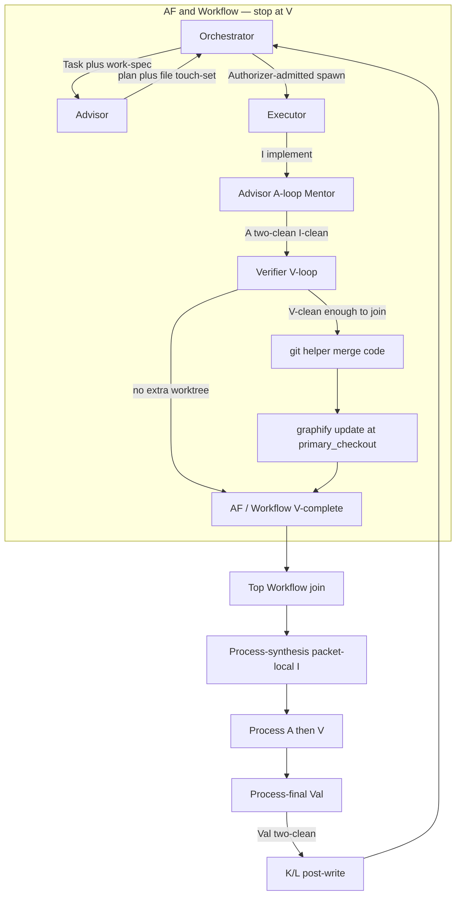
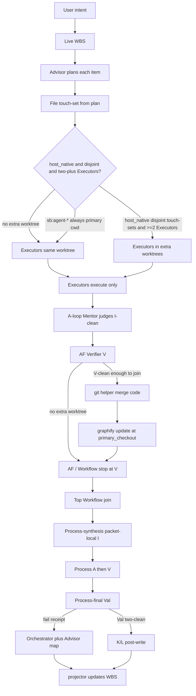

# Router Subagent Surfaces — Architecture and Design Change

This document is the specification. Repo copy [`.planning/router_subagent_surfaces_85bf9f09.plan.md`](.planning/router_subagent_surfaces_85bf9f09.plan.md) and Cursor mirror [`~/.cursor/plans/router_subagent_surfaces_85bf9f09.plan.md`](/Users/shafqat/.cursor/plans/router_subagent_surfaces_85bf9f09.plan.md) must remain byte-identical. Related brief: [`.planning/router_subagent_surfaces_85bf9f09-CLARIFY-260717-143757.md`](.planning/router_subagent_surfaces_85bf9f09-CLARIFY-260717-143757.md) (do not overwrite multi-AI `.planning/CLARIFY.md`). Where that brief contradicts this document, **this architecture spec wins**; the brief banner lists the superseded questions. User-facing terms are **Task** and **Executor**. Git and process “parent” are allowed.

## Overview

Silver Bullet’s control plane becomes one Process-first `/sb` router, a complete Workflow and Atomic Flow catalog as `sb:<route>` native-subagent surfaces, and six architectural roles. Authorizer hooks admit launches; they never invoke host `Task`. A Task-capable session starts the child. The root Orchestrator session is always Task-capable. Nested Task is allowed when the host is configured from official docs. Children spawn descendants while remaining depth is greater than zero. At remaining depth 0, the parent-proxy protocol is mandatory. The Task-capable ancestor polls/consumes `$primary_checkout/.planning/sb-spawn-proxy.jsonl` on the next parent turn (or SessionStart/Stop hook that does not invoke Task) and then starts the child.

Ordinary delivery is Advisor-first and one-way: Orchestrator hands each work item to Advisor, Advisor produces the plan of action, Executor implements and never plans. Implementation cleanliness is judged by the Advisor A-loop (two consecutive A-clean rounds), not by Executor self-attestation. Quality continues through Implementation (I), Advisor Mentor (A), Verifier V-loop at AF and Workflow scopes, optional overlap merge of **code**, and after the **top** Workflow join: Process-synthesis packet-local I, Process-scope A two-clean, Process-scope V two-clean, then **Process-final Validation** once at Process roll-up against original user intent. Inner nested Workflow joins stop at V; they are not Process-scope. AF and Workflow do V (spec check), not Val.

A hook projector is the only writer of WBS, packet, work-spec, and plan-artifact files; launch adapters persist those artifacts only by invoking `hooks/lib/wbs-projector.sh`. Children (Advisor, Executor including Process-synthesis, Verifier, Validator) must not Edit those files; they submit role-signed receipts. Only the Task-capable Orchestrator session may invoke `hooks/lib/wbs-projector.sh` (receipts are inputs, not arbitrary state writes — an Executor or Advisor must not stamp `v_verified` / `val_validated`). Advisor plan-replacement receipts, Process-synthesis packet-local findings, and callback CAS that would land in packet/WBS paths go through the projector. Callbacks that are not packet files may use the session store `~/.silver-bullet/projects/<repo-id>/` without the projector. Spawn-proxy jsonl is not a packet file: child append and ancestor CAS-consume both go through `hooks/lib/sb-spawn-proxy.sh` (not raw Edit/Write). Both helpers take `primary_checkout` (absolute path) as the **sole write root** for `.planning/` artifacts; writes never land in a worktree copy of `.planning/`, `graphify-out/`, `.agentmemory/`, or project `.silver-bullet/`. Missing `primary_checkout`, or a write-root that does not equal `$SB_PRIMARY_CHECKOUT` (or git main-worktree), is fail-closed: the helper does not write (LLM envelope path alone is not sufficient). Parent-guard allowlists the projector on WBS/packet paths, the spawn-proxy helper on `$primary_checkout/.planning/sb-spawn-proxy.jsonl`, and the merge helper on worktree code paths. Children invoke `hooks/lib/sb-spawn-proxy.sh` with `primary_checkout` from the launch envelope (jsonl only); they submit role-signed receipts and do not invoke the projector. Bash to the spawn-proxy helper is allowed for that purpose. Extra worktrees exist only for `host_native` when Advisor plan touch-sets are disjoint and at least two Executors will run; the TAT heuristic does not create worktrees for `/sb:agent-*` runtimes. The default is the same tree. Code may live in overlap worktrees. Extra `host_native` worktrees omit a writable copy of the **ledger-omit directories**: `.planning/`, `graphify-out/`, `.agentmemory/`, and the project `.silver-bullet/` directory (not `~/.silver-bullet/`). Creation uses sparse-checkout to omit those directories. Children must not Edit or Write those paths except helpers invoked with `primary_checkout`. After five-tool opt-in, Graphify `query` / `path` / `explain` / `update` / export, agentmemory export, and PreToolUse/PostToolUse gates (`graphify-gate`, `agentmemory-gate`, `rtk-gate`, `context-mode-gate`, `leanctx-gate`, `token-compression-tools-gate`) use `$primary_checkout` as the tool/index root, not session cwd. Session-start on the Task-capable ancestor exports process env `SB_PRIMARY_CHECKOUT` for subsequent hooks in that ancestor session (not a documented descendant Task env; extra-tree child bind is env or `rt_git_main_worktree_root`; LPS-01 must not fail solely on missing descendant env when main-worktree resolves; hooks bind to primary from env or git main-worktree, not the LLM envelope). Per-child `SB_WORKTREE_CWD` is not required in process env. If five-tool is opted in at that primary and the gate cannot resolve `SB_PRIMARY_CHECKOUT` (or the git main-worktree equivalent), the gate blocks — it does not skip on a missing local `.silver-bullet.json` walk from extra-tree cwd — `SB_PRIMARY_CHECKOUT` (process env) or git main-worktree (`rt_git_main_worktree_root`) always binds the five-tool / projector / spawn-proxy root even when extra-tree cwd still has `.silver-bullet.json` + `silver-bullet.md`; PWD config walk must not win. `hooks/lib/sb-project-gate.sh` honors `SB_PRIMARY_CHECKOUT` (and existing `SILVER_BULLET_PROJECT_ROOT` as an alias of `SB_PRIMARY_CHECKOUT` / git main-worktree; if the alias points at an extra-tree path, treat it as unset and do not bind extra-tree) before PWD. Skip = no deny JSON + exit 0. Block = existing `emit_block` deny JSON + exit 0 (Cursor PreToolUse) / exit 2 (Kay). ERR trap must not swallow primary-root resolution on `hooks/graphify-gate.sh`, `hooks/agentmemory-gate.sh`, `hooks/rtk-gate.sh`, `hooks/context-mode-gate.sh`, `hooks/leanctx-gate.sh`, `hooks/token-compression-tools-gate.sh`, and `hooks/stack-compression-coordinator.sh` (after `sb_find_project_config`, those entrypoints must not keep a copy-paste PWD walk that can skip/bind extra-tree; resolution errors block when five-tool is opted in, not skip). Invert `scripts/lib/recommended-tools/graphify-worktree.sh` (`rt_git_main_worktree_root` in `scripts/lib/recommended-tools/common.sh` fail-closes (empty / error) instead of returning extra-tree `rt_git_toplevel`; `rt_graphify_worktree_root` uses `$SB_PRIMARY_CHECKOUT` then `rt_git_main_worktree_root` — never extra-tree `rt_git_toplevel`; build-index uses that inverted root only; never create worktree-local `graphify-out/`; every `RT_PROJECT_ROOT` assignment under `scripts/` (including `scripts/lib/recommended-tools/`, `scripts/install-leanctx-sb.sh`, `scripts/reconcile-recommended-tools.sh`, and `scripts/optimize-rtk-context-mode.sh`) uses `$SB_PRIMARY_CHECKOUT` then `rt_git_main_worktree_root` — never extra-tree PWD / `show-toplevel` — not only graphify+agentmemory mkdir; `hooks/session-start` passes primary root into session-verify, not extra-tree PWD; `probe-agentmemory.sh` and similar must not `mkdir` `.agentmemory/` or `.silver-bullet/` usage stamps in the extra tree — use `$SB_PRIMARY_CHECKOUT`; repair does not materialize `graphify-out/` in the extra tree). Named red test (required hook unit tests for this file; other hook tests remain optional): `tests/hooks/test-graphify-gate.sh` extended or `tests/hooks/test-worktree-primary-checkout-gates.sh`. Cases: (1) extra-tree cwd + env `SB_PRIMARY_CHECKOUT` set → freshness/index at **primary** (extra-tree `.silver-bullet.json` + `silver-bullet.md` must not win); (2) extra-tree cwd + env unset + `rt_git_main_worktree_root` resolvable → same bind at **primary** (H1; PWD must not win); (3) extra-tree cwd + env unset + main-worktree unresolvable + five-tool opted in at primary → deny JSON, not empty skip; (4) repair/probe do not create extra-tree `graphify-out/` (or extra-tree `.agentmemory/` / `.silver-bullet/` stamps). Deny only when both env and git main-worktree fail. Graphify-gate is the oracle for the named file; all PreToolUse gates that source `sb-project-gate` share the same bind (`hooks/graphify-gate.sh`, `hooks/agentmemory-gate.sh`, `hooks/rtk-gate.sh`, `hooks/context-mode-gate.sh`, `hooks/leanctx-gate.sh`, and `hooks/token-compression-tools-gate.sh`). `hooks/lib/orchestrator-worktree-merge.sh` is code-only. Merge oracle: fail-closed `blocked_corrupt_state` if tracked diffs exist in ledger-omit paths on `merge-base..worktree-branch` (not vs live primary HEAD, which the projector keeps updating), and/or those directories or files are present on the extra-tree filesystem (untracked recreations). Then merge code-only: `git merge --no-commit` of the worktree branch, then restore ledger-omit paths from the pre-merge primary working-tree snapshot (not HEAD; snapshot those paths before merge; `git merge` has no pathspec); after restore, `git commit` the merge (code-only) or `git merge --abort` on fail-closed oracle; repeated joins require a clean index (no leftover `MERGE_HEAD`). Never merge ledger bytes from the extra branch. After a successful extra-worktree merge, run `graphify update` (and agentmemory as needed) against `$primary_checkout` before Process-final Val and before Graphify-first on the joined tree. Split-brain detection runs before merge and before Process-final Val. WBS, packets, spawn-proxy jsonl, and admission CAS live only under `$primary_checkout/.planning/`. Every launch envelope includes `primary_checkout`; when the extra-worktree heuristic created a tree, the envelope and spawn-proxy jsonl also include `worktree_cwd` (absolute extra-tree path, distinct from `primary_checkout`). Cursor Task has neither a cwd field nor a per-child process-env field. On Cursor (and any host without per-child cwd/env): Cursor does not document process-env inheritance into Task/subagent descendants (do not invent a Cursor Task env API). Session-start on the Task-capable ancestor still exports `SB_PRIMARY_CHECKOUT` for subsequent hooks in that ancestor session. Extra-tree Cursor child bind is process env `SB_PRIMARY_CHECKOUT` when present, else `rt_git_main_worktree_root`; LPS-01 must not fail solely on missing descendant env when main-worktree resolves. Hooks bind to primary. Per-child `SB_WORKTREE_CWD` is not required in process env; it is envelope `<<<SB_WORKTREE_CWD>>>` + work-spec `scope_bounds` + path-prefix product writes. Hooks must not parse the envelope and must not require per-child `SB_WORKTREE_CWD`. Parallel extra trees: each child's path-prefix comes from its envelope/work-spec, not from a single inherited env. Still create the sparse extra worktree + branch; merge still merges the extra-tree branch into primary; hooks bind tool/index root to `SB_PRIMARY_CHECKOUT` even if PWD is primary. Hosts that can set subprocess cwd/env may set cwd = `worktree_cwd` and export both `SB_PRIMARY_CHECKOUT` and `SB_WORKTREE_CWD`. Helpers always write ledger to `primary_checkout`. Missing `worktree_cwd` when that tree exists is fail-closed. Process-final Validator and Val-fail repair Executor launches use cwd = `$primary_checkout` (merged result), never a leftover extra tree. Public identifiers are `sb` / `sb:` / `/sb` only.

MVP materializes the Cursor host adapter plus rename of existing agent skills, bootstrap migrate (ILM-01), live E2E on that slice, and a public `sb:review-fix-ladder` alias until Iterate exists. Codex, Claude Code, and OpenCode **host adapters** (Orchestrator as parent inside those hosts), Iterate Ladder, Levels 0–3 recovery, MIG-01 reverse-bridge / offline rollback, and PROD-01 freeze/drain sequence after MVP.

## Table of contents

- [Document control](#document-control)
- [Problem and motivation](#problem-and-motivation)
- [Goals and non-goals](#goals-and-non-goals)
- [Current system](#current-system)
- [Proposed architecture](#proposed-architecture)
- [Roles and model preferences](#roles-and-model-preferences)
- [Task, planning, and quality loops](#task-planning-and-quality-loops)
- [Dispatch, spawn, nesting, and Authorizer admission](#dispatch-spawn-nesting-and-authorizer-admission)
- [WBS, parallelism, worktrees, and shared state](#wbs-parallelism-worktrees-and-shared-state)
- [Hosts, runtimes, five-tool, and public prefix](#hosts-runtimes-five-tool-and-public-prefix)
- [Data, hashes, trust, and CAS](#data-hashes-trust-and-cas)
- [Failure modes and blockers](#failure-modes-and-blockers)
- [Migration and rollout](#migration-and-rollout)
- [Testing and acceptance](#testing-and-acceptance)
- [Implementation workstreams](#implementation-workstreams)
- [Risks and engineering challenges](#risks-and-engineering-challenges)
- [Traceability](#traceability)

## Document control

| Field | Value |
|---|---|
| Title | Router Subagent Surfaces — Architecture and Design Change |
| Date | 2026-08-14 |
| Replaces | Parent-spawn-only orchestrator (`silver:*` parent mode; parent never implements; hooks cannot invoke Cursor `Task`) |
| Audience | Human reviewer and executing agent. The body is the spec. |
| MVP slice | Cursor host + six-role control plane + `/sb` + Task/work-spec + WBS projector + overlap worktrees (`host_native` only) + Advisor-first + process-final Val + existing `sb:agent-*` rename + bootstrap migrate (ILM-01) + live E2E. Public `sb:review-fix-ladder` kept as Verifier+Process-final-Val path or thin alias until Iterate exists. |
| After MVP | Iterate ladder; Levels 0–3; SB-as-parent inside Codex/Claude/OpenCode (host adapters); MIG-01 reverse-bridge / offline rollback; PROD-01 freeze/drain; full race/fault coverage including OFF/ITR/PROD matrix IDs |

## Problem and motivation

Today’s orchestrator is a Process parent that only spawns children. It cannot implement, cannot nest quality loops as first-class roles, and treats child sessions as opaque Executors without Advisor, Verifier, or Validator as durable roles. Public routes still use `silver:*`. Planning, verification, validation, and admission are not separated into roles with distinct tools and trust.

That model cannot express Advisor-owned plans, Verifier never-fixes, Process-final Validation, a live WBS that children must not write, or shared state between the host session and `/sb:agent-*` processes. Nested host subagents exist in official host docs, but SB hooks cannot invoke Cursor `Task`, so spawn physics is admission-plus-session: nested Task when depth remains, parent-proxy when it does not.

This change rebuilds the control plane so every Workflow and Atomic Flow is a Process-reachable `sb:<route>`, every launch carries a Task (work spec) plus a prompt, and quality is a nested loop with a single Process-final fitness check.

## Goals and non-goals

Goals are a single public Process router; a complete `sb:<route>` catalog generated from APO; six roles with five preference keys; fail-closed prompt and work-spec admission with the work-spec file on disk as source of truth; Advisor-first one-way planning; I → A → V at AF and Workflow (merge code if extra `host_native` worktree); Process-final Val after the top Workflow join (Process-synthesis I then Process-scope A/V first); WBS, packets, work-spec, and plan artifacts written only by invoking the hook projector with `primary_checkout` as the sole write root; extra worktrees only for `host_native` under the disjoint-touch-set and ≥2-Executor heuristic (those extra trees omit writable `.planning/`, `graphify-out/`, `.agentmemory/`, and project `.silver-bullet/` via sparse-checkout; merge fail-closes as `blocked_corrupt_state` on tracked ledger-omit diffs on `merge-base..worktree-branch` and/or filesystem presence of those paths in the extra tree, then `git merge --no-commit` and restore ledger-omit paths from the pre-merge primary working-tree snapshot (not HEAD); after restore, `git commit` the merge (code-only) or `git merge --abort` on fail-closed oracle; repeated joins require a clean index (no leftover `MERGE_HEAD`); envelope includes `worktree_cwd` when an extra tree exists; five-tool query/path/explain/update/export and PreToolUse/PostToolUse gates use `$primary_checkout`; session-start on the Task-capable ancestor exports process env `SB_PRIMARY_CHECKOUT` for subsequent hooks in that ancestor session (not a documented descendant Task env; extra-tree child bind is env or `rt_git_main_worktree_root`; LPS-01 must not fail solely on missing descendant env when main-worktree resolves). Per-child `SB_WORKTREE_CWD` is not required in process env; if five-tool is opted in at that primary and the gate cannot resolve `SB_PRIMARY_CHECKOUT` or the git main-worktree equivalent, the gate blocks); `silver` → `sb` with no dual public prefix and a shell bootstrap migrate (ILM-01); five-tool opt-in then mandatory on every selected runtime after an init probe (brownfield opt-in re-probes recorded runtimes: warn and unselect a failing runtime, continue for runtimes that passed, refuse opt-in only if every recorded runtime fails); live E2E as the MVP required test.

Non-goals for the MVP slice: Alumnium / UI browser evidence; a Most Competent preference slot; Authorizer as a user-facing preference key; dual `/silver` identifiers; human review as a process dependency on APO lock generation; any third-party escalation product, package, or runtime (the finite four-step ladder is SB’s own); Iterate Ladder, Levels 0–3, Codex/Claude/OpenCode host adapters, and offline reverse-bridge on day one (they are specified here, then sequenced). Deleting the public review route before Iterate exists is also a non-goal.

## Current system

The parent orchestrator session is spawn-only. Skills and commands are `silver:*`. Hidden adapter runners and `silver:agent-*` CLI/TUI skills already exist for Codex, Claude, Cursor, Pi, and OpenCode. Hooks and scripts are automatic shell programs on tool use; they cannot invoke Cursor `Task`. Live parent-guard tests treat parent implementation as forbidden and must be rewritten so the allowlisted projector may write WBS/packet paths under `$primary_checkout/.planning/`, `hooks/lib/sb-spawn-proxy.sh` may append and CAS-consume exactly `$primary_checkout/.planning/sb-spawn-proxy.jsonl`, and the merge helper may write worktree code paths, while Orchestrator still must not implement product code or raw-Edit the jsonl. Both helpers take `primary_checkout` as the sole write root and fail-closed unless the write-root argument equals `$SB_PRIMARY_CHECKOUT` (or git main-worktree); they do not trust the LLM envelope path alone.

There is no Authorizer/Verifier privilege split, no Advisor-owned plan handoff, no Process-final Validator role, and no central live WBS with callback-only child reports. Control-plane state is scattered across host-specific directories. [`docs/RUNTIME-COMPATIBILITY.md`](docs/RUNTIME-COMPATIBILITY.md) currently says Silver Bullet does not route models; this architecture supersedes that sentence for **role launches**. The Orchestrator **session** model remains the host UI’s choice.

## Proposed architecture

Process is the only public entry. `/sb` is a command where the host supports commands and a skill where commands are absent. Direct `sb:<route>` or Atomic Flow invokes are wrapped by Process: the router mints a Process WBS so Process-final Val still runs. Every Workflow and every Atomic Flow has one public `sb:<route>` native-subagent surface. Hidden runners are not a second Process router. The execution graph is `Process → Workflow → AF → Step → Skill`. AF is the context-compaction and failure-isolation boundary. Workflow nesting is unlimited when Process-authorized. Work Skills execute only inside AF.

Orchestrator never implements product code. After the **top** Workflow join on a Process-wrapped run, Authorizer **must** admit Process-scope Advisor review and a Process-synthesis Executor whose I-loop is **packet-local composition and findings only**. Product implementation stays with Workflow and AF Executors. Process-synthesis does not own I of child work. Inner nested Workflow joins stop at V; they are not Process-scope and do not admit Process-synthesis or Process-scope A/V. Process-scope A two-clean then Process-scope V two-clean are **mandatory** before Process-final Val. Admission is required, not optional.



One-way rule: Orchestrator → Advisor (planning) → Executor (execution only). Authorizer hooks admit spawn and merge. The Task-capable session performs host spawn. Launch adapters persist work-spec and plan artifacts **only by invoking** `hooks/lib/wbs-projector.sh`; that helper is the only writer of WBS, packet, work-spec, and plan-artifact files. Spawn-proxy jsonl child append and ancestor consume both go through `hooks/lib/sb-spawn-proxy.sh` (to-be-created; not a packet write; not raw Edit/Write). Both helpers take `primary_checkout` (absolute path) as the sole write root for `.planning/` artifacts and do not write unless the write-root argument equals `$SB_PRIMARY_CHECKOUT` (or git main-worktree); they do not trust the LLM envelope path alone. Merge is `hooks/lib/orchestrator-worktree-merge.sh` (to-be-created; code-only: fail-closed `blocked_corrupt_state` on tracked ledger-omit diffs on `merge-base..worktree-branch` — not vs live primary HEAD — and/or filesystem presence of those paths in the extra tree; then `git merge --no-commit` and restore ledger-omit paths from the pre-merge primary working-tree snapshot (not HEAD); after restore, `git commit` the merge (code-only) or `git merge --abort` on fail-closed oracle; repeated joins require a clean index (no leftover `MERGE_HEAD`); `git merge` has no pathspec; never merge ledger bytes from the extra branch; after a successful extra-worktree merge, `graphify update` against `$primary_checkout` before Process-final Val; split-brain detection runs before merge and before Process-final Val). V-loop is Verifier-owned at AF and Workflow. Val is Validator-owned and Process-final only. Canonical order is **I → A → V** at AF and Workflow; after the **top** Workflow join: Process-synthesis packet-local I → Process-scope A two-clean → Process-scope V two-clean → **Process-final Val**. Inner nested Workflow joins stop at V.

APO (`docs/apo-catalog.json`) is the runtime generation source. Generators emit `contracts/public-workflow-routes.lock.json` and `contracts/apo-hierarchy.lock.json`; both the catalog and the locks are committed; content hashes must match. CI fails on drift. There is no human review gate as a process dependency. Route count is derived from the catalog, not a fixed number. `sb:iterate-ladder` is the post-MVP progressive-fitness route. Until it exists, public `sb:review-fix-ladder` remains as a rename of `silver:review-fix-ladder` mapped onto Verifier plus Process-final Val, or as a thin alias to that path. `sb:migrate` is one catalog entry once `/sb` exists; bootstrap cutover is the shell script named in Migration.

## Roles and model preferences

Six architectural roles exist. User-facing `~/.silver-bullet/model-preferences.json` keys are exactly Orchestrator, Advisor, Executor, Verifier, Validator. Authorizer is not a preference key and is not collected at `/sb:init`. Authorizer LLM uses the same model and thinking effort as Verifier (same weights, different job and tools). TCB signing keys stay in hooks. Vision and Marketing are capability tags on a role entry, not extra keys and not a Most Competent slot.

| Role | Owns | Must not |
|---|---|---|
| **Orchestrator** | Process routing, dispatch order, starts children as a Task-capable session, user-facing status; invokes the WBS projector helper and `hooks/lib/sb-spawn-proxy.sh` | Implement product code; Edit WBS, packet, work-spec, or plan-artifact files except by running the allowlisted projector; Edit spawn-proxy jsonl except by running `hooks/lib/sb-spawn-proxy.sh`; plan Executor work; bypass Authorizer admission; merge via parent Edit |
| **Advisor** | Ordinary plan of action and file touch-set; post-I A-loop Mentorship that judges I-clean; on-demand advice; with Orchestrator, maps a Val fail receipt onto WBS nodes; on the escalation path only, may implement after Executor still fails | Happy-path implementation edits; recursive Advisor-for-Advisor planning; Executor self-attestation of I-clean; Edit WBS, packet, work-spec, or plan-artifact files or invoke `hooks/lib/wbs-projector.sh` (submit role-signed receipts; only the Task-capable Orchestrator session invokes the projector; spawn-proxy helper remains for jsonl) |
| **Executor** | I-loop implementation after plan handoff; Process-synthesis I is packet-local composition and findings only | Plan; co-iterate planning with Advisor; self-attest I-clean; mutate the immutable Task/work-spec; Edit WBS, packet, work-spec, or plan-artifact files or invoke `hooks/lib/wbs-projector.sh` (submit role-signed receipts; only the Task-capable Orchestrator session invokes the projector; spawn-proxy helper remains for jsonl) |
| **Authorizer** | Hook/admission TCB: is the launch allowed / is the Task complete?; prompt+work-spec fences; serialize worktree merge; spawn control plane; Authorizer trust/CAS | Product implementation; V-loop; Mentorship; Validation-loop; holding git signing keys in an LLM; invoking Cursor `Task` from hooks/scripts |
| **Verifier** | V-loop only: did Executor meet the spec? Never fixes on the happy path. AF and Workflow quality ends at V. Process-scope V two-clean after the top Workflow join is mandatory before Process-final Val | Merge, spawn, implement; Mentorship; Validation-loop; Authorizer merge/spawn tools; walking the WBS for Val; Edit WBS, packet, work-spec, or plan-artifact files or invoke `hooks/lib/wbs-projector.sh` (submit role-signed receipts; only the Task-capable Orchestrator session invokes the projector; spawn-proxy helper remains for jsonl) |
| **Validator** | Process-final Validation-loop: entire output vs original user intent, once at roll-up; on fail, a fail receipt only | Verifier V-loop; triaging V-batches; walking or checking lower-level WBS nodes; mapping fail receipts onto WBS (that mapping is Orchestrator + Advisor composition); Authorizer admission/merge; Mentorship; happy-path implementation (escalation path may use the Validator model as an Executor-shaped I); write the WBS or invoke `hooks/lib/wbs-projector.sh` (Val returns a fail receipt; Orchestrator and Advisor map; only the Task-capable Orchestrator session invokes the projector; spawn-proxy helper remains for jsonl) |

Each preference entry is `{ runtime, model, effort }`. `runtime` is `host_native` | `sb_agent_codex` | `sb_agent_claude` | `sb_agent_cursor` | `sb_agent_pi` | `sb_agent_opencode`, plus `sb_agent_goose` and `sb_agent_hermes` when those agent skills exist in the catalog. If `host_native`, use the host Task/Agent API. If `sb_agent_*`, use that CLI/TUI skill with **cwd = the primary project root** and nested profile **Executor (or the role leaf being launched), never a second Orchestrator**. Precedence is project override → global → built-in architectural-role defaults. Built-in defaults are per host.

**Role-launch routing.** `{ runtime, model, effort }` on Advisor, Executor, Verifier, Validator, and nested Orchestrator children is SB’s job. This supersedes the RUNTIME-COMPATIBILITY rule that Silver Bullet does not route models. The already-running Orchestrator **session** model remains the host UI’s choice; Orchestrator preference rows are advisory for that session and binding for any nested Orchestrator-shaped child the architecture actually launches (MVP does not launch a nested Orchestrator).

Canonical thinking effort is `low | medium | high | xhigh` where those exist, plus `max` where the agent documents it as thinking-effort. Do not collapse `xhigh` into High. Cursor Max Mode is a model class, not thinking-effort. Other roles default `high`. Executor defaults to the highest available thinking effort for that runtime unless the user specifies a level.

| Runtime | Canonical efforts | Executor default | Other-role default | Notes |
|---|---|---|---|---|
| Cursor (`host_native` / Task) | `low`, `medium`, `high`, `xhigh` when the slug supports them; Composer: none | `xhigh` if supported, else `high`; Composer: no suffix | `high` | Cursor Max Mode ≠ thinking-effort |
| Codex | `low`, `medium`, `high` (`xhigh`/`max` iff documented) | highest available unless the user specifies | `high` | Host adapter after MVP; `/sb:agent-codex` already exists |
| Claude Code | `low`, `medium`, `high` (`xhigh`/`max` iff documented) | highest available unless the user specifies | `high` | Host adapter after MVP; `/sb:agent-claude` already exists |
| Pi | `low\|medium\|high\|xhigh` plus `max` if documented | highest available unless the user specifies | `high` | Honor recorded `{model,effort}` when the key is available in the host/OS store or env (need not be in the same prefs JSON write); retire any hard MiMo pin in that case; prefs never store the key; configure from official docs |
| OpenCode | as documented (`low\|medium\|high\|xhigh` and `max` if documented) | highest available unless the user specifies | `high` | Host adapter after MVP; `/sb:agent-opencode` already exists (rename in this ship) |
| Goose / Hermes | as documented when the agent skill exists | highest available unless the user specifies | `high` | Include in the enum only when the corresponding `sb:agent-*` skill exists; nested-executor profile |

`/sb:init` on brownfield collects missing keys among the five (not skip-forever). Headless uses file/env, else built-ins plus a warning. Audited `SB OVERRIDE:` still punches admission with an append-only log.

Secrets for Pi (and any other runtime API key) live in the host/OS secret store or in environment variables. They are **never** written to `model-preferences.json`.

The user may use the same model for any roles. That is advisory only, not a hard-block at A-loop. Prefer different models, growing more capable: **Orchestrator < Executor < Verifier < Advisor < Validator**. Init warns if Advisor equals Executor; Doctor shows the warning; do not hard-refuse with `blocked_advisor_state`.

If a recorded model is unavailable for **any** role, including Verifier, Advisor, and Validator: always tell the user. If a closest replacement exists, use it. Closest means same runtime if possible, then same family, then next built-in candidate. If that replacement changes `runtime`, probe the new runtime first; if the probe does not pass, do not switch to that candidate. If the replacement set is empty after that filter, stop: terminal `blocked_executor_unavailable` (Executor), `blocked_verification_unavailable` (Verifier), and the same hard stop for Advisor and Validator (`blocked_child_unavailable` / `blocked_validation_state` as the first matching row) after the user is told. Catalog refresh may propose upgrades between launches.

Slugs live in a pinned in-repo catalog (refreshable). No live vendor-doc fetch at spawn.

Per-host Cursor examples (minimum versions; resolve highest compatible same family between launches): Advisor — GPT-5.6+ Sol High, Grok 4.5+ High, Opus 4.8+ High, GLM 5.2+; Executor — Composer 2.5+ with no effort suffix, or a slug that supports `xhigh`; Verifier — GPT-5.6+ Luna, Grok 4.5+, Opus 4.8+, MiniMax M3+; Validator — GPT-5.6+ Sol High, Grok 4.5+ High, Fable High, GLM 5.2+. GLM 5.2 is not barred. One unified comparator applies eligibility, role ordinal, explicit user order when present, otherwise Intelligence Index score then AA source rank, effort, and canonical ID. Resolver filters capability tags before ranking.

## Task, planning, and quality loops

### Task and work spec

User-facing work is a **Task**. The machine schema behind a Task is the work spec — never call it a ticket. Every host subagent launch must carry a prompt-engineered launch prompt and a work spec with exactly these fields: `goal_outcome`, `required_outputs`, `acceptance_criteria`, `scope_bounds`, `context_refs`. Unknown properties fail closed (`additionalProperties: false`). Missing, empty, or schema-invalid prompt or spec fails closed: no host spawn, no lease/capability/channel minting, receipt `blocked_launch_prompt_spec`. Schema: `contracts/work-spec.schema.json`. When the extra-worktree heuristic created a tree, `scope_bounds` MUST include the absolute extra-tree path prefix used for product writes; Authorizer `launch_intent` expected_writes must match that prefix (on Cursor this is a cooperative child obligation plus admission `expected_writes`, not a PreToolUse path jail Cursor Task cannot deliver; physical rails remain sparse-checkout, merge-oracle, and V-loop; hooks still do not parse the envelope).

The written Task is saved when work starts. Launch adapters persist the work-spec and plan artifacts **only by invoking** `hooks/lib/wbs-projector.sh` with `primary_checkout` as the sole write root. Admission checks the work-spec hash. The child runtime still receives the work spec **as a file on disk** under `$primary_checkout/.planning/` (packet path such as `$primary_checkout/.planning/packets/<launch_id>/work-spec.json`). That file is the source of truth. The launch envelope may embed JSON for hosts that accept only a string prompt; prompt-only delivery without the file is not sufficient. The envelope always includes `primary_checkout` as an absolute path. Missing `primary_checkout`, or a write-root that does not equal `$SB_PRIMARY_CHECKOUT` (or git main-worktree), is fail-closed: no helper write, no host spawn (`blocked_launch_prompt_spec`). When the extra-worktree heuristic created a tree, the envelope also includes `worktree_cwd` (absolute extra-tree path, distinct from `primary_checkout`); missing `worktree_cwd` in that case is the same fail-closed outcome. Cursor Task has neither a cwd field nor a per-child process-env field. On Cursor (and any host without per-child cwd/env): Cursor does not document process-env inheritance into Task/subagent descendants (do not invent a Cursor Task env API). Session-start on the Task-capable ancestor still exports `SB_PRIMARY_CHECKOUT` for subsequent hooks in that ancestor session. Extra-tree Cursor child bind is process env `SB_PRIMARY_CHECKOUT` when present, else `rt_git_main_worktree_root`; LPS-01 must not fail solely on missing descendant env when main-worktree resolves. Hooks bind to primary. Per-child `SB_WORKTREE_CWD` is not required in process env; it is envelope `<<<SB_WORKTREE_CWD>>>` + work-spec `scope_bounds` + path-prefix product writes. Hooks must not parse the envelope and must not require per-child `SB_WORKTREE_CWD`. Parallel extra trees: each child's path-prefix comes from its envelope/work-spec, not from a single inherited env. Still create the sparse extra worktree + branch; merge still merges the extra-tree branch into primary; hooks bind tool/index root to `SB_PRIMARY_CHECKOUT` even if PWD is primary. Hosts that can set subprocess cwd/env may set cwd = `worktree_cwd` and export both `SB_PRIMARY_CHECKOUT` and `SB_WORKTREE_CWD`. Helpers always write ledger to `primary_checkout`. `host_native` worktree children read `.planning/` from `$primary_checkout`, never a worktree copy.

The Task five-field hash is immutable for a `launch_id`. Advisor’s **steps/plan artifact** may be replaced under the **same** `launch_id` when Advisor writes a plan-replacement receipt. Advisor submits that receipt; the Task-capable Orchestrator session persists the replacement artifact **only by invoking** `hooks/lib/wbs-projector.sh`. A new `launch_id` is minted only if the Task itself changes (goal, scope, or acceptance — the five-field hash). Executor must not silently change the steps and continue.

Example: Task “Add a login page” is saved at start. A later rewrite to “Add a billing page” changes the Task hash and requires a new `launch_id`. If the steps were “1. make a password form 2. wire the login API” and must become “1. use company sign-on 2. skip the password form”, Advisor replaces the plan artifact under the same `launch_id`. Executor must not quietly switch to company sign-on.

### Ordinary-delivery procedure

1. Pre-read Knowledge/Learnings (`docs/knowledge/` and `docs/learnings/`). Graphify-first when five-tool is opted in for **that runtime**; else INDEX plus current month files. After five-tool opt-in, a runtime is recorded only if the init probe passed, so a Graphify miss at job time is an operational failure (`blocked_knowledge_preread`), not an acceptable silent skip. INDEX fallback applies only when five-tool is not opted in for that runtime. Project-specific notes go to `docs/knowledge/YYYY-MM.md`; portable notes to `docs/learnings/YYYY-MM.md`.
2. Orchestrator hands the work spec to Advisor. Authorizer admits that spawn; a Task-capable session performs it. State: `pre_read_pending` → `advisor_planning`.
3. Advisor produces the plan of action, including the file touch-set, bound to `launch_id` plus work-spec hash. Durable plan-handoff receipt. State: `plan_handed_off`. Executor never drafts or co-plans. Missing handoff: `blocked_plan_of_action_review`.
4. Authorizer admits the Executor spawn. Executor runs the I-loop: it implements. It does not self-attest cleanliness. State: `i_running`.
5. Advisor A-loop Mentor judges I-clean until two consecutive A-clean rounds. Two-clean means two A-clean rounds. State: `a_running` / `a_two_clean`. Historical `i_two_clean` is not a gate. V never starts with open Advisor findings. A defect returns to Executor `i_running`, then A again.
6. Verifier V-loop until two-clean / `v_verified`. Never fixes; never merge/spawn/implement. Empty V-batch: Verifier empty-attest. Accepted V findings return to the owning Executor I-loop, then A again before V. **AF and Workflow stop here.** Ordinary AF/Workflow SM has no `val_*` states. They do not run Val.
7. If a `host_native` extra worktree exists and the slice is V-clean enough to join, Authorizer-admitted merge via `hooks/lib/orchestrator-worktree-merge.sh`. Merge oracle: fail-closed `blocked_corrupt_state` if tracked diffs exist in ledger-omit paths on `merge-base..worktree-branch` (not vs live primary HEAD, which the projector keeps updating), and/or those directories or files are present on the extra-tree filesystem (untracked recreations). Then merge code-only: `git merge --no-commit` of the worktree branch, then restore ledger-omit paths from the pre-merge primary working-tree snapshot (not HEAD; snapshot those paths before merge; `git merge` has no pathspec); after restore, `git commit` the merge (code-only) or `git merge --abort` on fail-closed oracle; repeated joins require a clean index (no leftover `MERGE_HEAD`). Never merge ledger bytes from the extra branch. Split-brain detection runs before this merge. After a successful extra-worktree merge, run `graphify update` (and agentmemory as needed) against `$primary_checkout` before Process-final Val and before Graphify-first on the joined tree.
8. Repeat sibling/ancestor joins as the WBS requires. **Val is not run after every AF, every Workflow, or every repair hop.**
9. After the top Workflow join on a Process-wrapped run, and after split-brain detection: (9a) Process-synthesis packet-local I — states `process_synth_i_running` / `process_synth_i_complete`; projector-only; not product I (ILP-01 Process-synthesis clause); (9b) Process-scope A two-clean — `process_a_running` / `process_a_two_clean`; (9c) Process-scope V two-clean — `process_v_running` / `process_v_verified` (`process_v_verified` is the two-clean terminal, same role as `v_verified`; VLP-01 Process-scope clause). These three steps are **mandatory** before Process-final Val. Authorizer admission of the Process-synthesis Executor and Process-scope Advisor/Verifier is required, not optional.
10. Process-final Validation-loop once at Process roll-up: entire output vs original user intent. Validator cwd is `$primary_checkout` (merged result), never a leftover extra tree. Validator does not triage, does not walk the WBS, and does not check lower-level WBS nodes. On fail it returns a **fail receipt**. Orchestrator and Advisor map that receipt onto WBS nodes (composition, not Validator triaging) and relaunch Executor there with cwd = `$primary_checkout`. Do not un-merge. Process-final states: `val_running` / `val_two_clean` / `val_validated` (Process only).
11. Post-verify Knowledge/Learnings write, or durable `kl_post_write_no_insights`. Either satisfies KLW-01. Skipping both: `blocked_knowledge_postwrite`. Then `scope_complete` and return to parent.

Two consecutive clean outcomes apply to A (including Process-scope A), V (including Process-scope V), and Process-final Val (when Val runs). I has no self-attested two-clean. A defect or material contract-bearing edit resets only the affected scope.

Leaf Step has no Step-level V or Val. When the Step is the AF leaf executor, that leaf runs A-loop two-clean once immediately before AF V; that receipt satisfies the AF A-gate (no duplicate AF-level A-loop). Upon `a_two_clean` the Step yields to the parent AF (`step_yield`). AF then runs AF-level `v_running` → `v_verified`, then overlap merge if needed (merge oracle, code-only `git merge --no-commit` plus restore of ledger-omit paths from the pre-merge primary working-tree snapshot (not HEAD); after restore, `git commit` the merge (code-only) or `git merge --abort` on fail-closed oracle; repeated joins require a clean index (no leftover `MERGE_HEAD`), then `graphify update` at `$primary_checkout` before Process-final Val). Every AF completion and every Workflow composition join must run A-loop two-clean before their V-loop. AF and Workflow SM stop at V. After the top Workflow join, Process-synthesis packet-local I then Process-scope A two-clean then Process-scope V two-clean are mandatory; Process-final Val is the separate last step. Inner nested Workflow joins stop at V.

Deny-all leaf control-plane roles (`advisor`, `verifier`, `validator`, `defect_escalation`, and equivalent Authorizer-admitted Mentors/Validators) are exempt from Advisor-plan handoff and from recursive I/A/V/Val on their own outputs: they execute role work, return a signed role receipt, and terminate. Authorizer is likewise exempt from Advisor-plan recursion.

Iterate rung implementers are exempt from ordinary Advisor planning. Their planning gate is the reviewed fitness charter plus baseline admission/revalidation. Iterate is post-MVP.

### On-demand Advisor consult

While in ordinary `i_running`, the Executor may request Advisor advice when it assesses its own capability as insufficient. Consults are optional, executor-initiated, Authorizer-admitted, and advice-only. They do not constitute planning, do not auto-mutate the parent work-spec, and do not bypass plan-handoff. Non-material advice does not void `plan_handed_off`.

Material plan-of-action change means an **Advisor receipt** that the ordered steps changed. Advisor submits that receipt; the Task-capable Orchestrator session replaces the plan artifact under the same `launch_id` **only by invoking** `hooks/lib/wbs-projector.sh` (the Task five-field hash unchanged). A Task goal/scope/acceptance change still requires Authorizer re-launch with a fresh `launch_id`. The finite escalation ladder replaces wait-forever replan; `blocked_replan_budget` is a historical ID, not a job-stop.

The A-loop Mentor may be the same Advisor identity that authored the plan-handoff receipt for this `launch_id`. Independence is supplied by Verifier V-loop and Process-final Val. Adapters must not invent an A-loop freshness constraint that forces a different Mentor. Knowledge/learning candidates buffer into the packet and surface at `kl_post_write_pending`; candidate-only rounds with no required-fix disposition count clean for A two-clean.

### Escalation ladder

Ordinary Executor stall uses a finite four-step Silver Bullet ladder. `blocked_replan_budget` is replaced by this ladder (not infinite wait):

1. Advisor gives progressively more guidance to Executor.
2. If Executor still fails, Advisor takes on the Task. That work is an **Executor-shaped I**, then Verifier V.
3. If Advisor fails, use the Validator model to do the Task. That work is also an **Executor-shaped I**, then Verifier V.
4. Only if that fails, tell the user.

Process-final Val still runs before user-facing completion whenever implementation occurred on this ladder. This overrides “Advisor/Validator never implement” **on the escalation path only**. Happy-path Validator still does not implement (final Val check only). Happy-path Verifier still never fixes.

I-loop dispositions include `accept_fix`, `reject_wont_fix`, `defer`, `needs_verification`, and `contract_defect`. Only `accept_fix` (applied) and `contract_defect` (escalated) count as completed dirty rounds toward Levels 0–3 / two-clean reset. Dirtiness is what Advisor records, not Executor self-attest.

### Process-synthesis and ancestry-preserving repair

Process-synthesis I-loop is packet-local composition and findings only. Those packet-local findings persist as role-signed receipts; only the Task-capable Orchestrator session invokes `hooks/lib/wbs-projector.sh` to write them. Process-synthesis must not Edit packet, WBS, work-spec, or plan-artifact files and must not invoke the projector (spawn-proxy helper remains for jsonl). It does not implement product code and does not own I of child Workflow/AF/Step work. When composition findings require a deliverable change, Process-synthesis must not invoke Work Skills or mutate child artifacts. It enters `process_repair_pending` → Authorizer CAS → `process_repair_delegated`: suspend Process writes outside the handoff; record `defect_root_id` plus target leaf plus owner-chain ancestry; invalidate A/V (and KL as required) evidence for every ancestor on that chain. Val evidence is invalidated only at Process scope; repair hops do not run Val.

Authorizer reopens the deepest affected leaf through the declared owner chain only (Step → AF → owning Workflow → intermediate Workflows → top Workflow). Already-merged sibling AFs keep merged code; reopen only the failing chain. Repair Executor launches use cwd = `$primary_checkout` (merged result), never a leftover extra tree. Callbacks bind to each declared parent join. Direct nested-AF or nested-Workflow callback bound to Process-synthesis is forbidden. Where implementation edits are required, the leaf Executor runs I and Verifier V (A-loop judges I-clean). **Val runs again only at Process-final.** Fresh `launch_id` applies only when the Task five-field hash changes; otherwise the same `launch_id` may continue with an Advisor plan-replacement receipt. When a reopened scope re-emits a same-kind completion callback, the occurrence ordinal must advance so early-dedupe CAS does not collide with the pre-repair completion.

Val-fail uses the same reopen path after Orchestrator and Advisor map the Validator fail receipt onto WBS nodes. Repair Executor launches use cwd = `$primary_checkout` (merged result), never a leftover extra tree. Do not un-merge.

### Levels 0–3 (post-MVP)

One immutable `defect_root_id` owns a deterministic per-defect machine. Level 0 begins with the original Executor’s first completed dirty round as judged by Advisor. At exactly three completed dirty rounds, resolve the next eligible demonstrably stronger candidate: Level 1 is a **separate repair leaf** that may reuse Verifier `{ runtime, model, effort }` but is not the V-loop Verifier; Level 2 Validator; Level 3 strongest eligible architectural-role candidate at that host’s highest available thinking effort. No Most Competent key. Escalated agents are deny-all leaves with only scoped repair authority.

Ordinary successful repair re-enters the preserved ordinary owner SM and must not enter `awaiting_baseline_revalidation` or mint Iterate authority. Iterate repair closes into `awaiting_baseline_revalidation` then shared fail-closed revalidation CAS. Both contexts return I → A → V (re-run A before fresh V). Val remains Process-final only. `blocked_escalation_unavailable`, `blocked_unresolved`, and `blocked_resource_exhausted` apply as specified in Failure modes.

### Iterate Ladder (post-MVP)

`sb:iterate-ladder` is optional progressive fitness over an already-valid, already-verified artifact set. It never establishes ordinary delivery completion and is never a V-loop. Public `sb:review-fix-ladder` is **not** removed in the MVP ship. MVP maps that route (the rename of `silver:review-fix-ladder`) onto Verifier plus Process-final Val, or keeps a thin alias. The public review route may be deleted only when Iterate exists.

Activation requires durable `activation_provenance` of exactly one type: `explicit_user` (signed immutable request, actor, timestamp, scope, artifact-set receipt) or `critical_policy` (policy ID/version/hash, artifact class, effective time, matched-scope receipt). `critical_policy` may be minted only from reviewed, versioned, hash-bound SB policy artifacts under `policies/sb/**/*.policy.md` (or successor path in the iterate-ladder contract). Legacy RFL presence, schedules, inferred criticality, and model judgment never activate it.

Canonical contract: `contracts/iterate-ladder-contract.lock.json`. The nine `fitness_charter` fields, exact names: `scope`, `audience_use`, `fitness_dimensions`, `invariants_evidence`, `non_goals`, `allowed_change_magnitude`, `regression_checks`, `budget`, `rung_ceiling`. Extra semantics require a versioned extension namespace. Canonical ordered rungs: (1) `verifier_high` — Verifier / High; (2) `verifier_max` — Verifier / highest available thinking effort on that host; (3) `validator_high` — Validator / High; (4) `validator_max` — Validator / highest available thinking effort on that host. The `_max` suffix is not Cursor Max Mode. Historical `verification_medium` / `verification_high` / `planning_validation_medium` / `planning_validation_high` migrate 1:1; plan-era `authorizer_high` / `authorizer_max` migrate 1:1 to `verifier_high` / `verifier_max`.

Authorization-axis states include `provenance_pending_admission`, `current_binding_pending_admission`, `reauthorization_required`, `reauthorized_pending_admission`, `active_attempt`, and `authority_closed`. Work state and `authority_status` are orthogonal.

Iterate procedure:

1. Initial activation consumes exactly one current `explicit_user` or `critical_policy` provenance receipt and moves `inactive` → `active` → `awaiting_baseline_admission` with `authority_status=provenance_pending_admission`. This proves permission only.
2. Baseline admission binds project, governing scope, artifact set, generation, epoch, artifact/content hashes, dependency-DAG version/closure, invalidation generation, current non-superseded two-clean A-loop receipts, proof of no open Advisor findings, current non-superseded two-clean V-loop receipts, all required final-validation receipts, and proof of no unresolved contract defect. Iterate-rung evidence cannot substitute for baseline V-loop or final-validation evidence. Semantic freshness: any later artifact, user intent, acceptance criterion, dependency, generation, epoch, or invalidation change stales admission regardless of timestamp. Missing, stale, superseded, or unbound evidence freezes writes in `awaiting_baseline_revalidation`; failed evidence or a contract defect enters `suspended_contract_repair`; unsupported revalidation or corrupt baseline commits `blocked_iterate_baseline_unproven`.
3. The sole `awaiting_baseline_admission` → `rung_running` edge atomically consumes the provenance receipt, validates current binding, baseline, evidence, effects, fences, and ceiling, creates a fresh attempt/lease/capabilities/channel, and sets `authority_status=active_attempt`. No rung edit, I-loop round, or external effect begins before that transaction.
4. A material rung mutation moves `rung_running` → `awaiting_revalidation` (in-rung mutation revalidation, distinct from `awaiting_baseline_revalidation`) and closes active attempt authority. Baseline staleness, mapping resume, and successful repair use `awaiting_baseline_revalidation`. None may enter `rung_running` except the shared fail-closed revalidation CAS. At or below the ceiling, one final CAS enters the same rung at zero clean count with a fresh bound channel. Above it, reconciliation creates no prospective rung objects.
5. Binding publication moves affected work to `reauthorization_required`, increments cancellation/write/effect/callback fences, revokes stale attempt authority, and freezes writes, effects, callbacks, and next-rung admission. Only Authorizer replacement activation drives `reauthorized_pending_admission`; it grants no authority and is consumed by a later admission/revalidation CAS. `C1 → C2 → C1` still increments generation. A callback committing first is preserved/revalidated under C2; publication first makes a C1 callback only `stale_contract_binding`.
6. Findings are `fitness_improvement` or `contract_defect`. A contract defect invalidates prior verification and returns to I → A → V; a material contract change invalidates affected final validation. Silent reversal is forbidden; oscillation or incompatible improvement yields `blocked_ladder_conflict`.
7. Normal completion is `rung_running` → `rung_completion_pending`: close attempt/channel, commit zero-authority completion and continuation receipts. Later slots resolve strictly in canonical order with durable skips. The first eligible slot enters `next_rung_pending_admission` without authority, then requires fresh baseline evidence and a new admission CAS. The ceiling, final available slot, or no eligible later slot commits `iterate_completed` and `authority_closed`. No direct advance, old-channel reuse, overlap, waiting/repair completion, or terminal reopening is legal.
8. Lowering the ceiling is a distinct write-frozen reconciliation path. It preserves pre/post-edit candidates and cycles, rejects staged work at the fence, requires fresh evidence, and commits `terminated_iterate_ceiling_reconciled` (work-state terminal; `authority_closed`) — not a `blocked_*` ID. A later raise needs fresh authorization and a new continuation.
9. Iterate repair uses `suspended_contract_repair`, the original owner or preserved Levels 0–3 level, a deterministic `repair_rebind` after fresh replacement activation, a fresh repair-only lease/capability/channel, exact defect/checkpoint/candidate/scope/write/effect/budget/fence predicates, and no scope broadening. Successful Iterate repair closes into `awaiting_baseline_revalidation` then shared fail-closed revalidation CAS. Ordinary Levels 0–3 repair must not use this Iterate state.

Ordinary delivery producers use `producer_kind=ordinary_delivery` and must not bind Iterate contract-binding / rung / `attempt_id` fields. Iterate-only authority-bearing events bind `contract_binding_hash`, `contract_binding_generation`, `callback_acceptance_fence`, canonical rung ID, and rung `attempt_id`.

## Dispatch, spawn, nesting, and Authorizer admission

Hooks and scripts never invoke Cursor `Task`. Nested Task/Agent is allowed when the host is configured per official docs. The root Orchestrator session is always Task-capable. Children spawn descendants when the host allows remaining depth. Authorizer admits launches (is it allowed / is the Task complete?). A Task-capable session actually starts the child. Admission must not hold git signing keys in an LLM. Optional Authorizer advice leaf never holds private keys and never merges. Bootstrap: hooks admit the first Orchestrator-driven spawn; no Authorizer-spawns-Authorizer deadlock.

SB configures each host for that host’s maximum permissible subagent nesting depth from official host documentation. Remaining depth is that configured maximum minus current depth. When remaining depth is greater than zero, the child session launches the grandchild with nested Task. When remaining depth is 0, parent-proxy is mandatory.

### Parent-proxy protocol

When remaining depth is 0 and more nesting is needed, the child does not call Task. Both child append and ancestor consume go through the helper `hooks/lib/sb-spawn-proxy.sh` (to-be-created). The helper takes `primary_checkout` (absolute path, from the launch envelope) as its sole write root. The jsonl path is exactly `$primary_checkout/.planning/sb-spawn-proxy.jsonl`. Neither side uses raw Edit/Write on that file. Missing `primary_checkout`, or a write-root that does not equal `$SB_PRIMARY_CHECKOUT` (or git main-worktree), is fail-closed: the helper does not write (LLM envelope path alone is not sufficient). The child invokes the helper (Bash to the helper is allowed) to append one spawn-request record. That jsonl is not a packet work-spec write. Each record includes at least: `request_id`, `requesting_child_launch_id`, `wbs_node_id`, `role`, `route`, `work_spec_hash`, `prompt_hash`, desired `{ runtime, model, effort }`, `primary_checkout`, `worktree_cwd` (absolute extra-tree path when the extra-worktree heuristic created a tree; omit when cwd is the primary checkout), `created_at`, and `status` (`pending` | `consumed` | `launched` | `failed`). Put-if-absent on `request_id`. Pending rows carry hashes. The same atomic consume/`launch_intent` transaction MUST persist on the consumed row: Authorizer-minted child `launch_id`, `prompt_ref` (canonical path under `$primary_checkout/.planning/packets/<launch_id>/` to the prompt bytes), and `work_spec_path` (on-disk work-spec file, source of truth). Those files must exist in that same transaction (projector persist); hashes cannot reconstruct payloads. This does not reopen consume-before-launch. Missing `worktree_cwd` when that tree exists is fail-closed (`blocked_launch_prompt_spec`).

The nearest Task-capable ancestor session CAS-consumes the pending record by invoking the same helper (CAS on `status`; `pending`→`consumed` MUST be the same atomic helper transaction that persists Authorizer `launch_intent`, or the helper MUST lease `consumed` with a claimant epoch and reconcile consumed-without-`launched` by completing launch or returning `pending`/`failed` — never permanently consumed-without-launch), performs the host launch with both `primary_checkout` and `worktree_cwd` from the record (Cursor Task has neither a cwd field nor a per-child process-env field. On Cursor (and any host without per-child cwd/env): Cursor does not document process-env inheritance into Task/subagent descendants (do not invent a Cursor Task env API). Session-start on the Task-capable ancestor still exports `SB_PRIMARY_CHECKOUT` for subsequent hooks in that ancestor session. Extra-tree Cursor child bind is process env `SB_PRIMARY_CHECKOUT` when present, else `rt_git_main_worktree_root`; LPS-01 must not fail solely on missing descendant env when main-worktree resolves. Hooks bind to primary. Per-child `SB_WORKTREE_CWD` is not required in process env; it is envelope `<<<SB_WORKTREE_CWD>>>` + work-spec `scope_bounds` + path-prefix product writes. Hooks must not parse the envelope and must not require per-child `SB_WORKTREE_CWD`. Parallel extra trees: each child's path-prefix comes from its envelope/work-spec, not from a single inherited env. Still create the sparse extra worktree + branch; merge still merges the extra-tree branch into primary; hooks bind tool/index root to `SB_PRIMARY_CHECKOUT` even if PWD is primary. Hosts that can set subprocess cwd/env may set cwd = `worktree_cwd` and export both `SB_PRIMARY_CHECKOUT` and `SB_WORKTREE_CWD` when an extra tree exists), and attributes the new WBS node to the requesting child. Parent-guard allowlists that helper for the Orchestrator session on `$primary_checkout/.planning/sb-spawn-proxy.jsonl`. `blocked_depth_unsupported` fires only if even parent-proxy spawn is impossible (no Task-capable ancestor can launch). Process-authorized Workflow nesting depth is otherwise unlimited. The Task-capable ancestor polls/consumes `$primary_checkout/.planning/sb-spawn-proxy.jsonl` on the next parent turn (or SessionStart/Stop hook that does not invoke Task) and then starts the child.

Authorizer commits a signed `launch_intent` and outbox **before** the Task-capable session performs host launch. It binds immutable `launch_id` / idempotency token, Authorizer-minted `scope_execution_id` and `execution_attempt_id`, project/run/scope/parent generation/epoch, child identity, role/owner/route/`{ runtime, model, effort }`, budget/deadline, expected writes/effects, cancellation generation, lease, adapter, and expected fence generation. Before spawn linearization, atomic put-if-absent in an admission ledger keyed by `launch_id`. Same payload returns the same operation/child/ack; conflicting payload blocks; stale generation/epoch cannot spawn. Mismatch or uncertain lookup: `blocked_launch_uncertain`. Pre-ack cancellation installs the new host fence before status reconciliation.

When a host API accepts only a single string prompt (Cursor `Task.prompt`), adapters embed both payloads in a delimited envelope (LPS-01) **and** persist the work-spec file **only by invoking** `hooks/lib/wbs-projector.sh` with `primary_checkout` as the sole write root. Admission checks the hash of the file. The child reads the file as source of truth. The envelope always includes `primary_checkout` (absolute path of the primary checkout). When the extra-worktree heuristic created a tree, the envelope also includes `worktree_cwd` (absolute extra-tree path, distinct from `primary_checkout`). Missing `primary_checkout`, or missing `worktree_cwd` when that tree exists, fails closed with `blocked_launch_prompt_spec`. Cursor Task has neither a cwd field nor a per-child process-env field. On Cursor (and any host without per-child cwd/env): Cursor does not document process-env inheritance into Task/subagent descendants (do not invent a Cursor Task env API). Session-start on the Task-capable ancestor still exports `SB_PRIMARY_CHECKOUT` for subsequent hooks in that ancestor session. Extra-tree Cursor child bind is process env `SB_PRIMARY_CHECKOUT` when present, else `rt_git_main_worktree_root`; LPS-01 must not fail solely on missing descendant env when main-worktree resolves. Hooks bind to primary. Per-child `SB_WORKTREE_CWD` is not required in process env; it is envelope `<<<SB_WORKTREE_CWD>>>` + work-spec `scope_bounds` + path-prefix product writes. Hooks must not parse the envelope and must not require per-child `SB_WORKTREE_CWD`. Parallel extra trees: each child's path-prefix comes from its envelope/work-spec, not from a single inherited env. Still create the sparse extra worktree + branch; merge still merges the extra-tree branch into primary; hooks bind tool/index root to `SB_PRIMARY_CHECKOUT` even if PWD is primary. Hosts that can set subprocess cwd/env may set cwd = `worktree_cwd` and export both `SB_PRIMARY_CHECKOUT` and `SB_WORKTREE_CWD`. Helpers always write ledger to `primary_checkout`. Session-start on the Task-capable ancestor exports process env `SB_PRIMARY_CHECKOUT` (absolute, same path) for subsequent hooks in that ancestor session (not a documented descendant Task env; extra-tree child bind is env or `rt_git_main_worktree_root`). Hooks do not parse the LLM envelope for this path and must not parse `<<<SB_WORKTREE_CWD>>>` either; they must not require per-child `SB_WORKTREE_CWD`.

```text
<<<SB_LAUNCH_PROMPT>>>
...prompt-engineered launch prompt...
<<<SB_WORK_SPEC_JSON>>>
{...work-spec JSON matching contracts/work-spec.schema.json...}
<<<SB_PRIMARY_CHECKOUT>>>
/absolute/path/to/primary/checkout
<<<SB_WORKTREE_CWD>>>
/absolute/path/to/extra/worktree
<<<SB_END>>>
```

Marker strings must not appear as literal contiguous bytes inside any payload; adapters apply a documented escaping rule (for example percent-encode `<<<` → `%3C%3C%3C` inside payloads only) and reverse it on extract. Unescaped marker collision fails closed with `blocked_launch_prompt_spec`. `<<<SB_WORKTREE_CWD>>>` is required when the extra-worktree heuristic created a tree (absolute `worktree_cwd`, distinct from `primary_checkout`). Omit that marker when cwd is the primary checkout. Hosts with separate prompt/spec fields map 1:1 without the envelope but must produce the same two hashes, the same on-disk file, the same `primary_checkout` path, the same `worktree_cwd` when an extra tree exists, and the same `primary_checkout` bind (`SB_PRIMARY_CHECKOUT` when present, else `rt_git_main_worktree_root`; per-child `SB_WORKTREE_CWD` is not required in process env).

Mandatory Authorizer-admitted control-plane children include Advisor planning, on-demand consult, scope A-loop Mentors, Verifier V-loop, Process-final Validator, Process-synthesis, and ancestry-preserving Process-repair. Generated denies must never fence those edges out. Verifier V-loop leaves must not include merge/spawn/implement tools.

## WBS, parallelism, worktrees, and shared state

WBS is created from user intent at Process resolve and remains the live execution ledger until Process Val plus K/L post-write complete. The **hook projector** `hooks/lib/wbs-projector.sh` is the only writer of WBS, packet, work-spec, and plan-artifact files. Only the Task-capable Orchestrator session may invoke that helper; role-signed receipts are inputs, not arbitrary state writes (an Executor or Advisor must not stamp `v_verified` / `val_validated`). Launch adapters persist work-spec and plan artifacts **only by invoking** that helper. Spawn-proxy jsonl is a third allowlisted helper path, not a packet file: child append and ancestor CAS-consume both go through `hooks/lib/sb-spawn-proxy.sh`, not raw Edit/Write. Both helpers take `primary_checkout` (absolute path) as the **sole write root** for `.planning/` artifacts. Writes resolve only under `$primary_checkout/.planning/` and never into a worktree copy of `.planning/`. Missing `primary_checkout`, or a write-root that does not equal `$SB_PRIMARY_CHECKOUT` (or git main-worktree), is fail-closed: the helper does not write (LLM envelope path alone is not sufficient). Orchestrator never Edits WBS/packet paths and never implements product source. Parent-guard (`hooks/orchestrator-directive-guard.sh`) allowlists the projector on WBS/packet paths, the spawn-proxy helper on `$primary_checkout/.planning/sb-spawn-proxy.jsonl`, and the merge helper on worktree code paths. Children (Advisor, Executor including Process-synthesis, Verifier, Validator) invoke the spawn-proxy helper with `primary_checkout` from the launch envelope; Bash to that helper is allowed for jsonl append. They must not Edit WBS/packet/plan files (projector is Orchestrator-session-only) and must not raw-Edit jsonl. They must not Edit or Write `.planning/`, `graphify-out/`, `.agentmemory/`, or project `.silver-bullet/` except helpers invoked with `primary_checkout`. After five-tool opt-in, Graphify `query` / `path` / `explain` / `update` / export, agentmemory export, and PreToolUse/PostToolUse gates (`graphify-gate`, `agentmemory-gate`, `rtk-gate`, `context-mode-gate`, `leanctx-gate`, `token-compression-tools-gate`) use `$primary_checkout` as the tool/index root, not an extra-worktree cwd. Advisor plan-replacement receipts, Process-synthesis packet-local findings, and callback CAS that would land in packet/WBS/plan-artifact paths persist only through the projector. Callbacks that are not packet files may use the session store `~/.silver-bullet/projects/<repo-id>/` without the projector. Missing viz on a required status surface yields `blocked_progress_viz`.

Path form is `Process > Workflow > AF > Step` (append ` > Skill` only when a Work Skill is the active leaf). Markers: `[x]` complete, `[>]` current, `[ ]` pending, `[!]` blocked. Nested Workflows indent under their parent. Ordinary delivery surfaces Advisor-plan, I, A, V, merge (if extra worktree), Process-synthesis I, Process-scope A/V, Val (Process-final only), and parallel/worktree children. Iterate surfaces activation/baseline/revalidation/rung phases, not ordinary Advisor-plan states.

```text
WBS: Process > sb:feature > AF-implement > Step-write
[x] Process/router resolve
[x] Workflow sb:feature
[x] AF-implement / Step-write / advisor_planning
[>] AF-implement / Step-write / plan_handed_off   ← current
[ ] AF-implement / Step-write / I-loop
    consult: Advisor (on-demand advice) [>]
[ ] AF-implement A/V
[ ] Top Workflow join
[ ] Process-synthesis I
[ ] Process A/V
[ ] Process > Process-final Val
```

After Advisor plan, launch as many simultaneous Executors as the touch-set allows. **Default is the same worktree.** Extra worktrees exist **only for `host_native`**. The Orchestrator applies a heuristic, not a vibe: create an extra worktree only if (1) the runtime is `host_native`, (2) Advisor plan touch-sets are disjoint, **and** (3) at least two Executors will run. `/sb:agent-*` always uses cwd = the primary project root; the TAT heuristic does not create worktrees for those runtimes. Extra `host_native` worktrees omit a writable copy of the ledger-omit directories (`.planning/`, `graphify-out/`, `.agentmemory/`, and project `.silver-bullet/`). Creation uses sparse-checkout to omit those directories. Children must not Edit or Write those paths except helpers invoked with `primary_checkout`. When the heuristic created an extra tree, the launch envelope and spawn-proxy jsonl both include `worktree_cwd` (absolute extra-tree path), distinct from `primary_checkout`. Cursor Task has neither a cwd field nor a per-child process-env field. On Cursor (and any host without per-child cwd/env): Cursor does not document process-env inheritance into Task/subagent descendants (do not invent a Cursor Task env API). Session-start on the Task-capable ancestor still exports `SB_PRIMARY_CHECKOUT` for subsequent hooks in that ancestor session. Extra-tree Cursor child bind is process env `SB_PRIMARY_CHECKOUT` when present, else `rt_git_main_worktree_root`; LPS-01 must not fail solely on missing descendant env when main-worktree resolves. Hooks bind to primary. Per-child `SB_WORKTREE_CWD` is not required in process env; it is envelope `<<<SB_WORKTREE_CWD>>>` + work-spec `scope_bounds` + path-prefix product writes. Hooks must not parse the envelope and must not require per-child `SB_WORKTREE_CWD`. Parallel extra trees: each child's path-prefix comes from its envelope/work-spec, not from a single inherited env. Still create the sparse extra worktree + branch; merge still merges the extra-tree branch into primary; hooks bind tool/index root to `SB_PRIMARY_CHECKOUT` even if PWD is primary. Hosts that can set subprocess cwd/env may set cwd = `worktree_cwd` and export both `SB_PRIMARY_CHECKOUT` and `SB_WORKTREE_CWD`. Helpers always write ledger to `primary_checkout`. Parent-proxy ancestor launches with both fields. Missing `worktree_cwd` when that tree exists is fail-closed (`blocked_launch_prompt_spec`). After five-tool opt-in, Graphify `query` / `path` / `explain` / `update` / export, agentmemory export, and PreToolUse/PostToolUse gates (`graphify-gate`, `agentmemory-gate`, `rtk-gate`, `context-mode-gate`, `leanctx-gate`, `token-compression-tools-gate`) use `$primary_checkout` as the tool/index root, not the extra-worktree cwd. Session-start on the Task-capable ancestor exports process env `SB_PRIMARY_CHECKOUT` for subsequent hooks in that ancestor session (not a documented descendant Task env; extra-tree child bind is env or `rt_git_main_worktree_root`; LPS-01 must not fail solely on missing descendant env when main-worktree resolves; hooks bind to primary from env or git main-worktree, not the LLM envelope). Per-child `SB_WORKTREE_CWD` is not required in process env. If five-tool is opted in at that primary and the gate cannot resolve `SB_PRIMARY_CHECKOUT` (or the git main-worktree equivalent), the gate blocks — it does not skip on a missing local `.silver-bullet.json` walk from extra-tree cwd — `SB_PRIMARY_CHECKOUT` (process env) or git main-worktree (`rt_git_main_worktree_root`) always binds the five-tool / projector / spawn-proxy root even when extra-tree cwd still has `.silver-bullet.json` + `silver-bullet.md`; PWD config walk must not win. `hooks/lib/sb-project-gate.sh` honors `SB_PRIMARY_CHECKOUT` (and existing `SILVER_BULLET_PROJECT_ROOT` as an alias of `SB_PRIMARY_CHECKOUT` / git main-worktree; if the alias points at an extra-tree path, treat it as unset and do not bind extra-tree) before PWD. Skip = no deny JSON + exit 0. Block = existing `emit_block` deny JSON + exit 0 (Cursor PreToolUse) / exit 2 (Kay). ERR trap must not swallow primary-root resolution on `hooks/graphify-gate.sh`, `hooks/agentmemory-gate.sh`, `hooks/rtk-gate.sh`, `hooks/context-mode-gate.sh`, `hooks/leanctx-gate.sh`, `hooks/token-compression-tools-gate.sh`, and `hooks/stack-compression-coordinator.sh` (after `sb_find_project_config`, those entrypoints must not keep a copy-paste PWD walk that can skip/bind extra-tree; resolution errors block when five-tool is opted in, not skip). Invert `scripts/lib/recommended-tools/graphify-worktree.sh` (`rt_git_main_worktree_root` in `scripts/lib/recommended-tools/common.sh` fail-closes (empty / error) instead of returning extra-tree `rt_git_toplevel`; `rt_graphify_worktree_root` uses `$SB_PRIMARY_CHECKOUT` then `rt_git_main_worktree_root` — never extra-tree `rt_git_toplevel`; build-index uses that inverted root only; never create worktree-local `graphify-out/`; every `RT_PROJECT_ROOT` assignment under `scripts/` (including `scripts/lib/recommended-tools/`, `scripts/install-leanctx-sb.sh`, `scripts/reconcile-recommended-tools.sh`, and `scripts/optimize-rtk-context-mode.sh`) uses `$SB_PRIMARY_CHECKOUT` then `rt_git_main_worktree_root` — never extra-tree PWD / `show-toplevel` — not only graphify+agentmemory mkdir; `hooks/session-start` passes primary root into session-verify, not extra-tree PWD; `probe-agentmemory.sh` and similar must not `mkdir` `.agentmemory/` or `.silver-bullet/` usage stamps in the extra tree — use `$SB_PRIMARY_CHECKOUT`; repair does not materialize `graphify-out/` in the extra tree). Overlapping touch-sets stay in the same tree (serialize or share). Merge when that extra-worktree slice is V-clean enough to join, **before** Process-final Val. Merge oracle: fail-closed `blocked_corrupt_state` if tracked diffs exist in ledger-omit paths on `merge-base..worktree-branch` (not vs live primary HEAD, which the projector keeps updating), and/or those directories or files are present on the extra-tree filesystem (untracked recreations). Then `hooks/lib/orchestrator-worktree-merge.sh` merges code-only: `git merge --no-commit` of the worktree branch, then restore ledger-omit paths from the pre-merge primary working-tree snapshot (not HEAD; snapshot those paths before merge; `git merge` has no pathspec); after restore, `git commit` the merge (code-only) or `git merge --abort` on fail-closed oracle; repeated joins require a clean index (no leftover `MERGE_HEAD`). Never merge ledger bytes from the extra branch. After a successful extra-worktree merge, run `graphify update` (and agentmemory as needed) against `$primary_checkout` before Process-final Val and before Graphify-first on the joined tree. Split-brain detection runs before merge and before Process-final Val. On Val fail, do not un-merge. Process-final Validator and Val-fail repair Executor launches use cwd = `$primary_checkout` (merged result), never a leftover extra tree.



### Shared-state layout

- **Code** may use overlap worktrees, and only for `host_native`. Extra `host_native` worktrees omit a writable copy of `.planning/`, `graphify-out/`, `.agentmemory/`, and project `.silver-bullet/` (sparse-checkout omits those directories). Children must not Edit or Write those paths except helpers invoked with `primary_checkout`. When an extra tree exists, Cursor Task has neither a cwd field nor a per-child process-env field. On Cursor (and any host without per-child cwd/env): Cursor does not document process-env inheritance into Task/subagent descendants (do not invent a Cursor Task env API). Session-start on the Task-capable ancestor still exports `SB_PRIMARY_CHECKOUT` for subsequent hooks in that ancestor session. Extra-tree Cursor child bind is process env `SB_PRIMARY_CHECKOUT` when present, else `rt_git_main_worktree_root`; LPS-01 must not fail solely on missing descendant env when main-worktree resolves. Hooks bind to primary. Per-child `SB_WORKTREE_CWD` is not required in process env; it is envelope `<<<SB_WORKTREE_CWD>>>` + work-spec `scope_bounds` + path-prefix product writes. Hooks must not parse the envelope and must not require per-child `SB_WORKTREE_CWD`. Parallel extra trees: each child's path-prefix comes from its envelope/work-spec, not from a single inherited env. Still create the sparse extra worktree + branch; merge still merges the extra-tree branch into primary; hooks bind tool/index root to `SB_PRIMARY_CHECKOUT` even if PWD is primary. Hosts that can set subprocess cwd/env may set cwd = `worktree_cwd` and export both `SB_PRIMARY_CHECKOUT` and `SB_WORKTREE_CWD`; helpers always write ledger to `primary_checkout`. After five-tool opt-in, Graphify `query` / `path` / `explain` / `update` / export, agentmemory export, and PreToolUse/PostToolUse gates (`graphify-gate`, `agentmemory-gate`, `rtk-gate`, `context-mode-gate`, `leanctx-gate`, `token-compression-tools-gate`) use `$primary_checkout` as the tool/index root, not the extra-worktree cwd. Session-start on the Task-capable ancestor exports process env `SB_PRIMARY_CHECKOUT` for subsequent hooks in that ancestor session (not a documented descendant Task env; extra-tree child bind is env or `rt_git_main_worktree_root`; LPS-01 must not fail solely on missing descendant env when main-worktree resolves; hooks bind to primary from env or git main-worktree, not the LLM envelope). Per-child `SB_WORKTREE_CWD` is not required in process env. If five-tool is opted in at that primary and the gate cannot resolve `SB_PRIMARY_CHECKOUT` (or the git main-worktree equivalent), the gate blocks — it does not skip on a missing local `.silver-bullet.json` walk from extra-tree cwd — `SB_PRIMARY_CHECKOUT` (process env) or git main-worktree (`rt_git_main_worktree_root`) always binds the five-tool / projector / spawn-proxy root even when extra-tree cwd still has `.silver-bullet.json` + `silver-bullet.md`; PWD config walk must not win. `hooks/lib/sb-project-gate.sh` honors `SB_PRIMARY_CHECKOUT` (and existing `SILVER_BULLET_PROJECT_ROOT` as an alias of `SB_PRIMARY_CHECKOUT` / git main-worktree; if the alias points at an extra-tree path, treat it as unset and do not bind extra-tree) before PWD. Skip = no deny JSON + exit 0. Block = existing `emit_block` deny JSON + exit 0 (Cursor PreToolUse) / exit 2 (Kay). ERR trap must not swallow primary-root resolution on `hooks/graphify-gate.sh`, `hooks/agentmemory-gate.sh`, `hooks/rtk-gate.sh`, `hooks/context-mode-gate.sh`, `hooks/leanctx-gate.sh`, `hooks/token-compression-tools-gate.sh`, and `hooks/stack-compression-coordinator.sh` (after `sb_find_project_config`, those entrypoints must not keep a copy-paste PWD walk that can skip/bind extra-tree; resolution errors block when five-tool is opted in, not skip). Invert `scripts/lib/recommended-tools/graphify-worktree.sh` (`rt_git_main_worktree_root` in `scripts/lib/recommended-tools/common.sh` fail-closes (empty / error) instead of returning extra-tree `rt_git_toplevel`; `rt_graphify_worktree_root` uses `$SB_PRIMARY_CHECKOUT` then `rt_git_main_worktree_root` — never extra-tree `rt_git_toplevel`; build-index uses that inverted root only; never create worktree-local `graphify-out/`; every `RT_PROJECT_ROOT` assignment under `scripts/` (including `scripts/lib/recommended-tools/`, `scripts/install-leanctx-sb.sh`, `scripts/reconcile-recommended-tools.sh`, and `scripts/optimize-rtk-context-mode.sh`) uses `$SB_PRIMARY_CHECKOUT` then `rt_git_main_worktree_root` — never extra-tree PWD / `show-toplevel` — not only graphify+agentmemory mkdir; `hooks/session-start` passes primary root into session-verify, not extra-tree PWD; `probe-agentmemory.sh` and similar must not `mkdir` `.agentmemory/` or `.silver-bullet/` usage stamps in the extra tree — use `$SB_PRIMARY_CHECKOUT`; repair does not materialize `graphify-out/` in the extra tree). Merge oracle: fail-closed `blocked_corrupt_state` if tracked diffs exist in ledger-omit paths on `merge-base..worktree-branch` (not vs live primary HEAD, which the projector keeps updating), and/or those directories or files are present on the extra-tree filesystem (untracked recreations). Then `hooks/lib/orchestrator-worktree-merge.sh` merges code-only: `git merge --no-commit` then restore ledger-omit paths from the pre-merge primary working-tree snapshot (not HEAD; snapshot those paths before merge; `git merge` has no pathspec); after restore, `git commit` the merge (code-only) or `git merge --abort` on fail-closed oracle; repeated joins require a clean index (no leftover `MERGE_HEAD`). Never merge ledger bytes from the extra branch. After a successful extra-worktree merge, run `graphify update` (and agentmemory as needed) against `$primary_checkout` before Process-final Val and before Graphify-first on the joined tree. Split-brain detection runs before merge and before Process-final Val. Process-final Validator and Val-fail repair Executor launches use cwd = `$primary_checkout`.
- **WBS, packets, spawn-proxy jsonl, and admission CAS** live only under `$primary_checkout/.planning/` (never a worktree copy). `hooks/lib/wbs-projector.sh` and `hooks/lib/sb-spawn-proxy.sh` take `primary_checkout` as the sole write root and fail-closed unless the write-root argument equals `$SB_PRIMARY_CHECKOUT` (or git main-worktree); they do not trust the LLM envelope path alone. Missing `primary_checkout`, or a write-root that does not equal `$SB_PRIMARY_CHECKOUT` (or git main-worktree), is fail-closed: no write. Launch adapters persist work-spec and plan artifacts only by invoking the projector. Child append and ancestor consume of spawn-proxy jsonl both go through `hooks/lib/sb-spawn-proxy.sh` to exactly `$primary_checkout/.planning/sb-spawn-proxy.jsonl` (not a packet work-spec write; not raw Edit/Write). **Graphify index (`graphify-out/`), agentmemory exports (`.agentmemory/`), and project `.silver-bullet/`** likewise live only under `$primary_checkout`. Detected split-brain (two CAS domains, including a worktree copy of any ledger-omit directory, or ledger bytes arriving via merge) is `blocked_corrupt_state`. The merge oracle also fail-closes on tracked ledger-omit diffs on `merge-base..worktree-branch` and on filesystem presence of those paths in the extra tree.
- **Control-plane session state** for this architecture: `~/.silver-bullet/projects/<repo-id>/` (single tree, not a per-host fork). Per-host `~/.cursor/.silver-bullet` is not the WBS ledger.
- **Hook-visible primary root.** Session-start on the Task-capable ancestor exports process env `SB_PRIMARY_CHECKOUT` (absolute path of the primary checkout) for subsequent hooks in that ancestor session (not a documented descendant Task env; extra-tree child bind is env or `rt_git_main_worktree_root`; LPS-01 must not fail solely on missing descendant env when main-worktree resolves). Per-child `SB_WORKTREE_CWD` is not required in process env; it is envelope `<<<SB_WORKTREE_CWD>>>` + work-spec `scope_bounds` + path-prefix product writes. Hooks must not parse the envelope and must not require per-child `SB_WORKTREE_CWD`. Parallel extra trees: each child's path-prefix comes from its envelope/work-spec, not from a single inherited env. Hosts that can set subprocess cwd/env may set cwd = `worktree_cwd` and export both env vars. PreToolUse/PostToolUse hooks (`graphify-gate`, `agentmemory-gate`, `rtk-gate`, `context-mode-gate`, `leanctx-gate`, `token-compression-tools-gate`) read that env; they do not rely on the LLM envelope `<<<SB_PRIMARY_CHECKOUT>>>` marker alone. Gates resolve the tool/index root from `SB_PRIMARY_CHECKOUT`, or from the git main-worktree equivalent when the env is unset. If five-tool is opted in at that primary and the gate cannot resolve `SB_PRIMARY_CHECKOUT` (or that git equivalent), the gate **blocks**. It does not skip (`exit 0`) on a missing local `.silver-bullet.json` walk from extra-tree cwd — `SB_PRIMARY_CHECKOUT` (process env) or git main-worktree (`rt_git_main_worktree_root`) always binds the five-tool / projector / spawn-proxy root even when extra-tree cwd still has `.silver-bullet.json` + `silver-bullet.md`; PWD config walk must not win. `hooks/lib/sb-project-gate.sh` honors `SB_PRIMARY_CHECKOUT` (and existing `SILVER_BULLET_PROJECT_ROOT` as an alias of `SB_PRIMARY_CHECKOUT` / git main-worktree; if the alias points at an extra-tree path, treat it as unset and do not bind extra-tree) before PWD. Skip = no deny JSON + exit 0. Block = existing `emit_block` deny JSON + exit 0 (Cursor PreToolUse) / exit 2 (Kay). ERR trap must not swallow primary-root resolution on `hooks/graphify-gate.sh`, `hooks/agentmemory-gate.sh`, `hooks/rtk-gate.sh`, `hooks/context-mode-gate.sh`, `hooks/leanctx-gate.sh`, `hooks/token-compression-tools-gate.sh`, and `hooks/stack-compression-coordinator.sh` (after `sb_find_project_config`, those entrypoints must not keep a copy-paste PWD walk that can skip/bind extra-tree; resolution errors block when five-tool is opted in, not skip). Graphify index and query freshness, and agentmemory usage stamps, are those at `$primary_checkout` (`$primary_checkout/graphify-out` and primary usage state). Invert `scripts/lib/recommended-tools/graphify-worktree.sh`: `rt_git_main_worktree_root` in `scripts/lib/recommended-tools/common.sh` fail-closes (empty / error) instead of returning extra-tree `rt_git_toplevel`; `rt_graphify_worktree_root` uses `$SB_PRIMARY_CHECKOUT` then `rt_git_main_worktree_root` — never extra-tree `rt_git_toplevel`; build-index uses that inverted root only and never create worktree-local `graphify-out/`. Callers — every `RT_PROJECT_ROOT` assignment under `scripts/` (including `scripts/lib/recommended-tools/`, `scripts/install-leanctx-sb.sh`, `scripts/reconcile-recommended-tools.sh`, and `scripts/optimize-rtk-context-mode.sh`), plus `repair-graphify.sh` / `session-verify.sh` — use `$SB_PRIMARY_CHECKOUT` then `rt_git_main_worktree_root` — never extra-tree PWD / `show-toplevel` — not only graphify+agentmemory mkdir. `hooks/session-start` passes primary root into session-verify, not extra-tree PWD. `probe-agentmemory.sh` and similar must not `mkdir` `.agentmemory/` or `.silver-bullet/` usage stamps in the extra tree — use `$SB_PRIMARY_CHECKOUT`. Repair does not materialize `graphify-out/` in the extra tree.
- **Host Task cwd and env.** Cursor `Task` has neither a cwd field nor a per-child process-env field. On Cursor (and any host without per-child cwd/env): still create the sparse extra worktree + branch; Cursor does not document process-env inheritance into Task/subagent descendants (do not invent a Cursor Task env API). Session-start on the Task-capable ancestor still exports `SB_PRIMARY_CHECKOUT` for subsequent hooks in that ancestor session. Extra-tree Cursor child bind is process env `SB_PRIMARY_CHECKOUT` when present, else `rt_git_main_worktree_root`; LPS-01 must not fail solely on missing descendant env when main-worktree resolves. Hooks bind to primary. Per-child `SB_WORKTREE_CWD` is not required in process env; it is envelope `<<<SB_WORKTREE_CWD>>>` + work-spec `scope_bounds` + path-prefix product writes. Hooks must not parse the envelope and must not require per-child `SB_WORKTREE_CWD`. Parallel extra trees: each child's path-prefix comes from its envelope/work-spec, not from a single inherited env. Process cwd may remain primary; hooks bind the five-tool / projector / spawn-proxy root to `SB_PRIMARY_CHECKOUT` even if PWD is primary; merge still merges the extra-tree **branch** into primary (code-only, ledger restore from the pre-merge primary working-tree snapshot). Hosts that can set subprocess cwd/env may set cwd = `worktree_cwd` and export both `SB_PRIMARY_CHECKOUT` and `SB_WORKTREE_CWD`.
- **`/sb:agent-*`** runs with cwd = primary project root. Nested profile: Executor (or the role leaf), never a second Orchestrator. The TAT heuristic does not create worktrees for those runtimes.
- Host SB and external-agent SB share that primary `.planning/` tree and the `~/.silver-bullet/projects/<repo-id>/` session store. The projector helper is the single writer of WBS/packets/work-spec/plan artifacts; spawn-proxy jsonl uses `hooks/lib/sb-spawn-proxy.sh`; callback CAS that would land in packet/WBS paths goes through the projector; callbacks that are not packet files may CAS into `~/.silver-bullet/projects/<repo-id>/` without the projector. `host_native` worktree children receive `primary_checkout` and, when an extra tree exists, `worktree_cwd` in the launch envelope and spawn-proxy jsonl, and invoke the helpers with `primary_checkout`. Cursor Task has neither a cwd field nor a per-child process-env field: extra-tree Executors bind `SB_PRIMARY_CHECKOUT` from process env when present, else `rt_git_main_worktree_root` (Cursor does not document Task descendant env inheritance) and path-prefix product writes from envelope `<<<SB_WORKTREE_CWD>>>` + work-spec `scope_bounds` (per-child `SB_WORKTREE_CWD` is not required in process env; hooks must not parse the envelope and must not require it; parallel extra trees take path-prefix from envelope/work-spec, not a single inherited env); hosts that can set subprocess cwd/env may set cwd = `worktree_cwd` and export both env vars. After five-tool opt-in, those children run Graphify `query` / `path` / `explain` / `update` / export, agentmemory export, and PreToolUse/PostToolUse gates against `$primary_checkout`, not the extra-worktree cwd. Session-start on the Task-capable ancestor exports process env `SB_PRIMARY_CHECKOUT` for subsequent hooks in that ancestor session (not a documented descendant Task env; extra-tree child bind is env or `rt_git_main_worktree_root`; LPS-01 must not fail solely on missing descendant env when main-worktree resolves). Per-child `SB_WORKTREE_CWD` is not required in process env. Parent-guard allowlists the helpers; Bash to the helper is allowed for that purpose.

The SB **host** is whichever of Cursor, Claude Code, or Codex the user is running. Subagents are native host subagents or external via `/sb:agent-*` per user preference. External agents are required in this implementation (skills already exist for Codex, Claude, Cursor, Pi, OpenCode; Goose/Hermes when those skills exist). SB must also be installed in the external agent.

## Hosts, runtimes, five-tool, and public prefix

Public names are `sb` / `sb:` / `/sb` only. No dual `/silver` window. Historical `silver:` is cut over by `bash scripts/sb-migrate-from-silver.sh` (and plugin postinstall), not only by `/sb:migrate`, which cannot run if `/silver` is already gone. In-product `sb:migrate` remains for later eras once `/sb` exists. Product name Silver Bullet, runtime home `~/.silver-bullet/`, and `silver-bullet.md` may remain.

`/sb:agent-codex`, `/sb:agent-claude`, `/sb:agent-cursor`, `/sb:agent-pi`, and `/sb:agent-opencode` already exist (today `silver:agent-*`). Rename them in this ship. Do not defer the OpenCode agent skill. Add Goose/Hermes to the runtime enum when those agent skills exist. **Agent-* skills** are already-built CLI/TUI delegates. **Host adapters** mean running the Orchestrator inside Codex, Claude, or OpenCode as the parent; those adapters sequence after MVP.

SB configures and verifies the user’s preferred agent-model-effort on all external agents, including Pi. For Pi, retire any hard MiMo pin when recorded `{model,effort}` is set **and** the key is available in the host/OS secret store or env (the key need not be in the same prefs JSON write). Prefs never store the key. SB configures Pi from official docs.

Five-tool (Graphify, agentmemory, Context Mode, LeanCTX, RTK) is opt-in. After opt-in it is mandatory on every **selected** runtime (`host_native` and each `sb:agent-*` that is actually selected), not Cursor-only. **Init probe:** if five-tool is opted in, `/sb:init` (and any later preference write) must not record a runtime until SB’s probe passes on that runtime. Install and configure first. Do not accept Pi or any other runtime into prefs if Graphify and the rest of the opted-in stack cannot run there yet. **Brownfield opt-in:** if runtimes already exist when five-tool is opted in, re-probe **all recorded runtimes** (the probe is not skipped) before opt-in takes effect. If a recorded runtime fails the probe, unselect that runtime, warn the user, and continue opt-in for runtimes that passed. A failing Pi probe does not block Cursor five-tool. Named outcome: warn + unselect; not a global refuse unless **every** recorded runtime fails, in which case refuse opt-in (`blocked_knowledge_preread`). A model replacement that changes `runtime` must probe that runtime first or must not switch. Porting five-tool to a selected runtime is in-scope for that selection, not a silent fail-closed surprise at job time. Cursor-only MVP does not require Pi five-tool; five-tool-on-Pi applies only if Pi is a **selected** runtime that passed probe. After opt-in, Graphify `query` / `path` / `explain` / `update` / export, agentmemory export, and PreToolUse/PostToolUse gates (`graphify-gate`, `agentmemory-gate`, `rtk-gate`, `context-mode-gate`, `leanctx-gate`, `token-compression-tools-gate`) use `$primary_checkout` as the tool/index root, not an extra-worktree cwd. Session-start on the Task-capable ancestor exports process env `SB_PRIMARY_CHECKOUT` for subsequent hooks in that ancestor session (not a documented descendant Task env; extra-tree child bind is env or `rt_git_main_worktree_root`; LPS-01 must not fail solely on missing descendant env when main-worktree resolves; hooks bind to primary from env or git main-worktree, not the LLM envelope). Per-child `SB_WORKTREE_CWD` is not required in process env. If five-tool is opted in at that primary and the gate cannot resolve `SB_PRIMARY_CHECKOUT` (or the git main-worktree equivalent), the gate **blocks** — it does not skip on a missing local `.silver-bullet.json` walk from extra-tree cwd — `SB_PRIMARY_CHECKOUT` (process env) or git main-worktree (`rt_git_main_worktree_root`) always binds the five-tool / projector / spawn-proxy root even when extra-tree cwd still has `.silver-bullet.json` + `silver-bullet.md`; PWD config walk must not win. `hooks/lib/sb-project-gate.sh` honors `SB_PRIMARY_CHECKOUT` (and existing `SILVER_BULLET_PROJECT_ROOT` as an alias of `SB_PRIMARY_CHECKOUT` / git main-worktree; if the alias points at an extra-tree path, treat it as unset and do not bind extra-tree) before PWD. Skip = no deny JSON + exit 0. Block = existing `emit_block` deny JSON + exit 0 (Cursor PreToolUse) / exit 2 (Kay). ERR trap must not swallow primary-root resolution on `hooks/graphify-gate.sh`, `hooks/agentmemory-gate.sh`, `hooks/rtk-gate.sh`, `hooks/context-mode-gate.sh`, `hooks/leanctx-gate.sh`, `hooks/token-compression-tools-gate.sh`, and `hooks/stack-compression-coordinator.sh` (after `sb_find_project_config`, those entrypoints must not keep a copy-paste PWD walk that can skip/bind extra-tree; resolution errors block when five-tool is opted in, not skip). Invert `scripts/lib/recommended-tools/graphify-worktree.sh` (`rt_git_main_worktree_root` in `scripts/lib/recommended-tools/common.sh` fail-closes (empty / error) instead of returning extra-tree `rt_git_toplevel`; `rt_graphify_worktree_root` uses `$SB_PRIMARY_CHECKOUT` then `rt_git_main_worktree_root` — never extra-tree `rt_git_toplevel`; build-index uses that inverted root only; never create worktree-local `graphify-out/`); extra trees use `$primary_checkout` only. Callers — every `RT_PROJECT_ROOT` assignment under `scripts/` (including `scripts/lib/recommended-tools/`, `scripts/install-leanctx-sb.sh`, `scripts/reconcile-recommended-tools.sh`, and `scripts/optimize-rtk-context-mode.sh`), plus `repair-graphify.sh` / `session-verify.sh` — use `$SB_PRIMARY_CHECKOUT` then `rt_git_main_worktree_root` — never extra-tree PWD / `show-toplevel` — not only graphify+agentmemory mkdir; `hooks/session-start` passes primary root into session-verify, not extra-tree PWD; `probe-agentmemory.sh` and similar must not `mkdir` `.agentmemory/` or `.silver-bullet/` usage stamps in the extra tree — use `$SB_PRIMARY_CHECKOUT`; repair does not materialize `graphify-out/` in the extra tree. Named red test (required hook unit tests for this file; other hook tests remain optional): `tests/hooks/test-graphify-gate.sh` extended or `tests/hooks/test-worktree-primary-checkout-gates.sh`. Cases: (1) extra-tree cwd + env `SB_PRIMARY_CHECKOUT` set → freshness/index at **primary** (extra-tree `.silver-bullet.json` + `silver-bullet.md` must not win); (2) extra-tree cwd + env unset + `rt_git_main_worktree_root` resolvable → same bind at **primary** (H1; PWD must not win); (3) extra-tree cwd + env unset + main-worktree unresolvable + five-tool opted in at primary → deny JSON, not empty skip; (4) repair/probe do not create extra-tree `graphify-out/` (or extra-tree `.agentmemory/` / `.silver-bullet/` stamps). Deny only when both env and git main-worktree fail. Graphify-gate is the oracle for the named file; all PreToolUse gates that source `sb-project-gate` share the same bind (`hooks/graphify-gate.sh`, `hooks/agentmemory-gate.sh`, `hooks/rtk-gate.sh`, `hooks/context-mode-gate.sh`, `hooks/leanctx-gate.sh`, and `hooks/token-compression-tools-gate.sh`). Synergy: save via agentmemory, retrieve via Graphify. Do not use `lctx_remember` or `lctx_graph` for code. Alumnium is out of scope for this architecture ship.

| Step | Graphify | agentmemory | Context Mode | LeanCTX | RTK |
|---|---|---|---|---|---|
| Pre-read | query / path / explain against `$primary_checkout` (primary retrieve) | optional session recall | filter INDEX/month files | large-file read if needed | n/a |
| I / A / V / Val | query before edits; update after code against `$primary_checkout`; gates use `$primary_checkout` | save/export against `$primary_checkout` | analysis of diffs/tests | large-file read | shell compression when opted in |
| Post-verify K/L write | update after doc edits against `$primary_checkout` | save write refs | analysis assist | not for durable write | n/a |

Installer adapters own host-specific materialization; no host-specific behavior may fork the public contract. Generated launch templates must include prompt-engineering scaffolding, the five-field work spec, `primary_checkout` (absolute path), `worktree_cwd` when an extra `host_native` tree exists, Advisor-first planning instructions, on-demand consult rules, parent-proxy rules, and WBS parallel/worktree policy (`host_native` extra worktrees only; ledger-omit directories via sparse-checkout; merge oracle then `git merge --no-commit` and restore ledger-omit paths from the pre-merge primary working-tree snapshot (not HEAD); after restore, `git commit` the merge (code-only) or `git merge --abort` on fail-closed oracle; repeated joins require a clean index (no leftover `MERGE_HEAD`); five-tool query/path/explain/update/export and PreToolUse/PostToolUse gates against `$primary_checkout`; invert `scripts/lib/recommended-tools/graphify-worktree.sh` (`rt_git_main_worktree_root` in `scripts/lib/recommended-tools/common.sh` fail-closes (empty / error) instead of returning extra-tree `rt_git_toplevel`; `rt_graphify_worktree_root` uses `$SB_PRIMARY_CHECKOUT` then `rt_git_main_worktree_root` — never extra-tree `rt_git_toplevel`; build-index uses that inverted root only; never create worktree-local `graphify-out/`; every `RT_PROJECT_ROOT` assignment under `scripts/` (including `scripts/lib/recommended-tools/`, `scripts/install-leanctx-sb.sh`, `scripts/reconcile-recommended-tools.sh`, and `scripts/optimize-rtk-context-mode.sh`) uses `$SB_PRIMARY_CHECKOUT` then `rt_git_main_worktree_root` — never extra-tree PWD / `show-toplevel` — not only graphify+agentmemory mkdir; `hooks/session-start` passes primary root into session-verify, not extra-tree PWD; `probe-agentmemory.sh` and similar must not `mkdir` `.agentmemory/` or `.silver-bullet/` usage stamps in the extra tree — use `$SB_PRIMARY_CHECKOUT`); Process-final Validator and Val-fail repair Executor cwd is `$primary_checkout`). Ordinary Executor implementation spawn without plan-handoff is refused. Iterate rung templates must not require ordinary Advisor-plan states. Generated status surfaces must emit the live ASCII WBS block.

## Data, hashes, trust, and CAS

### Hashes and identities

Work-spec hash is RFC 8785 JCS over **exactly the five required fields**; schema `additionalProperties: false` (unknown fields fail closed as `blocked_launch_prompt_spec`); object keys follow JCS; arrays as given (do not silently sort). Prompt hash is UTF-8 NFC bytes of the prompt text, separate from the work-spec hash. CAS key for launch payload is the `(prompt_hash, work_spec_hash)` pair. The on-disk work-spec file must match that hash.

`source_operation_id = H(semantic owning scope, source entity/transition key, explicit occurrence ordinal)`. Exclude attempt, physical process, generation, retry, lease, escalation, and migration epoch. Early-callback dedupe CAS key is `(project_id, source_operation_id)` only — not token, generation, epoch, channel, sequence, or callback fence.

`effect_id` includes project/process run, Workflow, AF, Step, target, semantic operation key, explicit occurrence ordinal, and defect root for repair; it excludes actor generation, attempt, lease, physical process, escalation level, and migration epoch. Effect ledger distinguishes absent, prepared, committed, and uncertain. Uncertainty yields `blocked_effect_recovery`, never inferred rollback compensation.

Producer channels bind `launch_id + scope_execution_id + execution_attempt_id`. Only `producer_kind=iterate_attempt` additionally requires Iterate `contract_binding`, canonical rung ID, and rung `attempt_id`. Ordinary producers must not invent sentinel rung IDs. Authorizer acknowledgment is a durable signed commit receipt, not transport success. `producer_gc_watermark ≤ acked_through ≤ authorizer_contiguous_watermark`. Definitive gap failure: `blocked_callback_gap`. Timeout, disconnect, missing process, or lease silence is insufficient to prove abandonment.

### Authorizer trust

Authorizer exclusively owns project root launch/merge/spawn trust and active signing keys **outside VCS** at:

`~/.silver-bullet/authorizer-trust/<repo-id>/`

`repo-id` is the injective project identity defined below. **Host is metadata on the trust record, not a second CAS.** Do not fork stores as `<host>/<org>/<repo>/`. Do not use `remote_id_sha256` as a path suffix under `host/org/repo`. The store is exactly `~/.silver-bullet/authorizer-trust/<repo-id>/`. Restore this store if a prior rename used `verifier-trust`. Do not migrate launch/merge keys onto Verifier.

Identity is injective: parse `origin` remote URL into canonical bytes (lowercase scheme+host, NFC, strip default ports, reject userinfo, path without trailing slash except root, no `..` segments). `repo-id` is usually the full 64-hex `SHA-256(canonical_remote_bytes)` (historically named `remote_id_sha256` as the digest, not a directory suffix). Fallback with no remote or unparseable URL: `repo-id = local-<repo_dir_sha256>` with `repo_dir_sha256 = full SHA-256(realpath(project_root))`. `host` / `org` / `repo` may be stored as fields for navigation. Trust lookup must verify stored `canonical_remote` (or realpath) bytes/hash before using keys. A directory move/rename or symlink change that alters `realpath(project_root)` re-keys the local-fallback root; re-bind is exclusively via migrate offline atomic verified authority switch. No global UUID issuer. Projects contain only key IDs, public verification material, algorithms, and audit metadata.

Verifier may hold a distinct identity at `~/.silver-bullet/verifier-trust/<repo-id>/` solely to sign V-loop receipts. That identity must not mint launch/merge/spawn capabilities.

Control-plane session state (leases, in-flight child maps, projector watermarks) lives at `~/.silver-bullet/projects/<repo-id>/`. It is not per-host and it is not the WBS ledger.

Trust records retain active, verify-only, retired, and revoked keys; authority generation; acceptance and revocation epochs; cutover/retirement times; bounded grace; reasons; and receipts. Epochs and fences are monotonic and fail closed when current status is unprovable. Capability tokens bind key/algorithm, project/run/scope/subject, target/action, generation/authority epoch, issue/not-before/expiry, max uses, nonce/replay domain, channel, and child/host/adapter.

Planned rotation installs the new active key and issuance epoch, forbids new prior-key issuance, and permits only otherwise-valid pre-cutover tokens through original expiry or bounded grace. Emergency compromise revokes prior-key claims immediately. Migration re-signs under the destination active key only after verifying the old chain; rollback cannot reactivate revoked authority or lower an epoch.

### Iterate binding (post-MVP)

A single ordered `contract_binding` contains contract schema ID/version/content hash; fitness-charter hash; each extension’s ordered namespace, schema ID/version/hash, and adopted-payload hashes; and either explicit override-none or complete overlay identity. It carries monotonic `contract_binding_generation`, monotonic `callback_acceptance_fence`, and a whole-tuple hash. Only Authorizer publishes binding changes by CAS. Replacement activation identity is `H("replacement_activation", ladder_run_id, scope_id, publication_receipt_id, contract_binding_generation)`. Repair rebind identity is `H("repair_rebind", ladder_run_id, scope_id, defect_root_id, repair_checkpoint_id, binding_publication_receipt_id, contract_binding_generation)`. `revalidation_cycle_id = H(trigger_kind, trigger_receipt_id, invalidation_generation)` with `trigger_kind` in {`in_rung_mutation`, `baseline_stale`, `mapping_resume`, `repair_complete`} (and migration equivalents).

## Failure modes and blockers

Doctor is inspect-only and cannot authorize through mappings or mutate recovery state. Every failure classifies to exactly one canonical `blocked_*` by the first matching row of this ordered table. Historical IDs that no longer hard-stop a job are retained for traceability.

| # | Blocker | Trigger | Resume |
|---|---|---|---|
| 1 | `blocked_corrupt_state` | Same-occurrence conflicting payload/hash, proven integrity failure, detected split-brain two CAS domains (writes under `$primary_checkout` plus a worktree copy of `.planning/`, `graphify-out/`, `.agentmemory/`, or project `.silver-bullet/`; helper writes that left the sole write root), merge oracle failure (tracked ledger-omit diffs on `merge-base..worktree-branch`, not vs live primary HEAD; and/or filesystem presence of those paths in the extra tree), or ledger bytes arriving via merge | Quarantine + reviewed repair of corrupt store |
| 2 | `blocked_callback_gap` | Definitive unrecoverable contiguous sequence gap | Authorizer gap recovery or reviewed abort |
| 3 | `blocked_callback_unresolved` | Required callback missing/past deadline/identity-join mismatch where rows 1–2 do not match | Retransmit/rejoin or reviewed abort |
| 4 | `blocked_launch_prompt_spec` | Missing/empty/invalid launch prompt, work-spec, or `primary_checkout` before admission; missing envelope/work-spec `worktree_cwd` when the extra-worktree heuristic created a tree; extra-tree `host_native` launch that cannot bind primary because both process env `SB_PRIMARY_CHECKOUT` and `rt_git_main_worktree_root` fail (missing descendant env alone is not a fail when main-worktree resolves; per-child `SB_WORKTREE_CWD` is not required in process env); or on-disk file hash mismatch | Correct prompt+spec file, `primary_checkout`, bind via env `SB_PRIMARY_CHECKOUT` or `rt_git_main_worktree_root`, and envelope/work-spec `worktree_cwd` when required, then re-admit |
| 5 | `blocked_launch_uncertain` | Spawn/ack uncertain after admission put | Authorizer uncertain-launch recovery CAS |
| 6 | `blocked_plan_of_action_review` | Ordinary Advisor-plan / plan-handoff missing/unbound | Complete `advisor_planning` → `plan_handed_off` before I |
| 7 | `blocked_replan_budget` | Historical ID; ordinary stall uses the finite four-step escalation ladder, not wait-forever | Escalation ladder, then user |
| 8 | `blocked_knowledge_preread` | Required K/L pre-read missing; Graphify miss after five-tool opt-in on a runtime that passed init probe; extra-tree Edit when five-tool is opted in at primary and the gate cannot resolve `SB_PRIMARY_CHECKOUT` (or the git main-worktree equivalent); or brownfield five-tool opt-in when every recorded runtime fails the probe | Complete pre-read / repair the probed toolchain then retry opt-in |
| 9 | `blocked_knowledge_postwrite` | Post-verify insight write and `kl_post_write_no_insights` both missing | Complete KL post-write gate |
| 10 | `blocked_progress_viz` | Required ASCII WBS omitted on mandated surface | Emit viz from durable state via the projector |
| 11 | `blocked_executor_unavailable` | Recorded Executor tuple unavailable: tell the user. If a replacement exists, probe a runtime change then switch; empty replacement set is a **hard stop** after notify | Refresh preferences or abort |
| 12 | `blocked_verification_unavailable` | Same for Verifier: tell the user; empty replacement set is a **hard stop** after notify | Refresh preferences or abort |
| 13 | `blocked_validation_state` | Val two-clean cannot complete as a process, or Validator replacement set empty after notify (hard stop). Advisor empty replacement after notify uses `blocked_child_unavailable` when rows 11–12 do not match | Complete Val / refresh preferences |
| 14 | `blocked_advisor_state` | Advisory + Doctor-visible warning, not a hard refuse, when Advisor==Executor | Prefer competence order; do not stop A-loop |
| 15 | `blocked_triage_unresolved` | Retired as Val-triage; Validator does not walk WBS or triage V-batches; Orchestrator+Advisor map fail receipts | Residual only if a non-Val triage path is later specified |
| 16 | `blocked_escalation_unavailable` | Levels 0–3 cannot obtain an eligible stronger repair candidate | Refresh candidates or reviewed abort |
| 17 | `blocked_unresolved` | Level 3 third completed dirty round without resolution | Reviewed abort / new Process authority |
| 18 | `blocked_resource_exhausted` | Level 3 (or declared repair) resource/entitlement exhaustion | Resource refresh or abort |
| 19 | `blocked_depth_unsupported` | Only if even parent-proxy spawn is impossible | Parent-proxy jsonl, else abort |
| 20 | `blocked_unsupported_capability` | Required capability not proven on the selected adapter | Alternate adapter/capability proof |
| 21 | `blocked_owner_unavailable` | Composition/join has a known unavailable owner | Assign owner or unique Workflow-owned runtime AF |
| 22 | `blocked_child_unavailable` | Residual required non-role-specialized child cannot be launched when rows 11–21 do not match | Relaunch child / refresh capabilities |
| 23 | `blocked_effect_recovery` | Stable effect CAS/compensation cannot recover | Authorizer effect recovery |
| 24 | `blocked_offline_quiescence` | Offline/quiesce authority fence prevents required progress | Online/quiesce release under Authorizer |
| 25 | `blocked_rollback_failed` | Reverse-bridge rollback cannot losslessly merge/prove state | Reviewed forward recovery |
| 26 | `blocked_unknown_migration` | Migrate historical oracle incomplete/unknown/partial | Reviewed normalization |
| 27 | `blocked_iterate_contract_mapping_unresolved` | Activated Iterate mapping unresolved (`missing\|ambiguous\|conflicting\|unsupported\|stale\|hash_mismatch\|index_only\|lossy`) | Reviewed lossless mapping → `awaiting_baseline_revalidation` only |
| 28 | `blocked_iterate_baseline_unproven` | Iterate baseline admission/revalidation predicates unproved | Re-admit baseline |
| 29 | `blocked_iterate_budget_exhausted` | Iterate rung/ladder budget/ceiling exhaustion | Ceiling raise / new activation or terminate |
| 30 | `blocked_ladder_conflict` | Iterate oscillation/incompatible improvement | Stronger rationale or abort rung |
| 31 | `blocked_legacy_rfl_readmit` | Active ordinary legacy RFL cannot satisfy ordinary re-admission; never creates Iterate authority | Ordinary re-admission or reviewed abort |

`migration_not_activated` is a durable waiting/terminal migration receipt kind (not a `blocked_*`). Integration repair is a non-executable template; ownerless composition/join defects use one unique Workflow-owned runtime AF.

Race fixtures must prove one blocker and one resume target for reachable intersections, including plan_of_action_review vs replan_budget vs advisor_state; worktree-merge attempts fail closed unless V-clean enough to join before Process-final Val; merge oracle fail-closes as `blocked_corrupt_state` on tracked ledger-omit diffs on `merge-base..worktree-branch` (not vs live primary HEAD) and/or filesystem presence of those paths in the extra tree, then `git merge --no-commit` and restore ledger-omit paths from the pre-merge primary working-tree snapshot (not HEAD; snapshot those paths before merge; `git merge` has no pathspec); after restore, `git commit` the merge (code-only) or `git merge --abort` on fail-closed oracle; repeated joins require a clean index (no leftover `MERGE_HEAD`); never merge ledger bytes from the extra branch; after a successful extra-worktree merge, `graphify update` against `$primary_checkout` before Process-final Val; missing `worktree_cwd` when the heuristic created a tree is fail-closed; Process-final Validator and Val-fail repair Executor cwd is `$primary_checkout`; helper writes without `primary_checkout` fail closed (no write); detected split-brain two CAS domains is `blocked_corrupt_state`; Verifier leaf with merge/spawn tools fails closed; LLM-leaf holding Authorizer private keys fails closed. **MVP race inventory** is ILM-01 / ADM-01 (and LPS/WBS as already MVP). PROD-01, ING-01 freeze-drain, ESC-01, OFF-01, and ITR-01 are post-MVP acceptance, not the MVP slice gate.

## Migration and rollout

Bootstrap cutover from public `silver` is `bash scripts/sb-migrate-from-silver.sh`, also invoked from plugin postinstall. That script must run when `/silver` is already gone. It maps `orchestrator-directive.json`, `flow_queue`, and worker templates onto WBS/packets in the primary `.planning/` tree **only by invoking** `hooks/lib/wbs-projector.sh` as Orchestrator-owned non-LLM bootstrap TCB (same helper, sole writer; not Advisor/Executor/Verifier/Validator). LLM children submit receipts and do not invoke the projector. `/sb:migrate` is the in-product idempotent migration route once `/sb` exists; it is not the only cutover path. It persists WBS/packets the same way: only the Task-capable Orchestrator session invokes the projector. Both reconcile legacy routes, config keys, state files, aliases, docs, generated artifacts, contracts, and active resumable state.

New freeze/drain lives in `scripts/sb-migrate-freeze-drain.sh`. Do not overload `scripts/sb-migrate-orchestrator-parent.sh` (parent-template migrate only). Offline reverse-bridge sequences after MVP.

The exact six ordered migration ingress states are: (1) `freeze_new_source`, (2) `project_pre_freeze_events`, (3) `seal_drain_watermark`, (4) `drain_old_epoch`, (5) `producer_stopped`, (6) `cutover`. Barrier/CAS substates (`freeze_intent`, `pre_seal_reconciliation_only`, `freeze_sealed`, `projection_only`, `aborted_precommit`, `drain_only`) are not additional ingress states and must not reorder the sextuple.

When stores differ, `freeze_new_source` is an Authorizer-owned, generation-fenced two-phase distributed barrier, never a claimed cross-store atomic transaction.

1. `freeze_intent` is deterministic, increments admission/freeze generation, forbids new source-operation admission, and retains all prior-generation admitted operations in a durable ledger. Each source, journal/transition, projection/allocation, and producer outbox/sequence store independently installs the barrier by local CAS and acknowledges barrier ID/generation plus local cutoff/high watermark or snapshot/inventory hash. Late prior-generation commits are rejected locally. Missing/late/conflicting fence proof prevents seal and cutover.
2. Before `freeze_sealed`, classify every admitted operation as exactly `committed_before_fence`, `proven_uncommitted`, `prepared_or_uncertain_blocker`, or `conflicting_or_corrupt_blocker`. Exclusive `pre_seal_reconciliation_only` may inspect evidence and perform only a store-local `aborted_precommit` CAS for exact expected state after every commit authority is fenced. Timeout, absence, process loss, or inference never proves non-commitment. The permanent tombstone binds stable operation/event IDs, source hash/state/generation, transition identity, barrier/freeze generation/epoch/fence, and evidence hash.
3. `freeze_sealed` commits only after all store acknowledgments, classifications, and `aborted_precommit` receipts are durable. Concurrent source commit versus tombstone has one total order; the loser returns the winner or blocks conflict.
4. After seal, `projection_only` may inspect only sealed committed-unprojected entries and put-if-absent the original callback/idempotency identity and next contiguous sequence. It cannot append, transition, classify, tombstone, project uncommitted data, alter payload/kind/identity, write, launch, effect, complete, or advance. Sealed `proven_uncommitted` remains permanent. Pre-CAS crash resumes the same authority and operation identities. Post-CAS crash returns the sealed receipt. Late/stale projection results receive durable `stale_projection_after_seal`.
5. One Authorizer `seal_drain_watermark` CAS verifies complete accounting, atomically closes projection authority/lease, increments the projection/allocation fence, commits inventories, outbox/mapping hashes, cutoffs, manifest, and `drain_high_watermark = next_seq - 1`, then enters replay-only drain. It is valid immediately before and invalid immediately after.
6. `drain_only` is authorizer-scoped, short-lived, sealed-inventory/manifest/fence-bound, and can retransmit only existing callbacks with original channel, sequence, source-event, contract/attempt, payload, and idempotency identity. Renewal is Authorizer-only, same-scope, and cannot widen rights.
7. `producer_stopped` is terminal for its generation/channel/epoch. Stop requires complete sealed inventory, committed projection or exact mapping, permanent tombstones, no unprojected committed or unresolved operation, contiguous watermark/ack proof, and closed projection/drain authority. Recovery creates a fresh reconciled producer generation/channel/epoch and never reissues or rebinds old authority.

Offline migration first acquires a fenced exclusive project/Authorizer lock. Quiescence requires definitive fence-bound status for every admitted/pending launch plus durable stopped acknowledgments; negative lookup, timeout, lease silence, or lost connectivity is insufficient (`blocked_offline_quiescence`). Cutover is `inventory → epoch → quiesce → backup → prepare → verify → atomic commit → effective verify → receipt`. Pre-activation snapshot restore is allowed only with fresh reconciled generation/channel/epoch and no authority resurrection. After destination activation, rollback is exclusively forward recovery through a versioned reverse bridge. Unmapped or unproved state yields `blocked_rollback_failed`; committed post-cutover work is never discarded.

Legacy ordinary RFL findings map into I/A/V/Val records. Migration-only `a_loop_not_applicable` / `val_loop_not_applicable` / `kl_preread_not_applicable` / `poa_not_applicable` / `advisor_plan_not_applicable` receipts never satisfy live ordinary or Iterate gates. Active/in-progress ordinary RFL maps to `blocked_legacy_rfl_readmit` (never grandfathered into Iterate). Any prospective ordinary implementation edit after migration must enter `pre_read_pending → advisor_planning → plan_handed_off → i_running`. Only a fresh post-migration Iterate activation (`explicit_user` or in-repo `critical_policy`) may create Iterate authority.

Public `silver` → `sb` ships with this architecture. No migrate window that keeps `/silver` working as a public prefix.

MVP ships Cursor + the six-role control plane + `/sb` + Task/work-spec + WBS projector + overlap worktrees (`host_native` only) + Advisor-first + process-final Val + `sb:agent-*` rename + bootstrap migrate (ILM-01) + live E2E, keeping `sb:review-fix-ladder` until Iterate. No partial public dual-prefix cutover. Iterate, Levels 0–3, Codex/Claude/OpenCode host adapters, MIG-01 reverse-bridge / offline rollback, and PROD-01 freeze/drain sequence after MVP.

## Testing and acceptance

The MVP required test is **live E2E**: real Cursor host, real subagent launch, real WBS path, covering the MVP slice only. That live E2E MUST include one overlap-worktree scenario when the heuristic fires: disjoint Advisor touch-sets, ≥2 Executors, extra `host_native` worktree, V-clean code-only merge (oracle + ledger-omit restore), `graphify update` at `$primary_checkout`, then Process-synthesis I → Process-scope A/V → Process-final Val. Supporting: a fake Executor to drive the state machine without a paid model. Hook unit tests of launch/admission scripts are optional/supporting, not the headline, except the named primary-checkout gate red test (required for that file). Historical `VAL/TST-RFL-*` IDs remain as traceability. **MVP workstream acceptance must not require Iterate (ITR-01), offline (OFF-01), PROD-01 freeze/drain, or other post-MVP matrix IDs.** Live parent-guard tests must be rewritten to allowlist `hooks/lib/wbs-projector.sh` on WBS/packet paths, `hooks/lib/sb-spawn-proxy.sh` on `$primary_checkout/.planning/sb-spawn-proxy.jsonl` (append and consume), and the merge helper on worktree code paths — jsonl is not a packet file. Both helpers take `primary_checkout` as the sole write root and fail-closed unless the write-root argument equals `$SB_PRIMARY_CHECKOUT` (or git main-worktree); they do not trust the LLM envelope path alone; children invoke `hooks/lib/sb-spawn-proxy.sh` with that path from the envelope (jsonl only; Bash to the spawn-proxy helper is allowed; they submit receipts and do not invoke the projector). Envelope and spawn-proxy jsonl include `worktree_cwd` when an extra tree exists. Five-tool query/path/explain/update/export and PreToolUse/PostToolUse gates use `$primary_checkout`. Session-start on the Task-capable ancestor exports process env `SB_PRIMARY_CHECKOUT` for subsequent hooks in that ancestor session (not a documented descendant Task env; extra-tree child bind is env or `rt_git_main_worktree_root`; LPS-01 must not fail solely on missing descendant env when main-worktree resolves). Per-child `SB_WORKTREE_CWD` is not required in process env. Named red test (required hook unit tests for this file; other hook tests remain optional): `tests/hooks/test-graphify-gate.sh` extended or `tests/hooks/test-worktree-primary-checkout-gates.sh`. Cases: (1) extra-tree cwd + env `SB_PRIMARY_CHECKOUT` set → freshness/index at **primary** (extra-tree `.silver-bullet.json` + `silver-bullet.md` must not win); (2) extra-tree cwd + env unset + `rt_git_main_worktree_root` resolvable → same bind at **primary** (H1; PWD must not win); (3) extra-tree cwd + env unset + main-worktree unresolvable + five-tool opted in at primary → deny JSON, not empty skip; (4) repair/probe do not create extra-tree `graphify-out/` (or extra-tree `.agentmemory/` / `.silver-bullet/` stamps). Deny only when both env and git main-worktree fail. Graphify-gate is the oracle for the named file; all PreToolUse gates that source `sb-project-gate` share the same bind (`hooks/graphify-gate.sh`, `hooks/agentmemory-gate.sh`, `hooks/rtk-gate.sh`, `hooks/context-mode-gate.sh`, `hooks/leanctx-gate.sh`, and `hooks/token-compression-tools-gate.sh`) (do not require six separate CI files unless cheap). Edit from `worktree_cwd` still enforces Graphify/agentmemory against `$primary_checkout/graphify-out` (and usage stamps at primary); fail if the gate fail-opens.

`rfl-test-manifest.json` retains its historical filename. Product language says Iteration / I-loop / A-loop / V-loop / Validation-loop. Public `sb:review-fix-ladder` remains until Iterate exists. Pinned `BOOT-RFL-001` validates the manifest and pins `VAL-RFL-900` and `TST-RFL-900`; bootstrap is the sole recursion exemption. Every other obligation has one validator, one test owner, exact references/hashes, and executable evidence.

Doctor (`scripts/sb-doctor.sh`) is inspect-only. It reports locks, routes, hierarchy, Authorizer TCB vs `verifier` prompts/allowlists, models, launch/admission including prompt+work-spec gate receipts and the `SB OVERRIDE:` audit log, Advisor plan-handoff receipts, live ASCII WBS, callbacks, producer outboxes/watermarks/gaps, effects, trust (`authorizer-trust/<repo-id>` plus optional Verifier identity), epochs, fences, I/A/V/Val/Levels 0–3, Knowledge/Learnings gates, Iterate state, blockers, migration phases, rollback bridges, and the single `seal_drain_watermark` linearization. It never treats mapping, rollback, provenance, or a reviewed document as authority.

Validation families (paired `VAL-RFL-N` + `TST-RFL-N`):

- `VAL/TST-RFL-601` / EFF-01 — stable effect ID schema, ordinals, exactly-once ordinary effects (MVP); takeover/resume, migration/rollback compensation (**post-MVP evidence**)
- `VAL/TST-RFL-602` — immutable child admission, retries, crashes, reconciliation (ADM-01)
- `VAL/TST-RFL-603` — callback sequencing, discriminated ordinary vs Iterate producer identity, early-dedupe, blocker-precedence races (ING-01); freeze/drain races (**post-MVP** with PROD-01)
- `VAL/TST-RFL-604` — snapshot/restore and reverse-bridge rollback (MIG-01) (**post-MVP acceptance**)
- `VAL/TST-RFL-605` — I-loop implementation plus Advisor-judged I-clean, dispositions, invalidation; Process-synthesis I is packet-local composition/findings only (projector-only; not ordinary implementation I) (ILP-01)
- `VAL/TST-RFL-606` / PROD-01 — producer outbox-before-send, freeze/seal/drain, non-resurrection (**post-MVP** with MIG-01 / OFF-01)
- `VAL/TST-RFL-607` / TRUST-01 — injective Authorizer identity at `<repo-id>`, local-fallback realpath change (MVP); tokens, rotation, revocation (**post-MVP evidence**)
- `VAL/TST-RFL-608` / OFF-01 — exclusive lock, offline quiescence, no waiting-to-running mapping (**post-MVP acceptance**)
- `VAL/TST-RFL-609` / ITR-01 — Iterate provenance, nine charter fields, four rung IDs, Iterate Advisor-plan exemption (**post-MVP acceptance**)
- `VAL/TST-RFL-610` / ILM-01 — one-for-one route replacement, bootstrap `sb-migrate-from-silver.sh`, active ordinary RFL re-admit, fresh Advisor-plan after migration
- `VAL/TST-RFL-611` / ESC-01 — Levels 0–3 repair-rebind, discriminated ordinary vs Iterate repair, ancestry-preserving Process-repair (**post-MVP acceptance** for Levels 0–3 / Iterate; MVP proves Val-fail mapping + I+V reopen without per-hop Val)
- `VAL/TST-RFL-612` / ALP-01 — A-loop two-clean Mentor (I-clean), no open Advisor findings before V
- `VAL/TST-RFL-613` / KLW-01 — Knowledge/Learnings pre-read and post-verify; five-tool init probe then mandatory on every selected runtime; brownfield opt-in warn+unselect on a failing runtime, refuse opt-in only if every recorded runtime fails; named red test (required hook unit tests for this file; other hook tests remain optional): `tests/hooks/test-graphify-gate.sh` extended or `tests/hooks/test-worktree-primary-checkout-gates.sh`. Cases: (1) extra-tree cwd + env `SB_PRIMARY_CHECKOUT` set → freshness/index at **primary** (extra-tree `.silver-bullet.json` + `silver-bullet.md` must not win); (2) extra-tree cwd + env unset + `rt_git_main_worktree_root` resolvable → same bind at **primary** (H1; PWD must not win); (3) extra-tree cwd + env unset + main-worktree unresolvable + five-tool opted in at primary → deny JSON, not empty skip; (4) repair/probe do not create extra-tree `graphify-out/` (or extra-tree `.agentmemory/` / `.silver-bullet/` stamps). Deny only when both env and git main-worktree fail. Graphify-gate is the oracle for the named file; all PreToolUse gates that source `sb-project-gate` share the same bind (`hooks/graphify-gate.sh`, `hooks/agentmemory-gate.sh`, `hooks/rtk-gate.sh`, `hooks/context-mode-gate.sh`, `hooks/leanctx-gate.sh`, and `hooks/token-compression-tools-gate.sh`) (do not require six separate CI files unless cheap). Edit from `worktree_cwd` still enforces Graphify/agentmemory against `$primary_checkout/graphify-out` (and usage stamps at primary); fail if the gate fail-opens
- `VAL/TST-RFL-614` / VLP-01 — V-loop two-clean never-fixes; AF/Workflow end at V; Process-scope V two-clean is mandatory after the top Workflow join and before Process-final Val
- `VAL/TST-RFL-615` / VALP-01 — Validation-loop two-clean Process-final only; fail receipt; Orchestrator+Advisor map to WBS; Validator and Val-fail repair Executor cwd is `$primary_checkout`
- `VAL/TST-RFL-616` / LPS-01 — launch prompt + work-spec admission, envelope escaping, JCS hash, on-disk work-spec file, `primary_checkout` required, session-start on the Task-capable ancestor exports process env `SB_PRIMARY_CHECKOUT` for subsequent hooks in that ancestor session (not a documented descendant Task env; extra-tree child bind is env or `rt_git_main_worktree_root`; LPS-01 must not fail solely on missing descendant env when main-worktree resolves; per-child `SB_WORKTREE_CWD` is not required in process env), envelope `worktree_cwd` required when the extra-worktree heuristic created a tree, extra-tree launches require work-spec `scope_bounds` to include the absolute extra-tree path prefix for product writes
- `VAL/TST-RFL-617` / WBS-01 — live ASCII WBS, projector-only writer with `primary_checkout` sole write root, extra `host_native` worktrees omit writable `.planning/`, `graphify-out/`, `.agentmemory/`, and project `.silver-bullet/` via sparse-checkout; envelope includes `worktree_cwd` when an extra tree exists; merge oracle then `git merge --no-commit` and restore ledger-omit paths from the pre-merge primary working-tree snapshot (not HEAD); after restore, `git commit` the merge (code-only) or `git merge --abort` on fail-closed oracle; repeated joins require a clean index (no leftover `MERGE_HEAD`); post-merge `graphify update` against `$primary_checkout` before Process-final Val; five-tool query/path/explain/update/export and PreToolUse/PostToolUse gates against `$primary_checkout`; invert `scripts/lib/recommended-tools/graphify-worktree.sh` (`rt_git_main_worktree_root` in `scripts/lib/recommended-tools/common.sh` fail-closes (empty / error) instead of returning extra-tree `rt_git_toplevel`; `rt_graphify_worktree_root` uses `$SB_PRIMARY_CHECKOUT` then `rt_git_main_worktree_root` — never extra-tree `rt_git_toplevel`; build-index uses that inverted root only; never create worktree-local `graphify-out/`; every `RT_PROJECT_ROOT` assignment under `scripts/` (including `scripts/lib/recommended-tools/`, `scripts/install-leanctx-sb.sh`, `scripts/reconcile-recommended-tools.sh`, and `scripts/optimize-rtk-context-mode.sh`) uses `$SB_PRIMARY_CHECKOUT` then `rt_git_main_worktree_root` — never extra-tree PWD / `show-toplevel` — not only graphify+agentmemory mkdir; `hooks/session-start` passes primary root into session-verify, not extra-tree PWD; `probe-agentmemory.sh` and similar must not `mkdir` `.agentmemory/` or `.silver-bullet/` usage stamps in the extra tree — use `$SB_PRIMARY_CHECKOUT`; repair does not materialize `graphify-out/` in the extra tree); session-start on the Task-capable ancestor exports process env `SB_PRIMARY_CHECKOUT` for subsequent hooks in that ancestor session (not a documented descendant Task env; extra-tree child bind is env or `rt_git_main_worktree_root`; LPS-01 must not fail solely on missing descendant env when main-worktree resolves). Per-child `SB_WORKTREE_CWD` is not required in process env; named red test (required hook unit tests for this file; other hook tests remain optional): `tests/hooks/test-graphify-gate.sh` extended or `tests/hooks/test-worktree-primary-checkout-gates.sh`. Cases: (1) extra-tree cwd + env `SB_PRIMARY_CHECKOUT` set → freshness/index at **primary** (extra-tree `.silver-bullet.json` + `silver-bullet.md` must not win); (2) extra-tree cwd + env unset + `rt_git_main_worktree_root` resolvable → same bind at **primary** (H1; PWD must not win); (3) extra-tree cwd + env unset + main-worktree unresolvable + five-tool opted in at primary → deny JSON, not empty skip; (4) repair/probe do not create extra-tree `graphify-out/` (or extra-tree `.agentmemory/` / `.silver-bullet/` stamps). Deny only when both env and git main-worktree fail. Graphify-gate is the oracle for the named file; all PreToolUse gates that source `sb-project-gate` share the same bind (`hooks/graphify-gate.sh`, `hooks/agentmemory-gate.sh`, `hooks/rtk-gate.sh`, `hooks/context-mode-gate.sh`, `hooks/leanctx-gate.sh`, and `hooks/token-compression-tools-gate.sh`) (do not require six separate CI files unless cheap). Edit from `worktree_cwd` still enforces Graphify/agentmemory against `$primary_checkout/graphify-out` (and usage stamps at primary); fail if the gate fail-opens; Process-final Validator and Val-fail repair Executor cwd is `$primary_checkout`
- `VAL/TST-RFL-618` / POA-01 — Advisor-owned one-way plan handoff, on-demand consult, plan replace under same `launch_id`, no Executor↔Advisor planning loop, Iterate exempt; leaf Step yields at `step_yield` after `a_two_clean` (parent AF owns V)
- `VAL/TST-RFL-619` / ESC-02 — ordinary finite four-step escalation ladder (Advisor guidance → Advisor Executor-shaped I then V → Validator-model Executor-shaped I then V → user); Process-final Val still runs before user-facing completion when implementation occurred; MVP

Preserve retained `VAL/TST-RFL-001..007`, `101..118`, `201..205`, `301..306`, `401..405`, `501..506`, `601..619`, and `900`.

Plugin release still requires manual review of 100% of `site/**`, `bash tests/scripts/test-site-content-freshness.sh`, `bash tests/scripts/test-site-doc-freshness.sh`, `bash scripts/pre-release-gate.sh`, full tests, and green remote CI before tag/release. Site/help-only publishes follow their separate freshness and fetched-content LIVE proof policy.

## Implementation workstreams

Every matrix row starts red, changes only its named source surfaces, regenerates mirrors only through the named command, and records command output plus referenced receipt/lock hashes as acceptance evidence. **MVP acceptance is the Cursor slice named in Document control plus live E2E. It does not require Iterate, OFF, ITR, or PROD-01 matrix IDs to go green.** Post-MVP workstreams extend those IDs.

### 1. Contract and route truth

Add red schema/content tests in `tests/scripts/test-router-contract-locks.sh`. Create `contracts/public-workflow-routes.lock.json`, `contracts/apo-hierarchy.lock.json`, and `contracts/work-spec.schema.json`. Update `docs/apo-catalog.json`, `scripts/check-apo-invariants.py`, `scripts/generate-apo-catalog.py`, and `scripts/generate-apo-artifacts.py`. `contracts/iterate-ladder-contract.lock.json` and `tests/scripts/test-iterate-ladder-contract.sh` may be authored in this ship as spec artifacts; they are **not** an MVP acceptance gate.

MVP run: `bash tests/scripts/test-router-contract-locks.sh`, `bash tests/scripts/test-apo-catalog-schema.sh`, and `bash tests/scripts/test-apo-hierarchy-integrity.sh`. Accept complete Workflow+AF catalog order, complete Process → Workflow → AF → Step → Skill ownership/reachability, deny-all leaves, canonical contract hash parity, and automated old/new lock-hash evidence for the MVP locks. Uncommitted generator output is not authority. Validation rejects orphaned, duplicate, unreachable, multiply owned, unresolved, missing-bound, collapsed-template, cross-owner, non-Process, or lock-mismatched nodes.

### 2. Public and native-subagent surfaces

Add red host-surface tests in `tests/scripts/test-router-native-subagent-surfaces.sh`. Update canonical `skills/sb/SKILL.md` (historical `skills/silver/SKILL.md` under the `silver`→`sb` rename), `scripts/render-agent-bundle.py`, `scripts/sync-codex-package.sh`, `scripts/generate-plugin-commands.sh`, and installer adapters under `scripts/lib/install-{claude,codex,cursor}/`. Regenerate with `bash scripts/sync-codex-package.sh`, `bash scripts/generate-plugin-commands.sh`, and host installer fixture modes.

MVP accept: one `/sb`, one selected native-subagent surface per Workflow and AF route, Process wrap of direct `sb:<route>` / AF invokes, no public runner/controller, **public `sb:review-fix-ladder` still present** as Verifier+Process-final-Val or thin alias, graph-derived deny parity, ASCII WBS progress emission (WBS-01) on generated status surfaces, and byte/hash parity for generated host bundles. Distinct Authorizer-TCB vs `verifier` leaf kinds with non-identical prompts and deny/allow lists. Iterate-contract fail-closed generation is post-MVP.

### 3. Authorizer, launch, ingress, effects, and trust

Add red race/fault tests in `tests/hooks/test-orchestrator-admission.sh`, `tests/hooks/test-orchestrator-callback-ingress.sh`, `tests/hooks/test-orchestrator-effects.sh`, and `tests/hooks/test-orchestrator-trust.sh`. Implement in `hooks/lib/orchestrator-state.sh`, `hooks/lib/orchestrator-scheduler.sh`, `hooks/lib/orchestrator-admission.sh`, `hooks/lib/orchestrator-callback-ingress.sh`, `hooks/lib/orchestrator-effects.sh`, `hooks/lib/orchestrator-trust.sh`, `hooks/lib/orchestrator-worktree-merge.sh`, `hooks/lib/wbs-projector.sh`, `hooks/lib/sb-spawn-proxy.sh`, `hooks/orchestrator-directive-guard.sh`, `scripts/lib/recommended-tools/graphify-worktree.sh`, `scripts/lib/recommended-tools/common.sh`, `scripts/lib/recommended-tools/probe-graphify.sh`, `scripts/lib/recommended-tools/probe-rtk.sh`, `scripts/lib/recommended-tools/repair-graphify.sh`, `scripts/lib/recommended-tools/session-verify.sh`, `scripts/install-leanctx-sb.sh`, `hooks/lib/sb-project-gate.sh`, `hooks/graphify-gate.sh`, `hooks/agentmemory-gate.sh`, `hooks/rtk-gate.sh`, `hooks/context-mode-gate.sh`, `hooks/leanctx-gate.sh`, `hooks/token-compression-tools-gate.sh`, `hooks/lib/token-compression-tools-gate.sh`, `hooks/stack-compression-coordinator.sh`, `hooks/lib/stack-compression-coordinator.sh`, `scripts/reconcile-recommended-tools.sh`, `scripts/optimize-rtk-context-mode.sh`, `hooks/session-start`, `scripts/lib/recommended-tools/probe-agentmemory.sh`, and the named red test `tests/hooks/test-graphify-gate.sh` (or `tests/hooks/test-worktree-primary-checkout-gates.sh`) (WS3 owns: invert of `graphify-worktree.sh` and `rt_git_main_worktree_root` in `common.sh` (fail-close, never extra-tree `rt_git_toplevel`); session-start export of `SB_PRIMARY_CHECKOUT` for that ancestor session's hooks plus extra-tree child bind via env or `rt_git_main_worktree_root` (per-child `SB_WORKTREE_CWD` is envelope + `scope_bounds`, not process env; do not claim undocumented Task descendant env inheritance); `sb-project-gate.sh` honoring `SB_PRIMARY_CHECKOUT` and `SILVER_BULLET_PROJECT_ROOT` as an alias of primary / git main-worktree (extra-tree alias treated as unset); all PreToolUse gates that source `sb-project-gate` (`hooks/graphify-gate.sh`, `hooks/agentmemory-gate.sh`, `hooks/rtk-gate.sh`, `hooks/context-mode-gate.sh`, `hooks/leanctx-gate.sh`, `hooks/token-compression-tools-gate.sh`) plus `hooks/stack-compression-coordinator.sh` including skip vs block, ERR-trap resolution, and no copy-paste PWD walk after `sb_find_project_config` on those entrypoints (trap/PWD owner for token-compression is `hooks/token-compression-tools-gate.sh`, not `hooks/lib/token-compression-tools-gate.sh`); every `RT_PROJECT_ROOT` assignment under `scripts/` (including `scripts/lib/recommended-tools/`, `scripts/install-leanctx-sb.sh`, `scripts/reconcile-recommended-tools.sh`, and `scripts/optimize-rtk-context-mode.sh`); and the named red test. WS6 consumes the inverted helper for init/brownfield probe only and does not re-own it).

Rewrite live parent-guard tests: Orchestrator must not implement product code; the guard allowlists `hooks/lib/wbs-projector.sh` on WBS/packet paths, `hooks/lib/sb-spawn-proxy.sh` on `$primary_checkout/.planning/sb-spawn-proxy.jsonl` (child append and ancestor CAS-consume; not raw Edit/Write), and the merge helper on worktree code paths — jsonl is not a packet file. Both helpers take `primary_checkout` as the sole write root and fail-closed unless the write-root argument equals `$SB_PRIMARY_CHECKOUT` (or git main-worktree); they do not trust the LLM envelope path alone. Extra `host_native` worktrees omit writable `.planning/`, `graphify-out/`, `.agentmemory/`, and project `.silver-bullet/` via sparse-checkout. Envelope and spawn-proxy jsonl include `worktree_cwd` when an extra tree exists; Cursor Task has neither a cwd field nor a per-child process-env field. On Cursor (and any host without per-child cwd/env): Cursor does not document process-env inheritance into Task/subagent descendants (do not invent a Cursor Task env API). Session-start on the Task-capable ancestor still exports `SB_PRIMARY_CHECKOUT` for subsequent hooks in that ancestor session. Extra-tree Cursor child bind is process env `SB_PRIMARY_CHECKOUT` when present, else `rt_git_main_worktree_root`; LPS-01 must not fail solely on missing descendant env when main-worktree resolves. Hooks bind to primary. Per-child `SB_WORKTREE_CWD` is not required in process env; it is envelope `<<<SB_WORKTREE_CWD>>>` + work-spec `scope_bounds` + path-prefix product writes. Hooks must not parse the envelope and must not require per-child `SB_WORKTREE_CWD`. Parallel extra trees: each child's path-prefix comes from its envelope/work-spec, not from a single inherited env. Still create the sparse extra worktree + branch; merge still merges the extra-tree branch into primary; hooks bind tool/index root to `SB_PRIMARY_CHECKOUT` even if PWD is primary. Hosts that can set subprocess cwd/env may set cwd = `worktree_cwd` and export both `SB_PRIMARY_CHECKOUT` and `SB_WORKTREE_CWD`; helpers always write ledger to `primary_checkout`; missing `worktree_cwd` when the heuristic created a tree is fail-closed. `hooks/lib/orchestrator-worktree-merge.sh` fail-closes as `blocked_corrupt_state` on tracked ledger-omit diffs on `merge-base..worktree-branch` (not vs live primary HEAD) and/or filesystem presence of those paths in the extra tree, then merges code-only: `git merge --no-commit` then restore ledger-omit paths from the pre-merge primary working-tree snapshot (not HEAD; snapshot those paths before merge; `git merge` has no pathspec); after restore, `git commit` the merge (code-only) or `git merge --abort` on fail-closed oracle; repeated joins require a clean index (no leftover `MERGE_HEAD`). Never merge ledger bytes from the extra branch. After a successful extra-worktree merge, run `graphify update` (and agentmemory as needed) against `$primary_checkout` before Process-final Val and before Graphify-first on the joined tree. Split-brain detection runs before merge and before Process-final Val. After five-tool opt-in, Graphify `query` / `path` / `explain` / `update` / export, agentmemory export, and PreToolUse/PostToolUse gates (`graphify-gate`, `agentmemory-gate`, `rtk-gate`, `context-mode-gate`, `leanctx-gate`, `token-compression-tools-gate`) use `$primary_checkout` as the tool/index root, not session cwd. Session-start on the Task-capable ancestor exports process env `SB_PRIMARY_CHECKOUT` for subsequent hooks in that ancestor session (not a documented descendant Task env; extra-tree child bind is env or `rt_git_main_worktree_root`; LPS-01 must not fail solely on missing descendant env when main-worktree resolves; hooks bind to primary from env or git main-worktree, not the LLM envelope). Per-child `SB_WORKTREE_CWD` is not required in process env. If five-tool is opted in at that primary and the gate cannot resolve `SB_PRIMARY_CHECKOUT` (or the git main-worktree equivalent), the gate blocks — it does not skip on a missing local `.silver-bullet.json` walk from extra-tree cwd — `SB_PRIMARY_CHECKOUT` (process env) or git main-worktree (`rt_git_main_worktree_root`) always binds the five-tool / projector / spawn-proxy root even when extra-tree cwd still has `.silver-bullet.json` + `silver-bullet.md`; PWD config walk must not win. `hooks/lib/sb-project-gate.sh` honors `SB_PRIMARY_CHECKOUT` (and existing `SILVER_BULLET_PROJECT_ROOT` as an alias of `SB_PRIMARY_CHECKOUT` / git main-worktree; if the alias points at an extra-tree path, treat it as unset and do not bind extra-tree) before PWD. Skip = no deny JSON + exit 0. Block = existing `emit_block` deny JSON + exit 0 (Cursor PreToolUse) / exit 2 (Kay). ERR trap must not swallow primary-root resolution on `hooks/graphify-gate.sh`, `hooks/agentmemory-gate.sh`, `hooks/rtk-gate.sh`, `hooks/context-mode-gate.sh`, `hooks/leanctx-gate.sh`, `hooks/token-compression-tools-gate.sh`, and `hooks/stack-compression-coordinator.sh` (after `sb_find_project_config`, those entrypoints must not keep a copy-paste PWD walk that can skip/bind extra-tree; resolution errors block when five-tool is opted in, not skip). Invert `scripts/lib/recommended-tools/graphify-worktree.sh` (`rt_git_main_worktree_root` in `scripts/lib/recommended-tools/common.sh` fail-closes (empty / error) instead of returning extra-tree `rt_git_toplevel`; `rt_graphify_worktree_root` uses `$SB_PRIMARY_CHECKOUT` then `rt_git_main_worktree_root` — never extra-tree `rt_git_toplevel`; build-index uses that inverted root only; never create worktree-local `graphify-out/`; every `RT_PROJECT_ROOT` assignment under `scripts/` (including `scripts/lib/recommended-tools/`, `scripts/install-leanctx-sb.sh`, `scripts/reconcile-recommended-tools.sh`, and `scripts/optimize-rtk-context-mode.sh`) uses `$SB_PRIMARY_CHECKOUT` then `rt_git_main_worktree_root` — never extra-tree PWD / `show-toplevel` — not only graphify+agentmemory mkdir; `hooks/session-start` passes primary root into session-verify, not extra-tree PWD; `probe-agentmemory.sh` and similar must not `mkdir` `.agentmemory/` or `.silver-bullet/` usage stamps in the extra tree — use `$SB_PRIMARY_CHECKOUT`; repair does not materialize `graphify-out/` in the extra tree) (WS3 owns invert (`graphify-worktree.sh` and `rt_git_main_worktree_root` in `common.sh`), session-start export of `SB_PRIMARY_CHECKOUT` for ancestor-session hooks plus env-or-git-main-worktree child bind, sb-project-gate (alias extra-tree treated as unset), all PreToolUse gates that source `sb-project-gate` (`hooks/graphify-gate.sh`, `hooks/agentmemory-gate.sh`, `hooks/rtk-gate.sh`, `hooks/context-mode-gate.sh`, `hooks/leanctx-gate.sh`, `hooks/token-compression-tools-gate.sh`) plus `hooks/stack-compression-coordinator.sh`, every `RT_PROJECT_ROOT` assignment under `scripts/`, those entrypoints with no copy-paste PWD walk (trap/PWD owner for token-compression is `hooks/token-compression-tools-gate.sh`, not `hooks/lib/token-compression-tools-gate.sh`), and the named red test; WS6 consumes the inverted helper for init/brownfield probe only). Named red test (required hook unit tests for this file; other hook tests remain optional): `tests/hooks/test-graphify-gate.sh` extended or `tests/hooks/test-worktree-primary-checkout-gates.sh`. Cases: (1) extra-tree cwd + env `SB_PRIMARY_CHECKOUT` set → freshness/index at **primary** (extra-tree `.silver-bullet.json` + `silver-bullet.md` must not win); (2) extra-tree cwd + env unset + `rt_git_main_worktree_root` resolvable → same bind at **primary** (H1; PWD must not win); (3) extra-tree cwd + env unset + main-worktree unresolvable + five-tool opted in at primary → deny JSON, not empty skip; (4) repair/probe do not create extra-tree `graphify-out/` (or extra-tree `.agentmemory/` / `.silver-bullet/` stamps). Deny only when both env and git main-worktree fail. Graphify-gate is the oracle for the named file; all PreToolUse gates that source `sb-project-gate` share the same bind (`hooks/graphify-gate.sh`, `hooks/agentmemory-gate.sh`, `hooks/rtk-gate.sh`, `hooks/context-mode-gate.sh`, `hooks/leanctx-gate.sh`, and `hooks/token-compression-tools-gate.sh`) (do not require six separate CI files unless cheap). Edit from `worktree_cwd` still enforces Graphify/agentmemory against `$primary_checkout/graphify-out` (and usage stamps at primary); fail if the gate fail-opens. Process-final Validator and Val-fail repair Executor launches use cwd = `$primary_checkout`. MVP evidence: live E2E is the required test; fake Executor supports the state machine; hook unit tests of launch/admission scripts remain optional except the named primary-checkout gate red test (required for that file). Full race/fault coverage is post-MVP. MVP evidence must cover same/conflicting retry, admission/spawn/ack crashes, LPS-01 envelope plus on-disk work-spec (persisted only by invoking the projector) plus JCS hash of the five fields, parent-proxy jsonl via the spawn-proxy helper at exactly `$primary_checkout/.planning/sb-spawn-proxy.jsonl`, fencing, `authorizer-trust/<repo-id>` (host is metadata), projector-only WBS/packet/work-spec/plan writes under `$primary_checkout/.planning/`, rewritten parent-guard allowlist, ADM-01 retry-safe admission, EFF-01 exactly-once ordinary effects, and code-only merge (merge oracle then `git merge --no-commit` and restore ledger-omit paths from the pre-merge primary working-tree snapshot (not HEAD); after restore, `git commit` the merge (code-only) or `git merge --abort` on fail-closed oracle; repeated joins require a clean index (no leftover `MERGE_HEAD`)) when a `host_native` extra-worktree slice is V-clean enough to join, then `graphify update` at `$primary_checkout` before Process-final Val. Detected split-brain two CAS domains is `blocked_corrupt_state`. Token rotation/revocation evidence and EFF-01 rollback/migration compensation are post-MVP. PROD-01 freeze/drain evidence is post-MVP.

### 4. Quality loops, Knowledge/Learnings, and Iterate

MVP: red SM tests in `tests/hooks/test-orchestrator-quality-loops.sh` with a fake Executor proving ordinary Advisor-plan → I (no self-attest) → A two-clean (I-clean) → V (AF/Workflow stop at V) → (merge code if extra `host_native` worktree, then `graphify update` at `$primary_checkout`) → top Workflow join → Process-synthesis packet-local I → Process-scope A two-clean → Process-scope V two-clean → Process-final Val at `$primary_checkout` (POA-01 including `step_yield`; VALP-01 fail receipt mapped by Orchestrator+Advisor; repair I+V at `$primary_checkout` without per-hop Val; Process-synthesis packet-local I; VLP-01 Process-scope V; ESC-02 finite four-step escalation as Executor-shaped I then V; live E2E is the required test including the overlap-worktree scenario). Levels 0–3, Iterate, `tests/hooks/test-iterate-ladder-state.sh`, and `tests/hooks/test-orchestrator-defect-escalation.sh` sequence after MVP and are not MVP acceptance.

### 5. Universal migration and rollback

MVP: implement `scripts/sb-migrate-from-silver.sh` (plugin postinstall invokes it) mapping `orchestrator-directive.json` / `flow_queue` / worker templates onto WBS/packets **only by invoking** `hooks/lib/wbs-projector.sh` as Orchestrator-owned non-LLM bootstrap TCB (same helper, sole writer; not Advisor/Executor/Verifier/Validator; LLM children submit receipts and do not invoke the projector; ILM-01 is MVP). `/sb:migrate` persists WBS/packets the same way (only the Task-capable Orchestrator session invokes the projector). Keep `scripts/sb-migrate-orchestrator-parent.sh` for parent-template migrate only. Add red fixture tests in `tests/scripts/test-universal-silver-migrate.sh` for the bootstrap mapping. Freeze/drain in `scripts/sb-migrate-freeze-drain.sh`, `tests/hooks/test-orchestrator-migration-barrier.sh`, and `tests/hooks/test-orchestrator-rollback-bridge.sh` plus versioned fixtures under `tests/fixtures/sb-migrate/` may land as scaffolding; MIG-01 / VAL-604 reverse-bridge, PROD-01 freeze/drain, OFF-01, and offline ingress quiescence are after MVP and are not MVP acceptance.

### 6. Models, preferences, capability proof, and initialization

Add red resolver/install tests in `tests/scripts/test-model-preferences.sh` and `tests/scripts/test-host-capability-admission.sh`. Implement `scripts/lib/model-preferences.py`; update `scripts/install-cursor-sb-agents.sh`, `scripts/review-fix-ladder.py` only for legacy migration compatibility and the MVP `sb:review-fix-ladder` alias, `templates/silver-bullet.config.json.default`, `skills/sb-init/SKILL.md` (historical `skills/silver-init` migrates under the prefix rename). WS6 consumes the inverted `graphify-worktree.sh` helper (owned by WS3) for init/brownfield probe via `scripts/lib/recommended-tools/probe-graphify.sh`, `scripts/lib/recommended-tools/repair-graphify.sh`, and `scripts/lib/recommended-tools/session-verify.sh` (does not re-own the helper). Regenerate governed bundles with `bash scripts/sync-codex-package.sh`. Run both new tests and `bash tests/scripts/test-install-cursor-sb-agents.sh`.

Evidence must prove the five preference keys with `{ runtime, model, effort }`, Authorizer not a key (inherits Verifier tuple), `/sb:init` missing-key collection including brownfield, headless file/env else built-ins+warning, per-host built-ins, default effort encoding, project→global→built-in precedence, in-repo slug catalog, secrets never in `model-preferences.json`, `host_native` vs `sb_agent_*` routing including Pi without a hard MiMo pin when recorded `{model,effort}` is set and the key is available in the host/OS store or env, nested-executor profile, five-tool init probe before recording a runtime (brownfield opt-in re-probes all recorded runtimes — the probe is not skipped; a failing runtime is unselected with a user warning and opt-in continues for runtimes that passed; a failing Pi probe does not block Cursor five-tool; refuse opt-in with `blocked_knowledge_preread` only if every recorded runtime fails; replacement that changes `runtime` probes first or does not switch; empty replacement set is a terminal hard stop after notify), five-tool-on-Pi only if Pi is a **selected** runtime that passed probe (Cursor-only MVP does not require Pi five-tool), after opt-in Graphify `query` / `path` / `explain` / `update` / export, agentmemory export, and PreToolUse/PostToolUse gates (`graphify-gate`, `agentmemory-gate`, `rtk-gate`, `context-mode-gate`, `leanctx-gate`, `token-compression-tools-gate`) use `$primary_checkout` as the tool/index root not session cwd, session-start on the Task-capable ancestor exports process env `SB_PRIMARY_CHECKOUT` for subsequent hooks in that ancestor session (not a documented descendant Task env; extra-tree child bind is env or `rt_git_main_worktree_root`; LPS-01 must not fail solely on missing descendant env when main-worktree resolves). Per-child `SB_WORKTREE_CWD` is not required in process env, if five-tool is opted in at that primary and the gate cannot resolve `SB_PRIMARY_CHECKOUT` (or the git main-worktree equivalent) the gate blocks rather than skipping on a missing local `.silver-bullet.json` walk from extra-tree cwd — `SB_PRIMARY_CHECKOUT` (process env) or git main-worktree (`rt_git_main_worktree_root`) always binds even when extra-tree cwd still has `.silver-bullet.json` + `silver-bullet.md`; PWD config walk must not win; `hooks/lib/sb-project-gate.sh` honors `SB_PRIMARY_CHECKOUT` (and `SILVER_BULLET_PROJECT_ROOT` as an alias of `SB_PRIMARY_CHECKOUT` / git main-worktree; if the alias points at an extra-tree path, treat it as unset and do not bind extra-tree) before PWD; Skip = no deny JSON + exit 0; Block = existing `emit_block` deny JSON + exit 0 (Cursor PreToolUse) / exit 2 (Kay); ERR trap must not swallow primary-root resolution on `hooks/graphify-gate.sh`, `hooks/agentmemory-gate.sh`, `hooks/rtk-gate.sh`, `hooks/context-mode-gate.sh`, `hooks/leanctx-gate.sh`, `hooks/token-compression-tools-gate.sh`, and `hooks/stack-compression-coordinator.sh` (after `sb_find_project_config`, those entrypoints must not keep a copy-paste PWD walk that can skip/bind extra-tree), invert `scripts/lib/recommended-tools/graphify-worktree.sh` (`rt_git_main_worktree_root` in `scripts/lib/recommended-tools/common.sh` fail-closes (empty / error) instead of returning extra-tree `rt_git_toplevel`; `rt_graphify_worktree_root` uses `$SB_PRIMARY_CHECKOUT` then `rt_git_main_worktree_root` — never extra-tree `rt_git_toplevel`; build-index uses that inverted root only; never create worktree-local `graphify-out/`; every `RT_PROJECT_ROOT` assignment under `scripts/` (including `scripts/lib/recommended-tools/`, `scripts/install-leanctx-sb.sh`, `scripts/reconcile-recommended-tools.sh`, and `scripts/optimize-rtk-context-mode.sh`) uses `$SB_PRIMARY_CHECKOUT` then `rt_git_main_worktree_root` — never extra-tree PWD / `show-toplevel` — not only graphify+agentmemory mkdir; `hooks/session-start` passes primary root into session-verify, not extra-tree PWD; `probe-agentmemory.sh` and similar must not `mkdir` `.agentmemory/` or `.silver-bullet/` usage stamps in the extra tree — use `$SB_PRIMARY_CHECKOUT`; repair does not materialize `graphify-out/` in the extra tree) (WS6 consumes the inverted helper for init/brownfield probe only; WS3 owns invert (`graphify-worktree.sh` and `rt_git_main_worktree_root` in `common.sh`), session-start export of `SB_PRIMARY_CHECKOUT` for ancestor-session hooks plus env-or-git-main-worktree child bind, sb-project-gate (alias extra-tree treated as unset), all PreToolUse gates that source `sb-project-gate` (`hooks/graphify-gate.sh`, `hooks/agentmemory-gate.sh`, `hooks/rtk-gate.sh`, `hooks/context-mode-gate.sh`, `hooks/leanctx-gate.sh`, `hooks/token-compression-tools-gate.sh`) plus `hooks/stack-compression-coordinator.sh`, every `RT_PROJECT_ROOT` assignment under `scripts/`, those entrypoints with no copy-paste PWD walk (trap/PWD owner for token-compression is `hooks/token-compression-tools-gate.sh`, not `hooks/lib/token-compression-tools-gate.sh`), and the named red test), AA comparator, Vision/Marketing as tags only, GLM eligibility, universal A-loop acknowledgment, role-launch routing superseding RUNTIME-COMPATIBILITY for those launches, and capability-gated MVP Cursor native routes.

### 7. Traceability, Doctor, documentation, and release readiness

Add red coverage tests in `tests/scripts/test-router-traceability.sh` and `tests/scripts/test-router-doctor-report.sh`. Create `tests/fixtures/rfl-test-manifest.json`. Update `scripts/sb-doctor.sh`, `silver-bullet.md`, `templates/silver-bullet.md.base`, `docs/apo-catalog.json`, `docs/workflows/`, `docs/RUNTIME-COMPATIBILITY.md` (role-launch routing exception), and `site/help/workflows/`. Regenerate with `bash scripts/sync-templates.sh`, `bash scripts/sync-codex-package.sh`, and `bash scripts/generate-plugin-commands.sh`.

MVP run: the two new tests, targeted commands from rows 1–6 that belong to the MVP slice, `bash tests/scripts/test-site-content-freshness.sh`, and `bash tests/scripts/test-site-doc-freshness.sh`. MVP acceptance requires the MVP slice IDs (LPS, WBS, POA including `step_yield`, ALP, VLP including Process-scope V, VALP, KLW, ADM-01, ILM-01 bootstrap, TRUST-01 identity-only, EFF-01 exactly-once ordinary effects, ILP-01 Process-synthesis clause, ESC-02 ordinary ladder; live E2E including overlap-worktree scenario) to resolve, plan / clarify-brief banner parity, and a rewritten parent-guard. It does **not** require ITR-01, OFF-01, PROD-01, ING-01 freeze-drain, TRUST-01 token rotation/revocation, EFF-01 rollback/migration compensation, or the full matrix to resolve. Post-MVP requires every matrix ID, `bash tests/run-all-tests.sh`, and green focused and full suites. Keep `silver-bullet.md` and templates in parity. Public review-route language stays until Iterate exists.

Installers materialize models, AA data, allowlists, settings, hooks, dispatcher/reconciler, fences, admission ledgers, producer outboxes, sequence/ack/GC state, callback sequencers/gap buffers/watermarks, effects, leases, epochs, trust lifecycle, and revocation state.

## Risks and engineering challenges

Shared WBS is specified: projector-only writer of WBS/packet/work-spec/plan files (adapters persist those artifacts only by invoking `hooks/lib/wbs-projector.sh`; spawn-proxy jsonl append and consume both go through `hooks/lib/sb-spawn-proxy.sh` to exactly `$primary_checkout/.planning/sb-spawn-proxy.jsonl`), both helpers take `primary_checkout` as the sole write root and do not write unless the write-root argument equals `$SB_PRIMARY_CHECKOUT` (or git main-worktree); they do not trust the LLM envelope path alone, extra `host_native` worktrees omit writable `.planning/`, `graphify-out/`, `.agentmemory/`, and project `.silver-bullet/` via sparse-checkout, children must not Edit/Write those paths except helpers invoked with `primary_checkout`, envelope and spawn-proxy jsonl include `worktree_cwd` when an extra tree exists (Cursor Task has neither a cwd field nor a per-child process-env field. On Cursor (and any host without per-child cwd/env): Cursor does not document process-env inheritance into Task/subagent descendants (do not invent a Cursor Task env API). Session-start on the Task-capable ancestor still exports `SB_PRIMARY_CHECKOUT` for subsequent hooks in that ancestor session. Extra-tree Cursor child bind is process env `SB_PRIMARY_CHECKOUT` when present, else `rt_git_main_worktree_root`; LPS-01 must not fail solely on missing descendant env when main-worktree resolves. Hooks bind to primary. Per-child `SB_WORKTREE_CWD` is not required in process env; it is envelope `<<<SB_WORKTREE_CWD>>>` + work-spec `scope_bounds` + path-prefix product writes. Hooks must not parse the envelope and must not require per-child `SB_WORKTREE_CWD`. Parallel extra trees: each child's path-prefix comes from its envelope/work-spec, not from a single inherited env. Still create the sparse extra worktree + branch; merge still merges the extra-tree branch into primary; hooks bind tool/index root to `SB_PRIMARY_CHECKOUT` even if PWD is primary. Hosts that can set subprocess cwd/env may set cwd = `worktree_cwd` and export both `SB_PRIMARY_CHECKOUT` and `SB_WORKTREE_CWD`; missing `worktree_cwd` when the heuristic created a tree is fail-closed), five-tool query/path/explain/update/export and PreToolUse/PostToolUse gates (`graphify-gate`, `agentmemory-gate`, `rtk-gate`, `context-mode-gate`, `leanctx-gate`, `token-compression-tools-gate`) use `$primary_checkout` as the tool/index root not session cwd, session-start on the Task-capable ancestor exports process env `SB_PRIMARY_CHECKOUT` for subsequent hooks in that ancestor session (not a documented descendant Task env; extra-tree child bind is env or `rt_git_main_worktree_root`; LPS-01 must not fail solely on missing descendant env when main-worktree resolves). Per-child `SB_WORKTREE_CWD` is not required in process env, if five-tool is opted in at that primary and the gate cannot resolve `SB_PRIMARY_CHECKOUT` (or the git main-worktree equivalent) the gate blocks rather than skipping on a missing local `.silver-bullet.json` walk from extra-tree cwd — `SB_PRIMARY_CHECKOUT` (process env) or git main-worktree (`rt_git_main_worktree_root`) always binds even when extra-tree cwd still has `.silver-bullet.json` + `silver-bullet.md`; PWD config walk must not win; `hooks/lib/sb-project-gate.sh` honors `SB_PRIMARY_CHECKOUT` (and `SILVER_BULLET_PROJECT_ROOT` as an alias of `SB_PRIMARY_CHECKOUT` / git main-worktree; if the alias points at an extra-tree path, treat it as unset and do not bind extra-tree) before PWD; Skip = no deny JSON + exit 0; Block = existing `emit_block` deny JSON + exit 0 (Cursor PreToolUse) / exit 2 (Kay); ERR trap must not swallow primary-root resolution on `hooks/graphify-gate.sh`, `hooks/agentmemory-gate.sh`, `hooks/rtk-gate.sh`, `hooks/context-mode-gate.sh`, `hooks/leanctx-gate.sh`, `hooks/token-compression-tools-gate.sh`, and `hooks/stack-compression-coordinator.sh` (after `sb_find_project_config`, those entrypoints must not keep a copy-paste PWD walk that can skip/bind extra-tree), invert `scripts/lib/recommended-tools/graphify-worktree.sh` (`rt_git_main_worktree_root` in `scripts/lib/recommended-tools/common.sh` fail-closes (empty / error) instead of returning extra-tree `rt_git_toplevel`; `rt_graphify_worktree_root` uses `$SB_PRIMARY_CHECKOUT` then `rt_git_main_worktree_root` — never extra-tree `rt_git_toplevel`; build-index uses that inverted root only; never create worktree-local `graphify-out/`; every `RT_PROJECT_ROOT` assignment under `scripts/` (including `scripts/lib/recommended-tools/`, `scripts/install-leanctx-sb.sh`, `scripts/reconcile-recommended-tools.sh`, and `scripts/optimize-rtk-context-mode.sh`) uses `$SB_PRIMARY_CHECKOUT` then `rt_git_main_worktree_root` — never extra-tree PWD / `show-toplevel` — not only graphify+agentmemory mkdir; `hooks/session-start` passes primary root into session-verify, not extra-tree PWD; `probe-agentmemory.sh` and similar must not `mkdir` `.agentmemory/` or `.silver-bullet/` usage stamps in the extra tree — use `$SB_PRIMARY_CHECKOUT`; repair does not materialize `graphify-out/` in the extra tree), `hooks/lib/orchestrator-worktree-merge.sh` fail-closes as `blocked_corrupt_state` on tracked ledger-omit diffs on `merge-base..worktree-branch` (not vs live primary HEAD) and/or filesystem presence of those paths in the extra tree then merges code-only with `git merge --no-commit` and restore of ledger-omit paths from the pre-merge primary working-tree snapshot (not HEAD; snapshot those paths before merge; `git merge` has no pathspec); after restore, `git commit` the merge (code-only) or `git merge --abort` on fail-closed oracle; repeated joins require a clean index (no leftover `MERGE_HEAD`), never merge ledger bytes from the extra branch, after a successful extra-worktree merge run `graphify update` against `$primary_checkout` before Process-final Val, Process-final Validator and Val-fail repair Executor cwd is `$primary_checkout`, session state at `~/.silver-bullet/projects/<repo-id>/`. Remaining work is implementing that CAS across OS processes (host session and `/sb:agent-*`) without silent clobber — an implementation of this layout, not an open product question.

Five-tool after opt-in is specified: init probe before record; brownfield opt-in re-probes all recorded runtimes (probe is not skipped); a failing runtime is unselected with a user warning and opt-in continues for runtimes that passed; a failing Pi probe does not block Cursor five-tool; refuse opt-in with `blocked_knowledge_preread` only if every recorded runtime fails; replacement that changes `runtime` probes first or does not switch; empty replacement set is a terminal hard stop after notify; porting onto the selected runtime is in-scope for that selection; Graphify `query` / `path` / `explain` / `update` / export, agentmemory export, and PreToolUse/PostToolUse gates use `$primary_checkout` as the tool/index root, not session cwd; session-start on the Task-capable ancestor exports process env `SB_PRIMARY_CHECKOUT` for subsequent hooks in that ancestor session (not a documented descendant Task env; extra-tree child bind is env or `rt_git_main_worktree_root`; LPS-01 must not fail solely on missing descendant env when main-worktree resolves). Per-child `SB_WORKTREE_CWD` is not required in process env; if five-tool is opted in at that primary and the gate cannot resolve `SB_PRIMARY_CHECKOUT` (or the git main-worktree equivalent), the gate blocks — it does not skip on a missing local `.silver-bullet.json` walk from extra-tree cwd — `SB_PRIMARY_CHECKOUT` (process env) or git main-worktree (`rt_git_main_worktree_root`) always binds the five-tool / projector / spawn-proxy root even when extra-tree cwd still has `.silver-bullet.json` + `silver-bullet.md`; PWD config walk must not win. `hooks/lib/sb-project-gate.sh` honors `SB_PRIMARY_CHECKOUT` (and existing `SILVER_BULLET_PROJECT_ROOT` as an alias of `SB_PRIMARY_CHECKOUT` / git main-worktree; if the alias points at an extra-tree path, treat it as unset and do not bind extra-tree) before PWD. Skip = no deny JSON + exit 0. Block = existing `emit_block` deny JSON + exit 0 (Cursor PreToolUse) / exit 2 (Kay). ERR trap must not swallow primary-root resolution on `hooks/graphify-gate.sh`, `hooks/agentmemory-gate.sh`, `hooks/rtk-gate.sh`, `hooks/context-mode-gate.sh`, `hooks/leanctx-gate.sh`, `hooks/token-compression-tools-gate.sh`, and `hooks/stack-compression-coordinator.sh` (after `sb_find_project_config`, those entrypoints must not keep a copy-paste PWD walk that can skip/bind extra-tree; resolution errors block when five-tool is opted in, not skip); invert `scripts/lib/recommended-tools/graphify-worktree.sh` (`rt_git_main_worktree_root` in `scripts/lib/recommended-tools/common.sh` fail-closes (empty / error) instead of returning extra-tree `rt_git_toplevel`; `rt_graphify_worktree_root` uses `$SB_PRIMARY_CHECKOUT` then `rt_git_main_worktree_root` — never extra-tree `rt_git_toplevel`; build-index uses that inverted root only; never create worktree-local `graphify-out/`; every `RT_PROJECT_ROOT` assignment under `scripts/` (including `scripts/lib/recommended-tools/`, `scripts/install-leanctx-sb.sh`, `scripts/reconcile-recommended-tools.sh`, and `scripts/optimize-rtk-context-mode.sh`) uses `$SB_PRIMARY_CHECKOUT` then `rt_git_main_worktree_root` — never extra-tree PWD / `show-toplevel` — not only graphify+agentmemory mkdir; `hooks/session-start` passes primary root into session-verify, not extra-tree PWD; `probe-agentmemory.sh` and similar must not `mkdir` `.agentmemory/` or `.silver-bullet/` usage stamps in the extra tree — use `$SB_PRIMARY_CHECKOUT`; repair does not materialize `graphify-out/` in the extra tree) (WS3 owns invert (`graphify-worktree.sh` and `rt_git_main_worktree_root` in `common.sh`), session-start export of `SB_PRIMARY_CHECKOUT` for ancestor-session hooks plus env-or-git-main-worktree child bind, sb-project-gate (alias extra-tree treated as unset), all PreToolUse gates that source `sb-project-gate` (`hooks/graphify-gate.sh`, `hooks/agentmemory-gate.sh`, `hooks/rtk-gate.sh`, `hooks/context-mode-gate.sh`, `hooks/leanctx-gate.sh`, `hooks/token-compression-tools-gate.sh`) plus `hooks/stack-compression-coordinator.sh`, every `RT_PROJECT_ROOT` assignment under `scripts/`, those entrypoints with no copy-paste PWD walk (trap/PWD owner for token-compression is `hooks/token-compression-tools-gate.sh`, not `hooks/lib/token-compression-tools-gate.sh`), and the named red test; WS6 consumes the inverted helper for init/brownfield probe only). Cursor-only MVP does not require Pi five-tool. Remaining work is writing those probes and installers per selected runtime, not fail-closed at job time because porting was skipped.

Parent-proxy is specified: exactly `$primary_checkout/.planning/sb-spawn-proxy.jsonl` via `hooks/lib/sb-spawn-proxy.sh` for child append and ancestor CAS-consume (parent-guard allowlists that helper; children invoke it with `primary_checkout` from the envelope; records include `worktree_cwd` when an extra tree exists; the ancestor launches with both `primary_checkout` and `worktree_cwd`; Bash to the helper is allowed; not raw Edit/Write), then consume/launch/attribute (consumed row includes `launch_id`, `prompt_ref`, and `work_spec_path`). Remaining work is host-adapter consumption loops against official depth limits.

Authorizer LLM uses Verifier weights but must never see TCB private keys. Remaining work is keeping admission advice in-process with hooks that hold keys, without leaking keys into the LLM context.

## Traceability

Every row has a stable manifest ID, evidence URI, exact validator/test identity, and anchors. Bootstrap is the only recursion exemption. Notation `VAL/TST-RFL-N` denotes the paired evidence family. MVP ships the Cursor slice including ILM-01 bootstrap migrate; MIG-01, PROD-01, ITR-01, OFF-01, ING-01 freeze-drain, and Levels 0–3 ESC-01 remain specified here as post-MVP acceptance.

| Key | Requirement | Anchors | Validator | Test |
|---|---|---|---|---|
| CAT-A | Public architecture and hierarchy | Proposed architecture; workstream 1–2 | `VAL-RFL-001` | `TST-RFL-001` |
| CAT-B | Models and initialization | Roles and model preferences; workstream 6 | `VAL-RFL-002` | `TST-RFL-002` |
| CAT-C | Orchestration and hosts | Dispatch; hosts | `VAL-RFL-003` | `TST-RFL-003` |
| CAT-D | Authorizer trust | Data, hashes, trust, and CAS | `VAL-RFL-004` | `TST-RFL-004` |
| CAT-E | I-loop, A-loop, V-loop, Validation-loop, Levels 0–3, Iterate Ladder, Knowledge/Learnings | Quality loops | `VAL-RFL-005` | `TST-RFL-005` |
| CAT-F | Migration through release | Migration; testing | `VAL-RFL-006` | `TST-RFL-006` |
| CAT-G | Todo, structure, and traceability | Frontmatter; this section | `VAL-RFL-007` | `TST-RFL-007` |
| CORR-01 | Unique integration AF | Proposed architecture; quality loops | `VAL-RFL-101` | `TST-RFL-101` |
| CORR-02 | Nonce/token/channel/replay | Dispatch; trust | `VAL-RFL-102` | `TST-RFL-102` |
| CORR-03 | Final-owner fallback | Proposed architecture; quality loops | `VAL-RFL-103` | `TST-RFL-103` |
| CORR-04 | Exact route truth | Proposed architecture; workstream 2 | `VAL-RFL-104` | `TST-RFL-104` |
| CORR-05 | Historical migration oracle | Migration | `VAL-RFL-105` | `TST-RFL-105` |
| CORR-06 | Dynamic dependency DAG | Dispatch; quality loops | `VAL-RFL-106` | `TST-RFL-106` |
| CORR-07 | Trust migration | Trust; migration | `VAL-RFL-107` | `TST-RFL-107` |
| CORR-08 | Authorized depth | Dispatch | `VAL-RFL-108` | `TST-RFL-108` |
| CORR-09 | Authorizer CAS | Trust; quality loops | `VAL-RFL-109` | `TST-RFL-109` |
| CORR-10 | Rollback and Doctor | Migration; testing | `VAL-RFL-110` | `TST-RFL-110` |
| CORR-11 | Empty Verifier V-loop attest; Val is Process-final only | Dispatch; quality loops | `VAL-RFL-111` | `TST-RFL-111` |
| CORR-12 | Unified comparator | Roles and model preferences | `VAL-RFL-112` | `TST-RFL-112` |
| CORR-13 | Typed blocker resume | Failure modes; migration | `VAL-RFL-113` | `TST-RFL-113` |
| CORR-14 | Process-first boundaries | Proposed architecture; dispatch; hosts | `VAL-RFL-114` | `TST-RFL-114` |
| CORR-15 | Recovery-only receipts | Trust through testing | `VAL-RFL-115` | `TST-RFL-115` |
| CORR-16 | Iterate rung precedence | Roles; quality loops | `VAL-RFL-116` | `TST-RFL-116` |
| CORR-17 | Crash lifecycle | Dispatch; migration; testing | `VAL-RFL-117` | `TST-RFL-117` |
| CORR-18 | All canonical requirements | Entire document | `VAL-RFL-118` | `TST-RFL-118` |
| PREV-01 | Launch intent/ack/reconcile | Dispatch | `VAL-RFL-201` | `TST-RFL-201` |
| PREV-02 | Two reviewed locks | Proposed architecture; workstream 2 | `VAL-RFL-202` | `TST-RFL-202` |
| PREV-03 | Explicit deny examples | Proposed architecture; dispatch; hosts | `VAL-RFL-203` | `TST-RFL-203` |
| PREV-04 | AA comparator | Roles and model preferences | `VAL-RFL-204` | `TST-RFL-204` |
| PREV-05 | Addressable matrix | Testing; this section | `VAL-RFL-205` | `TST-RFL-205` |
| FIX-01 | Pre-ack fence/cancel | Dispatch | `VAL-RFL-301` | `TST-RFL-301` |
| FIX-02 | Uncertain launch retention | Dispatch | `VAL-RFL-302` | `TST-RFL-302` |
| FIX-03 | Duplicate idempotency | Dispatch; trust | `VAL-RFL-303` | `TST-RFL-303` |
| FIX-04 | Callback before acknowledgment | Dispatch; migration | `VAL-RFL-304` | `TST-RFL-304` |
| FIX-05 | Graph-derived denies | Proposed architecture; dispatch; hosts | `VAL-RFL-305` | `TST-RFL-305` |
| FIX-06 | Manifest IDs/evidence | Testing; this section | `VAL-RFL-306` | `TST-RFL-306` |
| NEW-01 | Fence-first cancellation | Dispatch | `VAL-RFL-401` | `TST-RFL-401` |
| NEW-02 | Migration epoch/quiescence | Migration | `VAL-RFL-402` | `TST-RFL-402` |
| NEW-03 | Early callback provisional dedupe | Dispatch | `VAL-RFL-403` | `TST-RFL-403` |
| NEW-04 | Arrival validity/deadline blocker | Dispatch; quality loops; migration | `VAL-RFL-404` | `TST-RFL-404` |
| NEW-05 | Bootstrap non-cyclic meta | Testing | `VAL-RFL-405` | `TST-RFL-405` |
| CUR-01 | Logical callback key excludes result hash | Dispatch | `VAL-RFL-501` | `TST-RFL-501` |
| CUR-02 | Producer ingress/watermark/bridge/offline | Migration | `VAL-RFL-502` | `TST-RFL-502` |
| CUR-03 | Fence-aware linearization/ack | Dispatch | `VAL-RFL-503` | `TST-RFL-503` |
| CUR-04 | Stale generation/epoch matrix | Migration; testing | `VAL-RFL-504` | `TST-RFL-504` |
| CUR-05 | Exactly-once staged effects | Dispatch; trust; migration | `VAL-RFL-505` | `TST-RFL-505` |
| CUR-06 | Bootstrap protects VAL/TST-900 | Testing; this section | `VAL-RFL-506` | `TST-RFL-506` |
| EFF-01 | Stable effect identity and occurrence ordinals; exactly-once ordinary effects (MVP); rollback/migration compensation (post-MVP) | Dispatch through testing | `VAL/TST-RFL-601` | `TST-RFL-601` |
| ADM-01 | Retry-safe exactly-once child admission | Dispatch; hosts; testing | `VAL/TST-RFL-602` | `TST-RFL-602` |
| LPS-01 | Launch prompt + work-spec admission gate (fail-closed); on-disk file is source of truth; envelope always includes `primary_checkout`; session-start on the Task-capable ancestor exports process env `SB_PRIMARY_CHECKOUT` for subsequent hooks in that ancestor session (not a documented descendant Task env; extra-tree child bind is env or `rt_git_main_worktree_root`; LPS-01 must not fail solely on missing descendant env when main-worktree resolves). Per-child `SB_WORKTREE_CWD` is not required in process env; envelope and spawn-proxy jsonl include `worktree_cwd` when an extra tree exists; extra-tree launches require work-spec `scope_bounds` to include the absolute extra-tree path prefix for product writes; missing `primary_checkout` or missing required envelope `worktree_cwd` fails closed; extra-tree launch must not fail solely on missing descendant env `SB_PRIMARY_CHECKOUT` when `rt_git_main_worktree_root` resolves | Dispatch; hosts; testing | `VAL/TST-RFL-616` | `TST-RFL-616` |
| WBS-01 | Live ASCII WBS progress (projector-only writer; `primary_checkout` sole write root; extra `host_native` worktrees omit writable `.planning/`, `graphify-out/`, `.agentmemory/`, and project `.silver-bullet/` via sparse-checkout; envelope includes `worktree_cwd` when an extra tree exists; merge oracle then `git merge --no-commit` and restore ledger-omit paths from the pre-merge primary working-tree snapshot (not HEAD); after restore, `git commit` the merge (code-only) or `git merge --abort` on fail-closed oracle; repeated joins require a clean index (no leftover `MERGE_HEAD`); post-merge `graphify update` against `$primary_checkout` before Process-final Val; five-tool query/path/explain/update/export and PreToolUse/PostToolUse gates against `$primary_checkout`; invert `scripts/lib/recommended-tools/graphify-worktree.sh` (`rt_git_main_worktree_root` in `scripts/lib/recommended-tools/common.sh` fail-closes (empty / error) instead of returning extra-tree `rt_git_toplevel`; `rt_graphify_worktree_root` uses `$SB_PRIMARY_CHECKOUT` then `rt_git_main_worktree_root` — never extra-tree `rt_git_toplevel`; build-index uses that inverted root only; never create worktree-local `graphify-out/`; every `RT_PROJECT_ROOT` assignment under `scripts/` (including `scripts/lib/recommended-tools/`, `scripts/install-leanctx-sb.sh`, `scripts/reconcile-recommended-tools.sh`, and `scripts/optimize-rtk-context-mode.sh`) uses `$SB_PRIMARY_CHECKOUT` then `rt_git_main_worktree_root` — never extra-tree PWD / `show-toplevel` — not only graphify+agentmemory mkdir; `hooks/session-start` passes primary root into session-verify, not extra-tree PWD; `probe-agentmemory.sh` and similar must not `mkdir` `.agentmemory/` or `.silver-bullet/` usage stamps in the extra tree — use `$SB_PRIMARY_CHECKOUT`; repair does not materialize `graphify-out/` in the extra tree); session-start on the Task-capable ancestor exports process env `SB_PRIMARY_CHECKOUT` for subsequent hooks in that ancestor session (not a documented descendant Task env; extra-tree child bind is env or `rt_git_main_worktree_root`; LPS-01 must not fail solely on missing descendant env when main-worktree resolves). Per-child `SB_WORKTREE_CWD` is not required in process env; named red test (required hook unit tests for this file; other hook tests remain optional): `tests/hooks/test-graphify-gate.sh` extended or `tests/hooks/test-worktree-primary-checkout-gates.sh`. Cases: (1) extra-tree cwd + env `SB_PRIMARY_CHECKOUT` set → freshness/index at **primary** (extra-tree `.silver-bullet.json` + `silver-bullet.md` must not win); (2) extra-tree cwd + env unset + `rt_git_main_worktree_root` resolvable → same bind at **primary** (H1; PWD must not win); (3) extra-tree cwd + env unset + main-worktree unresolvable + five-tool opted in at primary → deny JSON, not empty skip; (4) repair/probe do not create extra-tree `graphify-out/` (or extra-tree `.agentmemory/` / `.silver-bullet/` stamps). Deny only when both env and git main-worktree fail. Graphify-gate is the oracle for the named file; all PreToolUse gates that source `sb-project-gate` share the same bind (`hooks/graphify-gate.sh`, `hooks/agentmemory-gate.sh`, `hooks/rtk-gate.sh`, `hooks/context-mode-gate.sh`, `hooks/leanctx-gate.sh`, and `hooks/token-compression-tools-gate.sh`) (do not require six separate CI files unless cheap). Edit from `worktree_cwd` still enforces Graphify/agentmemory against `$primary_checkout/graphify-out` (and usage stamps at primary); fail if the gate fail-opens; Process-final Validator and Val-fail repair Executor cwd is `$primary_checkout`; parallel/worktree children) | Proposed architecture; WBS; hosts | `VAL/TST-RFL-617` | `TST-RFL-617` |
| POA-01 | Ordinary Advisor-first one-way plan handoff before I + on-demand advice consult; plan replace under same launch_id; Iterate exempt; leaf Step yields at `step_yield` after `a_two_clean` (parent AF owns V) | Dispatch; quality loops; testing | `VAL/TST-RFL-618` | `TST-RFL-618` |
| ING-01 | Sequenced callback ingress and joins; freeze-drain races (post-MVP) | Dispatch; migration; testing | `VAL/TST-RFL-603` | `TST-RFL-603` |
| MIG-01 | Complete-state migration and rollback (post-MVP acceptance) | Migration; testing | `VAL/TST-RFL-604` | `TST-RFL-604` |
| ILP-01 | I-loop implementation; I-clean judged by Advisor A-loop (two A-clean rounds); Process-synthesis I is packet-local composition/findings only (projector-only; not ordinary implementation I) | Quality loops; testing | `VAL/TST-RFL-605` | `TST-RFL-605` |
| ALP-01 | A-loop two-clean Mentor / I-clean / no open Advisor findings before V | Quality loops; testing | `VAL/TST-RFL-612` | `TST-RFL-612` |
| VLP-01 | V-loop two-clean independent verification (never-fixes); AF/Workflow end at V; Process-scope V two-clean mandatory after the top Workflow join and before Process-final Val | Quality loops; testing | `VAL/TST-RFL-614` | `TST-RFL-614` |
| VALP-01 | Validation-loop two-clean fit-for-purpose (Process-final only; fail receipt; Orchestrator+Advisor map; Validator and Val-fail repair Executor cwd is `$primary_checkout`) | Quality loops; testing | `VAL/TST-RFL-615` | `TST-RFL-615` |
| KLW-01 | Knowledge/Learnings pre-read and post-verify write gates; five-tool init probe; brownfield opt-in warn+unselect on a failing runtime, refuse opt-in only if every recorded runtime fails; named red test (required hook unit tests for this file; other hook tests remain optional): `tests/hooks/test-graphify-gate.sh` extended or `tests/hooks/test-worktree-primary-checkout-gates.sh`. Cases: (1) extra-tree cwd + env `SB_PRIMARY_CHECKOUT` set → freshness/index at **primary** (extra-tree `.silver-bullet.json` + `silver-bullet.md` must not win); (2) extra-tree cwd + env unset + `rt_git_main_worktree_root` resolvable → same bind at **primary** (H1; PWD must not win); (3) extra-tree cwd + env unset + main-worktree unresolvable + five-tool opted in at primary → deny JSON, not empty skip; (4) repair/probe do not create extra-tree `graphify-out/` (or extra-tree `.agentmemory/` / `.silver-bullet/` stamps). Deny only when both env and git main-worktree fail. Graphify-gate is the oracle for the named file; all PreToolUse gates that source `sb-project-gate` share the same bind (`hooks/graphify-gate.sh`, `hooks/agentmemory-gate.sh`, `hooks/rtk-gate.sh`, `hooks/context-mode-gate.sh`, `hooks/leanctx-gate.sh`, and `hooks/token-compression-tools-gate.sh`) (do not require six separate CI files unless cheap). Edit from `worktree_cwd` still enforces Graphify/agentmemory against `$primary_checkout/graphify-out` (and usage stamps at primary); fail if the gate fail-opens | Quality loops; testing | `VAL/TST-RFL-613` | `TST-RFL-613` |
| PROD-01 | Producer, binding, projection, seal, and callback protocol (post-MVP acceptance) | Dispatch; migration; testing | `VAL/TST-RFL-606` | `TST-RFL-606` |
| TRUST-01 | Injective Authorizer trust identity at repo-id (MVP); key/token rotation and revocation (post-MVP evidence) | Trust; migration; testing | `VAL/TST-RFL-607` | `TST-RFL-607` |
| OFF-01 | Offline authority and quiescence (post-MVP acceptance) | Migration; testing | `VAL/TST-RFL-608` | `TST-RFL-608` |
| ITR-01 | Iterate Ladder, authority axis, ceiling, and completion (post-MVP acceptance) | Quality loops; hosts; testing | `VAL/TST-RFL-609` | `TST-RFL-609` |
| ILM-01 | Universal migration, bootstrap sb-migrate-from-silver.sh (MVP), RFL route kept until Iterate | Hosts; migration; testing | `VAL/TST-RFL-610` | `TST-RFL-610` |
| ESC-01 | Levels 0–3 repair-rebind + ancestry-preserving Process-repair (Levels/Iterate post-MVP; MVP Val-fail mapping) | Quality loops; migration; testing | `VAL/TST-RFL-611` | `TST-RFL-611` |
| ESC-02 | Ordinary finite four-step escalation ladder (Advisor guidance → Advisor Executor-shaped I then V → Validator-model Executor-shaped I then V → user); Process-final Val still runs before user-facing completion when implementation occurred (MVP) | Quality loops; testing | `VAL/TST-RFL-619` | `TST-RFL-619` |

Meta evidence is `VAL-RFL-900`, `TST-RFL-900`, and `BOOT-RFL-001`. Site and release gates remain distinct.

### Document integrity

Exactly one valid YAML frontmatter block, exactly ten todos, exactly one `#` title, exactly one `## Overview`, exactly one `## Table of contents`, and exactly one occurrence of each remaining `##` heading listed in the table of contents. No standalone Addendum headings. No tool-output artifact, placeholder, duplicate mermaid block, duplicate migration subsection, or duplicate integrity checklist.

This file and `~/.cursor/plans/router_subagent_surfaces_85bf9f09.plan.md` must remain byte-identical after every edit.
