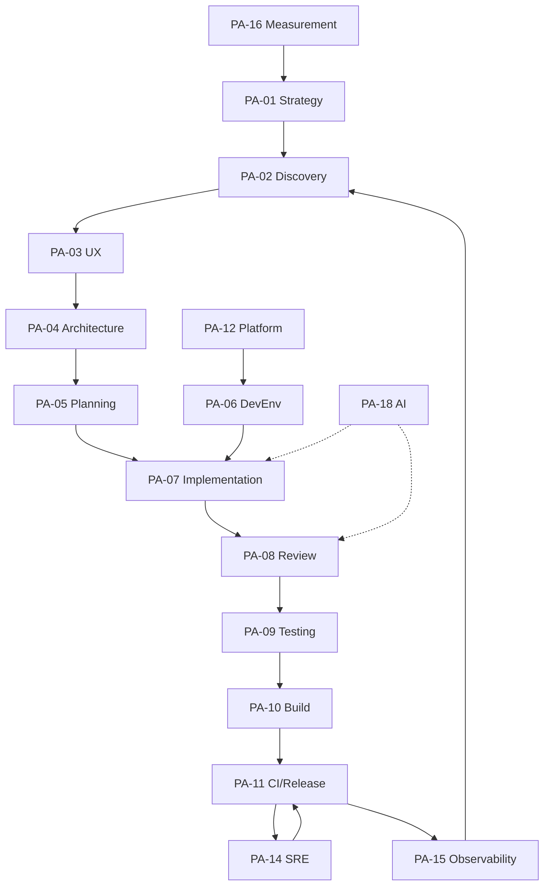

# Unified Process Areas & Workflow Catalog (Mid-2026 Industry Reference)

## Document metadata

| Field | Value |
|-------|-------|
| **Version** | 1.0.0 |
| **Date** | 2026-07-15 |
| **Research base date** | 2026-07-12 |
| **Source runs** | ocg-minimax-m3 (complete), ocg-kimi-k2.7-code (complete), ocg-deepseek-v4-flash (complete), ocg-mimo-v2.5 (complete), ocg-qwen3.7-plus (partial) |
| **Consolidation method** | Exhaustive merge of agent research reports; canonical PA-01..PA-18 taxonomy; workflow dedup by semantic synonym; distinct agent-local IDs preserved as Variations or appended sub-numbers |
| **Primary depth source** | [ocg-minimax-m3/research_report.md](../ocg-minimax-m3/research_report.md) (~114 workflows) |
| **Primary evidence breadth** | [ocg-kimi-k2.7-code/research_report.md](../ocg-kimi-k2.7-code/research_report.md) (121 sources) |
| **Output path** | `consolidated/UNIFIED-PROCESS-CATALOG.md` |

## Executive overview

High-performing software organizations in mid-2026 operate **18 concurrent Process Areas** — capability-based domains spanning strategy through retirement — each containing nested, evidence-backed **Workflows**. This catalog unifies findings from four complete parallel OCG deep-research runs into a single enterprise-grade reference model.

**Four capability layers** [consensus]: Direction (PA-01..04) → Delivery (PA-05..11) → Feedback (PA-12..16) → Sustainability (PA-17..18).

**Universal pillars** [consensus]: trunk-based development; CI; test pyramid; mandatory code review; progressive delivery; SLO-driven reliability; OpenTelemetry; shift-left security (NIST SSDF, OWASP SAMM, SLSA).

**AI integration** [deepseek,mimo,minimax,kimi]: DORA 2025 — **7.2% delivery stability decrease per 25% AI adoption increase** when fundamentals are weak; verification tax on AI-generated code.

## Taxonomy principles & naming conventions

- **PA-XX / WF-XX.YY** — canonical IDs; agent-local numbering differences documented in Variations
- **Agent tags** — `[minimax]` `[kimi]` `[deepseek]` `[mimo]` `[qwen]` or `consensus` (≥3 agents)
- **Classification** — Universal | Leading-edge | Context-dependent | Emerging | Deprecated
- **Tiers** — Minimum / Standard / Leading-edge

## Process Area index

| ID | Process Area | Layer | Workflows | Agent coverage |
|----|--------------|-------|----------:|----------------|
| PA-01 | Strategy, Portfolio & Product Direction | Direction | 5 | consensus |
| PA-02 | Discovery, Requirements & Product Definition | Direction | 5 | consensus |
| PA-03 | UX & Product Design | Direction | 5 | consensus |
| PA-04 | Architecture & Technical Design | Direction | 6 | consensus |
| PA-05 | Planning & Work Management | Delivery | 6 | consensus |
| PA-06 | Development Environment & Toolchain | Delivery | 5 | consensus |
| PA-07 | Software Implementation | Delivery | 6 | consensus |
| PA-08 | Code Review & Knowledge Sharing | Delivery | 6 | consensus |
| PA-09 | Testing, QE & Verification | Delivery | 9 | consensus |
| PA-10 | Build, Integration & Artifact Management | Delivery | 6 | consensus |
| PA-11 | CI, Release & Deployment | Delivery | 8 | consensus |
| PA-12 | Platform Engineering & IDP | Feedback | 6 | consensus |
| PA-13 | Security, Privacy, Risk & Compliance | Feedback | 8 | consensus |
| PA-14 | Reliability, Operations & SRE | Feedback | 8 | consensus |
| PA-15 | Observability & Production Feedback | Feedback | 7 | consensus |
| PA-16 | Measurement, DevEx & Continuous Improvement | Feedback | 5 | consensus |
| PA-17 | Maintenance, Evolution & Retirement | Sustainability | 5 | [minimax,mimo] |
| PA-18 | AI-Assisted / Agentic Software Engineering | Sustainability | 8 | [minimax,kimi,deepseek,mimo] |

---

## Process Areas

### PA-01: Strategy, Portfolio & Product Direction

**Layer:** Direction | **Agent coverage:** consensus

**Definition:** The capability that determines what to build, why, and at what investment level. Sets organizational objectives, allocates capital and people to product areas, and provides a multi-quarter horizon for the rest of the SDLC.

**Purpose:** Align engineering execution with market opportunity and business strategy; prevent solution-shop drift; balance short-term delivery with long-term platform investment.

**Mid-2026 relevance:** Universal. Without explicit strategy, organizations default to loudest-customer-wins, which DORA's research shows is correlated with lower delivery performance.

**Primary inputs:** Market data, customer evidence, OKRs from leadership, capacity models, technical-debt inventory.

**Primary outputs:** Portfolio allocation (% of engineering capacity to growth / run-the-business / platform / R&D), product strategy docs, multi-quarter roadmaps, business cases / PR-FAQs, investment theses.

**Primary dependencies:** PA-02 (Discovery feeds the strategy), PA-04 (Architecture informs platform-investment level), PA-16 (DevEx metrics inform organizational health).

**Primary metrics & gates:** Outcome metrics tied to business KPIs (revenue, engagement, retention, reliability); portfolio-level re-allocation cadence (quarterly minimum); strategic alignment score (sample-based).

**Pitfalls & mitigations:**
- *Pitfall:* Strategy becomes a slide deck nobody reads. *Mitigation:* Strategy is expressed as a set of OKRs with named owners and check-ins.
- *Pitfall:* Portfolio governed by stage-gate review boards. *Mitigation:* Continuous funding rounds (Shape Up betting cycles, Marty Cagan's empowered teams) are the modern pattern; governance reviews are lightweight.

**Context variations:**
- *Startup:* Single PM/CEO sets strategy; OKRs are informal. Discovery (PA-02) and strategy collapse.
- *Regulated enterprise:* Strategy must align to compliance roadmaps; capital allocation includes compliance obligation.
- *Platform/infra:* "Product" is the internal platform; PA-01 outputs are SLAs and SLOs rather than revenue.

#### Agent consensus notes

- Four complete agents converged on this Process Area [consensus].

#### Workflows

##### WF-01.01: Strategic Planning and OKR Setting

| Attribute | Value |
|-----------|-------|
| **Classification** | universal |
| **Source agents** | consensus |
| **Detail level** | full detail |

- **Objective:** Set organization-level objectives and key results aligned to business strategy; cascade into team OKRs.
- **Classification:** universal
- **Triggers:** Annual/quarterly planning cycle; major business change (M&A, market shift).
- **Preconditions:** Business strategy and metrics are defined; leadership is committed.
- **Inputs:** Market analysis, customer evidence, prior OKRs, performance data, capacity model.
- **Steps / Decision Points:**
  1. Review business strategy and current state.
  2. Identify 3–5 organization-level objectives.
  3. Define 3–5 key results per objective (measurable, time-bound).
  4. Cascade to team OKRs (top-down and bottom-up reconciliation).
  5. Communicate, publish, and link to delivery.
- **Human-AI collaboration:** AI assists with OKR draft generation from strategy docs; human finalizes.
- **Roles / RACI:** CEO/COO (Accountable for org OKRs), VP Eng (Responsible for engineering OKRs), Engineering Managers (Consulted, Inform).
- **Tool categories:** OKR software (WorkBoard, Ally), strategy docs (Notion, Confluence), data sources.
- **Outputs:** Org OKR doc; team OKR cascade; alignment review.
- **Quality / security / completion criteria:** Each KR is measurable, time-bound, owned.
- **Automation opportunities:** AI-assisted draft; tracking dashboards.
- **Approval boundaries / escalation:** CEO sign-off on org OKRs; team OKRs by EM.
- **KPIs:** OKR achievement rate; alignment score; mid-quarter check-in frequency.
- **Anti-patterns:** OKRs as a top-down mandate with no team input; OKRs as a performance evaluation tool.
- **Tiers:** Minimum: annual planning only. Standard: quarterly OKRs. Leading-edge: continuous (Shape Up betting cycles integrated with OKRs).

##### WF-01.02: Portfolio Capital Allocation

| Attribute | Value |
|-----------|-------|
| **Classification** | universal |
| **Source agents** | consensus |
| **Detail level** | full detail |

- **Objective:** Allocate engineering capacity across growth / run-the-business / platform / R&D.
- **Classification:** universal
- **Triggers:** Quarterly business review; capacity re-allocation.
- **Preconditions:** OKRs are set; capacity model exists.
- **Inputs:** OKRs, engineering capacity by team, project list, technical-debt inventory.
- **Steps / Decision Points:**
  1. List all candidate investments.
  2. Score on strategic alignment, ROI, risk, dependencies.
  3. Allocate capacity against OKR weight and risk.
  4. Identify trade-offs; escalate to leadership for material trade-offs.
  5. Publish allocation; track.
- **Human-AI collaboration:** AI summarizes proposals; humans decide.
- **Roles / RACI:** VP Eng (A), Finance (C), Eng Managers (R), CTO (C for major trade-offs).
- **Tool categories:** Portfolio tools (Planview, Productboard, custom), spreadsheets.
- **Outputs:** Allocation memo, capacity calendar, prioritized investment list.
- **Quality / security / completion criteria:** Trade-offs are explicit; capacity is balanced.
- **Automation opportunities:** AI scoring; risk aggregation.
- **Approval boundaries / escalation:** VP Eng for routine; CTO/CEO for >20% reallocation.
- **KPIs:** Allocation adherence, project cancellation rate, time-to-decision on trade-offs.
- **Anti-patterns:** "All top priority"; capacity overcommitment; underfunding platform.
- **Tiers:** Minimum: annual budget. Standard: quarterly reallocation. Leading-edge: continuous reallocation with risk-weighted scoring.

##### WF-01.03: Business Case / PR-FAQ Authoring

| Attribute | Value |
|-----------|-------|
| **Classification** | universal |
| **Source agents** | consensus |
| **Detail level** | compact |

- **Objective:** Produce a single-page "press release" and FAQ that frames a major investment.
- **Classification:** universal
- **Triggers:** Investment > threshold; new product line; major platform shift.
- **Preconditions:** Strategy alignment, customer evidence.
- **Inputs:** Customer evidence, market data, technical feasibility.
- **Steps:** Draft PR (announcement-style, future tense) → FAQ (customer, internal, technical) → narrative review → approval.
- **Human-AI collaboration:** AI draft from input docs; human refinement.
- **Roles / RACI:** Sponsor (A), Author (R), Reviewers (C).
- **Tools:** Docs, AI assistant.
- **Outputs:** PR-FAQ doc, archived in decision log.
- **Quality criteria:** Problem stated from customer view; success criteria clear; alternatives considered.
- **Automation:** AI draft.
- **Approval:** Sponsor sign-off; archived.
- **KPIs:** Time-to-PR-FAQ; approval rate.
- **Anti-patterns:** PR-FAQ as a checkbox; bypassing for known pet projects.
- **Tiers:** Minimum: written proposal. Standard: PR-FAQ. Leading-edge: PR-FAQ + ADR + risk register.

##### WF-01.04: Investment Thesis Review

| Attribute | Value |
|-----------|-------|
| **Classification** | leading-edge |
| **Source agents** | consensus |
| **Detail level** | compact |

- **Objective:** Quarterly review of major investments against outcomes.
- **Classification:** leading-edge
- **Triggers:** Quarterly.
- **Steps:** Review metrics → compare to thesis → continue / pivot / kill.
- **KPIs:** Decision rate; kill rate; pivot rate.
- **Anti-patterns:** Zombie projects.

##### WF-01.05: Strategic Posture and Competitive Response

| Attribute | Value |
|-----------|-------|
| **Classification** | context-dependent |
| **Source agents** | consensus |
| **Detail level** | compact |

- **Objective:** Document and refresh the org's strategic posture quarterly.
- **Classification:** context-dependent
- **Tools:** Strategy docs, OKR tools, market data.
- **KPIs:** Time-to-pivot, market share.

---

### PA-02: Discovery, Requirements & Product Definition

**Layer:** Direction | **Agent coverage:** consensus

**Definition:** The capability that turns strategy into shaped, ready-to-build work. Continuous engagement with users, framing of opportunities, and definition of the problem to be solved.

**Purpose:** Reduce waste by ensuring the team builds the right thing before the thing right. Provide enough context that the implementation (PA-07) is unblocked.

**Mid-2026 relevance:** Universal. Continuous Discovery (Teresa Torres) and Shape Up shaping are the canonical patterns.

**Primary inputs:** User research, customer interviews, support data, telemetry from PA-15, strategy outputs from PA-01.

**Primary outputs:** Opportunity Solution Trees, story maps, user stories, acceptance criteria, prototypes, RFCs.

**Primary dependencies:** PA-01 (strategy), PA-03 (UX), PA-15 (telemetry) feed discovery; PA-05 (planning) consumes the output.

**Primary metrics & gates:** Discovery cadence (weekly customer contact per team); opportunity back-log size; time-to-first-shape; shape-coverage rate (% of work shaped vs. raw).

**Pitfalls & mitigations:**
- *Pitfall:* Discovery becomes a "spec phase" that delays delivery. *Mitigation:* Discovery is concurrent with delivery, not ahead of it.
- *Pitfall:* Tickets without acceptance criteria. *Mitigation:* Discovery delivers a "definition of ready" that includes testable acceptance criteria.

**Context variations:**
- *B2B vs. B2C:* B2B often requires longer buying-committee work; B2C emphasizes rapid A/B testing.
- *Internal platforms:* Users are internal; "discovery" is developer research and usage telemetry.

#### Agent consensus notes

- Four complete agents converged on this Process Area [consensus].

#### Workflows

##### WF-02.01: Continuous Discovery Interview

| Attribute | Value |
|-----------|-------|
| **Classification** | leading-edge |
| **Source agents** | consensus |
| **Detail level** | full detail |

- **Objective:** Maintain weekly customer contact to surface opportunities.
- **Classification:** leading-edge
- **Triggers:** Weekly cadence per product team.
- **Preconditions:** Recruited panel of 5–10 customers; interview script.
- **Inputs:** Customer panel, prior interview notes, telemetry.
- **Steps:** Schedule → conduct 30-min interview → capture notes → tag opportunities → review with team.
- **Human-AI collaboration:** AI summarizes interview notes; suggests opportunity tags.
- **Roles / RACI:** PM (A), Designer (R), Eng (C), Customers (I).
- **Tools:** Calendar, doc tool, AI assistant, opportunity tree tool.
- **Outputs:** Interview notes, opportunity tags, updated opportunity solution tree.
- **Quality criteria:** ≥1 interview per week per product team; opportunities mapped to outcomes.
- **Automation:** AI transcription, summary, tagging.
- **Approval:** PM owns.
- **KPIs:** Interview cadence, opportunity count, time-to-shape.
- **Anti-patterns:** "Sales call" interviews; interview overload (no insight extraction).
- **Tiers:** Minimum: ad-hoc. Standard: monthly. Leading-edge: weekly per team with opportunity tree.

**Variations (kimi — Distinct workflow at same agent-local ID: Opportunity Assessment):**

| Attribute | Value |
|-----------|-------|
| **Objective** | Evaluate whether a product opportunity is worth pursuing before investing design/engineering resources |
| **Classification** | Universal |
| **Triggers** | New feature request, market signal, strategic initiative, customer escalation |
| **Preconditions** | Product strategy and target market defined |
| **Inputs** | Customer problem statement, market data, business objectives |

**Steps:**
1. Define the business problem and target user
2. Assess business value (revenue impact, strategic alignment, cost reduction)
3. Evaluate market size and competitive landscape
4. Identify key risks (value, usability, feasibility, business viability)
5. Define success metrics and measurement plan
6. Decision: Proceed / Pivot / Kill

**Decision Points:**
- Is the problem real and frequent enough? (value risk)
- Can users figure out how to use the solution? (usability risk)
- Can we build it? (feasibility risk)
- Does it work for our business model? (business viability risk)

**Human-AI Collaboration:**
- AI: Competitive analysis aggregation, market sizing estimates, draft opportunity assessment documents
- Human: Customer empathy, strategic judgment, go/no-go decisions

**RACI:**
- R: Product Manager
- A: VP Product / Product Leadership
- C: Engineering Lead, Design Lead, Business Stakeholders
- I: Delivery teams

**Tool Categories:** Product discovery tools (Jira Product Discovery, ProductBoard), analytics (Amplitude, Mixpanel), AI assistants for synthesis

**Outputs:** Completed opportunity assessment document with go/no-go recommendation

**Quality/Security/Completion Criteria:**
- All four risk dimensions assessed
- Success metrics defined with baseline and target
- At least one customer validation data point

**Automation Opportunities:** Auto-populate competitive landscape; AI-draft initial assessment from support ticket clusters

**Approval Boundaries:** Product Manager recommends; Product Leadership approves inve

##### WF-02.02: Opportunity Solution Tree Construction

| Attribute | Value |
|-----------|-------|
| **Classification** | leading-edge |
| **Source agents** | consensus |
| **Detail level** | full detail |

- **Objective:** Map customer evidence → opportunities → solutions → tests.
- **Classification:** leading-edge
- **Triggers:** New opportunity discovered; quarterly review.
- **Steps:** Outcome (north star) → opportunities → solutions → test assumptions.
- **Human-AI collaboration:** AI suggests node links; humans validate.
- **Tools:** Miro/MURAL, FigJam, AI assistant.
- **Outputs:** Living opportunity tree.
- **KPIs:** Tree update frequency; solutions tested.
- **Anti-patterns:** Static tree; solution-first.

**Variations (kimi — Distinct workflow at same agent-local ID: User Research & Problem Discovery):**

| Attribute | Value |
|-----------|-------|
| **Objective** | Develop deep understanding of user needs, behaviors, and pain points to inform product decisions |
| **Classification** | Universal |
| **Triggers** | New product initiative, declining metrics, user complaints, strategic pivot |
| **Preconditions** | Target user segment identified; research budget allocated |
| **Inputs** | User hypotheses, existing analytics, support data |

**Steps:**
1. Define research objectives and questions
2. Select appropriate methods (qualitative vs quantitative, attitudinal vs behavioral) per NN/g framework
3. Recruit participants matching target personas
4. Conduct research (interviews, observations, surveys, diary studies)
5. Synthesize findings into themes, personas, journey maps
6. Present insights and recommendations to product team

**Decision Points:**
- Qualitative vs quantitative: "Qualitative studies generate data about behaviors or attitudes based on observing or hearing them directly" while quantitative methods use instruments (src-nng-which-ux-methods)
- Generative (discover what's needed) vs evaluative (assess existing design)

**Human-AI Collaboration:**
- AI: Transcript analysis, theme extraction, survey generation, synthetic participant testing
- Human: Empathic observation, contextual interpretation, relationship building

**RACI:**
- R: UX Researcher
- A: Product Manager
- C: Design Lead, Engineering (for feasibility context)
- I: Broader product team

**Tool Categories:** Interview platforms (UserTesting, Lookback), survey tools (Typeform, Qualtrics), synthesis tools (Dovetail, Notion AI), analytics (FullStory, Hotjar)

**Outputs:** Research report, personas, journey maps, problem statements, insight repository

**Quality/Security/Completion Criteria:**
- Minimum 5 participants per segment for qualitative (saturation threshold)
- Research plan reviewed for bias
- Participant consent and data privacy compliance (GDPR, CCPA)

**Automation Opportunities:** AI-po

##### WF-02.03: User Story Authoring with Acceptance Criteria

| Attribute | Value |
|-----------|-------|
| **Classification** | universal |
| **Source agents** | consensus |
| **Detail level** | compact |

- **Objective:** Produce testable, focused user stories.
- **Classification:** universal
- **Format:** As a [user], I want [action], so that [outcome]. Given/When/Then acceptance criteria.
- **KPIs:** Acceptance criteria coverage, story cycle time.
- **Anti-patterns:** Vague criteria; too-large stories.

**Variations (kimi — Distinct workflow at same agent-local ID: Requirements Specification & Validation):**

| Attribute | Value |
|-----------|-------|
| **Objective** | Translate validated problems and opportunities into clear, testable requirements for delivery teams |
| **Classification** | Universal |
| **Triggers** | Validated opportunity assessment; completed user research |
| **Preconditions** | Problem-solution fit established; key risks mitigated |
| **Inputs** | Discovery artifacts, user stories, technical constraints, compliance requirements |

**Steps:**
1. Decompose opportunity into user stories / jobs-to-be-done
2. Define acceptance criteria for each story (testable, specific)
3. Identify dependencies and technical constraints
4. Prioritize using value/effort matrix or WSJF
5. Validate requirements with stakeholders and engineering
6. Baseline requirements and establish change control

**Decision Points:**
- Level of specification detail (user story vs detailed spec) based on team maturity and risk
- Build vs buy vs partner for specific capabilities

**Human-AI Collaboration:**
- AI: Draft user stories from research transcripts, generate acceptance criteria suggestions, identify missing edge cases
- Human: Validate completeness, negotiate scope, ensure business context

**RACI:**
- R: Product Manager / Business Analyst
- A: Product Owner
- C: Engineering Lead, QA Lead, Security
- I: Delivery team

**Tool Categories:** Requirements management (Jira, Linear, Aha!), specification tools (Confluence, Notion), AI writing assistants

**Outputs:** Prioritized backlog with acceptance criteria, requirements traceability matrix (regulated contexts), definition of ready

**Quality/Security/Completion Criteria:**
- Every story has testable acceptance criteria
- Security and privacy requirements identified (NIST SSDF alignment for regulated contexts)
- Definition of Ready met before entering sprint

**Automation Opportunities:** AI-generated acceptance criteria from user stories; automated dependency detection; requirements consistency checking

**Approval Boundaries:** P

##### WF-02.04: Story Mapping

| Attribute | Value |
|-----------|-------|
| **Classification** | universal |
| **Source agents** | consensus |
| **Detail level** | compact |

- **Objective:** Organize backlog by user journey.
- **Classification:** universal
- **Steps:** Spine (backbone) → walking skeleton → slices.
- **Tools:** Miro, Mural, physical board.
- **KPIs:** Slice granularity, release coverage.

##### WF-02.05: Shaping (Shape Up)

| Attribute | Value |
|-----------|-------|
| **Classification** | leading-edge |
| **Source agents** | consensus |
| **Detail level** | compact |

- **Objective:** Define boundaries, rabbit holes, and risks of a problem before betting.
- **Classification:** leading-edge
- **Steps:** Problem framing → bounds → rabbit holes → risks → no-go tests.
- **KPIs:** Shaping depth, time-to-shape.

---

### PA-03: UX & Product Design

**Layer:** Direction | **Agent coverage:** consensus

**Definition:** The capability that designs the user-facing artifact (interface, flow, content) to be effective, accessible, and on-brand.

**Purpose:** Translate problem definitions into designed experiences; ensure usability and accessibility; maintain design-system coherence across surfaces.

**Mid-2026 relevance:** Universal. The 2025 industry baseline is design-system-led, with Figma as the dominant collaboration tool and design tokens as the canonical system-of-record.

**Primary inputs:** Discovery outputs (PA-02), user research, brand guidelines, accessibility requirements (WCAG 2.2 AA is the mid-2026 baseline in regulated jurisdictions).

**Primary outputs:** Figma files, design tokens, prototypes, design-system components, accessibility annotations, usability-test results.

**Primary dependencies:** Feeds from PA-02; feeds to PA-07 (implementation), PA-04 (design informs architecture), PA-09 (designers supply test scenarios).

**Primary metrics & gates:** Google HEART (Happiness, Engagement, Adoption, Retention, Task success); SUS (System Usability Scale); time-to-implement for new screens; design-system coverage rate.

**Pitfalls & mitigations:**
- *Pitfall:* Hand-off Figma → engineering with no iteration. *Mitigation:* Co-design sessions; design QA as part of the implementation workflow.
- *Pitfall:* Accessibility bolted on late. *Mitigation:* Accessibility is a non-functional requirement on every screen; checked in PA-08 (Code Review) and PA-09 (Testing).

**Context variations:**
- *Regulated (healthcare, finance):* Heavier accessibility and content compliance requirements.
- *Consumer/transactional:* Visual polish and conversion-rate optimization dominate.
- *Internal tools:* Lower visual polish; emphasis on efficiency and error-prevention.

#### Agent consensus notes

- Four complete agents converged on this Process Area [consensus].

#### Workflows

##### WF-03.01: Design System Contribution

| Attribute | Value |
|-----------|-------|
| **Classification** | universal |
| **Source agents** | consensus |
| **Detail level** | full detail |

- **Objective:** Maintain and extend the design system as a product.
- **Classification:** universal
- **Triggers:** New component need; design system roadmap.
- **Preconditions:** Design tokens established.
- **Steps:** Need → design spec → review → implementation → release.
- **Roles:** Design system PM (A), designers (R), engineers (R for implementation).
- **Tools:** Figma, token pipeline (Style Dictionary), Storybook.
- **Outputs:** Components, tokens, docs.
- **KPIs:** Component adoption, drift rate, contribution rate.
- **Anti-patterns:** One-off components; token drift.

**Variations (kimi — Distinct workflow at same agent-local ID: UX Research & Usability Evaluation):**

| Attribute | Value |
|-----------|-------|
| **Objective** | Evaluate design solutions against user needs through structured testing to identify usability issues before development |
| **Classification** | Universal |
| **Triggers** | Design prototype ready for testing; usability concerns raised; new feature design |
| **Preconditions** | Testable prototype or existing product available |
| **Inputs** | Design prototypes, user personas, task scenarios |

**Steps:**
1. Define test objectives and success criteria
2. Select method: usability testing, heuristic evaluation, A/B testing, or cognitive walkthrough
3. Recruit representative participants
4. Conduct test sessions (moderated or unmoderated)
5. Analyze findings; categorize by severity
6. Present recommendations with evidence clips/quotes

**Decision Points:**
- Moderated vs unmoderated testing (depth vs scale)
- Formative (during design) vs summative (after design) evaluation
- NN/g method selection: "the context of product use" and "phases of product development" guide method choice (src-nng-which-ux-methods)

**Human-AI Collaboration:**
- AI: Automated heuristic evaluation, eye-tracking prediction, accessibility scanning, test session transcription
- Human: Empathic observation, contextual interpretation, severity judgment

**RACI:**
- R: UX Researcher
- A: Design Lead
- C: Product Manager, Engineering (feasibility of fixes)
- I: Design team, Product team

**Tool Categories:** Usability testing (UserTesting, Maze, Lookback), heuristic evaluation tools, accessibility (axe, Lighthouse), analytics (FullStory, Hotjar)

**Outputs:** Usability test report with severity-rated findings, video clips, prioritized fix recommendations

**Quality/Security/Completion Criteria:**
- Nielsen's 10 usability heuristics evaluated (src-nng-articles)
- Minimum 5 participants for qualitative usability testing
- Critical/blocker issues identified and tracked to resolution

**Automation Opportunities:** AI-powered usability issue det

##### WF-03.02: Wireframe / Prototype Iteration

| Attribute | Value |
|-----------|-------|
| **Classification** | universal |
| **Source agents** | consensus |
| **Detail level** | compact |

- **Objective:** Explore design alternatives with low cost.
- **Classification:** universal
- **Tools:** Figma, paper, AI image generation.
- **KPIs:** Iteration count, time-to-validation.

**Variations (kimi — Distinct workflow at same agent-local ID: Interaction & Visual Design):**

| Attribute | Value |
|-----------|-------|
| **Objective** | Create usable, accessible, and visually coherent interface designs that satisfy user needs and business goals |
| **Classification** | Universal |
| **Triggers** | Validated requirements; user research findings; design system updates needed |
| **Preconditions** | User research completed; requirements baselined |
| **Inputs** | User stories, research findings, brand guidelines, design system |

**Steps:**
1. Information architecture and content structure
2. Low-fidelity wireframes for key flows
3. Interaction design (navigation, states, transitions, error handling)
4. Visual design (typography, color, spacing, iconography)
5. Responsive/adaptive design for target platforms
6. Design specification and developer handoff
7. Design QA during implementation

**Decision Points:**
- Fidelity level based on risk and complexity
- Custom vs design-system component
- Platform-specific vs cross-platform patterns

**Human-AI Collaboration:**
- AI: Generate layout variations, design-to-code translation, accessibility contrast checking, asset generation
- Human: Creative direction, brand alignment, interaction nuance, emotional design

**RACI:**
- R: Product Designer / UI Designer
- A: Design Lead
- C: Product Manager, Frontend Engineering
- I: UX Researcher, Backend Engineering

**Tool Categories:** Design tools (Figma, Sketch), prototyping (Figma, ProtoPie), design tokens (Style Dictionary), handoff (Figma Dev Mode, Zeplin)

**Outputs:** Interactive prototypes, design specifications, component specifications, asset exports, design tokens

**Quality/Security/Completion Criteria:**
- WCAG 2.2 AA compliance verified
- All interaction states designed (default, hover, active, disabled, error, loading, empty)
- Responsive breakpoints defined
- Design review approved by Design Lead and Product Manager

**Automation Opportunities:** AI-generated design variations; automated design-to-code; design linting for consistency; auto

##### WF-03.03: Usability Testing Session

| Attribute | Value |
|-----------|-------|
| **Classification** | universal |
| **Source agents** | consensus |
| **Detail level** | compact |

- **Objective:** Validate design with target users.
- **Classification:** universal
- **Steps:** Recruit → script → moderate → analyze.
- **KPIs:** SUS score, task success, time-on-task.

**Variations (kimi — Distinct workflow at same agent-local ID: Design System Governance):**

| Attribute | Value |
|-----------|-------|
| **Objective** | Maintain a consistent, scalable, and accessible component library that accelerates design and development |
| **Classification** | Context-dependent (scale-dependent) |
| **Triggers** | New component need; inconsistency detected; platform update; accessibility audit finding |
| **Preconditions** | Existing design system or decision to create one |
| **Inputs** | Component requests, usage analytics, accessibility audit results, platform updates |

**Steps:**
1. Submit component proposal with use cases and justification
2. Review against existing components (avoid duplication)
3. Design component with all states and variants
4. Implement component with accessibility and testing
5. Document usage guidelines and do/don't examples
6. Publish and communicate release
7. Monitor adoption and usage metrics

**Decision Points:**
- New component vs variant of existing
- Breaking change vs non-breaking
- Deprecation timeline for replaced components

**Human-AI Collaboration:**
- AI: Automated accessibility testing, component code generation from design, usage analytics, documentation drafting
- Human: Design decisions, governance reviews, breaking change management

**RACI:**
- R: Design System Team / Platform Designer
- A: Design System Lead
- C: Product Designers, Frontend Engineers, Accessibility Specialist
- I: All product teams

**Tool Categories:** Component libraries (Storybook, Figma libraries), documentation (Zeroheight, Storybook), testing (Chromatic, Percy), token management (Style Dictionary)

**Outputs:** Published components, release notes, updated documentation, migration guides for breaking changes

**Quality/Security/Completion Criteria:**
- Component passes accessibility audit (axe-core)
- Visual regression tests passing
- Documentation complete with usage examples
- Adopted by ≥2 consuming teams before declaring stable

**Automation Opportunities:** Automated visual regression testing; AI-generated

##### WF-03.04: Accessibility Audit (WCAG 2.2)

| Attribute | Value |
|-----------|-------|
| **Classification** | universal (regulated) / leading-edge (consumer) |
| **Source agents** | consensus |
| **Detail level** | compact |

- **Objective:** Verify compliance with WCAG 2.2 AA.
- **Classification:** universal (regulated) / leading-edge (consumer)
- **Tools:** axe, Lighthouse, manual review.
- **KPIs:** Issues by severity, remediation rate.

##### WF-03.05: Design QA on Implemented Screens

| Attribute | Value |
|-----------|-------|
| **Classification** | universal |
| **Source agents** | consensus |
| **Detail level** | compact |

- **Objective:** Verify implementation matches design.
- **Classification:** universal
- **Steps:** Compare Figma to rendered screen; flag deltas.
- **Tools:** Figma, Percy, Chromatic.
- **KPIs:** Delta rate, fix time.

---

### PA-04: Architecture & Technical Design

**Layer:** Direction | **Agent coverage:** consensus

**Definition:** The capability that produces and evolves the technical structure of systems, ensuring fitness for current and anticipated needs.

**Purpose:** Reduce the cost of change; manage technical debt; align technical decisions to business strategy.

**Mid-2026 relevance:** Universal. Architecture is increasingly expressed through evolutionary architecture (fitness functions) and lightweight documentation (ADRs, RFCs).

**Primary inputs:** Strategy (PA-01), discovery (PA-02), reliability requirements (PA-14), security requirements (PA-13), platform capabilities (PA-12).

**Primary outputs:** ADRs, RFCs, architecture diagrams (C4 model is the canonical notation), threat models, fitness functions, technology radar entries, reference architectures.

**Primary dependencies:** Inputs from PA-01, PA-13, PA-14; outputs feed PA-07 (implementation), PA-10 (build), PA-12 (platform).

**Primary metrics & gates:** ADR review time; architecture-decision cycle time; fitness-function pass rate; tech-debt ratio (cycle-time tax).

**Pitfalls & mitigations:**
- *Pitfall:* Big-design-up-front (BDUF). *Mitigation:* Evolutionary architecture; just-enough design for the next quarter.
- *Pitfall:* Architecture as ivory tower. *Mitigation:* Architecture is reviewed in PA-08 (Code Review) and validated against PA-15 (Observability) and PA-14 (SLOs).

**Context variations:**
- *Monolith-first orgs:* Strangler Fig for incremental migration; minimize premature decomposition.
- *Hyperscale:* Heavy use of platform and standardized reference architectures.
- *Regulated:* Formal architecture review boards still common but lightweight; threat modeling is mandatory.

#### Agent consensus notes

- Four complete agents converged on this Process Area [consensus].

#### Workflows

##### WF-04.01: Architecture Decision Record (ADR)

| Attribute | Value |
|-----------|-------|
| **Classification** | universal |
| **Source agents** | consensus |
| **Detail level** | full detail |

- **Objective:** Capture a significant architectural decision in lightweight, durable form.
- **Classification:** universal
- **Triggers:** Decision with long-term impact; trade-off selection.
- **Preconditions:** Decision owner identified.
- **Steps:** Context → decision → consequences → alternatives considered.
- **Tools:** Markdown, ADR tools (log4brains, adr-tools), repo.
- **Outputs:** ADR file in `docs/adr/`.
- **Quality criteria:** Reversibility considered; alternatives explicit.
- **KPIs:** ADR review time, ADRs per quarter.
- **Anti-patterns:** "Big Design" ADRs; ADR theatre; living documents that mutate.
- **Tiers:** Minimum: free-form doc. Standard: ADR template. Leading-edge: ADR + fitness function.

##### WF-04.02: RFC / Tech Design Review

| Attribute | Value |
|-----------|-------|
| **Classification** | universal |
| **Source agents** | consensus |
| **Detail level** | full detail |

- **Objective:** Review a significant technical design before implementation.
- **Classification:** universal
- **Triggers:** New service, major refactor, cross-team impact.
- **Preconditions:** Author has draft; reviewers invited.
- **Inputs:** Discovery output, architecture context.
- **Steps:** Author posts RFC → review period (1–2 weeks) → comment thread → accept/reject.
- **Roles:** Author (R), Reviewers (C), Tech Lead (A).
- **Tools:** Doc tool, repo, meeting.
- **Outputs:** Accepted RFC; ADR if applicable.
- **KPIs:** RFC cycle time, acceptance rate.
- **Anti-patterns:** RFC theatre; RFCs without implementation.

##### WF-04.03: Threat Modeling (STRIDE / PASTA)

| Attribute | Value |
|-----------|-------|
| **Classification** | universal (regulated) / leading-edge (others) |
| **Source agents** | consensus |
| **Detail level** | compact |

- **Objective:** Identify security threats during design.
- **Classification:** universal (regulated) / leading-edge (others)
- **Steps:** Identify assets → build DFD → apply STRIDE/PASTA → prioritize mitigations.
- **Tools:** Microsoft Threat Modeling Tool, OWASP Threat Dragon.
- **KPIs:** Threats per RFC, mitigations tracked.

##### WF-04.04: Fitness Function Definition

| Attribute | Value |
|-----------|-------|
| **Classification** | leading-edge |
| **Source agents** | consensus |
| **Detail level** | compact |

- **Objective:** Define a measurable property the architecture must maintain.
- **Classification:** leading-edge
- **Examples:** Latency p99 < 200ms; mod coupling < threshold; test coverage of critical paths.
- **KPIs:** Fitness function execution rate, pass rate.

##### WF-04.05: Technology Radar Refresh

| Attribute | Value |
|-----------|-------|
| **Classification** | universal |
| **Source agents** | consensus |
| **Detail level** | compact |

- **Objective:** Quarterly assessment of tools, languages, frameworks.
- **Classification:** universal
- **Tools:** Internal radar (adopted from Thoughtworks), internal wiki.
- **KPIs:** Time to deprecate a "hold" item.

##### WF-04.06: Reference Architecture Publication

| Attribute | Value |
|-----------|-------|
| **Classification** | leading-edge |
| **Source agents** | consensus |
| **Detail level** | compact |

- **Objective:** Publish canonical patterns for new services.
- **Classification:** leading-edge
- **Examples:** AWS Well-Architected patterns, Google SRE patterns, Azure Architecture Center.
- **KPIs:** New service adoption of reference architecture.

---

### PA-05: Planning & Work Management

**Layer:** Delivery | **Agent coverage:** consensus

**Definition:** The capability that organizes and sequences work, manages the backlog, and provides a shared cadence.

**Purpose:** Make work visible; protect the team from context-switching; align the team's capacity to commitments.

**Mid-2026 relevance:** Universal. Lightweight, time-boxed planning is the canonical pattern; heavyweight stage-gate governance is deprecated.

**Primary inputs:** Shaped work from PA-02, capacity from PA-16, dependencies from PA-04.

**Primary outputs:** Iteration plans, sprint/cycle boards, project timelines, dependency maps, risk registers.

**Primary dependencies:** Feeds from PA-02; feeds to PA-07, PA-08, PA-11.

**Primary metrics & gates:** Cycle time, WIP limits, planned-vs-completed ratio, planning-overhead-to-delivery ratio.

**Pitfalls & mitigations:**
- *Pitfall:* Story points used for performance evaluation. *Mitigation:* Story points are estimation only; performance is measured by outcomes.
- *Pitfall:* Long planning cycles (sprint planning > 4 hours). *Mitigation:* Time-box planning; pull-based, not push-based.

**Context variations:**
- *Shape Up shops:* 6-week cycles, shaping before betting, cooling periods.
- *Spotify-derived squads:* Squad-level planning; less synchronization.
- *Regulated:* Change windows (e.g., banking change-advisory boards) still exist; offset by automated policy-as-code.

#### Agent consensus notes

- Four complete agents converged on this Process Area [consensus].

#### Workflows

##### WF-05.01: Iteration / Cycle Planning

| Attribute | Value |
|-----------|-------|
| **Classification** | universal |
| **Source agents** | consensus |
| **Detail level** | full detail |
| **Aliases** | Sprint/Iteration Planning |

- **Objective:** Plan the next iteration/cycle with the team.
- **Classification:** universal
- **Triggers:** Cycle start.
- **Preconditions:** Shaped work available; capacity known.
- **Steps:** Review → pull → commit → capacity check → publish.
- **Roles:** EM (A), Eng (R), PM (C).
- **Tools:** Jira, Linear, GitHub Projects, GitLab issues.
- **Outputs:** Cycle plan, committed work.
- **Quality criteria:** Plan ≤ capacity; clear ownership.
- **KPIs:** Planned-vs-completed, cycle predictability.
- **Anti-patterns:** Overcommit; pull from PM-side instead of team-side.

**Variations (kimi: Sprint/Iteration Planning):**

| Attribute | Value |
|-----------|-------|
| **Objective** | Define a realistic, goal-oriented plan for the upcoming iteration that the team commits to delivering |
| **Classification** | Universal |
| **Triggers** | Start of new sprint/iteration; continuous planning trigger in Kanban |
| **Preconditions** | Backlog refined; previous sprint retrospective completed; team capacity known |
| **Inputs** | Prioritized backlog, team velocity/capacity, sprint goal candidates, dependency map |

**Steps:**
1. Review previous sprint outcomes and retrospective actions
2. Product Owner presents sprint goal and top-priority items
3. Team discusses, estimates, and commits to scope
4. Identify dependencies, risks, and mitigation plans
5. Define sprint goal (outcome-focused, not task-focused)
6. Confirm team capacity and adjust scope
7. Document sprint plan and communicate

**Decision Points:**
- Scope vs goal: If goal cannot be met with available capacity, negotiate scope reduction
- Carry-over: Unfinished work from previous sprint re-evaluated, not auto-carried

**Human-AI Collaboration:**
- AI: Velocity-based capacity prediction, automated estimation suggestions from historical data, risk flagging from dependency graphs
- Human: Goal negotiation, scope trade-offs, team commitment

**RACI:**
- R: Scrum Master / Team Lead (facilitation)
- A: Product Owner (scope), Team (commitment)
- C: Engineering Manager (capacity)
- I: Stakeholders, dependent teams

**Tool Categories:** Work management (Jira, Linear, Azure DevOps, Shortcut), estimation (Planning Poker, AI estimation), capacity planning

**Outputs:** Sprint backlog with committed stories, sprint goal, capacity allocation, risk register

**Quality/Security/Completion Criteria:**
- Sprint goal is measurable and outcome-focused
- All committed stories meet Definition of Ready
- Team consensus on commitment (no silent dissent)
- Security/compliance items included if applicable

**Automation Opportunities:** AI-powered estimation fr

##### WF-05.02: Backlog Refinement

| Attribute | Value |
|-----------|-------|
| **Classification** | universal |
| **Source agents** | consensus |
| **Detail level** | full detail |
| **Aliases** | Backlog Refinement & Prioritization |

- **Objective:** Continuously shape and prioritize the backlog.
- **Classification:** universal
- **Triggers:** Continuous, ≥1×/week per team.
- **Steps:** Triage → shape → prioritize → ready.
- **KPIs:** Refinement cadence, % ready.

**Variations (kimi: Backlog Refinement & Prioritization):**

| Attribute | Value |
|-----------|-------|
| **Objective** | Maintain a healthy, actionable, and prioritized backlog that enables effective sprint planning |
| **Classification** | Universal |
| **Triggers** | Recurring refinement cadence (weekly/bi-weekly); new items added; strategy changes |
| **Preconditions** | Product backlog exists; team has capacity for refinement |
| **Inputs** | New requirements, stakeholder requests, technical debt items, bugs, discovery outputs |

**Steps:**
1. Review new items against opportunity assessment criteria
2. Decompose large items (epics) into appropriately sized stories
3. Add acceptance criteria and definition of ready checks
4. Estimate effort (relative sizing or t-shirt sizing)
5. Re-prioritize based on value, urgency, dependencies, and risk
6. Remove stale items (older than 6 months without action)
7. Ensure top-of-backlog items are sprint-ready

**Decision Points:**
- Prioritize vs deprioritize vs delete
- Split vs keep as single story
- Technical debt vs feature work allocation

**Human-AI Collaboration:**
- AI: Automated story decomposition suggestions, duplicate detection, staleness flagging, estimation from similar past work
- Human: Value judgment, strategic alignment, stakeholder negotiation

**RACI:**
- R: Product Owner
- A: Product Manager
- C: Engineering Lead (estimation, feasibility), UX (design readiness)
- I: Development team

**Tool Categories:** Backlog management (Jira, Linear, GitHub Projects), prioritization frameworks (RICE, WSJF, ICE), AI refinement assistants

**Outputs:** Refined and prioritized backlog; sprint-ready items at top; pruned stale items

**Quality/Security/Completion Criteria:**
- Top 2 sprints worth of items are sprint-ready
- Every item has clear acceptance criteria
- Stale items regularly pruned
- Technical debt visibly tracked (not hidden)

**Automation Opportunities:** Auto-detect duplicate stories; AI-suggested story splits; automated staleness alerts; auto-estimation from histori

##### WF-05.03: Dependency Management

| Attribute | Value |
|-----------|-------|
| **Classification** | universal |
| **Source agents** | consensus |
| **Detail level** | compact |
| **Aliases** | Cross-Team Coordination & Dependency Management |

- **Objective:** Track and unblock cross-team dependencies.
- **Classification:** universal
- **Steps:** Identify → owner → due date → escalate.
- **KPIs:** Dependency age, unblock time.

**Variations (kimi: Cross-Team Coordination & Dependency Management):**

| Attribute | Value |
|-----------|-------|
| **Objective** | Identify, track, and resolve dependencies between teams to prevent blockers and enable predictable delivery |
| **Classification** | Context-dependent (scale-dependent) |
| **Triggers** | Multi-team initiative; dependency identified in planning; cross-team blocker |
| **Preconditions** | Multiple teams working on related initiatives |
| **Inputs** | Team sprint plans, dependency maps, architecture diagrams, roadmap |

**Steps:**
1. Map dependencies during planning (upstream, downstream, shared services)
2. Classify dependency type (blocking, informational, shared resource)
3. Negotiate timelines and commitments with dependent teams
4. Track dependencies in shared visibility tool
5. Monitor for slippage and proactively communicate
6. Resolve blockers through escalation or replanning
7. Review dependency patterns in retrospectives

**Decision Points:**
- Decouple vs coordinate: Can we architect away the dependency?
- Sequential vs parallel: Can teams work in parallel with interface contracts?

**Human-AI Collaboration:**
- AI: Automated dependency detection from code changes, impact analysis, risk scoring
- Human: Negotiation, prioritization trade-offs, relationship management

**RACI:**
- R: Scrum Master / Program Manager
- A: Engineering Manager / Director
- C: Team Leads, Architects
- I: All affected teams

**Tool Categories:** Dependency tracking (Jira Advanced Roadmaps, Aha!), architecture visualization, API contract management, communication (Slack, Teams)

**Outputs:** Dependency map, coordination agreements, blocker resolution plans, updated timelines

**Quality/Security/Completion Criteria:**
- All known dependencies mapped and tracked
- Blocking dependencies have committed delivery dates
- No unresolved blockers older than 1 sprint without escalation

**Automation Opportunities:** Automated dependency detection from git/code changes; CI pipeline dependency visualization; automated blocker alerts

##### WF-05.04: Risk Register Maintenance

| Attribute | Value |
|-----------|-------|
| **Classification** | universal |
| **Source agents** | consensus |
| **Detail level** | compact |

- **Objective:** Track delivery and technical risks.
- **Classification:** universal
- **Steps:** Identify → score → owner → review.
- **KPIs:** Risk review cadence, risk burn-down.

##### WF-05.05: Capacity Planning

| Attribute | Value |
|-----------|-------|
| **Classification** | universal |
| **Source agents** | consensus |
| **Detail level** | compact |

- **Objective:** Forecast engineering capacity for upcoming periods.
- **Classification:** universal
- **Inputs:** PTO, on-call load, hiring pipeline.
- **KPIs:** Forecast accuracy.

##### WF-05.06: Shaping Cycle (Shape Up)

| Attribute | Value |
|-----------|-------|
| **Classification** | leading-edge |
| **Source agents** | consensus |
| **Detail level** | compact |

- **Objective:** Shape work before betting.
- **Classification:** leading-edge
- **Steps:** Frame → rabbit holes → risks → boundaries.
- **KPIs:** Shape-to-build ratio.

---

### PA-06: Development Environment & Toolchain

**Layer:** Delivery | **Agent coverage:** consensus

**Definition:** The capability that provides the on-ramp for engineers to write, build, test, and debug code productively.

**Purpose:** Minimize time-to-first-commit; standardize the local-to-CI environment; reduce "works on my machine" failures.

**Mid-2026 relevance:** Universal. Cloud dev environments (Codespaces, Gitpod) and standardized devcontainers are the canonical pattern in 2026.

**Primary inputs:** Languages and frameworks from PA-04, security requirements from PA-13.

**Primary outputs:** Devcontainer definitions, monorepo or poly-repo strategies, IDE configurations, InnerSource / CONTRIBUTING.md standards, template repositories.

**Primary dependencies:** Feeds from PA-04, PA-13; feeds to PA-07, PA-09, PA-10, PA-12.

**Primary metrics & gates:** Time-to-first-commit, "works on my machine" rate, build-success rate on first try, dev-environment setup time.

**Pitfalls & mitigations:**
- *Pitfall:* Snowflake dev environments. *Mitigation:* Devcontainer + Codespaces; monorepo with standardized toolchain.
- *Pitfall:* Slow feedback loop in dev (e.g., test takes 30 minutes). *Mitigation:* Incremental builds, remote caching, test selection.

**Context variations:**
- *Polyglot orgs:* Multiple language toolchains; higher platform-engineering investment.
- *Monorepo orgs:* Heavy build-system investment (Bazel, Pants, Nx).
- *Regulated:* Strict access controls; reproducibility emphasized.

#### Agent consensus notes

- Four complete agents converged on this Process Area [consensus].

#### Workflows

##### WF-06.01: Dev Environment Provisioning

| Attribute | Value |
|-----------|-------|
| **Classification** | universal |
| **Source agents** | consensus |
| **Detail level** | full detail |

- **Objective:** Engineer can run code locally or remotely within minutes.
- **Classification:** universal
- **Triggers:** New hire, project change.
- **Steps:** Use devcontainer / Codespaces → bootstrap → commit.
- **Tools:** Devcontainers, Codespaces, Gitpod.
- **KPIs:** Time-to-first-commit, first-day-PR rate.
- **Anti-patterns:** Snowflake laptops; manual setup scripts.

##### WF-06.02: IDE / Editor Standardization

| Attribute | Value |
|-----------|-------|
| **Classification** | universal |
| **Source agents** | consensus |
| **Detail level** | compact |

- **Objective:** Standardize editor config; reduce friction.
- **Classification:** universal
- **Tools:** .editorconfig, settings sync, language server configs.
- **KPIs:** Format-fail rate, lint pass rate.

##### WF-06.03: Monorepo / Polyrepo Strategy Decision

| Attribute | Value |
|-----------|-------|
| **Classification** | universal |
| **Source agents** | consensus |
| **Detail level** | compact |

- **Objective:** Decide and maintain source-control strategy.
- **Classification:** universal
- **Inputs:** Build system choice, team structure, dependency graph.
- **KPIs:** Build time, dependency churn.

##### WF-06.04: InnerSource / CONTRIBUTING Standards

| Attribute | Value |
|-----------|-------|
| **Classification** | leading-edge |
| **Source agents** | consensus |
| **Detail level** | compact |

- **Objective:** Standardize cross-team contribution.
- **Classification:** leading-edge
- **Outputs:** CONTRIBUTING.md, owner files.
- **KPIs:** Cross-team PR rate, PR turnaround.

##### WF-06.05: Local Test Selection & Feedback

| Attribute | Value |
|-----------|-------|
| **Classification** | leading-edge |
| **Source agents** | consensus |
| **Detail level** | compact |

- **Objective:** Run only relevant tests in dev loop.
- **Classification:** leading-edge
- **Tools:** Bazel, Nx, Jest test selection.
- **KPIs:** Local test time, CI time savings.

---

### PA-07: Software Implementation

**Layer:** Delivery | **Agent coverage:** consensus

**Definition:** The capability that produces source code, committed to a shared repository, that implements the change.

**Purpose:** Convert shaped work into a passing build; preserve code quality through review (PA-08) and tests (PA-09).

**Mid-2026 relevance:** Universal. Trunk-based development, semantic versioning, conventional commits, and feature flags are the canonical patterns.

**Primary inputs:** Shaped work from PA-02/PA-05, architecture from PA-04, dev environment from PA-06.

**Primary outputs:** Commits, pull/merge requests, feature flags, code documentation.

**Primary dependencies:** Feeds from PA-04, PA-05, PA-06; feeds to PA-08, PA-09, PA-10.

**Primary metrics & gates:** Commit cadence, code-review cycle time, defect escape rate, feature-flag debt.

**Pitfalls & mitigations:**
- *Pitfall:* Long-lived feature branches. *Mitigation:* Trunk-based development; feature flags.
- *Pitfall:* Untested or undocumented feature flags. *Mitigation:* Flag lifecycle policy; automatic cleanup tooling.
- *Pitfall:* "Commit noise" (mixed concerns). *Mitigation:* Conventional Commits and small CLs.

**Context variations:**
- *Libraries:* Strict semver; longer backward-compatibility windows.
- *Internal services:* Faster deprecation; shorter windows.
- *Open source:* Higher changelog hygiene; contributor docs.

#### Agent consensus notes

- Four complete agents converged on this Process Area [consensus].

#### Workflows

##### WF-07.01: Trunk-Based Commit

| Attribute | Value |
|-----------|-------|
| **Classification** | universal |
| **Source agents** | consensus |
| **Detail level** | full detail |

- **Objective:** Land small commits on trunk frequently.
- **Classification:** universal
- **Triggers:** Continuous.
- **Preconditions:** Trunk is always green; CI is fast; tests are reliable.
- **Steps:** Pull → small change → local test → commit (≤200 LOC ideally) → push.
- **Tools:** Git, CI.
- **KPIs:** Commit frequency, commit size, trunk broken-window.
- **Anti-patterns:** Long-lived branches; large commits.

##### WF-07.02: Feature Flag Introduction and Lifecycle

| Attribute | Value |
|-----------|-------|
| **Classification** | universal |
| **Source agents** | consensus |
| **Detail level** | full detail |

- **Objective:** Decouple release from deployment via flags.
- **Classification:** universal
- **Triggers:** Incomplete work merged; A/B test; ops kill switch.
- **Steps:** Create flag (release, experiment, ops, permission) → implement → test both states → rollout → remove flag.
- **Tools:** LaunchDarkly, Split, Unleash, in-house.
- **KPIs:** Flag debt, flag removal rate.
- **Anti-patterns:** Permanent flags; untested off-state.

##### WF-07.03: Commit Hygiene (Conventional Commits)

| Attribute | Value |
|-----------|-------|
| **Classification** | universal |
| **Source agents** | consensus |
| **Detail level** | compact |

- **Objective:** Standardize commit messages for tooling.
- **Classification:** universal
- **Format:** type(scope): description.
- **KPIs:** Conventional commit adherence.

##### WF-07.04: Pair / Mob Programming

| Attribute | Value |
|-----------|-------|
| **Classification** | leading-edge |
| **Source agents** | consensus |
| **Detail level** | compact |

- **Objective:** Spread knowledge; reduce review burden.
- **Classification:** leading-edge
- **KPIs:** Knowledge concentration (bus factor), session frequency.

##### WF-07.05: Documentation Alongside Code

| Attribute | Value |
|-----------|-------|
| **Classification** | universal |
| **Source agents** | consensus |
| **Detail level** | compact |

- **Objective:** Keep docs close to code; reduce drift.
- **Classification:** universal
- **Tools:** Doc tools, code-adjacent markdown, Docusaurus.
- **KPIs:** Doc freshness, doc coverage.

##### WF-07.06: AI-Assisted Coding

| Attribute | Value |
|-----------|-------|
| **Classification** | emerging |
| **Source agents** | consensus |
| **Detail level** | compact |

- **Objective:** Use AI assistants to amplify leverage.
- **Classification:** emerging
- **Steps:** Accept suggestion → review → test → commit.
- **Tools:** Copilot, Cursor, Claude Code, Codex.
- **KPIs:** Acceptance rate, defect rate on AI code, time saved.
- **Anti-patterns:** Blind acceptance; no test discipline.

---

### PA-08: Code Review & Knowledge Sharing

**Layer:** Delivery | **Agent coverage:** consensus

**Definition:** The capability that ensures code is reviewed for correctness, security, and knowledge spread, before it is integrated.

**Purpose:** Catch defects early; spread knowledge; mentor; enforce code standards.

**Mid-2026 relevance:** Universal. Google's reviewer guidelines, Conventional Comments, and PR templates are the canonical patterns. Heavyweight review boards are deprecated for routine code.

**Primary inputs:** Commits / PRs from PA-07, security policies from PA-13, architecture patterns from PA-04.

**Primary outputs:** Approved PRs, design feedback, security findings, test additions, ADR updates.

**Primary dependencies:** Feeds from PA-07, PA-13; feeds to PA-10, PA-11.

**Primary metrics & gates:** Review turnaround time, review depth (comments per CL), review SLA (e.g., first response within 4 working hours), defect post-merge.

**Pitfalls & mitigations:**
- *Pitfall:* "LGTM" rubber-stamping. *Mitigation:* Small CLs (Google guideline: ~200 lines), reviewer checklist, code review SLAs.
- *Pitfall:* Reviewer becomes bottleneck. *Mitigation:* Codeowners file; reviewer rotation; AI-assisted review.

**Context variations:**
- *Regulated:* Two-person review for security-sensitive code.
- *OSS:* Async review across timezones; PR templates; community norms.

#### Agent consensus notes

- Four complete agents converged on this Process Area [consensus].

#### Workflows

##### WF-08.01: Pull Request Review

| Attribute | Value |
|-----------|-------|
| **Classification** | universal |
| **Source agents** | consensus |
| **Detail level** | full detail |

- **Objective:** Review a PR for correctness, security, knowledge spread.
- **Classification:** universal
- **Triggers:** PR opened.
- **Preconditions:** CI green; small PR; description.
- **Steps:** Triage → assign reviewer → review with checklist → approve or request changes → merge.
- **Roles:** Author (R), Reviewer (R), Codeowner (A).
- **Tools:** GitHub, GitLab, Bitbucket.
- **KPIs:** First-response time, cycle time, comments per PR, defect post-merge.
- **Anti-patterns:** LGTM rubber-stamping; review bottleneck.
- **Tiers:** Minimum: manual review. Standard: codeowners + SLA. Leading-edge: AI-assisted review + structured comments.

##### WF-08.02: Conventional Comments

| Attribute | Value |
|-----------|-------|
| **Classification** | leading-edge |
| **Source agents** | consensus |
| **Detail level** | compact |

- **Objective:** Make code review comments constructive and labeled.
- **Classification:** leading-edge
- **Labels:** praise, suggestion, issue, question, nitpick, thought.
- **KPIs:** Label adoption, comment clarity score.

##### WF-08.03: Security-Focused Review

| Attribute | Value |
|-----------|-------|
| **Classification** | universal |
| **Source agents** | consensus |
| **Detail level** | compact |

- **Objective:** Catch security issues in PR.
- **Classification:** universal
- **Tools:** Semgrep, CodeQL, AI security review.
- **KPIs:** Findings per PR, time to remediate.

##### WF-08.04: Architecture Review in PR

| Attribute | Value |
|-----------|-------|
| **Classification** | universal |
| **Source agents** | consensus |
| **Detail level** | compact |

- **Objective:** Validate PR against architecture patterns.
- **Classification:** universal
- **KPIs:** Pattern adherence, ADR citations.

##### WF-08.05: Knowledge-Sharing Sessions

| Attribute | Value |
|-----------|-------|
| **Classification** | universal |
| **Source agents** | consensus |
| **Detail level** | compact |

- **Objective:** Spread knowledge beyond the PR.
- **Classification:** universal
- **Tools:** Tech talks, demo days, internal conferences.
- **KPIs:** Sessions per quarter, attendance.

##### WF-08.06: AI-Assisted Code Review

| Attribute | Value |
|-----------|-------|
| **Classification** | emerging |
| **Source agents** | consensus |
| **Detail level** | compact |

- **Objective:** Use AI to pre-review PRs.
- **Classification:** emerging
- **Tools:** Copilot code review, Coderabbit, Graphite, Anthropic Code Review.
- **KPIs:** AI findings accepted, review time savings.

---

### PA-09: Testing, QE & Verification

**Layer:** Delivery | **Agent coverage:** consensus

**Definition:** The capability that verifies the system meets its requirements, including functional, non-functional, and exploratory testing.

**Purpose:** Provide confidence to ship; catch defects before production; document intended behavior.

**Mid-2026 relevance:** Universal. The test pyramid is the canonical structure; contract testing and property-based testing are the leading-edge layers.

**Primary inputs:** Acceptance criteria from PA-02, code from PA-07, architecture from PA-04, security requirements from PA-13.

**Primary outputs:** Automated test suite, test reports, coverage reports, performance test baselines, fuzz test corpus, security test results.

**Primary dependencies:** Feeds from PA-07, PA-04, PA-13; feeds to PA-10, PA-11, PA-13.

**Primary metrics & gates:** Test pyramid ratio (many unit, few E2E), coverage (line/branch; not a quality metric, but a gate), mutation-test score, flake rate, mean-time-to-detect.

**Pitfalls & mitigations:**
- *Pitfall:* Ice-cream cone (mostly UI/E2E tests). *Mitigation:* Test pyramid discipline; test review.
- *Pitfall:* Flaky tests eroding trust. *Mitigation:* Quarantine lane, automatic flake detection, ownership.
- *Pitfall:* QA as a separate phase. *Mitigation:* Integrated QE: engineers own testability, QE engineers act as coaches and risk advisors.

**Context variations:**
- *Regulated:* Formal V&V; traceability matrix from requirements to tests.
- *ML systems:* Data validation, model evaluation, drift monitoring are first-class tests.
- *Mobile:* Device-cloud testing; on-device integration tests.

#### Agent consensus notes

- Four complete agents converged on this Process Area [consensus].

#### Workflows

##### WF-09.01: Test Pyramid Maintenance

| Attribute | Value |
|-----------|-------|
| **Classification** | universal |
| **Source agents** | consensus |
| **Detail level** | full detail |

- **Objective:** Maintain a healthy test pyramid.
- **Classification:** universal
- **Steps:** Audit test counts by layer → rebalance.
- **KPIs:** Test ratio, coverage, E2E run time, flake rate.
- **Anti-patterns:** Ice-cream cone; E2E-heavy.

##### WF-09.02: Unit Test Authoring (TDD/BDD)

| Attribute | Value |
|-----------|-------|
| **Classification** | universal |
| **Source agents** | consensus |
| **Detail level** | full detail |

- **Objective:** Tests are written alongside or before code.
- **Classification:** universal
- **Steps:** Red → Green → Refactor.
- **Tools:** Language-native (JUnit, pytest, Go test), mutation testing (Stryker, PIT).
- **KPIs:** Coverage, mutation score.

##### WF-09.03: Contract Testing (Pact)

| Attribute | Value |
|-----------|-------|
| **Classification** | leading-edge |
| **Source agents** | consensus |
| **Detail level** | compact |

- **Objective:** Verify API contracts between services.
- **Classification:** leading-edge
- **Tools:** Pact, OpenAPI schema tests.
- **KPIs:** Contract coverage, break rate.

##### WF-09.04: End-to-End Test Suite Maintenance

| Attribute | Value |
|-----------|-------|
| **Classification** | universal (sparse) |
| **Source agents** | consensus |
| **Detail level** | compact |

- **Objective:** Validate critical user journeys.
- **Classification:** universal (sparse)
- **Tools:** Playwright, Cypress, Selenium.
- **KPIs:** Coverage of critical paths, flake rate, runtime.

##### WF-09.05: Performance / Load Testing

| Attribute | Value |
|-----------|-------|
| **Classification** | leading-edge |
| **Source agents** | consensus |
| **Detail level** | compact |

- **Objective:** Verify performance SLOs.
- **Classification:** leading-edge
- **Tools:** k6, Locust, Gatling, JMeter.
- **KPIs:** p50/p95/p99, throughput, error rate.

##### WF-09.06: Fuzz / Property-Based Testing

| Attribute | Value |
|-----------|-------|
| **Classification** | emerging |
| **Source agents** | consensus |
| **Detail level** | compact |

- **Objective:** Find edge-case defects automatically.
- **Classification:** emerging
- **Tools:** AFL, libFuzzer, QuickCheck, Hypothesis.
- **KPIs:** Bugs found, corpus size.

##### WF-09.07: Security Testing in CI (SAST/DAST/SCA)

| Attribute | Value |
|-----------|-------|
| **Classification** | universal |
| **Source agents** | consensus |
| **Detail level** | compact |

- **Objective:** Detect security issues during CI.
- **Classification:** universal
- **Tools:** Semgrep, Snyk, Dependabot, Trivy, OWASP ZAP.
- **KPIs:** Findings by severity, fix rate.

##### WF-09.08: Exploratory Testing Session

| Attribute | Value |
|-----------|-------|
| **Classification** | universal |
| **Source agents** | consensus |
| **Detail level** | compact |

- **Objective:** Human-driven discovery of edge cases.
- **Classification:** universal
- **KPIs:** Sessions per cycle, defects found.

##### WF-09.09: AI-Generated Test Authoring

| Attribute | Value |
|-----------|-------|
| **Classification** | emerging |
| **Source agents** | consensus |
| **Detail level** | compact |

- **Objective:** Use AI to generate test cases from code or requirements.
- **Classification:** emerging
- **Tools:** Copilot, CodiumAI, Diffblue, Claude Code.
- **KPIs:** Acceptance rate, coverage gain, defect detection.

---

### PA-10: Build, Integration & Artifact Management

**Layer:** Delivery | **Agent coverage:** consensus

**Definition:** The capability that compiles, packages, and stores build artifacts with verified provenance and integrity.

**Purpose:** Produce reproducible, signed, traceable artifacts; enable supply chain integrity; decouple build from deployment.

**Mid-2026 relevance:** Universal. Hermetic, content-addressed builds (Bazel, Pants, Nx) and SLSA provenance are the canonical patterns in 2026.

**Primary inputs:** Source from PA-07, dependencies, build configuration.

**Primary outputs:** Container images, language packages, binaries, SBOM (CycloneDX/SPDX), SLSA provenance attestations, signed releases.

**Primary dependencies:** Feeds from PA-07, PA-09, PA-13; feeds to PA-11.

**Primary metrics & gates:** Build time, build success rate, cache hit rate, SBOM coverage, SLSA level (L3 is the high bar).

**Pitfalls & mitigations:**
- *Pitfall:* Non-reproducible builds. *Mitigation:* Hermetic, content-addressed builds; build sandboxing.
- *Pitfall:* Unsigned or unverified artifacts. *Mitigation:* Sigstore cosign, SLSA L3.
- *Pitfall:* Untracked dependencies. *Mitigation:* SBOM generation in CI; SCA scanning.

**Context variations:**
- *Monorepos:* Bazel/Pants/Nx required for performance.
- *Polyrepos:* Each repo's build must produce its own SBOM; centralized dependency manifest.

#### Agent consensus notes

- Four complete agents converged on this Process Area [consensus].

#### Workflows

##### WF-10.01: Hermetic Reproducible Build

| Attribute | Value |
|-----------|-------|
| **Classification** | leading-edge |
| **Source agents** | consensus |
| **Detail level** | full detail |

- **Objective:** Build artifacts are reproducible and content-addressed.
- **Classification:** leading-edge
- **Tools:** Bazel, Pants, Nx, Buck.
- **KPIs:** Reproducibility rate, build time, cache hit rate.
- **Anti-patterns:** Unpinned dependencies; non-hermetic builds.

##### WF-10.02: Container Image Build and Sign

| Attribute | Value |
|-----------|-------|
| **Classification** | universal |
| **Source agents** | consensus |
| **Detail level** | full detail |

- **Objective:** Produce signed, attested container images.
- **Classification:** universal
- **Steps:** Build → SBOM → sign (cosign) → SLSA provenance.
- **Tools:** Docker, Buildkit, Sigstore cosign, in-toto, SLSA generators.
- **KPIs:** Signed-build rate, SLSA level.
- **Anti-patterns:** Unsigned images; mutable base images.

##### WF-10.03: SBOM Generation and Publishing

| Attribute | Value |
|-----------|-------|
| **Classification** | universal |
| **Source agents** | consensus |
| **Detail level** | compact |

- **Objective:** Produce a Software Bill of Materials for every release.
- **Classification:** universal
- **Format:** CycloneDX, SPDX.
- **KPIs:** SBOM coverage.

##### WF-10.04: Dependency Lockfile Maintenance

| Attribute | Value |
|-----------|-------|
| **Classification** | universal |
| **Source agents** | consensus |
| **Detail level** | compact |

- **Objective:** Pin dependencies for reproducibility.
- **Classification:** universal
- **Tools:** lockfiles, Renovate, Dependabot.
- **KPIs:** Outdated dependency rate.

##### WF-10.05: Build Cache and Remote Execution

| Attribute | Value |
|-----------|-------|
| **Classification** | leading-edge |
| **Source agents** | consensus |
| **Detail level** | compact |

- **Objective:** Minimize build time at scale.
- **Classification:** leading-edge
- **Tools:** Bazel remote cache, BuildBuddy, engflow.
- **KPIs:** Cache hit rate, build time.

##### WF-10.06: Multi-Architecture / Multi-Platform Build

| Attribute | Value |
|-----------|-------|
| **Classification** | universal |
| **Source agents** | consensus |
| **Detail level** | compact |

- **Objective:** Build artifacts for multiple targets.
- **Classification:** universal
- **Tools:** Docker buildx, cross-compilation, Go cross-build.
- **KPIs:** Build coverage.

---

### PA-11: CI, Release & Deployment

**Layer:** Delivery | **Agent coverage:** consensus

**Definition:** The capability that moves changes from commit to production safely and repeatably, with progressive delivery.

**Purpose:** Enable always-deployable trunk; decouple deployment from release; minimize blast radius.

**Mid-2026 relevance:** Universal. Continuous Delivery is the canonical goal; progressive delivery (canary, blue-green, feature flags) is the canonical safe-rollout mechanism.

**Primary inputs:** Artifacts from PA-10, test results from PA-09, feature-flag config, environment config.

**Primary outputs:** Deployments, releases, audit logs, deployment notifications.

**Primary dependencies:** Feeds from PA-09, PA-10; feeds to PA-14, PA-15.

**Primary metrics & gates:** DORA four keys (deployment frequency, lead time, change fail rate, MTTR); deployment success rate; rollback time; canary error budget.

**Pitfalls & mitigations:**
- *Pitfall:* Manual deployment steps. *Mitigation:* Fully automated pipeline; no manual gates.
- *Pitfall:* Big-bang releases. *Mitigation:* Progressive delivery (canary, blue-green, feature flags).
- *Pitfall:* No rollback path. *Mitigation:* Versioned artifacts; one-command rollback; tested in game days.

**Context variations:**
- *Regulated:* Change windows; documented release approval (often as policy-as-code, not a meeting).
- *Mobile:* App-store gating (Apple, Google) forces release windows; feature flags offset.
- *High-scale:* Multi-region; cell-based deploys; risk-aware canary.

#### Agent consensus notes

- Four complete agents converged on this Process Area [consensus].

#### Workflows

##### WF-11.01: Continuous Integration Pipeline

| Attribute | Value |
|-----------|-------|
| **Classification** | universal |
| **Source agents** | consensus |
| **Detail level** | full detail |

- **Objective:** Every commit is verified by automated build and tests.
- **Classification:** universal
- **Triggers:** Every commit / PR.
- **Steps:** Checkout → build → unit test → static analysis → security scan → artifact.
- **Tools:** GitHub Actions, GitLab CI, CircleCI, Buildkite, Jenkins.
- **KPIs:** Pipeline duration, success rate, time-to-feedback.
- **Anti-patterns:** Slow CI; flaky tests; long serial pipelines.

##### WF-11.02: Continuous Deployment to Staging

| Attribute | Value |
|-----------|-------|
| **Classification** | universal |
| **Source agents** | consensus |
| **Detail level** | full detail |

- **Objective:** Every green commit is automatically deployed to staging.
- **Classification:** universal
- **Steps:** CI green → deploy to staging → smoke tests → notify.
- **KPIs:** Deployment frequency, lead time, deploy success rate.

##### WF-11.03: Progressive Delivery to Production

| Attribute | Value |
|-----------|-------|
| **Classification** | leading-edge |
| **Source agents** | consensus |
| **Detail level** | full detail |

- **Objective:** Roll out to production with progressive risk reduction.
- **Classification:** leading-edge
- **Steps:** Canary (1% → 5% → 25% → 100%) or blue-green with switch.
- **Tools:** Argo Rollouts, Flagger, Spinnaker, Harness, custom.
- **KPIs:** Rollback rate, error rate during rollout, SLO burn.

##### WF-11.04: Production Deploy via ChatOps / One-Click

| Attribute | Value |
|-----------|-------|
| **Classification** | universal |
| **Source agents** | consensus |
| **Detail level** | compact |

- **Objective:** Engineers can deploy safely with a single command.
- **Classification:** universal
- **Examples:** GitLab ChatOps, AWS CodeDeploy, internal "deploy" bots.
- **KPIs:** One-click deploy adoption.

##### WF-11.05: Production Deploy Approval (Policy as Code)

| Attribute | Value |
|-----------|-------|
| **Classification** | universal (regulated) / leading-edge (others) |
| **Source agents** | consensus |
| **Detail level** | compact |

- **Objective:** Enforce who can deploy what via code, not meetings.
- **Classification:** universal (regulated) / leading-edge (others)
- **Tools:** OPA, Conftest, custom policy.
- **KPIs:** Policy violations, exception rate.

##### WF-11.06: Release Notes / Changelog Generation

| Attribute | Value |
|-----------|-------|
| **Classification** | universal |
| **Source agents** | consensus |
| **Detail level** | compact |

- **Objective:** Auto-generate changelog from commits.
- **Classification:** universal
- **Tools:** Release Drafter, conventional-changelog, custom.
- **KPIs:** Release-notes freshness.

##### WF-11.07: Rollback and Forward-Fix

| Attribute | Value |
|-----------|-------|
| **Classification** | universal |
| **Source agents** | consensus |
| **Detail level** | compact |

- **Objective:** Recover from a bad release in minutes.
- **Classification:** universal
- **Tools:** Argo, Spinnaker, Spinnaker-style pipelines.
- **KPIs:** MTTR, rollback success rate.

##### WF-11.08: GitOps Reconciliation

| Attribute | Value |
|-----------|-------|
| **Classification** | leading-edge |
| **Source agents** | consensus |
| **Detail level** | compact |

- **Objective:** Declarative config in git; controller reconciles.
- **Classification:** leading-edge
- **Tools:** ArgoCD, Flux, Helm, Kustomize.
- **KPIs:** Drift time, sync failures.

---

### PA-12: Platform Engineering & IDP

**Layer:** Feedback | **Agent coverage:** consensus

**Definition:** The capability that builds and operates the internal platform on which stream-aligned teams deliver.

**Purpose:** Reduce cognitive load; standardize golden paths; enable self-service.

**Mid-2026 relevance:** Universal/leading-edge. Team Topologies and Backstage are the canonical reference. Adopted by Netflix, Airbnb, Spotify, and most hyperscalers.

**Primary inputs:** Developer pain points (PA-16), product strategy (PA-01), security policies (PA-13), reliability standards (PA-14).

**Primary outputs:** IDP (Backstage or equivalent), golden paths, paved roads, self-service APIs, platform SLAs, SLOs.

**Primary dependencies:** Feeds from PA-16, PA-13, PA-14; feeds to PA-06, PA-07, PA-10, PA-11.

**Primary metrics & gates:** Platform adoption rate, golden-path coverage, time-to-first-deploy, platform NPS (or equivalent), platform SLO attainment.

**Pitfalls & mitigations:**
- *Pitfall:* Platform team becomes ivory tower. *Mitigation:* Platform as a product: PM, customer research, roadmap, SLOs.
- *Pitfall:* Too many paved roads, no opt-out. *Mitigation:* Golden paths, not mandates; escape hatches.

**Context variations:**
- *Startup:* Often a single "DevOps person" rather than a team; IDP is implicit.
- *Enterprise:* Centralized platform team with internal chargeback.
- *Hyperscaler:* Federated platform teams; platform-of-platforms.

#### Agent consensus notes

- Four complete agents converged on this Process Area [consensus].

#### Workflows

##### WF-12.01: Platform Product Discovery

| Attribute | Value |
|-----------|-------|
| **Classification** | leading-edge |
| **Source agents** | consensus |
| **Detail level** | full detail |

- **Objective:** Identify internal developer pain points.
- **Classification:** leading-edge
- **Triggers:** Continuous; quarterly deep-dive.
- **Steps:** Pain-point intake → interview → prioritize.
- **Roles:** Platform PM (A), Eng users (I/C).
- **KPIs:** Time-to-action on pain point.

##### WF-12.02: Golden Path Definition

| Attribute | Value |
|-----------|-------|
| **Classification** | universal |
| **Source agents** | consensus |
| **Detail level** | full detail |

- **Objective:** Standardize the recommended path for a common task.
- **Classification:** universal
- **Examples:** "New microservice" path; "New data pipeline" path; "New web app" path.
- **KPIs:** Path adoption rate, deviation rate.

##### WF-12.03: Backstage / IDP Maintenance

| Attribute | Value |
|-----------|-------|
| **Classification** | leading-edge |
| **Source agents** | consensus |
| **Detail level** | compact |

- **Objective:** Maintain the IDP as a product.
- **Classification:** leading-edge
- **Tools:** Backstage, custom.
- **KPIs:** Service catalog completeness, plugin count, DAU.

##### WF-12.04: Platform SLO Definition and Tracking

| Attribute | Value |
|-----------|-------|
| **Classification** | leading-edge |
| **Source agents** | consensus |
| **Detail level** | compact |

- **Objective:** SLOs for the platform itself.
- **Classification:** leading-edge
- **Examples:** "Onboarding a new service in <1 day"; "Build time p95 < 5 min."
- **KPIs:** SLO attainment, error budget.

##### WF-12.05: Internal Self-Service APIs

| Attribute | Value |
|-----------|-------|
| **Classification** | universal |
| **Source agents** | consensus |
| **Detail level** | compact |

- **Objective:** Engineers can self-serve common operations.
- **Classification:** universal
- **Examples:** Provision a database; rotate secrets; create a project.
- **KPIs:** Self-service adoption, ticket reduction.

##### WF-12.06: Platform Customer Research (Developer)

| Attribute | Value |
|-----------|-------|
| **Classification** | leading-edge |
| **Source agents** | consensus |
| **Detail level** | compact |

- **Objective:** Continuous research with developer users.
- **Classification:** leading-edge
- **Methods:** Interviews, surveys, telemetry, NPS.
- **KPIs:** Developer NPS, satisfaction.

---

### PA-13: Security, Privacy, Risk & Compliance

**Layer:** Feedback | **Agent coverage:** consensus

**Definition:** The capability that protects the software, its users, and the organization from security and privacy threats, and ensures compliance with applicable regulations.

**Purpose:** Reduce likelihood and impact of security incidents; demonstrate compliance; protect user trust.

**Mid-2026 relevance:** Universal. NIST SSDF, OWASP SAMM, and SLSA are the canonical standards stack in 2026.

**Primary inputs:** Threat intelligence, regulatory requirements, architecture (PA-04), code (PA-07), build (PA-10), runtime (PA-15).

**Primary outputs:** Threat models, security policies, signed artifacts, SBOM, vulnerability reports, audit logs, compliance attestations.

**Primary dependencies:** Feeds to PA-04, PA-07, PA-08, PA-10, PA-11, PA-15, PA-18.

**Primary metrics & gates:** Mean time to detect/respond (MTTD/MTTR), vulnerability count and severity, SBOM coverage, signed-build rate, audit pass rate.

**Pitfalls & mitigations:**
- *Pitfall:* Security as a gate at release. *Mitigation:* Shift-left: SAST/SCA in CI, threat modeling at design, secret scanning in pre-commit.
- *Pitfall:* Compliance is the goal, not security. *Mitigation:* Compliance is a derived outcome of good security practice; not the goal itself.
- *Pitfall:* Unverified supply chain. *Mitigation:* SLSA L3, signed commits, SBOM, in-toto attestations.

**Context variations:**
- *Regulated (FedRAMP, HIPAA, PCI-DSS, GDPR, DORA):* Heavy formal controls; SSDF v1.1 is the explicit reference.
- *OSS:* Different threat model; supply chain integrity via SLSA, signed releases.
- *AI/ML:* NIST AI RMF, EU AI Act; model security is a distinct sub-area.

#### Agent consensus notes

- Four complete agents converged on this Process Area [consensus].

#### Workflows

##### WF-13.01: Threat Modeling at Design

| Attribute | Value |
|-----------|-------|
| **Classification** | universal (regulated) / leading-edge (others) |
| **Source agents** | consensus |
| **Detail level** | full detail |

- **Objective:** Identify and mitigate threats during design.
- **Classification:** universal (regulated) / leading-edge (others)
- **Steps:** Identify assets → DFD → apply STRIDE/PASTA → mitigate → track.
- **Roles:** Architect (R), Security engineer (C/A), Eng (R).
- **Tools:** Microsoft Threat Modeling Tool, OWASP Threat Dragon, IriusRisk.
- **KPIs:** Threats identified per design, mitigations tracked.

##### WF-13.02: SAST / DAST / SCA in CI

| Attribute | Value |
|-----------|-------|
| **Classification** | universal |
| **Source agents** | consensus |
| **Detail level** | full detail |

- **Objective:** Detect security issues during CI.
- **Classification:** universal
- **Steps:** SAST on commit → SCA on PR → DAST on staging.
- **Tools:** Semgrep, CodeQL, Snyk, OWASP ZAP, Trivy.
- **KPIs:** Findings by severity, time to remediate.

##### WF-13.03: Secrets Management and Scanning

| Attribute | Value |
|-----------|-------|
| **Classification** | universal |
| **Source agents** | consensus |
| **Detail level** | full detail |

- **Objective:** No secrets in code; secrets are centrally managed.
- **Classification:** universal
- **Steps:** Pre-commit secret scan → CI secret scan → runtime secret rotation.
- **Tools:** HashiCorp Vault, AWS Secrets Manager, GitGuardian, gitleaks.
- **KPIs:** Secret leak incidents.

##### WF-13.04: Vulnerability Triage and Patching (CVE Response)

| Attribute | Value |
|-----------|-------|
| **Classification** | universal |
| **Source agents** | consensus |
| **Detail level** | compact |

- **Objective:** Triage and patch CVEs within SLO.
- **Classification:** universal
- **Steps:** Detect → triage → patch → verify → disclose.
- **KPIs:** MTTD, MTTR, patch coverage.

##### WF-13.05: SLSA Compliance Audit

| Attribute | Value |
|-----------|-------|
| **Classification** | leading-edge |
| **Source agents** | consensus |
| **Detail level** | compact |

- **Objective:** Build artifacts at a target SLSA level.
- **Classification:** leading-edge
- **Steps:** Audit current level → identify gaps → remediate.
- **KPIs:** SLSA level coverage.

##### WF-13.06: Privacy Impact Assessment (DPIA)

| Attribute | Value |
|-----------|-------|
| **Classification** | universal (regulated) |
| **Source agents** | consensus |
| **Detail level** | compact |

- **Objective:** Document privacy implications of changes.
- **Classification:** universal (regulated)
- **Tools:** Internal templates.
- **KPIs:** DPIA completion rate.

##### WF-13.07: SOC 2 / ISO 27001 Control Maintenance

| Attribute | Value |
|-----------|-------|
| **Classification** | universal (regulated) |
| **Source agents** | consensus |
| **Detail level** | compact |

- **Objective:** Maintain compliance controls.
- **Classification:** universal (regulated)
- **Steps:** Control evidence collection → audit support.
- **KPIs:** Audit findings, control pass rate.

##### WF-13.08: Supply Chain Security (3P / OSS)

| Attribute | Value |
|-----------|-------|
| **Classification** | leading-edge |
| **Source agents** | consensus |
| **Detail level** | compact |

- **Objective:** Vet and monitor 3P dependencies.
- **Classification:** leading-edge
- **Steps:** SBOM review → license check → vulnerability check.
- **KPIs:** Vulnerable-dependency count.

---

### PA-14: Reliability, Operations & SRE

**Layer:** Feedback | **Agent coverage:** consensus

**Definition:** The capability that ensures the system meets its reliability targets in production, and responds to incidents effectively.

**Purpose:** Manage risk; learn from failure; reduce toil; protect user experience.

**Mid-2026 relevance:** Universal. SRE principles (SLOs, error budgets, toil elimination, blameless postmortems) are the canonical practice.

**Primary inputs:** Architecture (PA-04), observability (PA-15), incident reports, capacity plans.

**Primary outputs:** SLOs, error-budget reports, runbooks, postmortems, capacity plans, on-call rotations.

**Primary dependencies:** Feeds from PA-04, PA-11, PA-15; feeds to PA-01, PA-12, PA-16, PA-17.

**Primary metrics & gates:** SLO attainment, error-budget burn rate, toil %, MTTR, MTBF, on-call load, postmortem completion rate.

**Pitfalls & mitigations:**
- *Pitfall:* 100% SLO target. *Mitigation:* Set realistic SLOs; use error budgets to manage risk.
- *Pitfall:* Toil accumulates. *Mitigation:* 50% SRE time on engineering work; toil budget and tracking.
- *Pitfall:* Blame culture. *Mitigation:* Blameless postmortems; focus on systems, not individuals.

**Context variations:**
- *Critical infrastructure (finance, health, public-safety):* Higher SLOs; on-call is mandatory.
- *Internal tools:* Lower SLOs; on-call may be business-hours.
- *Consumer mobile:* Reliance on client-side observability; resilience patterns (circuit breakers, retries) emphasized.

#### Agent consensus notes

- Four complete agents converged on this Process Area [consensus].

#### Workflows

##### WF-14.01: SLO Definition and Review

| Attribute | Value |
|-----------|-------|
| **Classification** | universal |
| **Source agents** | consensus |
| **Detail level** | full detail |

- **Objective:** Define SLIs, SLOs, and error budgets per service.
- **Classification:** universal
- **Steps:** Identify user journey → define SLI → set SLO target → publish.
- **Roles:** SRE (A), Eng (R), PM (C).
- **KPIs:** SLO coverage, attainment.

##### WF-14.02: Incident Response

| Attribute | Value |
|-----------|-------|
| **Classification** | universal |
| **Source agents** | consensus |
| **Detail level** | full detail |

- **Objective:** Restore service quickly with coordinated response.
- **Classification:** universal
- **Steps:** Detect → declare → command → mitigate → resolve → learn.
- **Roles:** Incident Commander (A), Comms (R), Subject-Matter (R), Scribe (R).
- **Tools:** PagerDuty, Opsgenie, FireHydrant, incident.io.
- **KPIs:** MTTA, MTTR, severity distribution, IC training.

##### WF-14.03: Blameless Postmortem

| Attribute | Value |
|-----------|-------|
| **Classification** | universal |
| **Source agents** | consensus |
| **Detail level** | full detail |

- **Objective:** Learn from incidents without blame.
- **Classification:** universal
- **Steps:** Timeline → root cause(s) → contributing factors → action items.
- **Roles:** Author (R), Reviewers (C), Eng leadership (A).
- **KPIs:** Postmortem completion rate, action-item closure.

##### WF-14.04: On-Call Rotation and Hygiene

| Attribute | Value |
|-----------|-------|
| **Classification** | universal |
| **Source agents** | consensus |
| **Detail level** | compact |

- **Objective:** Manage on-call load; prevent burnout.
- **Classification:** universal
- **Steps:** Rotation design → handoff → incident-only paging → follow-the-sun.
- **KPIs:** Pages per shift, alert noise, handoff quality.

##### WF-14.05: Toil Tracking and Reduction

| Attribute | Value |
|-----------|-------|
| **Classification** | universal |
| **Source agents** | consensus |
| **Detail level** | compact |

- **Objective:** Reduce operational toil.
- **Classification:** universal
- **Steps:** Track toil → automate → measure reduction.
- **KPIs:** Toil %, automation time.

##### WF-14.06: Chaos Engineering Experiment

| Attribute | Value |
|-----------|-------|
| **Classification** | leading-edge |
| **Source agents** | consensus |
| **Detail level** | compact |

- **Objective:** Verify system resilience by injecting failure.
- **Classification:** leading-edge
- **Tools:** Chaos Monkey, Gremlin, Litmus, AWS Fault Injection Service.
- **KPIs:** Experiments per quarter, defects found, MTTR improvement.

##### WF-14.07: Capacity Planning

| Attribute | Value |
|-----------|-------|
| **Classification** | universal |
| **Source agents** | consensus |
| **Detail level** | compact |

- **Objective:** Forecast and provision capacity.
- **Classification:** universal
- **Steps:** Forecast load → model capacity → provision → verify.
- **KPIs:** Forecast accuracy, utilization.

##### WF-14.08: Game Day / Failure Mode Exercise

| Attribute | Value |
|-----------|-------|
| **Classification** | leading-edge |
| **Source agents** | consensus |
| **Detail level** | compact |

- **Objective:** Practice incident response in a controlled drill.
- **Classification:** leading-edge
- **KPIs:** Game day frequency, MTTR improvement post-drill.

---

### PA-15: Observability & Production Feedback

**Layer:** Feedback | **Agent coverage:** consensus

**Definition:** The capability that makes the system's behavior inspectable, both for real-time operations and for retrospective analysis.

**Purpose:** Enable diagnosis; support SLO management; inform discovery (PA-02) and strategy (PA-01).

**Mid-2026 relevance:** Universal/leading-edge. OpenTelemetry is the de-facto instrumentation standard; structured logs, distributed traces, and high-cardinality metrics are the canonical data shapes.

**Primary inputs:** Application instrumentation, infrastructure telemetry, synthetic checks, real-user monitoring.

**Primary outputs:** Logs, metrics, traces, dashboards, alerts, SLO computations.

**Primary dependencies:** Feeds from PA-11, PA-14; feeds to PA-01, PA-02, PA-14, PA-16.

**Primary metrics & gates:** Cardinality cost, log volume, trace coverage, alert-to-incident ratio, dashboard coverage.

**Pitfalls & mitigations:**
- *Pitfall:* Observability data is not correlated. *Mitigation:* Use OpenTelemetry to ensure traces, metrics, logs share context.
- *Pitfall:* "Cardinality explosion" of metrics. *Mitigation:* Cardinality budgets; aggregation strategy.
- *Pitfall:* Alerting on symptoms only. *Mitigation:* RED (Rate, Errors, Duration) for services; USE (Utilization, Saturation, Errors) for resources; alert on SLO burn rate.

**Context variations:**
- *Multi-cloud/hybrid:* Centralized observability with vendor-agnostic instrumentation.
- *Edge/IoT:* Edge-side observability; sampled data.
- *High-scale:* Sampling strategies; head-based vs tail-based sampling.

#### Agent consensus notes

- Four complete agents converged on this Process Area [consensus].

#### Workflows

##### WF-15.01: OpenTelemetry Instrumentation

| Attribute | Value |
|-----------|-------|
| **Classification** | universal |
| **Source agents** | consensus |
| **Detail level** | full detail |

- **Objective:** Instrument all services with OTel.
- **Classification:** universal
- **Steps:** Add SDK → define resource attributes → instrument HTTP/gRPC/DB → export to backend.
- **Tools:** OpenTelemetry SDK, OTel Collector, vendor SDKs.
- **KPIs:** Trace coverage, metric coverage, log coverage.

##### WF-15.02: Dashboard Authoring

| Attribute | Value |
|-----------|-------|
| **Classification** | universal |
| **Source agents** | consensus |
| **Detail level** | full detail |

- **Objective:** Create service-level dashboards.
- **Classification:** universal
- **Steps:** Define audience → SLO dashboard → RED dashboard → use-case dashboards.
- **Tools:** Grafana, Datadog, Honeycomb, Lightstep.
- **KPIs:** Dashboard usage, time-to-dashboard.

##### WF-15.03: Alerting on SLO Burn Rate

| Attribute | Value |
|-----------|-------|
| **Classification** | leading-edge |
| **Source agents** | consensus |
| **Detail level** | full detail |

- **Objective:** Alert when SLO burn rate exceeds threshold.
- **Classification:** leading-edge
- **Steps:** Define multi-window burn rates → page on >14.4x for 1h or >6x for 6h.
- **Tools:** Pyrra, Sloth, SLO alerting in vendors.
- **KPIs:** Alert precision, alert recall, page rate.

##### WF-15.04: Structured Logging Standard

| Attribute | Value |
|-----------|-------|
| **Classification** | universal |
| **Source agents** | consensus |
| **Detail level** | compact |

- **Objective:** All logs are structured and indexed.
- **Classification:** universal
- **Format:** JSON; trace_id, span_id, severity, message.
- **KPIs:** Log volume, indexing coverage.

##### WF-15.05: Distributed Tracing Sampling Strategy

| Attribute | Value |
|-----------|-------|
| **Classification** | leading-edge |
| **Source agents** | consensus |
| **Detail level** | compact |

- **Objective:** Capture representative traces cost-effectively.
- **Classification:** leading-edge
- **Strategies:** Head-based, tail-based, error-only, adaptive.
- **KPIs:** Trace retention cost, debuggability.

##### WF-15.06: Real User Monitoring (RUM) / Synthetic Monitoring

| Attribute | Value |
|-----------|-------|
| **Classification** | leading-edge |
| **Source agents** | consensus |
| **Detail level** | compact |

- **Objective:** Capture end-user experience.
- **Classification:** leading-edge
- **Tools:** Datadog RUM, New Relic, Sentry, Checkly.
- **KPIs:** Performance metrics, error visibility.

##### WF-15.07: AI-Assisted Observability

| Attribute | Value |
|-----------|-------|
| **Classification** | emerging |
| **Source agents** | consensus |
| **Detail level** | compact |

- **Objective:** Use AI to summarize incidents, suggest root cause.
- **Classification:** emerging
- **Tools:** Moogsoft, BigPanda, vendor AI features, Claude Code for log analysis.
- **KPIs:** AI suggestion accuracy, MTTR improvement.

---

### PA-16: Measurement, DevEx & Continuous Improvement

**Layer:** Feedback | **Agent coverage:** consensus

**Definition:** The capability that measures developer productivity, developer experience, and system delivery performance, and feeds improvements back into all Process Areas.

**Purpose:** Prevent optimization theater; ground decisions in evidence; improve developer experience.

**Mid-2026 relevance:** Universal. DORA + SPACE + DevEx quadrant are the canonical frameworks in 2026.

**Primary inputs:** Telemetry from PA-11, PA-14, PA-15; developer surveys; team-level OKRs.

**Primary outputs:** DevEx dashboards, productivity reports, improvement experiments, retro actions.

**Primary dependencies:** Feeds from all PAs; feeds to PA-01, PA-12, PA-17.

**Primary metrics & gates:** DORA four keys; SPACE dimensions; developer NPS; flow metrics (cycle time, WIP); DevEx quadrant score.

**Pitfalls & mitigations:**
- *Pitfall:* Vanity metrics (lines of code, story points). *Mitigation:* Outcome-based metrics only.
- *Pitfall:* Surveillance. *Mitigation:* Aggregate, not individual; consent; transparency.
- *Pitfall:* Optimization for the metric. *Mitigation:* Multiple metrics; cultural reinforcement of intent.

**Context variations:**
- *Startup:* Lightweight; often just DORA + ad-hoc retro actions.
- *Enterprise:* Centralized DevEx function; annual developer surveys.
- *Open source:* Different metrics; contributor funnels.

#### Agent consensus notes

- Four complete agents converged on this Process Area [consensus].

#### Workflows

##### WF-16.01: DORA Metrics Collection

| Attribute | Value |
|-----------|-------|
| **Classification** | universal |
| **Source agents** | consensus |
| **Detail level** | full detail |
| **Aliases** | DORA Metrics Collection & Analysis |

- **Objective:** Continuously measure DORA four keys.
- **Classification:** universal
- **Steps:** Instrument pipeline → compute lead time, deploy freq, change fail rate, MTTR → publish.
- **Tools:** Sleuth, LinearB, Waydev, custom.
- **KPIs:** All four keys reported per team.

**Variations (kimi: DORA Metrics Collection & Analysis):**

| Attribute | Value |
|-----------|-------|
| **Objective** | Collect, analyze, and act on software delivery performance metrics to drive continuous improvement |
| **Classification** | Universal (leading-practice) |
| **Triggers** | Ongoing (continuous collection); quarterly review cadence; performance concern |
| **Preconditions** | CI/CD pipeline instrumented; version control in use |
| **Inputs** | Pipeline telemetry, deployment logs, incident data, version control data |

**Steps:**
1. Instrument pipeline for automated metric collection
2. Collect five DORA metrics: deployment frequency, change lead time, change failure rate, failed deployment recovery time, and reliability
3. Calculate metric values and compare to DORA performance levels (elite/high/medium/low)
4. Identify trends and anomalies over time
5. Correlate with capability investments (from DORA capabilities model)
6. Present findings in team and leadership reviews
7. Identify improvement initiatives based on metric gaps

**Decision Points:**
- Which metric is the current constraint? (Theory of Constraints approach)
- Invest in throughput (lead time, deployment frequency) vs stability (change failure rate, recovery time)?

**Human-AI Collaboration:**
- AI: Automated metric collection and dashboarding, anomaly detection, trend prediction, correlation analysis
- Human: Interpretation, prioritization of improvement investments, organizational change decisions

**RACI:**
- R: DevOps/Platform Engineering team
- A: Engineering Director / VP Engineering
- C: Team Leads, Product Managers
- I: All engineering teams, executive leadership

**Tool Categories:** DORA dashboards (DORA Quick Check, LinearB, Sleuth, Jellyfish), CI/CD telemetry (GitHub Actions, GitLab CI, Jenkins), observability (Datadog, Grafana)

**Outputs:** DORA metrics dashboard, trend reports, improvement initiative proposals, quarterly benchmarking report

**Quality/Security/Completion Criteria:**
- All five metrics collected automatically (no 

##### WF-16.02: SPACE / DevEx Survey

| Attribute | Value |
|-----------|-------|
| **Classification** | leading-edge |
| **Source agents** | consensus |
| **Detail level** | full detail |

- **Objective:** Measure developer experience and satisfaction.
- **Classification:** leading-edge
- **Steps:** Annual survey + quarterly pulse → analyze → action.
- **Tools:** DX (formerly Hivebrite), Officevibe, internal.
- **KPIs:** DevEx score, satisfaction, retention.

**Variations (kimi — Distinct workflow at same agent-local ID: Developer Experience Assessment & Improvement):**

| Attribute | Value |
|-----------|-------|
| **Objective** | Systematically assess and improve the developer experience to increase productivity, satisfaction, and retention |
| **Classification** | Leading-edge |
| **Triggers** | Quarterly DevEx survey; developer complaints; tool changes; AI adoption; retention concerns |
| **Preconditions** | Engineering organization of sufficient size (>20 engineers) to justify dedicated measurement |
| **Inputs** | Developer surveys, tool usage telemetry, DORA metrics, support ticket data, onboarding metrics |

**Steps:**
1. Select measurement framework (SPACE, DevEx, or hybrid) aligned with organizational goals
2. Design and deploy developer experience survey (satisfaction, productivity, flow state, tool satisfaction)
3. Collect passive telemetry (build times, environment setup time, context switching frequency)
4. Analyze results using framework dimensions (SPACE: Satisfaction, Performance, Activity, Communication, Efficiency)
5. Identify top pain points and improvement opportunities
6. Prioritize improvements using impact/effort matrix
7. Implement improvements and measure before/after
8. For AI tools: track "acceptance rates of AI suggestions, model quality, or trust" (src-dora-measurement-frameworks)

**Decision Points:**
- Framework selection: "Frameworks differ because they are intended to drive different outcomes" — choose based on organizational goals (src-dora-measurement-frameworks)
- Investment in tooling vs process vs culture improvements
- AI tool adoption: mandate vs opt-in based on evidence

**Human-AI Collaboration:**
- AI: Survey analysis, sentiment detection, telemetry pattern recognition, automated improvement suggestions
- Human: Developer empathy, cultural understanding, prioritization, change management

**RACI:**
- R: Platform Engineering / DevEx team
- A: VP Engineering / CTO
- C: Engineering Managers, Developer Representatives
- I: All engineering teams

**Tool Categories:** Survey tools (Culture Amp, 

##### WF-16.03: Flow Metrics Tracking

| Attribute | Value |
|-----------|-------|
| **Classification** | universal |
| **Source agents** | consensus |
| **Detail level** | compact |

- **Objective:** Track cycle time, WIP, throughput.
- **Classification:** universal
- **KPIs:** Cycle time, WIP limits, predictability.

**Variations (kimi — Distinct workflow at same agent-local ID: Retrospectives & Continuous Improvement Cycles):**

| Attribute | Value |
|-----------|-------|
| **Objective** | Create structured feedback loops that identify improvements and drive systematic organizational learning |
| **Classification** | Universal |
| **Triggers** | End of sprint/iteration; after incidents; after major releases; quarterly strategic retrospectives |
| **Preconditions** | Psychological safety within team; data from the period being reviewed |
| **Inputs** | Sprint/iteration data, incident reports, metric trends, team observations |

**Steps:**
1. Set the stage (establish safety, review previous actions)
2. Gather data (what happened — facts, metrics, timeline)
3. Generate insights (why it happened — patterns, root causes)
4. Decide what to do (select 1-3 actionable improvements)
5. Close the retrospective (appreciations, action item assignment)
6. Track action items to completion
7. Review previous action items at next retrospective

**Decision Points:**
- Format selection: Atlassian's 5-step format (set stage, gather data, generate insights, decide actions, close) is widely adopted (src-atlassian-retrospectives)
- Scope: Team-level vs cross-team vs organizational retrospective
- Action item count: 1-3 maximum to avoid overcommitment

**Human-AI Collaboration:**
- AI: Automated data gathering from tools, sentiment analysis of team communication, pattern detection across retrospectives, action item tracking
- Human: Facilitation, psychological safety creation, nuanced interpretation, commitment building

**RACI:**
- R: Scrum Master / Team Lead (facilitation)
- A: Team (collective ownership of improvements)
- C: Engineering Manager (for systemic issues requiring org-level action)
- I: Dependent teams (for cross-team findings)

**Tool Categories:** Retrospective tools (EasyRetro, Parabol, Miro), action tracking (Jira, Linear), sentiment analysis, communication platforms

**Outputs:** Retrospective notes, 1-3 action items with owners and deadlines, updated team working agreements

**Quality/Security/

##### WF-16.04: Retrospective and Action Tracking

| Attribute | Value |
|-----------|-------|
| **Classification** | universal |
| **Source agents** | consensus |
| **Detail level** | compact |

- **Objective:** Run retrospectives; track actions.
- **Classification:** universal
- **Steps:** What worked / didn't / next → action owner.
- **KPIs:** Action completion rate.

##### WF-16.05: Improvement Experiment Tracking

| Attribute | Value |
|-----------|-------|
| **Classification** | leading-edge |
| **Source agents** | consensus |
| **Detail level** | compact |

- **Objective:** Run small experiments on the dev process.
- **Classification:** leading-edge
- **Tools:** Internal experiment tracker.
- **KPIs:** Experiments run, experiments adopted.

---

### PA-17: Maintenance, Evolution & Retirement

**Layer:** Sustainability | **Agent coverage:** [minimax,mimo]

**Definition:** The capability that keeps the system healthy over its lifetime, evolves it to meet new needs, and retires it when appropriate.

**Purpose:** Minimize ongoing cost; prevent the build-up of unsupported software; enable evolution.

**Mid-2026 relevance:** Universal but under-documented. Strangler Fig and evolutionary architecture are the canonical modernization patterns.

**Primary inputs:** Telemetry (PA-15), technical-debt inventory, deprecation policy, retirement triggers.

**Primary outputs:** Deprecation notices, migration guides, end-of-life calendar, replacement systems, technical-debt reduction plan.

**Primary dependencies:** Feeds from PA-04, PA-14, PA-15, PA-16; feeds to PA-01, PA-07.

**Primary metrics & gates:** % of systems on supported versions, time-from-deprecation-to-removal, technical-debt ratio, dependency freshness.

**Pitfalls & mitigations:**
- *Pitfall:* Big-bang migration. *Mitigation:* Strangler Fig; branch by abstraction.
- *Pitfall:* Endless deprecation. *Mitigation:* Hard sunset date; in-app warnings; migration tooling.
- *Pitfall:* Hidden technical debt. *Mitigation:* Tech-debt inventory tracked in PA-04 / PA-16.

**Context variations:**
- *Regulated:* Long retention periods; auditable retirement.
- *OSS:* Community-driven; deprecation needs contributor consensus.

#### Agent consensus notes

- Included by all complete agents; **thinner evidence base** than delivery areas [minimax,mimo].

#### Workflows

##### WF-17.01: Deprecation Authoring and Announcement

| Attribute | Value |
|-----------|-------|
| **Classification** | universal |
| **Source agents** | [minimax] |
| **Detail level** | full detail |

- **Objective:** Formally deprecate an API/feature with clear migration path.
- **Classification:** universal
- **Steps:** Identify candidate → set sunset date → communicate (RFC, blog, in-app) → migration guide → monitor usage → remove.
- **Tools:** Stripe-style versioning, API gateway headers, in-app banners.
- **KPIs:** Time-from-deprecation-to-removal, usage at sunset.

##### WF-17.02: Strangler Fig Decomposition

| Attribute | Value |
|-----------|-------|
| **Classification** | leading-edge |
| **Source agents** | [minimax] |
| **Detail level** | full detail |

- **Objective:** Migrate a legacy system incrementally.
- **Classification:** leading-edge
- **Steps:** Identify seam → stand up new component → route traffic → cut over → remove old.
- **KPIs:** Traffic on new path, defect rate, time-to-completion.

##### WF-17.03: End-of-Life Policy Enforcement

| Attribute | Value |
|-----------|-------|
| **Classification** | universal |
| **Source agents** | [minimax] |
| **Detail level** | compact |

- **Objective:** Track and enforce EOL dates.
- **Classification:** universal
- **Steps:** Inventory → EOL date → countdown → enforced action.
- **KPIs:** EOL compliance, missed EOLs.

##### WF-17.04: Technical Debt Backlog and Reduction

| Attribute | Value |
|-----------|-------|
| **Classification** | universal |
| **Source agents** | [minimax] |
| **Detail level** | compact |

- **Objective:** Make technical debt visible and reduce it.
- **Classification:** universal
- **Steps:** Inventory → prioritize → allocate capacity → reduce.
- **KPIs:** Debt ratio, reduction rate.

##### WF-17.05: Dependency Upgrade Cycle

| Attribute | Value |
|-----------|-------|
| **Classification** | universal |
| **Source agents** | [minimax] |
| **Detail level** | compact |

- **Objective:** Keep dependencies current.
- **Classification:** universal
- **Tools:** Dependabot, Renovate, Snyk.
- **KPIs:** Outdated deps, time-to-upgrade.

---

### PA-18: AI-Assisted / Agentic Software Engineering

**Layer:** Sustainability | **Agent coverage:** [minimax,kimi,deepseek,mimo]

**Definition:** The capability that integrates AI assistance (code completion, code review, test generation, agentic coding) into every Process Area, and governs the resulting risks and opportunities.

**Purpose:** Amplify engineering leverage; maintain quality and security as AI-generated code increases; capture the productivity evidence rigorously.

**Mid-2026 relevance:** Emerging. AI is no longer a sub-topic; it is a first-class Process Area in 2026, anchored by DORA 2025, GitHub research, and operational adoption at Anthropic, OpenAI, and the major code-assistant vendors.

**Primary inputs:** Foundation models, IDE integrations, agent runtimes, policy & governance (PA-13).

**Primary outputs:** AI-assisted code, AI-generated tests, AI-reviewed PRs, agent-driven fixes, AI-driven observability analysis, agent-run incident response.

**Primary dependencies:** Touches every other PA. Heavily tied to PA-13 (governance), PA-12 (platform integration), PA-08 (AI review), PA-09 (AI test generation), PA-15 (AI observability).

**Primary metrics & gates:** AI code-acceptance rate, AI-test-acceptance rate, agent task success rate (SWE-bench), AI-induced incident rate, AI policy compliance rate.

**Pitfalls & mitigations:**
- *Pitfall:* AI-generated code is not reviewed. *Mitigation:* AI-assisted code is treated like any other code; reviewed in PA-08.
- *Pitfall:* Unverified AI security posture. *Mitigation:* Threat-model AI as a software component; supply chain security (SLSA, signed artifacts).
- *Pitfall:* AI assistant lock-in. *Mitigation:* Open standards (MCP for tool integration), portable workflows, model-agnostic platform layer.

**Context variations:**
- *Regulated (finance, health, public sector):* Heavier governance; human-in-the-loop for material changes; provenance tracking.
- *AI-native startups:* AI agents are first-class engineers; higher autonomy.
- *OSS:* AI-assisted contributions raise license and provenance questions; explicit contributor policy required.

---

#### Agent consensus notes

- Fastest-evolving area; quarterly policy review recommended [consensus].

#### Workflows

##### WF-18.01: AI Code Generation with Review

| Attribute | Value |
|-----------|-------|
| **Classification** | emerging |
| **Source agents** | [kimi,minimax] |
| **Detail level** | full detail |

- **Objective:** Use AI to draft code; engineer reviews and tests.
- **Classification:** emerging
- **Triggers:** Task assignment, routine work.
- **Preconditions:** AI assistant configured; test infrastructure; code-review workflow.
- **Steps:** Prompt AI → review output → test → refine → commit.
- **Tools:** GitHub Copilot, Cursor, Claude Code, OpenAI Codex.
- **Roles:** Engineer (A), AI (R), Reviewer (C).
- **Outputs:** AI-drafted code, accepted with review.
- **Quality criteria:** AI output reviewed; tests pass; security check.
- **KPIs:** Acceptance rate, time saved, defect rate on AI code.
- **Anti-patterns:** Blind acceptance; security regression.
- **Tiers:** Minimum: autocomplete. Standard: chat-based generation. Leading-edge: agentic coding (Claude Code, OpenAI Codex).

**Variations (kimi — Distinct workflow at same agent-local ID: AI-Assisted Code Generation):**

- **Objective:** Accelerate implementation by generating code via LLM-powered assistants
- **Classification:** Universal (operational adoption across industry)
- **Triggers:** Developer begins implementation task; PR creation; feature branch work
- **Preconditions:** AI coding assistant configured; project conventions documented (CLAUDE.md / .cursorrules / copilot-instructions.md)
- **Inputs:** Natural language description, codebase context, test specifications
- **Steps:**
  1. Developer provides task description or lets agent interview them
  2. AI generates code using project context (conventions, patterns, dependencies)
  3. Developer reviews generated code against tests and standards
  4. Iterative refinement via conversation or direct editing
  5. Tests run; AI fixes failures in subsequent iterations
- **Decision points:** Accept/reject suggestion; escalate to human for architectural decisions
- **Human-AI collaboration:** Human-in-the-loop for routine tasks; human-on-the-loop for background agents
- **Roles/RACI:** Developer (R/A), AI agent (C), Tech lead (I for complex changes)
- **Tool categories:** IDE-integrated assistants (Copilot, Gemini Code Assist, Claude Code), background agents (Codex, Devin)
- **Outputs:** Source code, tests, documentation updates
- **Quality criteria:** All tests pass; no new security vulnerabilities; code review approved
- **Automation opportunities:** Background agents for migrations, boilerplate, test generation
- **Approval boundaries:** Human approval required for: architectural changes, security-sensitive code, public API changes
- **KPIs:** Task completion time, code acceptance rate, defect density per AI-generated LOC
- **Anti-patterns:** Blind acceptance of suggestions; using AI without understanding generated code; skipping tests for AI-generated code
- **Tiers:**
  - *Minimum:* IDE autocomplete (Copilot) with manual review
  - *Standard:* Agentic coding with test-first prompting, CLAUDE.md conventions
  - *Leading-edge:

##### WF-18.02: AI-Assisted Test Authoring

| Attribute | Value |
|-----------|-------|
| **Classification** | emerging |
| **Source agents** | [kimi,minimax] |
| **Detail level** | full detail |

- **Objective:** Use AI to generate test cases.
- **Classification:** emerging
- **Steps:** Specify coverage gap → AI generates tests → engineer reviews → adds to suite.
- **Tools:** CodiumAI, Diffblue, Claude Code, Copilot.
- **KPIs:** Coverage gain, defect detection.

**Variations (kimi — Distinct workflow at same agent-local ID: AI-Powered Code Review):**

- **Objective:** Augment human code review with automated AI analysis for consistency, security, and quality
- **Classification:** Leading-edge (operational at Google, Meta, GitHub; not yet universal)
- **Triggers:** PR/MR opened; code change submitted
- **Preconditions:** AI review agent configured; organizational standards encoded
- **Inputs:** Code diff, project conventions, security policies, test results
- **Steps:**
  1. AI analyzes diff for style, security, performance, correctness
  2. Context-aware review agents enforce organizational standards before human review
  3. AI feedback delivered to author during writing phase (shift-left)
  4. Human reviewer focuses on design, architecture, business logic
  5. AI triages review comments and suggests fixes
- **Decision points:** AI-flagged issues → auto-fix vs. escalate to human; human overrides AI
- **Human-AI collaboration:** AI handles mechanical review; human handles judgment-based review
- **Roles/RACI:** AI agent (R for mechanical review), Human reviewer (A), Author (R for fixes)
- **Tool categories:** PR review bots (CodeRabbit, Copilot PR review, Google's AI review), custom review agents
- **Outputs:** Review comments, suggested fixes, approval/recommendation
- **Quality criteria:** No false-positive rate > threshold; all critical findings addressed
- **Automation opportunities:** Auto-approve PRs meeting all AI + test criteria (with human override)
- **Approval boundaries:** AI cannot approve security-sensitive or architecture-changing PRs
- **KPIs:** Review cycle time, AI false-positive rate, defect escape rate
- **Anti-patterns:** Over-reliance on AI review; rubber-stamping AI approvals; ignoring AI warnings
- **Tiers:**
  - *Minimum:* AI linting/style suggestions in PR comments
  - *Standard:* Context-aware AI review with organizational rules, human final approval
  - *Leading-edge:* AI-first review pipeline with human escalation paths, auto-merge for low-risk changes

##### WF-18.03: AI Code Review

| Attribute | Value |
|-----------|-------|
| **Classification** | emerging |
| **Source agents** | [kimi,minimax] |
| **Detail level** | full detail |

- **Objective:** Use AI to pre-review PRs.
- **Classification:** emerging
- **Steps:** PR opened → AI reviewer comments → human reviewer finalizes.
- **Tools:** Coderabbit, Anthropic Code Review, GitHub Copilot code review.
- **KPIs:** Findings accepted, review time saved, defect escape rate.

**Variations (kimi — Distinct workflow at same agent-local ID: AI-Assisted Testing):**

- **Objective:** Generate, augment, and maintain test suites using AI
- **Classification:** Universal for generation; leading-edge for autonomous test maintenance
- **Triggers:** New code written; test coverage below threshold; test failures
- **Preconditions:** Test framework configured; AI has access to codebase and test patterns
- **Inputs:** Source code, existing tests, coverage reports, specifications
- **Steps:**
  1. AI generates unit tests for new/changed code
  2. AI suggests integration test scenarios from specifications
  3. AI identifies edge cases from code analysis
  4. AI updates existing tests when interfaces change
  5. AI generates test data and fixtures
- **Decision points:** Accept/reject generated tests; prioritize coverage gaps
- **Human-AI collaboration:** AI generates; human validates test intent and coverage adequacy
- **Roles/RACI:** AI agent (R for generation), Developer (A), QA lead (C)
- **Tool categories:** Copilot test generation, Claude Code test workflows, CodiumAI, custom test agents
- **Outputs:** Test files, test data, coverage reports
- **Quality criteria:** Generated tests pass; meaningful assertions (not tautological); coverage improvement
- **Automation opportunities:** Auto-generate tests for all new code; auto-update tests on refactor
- **Approval boundaries:** Human validates test quality; AI-generated tests cannot self-approve
- **KPIs:** Test coverage delta, mutation score, AI-generated test defect detection rate
- **Anti-patterns:** Tautological tests (testing what the code does, not what it should do); 100% coverage targets without quality assessment
- **Tiers:**
  - *Minimum:* AI-assisted unit test generation with manual review
  - *Standard:* AI generates tests from specs + code; human validates; CI enforces
  - *Leading-edge:* Autonomous test maintenance, mutation testing validation, AI-driven test strategy

##### WF-18.04: Agentic Engineering Task

| Attribute | Value |
|-----------|-------|
| **Classification** | emerging |
| **Source agents** | [kimi,minimax] |
| **Detail level** | full detail |

- **Objective:** Delegate a well-scoped engineering task to an AI agent.
- **Classification:** emerging
- **Preconditions:** Task is well-defined; test infrastructure exists; agent has appropriate tooling.
- **Steps:** Define task (and acceptance criteria) → agent explores → plans → implements → tests → opens PR → human reviews.
- **Tools:** Claude Code, OpenAI Codex, Cognition Devin, Anthropic Claude Code Auto Mode.
- **KPIs:** Task success rate, time-to-PR, defect rate.
- **Anti-patterns:** Vague tasks; no review; no tests.

**Variations (kimi — Distinct workflow at same agent-local ID: Context Engineering for Coding Agents):**

- **Objective:** Systematically manage the context provided to AI agents to maximize output quality
- **Classification:** Leading-edge (emerging discipline, documented by Thoughtworks and Spotify)
- **Triggers:** Agent performance degrades; new project setup; onboarding new team to AI tools
- **Preconditions:** Understanding of agent context mechanisms; project conventions documented
- **Inputs:** Project structure, coding standards, architectural decisions, dependency graph
- **Steps:**
  1. Define project-level context (CLAUDE.md, .cursorrules, copilot-instructions.md)
  2. Configure path-based rules (load guidance only when relevant files active)
  3. Set up memory/slots for persistent cross-session context
  4. Curate example code and patterns for agent reference
  5. Iterate: observe agent failures → improve context → validate
- **Decision points:** What context to include/exclude; when to clear vs. accumulate context
- **Human-AI collaboration:** Human engineers context; AI consumes and acts
- **Roles/RACI:** Platform/DevEx team (R), Tech leads (A), All developers (C)
- **Tool categories:** CLAUDE.md, Cursor rules, Copilot instructions, MCP servers, memory systems
- **Outputs:** Context configuration files, agent harness specifications
- **Quality criteria:** Agent produces correct output >80% of time on standard tasks; context size within token limits
- **Automation opportunities:** Auto-generate context from codebase analysis; auto-update on convention changes
- **KPIs:** Agent task success rate, context token efficiency, developer satisfaction with agent output
- **Anti-patterns:** Context bloat (too much irrelevant info); stale context; one-size-fits-all context
- **Tiers:**
  - *Minimum:* Single project-level instruction file
  - *Standard:* Modular rules with path-based loading, memory persistence
  - *Leading-edge:* Dynamic context assembly, automated context validation, per-task context profiles

##### WF-18.05: AI Governance and Policy

| Attribute | Value |
|-----------|-------|
| **Classification** | emerging |
| **Source agents** | [kimi,minimax] |
| **Detail level** | compact |

- **Objective:** Govern AI use across the SDLC.
- **Classification:** emerging
- **Components:** Acceptable use policy, data handling, IP rules, model risk register.
- **KPIs:** Policy violations, audit pass.

**Variations (kimi — Distinct workflow at same agent-local ID: Agentic Workflow Orchestration):**

- **Objective:** Deploy autonomous AI agents for multi-step development tasks with appropriate guardrails
- **Classification:** Leading-edge (operational at Spotify, GitHub, Anthropic customers)
- **Triggers:** Well-defined task suitable for autonomous execution (migrations, refactors, documentation)
- **Preconditions:** Agent harness configured; guardrails defined; human escalation path established
- **Inputs:** Task specification, codebase access, test suite, review pipeline
- **Steps:**
  1. Define task scope and acceptance criteria
  2. Configure agent with context, tools, and constraints
  3. Agent executes autonomously: plan → implement → test → iterate
  4. Automated quality gates (tests, linting, security scan)
  5. Human review of output; merge or reject
- **Decision points:** Agent self-assessment (continue vs. escalate); human gate at merge
- **Human-AI collaboration:** Human-on-the-loop — human defines harness and reviews output, not each step
- **Roles/RACI:** Agent (R), Developer (A for review), Platform team (R for harness), Tech lead (I)
- **Tool categories:** Claude Code (agentic mode), GitHub Copilot Coding Agent, Codex, Devin, custom agents
- **Outputs:** PRs, migration results, documentation updates
- **Quality criteria:** All automated gates pass; human review approval; no regression
- **Automation opportunities:** Background agents for large-scale migrations, dependency updates, documentation sync
- **Approval boundaries:** Human approval always required for merge; agent cannot bypass security gates
- **KPIs:** Agent task completion rate, PR acceptance rate, time-to-completion vs. human baseline
- **Anti-patterns:** Unsupervised agents without guardrails; agents modifying security-critical code without human review; runaway agent loops
- **Tiers:**
  - *Minimum:* Agent generates PR, human reviews every change
  - *Standard:* Agent with automated quality gates, human review at merge
  - *Leading-edge:* Multi-agent orchestration, automated review

##### WF-18.06: AI Observability and Incident Response

| Attribute | Value |
|-----------|-------|
| **Classification** | emerging |
| **Source agents** | [kimi,minimax] |
| **Detail level** | compact |

- **Objective:** Use AI to assist incident analysis.
- **Classification:** emerging
- **Tools:** Claude Code, vendor AI, custom.
- **KPIs:** MTTR reduction.

**Variations (kimi — Distinct workflow at same agent-local ID: AI-Assisted Documentation):**

- **Objective:** Generate and maintain technical documentation using AI
- **Classification:** Universal (widely adopted for generation; emerging for autonomous maintenance)
- **Triggers:** Code merged; API changed; documentation gap identified
- **Preconditions:** Documentation standards defined; AI has access to codebase
- **Inputs:** Source code, API specs, existing docs, style guide
- **Steps:**
  1. AI generates doc updates from code changes
  2. AI cross-references related documentation
  3. SME reviews and approves
  4. AI publishes to documentation system
- **Decision points:** Auto-publish vs. SME review required
- **Human-AI collaboration:** AI generates; SME validates accuracy
- **Roles/RACI:** AI agent (R), Technical writer/SME (A), Developer (C)
- **Tool categories:** GitHub Agentic Workflows, custom doc agents, Copilot doc generation
- **Outputs:** Updated documentation, API references, changelogs
- **Quality criteria:** Accuracy verified by SME; no stale references; consistent style
- **KPIs:** Doc freshness (time since last code change), coverage, SME approval rate
- **Anti-patterns:** Publishing AI docs without SME review; generating docs that describe implementation rather than behavior
- **Tiers:**
  - *Minimum:* AI-assisted doc generation with manual review
  - *Standard:* Automated doc PRs on code merge, SME approval gate
  - *Leading-edge:* Autonomous cross-repo doc maintenance (GitHub Aspire pattern)

##### WF-18.07: AI Vendor Risk Assessment

| Attribute | Value |
|-----------|-------|
| **Classification** | leading-edge |
| **Source agents** | [kimi,minimax] |
| **Detail level** | compact |

- **Objective:** Evaluate AI vendors for security, IP, reliability.
- **Classification:** leading-edge
- **Steps:** Vendor due diligence → SOC 2 review → contract review → approval.
- **KPIs:** Vendor review cycle time, risk register.

**Variations (kimi — Distinct workflow at same agent-local ID: AI-Augmented Debugging and Incident Response):**

- **Objective:** Use AI to accelerate root cause analysis and incident resolution
- **Classification:** Emerging (promising results but limited systematic adoption evidence)
- **Triggers:** Build failure; test failure; production incident; error log anomaly
- **Preconditions:** AI has access to logs, traces, codebase, and incident history
- **Inputs:** Error logs, stack traces, metrics, recent changes, postmortem history
- **Steps:**
  1. AI correlates error with recent code changes
  2. AI suggests probable root causes from patterns
  3. AI proposes fix candidates with confidence scores
  4. Human validates diagnosis and applies fix
  5. AI generates postmortem draft
- **Decision points:** AI confidence threshold for fix suggestions; human always validates production fixes
- **Human-AI collaboration:** AI surfaces candidates; human diagnoses and decides
- **Roles/RACI:** AI agent (C), On-call engineer (R/A), Incident commander (A)
- **Tool categories:** AI debugging assistants, log analysis agents, incident response copilots
- **Outputs:** Root cause hypothesis, fix candidates, postmortem draft
- **Quality criteria:** Correct root cause identified; fix verified in staging; postmortem approved
- **KPIs:** Mean time to diagnosis (MTTD), mean time to resolution (MTTR), AI suggestion accuracy
- **Anti-patterns:** Blindly applying AI-suggested fixes in production; AI hallucinating root causes
- **Tiers:**
  - *Minimum:* AI-assisted log search and pattern matching
  - *Standard:* AI correlates changes with incidents, suggests fixes
  - *Leading-edge:* Autonomous incident triage, AI-driven runbooks, automated remediation with human approval

## Dependencies

| Dependency | Area | Nature |
|-----------|------|--------|
| Version control & branching | Area 5 | AI agents require structured repo access |
| CI/CD pipelines | Area 9 | Automated quality gates for agent output |
| Test automation | Area 8 | Tests as acceptance criteria for AI-generated code |
| Security scanning 

##### WF-18.08: AI Engineering Metrics

| Attribute | Value |
|-----------|-------|
| **Classification** | emerging |
| **Source agents** | [minimax] |
| **Detail level** | compact |

- **Objective:** Track AI usage and outcomes.
- **Classification:** emerging
- **Metrics:** Acceptance rate, code quality of AI code, AI-attributed incidents, time saved.
- **KPIs:** All metrics reported monthly.

---

---

## Cross-area dependency map

**Feedback loops** [consensus]: PA-15→PA-02/05; PA-14→PA-11; PA-16→PA-01; PA-18→PA-08/09 (verification tax).

## AI integration layer

| Finding | Classification | Agents |
|---------|----------------|--------|
| AI assistants widely adopted | Leading-edge → Universal | consensus |
| ~55% faster task completion (Copilot study) | Leading-edge | consensus |
| 7.2% stability ↓ per 25% AI adoption ↑ | Universal caution | [deepseek] |
| Verification tax on AI code | Leading-edge | [mimo,deepseek] |
| Agentic multi-agent patterns | Emerging | [minimax,kimi] |

## Deprecated/diminishing practices index

| Practice | Status | Replacement | Agents |
|----------|--------|-------------|--------|
| Annual big-bang releases | Deprecated | CD + feature flags | consensus |
| Long-lived feature branches | Deprecated | Trunk-based dev | consensus |
| Manual QA phase gate | Deprecated | Shift-left testing | consensus |
| Story points as performance metric | Deprecated | DORA + business KPIs | consensus |
| Spotify squads as 2026 default | Historical | Team Topologies | [mimo,deepseek] |
| Big-bang migrations | Deprecated | Strangler Fig | [kimi,minimax] |

## Maturity model summary

| Tier | Profile | Characteristics |
|------|---------|-----------------|
| Minimum | <10 engineers | Basic CI, review, trunk-based, manual deploy |
| Standard | 10–500 | Full CI/CD, SRE, IDP, SSDF, DORA |
| Leading-edge | Elite scale | CD, platform eng, AI governance, error-budget gates |

**Migration path** [consensus]: PA-07..11 → PA-12 → PA-13..14 → PA-16 → PA-18.

## Glossary & alias table

| Canonical | Aliases |
|-----------|---------|
| CI, Release & Deployment | CI/CD; Continuous Integration, Release & Deployment |
| Platform Engineering & IDP | Internal Developer Platform; IDP; Backstage |
| Trunk-Based Commit | Trunk-based development; trunk-based integration |
| Progressive Delivery to Production | Canary; blue-green; progressive delivery |
| Golden Path Definition | Paved road; golden path |

## Appendix: agent coverage matrix

| PA | minimax | kimi | deepseek | mimo | qwen |
|----|:-------:|:----:|:--------:|:----:|:----:|
| PA-01 | ✓ | ✓ | ✓ | ✓ | ○ |
| PA-02 | ✓ | ✓ | ✓ | ✓ | ○ |
| PA-03 | ✓ | ✓ | ✓ | ✓ | — |
| PA-04 | ✓ | ✓ | ✓ | ✓ | — |
| PA-05 | ✓ | ✓ | ✓ | ✓ | — |
| PA-06 | ✓ | ✓ | ✓ | ✓ | — |
| PA-07 | ✓ | ✓ | ✓ | ✓ | — |
| PA-08 | ✓ | ✓ | ✓ | ✓ | — |
| PA-09 | ✓ | ✓ | ✓ | ✓ | — |
| PA-10 | ✓ | ✓ | ✓ | ✓ | — |
| PA-11 | ✓ | ✓ | ✓ | ✓ | — |
| PA-12 | ✓ | ✓ | ✓ | ✓ | — |
| PA-13 | ✓ | ✓ | ✓ | ✓ | — |
| PA-14 | ✓ | ✓ | ✓ | ✓ | — |
| PA-15 | ✓ | ✓ | ✓ | ✓ | — |
| PA-16 | ✓ | ✓ | ✓ | ✓ | — |
| PA-17 | ✓ | ○ | ✓ | ✓ | — |
| PA-18 | ✓ | ✓ | ✓ | ✓ | — |

*Generated 2026-07-15. See [agent-comparison.md](agent-comparison.md).*