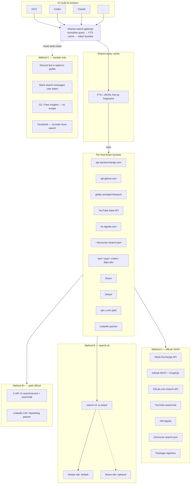

# Best search method per must-search source (10 concurrent agents)

## 1. Executive recommendation

**Do not let 10 multi-AI agents each call search-cli (or host WebSearch) independently.** search-cli’s default `general` mode fans out across Parallel + Brave + Serper + Exa + Jina + Linkup + Tavily + Perplexity. Ten agents × duplicate queries × that fan-out is the lockout path.

**Ship a shared search gateway** that all OCG/Codex/Claude workers call. One process owns keys, token buckets, and a query-normalized cache. Agents never hold provider keys.

Three method classes cover almost every source (plus paid official APIs when the free JSON path does not exist):

| Method | Role | Covers |
|---|---|---|
| **A. Official / public JSON APIs** | High precision, cheap, ToS-clean | Stack Exchange, GitHub code/issues/discussions, **GitLab.com Search API** (PAT), **YouTube Data API v3 `search.list`**, HN Algolia, Discourse `/search.json` (Cursor forum, OpenAI community, vendor `discuss.*`), npm / PyPI / crates.io / deps.dev / ecosyste.ms, Dev.to (Forem), Codeberg (Forgejo) |
| **B. search-cli aggregators + `site:`** | Recall when APIs are paid, hostile, or missing | **Default: one aggregator** — Serper-only `site:` (`-p serper`). Brave is optional on $5 credits/mo (~1k q), not every query. Dual-index is optional quality. Use `site:` for Lobsters, Product Hunt HTML, InfoQ/talks, SourceHut, Hashnode, Indie Hackers, Capterra/TrustRadius listings, Anthropic help, **LinkedIn**, **X/Twitter** (until X credits), GitLab/YouTube fallback |
| **B+. Paid official APIs** | Same gateway; expense is in-scope | **X API v2** `search/recent` + `search/all` (pay-per-usage credits). **LinkedIn** Marketing / Community Management **partner** (page-admin scoped — not global post search). Do not skip a platform because it is expensive. |
| **C. Sample-only / human** | Never crawl | Discord, Slack, G2 (ToS scrape ban), Gartner Peer Insights (login), full buyer-review dumps, **Facebook** (exclude from must-search; optional `site:facebook.com` sample) |

**Social + GitLab detail** (best method / fallback / limits / ToS / 10-agent): [SOCIAL-AND-GITLAB.md](SOCIAL-AND-GITLAB.md).

**Key pooling:** one **Serper** key (Method B default) + optional Brave key ($5 credits, not every query) + one GitHub PAT + one Stack Apps key + **one GitLab PAT** + **one YouTube Data API key**, held by the gateway. Not 10 copies. Optional second key only for GitHub (search 30 req/min is the bottleneck). Optional later: one X developer app (credits) + one LinkedIn partner token. No Facebook app in the default ring.

**Where code lives:**

- **Inside search-cli (upstream PR to [paperfoot/search-cli](https://github.com/paperfoot/search-cli)):** shared on-disk cache already exists (`src/cache.rs`); **provider allowlist already exists** as `-p` (README; fleet default **`-p serper`**). Remaining PR: `--cache-dir` for a fleet-shared path; native providers for Stack Exchange, HN Algolia, Discourse JSON, GitHub GraphQL discussions. Do **not** put G2/Discord/Nitter/LinkedIn scrapers in search-cli. Gateway policy is: always pass **one** `-p`, never default `general`. GitLab Search API + YouTube Data API belong in **SB adapters first** (not a search-cli provider in MVP). Existing modes `-m social` (xAI/Grok for X chatter) and `-m people` (Exa for person/LinkedIn-shaped lookups) are legal aggregator extras — **not** the 10-agent default.
- **SB-native adapters** (`skills/silver-deep-research/`): package registries, GitHub REST search (issues/code), **GitLab.com `/api/v4/search`**, **YouTube `search.list`**, portal catalog expansion, the gateway itself, per-host token buckets. Full/paid: X API v2 search, LinkedIn CM/Marketing after partner approval.
- **`site:` fallback:** everything else, via search-cli **one** `-p` after cache miss. **Default `-p serper`.** Brave optional (`-p brave`) on monthly credits. Do not invent `--providers` / `--no-fanout`. Templates: `site:gitlab.com`, `site:youtube.com`, `site:linkedin.com/posts`, `site:x.com OR site:twitter.com`. Facebook is sample-only, not must-search.



**In-repo today (do not treat as a channel engine yet):**

- search-cli is **external OSS**, opt-in: [docs/SEARCH-CLI.md](../../docs/SEARCH-CLI.md) → [github.com/199-biotechnologies/search-cli](https://github.com/199-biotechnologies/search-cli) (canonical tree is [paperfoot/search-cli](https://github.com/paperfoot/search-cli)).
- Orchestrator: [skills/silver-deep-research/scripts/search_orchestrator.py](../../skills/silver-deep-research/scripts/search_orchestrator.py) only **probes** `search` on PATH; it does not invoke it or cache results.
- Channels catalog **was** six coarse buckets (`web`/`academic`/`gov`/`docs`/`code`/`stats`) in [source_channels.json](../../skills/silver-deep-research/reference/catalogs/source_channels.json); **this pass added** `gitlab`/`youtube`/`x`/`linkedin`/`facebook` descriptors (proposal wiring; gateway **not** implemented).
- [authority_domains.json](../../skills/silver-deep-research/reference/catalogs/authority_domains.json): `gitlab.com` upgraded from **secondary** `code` to **primary** (with github.com). YouTube added as `video`. Facebook **not** in must-search tiers.
- Landscape portals only: GitHub `search/code?filename:SKILL.md`, skills.sh, marketplace notes ([skill_portals.json](../../skills/silver-deep-research/reference/catalogs/skill_portals.json)).
- Provenance: [UPSTREAM.md](../../skills/silver-deep-research/UPSTREAM.md), [provenance.md](../../skills/silver-deep-research/reference/provenance.md). No TopGun adapters.

---

## 2. Per-source table

Fetch date for all evidence: **2026-08-14**. “Unknown” means the official page was fetched and did not state a number.

| Source | Best method | Fallback | Free-tier / rate limit (as fetched) | 10-agent strategy | ToS notes | Evidence URL |
|---|---|---|---|---|---|---|
| **Stack Overflow / Stack Exchange** | Official SE API v2.3 `GET /search/advanced` + `key` | search-cli `site:stackoverflow.com` | **30 req/s per IP** (harsh drop). Daily quota **default 10,000** with app `key`; without `access_token`, apps on the same IP **share** that IP quota. Honor `backoff` seconds. Do not poll identical queries faster than **once/minute**. | One Stack Apps key on the gateway. Bucket ≤15 req/s. Cache by `(site, q, sort)`. | Register on Stack Apps. JSON API is the intended use. | [api.stackexchange.com/docs](https://api.stackexchange.com/docs), [docs/throttle](https://api.stackexchange.com/docs/throttle) |
| **GitHub Discussions** (not code) | GraphQL `search(type: DISCUSSION)` or web syntax `is:discussion` | Brave/Serper `site:github.com/orgs/*/discussions` | REST **search** (issues/repos/users): **30 req/min authenticated**, **10 req/min unauthenticated**. REST **code search: 10 req/min**, auth required. GraphQL primary: **5,000 points/hour/user**. Secondary: **≤100 concurrent**, **2,000 GraphQL points/min**. REST search has **no dedicated discussions endpoint** in the search REST docs. | One PAT on gateway. Prefer GraphQL for discussions so it does not steal the 30/min REST search budget used for issues. Cache aggressively. | GitHub ToS; use API not HTML scrape. | [Searching discussions](https://docs.github.com/en/search-github/searching-on-github/searching-discussions), [REST search rate limit](https://docs.github.com/en/rest/search/search#rate-limit), [GraphQL rate limits](https://docs.github.com/en/graphql/overview/rate-limits-and-node-limits-for-the-graphql-api) |
| **GitHub code / issues** | REST `GET /search/issues` and `GET /search/code` with PAT | `site:github.com` via Brave | Same as row above. Unauthenticated REST primary: **60 req/hour**. Authenticated REST primary: **5,000 req/hour** (search endpoints use the tighter per-minute caps). | Shared PAT. Serialize code search (10/min). Issues/repos share 30/min. Dedup with discussions GraphQL. | Code search requires auth. | [REST search](https://docs.github.com/en/rest/search/search), [REST rate limits](https://docs.github.com/en/rest/using-the-rest-api/rate-limits-for-the-rest-api) |
| **GitLab.com** (upgrade from secondary domain) | Official `GET /api/v4/search` with PAT; `scope` = projects, blobs, issues, merge_requests (+ wiki_blobs). Focus **gitlab.com**, not self-hosted. | search-cli `-p brave,serper` `site:gitlab.com`. Unauthenticated `GET /projects?search=` is name-only (TopGun) — not must-search coverage. | **Every Search API call requires authentication.** gitlab.com: **advanced/project/group search API 10 req/min per IP**; authenticated API **2,000 req/min/user**; unauthenticated traffic **500 req/min/IP** (does not unlock Search). PAT is free. | One PAT. Bucket **≤10 search req/min**. Cache `(scope,q)`. Four scopes per topic, serialized. | Official REST; no HTML scrape. | [Search API](https://docs.gitlab.com/api/search/), [GitLab.com settings](https://docs.gitlab.com/ee/user/gitlab_com/). Detail: [SOCIAL-AND-GITLAB.md](SOCIAL-AND-GITLAB.md) |
| **YouTube** (talks + demos) | Data API v3 `search.list` (API key). `type=video`. Then `videos.list` for duration (other-endpoint quota). | `-p brave,serper` `site:youtube.com` (weak). | **Live quota ≠ folklore:** default **100 `search.list`/day** (own bucket, **1 unit/call**) + **100 `videos.insert`/day** + **10,000 units/day other endpoints**. Reset midnight PT. Quota extension form exists — paid increase is in-scope. Official `captions.list`/`download` need **owner/CMS OAuth**, not public harvest. youtube-transcript/InnerTube = ToS risk, not default. | One API key. Cache-first. ≤100 searches/day for all 10 agents. | API Services Developer Policies. No watch-page scrape. | [search.list](https://developers.google.com/youtube/v3/docs/search/list), [quota](https://developers.google.com/youtube/v3/determine_quota_cost), [getting started](https://developers.google.com/youtube/v3/getting-started). Detail: [SOCIAL-AND-GITLAB.md](SOCIAL-AND-GITLAB.md) |
| **LinkedIn** | **No self-serve global post search.** Legal “whatever it takes”: (1) Marketing / Community Management **partner** for **pages you admin**; (2) Talent partner for jobs; (3) fleet default `site:linkedin.com/posts` + `/company` + `/pulse` via `-p brave,serper`. Sales Nav is **not** an API for us (SNAP = partner CRM). | Optional search-cli `-m people` (Exa) — aggregator, not LinkedIn-official. Not fleet default. | Partner numeric limits **unknown** (docs auth-walled). RapidAPI/unofficial scrapers = **ToS risk — not primary.** | No LI token in MVP. `site:` via shared Brave/Serper. Partner token on gateway only if approved. | [API ToS](https://www.linkedin.com/legal/l/api-terms-of-use) + [User Agreement](https://www.linkedin.com/legal/user-agreement) (2025-11-03). | [Marketing APIs](https://learn.microsoft.com/en-us/linkedin/marketing/), [CM overview](https://learn.microsoft.com/en-us/linkedin/marketing/community-management/community-management-overview?view=li-lms-2026-07). Detail: [SOCIAL-AND-GITLAB.md](SOCIAL-AND-GITLAB.md) |
| **Twitter / X** | Official v2 `GET /2/tweets/search/recent` (7 days, all developers) + `GET /2/tweets/search/all` (full archive, pay-per-use + Enterprise). **Buy credits.** | `-p brave,serper` `site:x.com OR site:twitter.com`. Optional `-m social` (xAI) — not fleet default. **Nitter:** needs real account sessions; unofficial; **not** a gateway provider. | Live: **pay-per-usage, no subscriptions.** Owned Reads **$0.001/resource**. Public search **USD/hit unknown** this pass (check console.x.com). Cap **3M Post reads/month** then Enterprise. Legacy Basic/Pro monthly SKUs **not on live pricing page**. | One app + credit balance. Cache. Prefer recent; full-archive when history is required. | Developer Agreement (fetched; updated 2026-04-27). Scrapers not primary. | [pricing](https://docs.x.com/x-api/getting-started/pricing.md), [search intro](https://docs.x.com/x-api/posts/search/introduction.md). Detail: [SOCIAL-AND-GITLAB.md](SOCIAL-AND-GITLAB.md) |
| **Facebook** | **Exclude from must-search.** Graph public post search docs **404**. Pages search finds **Pages**, not posts. CrowdTangle domain **DNS fail**; Wikipedia redirects to Meta acquisitions. Meta Content Library = academic SPA. | Optional sample: `-p brave,serper` `site:facebook.com/<page>` if the brief names a Page. Pages-you-admin Graph feed only. | No public post-search quota (product gone). Content Library access **unknown** (SPA empty). | **No Facebook bucket.** Do not buy Meta partnership for tech DR vs LinkedIn/X. | Platform Terms; no scrape. | [Pages search](https://developers.facebook.com/docs/pages/searching), [Platform Terms](https://developers.facebook.com/terms/), [Content Library](https://transparency.meta.com/researchtools/meta-content-library). **Verdict:** [SOCIAL-AND-GITLAB.md](SOCIAL-AND-GITLAB.md) §5 |
| **Lobsters** | HTML `/search` + RSS `https://lobste.rs/rss` | search-cli `site:lobste.rs` | **No official public JSON API documented.** RSS confirmed (ttl 120). `GET /search.json?q=…` returned **HTTP 400** on 2026-08-14. Numeric search rate limit: **unknown**. | Cache RSS (≤1 fetch / 2 min). HTML search only from gateway, ≤1 req/5s. Prefer `site:` for query fan-out. | Community site; do not scrape aggressively. App is [lobsters/lobsters](https://github.com/lobsters/lobsters). | [lobste.rs/about](https://lobste.rs/about), [lobste.rs/search](https://lobste.rs/search), [lobste.rs/rss](https://lobste.rs/rss) |
| **deps.dev** | Official `https://api.deps.dev/v3/` | ecosyste.ms packages API | Public research API. **Numeric rate limit not stated** on the v3 docs page as indexed. | Polite UA + cache package/version lookups. Bucket unknown → start **5 req/s** until headers say otherwise. | Intended for tool builders. | [docs.deps.dev/api/v3](https://docs.deps.dev/api/v3/) |
| **ecosyste.ms** | Official OpenAPI (CC-BY-SA-4.0) | deps.dev + npm/PyPI | **No numeric cap published.** Two pools: **polite** (mailto= or `From` / UA email) vs **common**. | Always send `mailto=` so 10 agents stay in polite pool as **one** UA identity. | Fair-use; they may contact the mailto. | [ecosyste.ms/api](https://ecosyste.ms/api) |
| **npm** | `GET https://registry.npmjs.org/-/v1/search?text=` | deps.dev | `size` default 20, max **250**. **Numeric rate limit not in REGISTRY-API.md.** | Cache by `text`. Serialize; identify UA. | Public registry API. | [npm/registry REGISTRY-API.md](https://github.com/npm/registry/blob/main/docs/REGISTRY-API.md) |
| **PyPI** | JSON API ` /pypi/<project>/json` + Index API (PEP 691) | deps.dev | **No edge rate limit** (CDN). XML-RPC may be limited. Do not do thousands of requests in minutes. Unique **User-Agent + contact**. | Serial lookups, cache project JSON. | Irresponsible use may be banned. | [docs.pypi.org/api](https://docs.pypi.org/api/) |
| **crates.io** | `GET /api/v1/crates?q=` (JSON confirmed) | deps.dev | Public search JSON works unauthenticated. **Numeric rate limit unknown** (data-access pages 404). | Cache crate search. UA required by crates.io culture (not verified on a live policy page this pass). | Use API not HTML. | Live: [crates.io/api/v1/crates?q=tokio](https://crates.io/api/v1/crates?q=tokio&per_page=1) |
| **Product Hunt** | Official GraphQL `https://api.producthunt.com/v2/api/graphql` with `access_token` | `site:producthunt.com` | OAuth token required. **No published numeric limit**; “fair-use” and they “reserve the right to rate-limit.” | One token, ≤1 req/s until 429. Cache posts. | Official API only; do not scrape. | [api.producthunt.com/v2/docs](https://api.producthunt.com/v2/docs) |
| **InfoQ + FOSDEM / QCon / KubeCon talks** | FOSDEM: [video.fosdem.org](https://video.fosdem.org/) (open recordings). KubeCon: CNCF event pages + YouTube. InfoQ/QCon: `site:infoq.com` | search-cli `academic`/`general` + YouTube `site:youtube.com/c/CNCF` | **No official talk-search API found** for InfoQ/QCon. FOSDEM video index is public. Numeric limits: **unknown**. | Gateway caches talk title lists. Prefer `site:` not HTML crawl. | Respect robots; YouTube ToS for scrape. | [infoq.com](https://www.infoq.com/), [infoq.com/qcon](https://www.infoq.com/qcon/), [video.fosdem.org](https://video.fosdem.org/), [cncf.io kubecon](https://www.cncf.io/kubecon-cloudnativecon-events/) |
| **SourceHut** | `site:sr.ht` via Brave/Serper | SourceHut GraphQL (docs URL 404 this pass) | [man.sr.ht](https://man.sr.ht/) exists. `man.sr.ht/api-conventions.md` and `git.sr.ht/api.md` returned **404**. Numeric API limits: **unknown**. | Use `site:` until current API man page is located. One gateway identity. | Do not scrape git.sr.ht HTML. | [man.sr.ht](https://man.sr.ht/) |
| **Codeberg** | Forgejo API (`/api/swagger` live) `GET /api/v1/repos/search` | `site:codeberg.org` | Swagger UI confirmed. **Numeric rate limit not extracted** from swagger HTML. | Token optional for public search. Cache. Bucket start **2 req/s**. | Forgejo API is the intended integration. | [codeberg.org/api/swagger](https://codeberg.org/api/swagger) |
| **Dev.to** | Forem API v1 `GET /api/articles` (+ search endpoints in OpenAPI) | `site:dev.to` | Large OpenAPI published. **Numeric rate limit not found** in indexed docs. | One UA; cache articles by tag/q. | Forem docs: two API versions (v0/v1). | [developers.forem.com/api](https://developers.forem.com/api) |
| **Hashnode** | **`site:hashnode.com` via Brave/Serper** | Hashnode GraphQL (now paid) | gql.hashnode.com banner: **free GraphQL retired; Pro required**. Numeric Pro limits: **unknown**. | Do not put a Hashnode token in the free path. Aggregator `site:` is the free method. | Paid API for official GraphQL. | [gql.hashnode.com](https://gql.hashnode.com/) |
| **Papers with Code** | Treat as **sunset/redirect**. Use search-cli `-m academic` + Hugging Face Papers + arXiv | `site:huggingface.co/papers` / `site:arxiv.org` | `paperswithcode.com/api/v1/docs/` **redirected to Hugging Face Trending Papers** on fetch. PwC REST is not a reliable must-search endpoint as of 2026-08-14. | Academic mode on search-cli (Exa+Serper+Tavily+Perplexity) **once** per query via gateway. | Do not depend on PwC JSON. | [paperswithcode.com/api/v1/docs](https://paperswithcode.com/api/v1/docs/) |
| **Per-vendor Discourse** (`discuss.*` / `community.*`) | `GET https://<host>/search.json?q=` (no auth for public) | search-cli `site:<host>` | Confirmed JSON: [meta.discourse.org/search.json](https://meta.discourse.org/search.json?q=search.json%20api) and [forum.cursor.com/search.json](https://forum.cursor.com/search.json?q=api). Discourse API docs page rendered empty (SPA). **Numeric public search.json limit: unknown.** | Per-host buckets (Cursor, OpenAI, each vendor). Cache. Start **1 req/2s/host**. | Public JSON is a Discourse convention; still honor robots.txt per host. Official API also exists behind API keys. | Live JSON + [docs.discourse.org](https://docs.discourse.org/) (SPA, no body) |
| **Discord** | **Sample only:** official bot in **opted-in guilds**; parse `X-RateLimit-*` | Do **not** `site:discord.com` scrape | Per-route + **global** limits; **do not hardcode**. 429 + `retry_after`. | One bot token. Never 10 bots. Human/sample transcripts, not crawl. | Unofficial clients / self-bots violate Developer Policy. | [Rate limits](https://discord.com/developers/docs/topics/rate-limits), [Developer Policy](https://discord.com/developers/docs/policies-and-agreements/developer-policy) |
| **Slack** | **Sample only:** `search.messages` with **user** token `search:read` | No public crawl | **Tier 2: 20+ per minute**. Workspace-scoped only. | One workspace token if the user opts in. Not a global channel. | Cannot search Slack-at-large. | [search.messages](https://api.slack.com/methods/search.messages), [rate limits](https://api.slack.com/docs/rate-limits) |
| **Cursor forum** | Discourse `/search.json` | `site:forum.cursor.com` | Same as Discourse row. JSON confirmed 2026-08-14. | Own host bucket. | Public forum. | [forum.cursor.com/search.json](https://forum.cursor.com/search.json?q=api) |
| **Claude / Anthropic help** | `site:support.claude.com` or `site:support.anthropic.com` via Brave | Manual Intercom browse | Help center is **Intercom**, not Discourse. **No search.json.** | Aggregator only. | Do not scrape Intercom HTML. | [support.anthropic.com](https://support.anthropic.com/en/) |
| **OpenAI Codex / ChatGPT community** | Discourse `community.openai.com/search.json` (same convention; homepage is Discourse) | `site:community.openai.com` | Assume Discourse public search.json; **numeric limit unknown**. Confirm `/search.json` before relying. | Own host bucket. | Public community. | [community.openai.com](https://community.openai.com/) |
| **Indie Hackers** | `site:indiehackers.com` via Brave/Serper | None official | Homepage fetched. **robots.txt HTTP 403**. **No public search API found.** | Aggregator only; cache. | Do not hammer HTML (403 robots). | [indiehackers.com](https://www.indiehackers.com/) |
| **G2** | **Do not scrape.** Optional: licensed aggregator `site:g2.com` **if** aggregator ToS allows; else skip or human sample | None | robots.txt allows many paths but **ToS §9 Prohibited Automated Access, Scraping, and Data Extraction** (updated 2026-07-09). | Method C. One or two `site:` queries via Brave is recall-only, not a crawl. | **Scraping/automated extraction prohibited.** | [legal.g2.com/terms-of-use](https://legal.g2.com/terms-of-use), [g2.com/robots.txt](https://www.g2.com/robots.txt) |
| **Gartner Peer Insights** | Public browse + `site:gartner.com/reviews` | Human/login | Marketing page: **880,000+ free verified ratings**. **No public search API found.** Full text often login-walled. **Not** paywalled Magic Quadrant. | Method C + light `site:`. | Do not scrape login walls. | [gartner.com/reviews/home](https://www.gartner.com/reviews/home) |
| **TrustRadius** | `site:trustradius.com` **excluding** `/search` and `/api` | Human | robots: `Disallow: /api/`, `/search/`. | Aggregator on product pages only. | Do not hit `/search` or `/api`. | [trustradius.com/robots.txt](https://www.trustradius.com/robots.txt) |
| **Capterra** | `site:capterra.com` product/review URLs | Human | robots: **`Disallow: /search`**. | Aggregator on `/p/` style pages, not their search UI. | Do not fetch `/search`. | [capterra.com/robots.txt](https://www.capterra.com/robots.txt) |
| **Reddit** | Official Data API OAuth (`search` / listing) | Brave/Serper `site:reddit.com` (not scrape) | Free access: **100 QPM per OAuth client id** (average over 10 min). Headers: `X-Ratelimit-*`. **Traffic without OAuth is blocked.** Pullpush HTTP **403** this pass; Arctic Shift page loaded (third-party archive — ToS/legal risk; **do not** make it default). | One OAuth client on gateway = 100 QPM for **all 10 agents**. Cache. `site:` if no Reddit app. | Commercial use has extra Reddit terms (wiki). Archives are not official. | [Reddit Data API Wiki](https://support.reddithelp.com/hc/en-us/articles/16160319875092-Reddit-Data-API-Wiki) |
| **Hacker News** | **HN Algolia** `GET https://hn.algolia.com/api/v1/search?query=` | `site:news.ycombinator.com` | Public JSON **works unauthenticated** (fetched). **hn.algolia.com/api HTML did not publish a numeric cap** (page nearly empty). | Gateway cache. Start **≤1 req/s**. Do not send 10 agents at Algolia. | Unofficial but long-standing public API. | Live: [hn.algolia.com/api/v1/search](https://hn.algolia.com/api/v1/search?query=rate%20limit&hitsPerPage=1), [hn.algolia.com/api](https://hn.algolia.com/api) |

### Aggregator free tiers (Method B — pick 1–2, not 5)

| Aggregator | Role in SB | Free / published limit (2026-08-14) | 10-agent note | Evidence |
|---|---|---|---|---|
| **Brave Search API** | Optional `site:` (credits) | **$5 free credits / month**; Search plan **$5 per 1,000 requests**. QPS for Lite **not stated** on the marketing page as indexed (search-cli README historically implies 1 QPS — **do not treat that as Brave-official**). | Optional. Do **not** hit Brave on every query — credits ≈ 1k q/mo. Gateway pins **one** `-p`. | [brave.com/search/api](https://brave.com/search/api/) |
| **Serper** | **Method B default** Google SERP + `site:` | **“Get 2,500 free queries”** / “Try 2,500 queries for free” (no card). **300 QPS is the Ultimate paid plan** ($3750 / 12.5M credits), not the free trial. The $1250 plan lists **200 QPS**. Free-trial QPS **not stated**. Live Google (no cache). Published packs (2026-08-15): **$1/1k**, **$50/50k**. | One key. Pin `-p serper` for `site:` recall. Dual-index with Brave is optional quality, not required. | [serper.dev](https://serper.dev/) |
| **Exa** | Semantic / related | **/search 10 QPS**, /contents 100 QPS, /answer 10 QPS. Pricing is per 1k requests (Search **$7/1k** with up to 10 results). **Free request quota not listed** on pricing page. | Optional. Academic/related only. Do not put on the default `general` path for 10 agents. | [docs.exa.ai rate limits](https://docs.exa.ai/reference/rate-limits), [exa.ai/pricing](https://exa.ai/pricing) |
| **Tavily** | Optional extract/search | **1,000 free credits/month**, no card. Basic search **1 credit**, advanced **2**. | Optional. Already in search-cli; keep off default fan-out. | [docs.tavily.com api-credits](https://docs.tavily.com/documentation/api-credits) |
| **Parallel / You.com** | Optional breadth | Parallel docs exist ([docs.parallel.ai](https://docs.parallel.ai/)). You.com markets Search APIs ([you.com](https://you.com/)). **Free-tier numbers not extracted** this pass. | search-cli already lists Parallel on `general`. **Turn off for fleet mode.** | Parallel + You.com homepages |
| **Jina** | Extract | search-cli README claims **500 RPM free** (cite as search-cli, not Jina-official this pass). | Extract-on-demand after a hit, not every search. | [paperfoot/search-cli README](https://raw.githubusercontent.com/199-biotechnologies/search-cli/master/README.md) |

**Dedicated vs generic web:** GitHub, **GitLab.com Search API**, Stack Exchange, HN Algolia, Discourse JSON, package registries, and **YouTube `search.list`** beat `site:` on precision and quota. Reddit OAuth beats `site:reddit.com` when a client exists. **X** beats `site:x.com` when credits are budgeted. **LinkedIn** has no self-serve global post API — `site:` is the honest fleet default until a partner token exists. **Facebook is excluded from must-search.** Everything buyer-review / Intercom / Hashnode-free / PwC-dead should stay on aggregators or Method C.

---

## Cost at DR volume

Fetch / synthesis: **2026-08-14** (quota lines in this file) and **2026-08-15** (volume arithmetic). Unit prices from [brave.com/search/api](https://brave.com/search/api/) and [serper.dev](https://serper.dev/). Do **not** invent X $/hit or YouTube extra-quota invoices. The 2026-08-14 fetch of `serper.dev/pricing` 404'd; pack prices below are from the serper.dev homepage on the 2026-08-15 cost pass.

**Volume:** 3–4 full gateway DR runs/day × 20 days/month = **60–80 runs/mo**. Typical web budget in the dual-index sketch was **125 Brave + 50 Serper per run**.

### Brave vs Serper

**Paying both is not unavoidable.** Official JSON (Method A) covers precision. Aggregators are for `site:` recall only. Dual-index is optional quality. The gateway should pin **one** `-p` (existing search-cli flag). Do **not** invent `--providers` / `--no-fanout`.

**Most cost-effective default: Serper-only `site:`** — about **$10/mo** at 10k web queries, **~$13/mo** at 13k (published **$1/1k**; **$50/50k** pack). The Brave+Serper split was **~$36–$49/mo** (about **3–4×** Serper-only). Keep Brave **optional** on **$5 credits/mo** (~1k queries), not on every query.

**60–80 runs published $ (gateway path):**

| Channel | Published $ at 60–80 runs/mo | Notes |
|---|---|---|
| **Brave** (if still on Brave volume) | **$32.50–$45** after $5 credits | $5/1k Search plan; credits ≈ 1k q/mo. [brave.com/search/api](https://brave.com/search/api/) |
| **Serper** | **$3–4** unit, or **$50** pack | Dual-index 50 q/run; Serper-only web is the $10–13 line above. $1/1k, $50/50k. [serper.dev](https://serper.dev/) |
| **YouTube Data API** | **$0** published | Default **100 `search.list`/day** (this file §2). 3–4 runs/day need **165–220 `search.list`** → **quota increase form required day 1**. Do not invent extra-quota invoice $. |
| **X API v2 search** | **$/hit unknown** | Pay-per-usage confirmed; public-search dollar-per-hit **not extracted**. Do not invent. |
| **LinkedIn** | Cannot buy global search | No self-serve global post API. Partner is page-admin scoped. |
| **SE / GH / GitLab / HN / Reddit / Discourse / registries** | **$0** | GitLab.com Search API is a **10 req/min** clock, not a bill. |

**10× search-cli `general` fan-out:** about **$1.6k–$2.1k+/mo** on known aggregators. **Do not do this.** Ten agents × default `general` (Parallel + Brave + Serper + Exa + Jina + Linkup + Tavily + Perplexity) is the lockout *and* the cost bomb.

**What aggregators cannot replace:**

- YouTube Data API **quota extension form** (default 100 `search.list`/day is below 165–220).
- X official search — unpublished **$/hit**.
- LinkedIn — **no self-serve** global post search.
- **G2** — ToS §9 bans automated access/scraping/extraction.

Method B default in the architecture is **one aggregator** (`-p serper`). Brave stays on the token-bucket diagram as optional.

---

## 3. search-cli augmentation proposal

**Identity:** External OSS, not in this repo. SB documents [github.com/199-biotechnologies/search-cli](https://github.com/199-biotechnologies/search-cli); GitHub API trees resolve to **[paperfoot/search-cli](https://github.com/paperfoot/search-cli)** (`master`). Install: `brew tap 199-biotechnologies/tap && brew install search-cli`.

**Already there (do not reinvent):**

| Touchpoint | What it does |
|---|---|
| `src/auth.rs` | Provider keys (`BRAVE_API_KEY`, `SERPER_API_KEY`, `EXA_API_KEY`, `TAVILY_API_KEY`, `PARALLEL_API_KEY`, …) |
| `src/cache.rs` | Local result cache (per-process / per-user today) |
| `src/config.rs` | `search config set keys.brave` |
| `src/doctor.rs` | `search doctor --json` (each check **bills** a minimal request) |
| Modes | `general` (wide fan-out), `news`, `academic`, `scholar`, `deep`, `extract`/`scrape`, … |
| `-p` / `-m` | **Already ships:** `search search -q "…" -p serper` (README `-p`). Pin **one** provider. Do not invent `--providers`. |
| `search "q" --json -c 10` | SB SKILL already documents this |
| `search usage --json` | Credits for SerpApi, Firecrawl, Tavily, Linkup, xAI, Brave headers |

**Gaps for a 10-agent fleet:**

1. **Fan-out is the default** if you omit `-p`. `general` is a multi-provider web search (README diagram: Brave + Serper + Exa in parallel; binary lists 13 providers). Fleet mode must **require one `-p`** (default **`-p serper`**; optional `-p brave`). A `--no-fanout` alias is optional sugar, not a missing primitive. Do not invent `--providers` / `--no-fanout`.
2. **Cache is not fleet-shared.** Point `--cache-dir` at `.planning/research/_search-cache/` (or a socket to the gateway). This flag is the real upstream add.
3. **No first-class `site:` helper** in SB docs (operators can pass `site:` in the query string today).
4. **No native Stack Exchange / HN Algolia / Discourse / GitHub Discussions providers** — those belong either as search-cli providers **or** SB adapters (prefer SB adapters first; PR upstream once stable). **Same for GitLab Search API and YouTube Data API** — SB gateway first, not a search-cli flag in this pass.
5. `search doctor` must **not** run per-agent (10× billed probes).
6. search-cli **already** has `-m social` (xAI) and `-m people` (Exa). Useful extras; **not** fleet default (`-p serper` still required). Do not invent `--providers` / `--no-fanout`.

**Proposed upstream flags / providers (PR to paperfoot/search-cli):**

```text
# README-confirmed form (JSON is auto when piped; `usage --json` / `doctor --json` exist):
search search -q 'site:lobste.rs <topic>' -p serper
# optional second index, not default:
search search -q 'site:lobste.rs <topic>' -p brave
# -p already exists; --cache-dir is the proposed add (not in README this pass)
search search -q '…' -p serper --cache-dir "$SB_SEARCH_CACHE"
# invented-proposed only (do not treat as shipping): --provider is not a live flag
search --provider stackexchange --site stackoverflow --json
```

Code touchpoints: provider routing registry (README: same registry as `search agent-info`), `src/auth.rs` (new env keys `STACKEXCHANGE_KEY`, none for HN), `src/cache.rs` (shared dir + hash of `provider+query+count`).

**Do not add to search-cli:** G2/Capterra scrapers, Discord/Slack crawlers, Reddit without OAuth, Pullpush, Nitter, RapidAPI LinkedIn scrapers, InnerTube YouTube transcript harvesters.

---

## 4. SB DR engine wiring proposal (skills/, not implement)

Keep search-cli as **opt-in web breadth**. Add a **channel router** in SB so landscape *and* non-landscape research can hit must-search sources.

| Artifact | Change |
|---|---|
| [search-orchestration.md](../../skills/silver-deep-research/reference/search-orchestration.md) | Insert gateway: classify → **cache** → official adapter **or** `search -p serper` → relevance_gate. Portals stay landscape-only. |
| [search_orchestrator.py](../../skills/silver-deep-research/scripts/search_orchestrator.py) | Today only `probe_search_cli()`. Add: invoke gateway CLI, record `channels_attempted`, never spawn 10 search-cli processes. |
| New `reference/catalogs/must_search_channels.json` | One descriptor per row in §2 (`method: official_api \| search_cli_site \| sample_only`, `host`, `bucket_rps`, `fallback`). |
| [source_channels.json](../../skills/silver-deep-research/reference/catalogs/source_channels.json) | Add `stackoverflow`, `hn`, `discourse`, `registries`, `reddit`, `github_discussions`, **`gitlab`**, **`youtube`**. LinkedIn/X as `search_cli_site` / paid. Facebook `sample_only` / `must_search: false`. |
| [authority_domains.json](../../skills/silver-deep-research/reference/catalogs/authority_domains.json) | **`code` tier secondary → primary** (`github.com`, `gitlab.com`). Add `video` (youtube.com). Do **not** add facebook.com to must-search tiers. |
| [skill_portals.json](../../skills/silver-deep-research/reference/catalogs/skill_portals.json) | Keep landscape skill registries. Do **not** overload with HN/SE. |
| New `scripts/search_gateway.py` (or small Go/Rust sidecar) | Shared cache + token buckets + key ring. Unix socket or `127.0.0.1`. All hosts (Cursor/Claude/Codex) call this. |
| `run_manifest.json` | Record `gateway_hits`, `cache_hits`, `provider_failures`, remaining quotas (`search usage` once per run, not per agent). |
| SKILL.md Search-Cli Policy | Require existing `-p` allowlist in deep/ultradeep; forbid default `general` fan-out when `SB_DR_FLEET=1`. |

**Multi-AI (OCG / Codex / Claude) same channel:** workers receive `SEARCH_GATEWAY_URL` only. They do not read `BRAVE_API_KEY`. Duplicate questions collapse in FTS (normalize: lowercase, strip `site:` order, stem). One cache hit serves all 10.

---

## 5. Minimum viable vs full must-search

### MVP (covers most evidence with least lockout risk)

1. **Shared gateway + query cache** (even a directory of JSON files + flock).
2. **search-cli** with **Serper-only `site:`** via existing `-p serper`. Keep Brave optional (`-p brave`) on monthly credits — not dual-index every query.
3. **Stack Exchange API** (free 10k/day key).
4. **GitHub PAT:** REST issues/code + GraphQL discussions.
5. **HN Algolia** (no key).
6. **Discourse `/search.json`** for Cursor + OpenAI + a vendor list.
7. **Package registries:** npm search + PyPI JSON + crates.io search + deps.dev (polite UA).
8. **Reddit:** OAuth client if available; else `site:reddit.com` via Serper.
9. **GitLab.com Search API** (one PAT; 10 req/min search bucket) — first-class, not a weak `site:` afterthought.
10. **YouTube Data API v3 `search.list`** (one API key; 100 searches/day default — cache hard). Talks/demos.

This MVP already beats generic-web-only DR on SO, GH, **GitLab**, HN, vendor forums, packages, and **YouTube talks**.

### Full must-search (after MVP)

- Forem (Dev.to), Codeberg Forgejo search, ecosyste.ms polite pool.
- Product Hunt GraphQL token.
- Academic mode (Exa/Tavily) for papers; **drop PwC**.
- Talks: FOSDEM video index + CNCF/`site:infoq.com` **plus** YouTube API (MVP-adjacent above).
- SourceHut once API man pages resolve; until then `site:sr.ht`.
- Hashnode: stay on `site:` unless Pro GraphQL is budgeted.
- Buyer reviews: **light `site:` only**; no scrapers.
- Discord/Slack: explicit opt-in sample, never default.
- **X API v2** credits: `search/recent` then `search/all` (paid official — in-scope).
- **LinkedIn** Marketing/Community Management partner token if a named Page program is budgeted; until then `site:linkedin.com` only.
- **Facebook:** **not** in full must-search. Sample/`site:` only. See [SOCIAL-AND-GITLAB.md](SOCIAL-AND-GITLAB.md).

---

## 6. Honest gaps / blockers

| Gap | Reality |
|---|---|
| **Facebook** | Graph `/search` docs **404**. CrowdTangle DNS dead. Content Library is academic. **Exclude from must-search**; LinkedIn/X cover tech discourse. |
| **LinkedIn global posts** | No self-serve search API. Partner CM is page-admin scoped. RapidAPI scrapers = ToS risk. |
| **X public-search USD/hit** | Pay-per-usage confirmed; per-resource search price **not extracted** from pricing.md tables this pass. |
| **X Basic/Pro monthly SKUs** | **Not on live pricing page** (credits replaced subscriptions). Do not cite stale $100/$5k. |
| **YouTube folklore quota** | Live default is **100 search.list/day at 1 unit**, not “100 units × 10k pool”. |
| **Nitter** | Requires real account sessions; unofficial; not a gateway path. |
| **G2** | ToS §9 bans automated access/scraping/extraction. robots.txt is not permission. Anti-bot + legal. Use human sample or skip. |
| **Gartner Peer Insights** | Browse exists; full reviews often login. No API found. Not MQ (good), still not crawlable. |
| **TrustRadius / Capterra** | robots **Disallow `/search`** (and TR `/api/`). `site:` on product pages only. |
| **Discord** | No global search. Official API is guild-scoped; unofficial clients forbidden. Sample, don’t crawl. |
| **Slack** | `search.messages` is **one workspace**, Tier 2 (~20+/min), user token. |
| **Papers with Code** | API docs URL now Hugging Face papers UI. Do not build a PwC client. |
| **Hashnode GraphQL** | Free API retired; Pro. |
| **Indie Hackers** | No API; robots.txt 403. |
| **Lobsters JSON** | `/search.json` 400; RSS + HTML + `site:` only. |
| **SourceHut API man pages** | 404 this pass. |
| **Product Hunt numeric limits** | Unpublished; fair-use only. |
| **HN Algolia numeric limits** | Docs page empty; treat as undocumented. |
| **deps.dev / npm / crates numeric limits** | Not on fetched pages. |
| **Forem / Forgejo numeric limits** | Not extracted. |
| **Pullpush** | HTTP 403. Do not depend. **Arctic Shift** is a third-party Reddit archive — legal/ToS risk vs official 100 QPM API. |
| **search-cli `general` mode** | Dangerous under 10 agents until fan-out is disabled. |
| **GraphQL docs SPA** | GitHub `SearchType` enum page did not render; discussions search is still documented via the **Searching discussions** UI/API qualifiers (`is:discussion`). |

**Contrarian note:** Adding every aggregator (Brave+Serper+Exa+Tavily+Parallel+Perplexity) looks “top-3 DR” and will **lose** to a smaller engine that caches and uses official APIs. Quota discipline beats provider count.

---

## 7. Sources fetched 2026-08-14 / 2026-08-15

Official / primary:

- https://api.stackexchange.com/docs
- https://api.stackexchange.com/docs/throttle
- https://docs.github.com/en/graphql/overview/rate-limits-and-node-limits-for-the-graphql-api
- https://docs.github.com/en/rest/using-the-rest-api/rate-limits-for-the-rest-api
- https://docs.github.com/en/rest/search/search
- https://docs.github.com/en/search-github/searching-on-github/searching-discussions
- https://hn.algolia.com/api and live `/api/v1/search`
- https://brave.com/search/api/
- https://api-dashboard.search.brave.com/app/documentation/web-search/get-started
- https://serper.dev/
- https://docs.exa.ai/reference/rate-limits
- https://exa.ai/pricing
- https://docs.tavily.com/documentation/api-credits
- https://docs.tavily.com/documentation/api-reference/endpoint/search
- https://meta.discourse.org/search.json
- https://forum.cursor.com/search.json
- https://api.producthunt.com/v2/docs
- https://lobste.rs/about https://lobste.rs/search https://lobste.rs/rss
- https://docs.deps.dev/api/v3/
- https://ecosyste.ms/api
- https://github.com/npm/registry/blob/main/docs/REGISTRY-API.md
- https://docs.pypi.org/api/
- https://crates.io/api/v1/crates?q=tokio&per_page=1
- https://developers.forem.com/api
- https://gql.hashnode.com/
- https://paperswithcode.com/api/v1/docs/
- https://codeberg.org/api/swagger
- https://man.sr.ht/
- https://support.reddithelp.com/hc/en-us/articles/16160319875092-Reddit-Data-API-Wiki
- https://discord.com/developers/docs/topics/rate-limits
- https://discord.com/developers/docs/policies-and-agreements/developer-policy
- https://api.slack.com/methods/search.messages
- https://legal.g2.com/terms-of-use
- https://www.g2.com/robots.txt
- https://www.capterra.com/robots.txt
- https://www.trustradius.com/robots.txt
- https://www.gartner.com/reviews/home
- https://github.com/paperfoot/search-cli
- https://raw.githubusercontent.com/199-biotechnologies/search-cli/master/README.md
- https://docs.gitlab.com/api/search/
- https://docs.gitlab.com/ee/user/gitlab_com/
- https://developers.google.com/youtube/v3/docs/search/list
- https://developers.google.com/youtube/v3/determine_quota_cost
- https://developers.google.com/youtube/v3/getting-started
- https://developers.google.com/youtube/v3/docs/captions/list
- https://developers.google.com/youtube/terms/developer-policies
- https://docs.x.com/x-api/getting-started/pricing.md
- https://docs.x.com/x-api/posts/search/introduction.md
- https://docs.x.com/x-api/posts/search-recent-posts.md
- https://learn.microsoft.com/en-us/linkedin/marketing/
- https://www.linkedin.com/legal/l/api-terms-of-use
- https://www.linkedin.com/legal/user-agreement
- https://developers.facebook.com/docs/pages/searching
- https://developers.facebook.com/terms/
- https://transparency.meta.com/researchtools/meta-content-library
- https://github.com/zedeus/nitter

Addendum: [SOCIAL-AND-GITLAB.md](SOCIAL-AND-GITLAB.md). Cost addendum (2026-08-15): volume arithmetic from this file’s quota lines + [brave.com/search/api](https://brave.com/search/api/) + [serper.dev](https://serper.dev/). Do not invent X $/hit or YouTube extra-quota invoices.

Failed / incomplete fetches (do not invent from them): Product Hunt OAuth apps HTML, Serper `/pricing` 404, Brave `/search/api/pricing/` 404, Pullpush 403, Reddit `/dev/api/` 403, Hashnode apidocs DNS fail, SourceHut API markdown 404, crates.io data-access 404, Indie Hackers robots 403, Discourse docs SPA empty, GitHub GraphQL queries SPA thin, Graph API `/search` 404, CrowdTangle DNS ENOTFOUND, LinkedIn Posts API / SNAP auth-walled, X public-search dollar-per-hit unknown, Meta Content Library body empty SPA.
